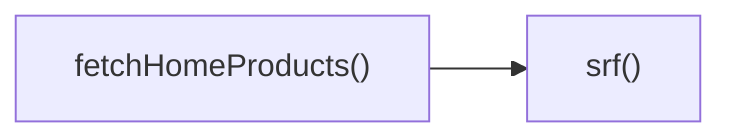

## Genel Bakış
src/lib/productsApi.ts, VentHub HVAC projesinde ürünlerle ilgili tüm API iletişimini yöneten merkezi bir servis modülüdür. Uygulamanın farklı bölümlerinin ürün verilerine güvenli ve yapılandırılmış bir şekilde erişmesini sağlayarak, backend ile iletişim kurma işlemlerini tek bir noktada toplar.

## Fonksiyon Grupları
### Temel API İstemcisi
Modül içindeki tüm dış istekler için ortak altyapıyı sunan, adres ve parametreleri alarak standart API çağrıları yapan temel işlevi barındırır. Modüldeki diğer tüm işlevler bu temel işlevi kullanarak istek gönderir.
- srf

### Spesifik Ürün Verisi Çekme İşlevleri
Uygulamanın belirli sayfaları için ihtiyaç duyulan özel ürün verilerini getirmek üzere temel API istemcisini kullanan işlevleri içerir. Özellikle ana sayfa için istenen sayıda ürün listesini çekmek üzere tasarlanmıştır.
- fetchHomeProducts

---

## AXIOMS – Mimari Varsayımlar
Bu modül, VentHub HVAC platformunun ürün servisi ile iletişim kurarak ana sayfa ürünlerini listelemek amacıyla geliştirilmiş dış API istemci modülüdür. Doğru çalışması için aşağıdaki koşulların varlığı zorunludur.

[Aksiyom 1]: Eğer modül içinde tanımlanan BASE sabiti (API temel adresi) geçerli, erişilebilir bir URL olarak tanımlanmamışsa, tüm servis çağrıları başarısız olur, hiçbir ürün verisi getirilemez.
[Aksiyom 2]: Eğer modül içinde tanımlanan KEY sabiti (geçerli API erişim anahtarı) yetkili bir kimlik bilgisi olarak tanımlanmamışsa, ürün servisine yapılan tüm istekler yetkisiz erişim hatası alır, veri çekme işlemi gerçekleşemez.
[Aksiyom 3]: Eğer fetchHomeProducts fonksiyonuna parametre olarak geçirilen limit değeri geçerli pozitif bir sayı değilse, srf fonksiyonuna gönderilen istek parametreleri bozuk olur, servisten hatalı yanıt alınır veya hiç yanıt dönmez.
[Aksiyom 4]: Eğer modül içindeki srf fonksiyonu, aldığı path ve params parametrelerini standart bir HTTP isteğine dönüştüremezse, modülün tüm dış servis iletişimi kopar, kullanıcılara hiçbir ürün listesi iletilemez.
[Aksiyom 5]: Eğer fetchHomeProducts fonksiyonu tarafından çağrılan srf fonksiyonu modül kapsamında erişilebilir değilse, ana sayfa ürünlerini getirme işlemi çalışmaz, kullanıcılara boş veya hatalı içerik sunulur.

---

## FONKSIYON DETAYLARI

### srf
**Ne yapar**: Ürün API'si içindeki tüm veri çekme işlemlerinde temel olarak kullanılan genel amaçlı düşük seviyeli HTTP isteği sarmalayıcı fonksiyonudur. Farklı API uç noktalarına standart formatta istek gönderilmesini sağlayarak kod tekrarını önler.
**Nasıl yapar**: Gelen hedef API yolu ve istek parametrelerini standart formata dönüştürerek HTTP isteği oluşturur, tüm istekler için tek bir merkezden yönetim imkanı sunar. Üst seviye özel veri çekme fonksiyonları tarafından temel istek katmanı olarak kullanılır.
**Parametreler**:
- path: string — İsteğin gönderileceği API uç noktasının (endpoint) yolu, göreli veya mutlak yol formatında olabilir
- params: Record<string, string | number | boolean | string[]> — İsteğe eklenecek sorgu parametreleri, istek gövdesi verileri, kimlik doğrulama bilgileri gibi tüm ek verileri içeren anahtar-değer nesnesi, farklı türlerde değerleri destekleyerek esnek kullanım sunar
**Dönüş**: Promise<Response> — Oluşturulan HTTP isteğinin yanıtını içeren Promise nesnesi, isteğin başarılı olması durumunda tam HTTP yanıt nesnesiyle, başarısız olması durumunda hata nesnesiyle çözülür

### fetchHomeProducts
**Ne yapar**: Uygulama ana sayfasında görüntülenmek üzere ihtiyaç duyulan tüm ürün verilerini Supabase REST API üzerinden doğrudan çeken özel fonksiyondur. Hem ana sayfada öne çıkarılacak özel ürünleri hem de genel kategorideki aktif ürünlerin listesini tek bir işlemde getirerek arayüzün hızlı yüklenmesini destekler.
**Nasıl yapar**: Ana sayfa rotasının başlangıç paket boyutunu küçültmek amacıyla tam kapsamlı `supabase-js` istemcisini kullanmaktan kaçınır, doğrudan Supabase REST API çağrıları yapar. Öne çıkarılmış ürünleri en fazla 6 adet olacak şekilde çeker, ardından limit parametresiyle belirtilen sayıda genel aktif ürünü getirir. Herhangi bir ürün listesi için yapılan HTTP isteği başarısız olursa hata fırlatır.
**Parametreler**:
- limit: number — Genel aktif ürün listesinden getirilecek maksimum ürün sayısını belirtir, varsayılan olarak 36 değerini kullanır
**Dönüş**: { featured: Array<object>, list: Array<object> } — İki adet ürün dizisi içeren nesne, `featured` anahtarı en fazla 6 adet öne çıkarılmış ürünü içeren dizi, `list` anahtarı limit parametresinde belirtilen sayıda genel aktif ürünü içeren diziyi barındırır. Herhangi bir API çağrısının başarısız olması halinde Error türünde hata fırlatır

---

## INTERFACES

### LiteProduct
- `id: string`
- `name: string`
- `image_url?: string | null`
- `brand?: string | null`
- `sku?: string | null`
- `slug?: string | null`

---

## SABİTLER
- **BASE** [env-backed] (binary_expression) — `process.env.NEXT_PUBLIC_SUPABASE_URL || ''`
- **KEY** [env-backed] (binary_expression) — `process.env.NEXT_PUBLIC_SUPABASE_ANON_KEY || ''`

---

## AST POINTERS

### [N1_NASIL] AST Pointer: src/lib/productsApi.ts::srf
- **params**: (path: string, params: Record<string, string | number | boolean | string[]>)
- **ic_degiskenler**:
  - `usp` — URLSearchParams nesnesi, API isteği sorgu parametrelerini toplamak ve standart formata dönüştürmek için kullanılır
  - `k` — params nesnesinin Object.entries metoduyla elde edilen her anahtar, işlenen parametrenin adını temsil eder
  - `v` — params nesnesinin her anahtarına karşılık gelen değeri, işlenen parametrenin değerini temsil eder
  - `vv` — dizi tipindeki v değerlerinin içindeki her öğe, dizi halindeki parametrelerin tekil değerlerini temsil eder
  - `url` — BASE sabiti, path parametresi ve usp ile oluşturulan tam HTTP istek URL'si
  - `BASE` — API istekleri için taban adresi sağlayan sabit, tam URL oluşturulmasında kullanılır
  - `KEY` — Kimlik doğrulama için kullanılan API anahtarı sabiti, istek başlıklarında yetkilendirme için kullanılır
- **Dönüş**: Promise<Response>

### [N2_NASIL] AST Pointer: src/lib/productsApi.ts::fetchHomeProducts
- **params**: (limit: number = 36)
- **ic_degiskenler**:
  - `featuredRes` — srf fonksiyonundan öne çıkan ürünler isteği için alınan HTTP yanıt nesnesi
  - `featuredRes.ok` — Öne çıkan ürünler isteğinin başarılı olup olmadığını kontrol eden Response nesnesi özelliği
  - `featured` — featuredRes yanıtından parse edilen JSON verisi, LiteProduct tipinde öne çıkan ürünler listesi
  - `listRes` — srf fonksiyonundan genel ürün listesi isteği için alınan HTTP yanıt nesnesi
  - `listRes.ok` — Genel ürün listesi isteğinin başarılı olup olmadığını kontrol eden Response nesnesi özelliği
  - `list` — listRes yanıtından parse edilen JSON verisi, LiteProduct tipinde genel ürünler listesi
- **Dönüş**: { featured: LiteProduct[], list: LiteProduct[] } içeren nesne

---

## ÇAĞRI HARİTASI

### Disariya Cagrilar (Outgoing)
Sadece dosya içindeki `fetchHomeProducts()` fonksiyonu, aynı dosyada tanımlı `srf` fonksiyonunu çağırmaktadır, başka bir fonksiyon çağrısı kaydedilmemiştir.

### Disaridan Cagrilanlar (Incoming)
Bu modülü hangi dış dosya veya fonksiyonların kullandığına dair herhangi bir veri sağlanmamıştır.

### Ic Ice Fonksiyonlar (Nested)
Yok

---

## DOSYA-İÇİ ÇAĞRI GRAFİĞİ
  fetchHomeProducts() → srf()

---

## NODE ID STANDARD

  file: src\lib\productsApi.ts
  function: src\lib\productsApi.ts::srf
  function: src\lib\productsApi.ts::fetchHomeProducts

---

## DISA AKTARILANLAR (EXPORTS)
  export: LiteProduct
  export: fetchHomeProducts
  export: srf