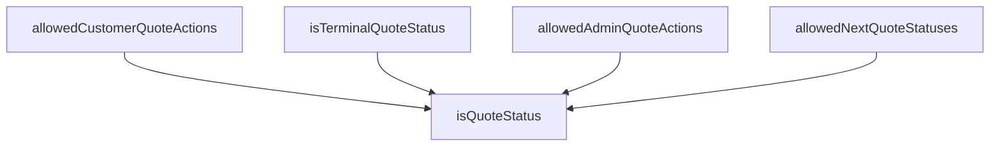

## Genel Bakış
Bu modül, bir teklifin (quote) yaşam döngüsündeki durum geçişlerini ve izin verilen eylemleri tanımlayan merkezi bir durum makinesidir. Tekliflerin farklı durumları (örneğin taslak, beklemede, kabul edildi) arasındaki geçiş kurallarını ve bu durumlarda yönetici veya müşteri tarafından yapılabilecek eylemleri kontrol eder. Modül, teklif iş akışının tutarlılığını sağlamak için kritik bir mimari role sahiptir.

## Fonksiyon Grupları
### Durum Tanımlama ve Doğrulama
Bu grup, geçerli teklif durumlarını doğrulamak ve belirli durumların son (terminal) olup olmadığını belirlemek için kullanılır.
- isQuoteStatus, isTerminalQuoteStatus

### Geçiş Kuralları ve İzin Yönetimi
Bu grup, mevcut duruma bağlı olarak izin verilen sonraki durumları ve farklı kullanıcı rolleri (yönetici, müşteri) için geçerli eylemleri belirler.
- allowedNextQuoteStatuses, allowedAdminQuoteActions, allowedCustomerQuoteActions

---

## AXIOMS – Mimari Varsayımlar

Bu modül, quote durum makinesi (state machine) mantığını tanımlayan bir dizi sabit ve bu sabitlerle çalışan işlevlerden oluşur. Doğru çalışması için aşağıdaki mimari varsayımların karşılanması gerekir.

[Aksiyom 1]: Eğer `QUOTE_STATUSES` sabiti (as_expression ile tanımlanan) geçerli bir durum kümesi içermiyorsa, `isQuoteStatus` işlevi her zaman `false` döner ve tüm durum geçiş işlevleri (`allowedNextQuoteStatuses`, `allowedAdminQuoteActions`, `allowedCustomerQuoteActions`) tutarsız veya boş sonuçlar üretebilir.

[Aksiyom 2]: Eğer `QUOTE_TRANSITIONS` nesnesi, `QUOTE_STATUSES` kümesinde tanımlanmamış bir kaynak durum anahtarı içeriyorsa, `allowedNextQuoteStatuses` işlevi o durum için geçerli bir geçiş listesi bulamaz ve boş dizi (`[]`) döner veya tanımsız davranış gösterir.

[Aksiyom 3]: Eğer `QUOTE_ADMIN_TRANSITIONS` veya `QUOTE_CUSTOMER_TRANSITIONS` nesneleri, `QUOTE_STATUSES` kümesinde bulunmayan bir durum anahtarı içeriyorsa, `allowedAdminQuoteActions` veya `allowedCustomerQuoteActions` işlevleri o durum için tanımsız davranış gösterir.

[Aksiyom 4]: Eğer bir durum `QUOTE_TRANSITIONS` nesnesinde bir kaynak durum olarak tanımlı değilse, `isTerminalQuoteStatus` işlevi o durumu son (terminal) durum olarak kabul eder (`true` döner). Bu durum, işlevin mekanizması tarafından belirlenir ve sadece kaynak durum olarak tanımlı olmamaya bağlıdır.

[Aksiyom 5]: Eğer `allowedNextQuoteStatuses`, `allowedAdminQuoteActions` veya `allowedCustomerQuoteActions` işlevlerinden birine, `QUOTE_STATUSES` kümesinde bulunmayan bir `current` parametresi verilirse, işlevin sonucu tanımsızdır veya boş dizi döner.

[Aksiyom 6]: Eğer `QUOTE_TRANSITIONS` nesnesindeki bir geçiş (target state), `QUOTE_STATUSES` kümesinde tanımlı bir durum değilse, durum makinesi tutarsız bir yapıya sahiptir ve `allowedNextQuoteStatuses` işlevi geçersiz bir hedef durum listesi döner.

---

## FONKSİYON DETAYLARI

### isQuoteStatus
**Ne yapar**: Verilen bir string değerinin geçerli bir teklif durumu (QuoteStatus) olup olmadığını kontrol eden bir tür koruyucu (type guard) fonksiyonudur. Bu, fonksiyonun geri dönüş tipini `value is QuoteStatus` olarak daraltarak, çağrı yerinde TypeScript'in tip güvenliğini sağlamasına olanak tanır.

**Nasıl yapar**: Fonksiyon, daha önce tanımlanmış ve tüm geçerli teklif durumlarını içeren `QUOTE_STATUSES` dizisini `readonly string[]` olarak yeniden tip ataması ile kullanır. `includes` metoduyla, gelen `value` parametresinin bu dizi içinde bulunup bulunmadığını kontrol eder. Eğer değer dizide mevcutsa, fonksiyon `true` döner ve TypeScript derleyicisi bu noktadan itibaren `value` parametresinin `QuoteStatus` tipinde olduğunu bilir.

**Parametreler**:
- value: string — Kontrol edilecek olan değer. Geçerli bir teklif durumu olup olmadığı test edilir.

**Dönüş**: `value is QuoteStatus` — Bir tür koruyucu (type guard) ifadesidir. Fonksiyon `true` döndüğünde, TypeScript derleyicisi `value` parametresinin `QuoteStatus` tipinde olduğunu garanti eder. `false` döndüğünde ise `value` sadece `string` tipi olarak kalır.

### allowedNextQuoteStatuses
**Ne yapar**: Belirli bir mevcut teklif durumundan (`current`) geçiş yapılabilecek **tüm** izinli sonraki durumları, herhangi bir rol filtresi uygulamadan döndürür. Bu, durum makinesinin tam ve genel geçiş haritasını sunar.

**Nasıl yapar**: Önce `isQuoteStatus` fonksiyonunu çağırarak `current` parametresinin geçerli bir teklif durumu olup olmadığını doğrular. Eğer geçerliyse, `QUOTE_TRANSITIONS` haritasını kullanarak bu duruma karşılık gelen tüm izinli geçişleri içeren diziyi döndürür. Geçerli bir durum değilse boş bir dizi (`[]`) döner, bu da hiçbir geçişin mümkün olmadığı anlamına gelir.

**Parametreler**:
- current: string — Mevcut teklif durumunu temsil eden değer. Geçerli bir QuoteStatus olmalıdır, ancak fonksiyon hatalı girdiler için güvenli bir şekilde boş dizi döner.

**Dönüş**: readonly QuoteStatus[] — `current` durumundan izin verilen tüm sonraki durumların salt okunur dizisi. `QUOTE_TRANSITIONS[current]` haritasından elde edilen dizi ile aynıdır.

### allowedAdminQuoteActions
**Ne yapar**: Admin (yönetici) rolü için, belirli bir mevcut teklif durumundan gerçekleştirilebilecek izinli aksiyonları (durum geçişlerini) döndürür. Bu fonksiyonun sonucu, genellikle arayüzdeki (UI) aksiyon düğmelerinin çizilmesi için kullanılır.

**Nasıl yapar**: `isQuoteStatus` ile `current` parametresinin geçerliliğini kontrol eder. Geçerli ise, `QUOTE_ADMIN_TRANSITIONS` haritasını kullanarak sadece admin rolüne özel tanımlanmış izinli geçişleri döndürür. Bu harita, genel `QUOTE_TRANSITIONS`'dan farklı olarak rol bazlı erişim kontrolü sağlar. Geçerli bir durum değilse boş bir dizi döner.

**Parametreler**:
- current: string — Mevcut teklif durumunu temsil eden değer. Adminin hangi aksiyonları alabileceği bu duruma göre belirlenir.

**Dönüş**: readonly QuoteStatus[] — Admin rolü için mevcut durumdan izin verilen hedef durumların salt okunur dizisi. UI'da hangi aksiyon düğmelerinin gösterileceğini belirler.

### allowedCustomerQuoteActions
**Ne yapar**: Müşteri rolü için, belirli bir mevcut teklif durumundan gerçekleştirilebilecek izinli aksiyonları (durum geçişlerini) döndürür. Bu, müşterinin kendi teklif sürecinde hangi adımları atabileceğini belirler.

**Nasıl yapar**: `isQuoteStatus` ile `current` parametresinin geçerliliğini doğrular. Geçerli ise, `QUOTE_CUSTOMER_TRANSITIONS` haritasını kullanarak sadece müşteri rolüne özel tanımlanmış izinli geçişleri döndürür. Bu harita, müşteriye sunulan aksiyonları adminden farklı ve kısıtlı tutarak rol bazlı erişim sağlar. Geçerli bir durum değilse boş bir dizi döner.

**Parametreler**:
- current: string — Mevcut teklif durumunu temsil eden değer. Müşterinin hangi aksiyonları alabileceği bu duruma göre belirlenir.

**Dönüş**: readonly QuoteStatus[] — Müşteri rolü için mevcut durumdan izin verilen hedef durumların salt okunur dizisi.

### isTerminalQuoteStatus
**Ne yapar**: Verilen bir teklif durumunun "terminal" (son, soğurucu) bir durum olup olmadığını kontrol eder. Terminal durumlar, hiçbir geçişin başlatılamadığı ve sürecin o noktada tamamlandığı durumlardır.

**Nasıl yapar**: Önce `isQuoteStatus` ile verilen `status` değerinin geçerli bir teklif durumu olup olmadığını doğrular. Ardından, `QUOTE_TRANSITIONS` haritasından bu duruma karşılık gelen izinli geçişler dizisinin uzunluğunun `0` olup olmadığını kontrol eder. Her iki koşul da sağlanırsa (durum geçerli VE izinli geçiş yoksa), fonksiyon `true` döner; bu da o durumun terminal olduğunu gösterir.

**Parametreler**:
- status: string — Kontrol edilecek teklif durumu.

**Dönüş**: boolean — `true` ise durum terminaldir (hiçbir geçiş izni yoktur), `false` ise geçişlere izin veren bir ara durumdur.

---

## TYPE ALIASES

### QuoteStatus
```typescript
type QuoteStatus = (typeof QUOTE_STATUSES)[number]
```

---

## SABİTLER
- **QUOTE_STATUSES** (as_expression) — `['requested', 'quoted', 'accepted', 'rejected', 'expired'] as const`
- **QUOTE_TRANSITIONS** (object) — `{
  requested: ['quoted', 'rejected'],
  quoted: ['accepted', 'rejected', 'ex...`
- **QUOTE_ADMIN_TRANSITIONS** (object) — `{
  requested: ['quoted', 'rejected'],
  quoted: ['expired'],
  accepted: [],...`
- **QUOTE_CUSTOMER_TRANSITIONS** (object) — `{
  requested: [],
  quoted: ['accepted', 'rejected'],
  accepted: [],
  reje...`

---

## AST POINTERS

### [N1_NASIL] AST Pointer: `src/lib/quotes/quoteStatusMachine.ts::isQuoteStatus`
- **params**: `value: string`
- **ic_degiskenler**: (yok)
- **Dönüş**: `value is QuoteStatus` (type guard) — `QUOTE_STATUSES` sabitinin `readonly string[]` olarak cast edilip `value` değerinin içerip içermediğini kontrol eder; geçerli bir alıntı durumu olup olmadığını belirler

---

### [N2_NASIL] AST Pointer: `src/lib/quotes/quoteStatusMachine.ts::allowedNextQuoteStatuses`
- **params**: `current: string`
- **ic_degiskenler**: (yok)
- **Dönüş**: `readonly QuoteStatus[]` — `current` geçerli bir QuoteStatus ise `QUOTE_TRANSITIONS[current]` ile bir sonraki geçilebilecek durumları döndürür; geçersiz ise boş dizi döndürür

---

### [N3_NASIL] AST Pointer: `src/lib/quotes/quoteStatusMachine.ts::allowedAdminQuoteActions`
- **params**: `current: string`
- **ic_degiskenler**: (yok)
- **Dönüş**: `readonly QuoteStatus[]` — `current` geçerli bir QuoteStatus ise `QUOTE_ADMIN_TRANSITIONS[current]` ile yöneticinin yapabileceği geçişleri döndürür; geçersiz ise boş dizi döndürür

---

### [N4_NASIL] AST Pointer: `src/lib/quotes/quoteStatusMachine.ts::allowedCustomerQuoteActions`
- **params**: `current: string`
- **ic_degiskenler**: (yok)
- **Dönüş**: `readonly QuoteStatus[]` — `current` geçerli bir QuoteStatus ise `QUOTE_CUSTOMER_TRANSITIONS[current]` ile müşterinin yapabileceği geçişleri döndürür; geçersiz ise boş dizi döndürür

---

### [N5_NASIL] AST Pointer: `src/lib/quotes/quoteStatusMachine.ts::isTerminalQuoteStatus`
- **params**: `status: string`
- **ic_degiskenler**: (yok)
- **Dönüş**: `boolean` — `status` geçerli bir QuoteStatus olup olmadığını (`isQuoteStatus`) ve `QUOTE_TRANSITIONS[status]` uzunluğunun `0` olup olmadığını kontrol eder; geçiş yapılamayan (son durum) durumları tespit eder

---


## MERMAID CALL GRAPH


## NODE ID STANDARD

  file: src\lib\quotes\quoteStatusMachine.ts
  function: src\lib\quotes\quoteStatusMachine.ts::isQuoteStatus
  function: src\lib\quotes\quoteStatusMachine.ts::allowedNextQuoteStatuses
  function: src\lib\quotes\quoteStatusMachine.ts::allowedAdminQuoteActions
  function: src\lib\quotes\quoteStatusMachine.ts::allowedCustomerQuoteActions
  function: src\lib\quotes\quoteStatusMachine.ts::isTerminalQuoteStatus

---

## DISA AKTARILANLAR (EXPORTS)
  export: QUOTE_ADMIN_TRANSITIONS
  export: QUOTE_CUSTOMER_TRANSITIONS
  export: QUOTE_STATUSES
  export: QUOTE_TRANSITIONS
  export: QuoteStatus
  export: allowedAdminQuoteActions
  export: allowedCustomerQuoteActions
  export: allowedNextQuoteStatuses
  export: isQuoteStatus
  export: isTerminalQuoteStatus