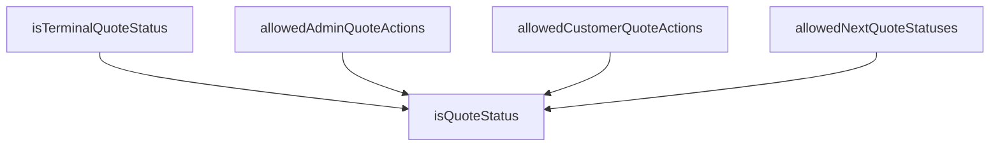

## Genel Bakış
Bu modül, tekliflerin yaşam döngüsündeki durum geçişlerini merkezi olarak yöneten bir durum makinesi tanımlar. Teklif durumlarının doğrulanması, mevcut durumdan izin verilen sonraki durumların belirlenmesi ve farklı kullanıcı rolleri için geçerli eylemlerin kontrol edilmesi gibi temel işlevleri sağlar. Modül, `QUOTE_STATUSES` ve `QUOTE_TRANSITIONS` sabitlerine dayanır; bu sabitlerin doğru tanımlanmaması durumunda fonksiyonlar tutarsız veya boş sonuçlar üretebilir.

## Fonksiyon Grupları
### Durum Tanımlama ve Doğrulama
Teklif durumlarının geçerliliğini kontrol eder ve belirli durumların süreç sonu (terminal) durum olup olmadığını belirler.
- isQuoteStatus, isTerminalQuoteStatus

### Geçiş Kuralları ve İzin Yönetimi
Mevcut duruma bağlı olarak izin verilen sonraki durumları ve yönetici/müşteri rolleri için geçerli eylemleri tanımlar.
- allowedNextQuoteStatuses, allowedAdminQuoteActions, allowedCustomerQuoteActions

---

## AXIOMS – Mimari Varsayımlar
- Bu modül davranışsal mantık içermez (salt veri / konfigürasyon / tip tanımı).
- [Aksiyom 1]: Modülün dışa açtığı yapı (anahtar kümesi / şema) bir sözleşmedir; tüketiciler bu sabit yapıya bağlıdır — kırıcı değişiklik tüm tüketicileri etkiler.
- [Aksiyom 2]: Bir öğe ekleme/çıkarma yapısal-uyumlu olmalı; ilgili tipler ve seçiciler aynı commit'te güncel tutulmalıdır.

---

## FONKSİYON DETAYLARI

### isQuoteStatus
**Ne yapar**: Verilen bir string değerinin geçerli bir teklif durumu (QuoteStatus) olup olmadığını kontrol eden bir tür koruyucu (type guard) fonksiyonudur. Bu, fonksiyonun geri dönüş tipini `value is QuoteStatus` olarak daraltarak, çağrı yerinde TypeScript'in tip güvenliğini sağlamasına olanak tanır.

**Nasıl yapar**: Fonksiyon, daha önce tanımlanmış ve tüm geçerli teklif durumlarını içeren `QUOTE_STATUSES` dizisini `readonly string[]` olarak yeniden tip ataması ile kullanır. `includes` metoduyla, gelen `value` parametresinin bu dizi içinde bulunup bulunmadığını kontrol eder. Eğer değer dizide mevcutsa, fonksiyon `true` döner ve TypeScript derleyicisi bu noktadan itibaren `value` parametresinin `QuoteStatus` tipinde olduğunu bilir.

**Parametreler**:
- value: string — Kontrol edilecek olan değer. Geçerli bir teklif durumu olup olmadığı test edilir.

**Dönüş**: `value is QuoteStatus` — Bir tür koruyucu (type guard) ifadesidir. Fonksiyon `true` döndüğünde, TypeScript derleyicisi `value` parametresinin `QuoteStatus` tipinde olduğunu garanti eder. `false` döndüğünde ise `value` sadece `string` tipi olarak kalır.

### allowedNextQuoteStatuses
**Ne yapar**: Belirli bir mevcut teklif durumundan (`current`) geçiş yapılabilecek **tüm** izinli sonraki durumları, herhangi bir rol filtresi uygulamadan döndürür. Bu, durum makinesinin tam ve genel geçiş haritasını sunar.

**Nasıl yapar**: Önce `isQuoteStatus` fonksiyonunu çağırarak `current` parametresinin geçerli bir teklif durumu olup olmadığını doğrular. Eğer geçerliyse, `QUOTE_TRANSITIONS` haritasını kullanarak bu duruma karşılık gelen tüm izinli geçişleri içeren diziyi döndürür. Geçerli bir durum değilse boş bir dizi (`[]`) döner, bu da hiçbir geçişin mümkün olmadığı anlamına gelir.

**Parametreler**:
- current: string — Mevcut teklif durumunu temsil eden değer. Geçerli bir QuoteStatus olmalıdır, ancak fonksiyon hatalı girdiler için güvenli bir şekilde boş dizi döner.

**Dönüş**: readonly QuoteStatus[] — `current` durumundan izin verilen tüm sonraki durumların salt okunur dizisi. `QUOTE_TRANSITIONS[current]` haritasından elde edilen dizi ile aynıdır.

### allowedAdminQuoteActions
**Ne yapar**: Admin (yönetici) rolü için, belirli bir mevcut teklif durumundan gerçekleştirilebilecek izinli aksiyonları (durum geçişlerini) döndürür. Bu fonksiyonun sonucu, genellikle arayüzdeki (UI) aksiyon düğmelerinin çizilmesi için kullanılır.

**Nasıl yapar**: `isQuoteStatus` ile `current` parametresinin geçerliliğini kontrol eder. Geçerli ise, `QUOTE_ADMIN_TRANSITIONS` haritasını kullanarak sadece admin rolüne özel tanımlanmış izinli geçişleri döndürür. Bu harita, genel `QUOTE_TRANSITIONS`'dan farklı olarak rol bazlı erişim kontrolü sağlar. Geçerli bir durum değilse boş bir dizi döner.

**Parametreler**:
- current: string — Mevcut teklif durumunu temsil eden değer. Adminin hangi aksiyonları alabileceği bu duruma göre belirlenir.

**Dönüş**: readonly QuoteStatus[] — Admin rolü için mevcut durumdan izin verilen hedef durumların salt okunur dizisi. UI'da hangi aksiyon düğmelerinin gösterileceğini belirler.

### allowedCustomerQuoteActions
**Ne yapar**: Müşteri rolü için, belirli bir mevcut teklif durumundan gerçekleştirilebilecek izinli aksiyonları (durum geçişlerini) döndürür. Bu, müşterinin kendi teklif sürecinde hangi adımları atabileceğini belirler.

**Nasıl yapar**: `isQuoteStatus` ile `current` parametresinin geçerliliğini doğrular. Geçerli ise, `QUOTE_CUSTOMER_TRANSITIONS` haritasını kullanarak sadece müşteri rolüne özel tanımlanmış izinli geçişleri döndürür. Bu harita, müşteriye sunulan aksiyonları adminden farklı ve kısıtlı tutarak rol bazlı erişim sağlar. Geçerli bir durum değilse boş bir dizi döner.

**Parametreler**:
- current: string — Mevcut teklif durumunu temsil eden değer. Müşterinin hangi aksiyonları alabileceği bu duruma göre belirlenir.

**Dönüş**: readonly QuoteStatus[] — Müşteri rolü için mevcut durumdan izin verilen hedef durumların salt okunur dizisi.

### isTerminalQuoteStatus
**Ne yapar**: Verilen bir teklif durumunun "terminal" (son, soğurucu) bir durum olup olmadığını kontrol eder. Terminal durumlar, hiçbir geçişin başlatılamadığı ve sürecin o noktada tamamlandığı durumlardır.

**Nasıl yapar**: Önce `isQuoteStatus` ile verilen `status` değerinin geçerli bir teklif durumu olup olmadığını doğrular. Ardından, `QUOTE_TRANSITIONS` haritasından bu duruma karşılık gelen izinli geçişler dizisinin uzunluğunun `0` olup olmadığını kontrol eder. Her iki koşul da sağlanırsa (durum geçerli VE izinli geçiş yoksa), fonksiyon `true` döner; bu da o durumun terminal olduğunu gösterir.

**Parametreler**:
- status: string — Kontrol edilecek teklif durumu.

**Dönüş**: boolean — `true` ise durum terminaldir (hiçbir geçiş izni yoktur), `false` ise geçişlere izin veren bir ara durumdur.

---

## TYPE ALIASES

### QuoteStatus
```typescript
type QuoteStatus = (typeof QUOTE_STATUSES)[number]
```

---

## SABİTLER
- **QUOTE_STATUSES** (as_expression) — `[
  'draft',
  'requested',
  'quoted',
  'accepted',
  'rejected',
  'expire...`
- **QUOTE_TRANSITIONS** (object) — `{
  draft: ['quoted', 'cancelled'],
  requested: ['draft', 'rejected'],
  quo...`
- **QUOTE_ADMIN_TRANSITIONS** (object) — `{
  draft: ['quoted', 'cancelled'],
  requested: ['draft', 'rejected'],
  quo...`
- **QUOTE_CUSTOMER_TRANSITIONS** (object) — `{
  draft: [],
  requested: [],
  quoted: ['accepted', 'rejected'],
  accepte...`

---

## AST POINTERS

### [N1_NASIL] AST Pointer: src/lib/quotes/quoteStatusMachine.ts::isQuoteStatus
- **params**: `value` — string türünde, geçerli bir teklif durumu olup olmadığı kontrol edilen değer
- **ic_degiskenler**: yok
- **Dönüş**: boolean — `value` parametresinin `QUOTE_STATUSES` dizisi içinde bulunup bulunmadığını döndürür (type guard: `value is QuoteStatus`)

### [N2_NASIL] AST Pointer: src/lib/quotes/quoteStatusMachine.ts::allowedNextQuoteStatuses
- **params**: `current` — string türünde, mevcut teklif durumu
- **ic_degiskenler**: yok
- **Dönüş**: readonly QuoteStatus[] — `current` geçerli bir teklif durumu ise `QUOTE_TRANSITIONS[current]` dizisini, değilse boş dizi döndürür

### [N3_NASIL] AST Pointer: src/lib/quotes/quoteStatusMachine.ts::allowedAdminQuoteActions
- **params**: `current` — string türünde, mevcut teklif durumu
- **ic_degiskenler**: yok
- **Dönüş**: readonly QuoteStatus[] — `current` geçerli bir teklif durumu ise `QUOTE_ADMIN_TRANSITIONS[current]` dizisini, değilse boş dizi döndürür

### [N4_NASIL] AST Pointer: src/lib/quotes/quoteStatusMachine.ts::allowedCustomerQuoteActions
- **params**: `current` — string türünde, mevcut teklif durumu
- **ic_degiskenler**: yok
- **Dönüş**: readonly QuoteStatus[] — `current` geçerli bir teklif durumu ise `QUOTE_CUSTOMER_TRANSITIONS[current]` dizisini, değilse boş dizi döndürür

### [N5_NASIL] AST Pointer: src/lib/quotes/quoteStatusMachine.ts::isTerminalQuoteStatus
- **params**: `status` — string türünde, kontrol edilen teklif durumu
- **ic_degiskenler**: yok
- **Dönüş**: boolean — `status` geçerli bir teklif durumu ise ve `QUOTE_TRANSITIONS[status]` dizisinin uzunluğu 0 ise true döndürür (son durum olup olmadığını belirtir)

---


## MERMAID CALL GRAPH


## NODE ID STANDARD

  file: src\lib\quotes\quoteStatusMachine.ts
  function: src\lib\quotes\quoteStatusMachine.ts::isQuoteStatus
  function: src\lib\quotes\quoteStatusMachine.ts::allowedNextQuoteStatuses
  function: src\lib\quotes\quoteStatusMachine.ts::allowedAdminQuoteActions
  function: src\lib\quotes\quoteStatusMachine.ts::allowedCustomerQuoteActions
  function: src\lib\quotes\quoteStatusMachine.ts::isTerminalQuoteStatus

---

## DISA AKTARILANLAR (EXPORTS)
  export: QUOTE_ADMIN_TRANSITIONS
  export: QUOTE_CUSTOMER_TRANSITIONS
  export: QUOTE_STATUSES
  export: QUOTE_TRANSITIONS
  export: QuoteStatus
  export: allowedAdminQuoteActions
  export: allowedCustomerQuoteActions
  export: allowedNextQuoteStatuses
  export: isQuoteStatus
  export: isTerminalQuoteStatus