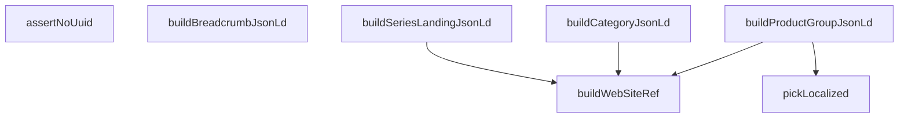

## Genel Bakış

Bu modül, web sitesinin SEO performansını artırmak amacıyla arama motorlarına yönelik yapılandırılmış veri (JSON-LD) üretimini üstlenir. Ürün grupları, kategoriler, seri landing sayfaları ve breadcrumb navigasyonu için Schema.org uyumlu JSON-LD nesneleri oluşturur. Ayrıca çok dilli içerik desteği ve üretilen JSON-LD'nin UUID içermemesi gerektiğini doğrulayan bir güvenlik katmanı sağlar.

## Fonksiyon Grupları

### Yardımcı ve Referans Fonksiyonları
Çok dilli metinlerden dile özel değer seçen ve web sitesi referansı oluşturan temel yardımcı fonksiyonlardır. Diğer JSON-LD builder fonksiyonları tarafından çağrılarak ortak ihtiyaçları karşılar.
- pickLocalized, buildWebSiteRef

### JSON-LD Builder Fonksiyonları
Sayfa türlerine göre Schema.org uyumlu JSON-LD nesneleri üretir. Her biri kendi parametre tipiyle çalışır ve yapılandırılmış veri objesi döndürür. Bu fonksiyonlar modülün ana sorumluluğunu temsil eder.
- buildProductGroupJsonLd, buildCategoryJsonLd, buildSeriesLandingJsonLd, buildBreadcrumbJsonLd

### Validasyon Fonksiyonları
Üretilen JSON-LD nesnelerinin geçerliliğini kontrol eden güvenlik doğrulaması yapar. UUID gibi istenmeyen değerlerin yapılandırılmış veriye sızmasını engeller.
- assertNoUuid

---

## AXIOMS – Mimari Varsayımlar
- Bu modül davranışsal mantık içermez (salt veri / konfigürasyon / tip tanımı).
- [Aksiyom 1]: Modülün dışa açtığı yapı (anahtar kümesi / şema) bir sözleşmedir; tüketiciler bu sabit yapıya bağlıdır — kırıcı değişiklik tüm tüketicileri etkiler.
- [Aksiyom 2]: Bir öğe ekleme/çıkarma yapısal-uyumlu olmalı; ilgili tipler ve seçiciler aynı commit'te güncel tutulmalıdır.

---

## FONKSİYON DETAYLARI

### pickLocalized
**Ne yapar**: Çok dilli (localized) metin alanlarından, tercih edilen dile göre uygun değeri seçen yardımcı fonksiyondur. Aile description ve meta alanlarında dil çözümlemesi yapar; tercih edilen dil bulunamazsa sırasıyla Türkçe ve İngilizce fallback uygular, hiçbiri yoksa `null` döner.

**Nasıl yapar**: Öncelikle `value` falsy (null, undefined vb.) ise doğrudan `null` döner. Ardından `lang` parametresine göre tercih edilen dili belirler: `lang` `'en'` ise `value.en`, değilse `value.tr` seçilir. Tercih edilen dil değeri yoksa sırasıyla `value.tr`, `value.en` denenir; bunların da yokluğu durumunda `null` döner.

**Parametreler**:
- value: `LocalizedText` — Çok dilli metin nesnesi (örneğin `{ tr: "...", en: "..." }` yapısında). Falsy olabilir.
- lang: `string` — Tercih edilen dil kodu (`'tr'` veya `'en'` gibi).

**Dönüş**: `string | null` — Bulunan dil metni ya da hiçbir dilde değer yoksa `null`.

### buildWebSiteRef
**Ne yapar**: Geliştirildi ancak detay üretilemedi.

### buildProductGroupJsonLd
**Ne yapar**: Geliştirildi ancak detay üretilemedi.

### buildCategoryJsonLd
**Ne yapar**: Geliştirildi ancak detay üretilemedi.

### buildSeriesLandingJsonLd
**Ne yapar**: Geliştirildi ancak detay üretilemedi.

### buildBreadcrumbJsonLd
**Ne yapar**: Geliştirildi ancak detay üretilemedi.

### assertNoUuid
**Ne yapar**: Geliştirildi ancak detay üretilemedi.

---

## İTHALATLAR (IMPORTS)
- import: ../../types/ui-models::type { FamilyListItem }
- import: ../images/productImage::storagePathToUrl
- import: ../services/family.service::type { FamilyDetail, FamilyVariant }

---

## INTERFACES

### BuildProductGroupJsonLdParams
- `family: FamilyDetail['family']`
- `variants: FamilyVariant[]`
- `lang: string`
- `baseUrl: string`

### BuildCategoryJsonLdParams
- `lang: string`
- `baseUrl: string`
- `categorySlug: string`
- `name: string`
- `description: string`
- `total: number`
- `page: number`
- `pageSize: number`
- `families: FamilyListItem[]`

### BuildSeriesLandingJsonLdParams
- `lang: string`
- `baseUrl: string`
- `seriesSlug: string`
- `name: string`
- `description: string`
- `models: FamilyListItem[]`

### BreadcrumbStep
Breadcrumb zincirinin tek basamağı. `path` = dil öneksiz site yolu (`/category/fans`).
- `name: string`
- `path: string | null`

### BuildBreadcrumbJsonLdParams
- `lang: string`
- `baseUrl: string`
- `steps: BreadcrumbStep[]`

---

## TYPE ALIASES

### LocalizedText
```typescript
type LocalizedText = { tr?: string | null; en?: string | null } | null
```

---

## SABİTLER
- **UUID_PATTERN** (regex) — `/[0-9a-f]{8}-[0-9a-f]{4}-[0-9a-f]{4}-[0-9a-f]{4}-[0-9a-f]{12}/i`

---

## AST POINTERS

### [N1_NASIL] AST Pointer: src/lib/seo/jsonld.ts::pickLocalized
- **params**: `value` (LocalizedText), `lang` (string)
- **ic_degiskenler**:
  - `preferred` — lang 'en' ise `value.en`, değilse `value.tr` değeri atanır
- **Dönüş**: string | null — `preferred` varsa onu, yoksa `value.tr`, o da yoksa `value.en`, hiçbiri yoksa `null` döner

### [N2_NASIL] AST Pointer: src/lib/seo/jsonld.ts::buildWebSiteRef
- **params**: `baseUrl` (string)
- **ic_degiskenler**: yok
- **Dönüş**: object — `'@type': 'WebSite'`, `name: SITE_NAME`, `url: baseUrl` alanlarını içeren nesne

### [N3_NASIL] AST Pointer: src/lib/seo/jsonld.ts::buildProductGroupJsonLd
- **params**: `params` (BuildProductGroupJsonLdParams)
- **ic_degiskenler**:
  - `family` — `params.family` (FamilyDetail tipinde aile verisi)
  - `variants` — `params.variants` (FamilyVariant[] tipinde varyant dizisi)
  - `lang` — `params.lang` (dil kodu)
  - `baseUrl` — `params.baseUrl` (temel URL)
  - `url` — `` `${baseUrl}/${lang}/products/${family.slug}` `` ifadesinden oluşan ürün grubu URL'si
  - `description` — `pickLocalized(family.description, lang)` sonucu; yoksa lang'e göre varsayılan metin atanır
  - `hasVariant` — `variants.map` ile oluşturulan Product tipinde nesne dizisi
  - `imagePath` — `variant.images[0]?.path` (varyantın ilk görselinin storage yolu, map içinde)
  - `productNode` — her varyant için oluşturulan `Record<string, unknown>` tipinde Product nesnesi (map içinde)
  - `offerPrice` — `variant.price` null ise `null`, değilse `Number(variant.price)` dönüşümü (map içinde)
- **Dönüş**: Record<string, unknown> — `'@context'`, `'@type': 'ProductGroup'`, `productGroupID`, `name`, `description`, `url`, `brand` (opsiyonel, `family.brand_name` varsa), `isPartOf`, `hasVariant` alanlarını içeren JSON-LD nesnesi

### [N4_NASIL] AST Pointer: src/lib/seo/jsonld.ts::buildCategoryJsonLd
- **params**: `params` (BuildCategoryJsonLdParams)
- **ic_degiskenler**:
  - `lang` — `params.lang` (dil kodu)
  - `baseUrl` — `params.baseUrl` (temel URL)
  - `categorySlug` — `params.categorySlug` (kategori slug'ı)
  - `name` — `params.name` (kategori adı)
  - `description` — `params.description` (kategori açıklaması)
  - `total` — `params.total` (toplam öğe sayısı)
  - `page` — `params.page` (mevcut sayfa numarası)
  - `pageSize` — `params.pageSize` (sayfa başına öğe sayısı)
  - `families` — `params.families` (FamilyListItem[] tipinde aile dizisi)
  - `family` — map içindeki her bir aile nesnesi
  - `index` — map içindeki indeks numarası
- **Dönüş**: Record<string, unknown> — `'@context'`, `'@type': 'CollectionPage'`, `name`, `description`, `url`, `isPartOf`, `numberOfItems`, `itemListElement` alanlarını içeren JSON-LD nesnesi

### [N5_NASIL] AST Pointer: src/lib/seo/jsonld.ts::buildSeriesLandingJsonLd
- **params**: `params` (BuildSeriesLandingJsonLdParams)
- **ic_degiskenler**:
  - `lang` — `params.lang` (dil kodu)
  - `baseUrl` — `params.baseUrl` (temel URL)
  - `seriesSlug` — `params.seriesSlug` (seri slug'ı)
  - `name` — `params.name` (seri adı)
  - `description` — `params.description` (seri açıklaması)
  - `models` — `params.models` (model dizisi)
  - `model` — map içindeki her bir model nesnesi
  - `index` — map içindeki indeks numarası
- **Dönüş**: Record<string, unknown> — `'@context'`, `'@type': 'CollectionPage'`, `name`, `description`, `url`, `isPartOf`, `numberOfItems`, `itemListElement` alanlarını içeren JSON-LD nesnesi

### [N6_NASIL] AST Pointer: src/lib/seo/jsonld.ts::buildBreadcrumbJsonLd
- **params**: `params` (BuildBreadcrumbJsonLdParams)
- **ic_degiskenler**:
  - `lang` — `params.lang` (dil kodu)
  - `baseUrl` — `params.baseUrl` (temel URL)
  - `steps` — `params.steps` (breadcrumb adım dizisi)
  - `son` — `steps[steps.length - 1]` (dizinin son elemanı)
  - `bosAd` — `steps.find((s) => !s.name.trim())` ile bulunan, adı boş olan ilk step
  - `step` — map içindeki her bir adım nesnesi
  - `index` — map içindeki indeks numarası
- **Dönüş**: Record<string, unknown> — `'@context'`, `'@type': 'BreadcrumbList'`, `itemListElement` alanlarını içeren JSON-LD nesnesi; `steps.length < 2` ise, `son.path !== null` ise veya boş ad varsa Error fırlatır

### [N7_NASIL] AST Pointer: src/lib/seo/jsonld.ts::assertNoUuid
- **params**: `jsonLd` (unknown)
- **ic_degiskenler**:
  - `serialized` — `JSON.stringify(jsonLd)` sonucu oluşan string
- **Dönüş**: void — `process.env.NODE_ENV === 'production'` ise hiçbir şey yapmadan döner; diğer ortamlarda `UUID_PATTERN.test(serialized)` true ise Error fırlatır

---


## MERMAID CALL GRAPH


## NODE ID STANDARD

  file: src\lib\seo\jsonld.ts
  function: src\lib\seo\jsonld.ts::pickLocalized
  function: src\lib\seo\jsonld.ts::buildWebSiteRef
  function: src\lib\seo\jsonld.ts::buildProductGroupJsonLd
  function: src\lib\seo\jsonld.ts::buildCategoryJsonLd
  function: src\lib\seo\jsonld.ts::buildSeriesLandingJsonLd
  function: src\lib\seo\jsonld.ts::buildBreadcrumbJsonLd
  function: src\lib\seo\jsonld.ts::assertNoUuid

---

## DISA AKTARILANLAR (EXPORTS)
  export: BreadcrumbStep
  export: BuildBreadcrumbJsonLdParams
  export: BuildCategoryJsonLdParams
  export: BuildProductGroupJsonLdParams
  export: BuildSeriesLandingJsonLdParams
  export: assertNoUuid
  export: buildBreadcrumbJsonLd
  export: buildCategoryJsonLd
  export: buildProductGroupJsonLd
  export: buildSeriesLandingJsonLd
  export: buildWebSiteRef
  export: pickLocalized