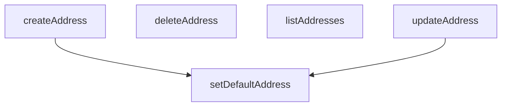

## Genel Bakış
Bu modül, kullanıcı adreslerinin tüm yaşam döngüsünü yöneten bir veri servisidir. Temel olarak, adreslerin eklenmesi, değiştirilmesi, listelenmesi ve silinmesi gibi standart CRUD işlemlerini yürütür. Ayrıca, kullanıcıların bir adresi teslimat veya fatura için varsayılan olarak belirlemesine olanak tanıyan işlevsel bir düzenleme sunar.

## Fonksiyon Grupları
### Adres Temel İşlemleri
Kullanıcı adreslerinin standart veri manipülasyonu işlemlerini yönetir; bu, yeni adres oluşturma, mevcut adresleri listeleme ve güncelleme ile adresleri kalıcı olarak silmeyi kapsar.
- listAddresses, createAddress, updateAddress, deleteAddress

### Varsayılan Adres Yönetimi
Kullanıcıların belirli bir adresi teslimat veya fatura amaçlı olarak varsayılan olarak belirlemesini sağlar; bu, ilgili adres kaydının türüne göre özel bir alan güncellenmesini içerir.
- setDefaultAddress

---

## AXIOMS – Mimari Varsayımlar

Bu modül, kullanıcı adreslerinin CRUD işlemlerini ve varsayılan adres belirleme mantığını yöneten servis katmanıdır.

**[Aksiyom 1 - Supabase Bağlantı Gereksinimi]:** Eğer geçerli bir Supabase istemcisi (`supabase`) sağlanmazsa, tüm CRUD işlemleri (`listAddresses`, `createAddress`, `updateAddress`, `deleteAddress`) ve `setDefaultAddress` fonksiyonları başarısız olur veya veritabanı bağlantısı kurulamaz.

**[Aksiyom 2 - Var olan Adres Kimliği Zorunluluğu]:** Eğer `updateAddress` veya `deleteAddress` fonksiyonuna geçersiz veya var olmayan bir `id: string` parametresi girilirse, ilgili adres bulunamaz ve işlem başarısız olur.

**[Aksiyom 3 - Adres Türü Kısıtlaması]:** Eğer `setDefaultAddress` fonksiyonuna `kind` parametresi olarak `'shipping'` veya `'billing'` değerlerinden farklı bir değer girilirse, fonksiyon hata fırlatır veya beklenmeyen davranış sergiler (TypeScript derleme zamanı kısıtlaması: `kind: 'shipping' | 'billing'`).

**[Aksiyom 4 - Veri Yapısı Gereksinimi (Create)]:** Eğer `createAddress` fonksiyonuna `DbUserAddressInsert` tipine uymayan bir `payload` nesnesi girilirse, Supabase insert işlemi başarısız olur veya veritabanı kısıtlamaları ihlal edilir.

**[Aksiyom 5 - Veri Yapısı Gereksinimi (Update)]:** Eğer `updateAddress` fonksiyonuna `DbUserAddressUpdate` tipine uymayan bir `payload` nesnesi girilirse, Supabase update işlemi başarısız olur veya veritabanı kısıtlamaları ihlal edilir.

**[Aksiyom 6 - Varsayılan İstemci Erişilebilirliği]:** Eğer `defaultClient` sabiti (ternary expression ile belirlenir) geçerli bir Supabase istemcisine dönüşemezse, opsiyonel olarak istemci sağlanmadığında modül varsayılan bağlantı mechanismasını kullanamaz.

---

## FONKSİYON DETAYLARI

### listAddresses
**Ne yapar**: Kimliği doğrulanmış kullanıcıya ait tüm adresleri alır.
**Nasıl yapar**: Supabase istemcisini kullanarak `user_addresses` tablosundaki tüm satırları sorgular. Sonuçları, `is_default_shipping` alanına göre azalan (true önce gelir) ve ardından `created_at` alanına göre azalan sırada sıralar. Veritabanı sorgusu başarısız olursa bir hata fırlatır.
**Parametreler**:
- supabase: SupabaseClient — Veritabanı işlemleri için kullanılacak istemci. Opsiyoneldir ve varsayılan olarak modülde tanımlı `defaultClient` kullanılır.
**Dönüş**: Promise<DbUserAddress[]> — Sıralanmış kullanıcı adresleri dizisi. Sorgu başarılı olmazsa boş bir dizi döner.

### createAddress
**Ne yapar**: Kimliği doğrulanmış kullanıcı için yeni bir adres kaydı oluşturur.
**Nasıl yapar**: Önce kullanıcının oturumunu doğrular. Ardından, sağlanan `payload` verisini kullanıcının ID'si ile genişleterek veritabanına ekler. `street_address` alanını `address_line`'dan, `address_type` alanını ise `is_default_shipping` bayrağına göre belirler. İşlem başarılı olduktan sonra, `is_default_shipping` veya `is_default_billing` bayrakları true ise ilgili adresi varsayılan olarak ayarlar.
**Parametreler**:
- payload: DbUserAddressInsert — Oluşturulacak adresin tüm verilerini içeren nesne.
- supabase: SupabaseClient — Veritabanı işlemleri için kullanılacak istemci. Opsiyoneldir ve varsayılan olarak modülde tanımlı `defaultClient` kullanılır.
**Dönüş**: Promise<DbUserAddress> — Yeni oluşturulan adres nesnesi.

### updateAddress
**Ne yapar**: Mevcut bir adresi kimliği doğrulanmış kullanıcı adına günceller.
**Nasıl yapar**: Verilen `id` ile eşleşen adres kaydını bulur ve `payload` içindeki alanlarla günceller. `address_line` alanı sağlanmışsa bunu `street_address` alanına eşler. Güncelleme başarılı olduktan sonra, `is_default_shipping` veya `is_default_billing` bayrakları true ise ilgili adresi varsayılan olarak ayarlar.
**Parametreler**:
- id: string — Güncellenecek adresin benzersiz tanımlayıcısı.
- payload: DbUserAddressUpdate — Güncellenecek alanları içeren kısmi veri nesnesi.
- supabase: SupabaseClient — Veritabanı işlemleri için kullanılacak istemci. Opsiyoneldir ve varsayılan olarak modülde tanımlı `defaultClient` kullanılır.
**Dönüş**: Promise<DbUserAddress> — Güncellenmiş adres nesnesi.

### deleteAddress
**Ne yapar**: Kimliği doğrulanmış kullanıcıya ait belirli bir adresi kalıcı olarak siler.
**Nasıl yapar**: Verilen `id` parametresine sahip adres kaydını `user_addresses` tablosundan siler. İşlem başarılıysa `true` değeri döner. Veritabanı silme işleminde bir hata oluşursa bir istisna fırlatır.
**Parametreler**:
- id: string — Silinecek adresin benzersiz tanımlayıcısı.
- supabase: SupabaseClient — Veritabanı işlemleri için kullanılacak istemci. Opsiyoneldir ve varsayılan olarak modülde tanımlı `defaultClient` kullanılır.
**Dönüş**: Promise<boolean> — Silme işlemi başarılıysa `true`.

### setDefaultAddress
**Ne yapar**: Bir adresi kullanıcının varsayılan gönderim veya fatura adresi olarak ayarlar.
**Nasıl yapar**: Önce kullanıcının oturumunu doğrular. Then, kullanıcının tüm adreslerinde belirtilen türdeki (`shipping` veya `billing`) varsayılanlık bayrağını (`is_default_shipping` veya `is_default_billing`) `false` olarak günceller. Bu, mevcut tüm varsayılan adresleri devre dışı bırakır. Ardından, belirtilen `id`'ye sahip adresin aynı bayrağını `true` olarak ayarlayarak onu yeni varsayılan yapar.
**Parametreler**:
- kind: 'shipping' | 'billing' — Varsayılan olarak ayarlanacak adres türü.
- id: string — Varsayılan olarak ayarlanacak adresin benzersiz tanımlayıcısı.
- supabase: SupabaseClient — Veritabanı işlemleri için kullanılacak istemci. Opsiyoneldir ve varsayılan olarak modülde tanımlı `defaultClient` kullanılır.
**Dönüş**: Promise<DbUserAddress> — Varsayılan olarak ayarlanmış güncel adres nesnesi.

---

## SABİTLER
- **defaultClient** (ternary_expression) — `typeof window !== 'undefined' ? supabaseBrowserClient : supabaseStaticClient`

---

## AST POINTERS

### [N1_NASIL] AST Pointer: src/lib/services/address.service.ts::listAddresses
- **params**: `(supabase = defaultClient)`
- **ic_degiskenler**:
  - `data` — Supabase'den dönen satır listesi (DbUserAddress[])
  - `error` — Supabase sorgusu sonucu oluşabilecek hata nesnesi
- **Dönüş**: `DbUserAddress[]` — kullanıcının tüm adresleri,created_at azalan sırada

---

### [N2_NASIL] AST Pointer: src/lib/services/address.service.ts::createAddress
- **params**: `(payload: DbUserAddressInsert, supabase = defaultClient)`
- **ic_degiskenler**:
  - `authData` — supabase.auth.getUser() sonucu oturum verisi
  - `userError` — auth sorgusundaki olası hata
  - `user` — authData.user, oturumdaki kullanıcı nesnesi
  - `dbPayload` — veritabanına yazılacak final payload; payload.user_id ile user.id, street_address fallback ile address_type fallback doldurulur
  - `data` — insert sonrası dönen tek satır (DbUserAddress)
  - `error` — insert sorgusundaki olası hata
- **Dönüş**: `DbUserAddress` — yeni oluşturulan adres kaydı

---

### [N3_NASIL] AST Pointer: src/lib/services/address.service.ts::updateAddress
- **params**: `(id: string, payload: DbUserAddressUpdate, supabase = defaultClient)`
- **ic_degiskenler**:
  - `updatePatch` — payload'un kopyası; address_line varsa street_address alanına eşlenir
  - `data` — update sonrası dönen tek satır (DbUserAddress)
  - `error` — update sorgusundaki olası hata
- **Dönüş**: `DbUserAddress` — güncellenmiş adres kaydı

---

### [N4_NASIL] AST Pointer: src/lib/services/address.service.ts::deleteAddress
- **params**: `(id: string, supabase = defaultClient)`
- **ic_degiskenler**:
  - `error` — delete sorgusundaki olası hata
- **Dönüş**: `boolean` — silme başarılıysa `true`

---

### [N5_NASIL] AST Pointer: src/lib/services/address.service.ts::setDefaultAddress
- **params**: `(kind: 'shipping' | 'billing', id: string, supabase = defaultClient)`
- **ic_degiskenler**:
  - `authData` — supabase.auth.getUser() sonucu oturum verisi
  - `userError` — auth sorgusundaki olası hata
  - `user` — authData.user, oturumdaki kullanıcı nesnesi
  - `flag` — kind değerine göre `'is_default_shipping'` veya `'is_default_billing'` seçilen alan adı
  - `clearPatch` — `{ [flag]: false }` formatında, ilgili flag'i false yapacak güncelleme nesnesi
  - `clear` — aynı kullanıcının diğer tüm adreslerinde ilgili flag'i false yapan Supabase sorgu sonucu
  - `setPatch` — `{ [flag]: true }` formatında, ilgili flag'i true yapacak güncelleme nesnesi
  - `data` — setPatch uygulandıktan sonra dönen tek satır (DbUserAddress)
  - `error` — setPatch sorgusundaki olası hata
- **Dönüş**: `DbUserAddress` — varsayılan olarak ayarlanan adres kaydı

---

## MERMAID CALL GRAPH

## NODE ID STANDARD

  file: src\lib\services\address.service.ts
  function: src\lib\services\address.service.ts::listAddresses
  function: src\lib\services\address.service.ts::createAddress
  function: src\lib\services\address.service.ts::updateAddress
  function: src\lib\services\address.service.ts::deleteAddress
  function: src\lib\services\address.service.ts::setDefaultAddress

---

## DISA AKTARILANLAR (EXPORTS)
  export: createAddress
  export: deleteAddress
  export: listAddresses
  export: setDefaultAddress
  export: updateAddress