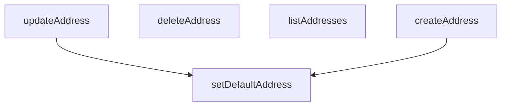

## Genel Bakış
Bu modül, VentHub HVAC platformunda kullanıcı adreslerinin yönetimini sağlayan merkezi servistir. Kullanıcıların teslimat ve fatura adreslerini eklemesini, güncellemesini, silmesini ve listelemesini sağlar. Ayrıca, kullanıcıların belirli bir adresi varsayılan teslimat veya fatura adresi olarak belirlemesine olanak tanır.

## Fonksiyon Grupları
### Temel Adres CRUD İşlemleri
Kullanıcı adreslerinin temel yaşam döngüsü yönetimini sağlar. Mevcut adreslerin listelenmesinden yeni adres oluşturulmasına, var olan adreslerin güncellenmesinden kalıcı olarak silinmesine kadar tüm standart veri操纵 işlemlerini kapsar.
- listAddresses, createAddress, updateAddress, deleteAddress

### Varsayılan Adres Atama
Kullanıcıların belirli bir adresi teslimat veya fatura süreçleri için varsayılan olarak belirlemesini sağlar. Bu fonksiyon, seçilen adresin türüne göre (teslimat veya fatura) ilgili alanın güncellenmesini yönetir.
- setDefaultAddress

---

## AXIOMS – Mimari Varsayımlar
Bu modül için, fonksiyon imzalarından çıkarılabilecek temel mimari varsayımlar aşağıdadır.

[Aksiyom 1]: Eğer `listAddresses` çağrıldığında mevcut bir kullanıcı oturumu veya bağlamı (user context) yoksa, modül kullanıcının adreslerini hangi ölçüde filtreleyeceğine dair bir temel bilgiye sahip olamaz ve yanlış veya boş bir liste döndürür.

[Aksiyom 2]: Eğer `createAddress(payload: DbUserAddressInsert)` çağrıldığında `payload` parametresi, veritabanı şemasına uygun bir `DbUserAddressInsert` yapısı değilse, adres kaydı oluşturulamaz veya bozuk veri yazılır.

[Aksiyom 3]: Eğer `updateAddress(id: string, ...)` veya `deleteAddress(id: string)` çağrıldığında sağlanan `id`, sistemde var olmayan veya kullanıcıya ait olmayan bir adresin kimliğiyse, ilgili güncelleme veya silme işlemi mantıksal olarak başarısız olur.

[Aksiyom 4]: Eğer `setDefaultAddress(kind: 'shipping' | 'billing', id: string)` çağrıldığında `id` parametresi, belirtilen `kind` kategorisine ait geçerli bir adres değilse, `kind` parametresi için izin verilen değerlerden biri değilse (`'shipping'` veya `'billing'` dışındaki bir değer), varsayılan adres ataması yapılamaz.

[Aksiyom 5]: Eğer `setDefaultAddress` başarıyla çalışırsa, aynı `kind` kategorisinde daha önce varsayılan olarak ayarlanmış olan diğer tüm adreslerin `is_default` alanı güncellenerek `false` yapılır (veya benzer bir mantıkla varsayılanlık tekil olur).

[Aksiyom 6]: Eğer `deleteAddress` ile bir adres silinir ve bu adres, o kullanıcı için mevcut `kind` kategorisinde (`'shipping'` veya `'billing'`) tek ve varsayılan adres ise, kullanıcının o kategoride artık varsayılan bir adresi kalmaz ve iş akışı bu duruma karşı bir tepki (hata, uyarı) gerektirebilir.

---

## FONKSİYON DETAYLARI

### listAddresses
**Ne yapar**: Kimliği doğrulanmış kullanıcıya ait tüm adres kayıtlarını getirir. Sonuçlar, adresin varsayılan gönderim adresi olup olmadığına göre (önce true olanlar) ve ardından oluşturulma tarihine göre (en yeniden en eskiye) sıralanır.
**Nasıl yapar**: Supabase istemcisi kullanarak 'user_addresses' tablosundaki tüm sütunları (`*`) sorgular. Sıralama için iki aşamalı bir `order` zinciri uygular: önce `is_default_shipping` sütunu azalan (false -> true) sırayla, ardından `created_at` sütunu azalan (yeni -> eski) sırayla. Sorgu başarılıysa veriyi `DbUserAddress[]` türüne dönüştürerek döndürür, boşsa boş bir dizi döndürür.
**Parametreler**: Parametre almaz.
**Dönüş**: `Promise<DbUserAddress[]>` — Sıralanmış kullanıcı adres nesneleri dizisi.

### createAddress
**Ne yapar**: Kimliği doğrulanmış kullanıcı için yeni bir adres kaydı oluşturur. Paylaşımdaki bilgilere göre adresi otomatik olarak varsayılan gönderim veya fatura adresi olarak ayarlayabilir.
**Nasıl yapar**: Önce `supabase.auth.getUser()` ile mevcut kullanıcıyı doğrular. Kullanıcı yoksa hata fırlatır. Gelen `payload` verisini, kullanıcının `user_id`'sini ekleyerek ve gerekli alanları standartlaştırarak (`street_address` ve `address_type`) veritabanı için uygun bir nesneye dönüştürür. Ardından 'user_addresses' tablosuna `insert` işlemi uygular ve `select('*').single()` ile yeni eklenen kaydı getirir. Eklenen kaydın `is_default_shipping` veya `is_default_billing` bayrakları true ise, `setDefaultAddress` fonksiyonunu çağırarak ilgili türdeki diğer adreslerin varsayılan bayraklarını temizler ve bu adresi yeni varsayılan yapar.
**Parametreler**:
- payload: `DbUserAddressInsert` — Oluşturulacak adresin tüm gerekli ve opsiyonel verilerini içeren nesne. `street_address` ve `address_type` alanları opsiyoneldir, belirtilmezse otomatik doldurulur.
**Dönüş**: `Promise<DbUserAddress>` — Yeni oluşturulmuş ve veritabanından getirilmiş adres nesnesi.

### updateAddress
**Ne yapar**: Kimliği doğrulanmış kullanıcıya ait belirli bir adres kaydını günceller. Güncelleme verisi içindeki `address_line` alanını otomatik olarak `street_address` alanına eşler ve gerekirse adresi yeni bir varsayılan adres yapar.
**Nasıl yapar**: Güncellenme isteğiyle gelen `payload` nesnesini, varsa `address_line` alanını `street_address` alanına kopyalayarak düzenler. Ardından 'user_addresses' tablosunda, `id` parametresine eşleşen kaydı `update` ile günceller ve güncellenmiş kaydı `select('*').single()` ile getirir. Eğer güncelleme içeriğinde `is_default_shipping` veya `is_default_billing` true olarak ayarlandıysa, `setDefaultAddress` fonksiyonunu çağırarak ilgili türdeki diğer adreslerin varsayılanlık durumunu kaldırır ve bu adresi yeni varsayılan yapar.
**Parametreler**:
- id: `string` — Güncellenecek adresin benzersiz tanımlayıcısı (UUID).
- payload: `DbUserAddressUpdate` — Güncellenecek alanları içeren kısmi veri nesnesi.
**Dönüş**: `Promise<DbUserAddress>` — Güncellenmiş ve veritabanından getirilmiş adres nesnesi.

### deleteAddress
**Ne yapar**: Kimliği doğrulanmış kullanıcıya ait belirli bir adres kaydını kalıcı olarak siler.
**Nasıl yapar**: 'user_addresses' tablosunda, `id` parametresine eşleşen kaydı `delete` işlemiyle siler. İşlem başarılıysa `true` değeri döndürür. Hata oluşursa异常`throw` eder.
**Parametreler**:
- id: `string` — Silinecek adresin benzersiz tanımlayıcısı (UUID).
**Dönüş**: `Promise<boolean>` — Silme işlemi başarılıysa `true`.

### setDefaultAddress
**Ne yapar**: Kimliği doğrulanmış kullanıcıya ait bir adresi, belirtilen türde (gönderim veya fatura) varsayılan adres olarak ayarlar. Bu işlemi yaparken, kullanıcının aynı türdeki diğer tüm adreslerinin varsayılan bayrağını önce kaldırır, ardından belirtilen adresi varsayılan yapar.
**Nasıl yapar**: `kind` parametresine göre `flag` adında bir alan adı (`is_default_shipping` veya `is_default_billing`) belirler. Kullanıcıyı kimlik doğrulamasından geçirir. İlk olarak, kullanıcının (`user_id` eşleşen) ve aynı `flag` alanına sahip tüm adreslerin bu bayrağını `false` olarak günceller (önceki varsayılanı kaldırır). Ardından, `id` parametresine eşleşen adresin `flag` alanını `true` olarak günceller ve bu güncellenmiş adres nesnesini `select('*').single()` ile getirerek döndürür.
**Parametreler**:
- kind: `'shipping' | 'billing'` — Ayarlanacak varsayılan adresin türü: gönderim (`shipping`) veya fatura (`billing`).
- id: `string` — Varsayılan olarak ayarlanacak adresin benzersiz tanımlayıcısı (UUID).
**Dönüş**: `Promise<DbUserAddress>` — Varsayılan olarak ayarlanmış ve güncellenmiş adres nesnesi.

---

## AST POINTERS

### [N1_NASIL] AST Pointer: address.service.ts::listAddresses
- **params**: (parametre yok)
- **ic_degiskenler**:
  - `data` — supabase sorgusundan dönen adres listesi
  - `error` — supabase sorgusu sırasında oluşabilecek hata nesnesi
- **Dönüş**: `Promise<DbUserAddress[]>` — kullanıcının tüm adresleri varsayılan sırayla

---

### [N2_NASIL] AST Pointer: address.service.ts::createAddress
- **params**: `payload: DbUserAddressInsert` — oluşturulacak adresin verileri
- **ic_degiskenler**:
  - `authData` — supabase auth.getUser() sonucu, mevcut oturum kullanıcısını içerir
  - `userError` — auth sorgusu sırasında oluşabilecek hata nesnesi
  - `user` — authData?.user, oturum açmış kullanıcı nesnesi
  - `dbPayload` — payload ile user.id ve varsayılan alan eşlemelerinin birleştirilmiş hali, veritabanına yazılacak nihai veri
  - `data` — insert sorgusundan dönen yeni oluşturulmuş adres satırı
  - `error` — insert sorgusu sırasında oluşabilecek hata nesnesi
- **Dönüş**: `Promise<DbUserAddress>` — yeni oluşturulan adres kaydı

---

### [N3_NASIL] AST Pointer: address.service.ts::updateAddress
- **params**: `id: string` — güncellenecek adresin benzersiz kimliği, `payload: DbUserAddressUpdate` — güncellenecek alanların değerleri
- **ic_degiskenler**:
  - `updatePatch` — payload'ın kopyası, address_line varsa street_address'e eşlenir
  - `data` — update sorgusundan dönen güncellenmiş adres satırı
  - `error` — update sorgusu sırasında oluşabilecek hata nesnesi
- **Dönüş**: `Promise<DbUserAddress>` — güncellenmiş adres kaydı

---

### [N4_NASIL] AST Pointer: address.service.ts::deleteAddress
- **params**: `id: string` — silinecek adresin benzersiz kimliği
- **ic_degiskenler**:
  - `error` — delete sorgusu sırasında oluşabilecek hata nesnesi
- **Dönüş**: `Promise<boolean>` — silme başarılıysa `true`

---

### [N5_NASIL] AST Pointer: address.service.ts::setDefaultAddress
- **params**: `kind: 'shipping' | 'billing'` — hangi varsayılan adres türünün ayarlanacağı, `id: string` — varsayılan olarak işaretlenecek adresin kimliği
- **ic_degiskenler**:
  - `authData` — supabase auth.getUser() sonucu, mevcut oturum kullanıcısını içerir
  - `userError` — auth sorgusu sırasında oluşabilecek hata nesnesi
  - `user` — authData?.user, oturum açmış kullanıcı nesnesi
  - `flag` — kind değerine karşılık gelen sütun adı (`is_default_shipping` veya `is_default_billing`)
  - `clearPatch` — flag alanını `false` yapan güncelleme nesnesi, kullanıcının diğer adreslerindeki eski varsayılan işaretini temizlemek için
  - `clear` — clearPatch ile yapılan supabase update isteği sonucu
  - `setPatch` — flag alanını `true` yapan güncelleme nesnesi, seçilen adresi yeni varsayılan yapar
  - `data` — setPatch ile yapılan update sorgusundan dönen güncellenmiş adres satırı
  - `error` — setPatch update sorgusu sırasında oluşabilecek hata nesnesi
- **Dönüş**: `Promise<DbUserAddress>` — varsayılan olarak ayarlanmış adres kaydı

---

## MERMAID CALL GRAPH

## NODE ID STANDARD

  file: src\lib\services\address.service.ts
  function: src\lib\services\address.service.ts::listAddresses
  function: src\lib\services\address.service.ts::createAddress
  function: src\lib\services\address.service.ts::updateAddress
  function: src\lib\services\address.service.ts::deleteAddress
  function: src\lib\services\address.service.ts::setDefaultAddress

---

## DISA AKTARILANLAR (EXPORTS)
  export: createAddress
  export: deleteAddress
  export: listAddresses
  export: setDefaultAddress
  export: updateAddress