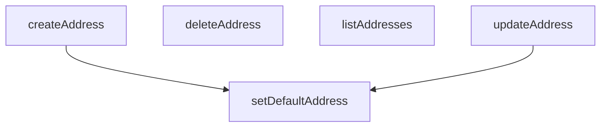

## Genel Bakış
Bu modül, kullanıcı adreslerinin CRUD (oluştur, oku, güncelle, sil) işlemlerini ve varsayılan adres belirleme mantığını yöneten bir servis katmanıdır. Temel olarak veritabanındaki adres kayıtlarının tüm yaşam döngüsünü denetler. Modül, dışarıdan sağlanan bir Supabase istemcisi aracılığıyla veritabanı ile doğrudan etkileşime girer.

## Fonksiyon Grupları
### Adres Temel İşlemleri (CRUD)
Bu grup, kullanıcı adreslerinin standart veri manipülasyonu işlemlerini yönetir; bu, yeni adres oluşturma, mevcut adresleri listeleme ve güncelleme ile adresleri kalıcı olarak silmeyi kapsar.
- listAddresses, createAddress, updateAddress, deleteAddress

### Varsayılan Adres Yönetimi
Kullanıcıların belirli bir adresi teslimat veya fatura amaçlı olarak varsayılan olarak belirlemesini sağlar; bu, ilgili adres kaydının türüne göre özel bir alan güncellenmesini içerir.
- setDefaultAddress

---

## AXIOMS – Mimari Varsayımlar

Bu modül, kullanıcı adresleri için temel CRUD (Oluştur, Listele, Güncelle, Sil) ve varsayılan adres belirleme işlemlerini yöneten bir veri servisidir.

[Aksiyom 1]: Eğer `listAddresses` fonksiyonuna iletilen `supabase` istemcisi (`SupabaseClient<Database>` türünde) geçerli bir Supabase bağlantısı içermiyorsa veya `auth` modülüne erişimi yoksa, fonksiyon kullanıcı adreslerini başarıyla listelemez ve hata fırlatır.

[Aksiyom 2]: Eğer `createAddress` fonksiyonuna iletilen `payload` (`DbUserAddressInsert` türünde), veritabanı şeması (`Database`) tarafından tanımlanan zorunlu alanları içermiyorsa veya geçerli bir yapıda değilse, yeni adres kaydı oluşturulmaz.

[Aksiyom 3]: Eğer `updateAddress` fonksiyonuna iletilen `id` (string), veritabanında var olmayan bir adresin ID'sine aitse, o adres güncellenemez ve operasyon başarısızlıkla sonuçlanır.

[Aksiyom 4]: Eğer `deleteAddress` fonksiyonuna iletilen `id` (string), veritabanında var olmayan bir adresin ID'sine aitse, silme işlemi gerçekleşmez ve fonksiyon hata döndürür.

[Aksiyom 5]: Eğer `setDefaultAddress` fonksiyonuna iletilen `kind` parametresi, izin verilen değerler olan `'shipping'` veya `'billing'` dışındaysa, fonksiyon geçersiz bir parametre hatası fırlatır ve hiçbir veritabanı işlemi gerçekleştirmez.

[Aksiyom 6]: Eğer `setDefaultAddress` fonksiyonuna iletilen `id` (string), veritabanında var olmayan bir adresin ID'sine aitse veya bu adres, belirtilen `kind` (teslimat veya fatura) türü için uygun bir adres türü değilse, varsayılan adres ayarı yapılamaz.

---

## FONKSİYON DETAYLARI

### listAddresses
**Ne yapar**: Kimliği doğrulanmış kullanıcının tüm adreslerini getirir. Adresler varsayılan gönderim durumuna göre sıralanır, ardından oluşturma tarihine göre azalan sırayla listelenir.

**Nasıl yapar**: `user_addresses` tablosundan tüm sütunları seçer, `is_default_shipping` sütunu azalan (true primero) ve ardından `created_at` sütunu azalan sırada sıralar. Veritabanı sorgusu başarılı olduğunda bir dizi adres nesnesi, hata oluştuğunda ise hata fırlatır.

**Parametreler**:
- `supabase`: SupabaseClient<Database> — Aktif Supabase istemci örneği

**Dönüş**: Promise<DbUserAddress[]> — Kullanıcının tüm adreslerini içeren bir dizi nesne

### createAddress
**Ne yapar**: Kimliği doğrulanmış kullanıcı için yeni bir adres kaydı oluşturur.
**Nasıl yapar**: Önce kullanıcının oturumunu doğrular. Ardından, sağlanan `payload` verisini kullanıcının ID'si ile genişleterek veritabanına ekler. `street_address` alanını `address_line`'dan, `address_type` alanını ise `is_default_shipping` bayrağına göre belirler. İşlem başarılı olduktan sonra, `is_default_shipping` veya `is_default_billing` bayrakları true ise ilgili adresi varsayılan olarak ayarlar.
**Parametreler**:
- payload: DbUserAddressInsert — Oluşturulacak adresin tüm verilerini içeren nesne.
- supabase: SupabaseClient — Veritabanı işlemleri için kullanılacak istemci. Opsiyoneldir ve varsayılan olarak modülde tanımlı `defaultClient` kullanılır.
**Dönüş**: Promise<DbUserAddress> — Yeni oluşturulan adres nesnesi.

### updateAddress
**Ne yapar**: Mevcut bir adresi kimliği doğrulanmış kullanıcı adına günceller.
**Nasıl yapar**: Verilen `id` ile eşleşen adres kaydını bulur ve `payload` içindeki alanlarla günceller. `address_line` alanı sağlanmışsa bunu `street_address` alanına eşler. Güncelleme başarılı olduktan sonra, `is_default_shipping` veya `is_default_billing` bayrakları true ise ilgili adresi varsayılan olarak ayarlar.
**Parametreler**:
- id: string — Güncellenecek adresin benzersiz tanımlayıcısı.
- payload: DbUserAddressUpdate — Güncellenecek alanları içeren kısmi veri nesnesi.
- supabase: SupabaseClient — Veritabanı işlemleri için kullanılacak istemci. Opsiyoneldir ve varsayılan olarak modülde tanımlı `defaultClient` kullanılır.
**Dönüş**: Promise<DbUserAddress> — Güncellenmiş adres nesnesi.

### deleteAddress
**Ne yapar**: Kimliği doğrulanmış kullanıcıya ait belirli bir adresi kalıcı olarak siler.
**Nasıl yapar**: Verilen `id` parametresine sahip adres kaydını `user_addresses` tablosundan siler. İşlem başarılıysa `true` değeri döner. Veritabanı silme işleminde bir hata oluşursa bir istisna fırlatır.
**Parametreler**:
- id: string — Silinecek adresin benzersiz tanımlayıcısı.
- supabase: SupabaseClient — Veritabanı işlemleri için kullanılacak istemci. Opsiyoneldir ve varsayılan olarak modülde tanımlı `defaultClient` kullanılır.
**Dönüş**: Promise<boolean> — Silme işlemi başarılıysa `true`.

### setDefaultAddress
**Ne yapar**: Bir adresi kullanıcının varsayılan gönderim veya fatura adresi olarak ayarlar.
**Nasıl yapar**: Önce kullanıcının oturumunu doğrular. Then, kullanıcının tüm adreslerinde belirtilen türdeki (`shipping` veya `billing`) varsayılanlık bayrağını (`is_default_shipping` veya `is_default_billing`) `false` olarak günceller. Bu, mevcut tüm varsayılan adresleri devre dışı bırakır. Ardından, belirtilen `id`'ye sahip adresin aynı bayrağını `true` olarak ayarlayarak onu yeni varsayılan yapar.
**Parametreler**:
- kind: 'shipping' | 'billing' — Varsayılan olarak ayarlanacak adres türü.
- id: string — Varsayılan olarak ayarlanacak adresin benzersiz tanımlayıcısı.
- supabase: SupabaseClient — Veritabanı işlemleri için kullanılacak istemci. Opsiyoneldir ve varsayılan olarak modülde tanımlı `defaultClient` kullanılır.
**Dönüş**: Promise<DbUserAddress> — Varsayılan olarak ayarlanmış güncel adres nesnesi.

---

## İTHALATLAR (IMPORTS)
- import: ../../types/database.types::type { Database }
- import: ../../types/db-rows::type { DbUserAddress, DbUserAddressInsert, DbUserAddressUpdate }
- import: @supabase/supabase-js::type { SupabaseClient }

---

## AST POINTERS

### [N1_NASIL] AST Pointer: address.service.ts::listAddresses
- **params**: `(supabase: SupabaseClient<Database>)`
- **ic_degiskenler**:
  - `data` — supabase'den dönen user_addresses tablosu satırları
  - `error` — supabase sorgusu sırasında oluşan hata nesnesi
- **Dönüş**: `Promise<DbUserAddress[]>` — kullanıcının tüm adresleri varsayılan sıralama ile; hata varsa fırlatılır, veri yoksa boş dizi döner

---

## MERMAID CALL GRAPH

## NODE ID STANDARD

  file: src\lib\services\address.service.ts
  function: src\lib\services\address.service.ts::listAddresses
  function: src\lib\services\address.service.ts::createAddress
  function: src\lib\services\address.service.ts::updateAddress
  function: src\lib\services\address.service.ts::deleteAddress
  function: src\lib\services\address.service.ts::setDefaultAddress

---

## DISA AKTARILANLAR (EXPORTS)
  export: createAddress
  export: deleteAddress
  export: listAddresses
  export: setDefaultAddress
  export: updateAddress