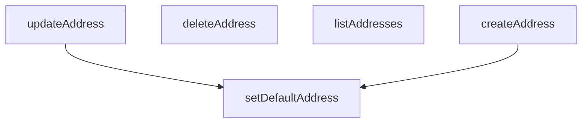

## Genel Bakış
Bu modül, kullanıcı adreslerinin CRUD (oluştur, oku, güncelle, sil) işlemlerini ve varsayılan adres belirleme mantığını yöneten bir servis katmanıdır. Temel olarak veritabanındaki adres kayıtlarının tüm yaşam döngüsünü denetler. Modül, dışarıdan sağlanan bir Supabase istemcisi aracılığıyla veritabanı ile doğrudan etkileşime girer.

## Fonksiyon Grupları
### Adres Temel İşlemleri (CRUD)
Bu grup, kullanıcı adreslerinin standart veri manipülasyonu işlemlerini yönetir; bu, yeni adres oluşturma, mevcut adresleri listeleme ve güncelleme ile adresleri kalıcı olarak silmeyi kapsar.
- listAddresses, createAddress, updateAddress, deleteAddress

### Varsayılan Adres Yönetimi
Kullanıcıların belirli bir adresi teslimat veya fatura amaçlı olarak varsayılan olarak belirlemesini sağlar; bu, ilgili adres kaydının türüne göre özel bir alan güncellenmesini içerir.
- setDefaultAddress

---

## AXIOMS – Mimari Varsayımlar

Bu modül, kullanıcı adresleri için temel CRUD (Oluştur, Listele, Güncelle, Sil) ve varsayılan adres belirleme işlemlerini yöneten bir veri servisidir.

[Aksiyom 1]: Eğer `listAddresses` fonksiyonuna iletilen `supabase` istemcisi (`SupabaseClient<Database>` türünde) geçerli bir Supabase bağlantısı içermiyorsa veya `auth` modülüne erişimi yoksa, fonksiyon kullanıcı adreslerini başarıyla listelemez ve hata fırlatır.

[Aksiyom 2]: Eğer `createAddress` fonksiyonuna iletilen `payload` (`DbUserAddressInsert` türünde), veritabanı şeması (`Database`) tarafından tanımlanan zorunlu alanları içermiyorsa veya geçerli bir yapıda değilse, yeni adres kaydı oluşturulmaz.

[Aksiyom 3]: Eğer `updateAddress` fonksiyonuna iletilen `id` (string), veritabanında var olmayan bir adresin ID'sine aitse, o adres güncellenemez ve operasyon başarısızlıkla sonuçlanır.

[Aksiyom 4]: Eğer `deleteAddress` fonksiyonuna iletilen `id` (string), veritabanında var olmayan bir adresin ID'sine aitse, silme işlemi gerçekleşmez ve fonksiyon hata döndürür.

[Aksiyom 5]: Eğer `setDefaultAddress` fonksiyonuna iletilen `kind` parametresi, izin verilen değerler olan `'shipping'` veya `'billing'` dışındaysa, fonksiyon geçersiz bir parametre hatası fırlatır ve hiçbir veritabanı işlemi gerçekleştirmez.

[Aksiyom 6]: Eğer `setDefaultAddress` fonksiyonuna iletilen `id` (string), veritabanında var olmayan bir adresin ID'sine aitse veya bu adres, belirtilen `kind` (teslimat veya fatura) türü için uygun bir adres türü değilse, varsayılan adres ayarı yapılamaz.

---

## FONKSİYON DETAYLARI

### listAddresses
**Ne yapar**: Kimliği doğrulanmış kullanıcıya ait tüm adreslerin bir listesini getirir. Adresler, varsayılan gönderim durumuna göre (önce varsayılan olanlar) ve ardından oluşturulma tarihine göre (en yeniden en eskiye) sıralanır.
**Nasıl yapar**: Verilen Supabase istemcisini kullanarak `user_addresses` tablosundan tüm kayıtları (`*`) seçer. Sorgu, `is_default_shipping` alanını azalan (`false` ile başlayan, yani `true` olanlar önce gelir) ve ardından `created_at` alanını azalan sırada sıralar. Sorgu başarısız olursa hata fırlatır, başarılı olursa gelen veriyi `DbUserAddress[]` tipine dönüştürerek döndürür.
**Parametreler**:
- supabase: SupabaseClient<Database> — Aktif Supabase istemci örneği. Veritabanı sorgularını yürütmek için kullanılır.
**Dönüş**: Promise<DbUserAddress[]> — Kullanıcının adres nesnelerinden oluşan bir diziyi çözümleyen bir Promise. Veri bulunamazsa boş bir dizi döner.

### createAddress
**Ne yapar**: Kimliği doğrulanmış kullanıcı için yeni bir adres oluşturur. Payload'da belirtilmişse, adresi otomatik olarak varsayılan gönderim veya fatura adresi olarak ayarlar.
**Nasıl yapar**: Önce `supabase.auth.getUser()` ile kimlik doğrulaması yapar ve kullanıcı bilgisini alır. Kullanıcı bulunamazsa hata fırlatır. Ardından gelen `payload`'a `user_id` ekler ve `street_address` alanını `address_line`'dan, `address_type` alanını ise `is_default_shipping` durumuna göre otomatik olarak doldurur. Bu işlenmiş veriyi `user_addresses` tablosuna ekler ve eklenen kaydı döndürür. Son olarak, payload'da `is_default_shipping` veya `is_default_billing` true ise, ilgili varsayılan adresi ayarlamak için `setDefaultAddress` fonksiyonunu çağırır.
**Parametreler**:
- supabase: SupabaseClient<Database> — Aktif Supabase istemci örneği.
- payload: DbUserAddressInsert — Oluşturulacak yeni adresin verilerini içeren nesne. `user_id` hariç tüm adres bilgilerini (adres satırı, türü, varsayılan durumları vb.) içerir.
**Dönüş**: Promise<DbUserAddress> — Yeni oluşturulan adres nesnesini çözümleyen bir Promise.

### updateAddress
**Ne yapar**: Kimliği doğrulanmış kullanıcıya ait mevcut bir adresi günceller. Payload'da belirtilmişse, adresin varsayılan gönderim veya fatura adresi olma durumunu otomatik olarak yönetir.
**Nasıl yapar**: Gelen `payload`'ı bir güncelleme yaması olarak kopyalar. Eğer `payload` içinde `address_line` varsa, bunu `street_address` alanına da atar. Bu yamayı, verilen `id`'ye sahip adres kaydını güncellemek için kullanır. Güncelleme başarılı olursa ve `payload`'da `is_default_shipping` veya `is_default_billing` true ise, ilgili varsayılan adresi ayarlamak için `setDefaultAddress` fonksiyonunu çağırır.
**Parametreler**:
- supabase: SupabaseClient<Database> — Aktif Supabase istemci örneği.
- id: string — Güncellenecek adresin benzersiz tanımlayıcısı.
- payload: DbUserAddressUpdate — Adresin güncellenecek kısmi verilerini içeren nesne. Tüm alanlar zorunlu değildir.
**Dönüş**: Promise<DbUserAddress> — Güncellenmiş adres nesnesini çözümleyen bir Promise.

### deleteAddress
**Ne yapar**: Kimliği doğrulanmış kullanıcıya ait belirli bir adresi, verilen kimlik numarasına (ID) göre siler.
**Nasıl yapar**: Verilen `id`'ye sahip kaydı `user_addresses` tablosundan siler. Silme işlemi başarısız olursa hata fırlatır, başarılı olursa `true` değerini döndürür.
**Parametreler**:
- supabase: SupabaseClient<Database> — Aktif Supabase istemci örneği.
- id: string — Silinecek adresin benzersiz tanımlayıcısı.
**Dönüş**: Promise<boolean> — Silme işleminin başarılı olması durumunda `true` değerini çözümleyen bir Promise.

### setDefaultAddress
**Ne yapar**: Belirli bir adresi, belirtilen tür için (gönderim veya fatura) varsayılan adres olarak ayarlar. Aynı türde daha önce ayarlanmış olan diğer varsayılan adreslerin bayrağını otomatik olarak temizler.
**Nasıl yapar**: Önce kimlik doğrulaması yapar ve kullanıcı bilgisini alır. Kullanıcı bulunamazsa hata fırlatır. `kind` parametresine göre ilgili bayrak alanını (`is_default_shipping` veya `is_default_billing`) belirler. İlk olarak, bu kullanıcının tüm adreslerinde bu bayrak alanını `false` yaparak mevcut varsayılanları temizler. Ardından, verilen `id`'ye sahip adrese bu bayrak alanını `true` olarak ayarlar ve güncellenmiş adres kaydını döndürür.
**Parametreler**:
- supabase: SupabaseClient<Database> — Aktif Supabase istemci örneği.
- kind: 'shipping' | 'billing' — Varsayılan olarak ayarlanacak adres türü. 'shipping' gönderim, 'billing' fatura adresini ifade eder.
- id: string — Varsayılan olarak ayarlanacak adresin benzersiz tanımlayıcısı.
**Dönüş**: Promise<DbUserAddress> — Varsayılan olarak ayarlanmış (güncellenmiş) adres nesnesini çözümleyen bir Promise.

---

## İTHALATLAR (IMPORTS)
- import: ../../types/database.types::type { Database }
- import: ../../types/db-rows::type { DbUserAddress, DbUserAddressInsert, DbUserAddressUpdate }
- import: @supabase/supabase-js::type { SupabaseClient }

---

## AST POINTERS

### [N1_NASIL] AST Pointer: src/lib/services/address.service.ts::listAddresses
- **params**: `supabase` — SupabaseClient<Database> tipinde, veritabanı bağlantısı
- **ic_degiskenler**:
  - `data` — supabase sorgusundan dönen user_addresses satırları (select('*') sonucu)
  - `error` — sorgu sırasında oluşan hata nesnesi; varsa throw ile fırlatılır
- **Dönüş**: `DbUserAddress[]` — is_default_shipping azalan, created_at azalan sırayla sıralanmış adres dizisi; hata yoksa data, data yoksa boş dizi döner

### [N2_NASIL] AST Pointer: src/lib/services/address.service.ts::createAddress
- **params**: `supabase` — SupabaseClient<Database> tipinde, veritabanı bağlantısı; `payload` — DbUserAddressInsert tipinde, oluşturulacak adres verisi
- **ic_degiskenler**:
  - `authData` — supabase.auth.getUser() sonucu; kimlik doğrulama verisini taşır
  - `userError` — getUser() sırasında oluşan hata; varsa throw ile fırlatılır
  - `user` — authData?.user; mevcut oturum açmış kullanıcı nesnesi; yoksa 'Not authenticated' hatası fırlatılır
  - `dbPayload` — DbUserAddressInsert tipinde, payload üzerine user_id, street_address (payload.street_address veya payload.address_line) ve address_type (payload.address_type veya is_default_shipping'e göre 'shipping'/'billing') eklenmiş nihai kayıt verisi
  - `data` — insert sorgusundan dönen tekil DbUserAddress satırı
  - `error` — insert sorgusu sırasında oluşan hata; varsa throw ile fırlatılır
- **Dönüş**: `DbUserAddress` — oluşturulan adres kaydı; insert sonrası payload.is_default_shipping true ise setDefaultAddress(supabase, 'shipping', data.id), payload.is_default_billing true ise setDefaultAddress(supabase, 'billing', data.id) çağrılır

### [N3_NASIL] AST Pointer: src/lib/services/address.service.ts::updateAddress
- **params**: `supabase` — SupabaseClient<Database> tipinde, veritabanı bağlantısı; `id` — güncellenecek adresin string tipinde kimliği; `payload` — DbUserAddressUpdate tipinde, güncelleme verisi
- **ic_degiskenler**:
  - `updatePatch` — DbUserAddressUpdate tipinde, payload'ın kopyası; payload.address_line varsa updatePatch.street_address = payload.address_line olarak atanır
  - `data` — update sorgusundan dönen tekil DbUserAddress satırı
  - `error` — update sorgusu sırasında oluşan hata; varsa throw ile fırlatılır
- **Dönüş**: `DbUserAddress` — güncellenen adres kaydı; update sonrası payload.is_default_shipping true ise setDefaultAddress(supabase, 'shipping', id), payload.is_default_billing true ise setDefaultAddress(supabase, 'billing', id) çağrılır

### [N4_NASIL] AST Pointer: src/lib/services/address.service.ts::deleteAddress
- **params**: `supabase` — SupabaseClient<Database> tipinde, veritabanı bağlantısı; `id` — silinecek adresin string tipinde kimliği
- **ic_degiskenler**:
  - `error` — delete sorgusu sırasında oluşan hata; varsa throw ile fırlatılır
- **Dönüş**: `boolean` — silme başarılıysa true döner; hata varsa throw ile fırlatılır

### [N5_NASIL] AST Pointer: src/lib/services/address.service.ts::setDefaultAddress
- **params**: `supabase` — SupabaseClient<Database> tipinde, veritabanı bağlantısı; `kind` — 'shipping' | 'billing; varsayılan adres türü; `id` — varsayılan yapılacak adresin string tipinde kimliği
- **ic_degiskenler**:
  - `authData` — supabase.auth.getUser() sonucu; kimlik doğrulama verisini taşır
  - `userError` — getUser() sırasında oluşan hata; varsa throw ile fırlatılır
  - `user` — authData?.user; mevcut oturum açmış kullanıcı nesnesi; yoksa 'Not authenticated' hatası fırlatılır
  - `flag` — 'is_default_shipping' | 'is_default_billing; kind === 'shipping' ise 'is_default_shipping', aksi halde 'is_default_billing'
  - `clearPatch` — DbUserAddressUpdate tipinde, { [flag]: false }; aynı kullanıcıya ait diğer adreslerdeki ilgili varsayılan bayrağını temizlemek için kullanılır
  - `clear` — clearPatch ile user_addresses tablosunda user_id'ye göre update sorgusu sonucu; clear.error varsa throw ile fırlatılır
  - `setPatch` — DbUserAddressUpdate tipinde, { [flag]: true }; belirtilen adrese varsayılan bayrağını atamak için kullanılır
  - `data` — setPatch ile id'ye göre update sorgusundan dönen tekil DbUserAddress satırı
  - `error` — setPatch update sorgusu sırasında oluşan hata; varsa throw ile fırlatılır
- **Dönüş**: `DbUserAddress` — varsayılan olarak ayarlanan adres kaydı

---

## MERMAID CALL GRAPH

## NODE ID STANDARD

  file: src\lib\services\address.service.ts
  function: src\lib\services\address.service.ts::listAddresses
  function: src\lib\services\address.service.ts::createAddress
  function: src\lib\services\address.service.ts::updateAddress
  function: src\lib\services\address.service.ts::deleteAddress
  function: src\lib\services\address.service.ts::setDefaultAddress

---

## DISA AKTARILANLAR (EXPORTS)
  export: createAddress
  export: deleteAddress
  export: listAddresses
  export: setDefaultAddress
  export: updateAddress