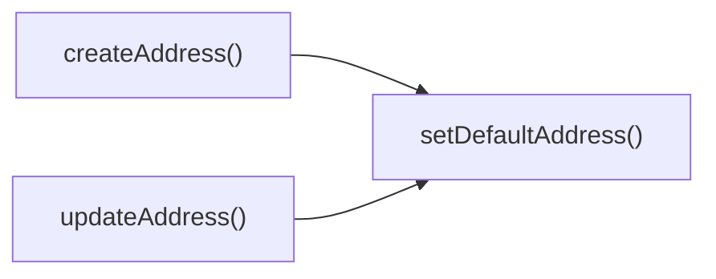

## Genel Bakış
Bu modül, VentHub HVAC platformunda kullanıcı adreslerinin yönetimini üstlenen merkezi servistir. Kullanıcıların fatura ve teslimat gibi farklı türdeki adresleriyle ilgili tüm işlevleri sunarak, adres verilerinin güvenli ve tutarlı bir şekilde işlenmesini sağlar.

## Fonksiyon Grupları
### Temel Adres CRUD İşlemleri
Kullanıcı adreslerinin yaşam döngüsünü yöneten temel işlemleri içerir, mevcut adreslerin listelenmesinden kalıcı olarak silinmesine kadar tüm temel işlevleri sunar.
- listAddresses, createAddress, updateAddress, deleteAddress

### Varsayılan Adres Yönetimi
Kullanıcıların seçtikleri adresleri fatura veya teslimat süreçleri için varsayılan olarak atama işlemini gerçekleştirir, ilgili adresin varsayılan duruma geçmesini sağlar.
- setDefaultAddress

---

## AXIOMS – Mimari Varsayımlar
Kullanıcı adreslerinin yönetimini gerçekleştiren bu servis, adres verilerinin saklandığı erişilebilir bir veritabanı, işlem yapacak kullanıcının erişim yetkisinin doğrulanması, tüm gelen istek parametreleri ve yüklerinin tanımlı tiplere uygun olması koşullarına dayanarak çalışır.

[Aksiyom 1]: Eğer adres verilerini depolamak ve sorgulamak için kullanılan aktif bir veritabanı bağlantısı yoksa, tüm adres işlemleri (listeleme, oluşturma, güncelleme, silme, varsayılan adres atama) başarısız olur.
[Aksiyom 2]: Eğer updateAddress, deleteAddress ve setDefaultAddress fonksiyonlarında kullanılan adres ID'si için veritabanında kayıtlı mevcut bir adres yoksa, ilgili güncelleme, silme veya varsayılan yapma işlemleri gerçekleştirilemez.
[Aksiyom 3]: Eğer setDefaultAddress fonksiyonundaki 'shipping' | 'billing' tür kısıtlaması uygulanmaz, yani kind parametresine bu iki değer dışında bir değer gelirse, geçersiz türde varsayılan adres kaydı oluşur.
[Aksiyom 4]: Eğer createAddress fonksiyonuna gelen DbUserAddressInsert tipindeki yük (payload) veritabanı şemasına uyumlu değilse, yeni adres kaydı veritabanına eklenemez ve adres oluşturma işlemi başarısız olur.
[Aksiyom 5]: Eğer updateAddress fonksiyonuna gelen DbUserAddressUpdate tipindeki yük (payload) veritabanı şemasına uyumsuz ise, adres güncelleme işlemi başarısız olur.
[Aksiyom 6]: Eğer tüm adres işlemlerini başlatan kullanıcının ilgili adrese erişme ve değişiklik yapma yetkisi doğrulanmazsa, yetkisiz kişiler adres verilerini değiştirebilir, silebilir veya görüntüleyebilir, veri güvenliği ihlal olur.

---

## FONKSIYON DETAYLARI

### listAddresses
**Ne yapar**: Doğrulanmış kullanıcının sahip olduğu tüm adresleri listeler. Adresler sıralanırken önce varsayılan kargo durumu öncelikli tutulur, ardından oluşturulma tarihine göre azalan sırada sıralanır.
**Nasıl yapar**: Veritabanı üzerinden kullanıcının tüm adreslerini sorgulayarak çeker, sıralama kriterlerini sorgu aşamasında uygulayarak sonucu iletir. Veritabanı sorgusunun herhangi bir nedenle başarısız olması durumunda hata fırlatır.
**Parametreler**:
- Bu fonksiyon herhangi bir giriş parametresi almaz
**Dönüş**: Kullanıcı adresi nesnelerinden oluşan bir diziyi çözümleyen `Promise<DbUserAddress[]>` nesnesi. İşlem başarısız olursa veritabanı hatası fırlatır.

### createAddress
**Ne yapar**: Doğrulanmış kullanıcı için yeni bir adres oluşturur. Gönderilen yükte belirtilmesi halinde oluşturulan adresi otomatik olarak varsayılan adres olarak ayarlar.
**Nasıl yapar**: Önce kullanıcının oturum açtığını doğrular, yetkilendirme başarılı olursa gelen adres verilerini veritabanına ekler. Yükte varsayılan adres işareti aktifse bu durumu kayıt sırasında uygular. Kullanıcı yetkili değilse veya veritabanına ekleme işlemi başarısız olursa hata fırlatır.
**Parametreler**:
- payload: DbUserAddressInsert — Oluşturulacak yeni adresin tüm gerekli verilerini içeren nesne
**Dönüş**: Yeni oluşturulmuş kullanıcı adresi nesnesini çözümleyen `Promise<DbUserAddress>` nesnesi. İşlem başarısız olursa yetkilendirme veya veritabanı hatası fırlatır.

### updateAddress
**Ne yapar**: Doğrulanmış kullanıcıya ait mevcut bir adresi günceller. Güncelleme yükünde belirtilmesi halinde ilgili adresi otomatik olarak varsayılan adres olarak ayarlar.
**Nasıl yapar**: Benzersiz kimliği ile güncellenecek adresi veritabanında bulur, gelen kısmi verilerle mevcut adres kaydını günceller. Varsayılan adres durumu ayarı istenmişse bu durumu güncelleme sırasında uygular. Veritabanı güncelleme işlemi başarısız olursa hata fırlatır.
**Parametreler**:
- id: string — Güncellenecek adresin benzersiz tanımlayıcısı
- payload: DbUserAddressUpdate — Adreste güncellenecek kısmi verileri içeren nesne
**Dönüş**: Güncellenmiş kullanıcı adresi nesnesini çözümleyen `Promise<DbUserAddress>` nesnesi. İşlem başarısız olursa veritabanı hatası fırlatır.

### deleteAddress
**Ne yapar**: Doğrulanmış kullanıcıya ait belirli bir adresi benzersiz kimliği ile veritabanından siler.
**Nasıl yapar**: Gelen adres kimliği ile hedef kaydı veritabanında bulur ve silme işlemini gerçekleştirir. Silme işlemi herhangi bir nedenle başarısız olursa hata fırlatır.
**Parametreler**:
- id: string — Silinecek adresin benzersiz tanımlayıcısı
**Dönüş**: Silme işleminin başarılı olması halinde `true` değerini çözümleyen `Promise<boolean>` nesnesi. İşlem başarısız olursa veritabanı silme hatası fırlatır.

### setDefaultAddress
**Ne yapar**: Belirli bir adresi varsayılan kargo veya fatura adresi olarak ayarlar. Aynı türdeki daha önce varsayılan olarak işaretlenmiş tüm adreslerin varsayılan bayrağını otomatik olarak kaldırır, yalnızca seçilen adresi o türün varsayılan adresi yapar.
**Nasıl yapar**: Önce kullanıcının oturum durumunu doğrular, ardından gelen adresteki tür bilgisine göre aynı türdeki tüm mevcut varsayılan adreslerin bayrağını sıfırlar. Hedef adresin varsayılan bayrağını aktif ederek veritabanı kayıtlarını günceller. Kullanıcı yetkili değilse veya veritabanı güncellemeleri başarısız olursa hata fırlatır.
**Parametreler**:
- kind: 'shipping' | 'billing' — Varsayılan olarak ayarlanacak adresin türü, yalnızca kargo için 'shipping' veya fatura için 'billing' değerlerini alabilir
- id: string — Varsayılan olarak ayarlanacak adresin benzersiz tanımlayıcısı
**Dönüş**: Güncellenmiş kullanıcı adresi nesnesini çözümleyen `Promise<DbUserAddress>` nesnesi. İşlem başarısız olursa yetkilendirme veya veritabanı güncelleme hatası fırlatır.

---

## AST POINTERS

### [N1_NASIL] AST Pointer: src/lib/services/address.service.ts::listAddresses
- **params**: (parametre yok)
- **ic_degiskenler**:
  - `data` — Supabase user_addresses sorgusundan dönen adres listesi, tür dönüşümü ile döndürülür
  - `error` — Supabase sorgusu sırasında oluşabilecek hata nesnesi, hata varsa fırlatılır
  - `supabase` — Enjekte edilen Supabase istemcisi, kullanıcı adreslerini veritabanından çekmek için kullanılır
- **Dönüş**: Promise<DbUserAddress[]>

### [N2_NASIL] AST Pointer: src/lib/services/address.service.ts::createAddress
- **params**: (payload: DbUserAddressInsert)
- **ic_degiskenler**:
  - `authData` — Supabase auth.getUser() çağrısından dönen oturumlu kullanıcı verisi
  - `userError` — Kullanıcı bilgisi alınırken oluşabilecek hata nesnesi, hata varsa fırlatılır
  - `user` — Oturum açmış mevcut kullanıcı nesnesi, kimlik doğrulama kontrolü için kullanılır
  - `dbPayload` — Veritabanına eklenecek, kullanıcı kimliği eklenmiş, adres alanları düzenlenmiş yük nesnesi
  - `payload.street_address` — Gelen yükteki sokak adresi, boşsa address_line alanından doldurulur
  - `payload.address_line` — Yedek adres alanı, street_address boşsa street_address değerine atanır
  - `payload.address_type` — Adresin türü (shipping/billing), gelmezse varsayılan bayraklara göre atanır
  - `payload.is_default_shipping` — Adresin varsayılan kargo adresi olup olmadığını belirten bayrak
  - `payload.is_default_billing` — Adresin varsayılan fatura adresi olup olmadığını belirten bayrak
  - `data` — Supabase insert işleminden dönen eklenmiş adres verisi, fonksiyondan döndürülür
  - `error` — Adres ekleme işlemi sırasında oluşabilecek hata nesnesi, hata varsa fırlatılır
  - `setDefaultAddress` — İç fonksiyon, ilgili varsayılan bayrakları true ise varsayılan adresi ayarlamak için çağrılır
- **Dönüş**: Promise<DbUserAddress>

### [N3_NASIL] AST Pointer: src/lib/services/address.service.ts::updateAddress
- **params**: (id: string, payload: DbUserAddressUpdate)
- **ic_degiskenler**:
  - `updatePatch` — Veritabanında güncellenecek, adres alanları düzenlenmiş yük nesnesi, gelen payload'dan türetilir
  - `payload.address_line` — Güncelleme yükündeki yedek adres alanı, doluysa street_address alanına kopyalanır
  - `payload.is_default_shipping` — Adresin yeni varsayılan kargo adresi olup olmadığını belirten bayrak
  - `payload.is_default_billing` — Adresin yeni varsayılan fatura adresi olup olmadığını belirten bayrak
  - `data` — Supabase update işleminden dönen güncellenmiş adres verisi, fonksiyondan döndürülür
  - `error` — Adres güncelleme işlemi sırasında oluşabilecek hata nesnesi, hata varsa fırlatılır
  - `setDefaultAddress` — İç fonksiyon, ilgili varsayılan bayrakları true ise yeni varsayılan adresi ayarlamak için çağrılır
- **Dönüş**: Promise<DbUserAddress>

### [N4_NASIL] AST Pointer: src/lib/services/address.service.ts::deleteAddress
- **params**: (id: string)
- **ic_degiskenler**:
  - `error` — Adres silme işlemi sırasında oluşabilecek hata nesnesi, hata varsa fırlatılır
  - `supabase` — Enjekte edilen Supabase istemcisi, user_addresses tablosundaki ilgili kaydı silmek için kullanılır
- **Dönüş**: Promise<boolean>

### [N5_NASIL] AST Pointer: src/lib/services/address.service.ts::setDefaultAddress
- **params**: (kind: 'shipping' | 'billing', id: string)
- **ic_degiskenler**:
  - `authData` — Supabase auth.getUser() çağrısından dönen oturumlu kullanıcı verisi
  - `userError` — Kullanıcı bilgisi alınırken oluşabilecek hata nesnesi, hata varsa fırlatılır
  - `user` — Oturum açmış mevcut kullanıcı nesnesi, kendi adreslerini düzenleme yetkisi kontrolü için kullanılır
  - `flag` — Gelen türe göre ayarlanacak veritabanı bayrak ismi (is_default_shipping / is_default_billing)
  - `clearPatch` — Kullanıcının tüm mevcut adreslerinde ilgili bayrağı false yapmak için kullanılacak güncelleme yükü
  - `clear` — Eski adreslerin bayraklarını sıfırlama işleminin sonucu, hata kontrolü için kullanılır
  - `setPatch` — Seçilen adreste ilgili bayrağı true yapmak için kullanılacak güncelleme yükü
  - `data` — Son olarak güncellenmiş, yeni varsayılan olarak ayarlanmış adres verisi, fonksiyondan döndürülür
  - `error` — Bayrak ayarlama işlemi sırasında oluşabilecek hata nesnesi, hata varsa fırlatılır
- **Dönüş**: Promise<DbUserAddress>

---

## ÇAĞRI HARİTASI

### Disariya Cagrilar (Outgoing)
updateAddress() adres güncelleme işlemi sonrası adres ayarlaması yapmak için setDefaultAddress() fonksiyonunu çağırır; createAddress() yeni adres oluşturulduktan sonra varsayılan adres ataması için aynı şekilde setDefaultAddress() fonksiyonunu tetikler.

### Disaridan Cagrilanlar (Incoming)
Sağlanan çağrı verisinde bu modülün fonksiyonlarını kullanan herhangi bir dış dosya veya fonksiyon belirtilmemiştir.

### Ic Ice Fonksiyonlar (Nested)
Yok

---

## DOSYA-İÇİ ÇAĞRI GRAFİĞİ
  createAddress() → setDefaultAddress()
  updateAddress() → setDefaultAddress()

---

## NODE ID STANDARD

  file: src\lib\services\address.service.ts
  function: src\lib\services\address.service.ts::listAddresses
  function: src\lib\services\address.service.ts::createAddress
  function: src\lib\services\address.service.ts::updateAddress
  function: src\lib\services\address.service.ts::deleteAddress
  function: src\lib\services\address.service.ts::setDefaultAddress

---

## DISA AKTARILANLAR (EXPORTS)
  export: createAddress
  export: deleteAddress
  export: listAddresses
  export: setDefaultAddress
  export: updateAddress