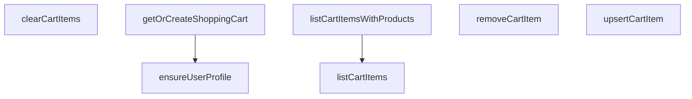

## Genel Bakış
Bu modül, VentHub HVAC platformunda alışveriş sepeti yönetimini merkezi olarak sağlayan servis katmanıdır. Kullanıcının sepetteki ürünlerle gerçekleştireceği tüm işlemleri (oluşturma, okuma, güncelleme, silme) Supabase veritabanı üzerindeki tek bir sepet üzerinden yönetir. Modül, kullanıcı başına tek sepet prensibini garanti altına alarak veri tutarlılığını korur.

## Fonksiyon Grupları
### Sepet ve Profil Hazırlığı
Sepet işlemlerine başlamadan önce gerekli altyapıyı kurar. Kullanıcının veritabanında bir profile sahip olduğunu doğrular ve kullanıcıya atanmış bir sepet olmadığını tespit ettiğinde yeni bir sepet oluşturur.

- ensureUserProfile, getOrCreateShoppingCart

### Sepet İçeriği Sorgulama
Sepetteki ürünlerin okunmasına yönelik fonksiyonları kapsar. Ya sadece sepet kalemlerinin temel bilgilerini ya da bu kalemlerin ait olduğu ürün detaylarıyla zenginleştirilmiş tam bir listeyi getirir.

- listCartItems, listCartItemsWithProducts

### Sepet İçeriği Değişiklikleri
Sepet içeriğinin tüm yazma odaklı işlemlerini yönetir. Ürün ekleme/güncelleme, tek bir ürünü sepetten çıkarma veya sepetin tüm içeriğini tamamen temizleme gibi değişiklikleri gerçekleştirir.

- upsertCartItem, removeCartItem, clearCartItems

---

## AXIOMS – Mimari Varsayımlar

Bu modül, Supabase tabanlı bir alışveriş sepeti yönetim servisi olup aşağıdaki mimari varsayımlar üzerine kurulmuştur:

**[Aksiyom 1]:** Eğer `SupabaseClient<Database>` nesnesi sağlanmamışsa veya geçerli bir veritabanı bağlantısı içermiyorsa, tüm fonksiyonlar başarısız olur. (Tüm fonksiyonlar bu parametreyi zorunlu olarak alır)

**[Aksiyom 2]:** Eğer `userId` parametresi geçerli bir Supabase Auth kullanıcısına ait değilse (örn: silinmiş veya askıya alınmış hesap), `ensureUserProfile` ve `getOrCreateShoppingCart` fonksiyonları beklenmeyen sonuç döndürür.

**[Aksiyom 3]:** Eğer `cartId` parametresi veritabanında mevcut bir alışveriş sepetine ait değilse, `listCartItems`, `listCartItemsWithProducts`, `upsertCartItem`, `removeCartItem` ve `clearCartItems` fonksiyonları boş veya hatalı sonuç döndürür.

**[Aksiyom 4]:** Eğer `upsertCartItem` çağrısında `quantity` parametresi `0` veya negatif bir değer olarak verilirse, modülün davranış炭炭炭炭炭炭炭炭炭炭炭炭炭炭炭炭炭炭炭炭炭炭炭炭炭炭炭炭炭炭炭炭炭炭炭炭炭炭炭炭炭炭炭炭炭炭炭炭炭炭炭炭炭炭炭炭炭炭炭炭炭炭炭炭炭炭炭炭炭炭炭炭炭炭炭炭炭炭炭炭炭炭炭炭炭炭炭炭炭炭炭炭炭炭炭炭炭炭炭炭炭炭炭炭炭炭炭炭炭炭炭炭炭炭炭炭炭炭炭炭炭炭炭炭炭炭炭炭炭炭炭炭炭炭炭炭炭炭炭炭炭炭炭炭炭炭炭炭炭炭炭炭炭炭炭炭炭炭炭炭炭炭炭炭炭炭炭炭炭炭炭炭炭炭炭炭炭炭炭炭炭炭炭炭炭炭炭炭炭炭炭炭炭炭炭炭炭炭炭炭炭炭炭炭炭炭炭炭炭炭炭炭炭炭炭炭炭炭炭炭炭炭炭炭炭炭炭炭炭炭炭炭炭炭炭炭炭炭炭炭炭炭炭炭炭炭炭炭炭炭炭炭炭炭炭炭炭炭炭炭炭炭炭炭炭炭炭炭炭炭炭炭炭炭炭炭炭炭炭炭炭炭炭炭炭炭炭炭炭炭炭炭炭炭炭炭炭炭炭炭炭炭炭炭炭炭炭炭炭炭炭炭炭炭炭炭炭炭炭炭炭炭炭炭炭炭炭炭炭炭炭炭炭炭炭炭炭炭炭炭炭炭炭炭炭炭炭炭炭炭炭炭炭炭炭炭炭炭炭炭炭炭炭炭炭炭炭炭炭炭炭炭炭炭炭炭炭炭炭炭炭炭炭炭炭炭炭炭炭炭炭炭炭炭炭炭炭炭炭炭炭炭炭炭炭炭炭炭炭炭炭炭炭炭炭炭炭炭炭炭炭炭炭炭炭炭炭炭炭炭炭炭炭炭炭炭炭炭炭炭炭炭炭炭炭炭炭炭炭炭炭炭炭炭炭炭炭炭炭炭炭炭炭炭炭炭炭炭炭炭炭炭炭炭炭炭炭炭炭炭炭炭炭炭炭炭炭炭炭炭炭炭炭炭炭炭炭炭炭炭炭炭炭炭炭炭炭炭炭炭炭炭炭炭炭炭炭炭炭炭炭炭炭炭炭炭炭炭炭炭炭炭炭炭炭炭炭炭炭炭炭炭炭炭炭炭炭炭炭炭炭炭炭炭炭炭炭炭炭炭炭炭炭炭炭炭炭炭炭炭炭炭炭炭炭炭炭炭炭炭炭炭炭炭炭炭炭炭炭炭炭炭炭炭炭炭炭炭炭炭炭炭炭炭炭

---

## FONKSİYON DETAYLARI

### ensureUserProfile

**Ne yapar**: Belirli bir kullanıcı için `user_profiles` tablosunda bir profil kaydı olup olmadığını kontrol eder; eğer yoksa yeni bir profil oluşturur. Bu fonksiyon, ngoại anahtar (foreign key) kısıtlamalarını karşılamak için alışveriş sepeti oluşturma sürecinden önce çağrılır.

**Nasıl yapar**: Önce Supabase üzerinden `user_profiles` tablosunda ilgili `userId` ile eşleşen bir kayıt sorgular. `maybeSingle()` kullanarak kayıt bulunup bulunmadığını kontrol eder. Eğer kayıt mevcutsa `true` döner. Kayıt bulunamazsa veya bir hata oluşursa, `insert` işlemiyle yeni bir profil kaydı oluşturmayı dener. Her iki aşama da `try-catch` bloğu ile sarılmıştır; herhangi bir hata durumunda sessizce `false` döner.

**Parametreler**:
- `supabase`: SupabaseClient<Database> — Veritabanı işlemleri için aktif Supabase istemcisi
- `userId`: string — Profili oluşturulacak kullanıcının benzersiz tanımlayıcısı (UUID)

**Dönüş**: `Promise<boolean>` — Profil mevcutsa veya başarıyla oluşturulduysa `true`, herhangi bir hata durumunda `false` döner.

### getOrCreateShoppingCart
**Ne yapar**: Belirtilen kullanıcı için mevcut bir alışveriş sepetini getirir veya yeni bir tane oluşturur. Yeni sepet oluşturulurken kullanıcının profil kaydı eksikse, foreign key kısıtlamasını karşılamak için önce profil kaydını güvenli bir şekilde oluşturmaya çalışır.
**Nasıl yapar**: Önce `shopping_carts` tablosunda `userId`'ye ait mevcut bir sepet sorgular. Bulunamazsa yeni bir sepet插入 etmeye çalışır. Eğer insertion, profil kaydı eksikliğinden kaynaklanan bir foreign key hatası (kod `23503`) verirse, `ensureUserProfile` fonksiyonunu çağırarak profili oluşturur ve insertion işlemini tekrar dener. Benzersizlik çakışması (kod `23505` veya `409`) oluşursa, sepeti tekrar sorgulayarak mevcut kaydı döner. Hala bir hata varsa fırlatır.
**Parametreler**:
- `userId`: `string` — Alışveriş sepatine ait olacak olan kullanıcının benzersiz tanımlayıcısı (UUID).
- `supabase`: `any` (isteğe bağlı) — Varsayılan olarak `defaultClient` kullanılır, Supabase istemcisi.
**Dönüş**: `Promise<DbShoppingCart>` — Kullanıcının alışveriş sepatine ait veritabanı kaydı.
**Fırlatır**: `Error` — Sepet oluşturma başarısız olursa veya düzeltilemeyen bir veritabanı hatası oluşursa.

### listCartItems
**Ne yapar**: Belirtilen alışveriş sepetindeki tüm ürün kalemlerini getirir.
**Nasıl yapar**: Bu fonksiyonun gövdesi sağlanmamıştır, ancak docstring'den anlaşıldığı üzere `cart_items` tablosunu sorgulayarak ilgili `cart_id`'ye sahip tüm kayıtları döner. Sorgulama başarısız olursa hata fırlatır.
**Parametreler**:
- `cartId`: `string` — Ürün kalemleri getirilecek olan alışveriş sepetinin benzersiz tanımlayıcısı.
- `supabase`: `any` (isteğe bağlı) — Varsayılan olarak `defaultClient` kullanılır, Supabase istemcisi.
**Dönüş**: `Promise<DbCartItem[]>` — Sepetteki ürün kalemlerinin bir dizisi; sepet boşsa boş bir dizi döner.
**Fırlatır**: `Error` — Veritabanı sorgulaması başarısız olursa.

### listCartItemsWithProducts
**Ne yapar**: Alışveriş sepetindeki ürün kalemlerini getirir ve her birini ilgili alan adı ürünüyle zenginleştirerek döner. Bu, sepetteki ürünlerin adlarını, görsellerini ve fiyatlarını görüntülemek için kullanışlıdır.
**Nasıl yapar**: İlk olarak `listCartItems` fonksiyonunu çağırarak sepet kalemlerini alır. Kalemlerin `product_id` değerlerini benzersiz bir küme oluşturarak `products` tablosundan toplu olarak ürünleri sorgular. Sonra, her bir veritabanı ürünü(`DbProduct`) alan adı ürün modeline(`Product`) dönüştürerek bir harita oluşturur. Sepet kalemlerini bu haritayla eşleştirerek, her birinin hem ham sepet kalemini hem de alan adı ürününü içeren nesnelerden oluşan bir dizi döner. Eşleşme sağlanamayan ürünler filtrelenir.
**Parametreler**:
- `cartId`: `string` — Ürün kalemleri ve ürün detayları getirilecek olan alışveriş sepetinin benzersiz tanımlayıcısı.
- `supabase`: `any` (isteğe bağlı) — Varsayılan olarak `defaultClient` kullanılır, Supabase istemcisi.
**Dönüş**: `Promise<{ item: DbCartItem; product: Product }[]>` — Her biri bir sepet kalemi ve ilgili alanadı ürünü nesnesi içeren dizi.
**Fırlatır**: `Error` — Ürün kalemleri veya ürün detayları getirme başarısız olursa.

### upsertCartItem
**Ne yapar**: Bir ürünü alışveriş sepetine ekler; ürün zaten sepette varsa miktarını ve fiyatlandırma bilgilerini günceller.
**Nasıl yapar**: Belirtilen `cartId` ve `_productId` kombinasyonuna sahip bir sepet kalemi olup olmadığını `cart_items` tablosunda sorgular. Eğer kayıt varsa, `quantity`, isteğe bağlı `unitPrice` ve `priceListId` alanlarını günceller. Kayıt yoksa yeni bir sepet kalemi插入 eder. Her iki durumda da, operation sonucunda oluşan DbCartItem dizisini döner.
**Parametreler**:
- `params`: `object` — Eklenecek veya güncellenecek sepet kalemi detaylarını içeren nesne.
  - `cartId`: `string` — Alışveriş sepatinin tanımlayıcısı.
  - `_productId`: `string` — Eklenecek veya güncellenecek olan ürünün tanımlayıcısı.
  - `quantity`: `number` — Ürünün istenen miktarı.
  - `unitPrice`: `number | null` (isteğe bağlı) — Ürün birim fiyatının üzerine yazılacak değer.
  - `priceListId`: `string | null` (isteğe bağlı) — Uygulanan fiyat listesinin tanımlayıcısı.
- `supabase`: `any` (isteğe bağlı) — Varsayılan olarak `defaultClient` kullanılır, Supabase istemcisi.
**Dönüş**: `Promise<DbCartItem[]>` — Güncellenmiş veya yeni eklenmiş sepet kalemini içeren dizi.
**Fırlatır**: `Error` — Veritabanı upsert işlemi başarısız olursa.

### removeCartItem
**Ne yapar**: Belirli bir ürünü bir alışveriş sepetinden kaldırır.
**Nasıl yapar**: `cart_items` tablosunda, belirtilen `cartId` ve `productId` kombinasyonuyla eşleşen kaydı silme işlemi gerçekleştirir. İşlem başarıyla tamamlanırsa `true`, aksi halde bir hata fırlatır.
**Parametreler**:
- `cartId`: `string` — Ürünün kaldırılacağı alışveriş sepetinin benzersiz tanımlayıcısı.
- `productId`: `string` — Sepetten kaldırılacak olan ürünün benzersiz tanımlayıcısı.
- `supabase`: `any` (isteğe bağlı) — Varsayılan olarak `defaultClient` kullanılır, Supabase istemcisi.
**Dönüş**: `Promise<boolean>` — Silme işlemi başarılıysa `true`.
**Fırlatır**: `Error` — Veritabanı silme işlemi başarısız olursa.

### clearCartItems
**Ne yapar**: Belirtilen alışveriş sepetindeki tüm ürün kalemlerini kaldırır.
**Nasıl yapar**: `cart_items` tablosunda, belirtilen `cartId`'ye sahip tüm kayıtları silme işlemi gerçekleştirir. İşlem başarıyla tamamlanırsa `true`, aksi halde bir hata fırlatır.
**Parametreler**:
- `cartId`: `string` — Tüm kalemleri kaldırılacak olan alışveriş sepetinin benzersiz tanımlayıcısı.
- `supabase`: `any` (isteğe bağlı) — Varsayılan olarak `defaultClient` kullanılır, Supabase istemcisi.
**Dönüş**: `Promise<boolean>` — Sepet başarıyla temizlendiyse `true`.
**Fırlatır**: `Error` — Veritabanı silme işlemi başarısız olursa.

---

## İTHALATLAR (IMPORTS)
- import: ../../types/database.types::type { Database }
- import: ../../types/db-rows::type { DbCartItem, DbProduct,DbShoppingCart }
- import: ../../types/ui-models::type { Product }
- import: ../type-converters::mapDatabaseProductToDomain
- import: @supabase/supabase-js::type { SupabaseClient }

---

## AST POINTERS

### [N1_NASIL] AST Pointer: `src/lib/services/cart.service.ts::ensureUserProfile`
- **params**: `(supabase: SupabaseClient<Database>, userId: string)`
- **ic_degiskenler**:
  - `prof` — `user_profiles` tablosundan `userId` eşleşmesiyle select edilen tek satır profil kaydı; `maybeSingle()` sonucu dönen `data` destructuring'i
  - `selErr` — profil select sorgusundaki olası hata; `!selErr && prof` kontrolüyle mevcut profil varlığı anlaşılır
  - `insErr` — profil insert sorgusundaki olası hata; `insErr` varsa `false`, yoksa `true` döner
- **Dönüş**: `boolean` — profil mevcutsa veya başarıyla oluşturulduysa `true`, hata oluştuysa `false`

---

## MERMAID CALL GRAPH

## NODE ID STANDARD

  file: src\lib\services\cart.service.ts
  function: src\lib\services\cart.service.ts::ensureUserProfile
  function: src\lib\services\cart.service.ts::getOrCreateShoppingCart
  function: src\lib\services\cart.service.ts::listCartItems
  function: src\lib\services\cart.service.ts::listCartItemsWithProducts
  function: src\lib\services\cart.service.ts::upsertCartItem
  function: src\lib\services\cart.service.ts::removeCartItem
  function: src\lib\services\cart.service.ts::clearCartItems

---

## DISA AKTARILANLAR (EXPORTS)
  export: clearCartItems
  export: ensureUserProfile
  export: getOrCreateShoppingCart
  export: listCartItems
  export: listCartItemsWithProducts
  export: removeCartItem
  export: upsertCartItem