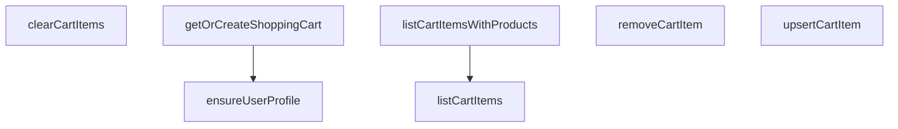

## Genel Bakış

Bu modül, VentHub HVAC platformunda kullanıcı alışveriş sepetinin tüm yönetim süreçlerini merkezi olarak üstlenen servis katmanıdır. Kullanıcı profilinin doğrulanması, sepetin varoluşunun garanti altına alınması ve sepet içeriğinin ekleme, güncelleme, silme ve listeleme gibi tüm CRUD işlemlerini Supabase veritabanıyla entegre bir şekilde gerçekleştirir. Modül, her kullanıcının yalnızca kendisine ait bir sepete sahip olmasını sağlayarak veri tutarlılığını korur.

## Fonksiyon Grupları

### Sepet Başlatma ve Hazırlık İşlemleri

Sepet işlemlerinin yürütülebilmesi için gerekli ön koşulları hazırlar. Kullanıcının profil kaydının varlığını doğrular ve kullanıcıya atanmış sepeti bulup döndürür; böyle bir sepet mevcut değilse yeniden oluşturur.

- ensureUserProfile, getOrCreateShoppingCart

### Sepet İçeriği Sorgulama İşlemleri

Sepetteki ürünlerin okunmasına yönelik fonksiyonları kapsar. Temel sepet öğelerini listelemek veya ürün detaylarıyla zenginleştirilmiş tam bir görünüm elde etmek için kullanılır.

- listCartItems, listCartItemsWithProducts

### Sepet İçeriği Değişiklik İşlemleri

Sepet içeriğinin dinamik olarak değiştirilmesini sağlayan yazma odaklı fonksiyonları barındırır. Ürün ekleme ve güncelleme, tekil ürün çıkarma veya sepetin tamamen temizlenmesi gibi işlemleri gerçekleştirir.

- upsertCartItem, removeCartItem, clearCartItems

---

## AXIOMS – Mimari Varsayımlar
Bu modül, kullanıcıya özel alışveriş sepeti yönetimini merkezi bir veritabanı (Supabase) üzerinde gerçekleştiren bir servistir. Doğru çalışması için aşağıdaki temel mimari varsayımlar geçerlidir.

[Aksiyom 1]: Eğer sağlanan `supabase` istemcisi (parametre) geçerli, yetkilendirilmiş ve veritabanına erişebilir bir durumda değilse, tüm veritabanı tabanlı işlemler (profiller, sepetler ve sepet kalemleri üzerindeki CRUD işlemleri) başarısız olur.

[Aksiyom 2]: Eğer `userId` parametresi geçerli bir kullanıcı kimliği (UUID) formatında değilse veya bu kimliğe karşılık gelen kullanıcı profili veritabanında mevcut değilse, `ensureUserProfile` fonksiyonu tarafından oluşturulacak profille ilgili işlemler (örn. sepet oluşturma) tutarsız veya hatalı sonuçlanır.

[Aksiyom 3]: Eğer `cartId` parametresi, geçerli bir alışveriş sepeti kimliği değilse veya bu sepette `removeCartItem` veya `clearCartItems` fonksiyonlarıyla ilişkilendirilmemişse, ilgili silme işlemleri hedefsiz veya hatalı çalışır.

[Aksiyom 4]: Eğer `listCartItemsWithProducts` fonksiyonu çağrıldığında, ilgili `cartId`'ye ait sepet kalemleri ile ilişkili (`_productId` ile referans verilen) ürün kayıtları veritabanında tutarsızsa (örn. ürün silinmiş ancak sepet kalemi referansı duruyorsa), fonksiyonun döndürdüğü ürün listesi eksik veya tutarsız olur.

[Aksiyom 5]: Eğer `upsertCartItem` fonksiyonuna, `unitPrice` ve `priceListId` parametrelerinin her ikisi de `null` olarak sağlanırsa, sepet kaleminin fiyat bilgisi hesaplanamaz veya tutarsız kalır; bu durum sepet toplamı ve sipariş oluşturma süreçlerinde hatalara yol açar.

[Aksiyom 6]: Eğer `removeCartItem` fonksiyonu, var olmayan bir `productId` ile çağrılmaya çalışılırsa, fonksiyon sessizce başarısız olur veya bir hata/istisna üretir; ancak sepet içeriğinde somut bir değişiklik (kalem silinmesi) gerçekleşmez.

---

## FONKSİYON DETAYLARI

### ensureUserProfile
**Ne yapar**: Belirtilen kullanıcı ID'si için bir kullanıcı profili kaydı olup olmadığını kontrol eder; eğer yoksa yeni bir profil oluşturarak foreign key kısıtlamalarını önler.
**Nasıl yapar**: Önce `user_profiles` tablosunda verilen `userId` ile eşleşen bir kayıt arar. Kayıt bulunamazsa, yeni bir profil kaydı插入 eder. İşlem herhangi bir hata veya istisna ile sonuçlanırsa `false`, başarıyla tamamlanırsa `true` döner.
**Parametreler**:
- `userId`: `string` — Profili kontrol edilecek ve oluşturulacak olan kullanıcının benzersiz tanımlayıcısı (UUID).
- `supabase`: `any` (isteğe bağlı) — Varsayılan olarak `defaultClient` kullanılır, Supabase istemcisi.
**Dönüş**: `Promise<boolean>` — İşlem başarıyla tamamlandıysa `true`, bir hata oluştuysa `false` döner.

### getOrCreateShoppingCart
**Ne yapar**: Belirtilen kullanıcı için mevcut bir alışveriş sepetini getirir veya yeni bir tane oluşturur. Yeni sepet oluşturulurken kullanıcının profil kaydı eksikse, foreign key kısıtlamasını karşılamak için önce profil kaydını güvenli bir şekilde oluşturmaya çalışır.
**Nasıl yapar**: Önce `shopping_carts` tablosunda `userId`'ye ait mevcut bir sepet sorgular. Bulunamazsa yeni bir sepet插入 etmeye çalışır. Eğer insertion, profil kaydı eksikliğinden kaynaklanan bir foreign key hatası (kod `23503`) verirse, `ensureUserProfile` fonksiyonunu çağırarak profili oluşturur ve insertion işlemini tekrar dener. Benzersizlik çakışması (kod `23505` veya `409`) oluşursa, sepeti tekrar sorgulayarak mevcut kaydı döner. Hala bir hata varsa fırlatır.
**Parametreler**:
- `userId`: `string` — Alışveriş sepatine ait olacak olan kullanıcının benzersiz tanımlayıcısı (UUID).
- `supabase`: `any` (isteğe bağlı) — Varsayılan olarak `defaultClient` kullanılır, Supabase istemcisi.
**Dönüş**: `Promise<DbShoppingCart>` — Kullanıcının alışveriş sepatine ait veritabanı kaydı.
**Fırlatır**: `Error` — Sepet oluşturma başarısız olursa veya düzeltilemeyen bir veritabanı hatası oluşursa.

### listCartItems
**Ne yapar**: Belirtilen alışveriş sepetindeki tüm ürün kalemlerini getirir.
**Nasıl yapar**: Bu fonksiyonun gövdesi sağlanmamıştır, ancak docstring'den anlaşıldığı üzere `cart_items` tablosunu sorgulayarak ilgili `cart_id`'ye sahip tüm kayıtları döner. Sorgulama başarısız olursa hata fırlatır.
**Parametreler**:
- `cartId`: `string` — Ürün kalemleri getirilecek olan alışveriş sepetinin benzersiz tanımlayıcısı.
- `supabase`: `any` (isteğe bağlı) — Varsayılan olarak `defaultClient` kullanılır, Supabase istemcisi.
**Dönüş**: `Promise<DbCartItem[]>` — Sepetteki ürün kalemlerinin bir dizisi; sepet boşsa boş bir dizi döner.
**Fırlatır**: `Error` — Veritabanı sorgulaması başarısız olursa.

### listCartItemsWithProducts
**Ne yapar**: Alışveriş sepetindeki ürün kalemlerini getirir ve her birini ilgili alan adı ürünüyle zenginleştirerek döner. Bu, sepetteki ürünlerin adlarını, görsellerini ve fiyatlarını görüntülemek için kullanışlıdır.
**Nasıl yapar**: İlk olarak `listCartItems` fonksiyonunu çağırarak sepet kalemlerini alır. Kalemlerin `product_id` değerlerini benzersiz bir küme oluşturarak `products` tablosundan toplu olarak ürünleri sorgular. Sonra, her bir veritabanı ürünü(`DbProduct`) alan adı ürün modeline(`Product`) dönüştürerek bir harita oluşturur. Sepet kalemlerini bu haritayla eşleştirerek, her birinin hem ham sepet kalemini hem de alan adı ürününü içeren nesnelerden oluşan bir dizi döner. Eşleşme sağlanamayan ürünler filtrelenir.
**Parametreler**:
- `cartId`: `string` — Ürün kalemleri ve ürün detayları getirilecek olan alışveriş sepetinin benzersiz tanımlayıcısı.
- `supabase`: `any` (isteğe bağlı) — Varsayılan olarak `defaultClient` kullanılır, Supabase istemcisi.
**Dönüş**: `Promise<{ item: DbCartItem; product: Product }[]>` — Her biri bir sepet kalemi ve ilgili alanadı ürünü nesnesi içeren dizi.
**Fırlatır**: `Error` — Ürün kalemleri veya ürün detayları getirme başarısız olursa.

### upsertCartItem
**Ne yapar**: Bir ürünü alışveriş sepetine ekler; ürün zaten sepette varsa miktarını ve fiyatlandırma bilgilerini günceller.
**Nasıl yapar**: Belirtilen `cartId` ve `_productId` kombinasyonuna sahip bir sepet kalemi olup olmadığını `cart_items` tablosunda sorgular. Eğer kayıt varsa, `quantity`, isteğe bağlı `unitPrice` ve `priceListId` alanlarını günceller. Kayıt yoksa yeni bir sepet kalemi插入 eder. Her iki durumda da, operation sonucunda oluşan DbCartItem dizisini döner.
**Parametreler**:
- `params`: `object` — Eklenecek veya güncellenecek sepet kalemi detaylarını içeren nesne.
  - `cartId`: `string` — Alışveriş sepatinin tanımlayıcısı.
  - `_productId`: `string` — Eklenecek veya güncellenecek olan ürünün tanımlayıcısı.
  - `quantity`: `number` — Ürünün istenen miktarı.
  - `unitPrice`: `number | null` (isteğe bağlı) — Ürün birim fiyatının üzerine yazılacak değer.
  - `priceListId`: `string | null` (isteğe bağlı) — Uygulanan fiyat listesinin tanımlayıcısı.
- `supabase`: `any` (isteğe bağlı) — Varsayılan olarak `defaultClient` kullanılır, Supabase istemcisi.
**Dönüş**: `Promise<DbCartItem[]>` — Güncellenmiş veya yeni eklenmiş sepet kalemini içeren dizi.
**Fırlatır**: `Error` — Veritabanı upsert işlemi başarısız olursa.

### removeCartItem
**Ne yapar**: Belirli bir ürünü bir alışveriş sepetinden kaldırır.
**Nasıl yapar**: `cart_items` tablosunda, belirtilen `cartId` ve `productId` kombinasyonuyla eşleşen kaydı silme işlemi gerçekleştirir. İşlem başarıyla tamamlanırsa `true`, aksi halde bir hata fırlatır.
**Parametreler**:
- `cartId`: `string` — Ürünün kaldırılacağı alışveriş sepetinin benzersiz tanımlayıcısı.
- `productId`: `string` — Sepetten kaldırılacak olan ürünün benzersiz tanımlayıcısı.
- `supabase`: `any` (isteğe bağlı) — Varsayılan olarak `defaultClient` kullanılır, Supabase istemcisi.
**Dönüş**: `Promise<boolean>` — Silme işlemi başarılıysa `true`.
**Fırlatır**: `Error` — Veritabanı silme işlemi başarısız olursa.

### clearCartItems
**Ne yapar**: Belirtilen alışveriş sepetindeki tüm ürün kalemlerini kaldırır.
**Nasıl yapar**: `cart_items` tablosunda, belirtilen `cartId`'ye sahip tüm kayıtları silme işlemi gerçekleştirir. İşlem başarıyla tamamlanırsa `true`, aksi halde bir hata fırlatır.
**Parametreler**:
- `cartId`: `string` — Tüm kalemleri kaldırılacak olan alışveriş sepetinin benzersiz tanımlayıcısı.
- `supabase`: `any` (isteğe bağlı) — Varsayılan olarak `defaultClient` kullanılır, Supabase istemcisi.
**Dönüş**: `Promise<boolean>` — Sepet başarıyla temizlendiyse `true`.
**Fırlatır**: `Error` — Veritabanı silme işlemi başarısız olursa.

---

## SABİTLER
- **defaultClient** (ternary_expression) — `typeof window !== 'undefined' ? supabaseBrowserClient : supabaseStaticClient`

---

## AST POINTERS

### [N1_NASIL] AST Pointer: cart.service.ts::ensureUserProfile
- **params**: `userId: string` — kullanıcı ID'si, profil oluşturulacak/sorgulanacak kullanıcıyı belirtir; `supabase` — Supabase istemcisi, `defaultClient` (ternary_expression) ile varsayılan olarak gelir
- **ic_degiskenler**:
  - `prof` — `supabase.from('user_profiles').select('id').eq('id', userId).maybeSingle()` dönüşünden elde edilen `data`, mevcut profil satırını temsil eder; `null` veya `{id: string}` olabilir
  - `selErr` — profil sorgulama sırasında oluşan Supabase hatası, `null` ise sorgu başarılı demektir
  - `insErr` — profil insert işlemi sırasında oluşan Supabase hatası, `null` ise insert başarılı demektir
- **Dönüş**: `Promise<boolean>` — profil mevcutsa veya başarıyla oluşturulduysa `true`, hata oluştuysa `false`

---

### [N2_NASIL] AST Pointer: cart.service.ts::getOrCreateShoppingCart
- **params**: `userId: string` — alışveriş sepetine ait olacak kullanıcının ID'si; `supabase` — Supabase istemcisi, `defaultClient` ile varsayılan
- **ic_degiskenler**:
  - `existing` — `supabase.from('shopping_carts').select('*').eq('user_id', userId).limit(1)` dönüşünden gelen `data`, mevcut sepet satırları dizisi (`DbShoppingCart[]` veya `null`)
  - `selErr` — sepet sorgulama hatası
  - `attemptInsert` — anonim fonksiyon; `supabase.from('shopping_carts').insert({user_id: userId}).select('*').single()` çağrısını yapan ve `{data, error}` döndüren fonksiyonel değişken
  - `data` — `attemptInsert()` çağrısının başarılı dönüşündeki tekil sepet satırı (`DbShoppingCart`)
  - `error` — `attemptInsert()` çağrısının hata dönüşü
  - `err` — `error` değerinin `SupabaseError` arayüzüne (`{code?: string; message?: string}`) cast edilmiş hali, error kodunu ve mesajını erişilebilir yapar
  - `retry` — FK hatası sonrası `attemptInsert()` ikinci kez çağrıldığında dönen `{data, error}` objesi
  - `again` — unique conflict sonrası tekrar sorgulanan mevcut sepet satırları dizisi
  - `sel2` — ikinci sepet sorgulama hatası
- **Dönüş**: `Promise<DbShoppingCart>` — mevcut veya yeni oluşturulmuş tekil sepet satırı; hata durumunda exception fırlatır

---

### [N3_NASIL] AST Pointer: cart.service.ts::listCartItems
- **params**: `cartId: string` — sepetin ID'si, ilgili sepet kalemlerini filtrelemek için kullanılır; `supabase` — Supabase istemcisi
- **ic_degiskenler**:
  - `data` — `supabase.from('cart_items').select('*').eq('cart_id', cartId)` dönüşünden gelen sepet kalemleri dizisi (`DbCartItem[]` veya `null`)
  - `error` — sorgu hatası, `null` ise başarılı
- **Dönüş**: `Promise<DbCartItem[]>` — sepete ait tüm kalemler; `data` `null` ise boş dizi döner, hata varsa exception fırlatır

---

### [N4_NASIL] AST Pointer: cart.service.ts::listCartItemsWithProducts
- **params**: `cartId: string` — sepet ID'si; `supabase` — Supabase istemcisi
- **ic_degiskenler**:
  - `items` — `listCartItems(cartId, supabase)` çağrısından dönen sepet kalemleri dizisi (`DbCartItem[]`)
  - `_productIds` — `items` dizisindeki her bir item'ın `product_id` alanından türetilmiş, `Array.from(new Set(...))` ile benzersizleştirilmiş ürün ID'leri dizisi
  - `products` — `supabase.from('products').select('*').in('id', _productIds)` dönüşünden gelen ham ürün satırları (`DbProduct[]` veya `null`)
  - `pErr` — ürün sorgulama hatası
  - `map` — `Map<string, Product>` türünde, ürün ID'sinden (`string`) dönüştürülmüş `Product` domain modeline eşleyen harita; `mapDatabaseProductToDomain(p)` çağrılarıyla doldurulur
  - `p` — `for...of` döngüsündeki her bir `DbProduct` satırı, `map.set(p.id, mapDatabaseProductToDomain(p))` ile haritaya eklenir
- **Dönüş**: `Promise<{ item: DbCartItem; product: Product }[]>` — her sepet kalemi ile ilişkili dönüştürülmüş ürünün çiftlerinden oluşan dizi; `product`'ı `undefined` olan elemanlar `filter` ile elenir

---

### [N5_NASIL] AST Pointer: cart.service.ts::upsertCartItem
- **params**: `params` — `{ cartId: string; _productId: string; quantity: number; unitPrice?: number | null; priceListId?: string | null }` nesnesi, sepet kalemini tanımlayan tüm parametreleri içerir; `supabase` — Supabase istemcisi
- **ic_degiskenler**:
  - `cartId` — `params` nesnesinden destructure edilen sepet ID'si
  - `_productId` — `params` nesnesinden destructure edilen ürün ID'si
  - `quantity` — `params` nesnesinden destructure edilen miktar
  - `unitPrice` — `params` nesnesinden destructure edilen birim fiyat, `undefined` veya `number | null`
  - `priceListId` — `params` nesnesinden destructure edilen fiyat listesi ID'si, `undefined` veya `string | null`
  - `sel` — `supabase.from('cart_items').select('id').eq('cart_id', cartId).eq('product_id', _productId).limit(1)` çağrısının sonucu; mevcut sepet kalemini kontrol eder, `sel.error` ve `sel.data` içerir
  - `common` — `Database['public']['Tables']['cart_items']['Update']` tipinde güncelleme/ekleme ortak alanları nesnesi; `quantity`, opsiyonel olarak `unit_price` ve `price_list_id` alanlarını içerir
  - `upd` — mevcut kalem varsa `supabase.from('cart_items').update(common).eq('cart_id', cartId).eq('product_id', _productId).select('*')` çağrısının sonucu
  - `ins` — kalem yoksa `supabase.from('cart_items').insert({cart_id: cartId, product_id: _productId, ...common}).select('*')` çağrısının sonucu
- **Dönüş**: `Promise<DbCartItem[]>` — upsert sonrası oluşan/güncellenmiş sepet kalemi satırları; hata durumunda exception fırlatır

---

### [N6_NASIL] AST Pointer: cart.service.ts::removeCartItem
- **params**: `cartId: string` — sepet ID'si; `productId: string` — silinecek ürünün ID'si; `supabase` — Supabase istemcisi
- **ic_degiskenler**:
  - `error` — `supabase.from('cart_items').delete().eq('cart_id', cartId).eq('product_id', productId)` çağrısından dönen silme hatası, `null` ise başarılı
- **Dönüş**: `Promise<boolean>` — silme başarılıysa `true`, hata varsa exception fırlatır

---

### [N7_NASIL] AST Pointer: cart.service.ts::clearCartItems
- **params**: `cartId: string` — sepet ID'si, ilgili sepetin tüm kalemleri temizlenecek; `supabase` — Supabase istemcisi
- **ic_degiskenler**:
  - `error` — `supabase.from('cart_items').delete().eq('cart_id', cartId)` çağrısından dönen silme hatası, `null` ise başarılı
- **Dönüş**: `Promise<boolean>` — temizleme başarılıysa `true`, hata varsa exception fırlatır

---

## MERMAID CALL GRAPH

## NODE ID STANDARD

  file: src\lib\services\cart.service.ts
  function: src\lib\services\cart.service.ts::ensureUserProfile
  function: src\lib\services\cart.service.ts::getOrCreateShoppingCart
  function: src\lib\services\cart.service.ts::listCartItems
  function: src\lib\services\cart.service.ts::listCartItemsWithProducts
  function: src\lib\services\cart.service.ts::upsertCartItem
  function: src\lib\services\cart.service.ts::removeCartItem
  function: src\lib\services\cart.service.ts::clearCartItems

---

## DISA AKTARILANLAR (EXPORTS)
  export: clearCartItems
  export: ensureUserProfile
  export: getOrCreateShoppingCart
  export: listCartItems
  export: listCartItemsWithProducts
  export: removeCartItem
  export: upsertCartItem