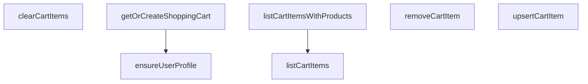

## Genel Bakış

Bu modül, VentHub HVAC platformunda alışveriş sepeti yönetimini merkezi olarak sağlayan servis katmanıdır. Kullanıcı profilini doğrulamaktan sepetin oluşturulmasına, sepet içeriğinin listelenmesinden ürün ekleme/güncelleme ve silme işlemlerine kadar tüm sepet lifecycle'ını Supabase veritabanı üzerinden yönetir. Her kullanıcıya yalnızca tek bir sepet atayarak veri tutarlılığını garanti altına alır.

## Fonksiyon Grupları

### Sepet ve Profil Hazırlığı

Sepet işlemlerinin yürütülebilmesi için gerekli ön koşulları sağlar. Kullanıcının veritabanında profil kaydının olup olmadığını doğrular ve kullanıcıya ait sepeti bulur; yoksa yeni bir sepet oluşturarak döndürür.

- ensureUserProfile, getOrCreateShoppingCart

### Sepet İçeriği Sorgulama

Sepetteki ürünlerin okunmasına yönelik fonksiyonları kapsar. Temel sepet öğelerini ham şekilde listelemek veya ürün bilgileriyle zenginleştirilmiş bir görünüm elde etmek için kullanılır.

- listCartItems, listCartItemsWithProducts

### Sepet İçeriği Değişiklikleri

Sepet içeriğinin yazma odaklı işlemlerini yönetir. Ürün ekleme ve miktar güncelleme, tekil ürün çıkarma veya sepetin tamamen temizlenmesi gibi tüm değiştirme operasyonlarını gerçekleştirir.

- upsertCartItem, removeCartItem, clearCartItems

---

## AXIOMS – Mimari Varsayımlar
Bu modül, kullanıcı başına tek bir sepet prensibiyle çalışır ve tüm işlemler Supabase veritabanı üzerindedir.

[Aksiyom 1]: Eğer `ensureUserProfile` fonksiyonu kullanıcı profilini doğrulayamazsa, sepet işlemleri kullanıcıya ait olmayan verilerle çalışabilir.

[Aksiyom 2]: Eğer `getOrCreateShoppingCart` fonksiyonu kullanıcının mevcut sepetini bulamazsa, yeni bir sepet oluşturur; aksi takdirde mevcut sepeti döndürür.

[Aksiyom 3]: Eğer `listCartItems` veya `listCartItemsWithProducts` fonksiyonları geçerli bir `cartId` almazsa, boş veya hata içeren bir sonuç döndürür.

[Aksiyom 4]: Eğer `upsertCartItem` fonksiyonunda `quantity` 0 veya negatif bir değer olarak verilirse, sepet öğesi silinebilir veya hata oluşabilir.

[Aksiyom 5]: Eğer `removeCartItem` fonksiyonu var olmayan bir `productId` ile çağrılırsa, sepet içeriğinde değişiklik yapmaz.

[Aksiyom 6]: Eğer `clearCartItems` fonksiyonu çağrılırsa, belirtilen `cartId`'ye ait tüm sepet öğeleri silinir.

[Aksiyom 7]: Eğer `upsertCartItem` fonksiyonunda `unitPrice` veya `priceListId` parametreleri sağlanmazsa, varsayılan fiyatlandırma mantığı kullanılabilir.

[Aksiyom 8]: Eğer Supabase istemcisi (`supabase`) geçersiz veya oturum açmamışsa, tüm fonksiyonlar hata ile sonuçlanır.

[Aksiyom 9]: Eğer `cartId` parametresi tüm sepet işlemleri için sağlanmazsa, fonksiyonlar çalışamaz.

[Aksiyom 10]: Eğer `userId` parametresi `ensureUserProfile` veya `getOrCreateShoppingCart` için sağlanmazsa, kullanıcıya ait sepet profili oluşturulamaz veya alınamaz.

---

## FONKSİYON DETAYLARI

### ensureUserProfile

**Ne yapar**: Belirli bir kullanıcı için `user_profiles` tablosunda bir profil kaydı olup olmadığını kontrol eder; eğer yoksa yeni bir profil oluşturur. Bu fonksiyon, ngoại anahtar (foreign key) kısıtlamalarını karşılamak için alışveriş sepeti oluşturma sürecinden önce çağrılır.

**Nasıl yapar**: Önce Supabase üzerinden `user_profiles` tablosunda ilgili `userId` ile eşleşen bir kayıt sorgular. `maybeSingle()` kullanarak kayıt bulunup bulunmadığını kontrol eder. Eğer kayıt mevcutsa `true` döner. Kayıt bulunamazsa veya bir hata oluşursa, `insert` işlemiyle yeni bir profil kaydı oluşturmayı dener. Her iki aşama da `try-catch` bloğu ile sarılmıştır; herhangi bir hata durumunda sessizce `false` döner.

**Parametreler**:
- `supabase`: SupabaseClient<Database> — Veritabanı işlemleri için aktif Supabase istemcisi
- `userId`: string — Profili oluşturulacak kullanıcının benzersiz tanımlayıcısı (UUID)

**Dönüş**: `Promise<boolean>` — Profil mevcutsa veya başarıyla oluşturulduysa `true`, herhangi bir hata durumunda `false` döner.

### getOrCreateShoppingCart
**Ne yapar**: Belirtilen kullanıcı için mevcut bir alışveriş sepetini getirir veya yeni bir tane oluşturur. Yeni sepet oluşturulurken kullanıcının profil kaydı eksikse, foreign key kısıtlamasını karşılamak için önce profil kaydını güvenli bir şekilde oluşturmaya çalışır.
**Nasıl yapar**: Önce `shopping_carts` tablosunda `userId`'ye ait mevcut bir sepet sorgular. Bulunamazsa yeni bir sepet插入 etmeye çalışır. Eğer insertion, profil kaydı eksikliğinden kaynaklanan bir foreign key hatası (kod `23503`) verirse, `ensureUserProfile` fonksiyonunu çağırarak profili oluşturur ve insertion işlemini tekrar dener. Benzersizlik çakışması (kod `23505` veya `409`) oluşursa, sepeti tekrar sorgulayarak mevcut kaydı döner. Hala bir hata varsa fırlatır.
**Parametreler**:
- `userId`: `string` — Alışveriş sepatine ait olacak olan kullanıcının benzersiz tanımlayıcısı (UUID).
- `supabase`: `any` (isteğe bağlı) — Varsayılan olarak `defaultClient` kullanılır, Supabase istemcisi.
**Dönüş**: `Promise<DbShoppingCart>` — Kullanıcının alışveriş sepatine ait veritabanı kaydı.
**Fırlatır**: `Error` — Sepet oluşturma başarısız olursa veya düzeltilemeyen bir veritabanı hatası oluşursa.

### listCartItems
**Ne yapar**: Belirtilen alışveriş sepetindeki tüm ürün kalemlerini getirir.
**Nasıl yapar**: Bu fonksiyonun gövdesi sağlanmamıştır, ancak docstring'den anlaşıldığı üzere `cart_items` tablosunu sorgulayarak ilgili `cart_id`'ye sahip tüm kayıtları döner. Sorgulama başarısız olursa hata fırlatır.
**Parametreler**:
- `cartId`: `string` — Ürün kalemleri getirilecek olan alışveriş sepetinin benzersiz tanımlayıcısı.
- `supabase`: `any` (isteğe bağlı) — Varsayılan olarak `defaultClient` kullanılır, Supabase istemcisi.
**Dönüş**: `Promise<DbCartItem[]>` — Sepetteki ürün kalemlerinin bir dizisi; sepet boşsa boş bir dizi döner.
**Fırlatır**: `Error` — Veritabanı sorgulaması başarısız olursa.

### listCartItemsWithProducts
**Ne yapar**: Alışveriş sepetindeki ürün kalemlerini getirir ve her birini ilgili alan adı ürünüyle zenginleştirerek döner. Bu, sepetteki ürünlerin adlarını, görsellerini ve fiyatlarını görüntülemek için kullanışlıdır.
**Nasıl yapar**: İlk olarak `listCartItems` fonksiyonunu çağırarak sepet kalemlerini alır. Kalemlerin `product_id` değerlerini benzersiz bir küme oluşturarak `products` tablosundan toplu olarak ürünleri sorgular. Sonra, her bir veritabanı ürünü(`DbProduct`) alan adı ürün modeline(`Product`) dönüştürerek bir harita oluşturur. Sepet kalemlerini bu haritayla eşleştirerek, her birinin hem ham sepet kalemini hem de alan adı ürününü içeren nesnelerden oluşan bir dizi döner. Eşleşme sağlanamayan ürünler filtrelenir.
**Parametreler**:
- `cartId`: `string` — Ürün kalemleri ve ürün detayları getirilecek olan alışveriş sepetinin benzersiz tanımlayıcısı.
- `supabase`: `any` (isteğe bağlı) — Varsayılan olarak `defaultClient` kullanılır, Supabase istemcisi.
**Dönüş**: `Promise<{ item: DbCartItem; product: Product }[]>` — Her biri bir sepet kalemi ve ilgili alanadı ürünü nesnesi içeren dizi.
**Fırlatır**: `Error` — Ürün kalemleri veya ürün detayları getirme başarısız olursa.

### upsertCartItem
**Ne yapar**: Bir ürünü alışveriş sepetine ekler; ürün zaten sepette varsa miktarını ve fiyatlandırma bilgilerini günceller.
**Nasıl yapar**: Belirtilen `cartId` ve `_productId` kombinasyonuna sahip bir sepet kalemi olup olmadığını `cart_items` tablosunda sorgular. Eğer kayıt varsa, `quantity`, isteğe bağlı `unitPrice` ve `priceListId` alanlarını günceller. Kayıt yoksa yeni bir sepet kalemi插入 eder. Her iki durumda da, operation sonucunda oluşan DbCartItem dizisini döner.
**Parametreler**:
- `params`: `object` — Eklenecek veya güncellenecek sepet kalemi detaylarını içeren nesne.
  - `cartId`: `string` — Alışveriş sepatinin tanımlayıcısı.
  - `_productId`: `string` — Eklenecek veya güncellenecek olan ürünün tanımlayıcısı.
  - `quantity`: `number` — Ürünün istenen miktarı.
  - `unitPrice`: `number | null` (isteğe bağlı) — Ürün birim fiyatının üzerine yazılacak değer.
  - `priceListId`: `string | null` (isteğe bağlı) — Uygulanan fiyat listesinin tanımlayıcısı.
- `supabase`: `any` (isteğe bağlı) — Varsayılan olarak `defaultClient` kullanılır, Supabase istemcisi.
**Dönüş**: `Promise<DbCartItem[]>` — Güncellenmiş veya yeni eklenmiş sepet kalemini içeren dizi.
**Fırlatır**: `Error` — Veritabanı upsert işlemi başarısız olursa.

### removeCartItem
**Ne yapar**: Belirli bir ürünü bir alışveriş sepetinden kaldırır.
**Nasıl yapar**: `cart_items` tablosunda, belirtilen `cartId` ve `productId` kombinasyonuyla eşleşen kaydı silme işlemi gerçekleştirir. İşlem başarıyla tamamlanırsa `true`, aksi halde bir hata fırlatır.
**Parametreler**:
- `cartId`: `string` — Ürünün kaldırılacağı alışveriş sepetinin benzersiz tanımlayıcısı.
- `productId`: `string` — Sepetten kaldırılacak olan ürünün benzersiz tanımlayıcısı.
- `supabase`: `any` (isteğe bağlı) — Varsayılan olarak `defaultClient` kullanılır, Supabase istemcisi.
**Dönüş**: `Promise<boolean>` — Silme işlemi başarılıysa `true`.
**Fırlatır**: `Error` — Veritabanı silme işlemi başarısız olursa.

### clearCartItems
**Ne yapar**: Belirtilen alışveriş sepetindeki tüm ürün kalemlerini kaldırır.
**Nasıl yapar**: `cart_items` tablosunda, belirtilen `cartId`'ye sahip tüm kayıtları silme işlemi gerçekleştirir. İşlem başarıyla tamamlanırsa `true`, aksi halde bir hata fırlatır.
**Parametreler**:
- `cartId`: `string` — Tüm kalemleri kaldırılacak olan alışveriş sepetinin benzersiz tanımlayıcısı.
- `supabase`: `any` (isteğe bağlı) — Varsayılan olarak `defaultClient` kullanılır, Supabase istemcisi.
**Dönüş**: `Promise<boolean>` — Sepet başarıyla temizlendiyse `true`.
**Fırlatır**: `Error` — Veritabanı silme işlemi başarısız olursa.

---

## AST POINTERS

### [N1_NASIL] AST Pointer: src/lib/services/cart.service.ts::ensureUserProfile
- **params**: (supabase: SupabaseClient<Database>, userId: string)
- **ic_degiskenler**:
  - `prof` — user_profiles tablosundan select ile dönen profil kaydı (id alanı)
  - `selErr` — user_profiles select sorgusundaki hata nesnesi
  - `insErr` — user_profiles insert sorgusundaki hata nesnesi
- **Dönüş**: `boolean` — profil mevcutsa veya başarıyla oluşturulduysa true, aksi halde false

### [N2_NASIL] AST Pointer: src/lib/services/cart.service.ts::getOrCreateShoppingCart
- **params**: (supabase: SupabaseClient<Database>, userId: string)
- **ic_degiskenler**:
  - `existing` — shopping_carts tablosundan user_id eşleşmesiyle dönen mevcut sepet kayıtları dizisi
  - `selErr` — existing select sorgusundaki hata nesnesi
  - `attemptInsert` — inner async fonksiyon; shopping_carts'a insert + single select yapan lambda
  - `data` — attemptInsert sonucu dönen sepet verisi (initial atama: ilk insert denemesinin sonucu, retry sonucu güncellenebilir)
  - `error` — attemptInsert sonucu dönen hata nesnesi (retry sonucu güncellenebilir)
  - `err` — error nesnesinin SupabaseError olarak cast edilmiş hali; code ve message alanlarına erişim için kullanılır
  - `again` — unique conflict sonrası tekrar select ile dönen mevcut sepet verisi
  - `sel2` — again select sorgusundaki hata nesnesi
- **Dönüş**: `Promise<DbShoppingCart>` — mevcut veya yeni oluşturulmuş sepet nesnesi

### [N3_NASIL] AST Pointer: src/lib/services/cart.service.ts::listCartItems
- **params**: (supabase: SupabaseClient<Database>, cartId: string)
- **ic_degiskenler**:
  - `data` — cart_items tablosundan cart_id eşleşmesiyle dönen satır verileri dizisi
  - `error` — cart_items select sorgusundaki hata nesnesi
- **Dönüş**: `Promise<DbCartItem[]>` — sepete ait tüm ürün satırları; hata durumunda fırlatılır

### [N4_NASIL] AST Pointer: src/lib/services/cart.service.ts::listCartItemsWithProducts
- **params**: (supabase: SupabaseClient<Database>, cartId: string)
- **ic_degiskenler**:
  - `items` — listCartItems çağrısından dönen DbCartItem dizisi
  - `_productIds` — items dizisindeki tüm benzersiz product_id değerlerinden oluşan string dizi (Set ile tekrarlar kaldırılmış)
  - `products` — products tablosundan _productIds ile eşleşen DbProduct kayıtları dizisi
  - `pErr` — products select sorgusundaki hata nesnesi
  - `map` — DbProduct'ları Product domain modeline dönüştürüp product.id key'iyle eşleyen Map<string, Product>
  - `p` — products dizisi üzerindeki for döngüsü elemanı (DbProduct tipinde)
- **Dönüş**: `Promise<{ item: DbCartItem; product: Product }[]>` — her sepet satırının ilgili ürün bilgisiyle birleştiği dizi; product'u olmayan satırlar filter ile çıkarılır

### [N5_NASIL] AST Pointer: src/lib/services/cart.service.ts::upsertCartItem
- **params**: (supabase: SupabaseClient<Database>, params: { cartId: string; _productId: string; quantity: number; unitPrice?: number | null; priceListId?: string | null })
- **ic_degiskenler**:
  - `cartId` — params objesinden destructure edilmiş sepet ID'si
  - `_productId` — params objesinden destructure edilmiş ürün ID'si
  - `quantity` — params objesinden destructure edilmiş miktar
  - `unitPrice` — params objesinden destructure edilmiş birim fiyat (optional)
  - `priceListId` — params objesinden destructure edilmiş fiyat listesi ID'si (optional)
  - `sel` — cart_items tablosunda cart_id + product_id eşleşmesiyle mevcut satır arama sonucu (select id)
  - `common` — update/insert ortak kullanılacak veri objesi; quantity alanını içerir, opsiyonel olarak unit_price ve price_list_id eklenir
  - `upd` — mevcut satır bulunduğunda update sorgusunun sonucu (returning *)
  - `ins` — mevcut satır bulunamadığında insert sorgusunun sonucu (returning *)
- **Dönüş**: `Promise<DbCartItem[]>` — upsert sonrası carts_items satırı/ları

### [N6_NASIL] AST Pointer: src/lib/services/cart.service.ts::removeCartItem
- **params**: (supabase: SupabaseClient<Database>, cartId: string, productId: string)
- **ic_degiskenler**:
  - `error` — cart_items delete sorgusundaki hata nesnesi
- **Dönüş**: `Promise<boolean>` — silme başarılıysa true; hata durumunda fırlatılır

### [N7_NASIL] AST Pointer: src/lib/services/cart.service.ts::clearCartItems
- **params**: (supabase: SupabaseClient<Database>, cartId: string)
- **ic_degiskenler**:
  - `error` — cart_items delete sorgusundaki hata nesnesi
- **Dönüş**: `Promise<boolean>` — temizleme başarılıysa true; hata durumunda fırlatılır

---

## MERMAID CALL GRAPH

## NODE ID STANDARD

  file: src\lib\services\cart.service.ts
  function: src\lib\services\cart.service.ts::ensureUserProfile
  function: src\lib\services\cart.service.ts::getOrCreateShoppingCart
  function: src\lib\services\cart.service.ts::listCartItems
  function: src\lib\services\cart.service.ts::listCartItemsWithProducts
  function: src\lib\services\cart.service.ts::upsertCartItem
  function: src\lib\services\cart.service.ts::removeCartItem
  function: src\lib\services\cart.service.ts::clearCartItems

---

## DISA AKTARILANLAR (EXPORTS)
  export: clearCartItems
  export: ensureUserProfile
  export: getOrCreateShoppingCart
  export: listCartItems
  export: listCartItemsWithProducts
  export: removeCartItem
  export: upsertCartItem