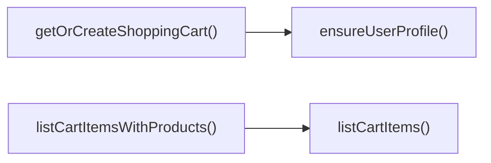

## Genel Bakış
Bu modül, VentHub HVAC platformu için kullanıcı alışveriş sepeti yönetimini gerçekleştiren bir servis modülüdür. Kullanıcı profillerinin doğrulanmasından, kullanıcıya özel sepetlerin oluşturulmasından ve sepet içeriğinin tüm yaşam döngüsü işlemlerinden sorumludur. Veritabanı ile entegre çalışarak sepet verilerinin tutarlı bir şekilde yönetilmesini sağlar.

## Fonksiyon Grupları
### Temel Kullanıcı ve Sepet Başlatma İşlemleri
Sepet işlemlerine başlamadan önce gereken ön kontrolleri ve sepetin hazırlanmasını gerçekleştirir. Kullanıcı profilinin varlığını teyit eder ve kullanıcı için mevcut sepeti getirir ya da yoksa yeni bir sepet oluşturur.
- ensureUserProfile, getOrCreateShoppingCart

### Sepet İçeriği Okuma İşlemleri
Sepette kayıtlı ürünleri farklı detay seviyelerinde sunmak için kullanılan okuma odaklı fonksiyonları barındırır. Sadece sepet öğelerini veya ürün detaylarıyla zenginleştirilmiş tam sepet içeriğini listeleme imkanı sunar.
- listCartItems, listCartItemsWithProducts

### Sepet İçeriği Düzenleme İşlemleri
Sepet içeriğinin değiştirilmesine yönelik tüm yazma işlemlerini gerçekleştirir. Ürün ekleme/güncelleme, tek ürün silme ve tüm sepeti temizleme gibi işlemlerle sepetin dinamik olarak yönetilmesini sağlar.
- upsertCartItem, removeCartItem, clearCartItems

---

## AXIOMS – Mimari Varsayımlar
Bu modül, kullanıcı bazlı alışveriş sepeti işlemlerini yönetmek için tasarlanmıştır, tüm fonksiyonlarının sorunsuz çalışması için kullanıcı kimlikleri, sepet kimlikleri gibi benzersiz tanımlayıcıların geçerli olması, modülün bağlı olduğu kullanıcı profili, ürün ve sepet verilerini saklayan servis/veritabanlarının sürekli erişilebilir olması zorunludur.

[Aksiyom 1]: Eğer ensureUserProfile fonksiyonunun eriştiği kullanıcı profili depolama/servis erişimi yoksa, tüm sepet oluşturma ve yönetim operasyonları başarısız olur.
[Aksiyom 2]: Eğer getOrCreateShoppingCart çağrılmadan, tüm sepet yönetim fonksiyonları (listCartItems, upsertCartItem vb.) için geçerli bir cartId değeri sağlanmazsa, ilgili sepet operasyonları çalışmaz.
[Aksiyom 3]: Eğer upsertCartItem fonksiyonunun zorunlu parametreleri olan cartId, _productId veya quantity değerleri eksik/geçersizse, sepete ürün ekleme veya mevcut ürünü güncelleme işlemi başarısız olur.
[Aksiyom 4]: Eğer removeCartItem fonksiyonuna geçersiz cartId veya productId değeri sağlanırsa, ilgili ürün sepetten silinemez, işlem başarısız olur.
[Aksiyom 5]: Eğer listCartItemsWithProducts fonksiyonunun bağlı olduğu ürün bilgisi sağlayan servis/veritabanı erişimi yoksa, sepet öğeleri ürün detaylarıyla birlikte listelenemez, işlem başarısız olur.
[Aksiyom 6]: Eğer clearCartItems fonksiyonuna geçerli bir cartId değeri sağlanmazsa, ilgili sepetin tüm içeriği temizlenemez.

---

## FONKSIYON DETAYLARI

### ensureUserProfile
**Ne yapar**: Belirtilen kullanıcı ID'si için kullanıcı profilinin veritabanında mevcut olmasını sağlar, profil yoksa gerekli kaydı oluşturur. Tüm asenkron işlemlerin sonucunda profilin başarılı bir şekilde varlığını onaylayan bir boolean değer döndürür.
**Nasıl yapar**: İlk olarak girilen kullanıcı ID'si ile veritabanında mevcut profil kaydı sorgulanır. Eğer kayıt bulunamazsa standart varsayılan değerlerle yeni kullanıcı profili oluşturulur. Tüm işlem adımları sorunsuz tamamlanırsa true, herhangi bir aşamada hata oluşursa false değeri ile promise tamamlanır.
**Parametreler**:
- name: userId, type: string — Profilinin varlığı kontrol edilecek veya oluşturulacak oturum sahibi kullanıcının benzersiz UUID'si
**Dönüş**: Promise<boolean> — Kullanıcı profilinin mevcut olması veya başarılı bir şekilde oluşturulması halinde true, herhangi bir işlem hatasında false döndüren asenkron promise nesnesi

---

### getOrCreateShoppingCart
**Ne yapar**: İlgili kullanıcının mevcut alışveriş sepetini veritabanından çeker, eğer kullanıcı için henüz sepet oluşturulmamışsa yeni sepet kaydı oluşturur. Kullanıcıda profil kaydı eksikse önce profil oluşturma işlemini gerçekleştirerek veritabanı yabancı anahtar kısıtlamalarını karşılar.
**Nasıl yapar**: Önce girilen kullanıcı ID'si ile ilişkili mevcut sepet kaydı veritabanından sorgulanır. Eğer sepet bulunamazsa yeni sepet oluşturma süreci başlatılır, bu süreçte profil eksikliğinden kaynaklanan hata alınırsa önce `ensureUserProfile` fonksiyonu çağırılarak profilin oluşturulması sağlanır, ardından sepet oluşturma işlemi tekrar denenir. Sonuç olarak kullanıcının sepet kaydı döndürülür.
**Parametreler**:
- name: userId, type: string — Sepeti getirilecek veya oluşturulacak doğrulanmış oturum sahibi kullanıcının benzersiz UUID'si
**Dönüş**: Promise<DbShoppingCart> — Kullanıcının alışveriş sepetinin güncel veritabanı kaydını içeren asenkron promise nesnesi. Sepet oluşturulamaması veya kurtarılamaz veritabanı hatası durumunda Error fırlatır.

---

### listCartItems
**Ne yapar**: Belirtilen alışveriş sepeti kimliğine ait tüm mevcut sepet öğelerini listeler. Eğer sepet boşsa hiçbir öğe içermeyen boş bir dizi döndürür. Sepetin ham içeriğini doğrudan veritabanından çekmek için kullanılır.
**Nasıl yapar**: Girilen sepet ID'si ile veritabanında o sepete ait tüm sepet öğeleri için sorgu çalıştırılır. Sorgu başarılı olursa bulunan tüm öğeler dizisi, sepetin hiç öğesi yoksa boş bir dizi döndürülür. Sorgu çalıştırılırken herhangi bir veritabanı hatası oluşursa işlem hata fırlatarak sonlanır.
**Parametreler**:
- name: cartId, type: string — İçindeki öğelerin listeleneceği alışveriş sepetinin benzersiz kimliği
**Dönüş**: Promise<DbCartItem[]> — Sepetteki tüm öğelerin veritabanı kayıtlarını içeren, sepet boşsa boş olan dizi döndüren asenkron promise nesnesi. Veritabanı sorgusu başarısız olursa Error fırlatır.

---

### listCartItemsWithProducts
**Ne yapar**: Belirtilen sepetin tüm öğelerini çeker ve her bir öğeye ait ürün detaylarıyla zenginleştirerek döndürür. Ön yüzde sepet ekranlarında ürün adı, görseli, fiyatı gibi detayları göstermek için optimize edilmiştir.
**Nasıl yapar**: Önce `listCartItems` fonksiyonu çağırılarak sepetin tüm ham öğeleri alınır. Ardından her bir öğedeki ürün kimliği ile ilişkili domain ürün detayları ürün servisinden çekilir ve her sepet öğesi ile eşleştirilir. Tüm eşleştirme işlemleri tamamlandıktan sonra her bir elemanı hem sepet öğesi hem de ürün detayı içeren nesneler dizisi döndürülür.
**Parametreler**:
- name: cartId, type: string — Ürün detaylarıyla zenginleştirilerek listelenecek alışveriş sepetinin benzersiz kimliği
**Dönüş**: Promise<{ item: DbCartItem; product: Product }[]> — Her bir elemanı ham sepet öğesi ve ona ait domain ürün detayını içeren nesneler dizisini döndüren asenkron promise nesnesi. Öğe veya ürün çekme sırasında herhangi bir hata oluşursa Error fırlatır.

---

### upsertCartItem
**Ne yapar**: Belirtilen ürünü alışveriş sepetine ekler, eğer ürün zaten sepette mevcutsa miktar ve fiyat bilgilerini günceller. Tek bir fonksiyon ile hem ekleme hem de güncelleme (upsert) işlemini gerçekleştirir.
**Nasıl yapar**: Giren parametrelerdeki sepet ID'si ve ürün ID'si ile sepet içinde mevcut bir öğe var mı diye veritabanı sorgusu yapılır. Eğer öğe varsa istenen yeni miktar, opsiyonel olarak girilen birim fiyatı ve fiyat listesi kimliği ile mevcut kayıt güncellenir. Eğer öğe yoksa yeni bir sepet öğesi olarak parametrelerdeki bilgilerle veritabanına eklenir. İşlem başarılı olursa güncel sepet öğeleri dizisi döndürülür.
**Parametreler**:
- name: params, type: object — Ekleme veya güncelleme işlemi için gerekli tüm detayları içeren nesne, içerisinde aşağıdaki alanlar bulunur:
  - cartId: string — İşlem yapılacak alışveriş sepetinin benzersiz kimliği
  - _productId: string — Sepete eklenecek veya güncellenecek ürünün benzersiz kimliği
  - quantity: number — Ürün için ayarlanacak istenen son miktar
  - unitPrice: number | null | undefined — Ürünün varsayılan birim fiyatını geçersiz kılmak için kullanılabilecek opsiyonel değer
  - priceListId: string | null | undefined — Uygulanan fiyat listesine ait opsiyonel benzersiz kimlik
**Dönüş**: Promise<DbCartItem[]> — Ekleme veya güncelleme işlemi sonrası güncel sepet öğelerini içeren dizi döndüren asenkron promise nesnesi. Veritabanı upsert işlemi başarısız olursa Error fırlatır.

---

### removeCartItem
**Ne yapar**: Belirli bir ürünü ilgili alışveriş sepetinden kalıcı olarak siler. Sadece tek bir ürünü sepetten çıkarmak için kullanılır.
**Nasıl yapar**: Girilen sepet ID'si ve ürün ID'si ile veritabanında eşleşen sepet öğesi kaydı bulunur ve silme işlemi gerçekleştirilir. Silme işlemi tamamen başarılı olursa true değeri döndürülür, herhangi bir aşamada veritabanı hatası oluşursa işlem Error fırlatarak sonlanır.
**Parametreler**:
- name: cartId, type: string — Ürünün silineceği alışveriş sepetinin benzersiz kimliği
- name: productId, type: string — Sepetten silinecek ürünün benzersiz kimliği
**Dönüş**: Promise<boolean> — Silme işleminin başarıyla tamamlanması durumunda true döndüren asenkron promise nesnesi. Veritabanı silme işlemi başarısız olursa Error fırlatır.

---

### clearCartItems
**Ne yapar**: Belirtilen alışveriş sepetindeki tüm ürünleri tek seferde silerek sepeti tamamen boşaltır. Sepetin tüm içeriğini sıfırlamak için kullanılır.
**Nasıl yapar**: Girilen sepet ID'si ile ilişkili tüm sepet öğeleri veritabanından toplu olarak silinir. Tüm kayıtlar başarıyla silinirse true değeri döndürülür, toplu silme işlemi sırasında herhangi bir veritabanı hatası oluşursa işlem Error fırlatarak sonlanır.
**Parametreler**:
- name: cartId, type: string — Tüm öğeleri silinerek boşaltılacak alışveriş sepetinin benzersiz kimliği
**Dönüş**: Promise<boolean> — Sepetin başarıyla boşaltılması durumunda true döndüren asenkron promise nesnesi. Veritabanı silme işlemi başarısız olursa Error fırlatır.

---

## AST POINTERS

### [N1_NASIL] AST Pointer: C:\Users\alize\venthub-hvac\src\lib\services\cart.service.ts::ensureUserProfile
- **params**: (userId: string)
- **ic_degiskenler**:
  - `prof` — user_profiles tablosundan seçilen mevcut kullanıcı profili verisi
  - `selErr` — kullanıcı profili seçme sorgusunun hata nesnesi
  - `insErr` — kullanıcı profili ekleme sorgusunun hata nesnesi
- **Dönüş**: Promise<boolean>

### [N2_NASIL] AST Pointer: C:\Users\alize\venthub-hvac\src\lib\services\cart.service.ts::getOrCreateShoppingCart
- **params**: (userId: string)
- **ic_degiskenler**:
  - `existing` — shopping_carts tablosundan seçilen mevcut kullanıcı sepeti verileri dizisi
  - `selErr` — mevcut sepeti seçme sorgusunun hata nesnesi
  - `existing[0]` — bulunan ilk mevcut sepet nesnesi
  - `attemptInsert` — yeni sepet oluşturmak için tanımlanan tekrar kullanılabilir asenkron fonksiyon
  - `data` — yeni sepet ekleme girişiminden dönen sepet verisi
  - `error` — yeni sepet ekleme girişiminden dönen hata nesnesi
  - `err` — Supabase hata kodlarını işlemek için cast edilen hata nesnesi
  - `retry` — profil eksikliği durumunda tekrar sepet ekleme girişiminden dönen sonuç
  - `again` — benzersizlik çakışması durumunda tekrar sepet seçme sorgusundan dönen sepet verileri dizisi
  - `sel2` — tekrar sepet seçme sorgusunun hata nesnesi
  - `again[0]` — tekrar bulunan ilk sepet nesnesi
- **Dönüş**: Promise<DbShoppingCart>

### [N3_NASIL] AST Pointer: C:\Users\alize\venthub-hvac\src\lib\services\cart.service.ts::listCartItems
- **params**: (cartId: string)
- **ic_degiskenler**:
  - `data` — cart_items tablosundan seçilen tüm sepet öğelerinin verisi
  - `error` — sepet öğelerini seçme sorgusunun hata nesnesi
- **Dönüş**: Promise<DbCartItem[]>

### [N4_NASIL] AST Pointer: C:\Users\alize\venthub-hvac\src\lib\services\cart.service.ts::listCartItemsWithProducts
- **params**: (cartId: string)
- **ic_degiskenler**:
  - `items` — listCartItems fonksiyonundan alınan tüm sepet öğeleri dizisi
  - `_productIds` — sepet öğelerinden çıkarılan benzersiz ürün ID'leri dizisi
  - `products` — products tablosundan seçilen ilgili ürünlerin verileri dizisi
  - `pErr` — ürünleri seçme sorgusunun hata nesnesi
  - `map` — ürün ID'lerini domain modeline dönüştürülmüş ürün nesnelerine eşleyen Map nesnesi
  - `p` — ürün verileri dizisinde döngü sırasında işlenen her bir veritabanı ürünü nesnesi
  - `i` — dönüş nesnesini oluştururken işlenen her bir sepet öğesi
  - `x` — geçerli ürüne sahip sepet öğelerini filtrelerken işlenen her bir nesne
- **Dönüş**: Promise<{ item: DbCartItem; product: Product }[]>

### [N5_NASIL] AST Pointer: C:\Users\alize\venthub-hvac\src\lib\services\cart.service.ts::upsertCartItem
- **params**: (params: { cartId: string; _productId: string; quantity: number; unitPrice?: number | null; priceListId?: string | null })
- **ic_degiskenler**:
  - `cartId` — params nesnesinden çıkarılan sepet ID'si
  - `_productId` — params nesnesinden çıkarılan ürün ID'si
  - `quantity` — params nesnesinden çıkarılan ürün miktarı
  - `unitPrice` — params nesnesinden çıkarılan birim fiyat değeri
  - `priceListId` — params nesnesinden çıkarılan fiyat listesi ID'si
  - `sel` — ilgili sepet ve ürün için mevcut sepet öğesi var mı diye sorgulama sonucu
  - `common` — ekleme/güncelleme işlemlerinde kullanılacak ortak sepet öğesi verileri nesnesi
  - `upd` — mevcut sepet öğesini güncelleme sorgusunun sonucu
  - `ins` — yeni sepet öğesi ekleme sorgusunun sonucu
- **Dönüş**: Promise<DbCartItem[]>

### [N6_NASIL] AST Pointer: C:\Users\alize\venthub-hvac\src\lib\services\cart.service.ts::removeCartItem
- **params**: (cartId: string, productId: string)
- **ic_degiskenler**:
  - `error` — sepet öğesini silme sorgusunun hata nesnesi
- **Dönüş**: Promise<boolean>

### [N7_NASIL] AST Pointer: C:\Users\alize\venthub-hvac\src\lib\services\cart.service.ts::clearCartItems
- **params**: (cartId: string)
- **ic_degiskenler**:
  - `error` — tüm sepet öğelerini silme sorgusunun hata nesnesi
- **Dönüş**: Promise<boolean>

---

## ÇAĞRI HARİTASI

### Disariya Cagrilar (Outgoing)
getOrCreateShoppingCart() fonksiyonu kullanıcı profilinin geçerliliğini kontrol etmek için dosya içindeki ensureUserProfile fonksiyonunu çağırır; listCartItemsWithProducts() fonksiyonu sepet içeriklerini detaylı listelemek öncesi temel sepet kayıtlarını çekmek için dosya içindeki listCartItems fonksiyonunu çağırır.

### Disaridan Cagrilanlar (Incoming)
Sağlanan veride bu modülü kullanan dış dosya veya fonksiyon bilgisi bulunmamaktadır.

### Ic Ice Fonksiyonlar (Nested)
Yok

---

## DOSYA-İÇİ ÇAĞRI GRAFİĞİ
  getOrCreateShoppingCart() → ensureUserProfile()
  listCartItemsWithProducts() → listCartItems()

---

## NODE ID STANDARD

  file: src\lib\services\cart.service.ts
  function: src\lib\services\cart.service.ts::ensureUserProfile
  function: src\lib\services\cart.service.ts::getOrCreateShoppingCart
  function: src\lib\services\cart.service.ts::listCartItems
  function: src\lib\services\cart.service.ts::listCartItemsWithProducts
  function: src\lib\services\cart.service.ts::upsertCartItem
  function: src\lib\services\cart.service.ts::removeCartItem
  function: src\lib\services\cart.service.ts::clearCartItems

---

## DISA AKTARILANLAR (EXPORTS)
  export: clearCartItems
  export: ensureUserProfile
  export: getOrCreateShoppingCart
  export: listCartItems
  export: listCartItemsWithProducts
  export: removeCartItem
  export: upsertCartItem