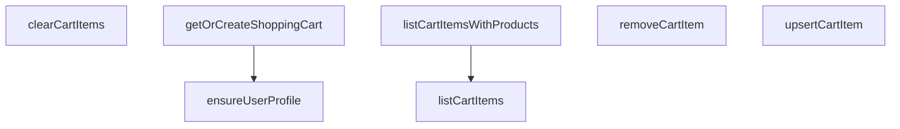

## Genel Bakış
Bu modül, VentHub HVAC platformu için kullanıcı alışveriş sepeti yönetimini gerçekleştiren bir servis modülüdür. Kullanıcı profillerinin doğrulanmasından, kullanıcıya özel sepetlerin oluşturulmasından ve sepet içeriğinin tüm yaşam döngüsü işlemlerinden sorumludur. Veritabanı ile entegre çalışarak sepet verilerinin tutarlı bir şekilde yönetilmesini sağlar.

## Fonksiyon Grupları
### Temel Kullanıcı ve Sepet Başlatma İşlemleri
Sepet işlemlerine başlamadan önce gereken ön kontrolleri ve sepetin hazırlanmasını gerçekleştirir. Kullanıcı profilinin varlığını teyit eder ve kullanıcı için mevcut sepeti getirir ya da yoksa yeni bir sepet oluşturur.
- ensureUserProfile, getOrCreateShoppingCart

### Sepet İçeriği Okuma İşlemleri
Sepette kayıtlı ürünleri farklı detay seviyelerinde sunmak için kullanılan okuma odaklı fonksiyonları barındırır. Sadece sepet öğelerini veya ürün detaylarıyla zenginleştirilmiş tam sepet içeriğini listeleme imkanı sunar.
- listCartItems, listCartItemsWithProducts

### Sepet İçeriği Düzenleme İşlemleri
Sepet içeriğinin değiştirilmesine yönelik tüm yazma işlemlerini gerçekleştirir. Ürün ekleme/güncelleme, tek ürün silme ve tüm sepeti temizleme gibi işlemlerle sepetin dinamik olarak yönetilmesini sağlar.
- upsertCartItem, removeCartItem, clearCartItems

---

## AXIOMS – Mimari Varsayımlar

Bu modül, bir kullanıcının alışveriş sepetini yönetmek için kullanıcı-profil-sepet-ürün hiyerarşisine dayanır. Tüm sepet işlemleri geçerli bir kullanıcı ve sepet kimliği üzerine kuruludur.

**[Aksiyom 1]**: Eğer `userId` parametresi geçerli (tanımlı, dolu bir string) değilse, `ensureUserProfile` ve `getOrCreateShoppingCart`fonksiyonları doğru çalışamaz.

**[Aksiyom 2]**: Eğer kullanıcı profili daha önce oluşturulmamış veya `ensureUserProfile` başarılı bir şekilde çağrılmamışsa, `getOrCreateShoppingCart`'ın o kullanıcı için güvenilir bir sepet döndürmesi garanti edilemez.

**[Aksiyom 3]**: Eğer `cartId` parametresi geçerli (tanımlı, dolu bir string) değilse, `listCartItems`, `listCartItemsWithProducts`, `upsertCartItem`, `removeCartItem` ve `clearCartItems` fonksiyonları doğru çalışamaz.

**[Aksiyom 4]**: Eğer `productId` parametresi `upsertCartItem` fonksiyonuna sağlanmamışsa, sepete ürün eklenemez veya mevcut ürün güncellenemez.

**[Aksiyom 5]**: Eğer `quantity` parametresi `upsertCartItem` fonksiyonuna negatif veya sıfır bir değer olarak sağlanırsa, modülün bu durumu nasıl işlediği bilinmiyor (fonksiyon imzasında kısıt belirtilmemiştir).

**[Aksiyom 6]**: Eğer `unitPrice` veya `priceListId` `upsertCartItem` fonksiyonuna sağlanmazsa (null veya tanımsız), modül bu alanları opsiyonel olarak işler ve fonksiyon yine de çalışabilir.

---

## FONKSİYON DETAYLARI

### ensureUserProfile

**Ne yapar**: Belirtilen kullanıcı için user_profiles tablosunda bir profil kaydı olup olmadığını kontrol eder. Kayıt yoksa yeni bir profil oluşturur. Bu fonksiyon, alışveriş sepeti gibi FOREIGN KEY bağımlılıkları olan işlemlerden önce profile kaydının varlığını garanti altına almak için kullanılır.

**Nasıl yapar**: Önce Supabase üzerinden user_profiles tablosunda verilen userId ile eşleşen bir kayıt arar. Kayıt bulunursa `true` döner. Kayıt bulunamazsa yeni bir profil kaydı insert eder. Insert işlemi başarılı olursa `true`, herhangi bir hata oluşursa `false` değerini döner.

**Parametreler**:
- `userId`: string — Profili kontrol edilecek veya oluşturulacak kullanıcının UUID kimliği

**Dönüş**: `Promise<boolean>` — İşlem başarılıysa `true`, profil bulunamadıysa ve oluşturulamıyorsa `false` döner

### getOrCreateShoppingCart
**Ne yapar**: Geliştirildi ancak detay üretilemedi.

### listCartItems
**Ne yapar**: Geliştirildi ancak detay üretilemedi.

### listCartItemsWithProducts
**Ne yapar**: Geliştirildi ancak detay üretilemedi.

### upsertCartItem
**Ne yapar**: Geliştirildi ancak detay üretilemedi.

### removeCartItem
**Ne yapar**: Geliştirildi ancak detay üretilemedi.

### clearCartItems
**Ne yapar**: Geliştirildi ancak detay üretilemedi.

---

## AST POINTERS

### [N1_NASIL] AST Pointer: src/lib/services/cart.service.ts::ensureUserProfile
- **params**: (userId: string)
- **ic_degiskenler**:
  - `prof` — user_profiles tablosundan userId ile sorgulanan profil sonucu
  - `selErr` — profil sorgulaması hata nesnesi
  - `insErr` — profil ekleme işlemi hata nesnesi
- **Dönüş**: `Promise<boolean>` — profil mevcutsa veya başarıyla oluşturulduysa `true`, değilse `false`

### [N2_NASIL] AST Pointer: src/lib/services/cart.service.ts::getOrCreateShoppingCart
- **params**: (userId: string)
- **ic_degiskenler**:
  - `existing` — mevcut alışveriş sepeti sorgu sonucu (dizi)
  - `selErr` — sepet sorgulaması hata nesnesi
  - `attemptInsert` — yeni sepet ekleme fonksiyonu
  - `data` — ekleme başarılıysa dönen sepet nesnesi
  - `error` — ekleme/hata durumu
  - `err` — SupabaseError arayüzüne cast edilmiş hata nesnesi
  - `again` — çakışma sonrası tekrar sorgulanan sepet nesnesi (dizi)
  - `sel2` — tekrar sorgulama hata nesnesi
- **Dönüş**: `Promise<DbShoppingCart>` — mevcut veya yeni oluşturulmuş alışveriş sepeti nesnesi

### [N3_NASIL] AST Pointer: src/lib/services/cart.service.ts::listCartItems
- **params**: (cartId: string)
- **ic_degiskenler**:
  - `data` — cart_items tablosundan cartId ile sorgulanan sepet öğeleri dizisi
  - `error` — sorgulama hata nesnesi
- **Dönüş**: `Promise<DbCartItem[]>` — sepetteki öğelerin dizisi

### [N4_NASIL] AST Pointer: src/lib/services/cart.service.ts::listCartItemsWithProducts
- **params**: (cartId: string)
- **ic_degiskenler**:
  - `items` — listCartItems fonksiyonuyla alınan sepet öğeleri dizisi
  - `_productIds` — benzersiz ürün ID'lerinden oluşan dizi
  - `products` — ürün tablosundan sorgulanan DbProduct nesneleri dizisi
  - `pErr` — ürün sorgulaması hata nesnesi
  - `map` — ürün ID'lerini Product nesnelerine eşleyen Map nesnesi
  - `p` — döngü içinde her bir DbProduct nesnesi
- **Dönüş**: `Promise<{ item: DbCartItem; product: Product }[]>` — her sepet öğesi ile ilişkili ürünün eşleştirildiği nesne dizisi

### [N5_NASIL] AST Pointer: src/lib/services/cart.service.ts::upsertCartItem
- **params**: (params: { cartId: string; _productId: string; quantity: number; unitPrice?: number | null; priceListId?: string | null })
- **ic_degiskenler**:
  - `cartId` — params nesnesinden extract edilen sepet ID'si
  - `_productId` — params nesnesinden extract edilen ürün ID'si
  - `quantity` — params nesnesinden extract edilen miktar
  - `unitPrice` — params nesnesinden extract edilen birim fiyat (opsiyonel)
  - `priceListId` — params nesnesinden extract edilen fiyat listesi ID'si (opsiyonel)
  - `sel` — mevcut sepet öğesi sorgulama sonucu
  - `common` — güncelleme/ekleme için kullanılacak ortak alanların nesnesi
  - `upd` — güncelleme işlemi sonucu
  - `ins` — ekleme işlemi sonucu
- **Dönüş**: `Promise<DbCartItem[]>` — güncellenmiş veya yeni eklenmiş sepet öğesi dizisi

### [N6_NASIL] AST Pointer: src/lib/services/cart.service.ts::removeCartItem
- **params**: (cartId: string, productId: string)
- **ic_degiskenler**:
  - `error` — silme işlemi hata nesnesi
- **Dönüş**: `Promise<boolean>` — silme başarılıysa `true`

### [N7_NASIL] AST Pointer: src/lib/services/cart.service.ts::clearCartItems
- **params**: (cartId: string)
- **ic_degiskenler**:
  - `error` — silme işlemi hata nesnesi
- **Dönüş**: `Promise<boolean>` — silme başarılıysa `true`

---

## MERMAID CALL GRAPH

## NODE ID STANDARD

  file: src\lib\services\cart.service.ts
  function: src\lib\services\cart.service.ts::ensureUserProfile
  function: src\lib\services\cart.service.ts::getOrCreateShoppingCart
  function: src\lib\services\cart.service.ts::listCartItems
  function: src\lib\services\cart.service.ts::listCartItemsWithProducts
  function: src\lib\services\cart.service.ts::upsertCartItem
  function: src\lib\services\cart.service.ts::removeCartItem
  function: src\lib\services\cart.service.ts::clearCartItems

---

## DISA AKTARILANLAR (EXPORTS)
  export: clearCartItems
  export: ensureUserProfile
  export: getOrCreateShoppingCart
  export: listCartItems
  export: listCartItemsWithProducts
  export: removeCartItem
  export: upsertCartItem