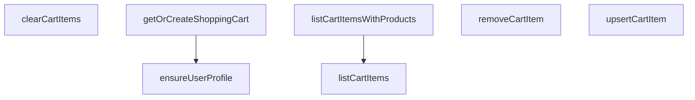

## Genel Bakış
Bu modül, alışveriş sepeti yönetimini sağlayan bir servis katmanıdır. Kullanıcı profilinin ve sepetin oluşturulmasını, sepetteki ürünlerin listelenmesini, eklenmesini, çıkarılmasını ve temizlenmesini kapsayan temel işlemleri içerir.

## Fonksiyon Grupları
### Kullanıcı ve Sepet Oluşturma
Bu fonksiyonlar, kullanıcının sistemde bir profilinin ve ilişkili bir alışveriş sepetinin olmasını güvence altına alır.
- ensureUserProfile, getOrCreateShoppingCart

### Sepet Ürün İşlemleri
Bu fonksiyonlar, bir alışveriş sepetindeki ürünlerin listelenmesi, eklenmesi/güncellenmesi, çıkarılması ve tamamen temizlenmesi gibi CRUD (oluşturma, okuma, güncelleme, silme) işlemlerini yönetir.
- listCartItems, listCartItemsWithProducts, upsertCartItem, removeCartItem, clearCartItems

---

## AXIOMS – Mimari Varsayımlar

[Aksiyom 1]: Eğer `supabase` parametresi (Supab

---

## FONKSİYON DETAYLARI

### ensureUserProfile
**Ne yapar**: Verilen kullanıcı kimliğine sahip bir profil kaydının `user_profiles` tablosunda bulunup bulunmadığını kontrol eder. Profil mevcutsa `true` döner; mevcut değilse yeni bir profil kaydı oluşturmayı dener ve başarılı olursa `true`, başarısız olursa `false` döner.

**Nasıl yapar**: Önce Supabase istemcisi üzerinden `user_profiles` tablosunda `id` alanı `userId` ile eşleşen bir kayıt arar ve `maybeSingle()` ile en fazla bir sonuç bekler. Sorgu hatasız ve kayıt mevcutsa doğrudan `true` döner. Kayıt bulunamazsa, `insert` işlemiyle yeni bir profil oluşturur. Insert hatası oluşursa `false` döner. Tüm süreç bir `try-catch` bloğuyla sarılmıştır; yakalanan herhangi bir istisna durumunda `false` döner.

**Parametreler**:
- supabase: SupabaseClient\<Database\> — Aktif Supabase istemci örneği. Veritabanı sorgularını yürütmek için kullanılır.
- userId: string — Profili kontrol edilecek veya oluşturulacak kullanıcının benzersiz kimlik değeri.

**Dönüş**: Promise\<boolean\> — Kullanıcı profilinin mevcut olduğunu veya başarıyla oluşturulduğunu belirten boolean değer. Hata durumunda `false` döner.

### getOrCreateShoppingCart
**Ne yapar**: Geliştirildi ancak detay üretilemedi.

### listCartItems
**Ne yapar**: Geliştirildi ancak detay üretilemedi.

### listCartItemsWithProducts
**Ne yapar**: Geliştirildi ancak detay üretilemedi.

### upsertCartItem
**Ne yapar**: Geliştirildi ancak detay üretilemedi.

### removeCartItem
**Ne yapar**: Geliştirildi ancak detay üretilemedi.

### clearCartItems
**Ne yapar**: Geliştirildi ancak detay üretilemedi.

---

## İTHALATLAR (IMPORTS)
- import: ../../types/database.types::type { Database }
- import: ../../types/db-rows::type { DbCartItem, DbProduct,DbShoppingCart }
- import: ../../types/ui-models::type { Product }
- import: ../type-converters::mapDatabaseProductToDomain
- import: ./product.columns::VARIANT_DETAIL_COLUMNS
- import: @supabase/supabase-js::type { SupabaseClient }

---

## AST POINTERS

### [N1_NASIL] AST Pointer: cart.service.ts::ensureUserProfile
- **params**: `supabase` — SupabaseClient<Database> tipinde veritabanı istemcisi; `userId` — kullanıcı kimliği (string)
- **ic_degiskenler**:
  - `prof` — `user_profiles` tablosundan `.select('id').eq('id', userId).maybeSingle()` sorgusu sonucu dönen veri; kullanıcı profili varsa `id` alanını içerir, yoksa `null` olur
  - `selErr` — `user_profiles` tablosundan yapılan sorgu sonucu oluşan hata; sorgu başarılıysa `null`/`undefined`
  - `insErr` — `user_profiles` tablosuna `.insert({ id: userId })` işlemi sonucu oluşan hata; insert başarılıysa `null`/`undefined`
- **Dönüş**: `Promise<boolean>` — profil mevcutsa veya başarıyla oluşturulduysa `true`, herhangi bir hata durumunda `false`

### [N2_NASIL] AST Pointer: cart.service.ts::getOrCreateShoppingCart
- **params**: `supabase` — SupabaseClient<Database> tipinde veritabanı istemcisi; `userId` — kullanıcı kimliği (string)
- **ic_degiskenler**:
  - `existing` — `shopping_carts` tablosundan `.select('*').eq('user_id', userId).limit(1)` sorgusu sonucu dönen veri dizisi; mevcut sepet varsa içinde DbShoppingCart nesneleri bulunur
  - `selErr` — `shopping_carts` tablosundan yapılan sorgu sonucu oluşan hata
  - `attemptInsert` — `shopping_carts` tablosuna `.insert({ user_id: userId }).select('*').single()` işlemi yapan async fonksiyon; çağrıldığında insert sonucunu döner
  - `data` — `attemptInsert()` çağrısı sonucu dönen veri; DbShoppingCart nesnesi veya `null`
  - `error` — `attemptInsert()` çağrısı sonucu oluşan hata; insert başarılıysa `null`
  - `err` — `error` değişkeninin `SupabaseError` arayüzüne (`code?: string; message?: string`) cast edilmiş hali; hata kodu ve mesajına erişim sağlar
  - `again` — unique conflict durumunda `shopping_carts` tablosundan tekrar `.select('*').eq('user_id', userId).limit(1)` sorgusu sonucu dönen veri dizisi
  - `sel2` — unique conflict durumunda tekrar yapılan sorgu sonucu oluşan hata
- **Dönüş**: `Promise<DbShoppingCart>` — mevcut veya yeni oluşturulmuş alışveriş sepeti nesnesi; hata durumunda `throw` ile fırlatılır

### [N3_NASIL] AST Pointer: cart.service.ts::listCartItems
- **params**: `supabase` — SupabaseClient<Database> tipinde veritabanı istemcisi; `cartId` — sepet kimliği (string)
- **ic_degiskenler**:
  - `data` — `cart_items` tablosundan `.select('*').eq('cart_id', cartId)` sorgusu sonucu dönen veri dizisi; DbCartItem nesnelerini içerir
  - `error` — `cart_items` tablosundan yapılan sorgu sonucu oluşan hata; sorgu başarılıysa `null`
- **Dönüş**: `Promise<DbCartItem[]>` — sepet öğeleri dizisi; hata durumunda `throw` ile fırlatılır, veri yoksa boş dizi `[]` döner

### [N4_NASIL] AST Pointer: cart.service.ts::listCartItemsWithProducts
- **params**: `supabase` — SupabaseClient<Database> tipinde veritabanı istemcisi; `cartId` — sepet kimliği (string)
- **ic_degiskenler**:
  - `items` — `listCartItems(supabase, cartId)` çağrısı sonucu dönen DbCartItem dizisi; sepetteki tüm öğeleri içerir
  - `_productIds` — `items` dizisindeki her bir öğenin `product_id` alanından oluşturulan, tekrar edenlerin kaldırıldığı benzersiz ürün kimlikleri dizisi (`Array.from(new Set(...))`)
  - `products` — `products` tablosundan `.select(VARIANT_DETAIL_COLUMNS).in('id', _productIds)` sorgusu sonucu dönen veri; `VARIANT_DETAIL_COLUMNS` sabitinde tanımlı kolonları seçen DbProduct nesneleri dizisi
  - `pErr` — `products` tablosundan yapılan sorgu sonucu oluşan hata; sorgu başarılıysa `null`
  - `map` — `Map<string, Product>` tipinde harita; anahtar olarak `p.id` (ürün kimliği), değer olarak `mapDatabaseProductToDomain(p)` dönüşüm fonksiyonu sonucu elde edilen `Product` nesnesi
  - `p` — `products` dizisindeki her bir `DbProduct` nesnesi; `map.set(p.id, mapDatabaseProductToDomain(p))` işleminde kullanılır
  - `i` — `items` dizisindeki her bir `DbCartItem` nesnesi; `map.get(i.product_id)` ile eşleştirilir
  - `x` — `items.map(...)` sonucu oluşan her bir `{ item: DbCartItem, product: Product }` nesnesi; `.filter(x => !!x.product)` ile `product` alanı tanımlı olmayanlar elenir
- **Dönüş**: `Promise<{ item: DbCartItem; product: Product }[]>` — sepet öğeleri ve karşılık gelen ürün bilgileri dizisi; ürünler bulunamayan öğeler filtrelenir, hata durumunda `throw` ile fırlatılır

### [N5_NASIL] AST Pointer: cart.service.ts::upsertCartItem
- **params**: `supabase` — SupabaseClient<Database> tipinde veritabanı istemcisi; `params` — nesne: `cartId` (sepet kimliği), `_productId` (ürün kimliği), `quantity` (miktar, zorunlu), `unitPrice` (birim fiyat, opsiyonel), `priceListId` (fiyat listesi kimliği, opsiyonel)
- **ic_degiskenler**:
  - `cartId` — `params` nesnesinden destructure edilen sepet kimliği
  - `_productId` — `params` nesnesinden destructure edilen ürün kimliği
  - `quantity` — `params` nesnesinden destructure edilen miktar değeri
  - `unitPrice` — `params` nesnesinden destructure edilen birim fiyat; `undefined` ise güncelleme nesnesine eklenmez
  - `priceListId` — `params` nesnesinden destructure edilen fiyat listesi kimliği; `undefined` ise güncelleme nesnesine eklenmez
  - `sel` — `cart_items` tablosundan `.select('id').eq('cart_id', cartId).eq('product_id', _productId).limit(1)` sorgusu sonucu; mevcut öğe varlığını kontrol etmek için kullanılır
  - `common` — `Database['public']['Tables']['cart_items']['Update']` tipinde güncelleme nesnesi; `quantity` alanını zorunlu içerir, `unitPrice` ve `priceListId` tanımlıysa ilgili alanları da ekler
  - `upd` — mevcut öğe bulunduğunda `cart_items` tablosundan `.update(common).eq('cart_id', cartId).eq('product_id', _productId).select('*')` işlemi sonucu; güncellenmiş DbCartItem dizisi
  - `ins` — mevcut öğe bulunamadığında `cart_items` tablosuna `.insert({ cart_id: cartId, product_id: _productId, ...common }).select('*')` işlemi sonucu; yeni eklenmiş DbCartItem dizisi
- **Dönüş**: `Promise<DbCartItem[]>` — güncellenmiş veya yeni eklenmiş sepet öğeleri dizisi; hata durumunda `throw` ile fırlatılır

### [N6_NASIL] AST Pointer: cart.service.ts::removeCartItem
- **params**: `supabase` — SupabaseClient<Database> tipinde veritabanı istemcisi; `cartId` — sepet kimliği (string); `productId` — ürün kimliği (string)
- **ic_degiskenler**:
  - `error` — `cart_items` tablosundan `.delete().eq('cart_id', cartId).eq('product_id', productId)` işlemi sonucu oluşan hata; silme başarılıysa `null`
- **Dönüş**: `Promise<boolean>` — silme başarılıysa `true`; hata durumunda `throw` ile fırlatılır

### [N7_NASIL] AST Pointer: cart.service.ts::clearCartItems
- **params**: `supabase` — SupabaseClient<Database> tipinde veritabanı istemcisi; `cartId` — sepet kimliği (string)
- **ic_degiskenler**:
  - `error` — `cart_items` tablosundan `.delete().eq('cart_id', cartId)` işlemi sonucu oluşan hata; silme başarılıysa `null`
- **Dönüş**: `Promise<boolean>` — silme başarılıysa `true`; hata durumunda `throw` ile fırlatılır

---

## MERMAID CALL GRAPH

## NODE ID STANDARD

  file: cart.service.ts
  function: cart.service.ts::ensureUserProfile
  function: cart.service.ts::getOrCreateShoppingCart
  function: cart.service.ts::listCartItems
  function: cart.service.ts::listCartItemsWithProducts
  function: cart.service.ts::upsertCartItem
  function: cart.service.ts::removeCartItem
  function: cart.service.ts::clearCartItems

---

## DISA AKTARILANLAR (EXPORTS)
  export: clearCartItems
  export: ensureUserProfile
  export: getOrCreateShoppingCart
  export: listCartItems
  export: listCartItemsWithProducts
  export: removeCartItem
  export: upsertCartItem