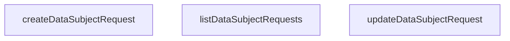

## Genel Bakış

Bu modül, veri koruma düzenlemeleri kapsamında veri sahiplerinin taleplerini (örneğin veri silme, erişim, düzeltme gibi) yönetmek için temel CRUD işlemlerini sunar. Supabase veritabanı üzerinden veri sahibi isteklerini listeleme, oluşturma ve güncelleme operasyonlarını gerçekleştirir.

## Fonksiyon Grupları

### Veri Sahibi İstek Yönetimi

Modülün tek sorumluluk grubudur; veri sahibi isteklerinin yaşam döngüsünü yönetir. Üç fonksiyon birbirini doğrudan çağırmaz; her biri bağımsız olarak Supabase istemcisiyle iletişim kurar.

- `listDataSubjectRequests` — Tüm veri sahibi isteklerini veritabanından getirir.
- `createDataSubjectRequest` — Yeni bir veri sahibi isteği oluşturur; başvuru e-postası, istek türü ve isteğe bağlı olarak kullanıcı kimliği ile kimlik doğrulama zaman damgası gibi bilgileri kaydeder.
- `updateDataSubjectRequest` — Var olan bir isteğin durumunu, sonucunu, tutulan veri notunu veya kimlik doğrulama zaman damgasını günceller.

### Dış Bağımlılıklar

- `SupabaseClient<Database>` — Tüm fonksiyonlar veritabanı erişimi için bu istemciyi parametre olarak alır; modül kendi bağlantısını oluşturmaz.
- `DataSubjectRequest`, `RequestType`, `RequestStatus` — Veri modeli ve durum/tür sabitleri dışarıdan tanımlanmış olup bu modül tarafından tüketilir.

---

## AXIOMS – Mimari Varsayımlar

[Aksiyom 1]: Eğer `supabase` parametresi yoksa, veritabanı bağlantısı kurulamaz ve hiçbir CRUD işlemi gerçekleştirilemez.

[Aksiyom 2]: Eğer `createDataSubjectRequest` fonksiyonunda `input.applicant_email` değeri yoksa, başvuru sahibi tanımlanamaz ve kayıt oluşturulamaz.

[Aksiyom 3]: Eğer `createDataSubjectRequest` fonksiyonunda `input.request_type` değeri yoksa, talep türü belirlenemez ve kayıt oluşturulamaz.

[Aksiyom 4]: Eğer `updateDataSubjectRequest` fonksiyonunda `id` parametresi yoksa, güncellenecek kayıt bulunamaz.

[Aksiyom 5]: Eğer `REQUEST_TYPES` sabiti tanımlı değilse, `createDataSubjectRequest` fonksiyonuna geçerli bir `request_type` değeri gönderilemez.

[Aksiyom 6]: Eğer `REQUEST_STATUSES` sabiti tanımlı değilse, `updateDataSubjectRequest` fonksiyonuna geçerli bir `status` değeri gönderilemez.

[Aksiyom 7]: Eğer `updateDataSubjectRequest` fonksiyonunda `patch` parametresi yoksa, güncellenecek alan belirlenemez ve işlem gerçekleştirilemez.

---

## FONKSİYON DETAYLARI

### listDataSubjectRequests
**Ne yapar**: `data_subject_requests` tablosundaki tüm kayıtları okur ve `due_at` alanına göre artan sırada döndürür. Veritabanı seviyesindeki RLS politikası `p_dsr_admin_all` nedeniyle yalnızca admin rolleri satır görebilir; yetkisiz roller için hata fırlatılmaz, bunun yerine boş küme döner. Çağrı yapan yüzeyin bu boş küme durumunu "kayıt yok" olarak yorumlamaması gerekir çünkü bu bir yetki kısıtı sonucudur.

**Nasıl yapar**: Supabase istemcisi üzerinden `data_subject_requests` tablosuna `select('*')` sorgusu gönderir ve sonuçları `due_at` alanına göre artan (`ascending: true`) sırayla sıralar. Sorgu sırasında oluşan hata varsa fırlatılır; aksi halde dönen `data` değeri, null ise boş dizi (`[]`) ile fallback yapılır.

**Parametreler**:
- `supabase`: `SupabaseClient<Database>` — Veritabanı işlemleri için kullanılan Supabase istemci nesnesi. `Database` generic tipi ile tablo şeması tip güvenliği sağlanır.

**Dönüş**: `Promise<DataSubjectRequest[]>` — `data_subject_requests` tablosundaki kayıtları temsil eden `DataSubjectRequest` nesnelerinden oluşan bir dizi. Kayıt bulunamazsa veya yetki yoksa boş dizi döner.

### createDataSubjectRequest
**Ne yapar**: Geliştirildi ancak detay üretilemedi.

### updateDataSubjectRequest
**Ne yapar**: Geliştirildi ancak detay üretilemedi.

---

## İTHALATLAR (IMPORTS)
- import: ../../types/database.types::type { Database, Tables, TablesInsert, TablesUpdate }
- import: ../kvkk/dueState::isTerminalStatus
- import: @supabase/supabase-js::type { SupabaseClient }

---

## TYPE ALIASES

### DataSubjectRequest
```typescript
type DataSubjectRequest = Tables<'data_subject_requests'>
```

### RequestType
```typescript
type RequestType = (typeof REQUEST_TYPES)[number]
```

### RequestStatus
```typescript
type RequestStatus = (typeof REQUEST_STATUSES)[number]
```

---

## SABİTLER
- **REQUEST_TYPES** (as_expression) — `[
  'access',
  'rectification',
  'erasure',
  'portability',
  'object...`
- **REQUEST_STATUSES** (as_expression) — `[
  'received',
  'identity_pending',
  'in_progress',
  'completed',
  ...`

---

## AST POINTERS

### [N1_NASIL] AST Pointer: dataSubjectRequest.service.ts::listDataSubjectRequests
- **params**: `supabase` — SupabaseClient<Database> tipinde, Supabase istemcisi
- **ic_degiskenler**:
  - `data` — supabase sorgusundan dönen satırlar dizisi; `'data_subject_requests'` tablosundan `'*'` ile seçilen, `due_at` alanına göre artan sıralı sonuç
  - `error` — supabase sorgusunda oluşabilecek hata nesnesi; varsa throw ile fırlatılır
- **Dönüş**: `Promise<DataSubjectRequest[]>` — data varsa kendisi, yoksa boş dizi (`[]`)

### [N2_NASIL] AST Pointer: dataSubjectRequest.service.ts::createDataSubjectRequest
- **params**:
  - `supabase` — SupabaseClient<Database> tipinde, Supabase istemcisi
  - `input` — nesne; şu alanları içerir:
    - `input.applicant_email` — string, başvuru sahibi e-posta adresi
    - `input.request_type` — RequestType, talep türü
    - `input.user_id` — string | null (opsiyonel), kullanıcı kimliği; nullish coalescing ile null'a düşer
    - `input.identity_verified_at` — string | null (opsiyonel), kimlik doğrulama tarihi; nullish coalescing ile null'a düşer
- **ic_degiskenler**:
  - `payload` — `TablesInsert<'data_subject_requests'>` tipinde, veritabanına eklenecek satırı temsil eden nesne; `input.applicant_email`, `input.request_type`, `input.user_id ?? null`, `input.identity_verified_at ?? null` alanlarından oluşur
  - `data` — supabase insert sorgusundan dönen tekil satır (`.single()` ile); insert edilen kaydı temsil eder
  - `error` — supabase insert sorgusunda oluşabilecek hata nesnesi; varsa throw ile fırlatılır
- **Dönüş**: `Promise<DataSubjectRequest>` — insert edilen tekil kayıt

### [N3_NASIL] AST Pointer: dataSubjectRequest.service.ts::updateDataSubjectRequest
- **params**:
  - `supabase` — SupabaseClient<Database> tipinde, Supabase istemcisi
  - `id` — string, güncellenecek kaydın birincil anahtarı
  - `patch` — nesne; şu alanları içerir (hepsi opsiyonel):
    - `patch.status` — RequestStatus, talep durumu
    - `patch.outcome` — string | null, sonuç açıklaması
    - `patch.retained_data_note` — string | null, saklanan veri notu
    - `patch.identity_verified_at` — string | null, kimlik doğrulama tarihi
- **ic_degiskenler**:
  - `next` — `TablesUpdate<'data_subject_requests'>` tipinde, güncelleme nesnesi; `patch`'in spread (`...patch`) kopyası; terminal durumdaysa `completed_at` alanı eklenir
  - `patch.status` — `isTerminalStatus()` fonksiyonuna gönderilerek terminal durum olup olmadığı kontrol edilir
  - `patch.outcome` — terminal durumda varlığı ve boş olmayan (`trim()`) değeri zorunlu kılınır; yoksa `'outcome_required_on_terminal_status'` hatası throw edilir
  - `next.completed_at` — terminal durumda `new Date().toISOString()` ile atanan tamamlanma tarihi
  - `error` — supabase update sorgusunda oluşabilecek hata nesnesi; varsa throw ile fırlatılır
- **Dönüş**: `Promise<void>` — dönüş değeri yok; yan etki olarak `'data_subject_requests'` tablosunda `id` eşleşen satırı günceller

---


## MERMAID CALL GRAPH


## NODE ID STANDARD

  file: src\lib\services\dataSubjectRequest.service.ts
  function: src\lib\services\dataSubjectRequest.service.ts::listDataSubjectRequests
  function: src\lib\services\dataSubjectRequest.service.ts::createDataSubjectRequest
  function: src\lib\services\dataSubjectRequest.service.ts::updateDataSubjectRequest

---

## DISA AKTARILANLAR (EXPORTS)
  export: DataSubjectRequest
  export: REQUEST_STATUSES
  export: REQUEST_TYPES
  export: RequestStatus
  export: RequestType
  export: createDataSubjectRequest
  export: listDataSubjectRequests
  export: updateDataSubjectRequest