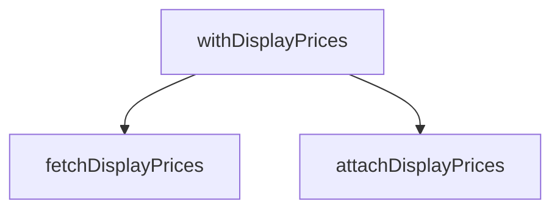

## Genel Bakış

Bu modül, ürün fiyat bilgilerinin veritabanından çekilmesini ve mevcut satır verilerine eklenmesini sağlayan bir servistir. Üç fonksiyondan oluşan modül, Supabase üzerinden fiyat verisini alır ve bu veriyi ürün listesiyle birleştirerek fiyat bilgisi eklenmiş sonuçlar üretir.

## Fonksiyon Grupları

### Veri Çekme
Supabase veritabanından belirli ürün ID'lerine karşılık gelen fiyat bilgilerini sorgular ve anahtar-değer haritası olarak döndürür.
- fetchDisplayPrices

### Veri Birleştirme
Veritabanı erişimi gerektirmeyen saf bir dönüşüm fonksiyonu olarak, fiyat haritasındaki bilgileri satır dizisine ekleyerek fiyat bilgisi eklenmiş yeni bir dizi üretir.
- attachDisplayPrices

### Orkestrasyon
Veri çekme ve birleştirme işlemlerini tek bir çağrıda birleştiren üst düzey fonksiyondur. Hem Supabase istemcisini hem de satır dizisini alarak fiyat bilgisi eklenmiş sonuçları doğrudan döndürür.
- withDisplayPrices

## Bağımlılıklar

**Dış bağımlılıklar:** SupabaseClient, Database tipi, DisplayPriceInfo ve WithDisplayPrice tipleri bu modülün dışından sağlanır. Modül, Supabase istemcisini parametre olarak alır; kendi bağlantısını oluşturmaz.

---

## AXIOMS – Mimari Varsayımlar

Bu modül için özel aksiyom tanımlanmamıştır.

**Gerekçe:** Fonksiyon gövdeleri sağlanmadığından, yalnızca imzalardan aksiyom üretilemez. Mimari varsayımlar ancak fonksiyon gövdesindeki mantık, dallanma koşulları ve hata işleme davranışlarından türetilebilir.

---

## FONKSİYON DETAYLARI

### fetchDisplayPrices
**Ne yapar**: Ürün kimliklerine göre vitrin fiyatlarını çeker. Fiyatı olmayan ürün haritada yer almaz — null yerine yokluk söz konusudur. Bu sayede çağıran taraf "fiyat yok" ile "sıfır fiyat"ı karıştıramaz.

**Nasıl yapar**: Önce `productIds` dizisindeki tekrar eden ve geçersiz (string olmayan veya boş) kimlikleri eler. Kalan benzersiz kimlikleri `PRICE_LOOKUP_CHUNK` boyutunda parçalara bölerek her parça için Supabase'in `get_display_prices` RPC fonksiyonunu çağırır. RPC hatası oluşursa veya veri dönmezse o parçayı atlar, sayfayı düşürmez — vitrin bu durumda "Teklif Alın" gösterir. Dönen her satır için `display_price` değerini sayıya çevirir; sonucu sonlu ve pozitifse haritaya ekler. `tax_included` alanı tam olarak `true` ise vergi dahil bilgisini `true` olarak kaydeder.

**Parametreler**:
- supabase: `SupabaseClient<Database>` — Veritabanı bağlantısı. Supabase istemcisi üzerinden RPC çağrısı yapılır.
- productIds: `string[]` — Vitrin fiyatı sorgulanacak ürünlerin kimliklerini içeren dizi.

**Dönüş**: `Promise<Map<string, DisplayPriceInfo>` — Anahtar olarak `product_id`, değer olarak `DisplayPriceInfo` (içinde `amount` ve `taxIncluded` alanları) içeren bir Map. Fiyatı bulunamayan veya geçersiz fiyatlı ürünler bu haritada yer almaz.

### attachDisplayPrices
**Ne yapar**: Geliştirildi ancak detay üretilemedi.

### withDisplayPrices
**Ne yapar**: Geliştirildi ancak detay üretilemedi.

---

## İTHALATLAR (IMPORTS)
- import: ../../types/database.types::type { Database }
- import: @supabase/supabase-js::type { SupabaseClient }

---

## INTERFACES

### DisplayPriceInfo
Tek ürünün vitrin fiyatı. `amount` yoksa ürün fiyatlanamaz → "Teklif Alın".
- `amount: number`
- `taxIncluded: boolean`

---

## TYPE ALIASES

### WithDisplayPrice
Vitrin fiyatı iliştirilmiş satır. `displayPrice === null` → "Teklif Alın".
```typescript
type WithDisplayPrice = <T>
```

---

## AST POINTERS

### [N1_NASIL] AST Pointer: displayPrice.service.ts::fetchDisplayPrices
- **params**:
  - `supabase` — Supabase istemcisi (SupabaseClient<Database> tipinde)
  - `productIds` — Ürün kimliklerini içeren dizi (string[])
- **ic_degiskenler**:
  - `result` — Sonuç olarak döndürülecek boş Map<string, DisplayPriceInfo> nesnesi; her başarılı fiyat çözümlemesinde ürün kimliği ile fiyat bilgisi eşleştirilerek doldurulur
  - `unique` — `productIds` dizisinden tekrar eden elemanları, string olmayanları ve boş stringleri filtreleyerek elde edilen benzersiz geçerli ürün kimliklerinin dizisi
  - `i` — `unique` dizisini `PRICE_LOOKUP_CHUNK` boyutunda parçalara ayırmak için kullanılan döngü sayacı
  - `chunk` — `unique` dizisinden `i` indeksinden itibaren `PRICE_LOOKUP_CHUNK` uzunluğunda dilimlenen ürün kimlikleri alt kümesi
  - `data` — `supabase.rpc('get_display_prices', { p_product_ids: chunk })` çağrısından dönen veri; her elemanı `product_id`, `display_price`, `tax_included` alanlarını içerir
  - `error` — `supabase.rpc('get_display_prices', ...)` çağrısından dönen hata; mevcutsa veya `data` yoksa o chunk atlanır
  - `row` — `data` dizisindeki her bir satır; `row.display_price` ve `row.product_id` ve `row.tax_included` alanlarına erişilir
  - `amount` — `row.display_price` değerinin `Number()` ile sayıya dönüştürülmüş hali; sonlu ve sıfırdan büyükse `result` Map'ine eklenir
- **Dönüş**: `Promise<Map<string, DisplayPriceInfo>>` — ürün kimliğini fiyat bilgisine eşleyen Map

### [N2_NASIL] AST Pointer: displayPrice.service.ts::attachDisplayPrices
- **params**:
  - `rows` — `id` alanına sahip nesneler dizisi (T[])
  - `prices` — `fetchDisplayPrices` fonksiyonundan dönen fiyat haritası (Map<string, DisplayPriceInfo>)
- **ic_degiskenler**:
  - `row` — `rows` dizisindeki her bir eleman; `row.id` ile `prices` Map'inde arama yapılır
  - `info` — `prices.get(row.id)` sonucu; eşleşme varsa `info.amount` ve `info.taxIncluded` alanlarına erişilir, yoksa `null` atanır
- **Dönüş**: `WithDisplayPrice<T>[]` — her satıra `displayPrice` (amount veya null) ve `displayPriceTaxIncluded` (taxIncluded veya null) alanları eklenmiş dizi

### [N3_NASIL] AST Pointer: displayPrice.service.ts::withDisplayPrices
- **params**:
  - `supabase` — Supabase istemcisi (SupabaseClient<Database> tipinde)
  - `rows` — `id` alanına sahip nesneler dizisi (T[])
- **ic_degiskenler**:
  - `prices` — `fetchDisplayPrices(supabase, rows.map(r => r.id))` çağrısından dönen fiyat haritası; `rows` dizisindeki tüm `r.id` değerleri ile fiyatlar çekilir
- **Dönüş**: `Promise<WithDisplayPrice<T>[]>` — fiyat bilgileri eklenmiş satır dizisi; `rows` boşsa boş dizi döner

---


## MERMAID CALL GRAPH


## NODE ID STANDARD

  file: src\lib\services\displayPrice.service.ts
  function: src\lib\services\displayPrice.service.ts::fetchDisplayPrices
  function: src\lib\services\displayPrice.service.ts::attachDisplayPrices
  function: src\lib\services\displayPrice.service.ts::withDisplayPrices

---

## DISA AKTARILANLAR (EXPORTS)
  export: DisplayPriceInfo
  export: WithDisplayPrice
  export: attachDisplayPrices
  export: fetchDisplayPrices
  export: withDisplayPrices