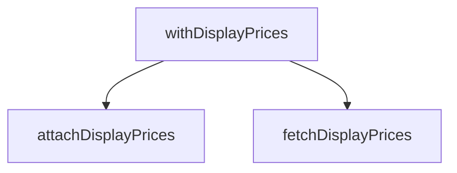

## Genel Bakış

Bu modül, ürün fiyat bilgilerinin veritabanından çekilmesini ve mevcut satır verilerine eklenmesini sağlayan bir servistir. Üç fonksiyondan oluşan modül, Supabase üzerinden fiyat verisini alır ve bu veriyi ürün listesiyle birleştirerek fiyat bilgisi eklenmiş sonuçlar üretir.

## Fonksiyon Grupları

### Veri Çekme
Supabase veritabanından belirli ürün ID'lerine karşılık gelen fiyat bilgilerini sorgular ve anahtar-değer haritası olarak döndürür.
- fetchDisplayPrices

### Veri Birleştirme
Veritabanı erişimi gerektirmeyen saf bir dönüşüm fonksiyonu olarak, fiyat haritasındaki bilgileri satır dizisine ekleyerek fiyat bilgisi eklenmiş yeni bir dizi üretir.
- attachDisplayPrices

### Orkestrasyon
Veri çekme ve birleştirme işlemlerini tek bir çağrıda birleştiren üst düzey fonksiyondur. Hem Supabase istemcisini hem de satır dizisini alarak fiyat bilgisi eklenmiş sonuçları doğrudan döndürür.
- withDisplayPrices

## Bağımlılıklar

**Dış bağımlılıklar:** SupabaseClient, Database tipi, DisplayPriceInfo ve WithDisplayPrice tipleri bu modülün dışından sağlanır. Modül, Supabase istemcisini parametre olarak alır; kendi bağlantısını oluşturmaz.

---

## AXIOMS – Mimari Varsayımlar

Bu modül için özel aksiyom tanımlanmamıştır.

**Gerekçe:** Fonksiyon gövdeleri sağlanmadığından, yalnızca imzalardan aksiyom üretilemez. Mimari varsayımlar ancak fonksiyon gövdesindeki mantık, dallanma koşulları ve hata işleme davranışlarından türetilebilir.

---

## FONKSİYON DETAYLARI

### fetchDisplayPrices
**Ne yapar**: Ürün kimliklerine göre vitrin fiyatlarını çeker. Fiyatı olmayan ürün haritada yer almaz — null yerine yokluk kullanılır, böylece çağıran taraf "fiyat yok" ile "sıfır fiyat"ı karıştıramaz.

**Nasıl yapar**: Önce gelen `productIds` dizisini benzersiz ve geçerli (boş olmayan string) kimliklere filtreler. Ardından bu kimlikleri `PRICE_LOOKUP_CHUNK` sabitine göre parçalara (chunk) bölerek her parça için Supabase'in `get_display_prices` RPC fonksiyonunu çağırır. RPC'den dönen her satır için `display_price` değeri sonlu pozitif bir sayıya dönüştürülebilirse haritaya eklenir; dönüştürülemezse o satır atlanır. Hata durumunda sayfa düşürülmez, sadece o chunk atlanır ve vitrin "Teklif Alın" gösterir.

**Parametreler**:
- supabase: `SupabaseClient<Database>` — Veritabanı bağlantısını temsil eden Supabase istemcisi
- productIds: `string[]` — Vitrin fiyatı sorgulanacak ürün kimliklerinin dizisi

**Dönüş**: `Promise<Map<string, DisplayPriceInfo>>` — Ürün kimliğini anahtar, vitrin fiyat bilgisini (`amount` ve `taxIncluded` alanlarını içeren nesne) değer olarak tutan Map. Fiyatı bulunamayan ürünler bu haritada yer almaz.

### attachDisplayPrices
**Ne yapar**: Geliştirildi ancak detay üretilemedi.

### withDisplayPrices
**Ne yapar**: Geliştirildi ancak detay üretilemedi.

---

## İTHALATLAR (IMPORTS)
- import: ../../types/database.types::type { Database }
- import: @supabase/supabase-js::type { SupabaseClient }

---

## INTERFACES

### DisplayPriceInfo
Tek ürünün vitrin fiyatı. `amount` yoksa ürün fiyatlanamaz → "Teklif Alın".
- `amount: number`
- `taxIncluded: boolean`

---

## TYPE ALIASES

### WithDisplayPrice
Vitrin fiyatı iliştirilmiş satır. `displayPrice === null` → "Teklif Alın".
```typescript
type WithDisplayPrice = <T>
```

---

## AST POINTERS

### [N1_NASIL] AST Pointer: src/lib/services/displayPrice.service.ts::fetchDisplayPrices
- **params**: `supabase` — SupabaseClient<Database> tipinde veritabanı istemcisi; `productIds` — string[] tipinde ürün id dizisi
- **ic_degiskenler**:
  - `result` — Map<string, DisplayPriceInfo> tipinde, döndürülecek fiyat haritası; başlangıçta boş oluşturulur
  - `unique` — productIds dizisinden filtrelenmiş, boş olmayan string elemanlardan oluşan benzersiz id dizisi; `new Set` ile tekrarlar kaldırılır
  - `i` — for döngüsü sayaç değişkeni; PRICE_LOOKUP_CHUNK aralıklarıyla artırılır
  - `chunk` — unique dizisinden i indisinden itibaren PRICE_LOOKUP_CHUNK uzunluğunda dilimlenmiş id alt kümesi
  - `data` — `supabase.rpc('get_display_prices', { p_product_ids: chunk })` çağrısından dönen fiyat satırları; hata varsa veya null ise atlanır
  - `error` — `supabase.rpc` çağrısından dönen hata nesnesi; truthy ise mevcut chunk atlanır
  - `row` — data dizisindeki her bir fiyat satırı
  - `amount` — `row.display_price` değerinin `Number()` ile sayıya çevrilmiş hali; sonlu ve pozitif değilse o satır atlanır
- **Dönüş**: `Promise<Map<string, DisplayPriceInfo>>` — ürün id'lerini fiyat bilgisine eşleyen harita

### [N2_NASIL] AST Pointer: src/lib/services/displayPrice.service.ts::attachDisplayPrices
- **params**: `rows` — T[] tipinde, `{ id: string }` arayüzüne uyan nesne dizisi; `prices` — Map<string, DisplayPriceInfo> tipinde fiyat haritası
- **ic_degiskenler**:
  - `row` — rows.map içindeki her bir eleman; `row.id` ile prices haritasından eşleşme aranır
  - `info` — `prices.get(row.id)` sonucu; eşleşme varsa DisplayPriceInfo, yoksa undefined
- **Dönüş**: `WithDisplayPrice<T>[]` — her satıra `displayPrice` (info.amount veya null) ve `displayPriceTaxIncluded` (info.taxIncluded veya null) alanları eklenmiş yeni dizi

### [N3_NASIL] AST Pointer: src/lib/services/displayPrice.service.ts::withDisplayPrices
- **params**: `supabase` — SupabaseClient<Database> tipinde veritabanı istemcisi; `rows` — T[] tipinde, `{ id: string }` arayüzüne uyan nesne dizisi
- **ic_degiskenler**:
  - `prices` — `fetchDisplayPrices(supabase, rows.map(r => r.id))` çağrısından dönen Map<string, DisplayPriceInfo> haritası; rows dizisi boşsa bu çağrı yapılmaz
- **Dönüş**: `Promise<WithDisplayPrice<T>[]>` — rows dizisine fiyat bilgileri eklenmiş yeni dizi; rows boşsa boş dizi döner

---


## MERMAID CALL GRAPH


## NODE ID STANDARD

  file: src\lib\services\displayPrice.service.ts
  function: src\lib\services\displayPrice.service.ts::fetchDisplayPrices
  function: src\lib\services\displayPrice.service.ts::attachDisplayPrices
  function: src\lib\services\displayPrice.service.ts::withDisplayPrices

---

## DISA AKTARILANLAR (EXPORTS)
  export: DisplayPriceInfo
  export: WithDisplayPrice
  export: attachDisplayPrices
  export: fetchDisplayPrices
  export: withDisplayPrices