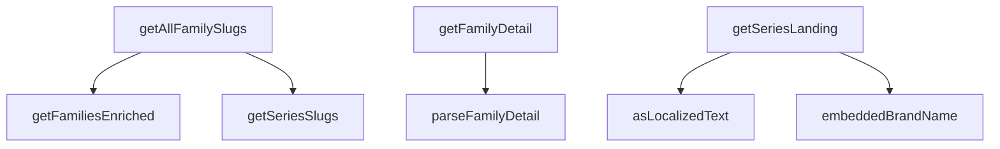

## Genel Bakış
Bu modül, HVAC ürün ailelerinin ve serilerinin Supabase veritabanından sorgulanması ve ham verilerin uygulama katmanına uygun türlere dönüştürülmesinden sorumludur. Sayfalı liste getirme, slug tabanlı detay sorgulama ve statik site üretimi için gerekli slug listelerinin sağlanması gibi veri erişim operasyonlarını sunar. Yerelleştirilmiş metin ve marka adı gibi çoklu kaynak yapısına sahip verilerin normalize edilmesi de bu modülün kapsamındadır.

## Fonksiyon Grupları

### Veri Erişim ve Sorgulama
Supabase üzerinden aile ve seri verilerini sorgular; sayfalı liste, detay ve slug listesi gibi farklı erişim modlarını destekler.
- getFamiliesEnriched, getFamilyDetail, getSeriesLanding, getSeriesSlugs, getAllFamilySlugs

### Veri Dönüştürme ve Normalizasyon
Ham veritabanı çıktılarını uygulama katmanının beklediği türlere dönüştürür; çoklu dil desteği ve esnek marka yapısı gibi düzensiz veri formatlarını normalize eder.
- parseFamilyDetail, embeddedBrandName, asLocalizedText

### Fonksiyonlar Arası İlişkiler
- `getFamilyDetail` fonksiyonunun, sorgu sonucunu türlere dönüştürmek için `parseFamilyDetail` çağırması beklenir.
- `parseFamilyDetail` fonksiyonunun, ham veri içindeki marka ve metin alanlarını işlemek üzere `embeddedBrandName` ve `asLocalizedText` kullanması beklenir.
- `getFamiliesEnriched`, `getSeriesLanding`, `getSeriesSlugs` ve `getAllFamilySlugs` doğrudan Supabase istemcisiyle çalışır; aralarında doğrudan çağrı ilişkisi bulunmaz.

### Dış Bağımlılıklar
- SupabaseClient ve Database tipi (veritabanı bağlantısı)
- GetFamiliesParams, FamiliesPage, FamilyDetail, SeriesLanding tipleri (çağrı parametreleri ve dönüş değerleri)

---

## AXIOMS – Mimari Varsayımlar

[Aksiyom 1]: Eğer `supabase` parametresi geçerli bir Supabase istemcisi değilse, tüm `async` fonksiyonlar (`getFamiliesEnriched`, `getFamilyDetail`, `getSeriesLanding`, `getSeriesSlugs`, `getAllFamilySlugs`) veritabanı sorgusu gerçekleştiremez ve hata üretir.

[Aksiyom 2]: Eğer `slug` parametresi veritabanında karşılık gelen bir kayıtla eşleşmiyorsa, `getFamilyDetail` ve `getSeriesLanding` fonksiyonları `null` döndürür.

[Aksiyom 3]: Eğer `lang` parametresi `tr` veya `en` dışında bir değer alırsa, `getFamilyDetail` fonksiyonunun nasıl davrandığı bilinmiyor — gövde incelenmeden çıkarım yapılamaz.

[Aksiyom 4]: Eğer `parseFamilyDetail` fonksiyonuna gelen `data` beklenen yapıya uymuyorsa, fonksiyon `null` döndürür.

[Aksiyom 5]: Eğer `embeddedBrandName` fonksiyonuna `null` geçilirse, fonksiyon `null` döndürür. Parametre tipi hem tekil `{ name: string }` hem de dizi `{ name: string }[]` kabul eder; bu durumda hangi koşulda hangi formatta çağrılacağı bilinmiyor.

[Aksiyom 6]: Eğer `asLocalizedText` fonksiyonuna gelen `value` geçerli bir lokalize metin yapısına uymuyorsa, fonksiyon `null` döndürür. Dönen yapının `tr` ve `en` alanları opsiyoneldir (ikisi de `null` olabilir).

[Aksiyom 7]: Eğer `getSeriesSlugs` veya `getAllFamilySlugs` fonksiyonlarına erişilemez veritabanı tabloları hedeflenirse, boş dizi dönmesi beklenir ancak bu davranış gövdeden doğrulanamaz.

---

## FONKSİYON DETAYLARI

### getFamiliesEnriched
**Ne yapar**: Supabase RPC fonksiyonu `get_product_families_enriched` aracılığıyla zenginleştirilmiş ürün ailesi listesini sayfalı biçimde getirir. Filtreleme, arama ve sayfa parametrelerini RPC'ye iletir; dönen veriyi `FamiliesPage` yapısına dönüştürerek toplam kayıt sayısıyla birlikte sunar.

**Nasıl yapar**: Supabase istemcisinin `rpc` metodunu çağırarak `get_product_families_enriched` adlı veritabanı fonksiyonunu tetikler. Parametre olarak kategori kimlikleri, limit, offset, arama sorgusu ve marka bilgisini geçirir. Limit ve offset değerleri belirtilmemişse sırasıyla 24 ve 0 olarak varsayılan değer alır. RPC'den dönen hata varsa fırlatır; veri yoksa boş dizi kullanır. Sonuçtaki her öğe `FamilyListItem` tipine dönüştürülür ve ilk öğenin `total_count` alanı toplam kayıt sayısı olarak alınır; öğe yoksa toplam 0 kabul edilir.

**Parametreler**:
- supabase: `SupabaseClient<Database>` — Supabase veritabanı istemcisi örneği
- params: `GetFamiliesParams` — Aile listesi sorgu parametreleri; `categoryIds` (filtrelenecek kategori kimlikleri), `limit` (sayfa başına kayıt sayısı, varsayılan 24), `offset` (atlanacak kayıt sayısı, varsayılan 0), `searchQuery` (metin arama sorgusu), `brand` (marka filtresi) alanlarını içerir

**Dönüş**: `Promise<FamiliesPage>` — `items` (FamilyListItem dizisi) ve `total` (toplam kayıt sayısı) alanlarından oluşan sayfa nesnesi döndüren Promise.

### parseFamilyDetail
**Ne yapar**: Geliştirildi ancak detay üretilemedi.

### getFamilyDetail
**Ne yapar**: Geliştirildi ancak detay üretilemedi.

### embeddedBrandName
**Ne yapar**: Geliştirildi ancak detay üretilemedi.

### asLocalizedText
**Ne yapar**: Geliştirildi ancak detay üretilemedi.

### getSeriesLanding
**Ne yapar**: Geliştirildi ancak detay üretilemedi.

### getSeriesSlugs
**Ne yapar**: Geliştirildi ancak detay üretilemedi.

### getAllFamilySlugs
**Ne yapar**: Geliştirildi ancak detay üretilemedi.

---

## İTHALATLAR (IMPORTS)
- import: ../../types/database.types::type { Database }
- import: ../../types/db-rows::type { DbCategory }
- import: ../../types/ui-models::type { FamilyListItem }
- import: @supabase/supabase-js::type { SupabaseClient }

---

## INTERFACES

### GetFamiliesParams
- `categoryIds?: string[]`
- `searchQuery?: string`
- `brand?: string`
- `limit?: number`
- `offset?: number`

### FamiliesPage
- `items: FamilyListItem[]`
- `total: number`

### FamilyVariant
get_family_detail RPC'sinin 'variants' eleman modeli.
- `id: string`
- `sku: string`
- `name: string`
- `slug: string | null`
- `model_code: string | null`
- `price: number | null`
- `stock_qty: number | null`
- `technical_specs: Record<string, string | number | boolean | null> | null`
- `description: string | null`
- `images: { path: string; alt: string | null; sort_order: number }[]`

### FamilyDetail
- `family: {`
- `variants: FamilyVariant[]`
- `price_tax_included: boolean | null`

### SeriesLanding
T138-VH K1 — SERİ LANDING modeli. `product_families.parent_family_id` (20260821180000) hiyerarşiyi TEK seviye tutar: `NULL` = **seri** (landing sayfası), `NOT NULL` = **model** (vitrin kartı). Seri satırının doğrudan varyantı YOKTUR — bu yüzden `get_product_families_enriched` onu inner-join ile eler
- `series: {`
- `models: FamilyListItem[]`

---

## AST POINTERS

### [N1_NASIL] AST Pointer: src/lib/services/family.service.ts::getFamiliesEnriched
- **params**: `supabase` — SupabaseClient<Database> tipinde veritabanı istemcisi; `params` — GetFamiliesParams tipinde filtreleme ve sayfalama parametreleri (opsiyonel, varsayılan boş nesne)
- **ic_degiskenler**:
  - `data` — supabase.rpc('get_product_families_enriched') çağrısından dönen satırlar dizisi
  - `error` — RPC çağrısından dönen hata nesnesi; varsa throw ile fırlatılır
  - `items` — data dizisinin FamilyListItem[] tipine cast edilmiş hali; data null ise boş dizi kullanılır
  - `params.categoryIds` — RPC'ye p_category_ids olarak iletilen kategori ID filtresi
  - `params.limit` — RPC'ye p_limit olarak iletilen sayfa boyutu; belirtilmemişse 24 kullanılır
  - `params.offset` — RPC'ye p_offset olarak iletilen başlangıç indeksi; belirtilmemişse 0 kullanılır
  - `params.searchQuery` — RPC'ye p_search_query olarak iletilen arama sorgusu
  - `params.brand` — RPC'ye p_brand olarak iletilen marka filtresi
- **Dönüş**: `{ items: FamilyListItem[], total: number }` — items dizisi ve ilk elemandan okunan total_count (eleman yoksa 0)

### [N2_NASIL] AST Pointer: src/lib/services/family.service.ts::parseFamilyDetail
- **params**: `data` — unknown tipinde ham veri; RPC'den dönen aile detay nesnesi
- **ic_degiskenler**:
  - `obj` — data'nın Record<string, unknown> tipine cast edilmiş hali
  - `family` — obj.family alanından okunan aile nesnesi; object ve null değilse geçerli
  - `variants` — obj.variants alanından okunan varyant dizisi; Array.isArray kontrolü yapılır
  - `taxIncluded` — obj.price_tax_included alanından okunan boolean değer; boolean değilse null atanır
- **Dönüş**: `FamilyDetail | null` — { family, variants, price_tax_included } nesnesi veya geçersiz veride null

### [N3_NASIL] AST Pointer: src/lib/services/family.service.ts::getFamilyDetail
- **params**: `supabase` — SupabaseClient<Database> tipinde veritabanı istemcisi; `slug` — string tipinde aile slug'ı; `lang` — string tipinde dil kodu
- **ic_degiskenler**:
  - `data` — supabase.rpc('get_family_detail') çağrısından dönen ham veri
  - `error` — RPC çağrısından dönen hata nesnesi; varsa throw ile fırlatılır
  - `detail` — parseFamilyDetail(data) çağrısının sonucu; null ise fonksiyon null döner
  - `categoryIds` — detail.family.category_id ve detail.family.subcategory_id değerlerinden oluşan, null/undefined olmayan string dizisi
  - `categoryById` — Map<string, DbCategory> tipinde kategori ID → kategori satırı eşleme haritası
  - `categoryRows` — supabase.from('categories').select('*').in('id', categoryIds) sorgusundan dönen DbCategory dizisi
  - `categoryError` — kategori sorgusundan dönen hata nesnesi; varsa throw ile fırlatılır
  - `detail.family.category` — categoryById haritasından detail.family.category_id ile eşleştirilen DbCategory nesnesi veya null
  - `detail.family.subcategory` — categoryById haritasından detail.family.subcategory_id ile eşleştirilen DbCategory nesnesi veya null
- **Dönüş**: `FamilyDetail | null` — kategori satırları gömülmüş FamilyDetail nesnesi veya null

### [N4_NASIL] AST Pointer: src/lib/services/family.service.ts::embeddedBrandName
- **params**: `brands` — `{ name: string } | { name: string }[] | null` tipinde marka nesnesi veya dizisi
- **ic_degiskenler**: (yok)
- **Dönüş**: `string | null` — brands null ise null; dizi ise ilk elemanın name'i (yoksa null); tek nesne ise doğrudan name

### [N5_NASIL] AST Pointer: src/lib/services/family.service.ts::asLocalizedText
- **params**: `value` — unknown tipinde ham değer
- **ic_degiskenler**: (yok)
- **Dönüş**: `{ tr?: string | null; en?: string | null } | null` — value object ve null değilse cast edilerek döndürülür; aksi halde null

### [N6_NASIL] AST Pointer: src/lib/services/family.service.ts::getSeriesLanding
- **params**: `supabase` — SupabaseClient<Database> tipinde veritabanı istemcisi; `slug` — string tipinde seri slug'ı
- **ic_degiskenler**:
  - `series` — supabase.from('product_families').select(...).eq('slug', slug).maybeSingle() sorgusundan dönen seri satırı; null olabilir
  - `error` — ilk sorgudan dönen hata nesnesi; varsa throw ile fırlatılır
  - `modelRows` — supabase.from('product_families').select(...).eq('parent_family_id', series.id) sorgusundan dönen model satırları dizisi
  - `modelError` — model sorgusundan dönen hata nesnesi; varsa throw ile fırlatılır
  - `rows` — modelRows dizisi; null ise boş dizi kullanılır
  - `models` — rows.map() ile dönüştürülen FamilyListItem dizisi
  - `m` — map callback'indeki her bir model satırı
  - `variants` — m.products dizisinin sku'ya göre sıralanmış kopyası
  - `coverPath` — varyantların product_images dizisinden sort_order'a göre sıralanarak elde edilen ilk görselin path'i; yoksa null
  - `categoryIds` — series.category_id ve series.subcategory_id değerlerinden oluşan, null/undefined olmayan string dizisi
  - `categoryById` — Map<string, DbCategory> tipinde kategori ID → kategori satırı eşleme haritası
  - `categoryRows` — supabase.from('categories').select('*').in('id', categoryIds) sorgusundan dönen DbCategory dizisi
  - `categoryError` — kategori sorgusundan dönen hata nesnesi; varsa throw ile fırlatılır
- **Dönüş**: `SeriesLanding | null` — { series: {...}, models: FamilyListItem[] } nesnesi; seri yoksa veya parent_family_id doluysa null; models boşsa null

### [N7_NASIL] AST Pointer: src/lib/services/family.service.ts::getSeriesSlugs
- **params**: `supabase` — SupabaseClient<Database> tipinde veritabanı istemcisi
- **ic_degiskenler**:
  - `children` — supabase.from('product_families').select('parent_family_id').not('parent_family_id', 'is', null) sorgusundan dönen satırlar dizisi
  - `error` — ilk sorgudan dönen hata nesnesi; varsa throw ile fırlatılır
  - `parentIds` — children dizisinden parent_family_id değerlerinin Set ile benzersiz hale getirilmiş, null olmayan string dizisi
  - `parents` — supabase.from('product_families').select('slug').in('id', parentIds) sorgusundan dönen satırlar dizisi
  - `parentError` — ikinci sorgudan dönen hata nesnesi; varsa throw ile fırlatılır
- **Dönüş**: `{ slug: string }[]` — parent satırlarından slug alanının map edildiği dizi; parentIds boşsa boş dizi

### [N8_NASIL] AST Pointer: src/lib/services/family.service.ts::getAllFamilySlugs
- **params**: `supabase` — SupabaseClient<Database> tipinde veritabanı istemcisi
- **ic_degiskenler**:
  - `PAGE` — sabit 96; her sayfada çekilecek aile sayısı
  - `MAX_PAGES` — sabit 50; sonsuz döngü emniyeti için maksimum sayfa sayısı (4800 aile tavanı)
  - `slugs` — { slug: string }[] tipinde toplanan slug dizisi
  - `offset` — sayfalama başlangıç indeksi; her döngüde items.length kadar artırılır
  - `total` — getFamiliesEnriched'den dönen toplam aile sayısı
  - `page` — for döngüsü sayaç değişkeni
  - `items` — getFamiliesEnriched(supabase, { limit: PAGE, offset }) çağrısından dönen aile listesi
  - `t` — getFamiliesEnriched'den dönen total değeri; her döngüde total'e atanır
  - `seen` — Set<string> tipinde eklenen slug'ların tekrarını önlemek için kullanılan küme
  - `s` — getSeriesSlugs(supabase) çağrısından dönen her bir seri slug nesnesi
- **Dönüş**: `{ slug: string }[]` — aile ve seri slug'larının birleşik, benzersiz dizisi; sayfalama tavanı aşılırsa hata fırlatılır

---

## MERMAID CALL GRAPH

## NODE ID STANDARD

  file: src\lib\services\family.service.ts
  function: src\lib\services\family.service.ts::getFamiliesEnriched
  function: src\lib\services\family.service.ts::parseFamilyDetail
  function: src\lib\services\family.service.ts::getFamilyDetail
  function: src\lib\services\family.service.ts::embeddedBrandName
  function: src\lib\services\family.service.ts::asLocalizedText
  function: src\lib\services\family.service.ts::getSeriesLanding
  function: src\lib\services\family.service.ts::getSeriesSlugs
  function: src\lib\services\family.service.ts::getAllFamilySlugs

---

## DISA AKTARILANLAR (EXPORTS)
  export: FamiliesPage
  export: FamilyDetail
  export: FamilyVariant
  export: GetFamiliesParams
  export: SeriesLanding
  export: asLocalizedText
  export: embeddedBrandName
  export: getAllFamilySlugs
  export: getFamiliesEnriched
  export: getFamilyDetail
  export: getSeriesLanding
  export: getSeriesSlugs
  export: parseFamilyDetail