## Genel Bakış
Bu modül, fatura profillerinin lifecycle yönetimini sağlayan servis katmanıdır. Platform genelinde kullanılacak fatura profillerinin CRUD işlemleri ve varsayılan profil belirleme mantığını merkezi olarak sunar.

## Fonksiyon Grupları
### Temel Fatura Profili CRUD İşlemleri
Fatura profillerinin veritabanında oluşturulması, listelenmesi, güncellenmesi ve silinmesi işlemlerini yönetir.
- listInvoiceProfiles, createInvoiceProfile, updateInvoiceProfile, deleteInvoiceProfile

### Varsayılan Fatura Profili Yönetimi
İşletmenin sürekli kullanacağı varsayılan fatura profilinin ayarlanması ve sorgulanması işlemlerini gerçekleştirir.
- setDefaultInvoiceProfile, fetchDefaultInvoiceProfile

---

## AXIOMS – Mimari Varsayımlar

Bu modül, fatura profili yönetimi için CRUD ve varsayılan profil yönetim işlemlerini içeren bir servis katmanıdır.

**[Aksiyom 1]:** Eğer `updateInvoiceProfile` fonksiyonuna geçersiz veya mevcut olmayan bir `id` parametresi verilirse, güncelleme işlemi başarısız olur.

**[Aksiyom 2]:** Eğer `deleteInvoiceProfile` fonksiyonuna geçersiz veya mevcut olmayan bir `id` parametresi verilirse, silme işlemi başarısız olur.

**[Aksiyom 3]:** Eğer `createInvoiceProfile` fonksiyonuna `DbInvoiceProfileInsert` tipinde geçersiz bir `payload` verilirse, profil oluşturma işlemi başarısız olur.

**[Aksiyom 4]:** Eğer `setDefaultInvoiceProfile` fonksiyonuna geçersiz veya mevcut olmayan bir `id` parametresi verilirse, varsayılan profil atama işlemi başarısız olur.

**[Aksiyom 5]:** Eğer `updateInvoiceProfile` fonksiyonuna `DbInvoiceProfileUpdate` tipinde geçersiz bir `payload` verilirse, güncelleme işlemi başarısız olur.

**[Aksiyom 6]:** `fetchDefaultInvoiceProfile` fonksiyonu çağrıldığında, sistemde tanımlanmış bir varsayılan fatura profili yoksa, sonuç olarak boş veya null bir değer döner.

---

## FONKSİYON DETAYLARI

### listInvoiceProfiles
**Ne yapar**: Kullanıcıya ait tüm fatura profillerini listeler. Varsayılan profil en üstte olacak şekilde sıralanmış olarak döner.
**Nasıl yapar**: Supabase istemcisi ile `user_invoice_profiles` tablosuna `select('*')` sorgusu gönderir. Sonuçları önce `is_default` alanına göre azalan, sonra `created_at` alanına göre azalan sırada düzenler. Veritabanı tablosu mevcut değilse boş bir dizi döner, diğer hatalarda fırlatır.
**Parametreler**:
- Yok
**Dönüş**: `Promise<DbInvoiceProfile[]>` — Kullanıcının tüm fatura profillerini içeren bir dizi. Tablo mevcut değilse boş dizi döner.

### createInvoiceProfile
**Ne yapar**: Yeni bir fatura profili oluşturur ve oluşturan kullanıcının kimliğini otomatik olarak ekler.
**Nasıl yapar**: Önce `supabase.auth.getUser()` ile kimlik doğrulaması yapar. Kullanıcı kimliğini `payload` nesnesine `user_id` alanı olarak ekler. Ardından `user_invoice_profiles` tablosuna bu veriyi ekler (`insert`) ve eklenen kaydı (`select('*').single()`) geri döner. Kimlik doğrulama başarısız olursa hata fırlatır.
**Parametreler**:
- `payload`: `DbInvoiceProfileInsert` — Oluşturulacak fatura profilinin verileri. `user_id` alanı otomatik olarak üzerine yazılır.
**Dönüş**: `Promise<DbInvoiceProfile>` — Yeni oluşturulmuş fatura profilini temsil eden nesne.

### updateInvoiceProfile
**Ne yapar**: Belirli bir ID'ye sahip mevcut fatura profilini günceller.
**Nasıl yapar**: Verilen `id` ile eşleşen kaydı bulur (`eq('id', id)`) ve `payload` içindeki alanlarıyla günceller (`update(payload)`). Güncellenen kaydı `select('*').single()` ile sorgular ve döner. Kayıt bulunamazsa veya başka bir veritabanı hatası oluşursa hata fırlatır.
**Parametreler**:
- `id`: `string` — Güncellenecek fatura profilinin benzersiz tanımlayıcısı (UUID).
- `payload`: `DbInvoiceProfileUpdate` — Güncellenecek alanları içeren nesne.
**Dönüş**: `Promise<DbInvoiceProfile>` — Güncelleme sonrası fatura profilinin güncel hali.

### deleteInvoiceProfile
**Ne yapar**: Belirli bir ID'ye sahip fatura profilini kalıcı olarak siler.
**Nasıl yapar**: `user_invoice_profiles` tablosunda verilen `id` ile eşleşen kaydı bulur (`eq('id', id)`) ve `delete()` metodu ile siler. İşlem başarılıysa `true` döner, herhangi bir veritabanı hatası oluşursa hata fırlatır.
**Parametreler**:
- `id`: `string` — Silinecek fatura profilinin benzersiz tanımlayıcısı (UUID).
**Dönüş**: `Promise<boolean>` — Silme işlemi başarılı olursa `true`.

### setDefaultInvoiceProfile
**Ne yapar**: Belirli bir fatura profilini kullanıcının varsayılan profili olarak ayarlar.
**Nasıl yapar**: İlk olarak kimlik doğrulaması yapar. Ardından, kullanıcının *tüm* mevcut fatura profillerindeki `is_default` alanını `false` olarak günceller, böylece sadece bir profilin `is_default` değeri `true` olabilir. Bu temizleme işleminden sonra, belirtilen `id`ye sahip profili `is_default: true` olarak günceller ve güncel halini döner. Her iki veritabanı işlemi de hata fırlatabilir.
**Parametreler**:
- `id`: `string` — Varsayılan olarak ayarlanacak fatura profilinin benzersiz tanımlayıcısı (UUID).
**Dönüş**: `Promise<DbInvoiceProfile>` — Varsayılan olarak ayarlanmış fatura profilinin güncel hali.

### fetchDefaultInvoiceProfile
**Ne yapar**: Kimliği doğrulanmış kullanıcının mevcut varsayılan fatura profilini getirir.
**Nasıl yapar**: Kimlik doğrulaması yapar. Sonra `user_invoice_profiles` tablosunda, kullanıcının (`user_id`) ve `is_default` alanı `true` olan kaydı sorgular. Sonuçları `updated_at` alanına göre azalan sırada sıralar ve en fazla bir kayıt (`limit(1)`) getirir. Sorgulama başarısız olursa ve hata tablonun mevcut olmadığını belirtiyorsa (`PGRST205` kodu veya belirli bir mesaj), `null` döner. Diğer hatalarda异常 fırlatır. Sorgu sonucu boşsa yine `null` döner.
**Parametreler**:
- Yok
**Dönüş**: `Promise<DbInvoiceProfile | null>` — Kullanıcının varsayılan fatura profili veya böyle bir profil yoksa/oluşan bir hata tablo mevcut değilse `null`.

---

## AST POINTERS

### [N1_NASIL] AST Pointer: src\lib\services\invoice.service.ts::listInvoiceProfiles
- **params**: (parametre yok)
- **ic_degiskenler**:
  - `data` — Supabase sorgusundan dönen kullanıcı fatura profili ham verileri
  - `error` — Supabase sorgusu sırasında oluşan hata nesnesi
  - `PostgrestErrorExtended` — Hata nesnesinin kod ve mesaj özelliklerini tiplendirmek için tanımlanan genişletilmiş hata arayüzü
  - `e` — error nesnesinin PostgrestErrorExtended tipine dönüştürülmüş hali, özel hata kontrollerinde kullanılır
- **Dönüş**: Promise<DbInvoiceProfile[]>

### [N2_NASIL] AST Pointer: src\lib\services\invoice.service.ts::createInvoiceProfile
- **params**: payload: DbInvoiceProfileInsert
- **ic_degiskenler**:
  - `authData` — Supabase auth.getUser() çağrısından dönen kimlik doğrulama verisi
  - `userError` — Kullanıcı bilgilerini alma işlemi sırasında oluşan hata nesnesi
  - `user` — Doğrulanmış mevcut oturum açmış kullanıcı nesnesi
  - `dbPayload` - Kullanıcının benzersiz kimliği eklenmiş, veritabanına gönderilecek tam fatura profili ekleme yükü
  - `data` — Supabase insert sorgusundan dönen kaydedilmiş fatura profili verisi
  - `error` — Insert işlemi sırasında oluşan hata nesnesi
- **Dönüş**: Promise<DbInvoiceProfile>

### [N3_NASIL] AST Pointer: src\lib\services\invoice.service.ts::updateInvoiceProfile
- **params**: id: string, payload: DbInvoiceProfileUpdate
- **ic_degiskenler**:
  - `data` — Supabase update sorgusundan dönen güncellenmiş fatura profili verisi
  - `error` — Güncelleme işlemi sırasında oluşan hata nesnesi
- **Dönüş**: Promise<DbInvoiceProfile>

### [N4_NASIL] AST Pointer: src\lib\services\invoice.service.ts::deleteInvoiceProfile
- **params**: id: string
- **ic_degiskenler**:
  - `error` — Supabase delete sorgusu sırasında oluşan hata nesnesi
- **Dönüş**: Promise<boolean>

### [N5_NASIL] AST Pointer: src\lib\services\invoice.service.ts::setDefaultInvoiceProfile
- **params**: id: string
- **ic_degiskenler**:
  - `authData` — Supabase auth.getUser() çağrısından dönen kimlik doğrulama verisi
  - `userError` — Kullanıcı bilgilerini alma işlemi sırasında oluşan hata nesnesi
  - `user` — Doğrulanmış mevcut oturum açmış kullanıcı nesnesi
  - `clear` — Kullanıcının mevcut tüm varsayılan fatura profillerinin is_default değerini false yapan update sorgusunun dönüş yanıtı
  - `data` — Yeni varsayılan olarak ayarlanan fatura profilinin Supabase sorgusundan dönen verisi
  - `error` — Son update sorgusu sırasında oluşan hata nesnesi
- **Dönüş**: Promise<DbInvoiceProfile>

### [N6_NASIL] AST Pointer: src\lib\services\invoice.service.ts::fetchDefaultInvoiceProfile
- **params**: (parametre yok)
- **ic_degiskenler**:
  - `authData` — Supabase auth.getUser() çağrısından dönen kimlik doğrulama verisi
  - `userError` — Kullanıcı bilgilerini alma işlemi sırasında oluşan hata nesnesi
  - `user` — Doğrulanmış mevcut oturum açmış kullanıcı nesnesi
  - `data` — Supabase select sorgusundan dönen varsayılan fatura profili ham verileri dizisi
  - `error` — Sorgu sırasında oluşan hata nesnesi
  - `PostgrestErrorExtended` — Hata nesnesinin kod ve mesaj özelliklerini tiplendirmek için tanımlanan genişletilmiş hata arayüzü
  - `e` — error nesnesinin PostgrestErrorExtended tipine dönüştürülmüş hali, özel hata kontrollerinde kullanılır
  - `data[0]` — Sorgudan dönen ilk (tek) geçerli varsayılan fatura profili verisi
- **Dönüş**: Promise<DbInvoiceProfile | null>

---

## MERMAID CALL GRAPH

```mermaid
graph TD
    invoice_service_ts__createInvoiceProfile["createInvoiceProfile"]
    invoice_service_ts__deleteInvoiceProfile["deleteInvoiceProfile"]
    invoice_service_ts__fetchDefaultInvoiceProfile["fetchDefaultInvoiceProfile"]
    invoice_service_ts__listInvoiceProfiles["listInvoiceProfiles"]
    invoice_service_ts__setDefaultInvoiceProfile["setDefaultInvoiceProfile"]
    invoice_service_ts__updateInvoiceProfile["updateInvoiceProfile"]
```

## NODE ID STANDARD

  file: src\lib\services\invoice.service.ts
  function: src\lib\services\invoice.service.ts::listInvoiceProfiles
  function: src\lib\services\invoice.service.ts::createInvoiceProfile
  function: src\lib\services\invoice.service.ts::updateInvoiceProfile
  function: src\lib\services\invoice.service.ts::deleteInvoiceProfile
  function: src\lib\services\invoice.service.ts::setDefaultInvoiceProfile
  function: src\lib\services\invoice.service.ts::fetchDefaultInvoiceProfile

---

## DISA AKTARILANLAR (EXPORTS)
  export: createInvoiceProfile
  export: deleteInvoiceProfile
  export: fetchDefaultInvoiceProfile
  export: listInvoiceProfiles
  export: setDefaultInvoiceProfile
  export: updateInvoiceProfile