## Genel Bakış
Bu modül, fatura profillerinin lifecycle yönetimini sağlayan servis katmanıdır. Temel olarak fatura profillerinin CRUD (oluştur, listele, güncelle, sil) işlemlerini ve sürekli kullanımda olan "varsayılan" profilin belirlenmesi ile sorgulanması süreçlerini merkezi olarak yönetir.

## Fonksiyon Grupları
### Fatura Profili CRUD İşlemleri
Bu grup, fatura profillerinin veritabanındaki temel varlık yönetimi işlemlerini kapsar.
- listInvoiceProfiles, createInvoiceProfile, updateInvoiceProfile, deleteInvoiceProfile

### Varsayılan Fatura Profili Yönetimi
Bu grup, sürekli kullanımda olan tek bir "varsayılan" profilin belirlenmesi ve bu profilin zaman içinde sorgulanması gibi iş akışlarını yönetir.
- setDefaultInvoiceProfile, fetchDefaultInvoiceProfile

---

## AXIOMS – Mimari Varsayımlar

Bu modül, fatura profillerinin CRUD işlemlerini ve varsayılan profil yönetimini sağlayan bir servis katmanıdır.

**[Aksiyom 1]**: Eğer SupabaseClient<Database> bağlantısı geçerli ve aktif değilse, tüm fonksiyonlar (listInvoiceProfiles, createInvoiceProfile, updateInvoiceProfile, deleteInvoiceProfile, setDefaultInvoiceProfile, fetchDefaultInvoiceProfile) veritabanı bağlantısı hatası ile karşılaşır.

**[Aksiyom 2]**: Eğer updateInvoiceProfile veya deleteInvoiceProfile veya setDefaultInvoiceProfile için verilen `id` parametresi mevcut bir fatura profiline ait değilse, işlem ilgili kaydı bulamaz ve başarısız olur veya etkisiz kalır.

**[Aksiyom 3]**: Eğer createInvoiceProfile için verilen `payload` (DbInvoiceProfileInsert tipinde) veritabanı şeması ile uyumsuz veya zorunlu alanları eksikse, kayıt oluşturma işlemi başarısız olur.

**[Aksiyom 4]**: Eğer updateInvoiceProfile için verilen `payload` (DbInvoiceProfileUpdate tipinde) geçersiz alanlar içeriyorsa, güncelleme işlemi başarısız olur.

**[Aksiyom 5]**: Eğer setDefaultInvoiceProfile ile bir profil varsayılan olarak işaretleniyorsa, eski varsayılan profilin bu statüsü kaldırılması gerekir (iş mantığı varsayımı — fonksiyon imzasından kesin olarak doğrulanamaz).

**[Aksiyom 6]**: Eğer veritabanında hiç fatura profili yoksa veya hiçbiri varsayılan olarak işaretlenmemişse, fetchDefaultInvoiceProfile sonucu boş/null döner.

---

## FONKSİYON DETAYLARI

### listInvoiceProfiles
**Ne yapar**: Veritabanındaki tüm kullanıcı fatura profillerini listeler. Profiller önce varsayılan olana (`is_default`), ardından oluşturulma tarihine (`created_at`) göre azalan sırada sıralanır.

**Nasıl yapar**: Supabase istemcisi üzerinden `user_invoice_profiles` tablosundan tüm kayıtları (`select('*')`) çeker. Sonuçları iki sıralama kriteriyle getirir: önce `is_default` alanı azalan (true olanlar üstte), sonra `created_at` alanı azalan (en yeni üstte). Hata durumunda, tablonun bulunamadığına dair özel bir hata kodu (`PGRST205`) veya mesajı kontrol eder; bu durumda boş dizi döner. Diğer hataları fırlatır.

**Parametreler**:
- `supabase`: `SupabaseClient<Database>` — Supabase veritabanı istemcisi. Veritabanı bağlantısını ve sorgu yetkilerini sağlar.

**Dönüş**: `Promise<DbInvoiceProfile[]>` — Fatura profillerinin listesini içeren bir Promise. Tablo bulunamazsa boş dizi, başarılı olursa profiller dizisi döner.

### createInvoiceProfile
**Ne yapar**: Yeni bir fatura profili oluşturur. Oluşturma işleminden önce kullanıcının kimliğini doğrular ve profili otomatik olarak ilgili kullanıcıya atar.
**Nasıl yapar**: İlk olarak `supabase.auth.getUser()` ile mevcut kullanıcının kimliğini alır. Kimlik doğrulanamazsa hata fırlatır. Ardından verilen `payload` nesnesini `user_id` ekleyerek genişletir. Genişletilmiş veriyi 'user_invoice_profiles' tablosuna ekler, eklenen tek kaydı (`.single()`) seçip döndürür. Veritabanı hatası oluşursa hata fırlatır.
**Parametreler**:
- `supabase`: `SupabaseClient<Database>` — Supabase veritabanı bağlantısı için kullanılan istemci nesnesi.
- `payload`: `DbInvoiceProfileInsert` — Oluşturulacak fatura profilinin verilerini içeren nesne. Tablonun `insert` türüne uygun alanları içermelidir.
**Dönüş**: `Promise<DbInvoiceProfile>` — Oluşturulan ve veritabanına kaydedilmiş fatura profil nesnesi.

### updateInvoiceProfile
**Ne yapar**: Belirli bir fatura profilini günceller. Profil, belirtilen `id` ile eşleşen kaydı bulup günceller.
**Nasıl yapar**: Verilen `id` alanına göre 'user_invoice_profiles' tablosunda bir kayıt bulur ve `payload` içeriğiyle günceller. Güncellenen tek kaydı (`.single()`) seçip döndürür. Profil bulunamazsa veya güncelleme hatası oluşursa hata fırlatır.
**Parametreler**:
- `supabase`: `SupabaseClient<Database>` — Supabase veritabanı bağlantısı için kullanılan istemci nesnesi.
- `id`: `string` — Güncellenecek fatura profilinin benzersiz tanımlayıcısı.
- `payload`: `DbInvoiceProfileUpdate` — Güncellenecek alanları içeren nesne. Tablonun `update` türüne uygun alanları içermelidir.
**Dönüş**: `Promise<DbInvoiceProfile>` — Güncellenmiş fatura profil nesnesi.

### deleteInvoiceProfile
**Ne yapar**: Belirli bir fatura profilini kalıcı olarak siler. Profil, belirtilen `id` ile eşleşen kaydı siler.
**Nasıl yapar**: Verilen `id` alanına göre 'user_invoice_profiles' tablosundaki kaydı siler. Silme işlemi başarılı olursa `true` döner, hata oluşursa hatayı fırlatır.
**Parametreler**:
- `supabase`: `SupabaseClient<Database>` — Supabase veritabanı bağlantısı için kullanılan istemci nesnesi.
- `id`: `string` — Silinecek fatura profilinin benzersiz tanımlayıcısı.
**Dönüş**: `Promise<boolean>` — Silme işlemi başarılıysa `true`.

### setDefaultInvoiceProfile
**Ne yapar**: Belirli bir fatura profilini kullanıcının varsayılan profili olarak ayarlar. Önce kullanıcının diğer tüm varsayılan profillerini devre dışı bırakır, ardından belirtilen profili varsayılan yapar.
**Nasıl yapar**: İlk olarak kullanıcının kimliğini doğrular (kimlik doğrulanamazsa hata fırlatır). Kullanıcının `user_id` değerine sahip ve `is_default` alanı `true` olan tüm profilleri bulup `is_default` değerini `false` yaparak günceller. Ardından, verilen `id` ile eşleşen profili bulup `is_default` değerini `true` yaparak günceller ve güncel profili döndürür. Her iki güncelleme adımında da hata oluşursa ilgili hatayı fırlatır.
**Parametreler**:
- `supabase`: `SupabaseClient<Database>` — Supabase veritabanı bağlantısı için kullanılan istemci nesnesi.
- `id`: `string` — Varsayılan olarak ayarlanacak fatura profilinin benzersiz tanımlayıcısı.
**Dönüş**: `Promise<DbInvoiceProfile>` — Varsayılan olarak ayarlanmış fatura profil nesnesi.

### fetchDefaultInvoiceProfile
**Ne yapar**: Kullanıcının mevcut varsayılan fatura profilini getirir. Varsayılan profil yoksa veya profil tablosu mevcut değilse `null` döner.
**Nasıl yapar**: Kullanıcının kimliğini doğrular (kimlik doğrulanamazsa hata fırlatır). 'user_invoice_profiles' tablosunda kullanıcının `user_id` değerine sahip, `is_default` alanı `true` olan ve en son güncellenen kaydı (`.order('updated_at', { ascending: false }).limit(1)`) çeker. Tablo bulunamadı hatası (PGRST205) oluşursa sessizce `null` döner, diğer hataları fırlatır. Sorgu sonucu boşsa `null` döner, değilse ilk (ve tek) kaydı döndürür.
**Parametreler**:
- `supabase`: `SupabaseClient<Database>` — Supabase veritabanı bağlantısı için kullanılan istemci nesnesi.
**Dönüş**: `Promise<DbInvoiceProfile | null>` — Kullanıcının varsayılan fatura profili nesnesi veya profil bulunamadıysa `null`.

---

## İTHALATLAR (IMPORTS)
- import: ../../types/database.types::type { Database }
- import: @supabase/supabase-js::type { SupabaseClient }

---

## AST POINTERS

### [N1_NASIL] AST Pointer: src/lib/services/invoice.service.ts::listInvoiceProfiles
- **params**: `supabase` — SupabaseClient<Database> tipinde, veritabanı bağlantısı
- **ic_degiskenler**:
  - `data` — supabase sorgusundan dönen satırlar dizisi (destructuring ile alınır)
  - `error` — supabase sorgusundan dönen hata nesnesi (destructuring ile alınır)
  - `e` — `error` değişkeninin `PostgrestErrorExtended` arayüzüne cast edilmiş hali; `code` ve `message` alanlarına erişim sağlar
- **Dönüş**: `DbInvoiceProfile[]` — tüm fatura profillerinin listesi; tablo bulunamazsa boş dizi döner

### [N2_NASIL] AST Pointer: src/lib/services/invoice.service.ts::createInvoiceProfile
- **params**: `supabase` — SupabaseClient<Database> tipinde, veritabanı bağlantısı; `payload` — DbInvoiceProfileInsert tipinde, oluşturulacak profil verisi
- **ic_degiskenler**:
  - `authData` — `supabase.auth.getUser()` çağrısından dönen kimlik doğrulama verisi (destructuring ile alınır)
  - `userError` — `supabase.auth.getUser()` çağrısından dönen hata (destructuring ile alınır)
  - `user` — `authData?.user` erişimiyle elde edilen kullanıcı nesnesi
  - `dbPayload` — `payload` nesnesinin spread edilip `user_id: user.id` alanının eklenmiş hali; veritabanına gönderilecek son veri
  - `data` — insert sorgusundan dönen tekil satır (destructuring ile alınır)
  - `error` — insert sorgusundan dönen hata (destructuring ile alınır)
- **Dönüş**: `DbInvoiceProfile` — oluşturulan fatura profili

### [N3_NASIL] AST Pointer: src/lib/services/invoice.service.ts::updateInvoiceProfile
- **params**: `supabase` — SupabaseClient<Database> tipinde, veritabanı bağlantısı; `id` — güncellenecek profilin kimlik değeri; `payload` — DbInvoiceProfileUpdate tipinde, güncelleme verisi
- **ic_degiskenler**:
  - `data` — update sorgusundan dönen tekil satır (destructuring ile alınır)
  - `error` — update sorgusundan dönen hata (destructuring ile alınır)
- **Dönüş**: `DbInvoiceProfile` — güncellenmiş fatura profili

### [N4_NASIL] AST Pointer: src/lib/services/invoice.service.ts::deleteInvoiceProfile
- **params**: `supabase` — SupabaseClient<Database> tipinde, veritabanı bağlantısı; `id` — silinecek profilin kimlik değeri
- **ic_degiskenler**:
  - `error` — delete sorgusundan dönen hata (destructuring ile alınır)
- **Dönüş**: `boolean` — silme başarılıysa `true`; hata varsa fırlatılır

### [N5_NASIL] AST Pointer: src/lib/services/invoice.service.ts::setDefaultInvoiceProfile
- **params**: `supabase` — SupabaseClient<Database> tipinde, veritabanı bağlantısı; `id` — varsayılan yapılacak profilin kimlik değeri
- **ic_degiskenler**:
  - `authData` — `supabase.auth.getUser()` çağrısından dönen kimlik doğrulama verisi (destructuring ile alınır)
  - `userError` — `supabase.auth.getUser()` çağrısından dönen hata (destructuring ile alınır)
  - `user` — `authData?.user` erişimiyle elde edilen kullanıcı nesnesi
  - `clear` — aynı kullanıcıya ait mevcut varsayılan profilleri `is_default: false` olarak güncelleyen sorgu sonucu
  - `clear.error` — `clear` nesnesinin `error` alanı; temizleme sorgusundaki hata
  - `data` — `id` ile belirtilen profili `is_default: true` yapan update sorgusundan dönen tekil satır (destructuring ile alınır)
  - `error` — ikinci update sorgusundan dönen hata (destructuring ile alınır)
- **Dönüş**: `DbInvoiceProfile` — varsayılan olarak ayarlanan fatura profili

### [N6_NASIL] AST Pointer: src/lib/services/invoice.service.ts::fetchDefaultInvoiceProfile
- **params**: `supabase` — SupabaseClient<Database> tipinde, veritabanı bağlantısı
- **ic_degiskenler**:
  - `authData` — `supabase.auth.getUser()` çağrısından dönen kimlik doğrulama verisi (destructuring ile alınır)
  - `userError` — `supabase.auth.getUser()` çağrısından dönen hata (destructuring ile alınır)
  - `user` — `authData?.user` erişimiyle elde edilen kullanıcı nesnesi
  - `data` — select sorgusundan dönen satırlar dizisi (destructuring ile alınır)
  - `error` — select sorgusundan dönen hata (destructuring ile alınır)
  - `e` — `error` değişkeninin `PostgrestErrorExtended` arayüzüne cast edilmiş hali; `code` ve `message` alanlarına erişim sağlar
- **Dönüş**: `DbInvoiceProfile | null` — kullanıcının varsayılan fatura profili; bulunamazsa `null`, tablo yoksa `null` döner

---

## MERMAID CALL GRAPH

```mermaid
graph TD
    invoice_service_ts__createInvoiceProfile["createInvoiceProfile"]
    invoice_service_ts__deleteInvoiceProfile["deleteInvoiceProfile"]
    invoice_service_ts__fetchDefaultInvoiceProfile["fetchDefaultInvoiceProfile"]
    invoice_service_ts__listInvoiceProfiles["listInvoiceProfiles"]
    invoice_service_ts__setDefaultInvoiceProfile["setDefaultInvoiceProfile"]
    invoice_service_ts__updateInvoiceProfile["updateInvoiceProfile"]
```

## NODE ID STANDARD

  file: src\lib\services\invoice.service.ts
  function: src\lib\services\invoice.service.ts::listInvoiceProfiles
  function: src\lib\services\invoice.service.ts::createInvoiceProfile
  function: src\lib\services\invoice.service.ts::updateInvoiceProfile
  function: src\lib\services\invoice.service.ts::deleteInvoiceProfile
  function: src\lib\services\invoice.service.ts::setDefaultInvoiceProfile
  function: src\lib\services\invoice.service.ts::fetchDefaultInvoiceProfile

---

## DISA AKTARILANLAR (EXPORTS)
  export: createInvoiceProfile
  export: deleteInvoiceProfile
  export: fetchDefaultInvoiceProfile
  export: listInvoiceProfiles
  export: setDefaultInvoiceProfile
  export: updateInvoiceProfile