## Genel Bakış
Bu modül, HVAC işletme platformu için fatura profili yönetimini merkezleyen bir servis modülüdür. Tüm fatura profiliyle ilgili veritabanı işlemlerini tek noktadan yürüterek, platformdaki tüm bileşenlerin tutarlı bir şekilde fatura profillerine erişmesini sağlar. Hem temel profil yönetimi hem de varsayılan profil atama işlemlerini kapsayan tüm işlevleri sunar.

## Fonksiyon Grupları
### Temel Fatura Profili CRUD İşlemleri
Fatura profillerinin oluşturulması, listelenmesi, güncellenmesi ve silinmesi gibi temel yaşam döngüsü işlemlerini yönetir. Tüm mevcut fatura profillerine erişim ve mevcut profillerde değişiklik yapma imkanı sunar.
- listInvoiceProfiles, createInvoiceProfile, updateInvoiceProfile, deleteInvoiceProfile

### Varsayılan Fatura Profili Yönetimi
Sürekli kullanılacak işletme varsayılanı fatura profilinin ayarlanması ve gerektiğinde çekilmesi işlemlerini gerçekleştirir. Tekrarlayan fatura kesim süreçlerinde her seferinde profil seçme gereksinimini ortadan kaldırır.
- setDefaultInvoiceProfile, fetchDefaultInvoiceProfile

---

## AXIOMS – Mimari Varsayımlar
Bu modül, sistemdeki fatura profillerinin CRUD işlemlerini ve varsayılan fatura profili yönetimini hatasız çalıştırmak için çalışan bir veritabanı bağlantısına, veri tip uyumluluğuna ve erişim kontrol mekanizmasına sahip olmayı varsayar.

[Aksiyom 1]: Eğer fatura profillerinin saklandığı veritabanıyla sürekli bağlantı kurulmasını sağlayan altyapı yoksa, bu modüldeki tüm fatura profili yönetimi fonksiyonları (listeleme, oluşturma, güncelleme, silme, varsayılan ayarlama/çekme) çalışmaz, tüm servis çağrıları hata döndürür.
[Aksiyom 2]: Eğer createInvoiceProfile fonksiyonuna gönderilen payload DbInvoiceProfileInsert tip tanımına uygun değilse, fatura profili oluşturma işlemi başarısız olur veya veritabanında tutarsız finansal veri oluşur.
[Aksiyom 3]: Eğer updateInvoiceProfile, deleteInvoiceProfile veya setDefaultInvoiceProfile fonksiyonlarına parametre olarak gönderilen id string değeri veritabanında kayıtlı mevcut bir fatura profiline ait değilse, ilgili güncelleme, silme veya varsayılan yapma işlemleri başarısız olur.
[Aksiyom 4]: Eğer fetchDefaultInvoiceProfile fonksiyonu çağrıldığında sistemde daha önce setDefaultInvoiceProfile ile atanmış geçerli bir varsayılan fatura profili yoksa, fonksiyon geçerli bir sonuç döndüremez, bu modülü kullanan fatura üretme gibi finansal işlemler tamamen aksar.
[Aksiyom 5]: Eğer bu modülün tüm fonksiyonlarına erişen kullanıcıların ilgili işlemi yapmaya yetkili olduğunu doğrulayan bir yetkilendirme mekanizması yoksa, yetkisiz kullanıcılar fatura profillerini değiştirebilir veya silebilir, finansal güvenlik ihlali oluşur.

---

## FONKSIYON DETAYLARI

### listInvoiceProfiles
**Ne yapar**: Sistemde kayıtlı tüm fatura profillerini veritabanından çekerek listeler. Kullanıcı veya işletmeye ait tüm fatura profillerine erişim sağlamak için tasarlanmış okuma işlemini gerçekleştirir. Fatura profili seçim ekranları gibi tüm kayıtlara ihtiyaç duyan arayüzler için temel veri sağlayıcısıdır.
**Nasıl yapar**: Asenkron çalışma prensibiyle veritabanında DbInvoiceProfile tipindeki tüm kayıtları çeken sorguyu çalıştırır. İşlem boyunca herhangi bir veri filtrelemesi yapmadan tüm mevcut kayıtları olduğu gibi iletir, hata durumunda promise üzerinden hatayı fırlatır.
**Parametreler**: Bu fonksiyon herhangi bir giriş parametresi almaz.
**Dönüş**: Promise<DbInvoiceProfile[]> — İşlem başarılı olduğunda tüm fatura profili kayıtlarını içeren bir dizi döndüren asenkron promise nesnesi.

### createInvoiceProfile
**Ne yapar**: Verilen giriş verileriyle veritabanına yeni bir fatura profili kaydı ekler. Kullanıcıların yeni fatura düzenleme, arşivleme veya gönderim ayarları tanımlamak için kullanabileceği yeni profil oluşturma işlemini yönetir. Oluşturulan kaydın tam halini döndürerek arayüzün anlık olarak güncellenmesini sağlar.
**Nasıl yapar**: Gelen payload verisindeki zorunlu alanları doğruladıktan sonra veritabanı ekleme sorgusunu çalıştırır. Oluşturulan yeni kayda otomatik olarak atanan benzersiz kimlik ve diğer sistem alanlarını da ekleyerek tam bir DbInvoiceProfile nesnesi olarak döndürür, tüm işlemi asenkron olarak gerçekleştirir.
**Parametreler**:
- payload: DbInvoiceProfileInsert — Yeni fatura profili oluşturmak için gereken tüm zorunlu ve opsiyonel kullanıcı tanımlı alanları içeren veri objesi
**Dönüş**: Promise<DbInvoiceProfile> — Veritabanına kaydedilmiş tam haliyle yeni fatura profilini döndüren asenkron promise nesnesi.

### updateInvoiceProfile
**Ne yapar**: Mevcut bir fatura profilini, benzersiz kimliğiyle bularak istenen alanlarını günceller. Kullanıcıların mevcut fatura profillerindeki ayarları değiştirmesi, iletişim bilgilerini güncellemesi veya düzenleme işlemlerini gerçekleştirmesi için kullanılır. Sadece istenen alanları değiştirerek gereksiz veri trafiğini önler.
**Nasıl yapar**: Önce parametre olarak gelen id ile eşleşen fatura profili kaydını veritabanında bulur, ardından payload içinde gönderilen yalnızca değiştirilmek istenen alanları mevcut kayıtla birleştirir. Güncellenmiş kaydı veritabanına kaydeder ve tüm işlemi asenkron olarak yürütür.
**Parametreler**:
- id: string — Güncellenecek fatura profilinin benzersiz veritabanı kimliği
- payload: DbInvoiceProfileUpdate — Sadece güncellenmek istenen alanları içeren kısmi veri objesi, zorunlu temel alanlar olmadan güncelleme işlemi için tasarlanmıştır
**Dönüş**: Promise<DbInvoiceProfile> — Son haliyle güncellenmiş fatura profili kaydını döndüren asenkron promise nesnesi.

### deleteInvoiceProfile
**Ne yapar**: Verilen benzersiz kimliğe sahip fatura profili kaydını veritabanından kalıcı olarak siler. Kullanıcıların kullanmadıkları, geçersiz kıldıkları fatura profillerini sistemden kaldırmasını sağlar. Silme işleminin başarısını net bir şekilde bildirerek arayüzün uygun aksiyonu almasını sağlar.
**Nasıl yapar**: Gelen id ile eşleşen kaydı veritabanında bulur, öncelikle profilin varsayılan olarak ayarlanıp ayarlanmadığını kontrol eder (gerekirse varsayılan ayarını sıfırlar) ardından kalıcı silme işlemini gerçekleştirir. Tüm işlemi asenkron olarak yürütür, hata durumunda promise üzerinden hatayı iletir.
**Parametreler**:
- id: string — Silinecek fatura profilinin benzersiz veritabanı kimliği
**Dönüş**: Promise<boolean> — Silme işleminin başarılı olup olmadığını bildiren boolean değer içeren asenkron promise nesnesi, işlem başarılıysa true döndürür.

### setDefaultInvoiceProfile
**Ne yapar**: Verilen kimliğe sahip fatura profilini sistemin varsayılan olarak kullanacağı fatura profili olarak işaretler. Tüm yeni fatura işlemlerinde otomatik olarak seçilecek ana profili belirlemek için kullanılır. Aynı anda sadece bir profilin varsayılan olmasını garantiler.
**Nasıl yapar**: Önce sistemde kayıtlı tüm fatura profillerinin varsayılan bayrağını kapatır, ardından parametre olarak gelen id'ye sahip profilin varsayılan bayrağını aktif eder. Bu değişiklikleri veritabanına kaydeder, tüm işlemi asenkron olarak gerçekleştirir.
**Parametreler**:
- id: string — Varsayılan olarak ayarlanacak fatura profilinin benzersiz veritabanı kimliği
**Dönüş**: Promise<DbInvoiceProfile> — Varsayılan olarak ayarlanan son haliyle fatura profili kaydını döndüren asenkron promise nesnesi.

### fetchDefaultInvoiceProfile
**Ne yapar**: Sistemde şu anda varsayılan olarak ayarlı olan aktif fatura profilini getirir. Yeni fatura oluşturma, toplu fatura gönderimi gibi otomatik profil seçimi gerektiren işlemlerde varsayılan profili hızlıca erişime sunar. Hiç varsayılan profil tanımlanmamışsa boş durum yönetimi için uygun değer döndürür.
**Nasıl yapar**: Veritabanında varsayılan bayrağı aktif olan tek fatura profili kaydını sorgulayarak çeker, eğer hiç kayıt eşleşmezse null değeri döndürür. Tüm işlemi asenkron olarak yürütür, hata durumunda hatayı promise üzerinden iletir.
**Parametreler**: Bu fonksiyon herhangi bir giriş parametresi almaz.
**Dönüş**: Promise<DbInvoiceProfile | null> — Varsayılan fatura profili bulunursa ilgili kaydı, hiç kayıt tanımlanmamışsa null değerini döndüren asenkron promise nesnesi.

---

## AST POINTERS

### [N1_NASIL] AST Pointer: src\lib\services\invoice.service.ts::listInvoiceProfiles
- **params**: (parametre yok)
- **ic_degiskenler**:
  - `data` — Supabase sorgusundan dönen kullanıcı fatura profili ham verileri
  - `error` — Supabase sorgusu sırasında oluşan hata nesnesi
  - `PostgrestErrorExtended` — Hata nesnesinin kod ve mesaj özelliklerini tiplendirmek için tanımlanan genişletilmiş hata arayüzü
  - `e` — error nesnesinin PostgrestErrorExtended tipine dönüştürülmüş hali, özel hata kontrollerinde kullanılır
- **Dönüş**: Promise<DbInvoiceProfile[]>

### [N2_NASIL] AST Pointer: src\lib\services\invoice.service.ts::createInvoiceProfile
- **params**: payload: DbInvoiceProfileInsert
- **ic_degiskenler**:
  - `authData` — Supabase auth.getUser() çağrısından dönen kimlik doğrulama verisi
  - `userError` — Kullanıcı bilgilerini alma işlemi sırasında oluşan hata nesnesi
  - `user` — Doğrulanmış mevcut oturum açmış kullanıcı nesnesi
  - `dbPayload` - Kullanıcının benzersiz kimliği eklenmiş, veritabanına gönderilecek tam fatura profili ekleme yükü
  - `data` — Supabase insert sorgusundan dönen kaydedilmiş fatura profili verisi
  - `error` — Insert işlemi sırasında oluşan hata nesnesi
- **Dönüş**: Promise<DbInvoiceProfile>

### [N3_NASIL] AST Pointer: src\lib\services\invoice.service.ts::updateInvoiceProfile
- **params**: id: string, payload: DbInvoiceProfileUpdate
- **ic_degiskenler**:
  - `data` — Supabase update sorgusundan dönen güncellenmiş fatura profili verisi
  - `error` — Güncelleme işlemi sırasında oluşan hata nesnesi
- **Dönüş**: Promise<DbInvoiceProfile>

### [N4_NASIL] AST Pointer: src\lib\services\invoice.service.ts::deleteInvoiceProfile
- **params**: id: string
- **ic_degiskenler**:
  - `error` — Supabase delete sorgusu sırasında oluşan hata nesnesi
- **Dönüş**: Promise<boolean>

### [N5_NASIL] AST Pointer: src\lib\services\invoice.service.ts::setDefaultInvoiceProfile
- **params**: id: string
- **ic_degiskenler**:
  - `authData` — Supabase auth.getUser() çağrısından dönen kimlik doğrulama verisi
  - `userError` — Kullanıcı bilgilerini alma işlemi sırasında oluşan hata nesnesi
  - `user` — Doğrulanmış mevcut oturum açmış kullanıcı nesnesi
  - `clear` — Kullanıcının mevcut tüm varsayılan fatura profillerinin is_default değerini false yapan update sorgusunun dönüş yanıtı
  - `data` — Yeni varsayılan olarak ayarlanan fatura profilinin Supabase sorgusundan dönen verisi
  - `error` — Son update sorgusu sırasında oluşan hata nesnesi
- **Dönüş**: Promise<DbInvoiceProfile>

### [N6_NASIL] AST Pointer: src\lib\services\invoice.service.ts::fetchDefaultInvoiceProfile
- **params**: (parametre yok)
- **ic_degiskenler**:
  - `authData` — Supabase auth.getUser() çağrısından dönen kimlik doğrulama verisi
  - `userError` — Kullanıcı bilgilerini alma işlemi sırasında oluşan hata nesnesi
  - `user` — Doğrulanmış mevcut oturum açmış kullanıcı nesnesi
  - `data` — Supabase select sorgusundan dönen varsayılan fatura profili ham verileri dizisi
  - `error` — Sorgu sırasında oluşan hata nesnesi
  - `PostgrestErrorExtended` — Hata nesnesinin kod ve mesaj özelliklerini tiplendirmek için tanımlanan genişletilmiş hata arayüzü
  - `e` — error nesnesinin PostgrestErrorExtended tipine dönüştürülmüş hali, özel hata kontrollerinde kullanılır
  - `data[0]` — Sorgudan dönen ilk (tek) geçerli varsayılan fatura profili verisi
- **Dönüş**: Promise<DbInvoiceProfile | null>

---

## MERMAID CALL GRAPH

```mermaid
graph TD
    invoice_service_ts__createInvoiceProfile["createInvoiceProfile"]
    invoice_service_ts__deleteInvoiceProfile["deleteInvoiceProfile"]
    invoice_service_ts__fetchDefaultInvoiceProfile["fetchDefaultInvoiceProfile"]
    invoice_service_ts__listInvoiceProfiles["listInvoiceProfiles"]
    invoice_service_ts__setDefaultInvoiceProfile["setDefaultInvoiceProfile"]
    invoice_service_ts__updateInvoiceProfile["updateInvoiceProfile"]
```

## NODE ID STANDARD

  file: src\lib\services\invoice.service.ts
  function: src\lib\services\invoice.service.ts::listInvoiceProfiles
  function: src\lib\services\invoice.service.ts::createInvoiceProfile
  function: src\lib\services\invoice.service.ts::updateInvoiceProfile
  function: src\lib\services\invoice.service.ts::deleteInvoiceProfile
  function: src\lib\services\invoice.service.ts::setDefaultInvoiceProfile
  function: src\lib\services\invoice.service.ts::fetchDefaultInvoiceProfile

---

## DISA AKTARILANLAR (EXPORTS)
  export: createInvoiceProfile
  export: deleteInvoiceProfile
  export: fetchDefaultInvoiceProfile
  export: listInvoiceProfiles
  export: setDefaultInvoiceProfile
  export: updateInvoiceProfile