## Genel Bakış
Bu modül, platformdaki fatura profillerinin yaşam döngüsünü yöneten bir servis katmanıdır. Temel olarak profil oluşturma, listeleme, güncelleme ve silme işlemlerinin (CRUD) merkezi bir noktasını sunar. Ayrıca, sürekli kullanılacak olan "varsayılan" profilin belirlenmesi ve sorgulanması gibi önemli bir işlevi yönetir.

## Fonksiyon Grupları
### Fatura Profili Temel CRUD İşlemleri
Bu grup, bir fatura profilinin veritabanındaki temel varlık yönetimi (oluştur, oku, güncelle, sil) işlemlerini kapsar.
- listInvoiceProfiles, createInvoiceProfile, updateInvoiceProfile, deleteInvoiceProfile

### Varsayılan Fatura Profili Yönetimi
Bu grup, işletmenin sürekli kullanacağı tek bir "varsayılan" profilin belirlenmesi ve bu profilin zaman içinde sorgulanması gibi iş akışlarını yönetir.
- setDefaultInvoiceProfile, fetchDefaultInvoiceProfile

---

## AXIOMS – Mimari Varsayımlar

Bu modül, fatura profillerinin lifecycle yönetimini sağlayan servis katmanıdır. Aşağıda, modülün doğru ve beklenen şekilde çalışması için zorunlu olan mimari varsayımlar (aksiyomlar) listelenmektedir.

### Temel Varsayımlar

**[Aksiyom 1]:** Eğer `id` parametresi, veritabanında var olmayan veya geçersiz bir UUID ise, `deleteInvoiceProfile`, `updateInvoiceProfile` ve `setDefaultInvoiceProfile` fonksiyonları başarısız olur ve ilgili hata fırlatır.

**[Aksiyom 2]:** Eğer `supabase` parametresi, geçerli bir Supabase istemcisi (client) instance'ı değilse, modüldeki hiçbir fonksiyon veritabanı bağlantısı kuramaz ve tüm CRUD işlemleri başarısız olur.

**[Aksiyom 3]:** Eğer `payload` (DbInvoiceProfileInsert veya DbInvoiceProfileUpdate) parametresi, veritabanı şemasının zorunlu alanlarını içermiyorsa (örn: `profile_name`, `company_name` gibi alanların eksik olması), `createInvoiceProfile` ve `updateInvoiceProfile` fonksiyonları veritabanı kısıtlaması nedeniyle başarısız olur.

### Durum Yönetimi ve İş Mantığı Varsayımları

**[Aksiyom 4]:** Eğer `setDefaultInvoiceProfile` ile bir profil `is_default` olarak ayarlanıyorsa, aynı anda sadece bir profilin `is_default` alanı `true` olabilir. Bu durum veritabanı seviyesinde veya uygulama mantığında zorunlu olarak garanti altına alınmalıdır. Aksi takdirde birden fazla varsayılan profil oluşur ve `fetchDefaultInvoiceProfile` hangisini döndüreceği konusunda belirsizlik yaratır.

**[Aksiyom 5]:** Eğer `is_default` alanı `true` olan bir profil silinirse (`deleteInvoiceProfile`), sistemde hiç varsayılan profil kalmayabilir. Bu durum, `fetchDefaultInvoiceProfile` fonksiyonunun `null` dönmesine veya işlevsel bir hata oluşturmasına neden olur.

**[Aksiyom 6]:** Eğer `fetchDefaultInvoiceProfile` çağrıldığında, `is_default` alanı `true` olan bir profil bulunamıyorsa, fonksiyon `null` değeri döner. Bu durum, sistemde henüz varsayılan profil belirlenmemiş olmasına karşılık gelir.

**[Aksiyom 7]:** Eğer `listInvoiceProfiles` fonksiyonu çağrıldığında kullanıcıya ait fatura profili kaydı yoksa, boş bir dizi döner. Bu durum bir hata durumu değil, geçerli bir iş durumudur.

### Fonksiyonlar Arası Bağımlılık Varsayımları

**[Aksiyom 8]:** Eğer `create

---

## FONKSİYON DETAYLARI

### listInvoiceProfiles
**Ne yapar**: Kullanıcıya ait tüm fatura profillerini listeler. Varsayılan olarak önce `is_default` alanına göre azalan, ardından `created_at` alanına göre azalan sırada sıralanmış şekilde döndürür.
**Nasıl yapar**: Supabase istemcisi kullanarak `user_invoice_profiles` tablosundaki tüm kayıtları (`*`) seçer. Sıralama, önce `is_default` alanının azalan sırasıyla (yani varsayılan olanlar üstte) ve ardından `created_at` alanının azalan sırasıyla (en yeniler üstte) gerçekleştirilir. Sorgu bir hata ile sonuçlanırsa, hata kodunun `PGRST205` olup olmadığı veya hata mesajının tablonun bulunamadığını belirtip belirtmediği kontrol edilir; eğer tablo mevcut değilse boş bir dizi döndürülür, aksi takdirde hata yukarıya fırlatılır.
**Parametreler**:
- supabase: any — Supabase istemcisi nesnesi. Opsiyoneldir, belirtilmezse `defaultClient` kullanılır.
**Dönüş**: `Promise<DbInvoiceProfile[]>` — Fatura profillerinin bir dizisi. Tablo bulunamazsa boş bir dizi döner.

### createInvoiceProfile
**Ne yapar**: Yeni bir fatura profili oluşturur. Oluşturulan profile, oturum açmış kullanıcının kimliğini (`user_id`) otomatik olarak ekler.
**Nasıl yapar**: Önce Supabase kimlik doğrulama servisi (`supabase.auth.getUser()`) kullanılarak mevcut kullanıcının bilgileri alınır. Kullanıcı kimliği doğrulanamazsa bir hata fırlatılır. Ardından, gelen `payload` verisi kullanıcı kimliği ile genişletilerek `user_invoice_profiles` tablosuna eklenir (`insert`). Ekleme işlemi başarılı olduktan sonra, eklenen kaydın tüm alanları (`*`) tek bir nesne (`single()`) olarak seçilip döndürülür.
**Parametreler**:
- payload: DbInvoiceProfileInsert — Oluşturulacak fatura profilinin verilerini içeren nesne. `user_id` alanı bu fonksiyon içinde otomatik olarak ayarlanacağı için gönderilmesi gerekmez.
- supabase: any — Supabase istemcisi nesnesi. Opsiyoneldir, belirtilmezse `defaultClient` kullanılır.
**Dönüş**: `Promise<DbInvoiceProfile>` — Yeni oluşturulmuş fatura profilinin tam verisi.

### updateInvoiceProfile
**Ne yapar**: Belirtilen `id` değerine sahip fatura profilini günceller.
**Nasıl yapar**: Supabase istemcisi kullanarak `user_invoice_profiles` tablosunda `id` alanısı eşleşen kaydı bulur ve `payload` içindeki yeni değerlerle günceller (`update`). Güncelleme işleminden sonra, güncellenen kaydın tüm alanları (`*`) tek bir nesne (`single()`) olarak seçilip döndürülür. Eşleşen kayıt bulunamazsa Supabase bir hata döndürür ve bu hata yukarıya fırlatılır.
**Parametreler**:
- id: string — Güncellenecek fatura profilinin benzersiz tanımlayıcısı.
- payload: DbInvoiceProfileUpdate — Güncellenecek alanları ve yeni değerleri içeren nesne.
- supabase: any — Supabase istemcisi nesnesi. Opsiyoneldir, belirtilmezse `defaultClient` kullanılır.
**Dönüş**: `Promise<DbInvoiceProfile>` — Güncellenmiş fatura profilinin tam verisi.

### deleteInvoiceProfile
**Ne yapar**: Belirtilen `id` değerine sahip fatura profilini kalıcı olarak siler.
**Nasıl yapar**: Supabase istemcisi kullanarak `user_invoice_profiles` tablosunda `id` alanısı eşleşen kaydı bulur ve siler (`delete`). İşlem başarılı olursa `true` değeri döndürülür; aksi takdirde Supabase tarafından döndürülen hata yukarıya fırlatılır.
**Parametreler**:
- id: string — Silinecek fatura profilinin benzersiz tanımlayıcısı.
- supabase: any — Supabase istemcisi nesnesi. Opsiyoneldir, belirtilmezse `defaultClient` kullanılır.
**Dönüş**: `Promise<boolean>` — Silme işlemi başarılıysa `true` değerini döndürür.

### setDefaultInvoiceProfile
**Ne yapar**: Belirtilen fatura profilini, kullanıcının varsayılan fatura profili olarak ayarlar. Bu işlem, kullanıcının diğer tüm fatura profillerindeki `is_default` alanını önce `false` yapar, ardından belirtilen profili `true` olarak günceller.
**Nasıl yapar**: İlk olarak kimlik doğrulaması yapılarak mevcut kullanıcının `id`'si alınır. Kullanıcı kimliği doğrulanamazsa hata fırlatılır. Ardından, o kullanıcının `is_default` alanı zaten `true` olan tüm fatura profillerinin `is_default` alanı `false` olarak güncellenerek temizlenir. Son olarak, `id` parametresi ile belirtilen profilin `is_default` alanı `true` olarak güncellenir ve güncellenen profil tüm alanlarıyla (`*`) tek bir nesne (`single()`) olarak döndürülür.
**Parametreler**:
- id: string — Varsayılan olarak ayarlanacak fatura profilinin benzersiz tanımlayıcısı.
- supabase: any — Supabase istemcisi nesnesi. Opsiyoneldir, belirtilmezse `defaultClient` kullanılır.
**Dönüş**: `Promise<DbInvoiceProfile>` — Varsayılan olarak ayarlanmış fatura profilinin tam verisi.

### fetchDefaultInvoiceProfile
**Ne yapar**: Oturum açmış kullanıcının mevcut varsayılan fatura profilini getirir. Varsayılan profil yoksa veya tablo mevcut değilse `null` döndürür.
**Nasıl yapar**: Kimlik doğrulaması yapılarak mevcut kullanıcının `id`'si alınır. Kullanıcı kimliği doğrulanamazsa hata fırlatılır. Ardından, `user_invoice_profiles` tablosunda `user_id` alanısı mevcut kullanıcıya eşleşen ve `is_default` alanı `true` olan kayıtlar `updated_at` alanına göre azalan sırada sıralanarak en fazla bir tane (`limit(1)`) alınır. Sorgu bir hata ile sonuçlanırsa, hata kodunun `PGRST205` olup olmadığı veya hata mesajının tablonun bulunamadığını belirtip belirtmediği kontrol edilir; eğer tablo mevcut değilse `null` döndürülür, aksi takdirde hata yukarıya fırlatılır. Sorgu başarılıysa ve sonuç dizisi doluysa ilk eleman `DbInvoiceProfile` tipine dönüştürülerek döndürülür, aksi takdirde `null` döndürülür.
**Parametreler**:
- supabase: any — Supabase istemcisi nesnesi. Opsiyoneldir, belirtilmezse `defaultClient` kullanılır.
**Dönüş**: `Promise<DbInvoiceProfile | null>` — Kullanıcının varsayılan fatura profili varsa o profilin verisi, yoksa `null` döndürülür.

---

## SABİTLER
- **defaultClient** (ternary_expression) — `typeof window !== 'undefined' ? supabaseBrowserClient : supabaseStaticClient`

---

## AST POINTERS

### [N1_NASIL] AST Pointer: src/lib/services/invoice.service.ts::listInvoiceProfiles
- **params**: `supabase` (varsayılan değer: `defaultClient`)
- **ic_degiskenler**:
  - `data` — Supabase'den dönen fatura profil listesi (başarılı sorgu sonucu)
  - `error` — Supabase sorgusundan dönen hata nesnesi (varsa)
  - `e` — PostgREST hata nesnesinin genişletilmiş versiyonu (hata kodu ve mesaj kontrolü için)
  - `PostgrestErrorExtended` — PostgREST hata arayüz tanımı (hata tipini genişletmek için)
- **Dönüş**: `Promise<DbInvoiceProfile[]>` — Fatura profil listesi veya boş dizi

### [N2_NASIL] AST Pointer: src/lib/services/invoice.service.ts::createInvoiceProfile
- **params**: `payload: DbInvoiceProfileInsert`, `supabase` (varsayılan değer: `defaultClient`)
- **ic_degiskenler**:
  - `authData` — Supabase auth.getUser() çağrısından dönen kimlik doğrulama verisi
  - `userError` — Kimlik doğrulama hata nesnesi (varsa)
  - `user` — Mevcut oturum açmış kullanıcı nesnesi (authData.user'dan alınır)
  - `dbPayload` — Veritabanına eklenecek fatura profil verisi (payload + user_id eklenmiş hali)
  - `data` — Supabase insert işleminin sonucu (eklenen fatura profili)
  - `error` — Supabase insert işleminden dönen hata nesnesi (varsa)
- **Dönüş**: `Promise<DbInvoiceProfile>` — Yeni oluşturulan fatura profili

### [N3_NASIL] AST Pointer: src/lib/services/invoice.service.ts::updateInvoiceProfile
- **params**: `id: string`, `payload: DbInvoiceProfileUpdate`, `supabase` (varsayılan değer: `defaultClient`)
- **ic_degiskenler**:
  - `data` — Supabase update işleminin sonucu (güncellenmiş fatura profili)
  - `error` — Supabase update işleminden dönen hata nesnesi (varsa)
- **Dönüş**: `Promise<DbInvoiceProfile>` — Güncellenmiş fatura profili

### [N4_NASIL] AST Pointer: src/lib/services/invoice.service.ts::deleteInvoiceProfile
- **params**: `id: string`, `supabase` (varsayılan değer: `defaultClient`)
- **ic_degiskenler**:
  - `error` — Supabase delete işleminden dönen hata nesnesi (varsa)
- **Dönüş**: `Promise<boolean>` — Silme işlemi başarılıysa true döner

### [N5_NASIL] AST Pointer: src/lib/services/invoice.service.ts::setDefaultInvoiceProfile
- **params**: `id: string`, `supabase` (varsayılan değer: `defaultClient`)
- **ic_degiskenler**:
  - `authData` — Supabase auth.getUser() çağrısından dönen kimlik doğrulama verisi
  - `userError` — Kimlik doğrulama hata nesnesi (varsa)
  - `user` — Mevcut oturum açmış kullanıcı nesnesi (authData.user'dan alınır)
  - `clear` — Diğer varsayılan profilin kaldırılma işlemi sonucu (is_default:false yapılan güncelleme)
  - `data` — Supabase update işleminin sonucu (varsayılan olarak ayarlanmış fatura profili)
  - `error` — Supabase update işleminden dönen hata nesnesi (varsa)
- **Dönüş**: `Promise<DbInvoiceProfile>` — Varsayılan olarak ayarlanmış fatura profili

### [N6_NASIL] AST Pointer: src/lib/services/invoice.service.ts::fetchDefaultInvoiceProfile
- **params**: `supabase` (varsayılan değer: `defaultClient`)
- **ic_degiskenler**:
  - `authData` — Supabase auth.getUser() çağrısından dönen kimlik doğrulama verisi
  - `userError` — Kimlik doğrulama hata nesnesi (varsa)
  - `user` — Mevcut oturum açmış kullanıcı nesnesi (authData.user'dan alınır)
  - `data` — Supabase select sorgusundan dönen fatura profilleri dizisi
  - `error` — Supabase select sorgusundan dönen hata nesnesi (varsa)
  - `e` — PostgREST hata nesnesinin genişletilmiş versiyonu (hata kodu ve mesaj kontrolü için)
  - `PostgrestErrorExtended` — PostgREST hata arayüz tanımı (hata tipini genişletmek için)
- **Dönüş**: `Promise<DbInvoiceProfile | null>` — Varsayılan fatura profili veya null (bulunamazsa)

---

## MERMAID CALL GRAPH

```mermaid
graph TD
    invoice_service_ts__createInvoiceProfile["createInvoiceProfile"]
    invoice_service_ts__deleteInvoiceProfile["deleteInvoiceProfile"]
    invoice_service_ts__fetchDefaultInvoiceProfile["fetchDefaultInvoiceProfile"]
    invoice_service_ts__listInvoiceProfiles["listInvoiceProfiles"]
    invoice_service_ts__setDefaultInvoiceProfile["setDefaultInvoiceProfile"]
    invoice_service_ts__updateInvoiceProfile["updateInvoiceProfile"]
```

## NODE ID STANDARD

  file: src\lib\services\invoice.service.ts
  function: src\lib\services\invoice.service.ts::listInvoiceProfiles
  function: src\lib\services\invoice.service.ts::createInvoiceProfile
  function: src\lib\services\invoice.service.ts::updateInvoiceProfile
  function: src\lib\services\invoice.service.ts::deleteInvoiceProfile
  function: src\lib\services\invoice.service.ts::setDefaultInvoiceProfile
  function: src\lib\services\invoice.service.ts::fetchDefaultInvoiceProfile

---

## DISA AKTARILANLAR (EXPORTS)
  export: createInvoiceProfile
  export: deleteInvoiceProfile
  export: fetchDefaultInvoiceProfile
  export: listInvoiceProfiles
  export: setDefaultInvoiceProfile
  export: updateInvoiceProfile