## Genel Bakış
Bu modül, fatura profillerinin lifecycle yönetimini sağlayan servis katmanıdır. Temel olarak fatura profillerinin CRUD (oluştur, listele, güncelle, sil) işlemlerini ve sürekli kullanımda olan "varsayılan" profilin belirlenmesi ile sorgulanması süreçlerini merkezi olarak yönetir.

## Fonksiyon Grupları
### Fatura Profili CRUD İşlemleri
Bu grup, fatura profillerinin veritabanındaki temel varlık yönetimi işlemlerini kapsar.
- listInvoiceProfiles, createInvoiceProfile, updateInvoiceProfile, deleteInvoiceProfile

### Varsayılan Fatura Profili Yönetimi
Bu grup, sürekli kullanımda olan tek bir "varsayılan" profilin belirlenmesi ve bu profilin zaman içinde sorgulanması gibi iş akışlarını yönetir.
- setDefaultInvoiceProfile, fetchDefaultInvoiceProfile

---

## AXIOMS – Mimari Varsayımlar

Bu modül, fatura profillerinin CRUD işlemlerini ve varsayılan profil yönetimini sağlayan bir servis katmanıdır.

**[Aksiyom 1]**: Eğer SupabaseClient<Database> bağlantısı geçerli ve aktif değilse, tüm fonksiyonlar (listInvoiceProfiles, createInvoiceProfile, updateInvoiceProfile, deleteInvoiceProfile, setDefaultInvoiceProfile, fetchDefaultInvoiceProfile) veritabanı bağlantısı hatası ile karşılaşır.

**[Aksiyom 2]**: Eğer updateInvoiceProfile veya deleteInvoiceProfile veya setDefaultInvoiceProfile için verilen `id` parametresi mevcut bir fatura profiline ait değilse, işlem ilgili kaydı bulamaz ve başarısız olur veya etkisiz kalır.

**[Aksiyom 3]**: Eğer createInvoiceProfile için verilen `payload` (DbInvoiceProfileInsert tipinde) veritabanı şeması ile uyumsuz veya zorunlu alanları eksikse, kayıt oluşturma işlemi başarısız olur.

**[Aksiyom 4]**: Eğer updateInvoiceProfile için verilen `payload` (DbInvoiceProfileUpdate tipinde) geçersiz alanlar içeriyorsa, güncelleme işlemi başarısız olur.

**[Aksiyom 5]**: Eğer setDefaultInvoiceProfile ile bir profil varsayılan olarak işaretleniyorsa, eski varsayılan profilin bu statüsü kaldırılması gerekir (iş mantığı varsayımı — fonksiyon imzasından kesin olarak doğrulanamaz).

**[Aksiyom 6]**: Eğer veritabanında hiç fatura profili yoksa veya hiçbiri varsayılan olarak işaretlenmemişse, fetchDefaultInvoiceProfile sonucu boş/null döner.

---

## FONKSİYON DETAYLARI

### listInvoiceProfiles
**Ne yapar**: Kullanıcının tüm fatura profillerini listeler. Varsayılan profiller ve oluşturulma tarihine göre sıralanmış bir dizi döndürür. Fatura profilleri tablosu mevcut değilse boş dizi döner.
**Nasıl yapar**: Supabase istemcisi aracılığıyla 'user_invoice_profiles' tablosundaki tüm kayıtları çeker. Sıralama önce `is_default` (azalan) ardından `created_at` (azalan) alanına göre yapılır. Tablo bulunamadı hatası (PGRST205) oluşursa sessizce boş dizi döner, diğer hataları fırlatır.
**Parametreler**:
- `supabase`: `SupabaseClient<Database>` — Supabase veritabanı bağlantısı için kullanılan istemci nesnesi.
**Dönüş**: `Promise<DbInvoiceProfile[]>` — Sıralanmış fatura profilleri dizisi. Hata durumunda boş dizi döner.

### createInvoiceProfile
**Ne yapar**: Yeni bir fatura profili oluşturur. Oluşturma işleminden önce kullanıcının kimliğini doğrular ve profili otomatik olarak ilgili kullanıcıya atar.
**Nasıl yapar**: İlk olarak `supabase.auth.getUser()` ile mevcut kullanıcının kimliğini alır. Kimlik doğrulanamazsa hata fırlatır. Ardından verilen `payload` nesnesini `user_id` ekleyerek genişletir. Genişletilmiş veriyi 'user_invoice_profiles' tablosuna ekler, eklenen tek kaydı (`.single()`) seçip döndürür. Veritabanı hatası oluşursa hata fırlatır.
**Parametreler**:
- `supabase`: `SupabaseClient<Database>` — Supabase veritabanı bağlantısı için kullanılan istemci nesnesi.
- `payload`: `DbInvoiceProfileInsert` — Oluşturulacak fatura profilinin verilerini içeren nesne. Tablonun `insert` türüne uygun alanları içermelidir.
**Dönüş**: `Promise<DbInvoiceProfile>` — Oluşturulan ve veritabanına kaydedilmiş fatura profil nesnesi.

### updateInvoiceProfile
**Ne yapar**: Belirli bir fatura profilini günceller. Profil, belirtilen `id` ile eşleşen kaydı bulup günceller.
**Nasıl yapar**: Verilen `id` alanına göre 'user_invoice_profiles' tablosunda bir kayıt bulur ve `payload` içeriğiyle günceller. Güncellenen tek kaydı (`.single()`) seçip döndürür. Profil bulunamazsa veya güncelleme hatası oluşursa hata fırlatır.
**Parametreler**:
- `supabase`: `SupabaseClient<Database>` — Supabase veritabanı bağlantısı için kullanılan istemci nesnesi.
- `id`: `string` — Güncellenecek fatura profilinin benzersiz tanımlayıcısı.
- `payload`: `DbInvoiceProfileUpdate` — Güncellenecek alanları içeren nesne. Tablonun `update` türüne uygun alanları içermelidir.
**Dönüş**: `Promise<DbInvoiceProfile>` — Güncellenmiş fatura profil nesnesi.

### deleteInvoiceProfile
**Ne yapar**: Belirli bir fatura profilini kalıcı olarak siler. Profil, belirtilen `id` ile eşleşen kaydı siler.
**Nasıl yapar**: Verilen `id` alanına göre 'user_invoice_profiles' tablosundaki kaydı siler. Silme işlemi başarılı olursa `true` döner, hata oluşursa hatayı fırlatır.
**Parametreler**:
- `supabase`: `SupabaseClient<Database>` — Supabase veritabanı bağlantısı için kullanılan istemci nesnesi.
- `id`: `string` — Silinecek fatura profilinin benzersiz tanımlayıcısı.
**Dönüş**: `Promise<boolean>` — Silme işlemi başarılıysa `true`.

### setDefaultInvoiceProfile
**Ne yapar**: Belirli bir fatura profilini kullanıcının varsayılan profili olarak ayarlar. Önce kullanıcının diğer tüm varsayılan profillerini devre dışı bırakır, ardından belirtilen profili varsayılan yapar.
**Nasıl yapar**: İlk olarak kullanıcının kimliğini doğrular (kimlik doğrulanamazsa hata fırlatır). Kullanıcının `user_id` değerine sahip ve `is_default` alanı `true` olan tüm profilleri bulup `is_default` değerini `false` yaparak günceller. Ardından, verilen `id` ile eşleşen profili bulup `is_default` değerini `true` yaparak günceller ve güncel profili döndürür. Her iki güncelleme adımında da hata oluşursa ilgili hatayı fırlatır.
**Parametreler**:
- `supabase`: `SupabaseClient<Database>` — Supabase veritabanı bağlantısı için kullanılan istemci nesnesi.
- `id`: `string` — Varsayılan olarak ayarlanacak fatura profilinin benzersiz tanımlayıcısı.
**Dönüş**: `Promise<DbInvoiceProfile>` — Varsayılan olarak ayarlanmış fatura profil nesnesi.

### fetchDefaultInvoiceProfile
**Ne yapar**: Kullanıcının mevcut varsayılan fatura profilini getirir. Varsayılan profil yoksa veya profil tablosu mevcut değilse `null` döner.
**Nasıl yapar**: Kullanıcının kimliğini doğrular (kimlik doğrulanamazsa hata fırlatır). 'user_invoice_profiles' tablosunda kullanıcının `user_id` değerine sahip, `is_default` alanı `true` olan ve en son güncellenen kaydı (`.order('updated_at', { ascending: false }).limit(1)`) çeker. Tablo bulunamadı hatası (PGRST205) oluşursa sessizce `null` döner, diğer hataları fırlatır. Sorgu sonucu boşsa `null` döner, değilse ilk (ve tek) kaydı döndürür.
**Parametreler**:
- `supabase`: `SupabaseClient<Database>` — Supabase veritabanı bağlantısı için kullanılan istemci nesnesi.
**Dönüş**: `Promise<DbInvoiceProfile | null>` — Kullanıcının varsayılan fatura profili nesnesi veya profil bulunamadıysa `null`.

---

## İTHALATLAR (IMPORTS)
- import: ../../types/database.types::type { Database }
- import: @supabase/supabase-js::type { SupabaseClient }

---

## AST POINTERS

### [N1_NASIL] AST Pointer: src/lib/services/invoice.service.ts::listInvoiceProfiles
- **params**: `(supabase: SupabaseClient<Database>)`
- **ic_degiskenler**:
  - `data` — Supabase sorgusundan dönen `user_invoice_profiles` tablosu satırlarının dizisi
  - `error` — Supabase sorgusu sırasında oluşan hata nesnesi; `PGRST205` kodu veya tablo bulunamadı hatası kontrol edilir
  - `e` — `error` nesnesinin `PostgrestErrorExtended` arayüzüne dönüştürülmüş hali, hata kodu ve mesajı için kullanılır
- **Dönüş**: `Promise<DbInvoiceProfile[]>` — Tablo bulunamazsa boş dizi döner, aksi halde tüm fatura profilleri sıralı olarak döner

### [N2_NASIL] AST Pointer: src/lib/services/invoice.service.ts::createInvoiceProfile
- **params**: `(supabase: SupabaseClient<Database>, payload: DbInvoiceProfileInsert)`
- **ic_degiskenler**:
  - `authData` — `supabase.auth.getUser()` çağrısından dönen kimlik doğrulama verisi
  - `userError` — Kimlik doğrulama sırasında oluşan hata nesnesi
  - `user` — `authData.user` property'si; oturum açmış kullanıcı nesnesi, `user.id` alanı payload'a eklenir
  - `dbPayload` — `payload` ile `user.id` alanının birleştirilmiş hali; `...payload` spread operatorü ile `user_id` eklenir
  - `data` — Supabase `insert` ve `select` sorgusundan dönen tek satırlık veri
  - `error` — Supabase insert/select sırasında oluşan hata nesnesi
- **Dönüş**: `Promise<DbInvoiceProfile>` — Yeni oluşturulmuş fatura profili nesnesi

### [N3_NASIL] AST Pointer: src/lib/services/invoice.service.ts::updateInvoiceProfile
- **params**: `(supabase: SupabaseClient<Database>, id: string, payload: DbInvoiceProfileUpdate)`
- **ic_degiskenler**:
  - `data` — Supabase `update` ve `select` sorgusundan dönen tek satırlık güncellenmiş veri
  - `error` — Supabase update/select sırasında oluşan hata nesnesi
- **Dönüş**: `Promise<DbInvoiceProfile>` — Güncellenmiş fatura profili nesnesi

### [N4_NASIL] AST Pointer: src/lib/services/invoice.service.ts::deleteInvoiceProfile
- **params**: `(supabase: SupabaseClient<Database>, id: string)`
- **ic_degiskenler**:
  - `error` — Supabase `delete` sorgusu sırasında oluşan hata nesnesi
- **Dönüş**: `Promise<boolean>` — Silme başarılıysa `true` döner, hata oluşursa exception fırlatılır

### [N5_NASIL] AST Pointer: src/lib/services/invoice.service.ts::setDefaultInvoiceProfile
- **params**: `(supabase: SupabaseClient<Database>, id: string)`
- **ic_degiskenler**:
  - `authData` — `supabase.auth.getUser()` çağrısından dönen kimlik doğrulama verisi
  - `userError` — Kimlik doğrulama sırasında oluşan hata nesnesi
  - `user` — `authData.user` property'si; oturum açmış kullanıcı nesnesi, `user.id` alanı mevcut varsayılan profilleri temizlemek için kullanılır
  - `clear` — Kullanıcının diğer tüm `is_default: true` olan profillerini `is_default: false` yapma işleminin sonucu; `clear.error` kontrol edilir
  - `data` — Belirtilen `id`'li profilin `is_default: true` olarak güncellenmesi sonrası dönen tek satırlık veri
  - `error` — Supabase update/select sırasında oluşan hata nesnesi
- **Dönüş**: `Promise<DbInvoiceProfile>` — Varsayılan olarak ayarlanmış fatura profili nesnesi

### [N6_NASIL] AST Pointer: src/lib/services/invoice.service.ts::fetchDefaultInvoiceProfile
- **params**: `(supabase: SupabaseClient<Database>)`
- **ic_degiskenler**:
  - `authData` — `supabase.auth.getUser()` çağrısından dönen kimlik doğrulama verisi
  - `userError` — Kimlik doğrulama sırasında oluşan hata nesnesi
  - `user` — `authData.user` property'si; oturum açmış kullanıcı nesnesi, `user.id` alanı `user_id` filtresi için kullanılır
  - `data` — Supabase `select` sorgusundan dönen `user_invoice_profiles` tablosu satırlarının dizisi; `user_id` ve `is_default` filtreleri uygulanmış, `updated_at` azalan sırayla, en fazla 1 satır
  - `error` — Supabase select sırasında oluşan hata nesnesi; `PGRST205` kodu veya tablo bulunamadı hatası kontrol edilir
  - `e` — `error` nesnesinin `PostgrestErrorExtended` arayüzüne dönüştürülmüş hali, hata kodu ve mesajı için kullanılır
- **Dönüş**: `Promise<DbInvoiceProfile | null>` — Varsayılan fatura profili varsa `data[0]` olarak döner, bulunamazsa veya tablo yoksa `null` döner

---

## MERMAID CALL GRAPH

```mermaid
graph TD
    invoice_service_ts__createInvoiceProfile["createInvoiceProfile"]
    invoice_service_ts__deleteInvoiceProfile["deleteInvoiceProfile"]
    invoice_service_ts__fetchDefaultInvoiceProfile["fetchDefaultInvoiceProfile"]
    invoice_service_ts__listInvoiceProfiles["listInvoiceProfiles"]
    invoice_service_ts__setDefaultInvoiceProfile["setDefaultInvoiceProfile"]
    invoice_service_ts__updateInvoiceProfile["updateInvoiceProfile"]
```

## NODE ID STANDARD

  file: src\lib\services\invoice.service.ts
  function: src\lib\services\invoice.service.ts::listInvoiceProfiles
  function: src\lib\services\invoice.service.ts::createInvoiceProfile
  function: src\lib\services\invoice.service.ts::updateInvoiceProfile
  function: src\lib\services\invoice.service.ts::deleteInvoiceProfile
  function: src\lib\services\invoice.service.ts::setDefaultInvoiceProfile
  function: src\lib\services\invoice.service.ts::fetchDefaultInvoiceProfile

---

## DISA AKTARILANLAR (EXPORTS)
  export: createInvoiceProfile
  export: deleteInvoiceProfile
  export: fetchDefaultInvoiceProfile
  export: listInvoiceProfiles
  export: setDefaultInvoiceProfile
  export: updateInvoiceProfile