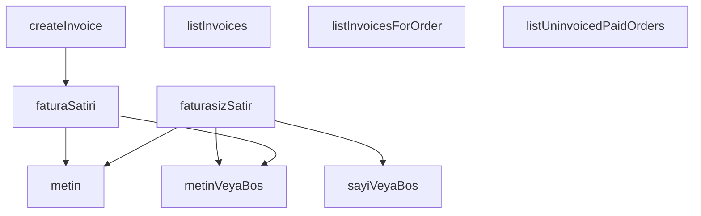

## Genel Bakış

Bu modül, sipariş faturalarıyla ilgili tüm veri erişim ve dönüşüm işlemlerini merkezi olarak yönetir. Supabase üzerinden fatura kayıtlarının listelenmesi, siparişe ait faturaların sorgulanması, faturasız ödenmiş siparişlerin bulunması ve yeni fatura oluşturma gibi temel CRUD ve sorgulama operasyonlarını sunar. Modül, ham veriyi tip güvenceli TypeScript nesnelerine dönüştürmek için helpers ve mapper fonksiyonları ile fatura alanlarına erişim için utility fonksiyonları da içerir.

## Fonksiyon Grupları

### Veri Yardımcı Fonksiyonları (Utility Helpers)
Ham kayıt nesnelerinden güvenli alan çıkışı sağlayan senkron yardımcı fonksiyonlardır. Alan mevcut değilse varsayılan değer veya null döndürerek null-safe bir erişim katmanı sunar.
- `metin`, `metinVeyaBos`, `sayiVeyaBos`

### Satır Dönüştürücü Fonksiyonları (Row Mappers)
Ham bilinmeyen tipteki veriyi tip güvenli sipariş faturası veya faturasız sipariş satır nesnelerine dönüştüren factory fonksiyonlarıdır. Veritabanından gelen raw veriyi uygulama katmanının kullanabileceği yapılandırılmış türlere haritalandırır.
- `faturaSatiri`, `faturasizSatir`

### Veri Erişim Fonksiyonları (Data Access / Repository)
Supabase istemcisi aracılığıyla fatura ve sipariş verilerini sorgulayan, listeleyen ve oluşturan asenkron servis fonksiyonlarıdır. Sayfalama, filtreleme ve tekil kaynak sorgulama gibi veritabanı işlemlerini üstlenir.
- `listInvoices`, `listInvoicesForOrder`, `listUninvoicedPaidOrders`, `createInvoice`

---

## AXIOMS – Mimari Varsayımlar

Bu modül, sipariş fatura yönetimi için Supabase veritabanı ile çalışan bir servis katmanıdır. Yardımcı fonksiyonlar (metin, sayiVeyaBos vb.) ham veri kayıtlarından tip güvenli değerler çıkarır.

---

**[Aksiyom 1]:** Eğer `metin()` fonksiyonuna verilen `kayit` içinde `alan` parametresiyle eşleşen bir alan yoksa veya değeri tanımlanmamışsa, fonksiyonun davranışı tanımsızdır (dökümanda belirtilmemiştir).

**[Aksiyom 2]:** Eğer `metinVeyaBos()` fonksiyonuna verilen `kayit` içinde `alan` parametresiyle eşleşen bir alan yoksa, `null` döner.

**[Aksiyom 3]:** Eğer `sayiVeyaBos()` fonksiyonuna verilen `kayit` içinde `alan` parametresiyle eşleşen bir alan yoksa veya alan sayısal bir değere dönüştürülemiyorsa, `null` döner.

**[Aksiyom 4]:** Eğer `faturaSatiri()` veya `faturasizSatir()` fonksiyonlarına verilen `ham` veri, beklenen alanları (tipi ve yapısı) içermiyorsa, fonksiyonun davranışı tanımsızdır (runtime hatası oluşabilir).

**[Aksiyom 5]:** Eğer `listInvoices()` veya `listInvoicesForOrder()` veya `listUninvoicedPaidOrders()` veya `createInvoice()` fonksiyonlarına verilen `supabase` client'ı geçerli bir Veritabanı bağlantısı (Database generic tipiyle) içermiyorsa, veritabanı sorguları başarısız olur.

**[Aksiyom 6]:** Eğer `listInvoicesForOrder()` fonksiyonuna verilen `orderId` boş string (`""`) ise veya veritabanında var olmayan bir sipariş ID'sine karşılık geliyorsa, boş bir dizi (`[]`) döner.

**[Aksiyom 7]:** Eğer `listInvoices()` fonksiyonuna `opts.limit` veya `opts.offset` negatif bir değer olarak verilirse, fonksiyonun davranışı tanımsızdır.

**[Aksiyom 8]:** Eğer `listUninvoicedPaidOrders()` fonksiyonuna `opts.limit` negatif bir değer olarak verilirse, fonksiyonun davranışı tanımsızdır.

**[Aksiyom 9]:** Eğer `createInvoice()` fonksiyonuna verilen `input` (`CreateInvoiceInput`), veritabanı şemasının beklediği zorunlu alanları (sipariş ID, fatura detayları vb.) içermiyorsa, veritabanı insert işlemi başarısız olur.

**[Aksiyom 10]:** `createInvoice()` fonksiyonu çağrıldığında, ilgili siparişin faturasız ve ödenmiş olması beklenir; aksi takdirde iş mantığı seviyesinde hata oluşabilir (fonksiyon imzasından çıkarılamayan bir iş kuralı).

**[Aksiyom 11]:** `listUninvoicedPaidOrders()` sadece ödenmiş (`paid`) durumunda olan ve henüz faturalanmamış siparişleri döndürür; bu filtreleme veritabanı tarafında veya servis mantığında yapılır (fonksiyon imzasından çıkarılamayan bir iş kuralı).

---

## FONKSİYON DETAYLARI

### metin
**Ne yapar**: Verilen kayıt nesnesinde belirtilen alanı zorunlu olarak string olarak döndürür. Alanın değeri geçerli bir string değilse veya boşsa bir hata fırlatır.
**Nasıl yapar**: Fonksiyon, `kayit` nesnesinden `alan` anahtarının değerini alır. `typeof` kontrolü ile değerin bir `string` olup olmadığını ve boş (`''`) olup olmadığını test eder. Eğer her iki koşul da sağlanırsa (geçerli ve boş olmayan bir string) değeri döndürür, aksi takdirde `null` döndürür. Ancak verilen dokümantasyonda "hata verir" denilmişken kodda `null` döndürmektedir, bu bir tutarsızlık göstergesidir.
**Parametreler**:
- `kayit`: `Record<string, unknown>` — Alanların aranacağı anahtar-değer çiftlerinden oluşan nesne.
- `alan`: `string` — Kayıt nesnesinden istenen alanın anahtarı (adı).
**Dönüş**: `string` — Alanın doğrulanmış ve boş olmayan string değeri. Geçerli değilse `null`.

### metinVeyaBos
**Ne yapar**: Verilen kayıt nesnesinde belirtilen alanı opsiyonel olarak (varsa ve geçerli bir string ise) döndürür, aksi takdirde `null` döndürür.
**Nasıl yapar**: Fonksiyon, `kayit` nesnesinden `alan` anahtarının değerini alır. Değerin bir `string` olup olmadığını ve boş (`''`) olup olmadığını test eder. Her iki koşul da sağlanırsa (geçerli ve boş olmayan bir string) değeri döndürür, aksi takdirde `null` döndürür. Bu, `metin` fonksiyonunun aksine alanı zorunlu tutmayan, sessiz bir düşüş stratejisidir.
**Parametreler**:
- `kayit`: `Record<string, unknown>` — Alanların aranacağı anahtar-değer çiftlerinden oluşan nesne.
- `alan`: `string` — Kayıt nesnesinden istenen alanın anahtarı (adı).
**Dönüş**: `string | null` — Alanın geçerli string değeri veya bulunamayan/geçersiz durumda `null`.

### sayiVeyaBos
**Ne yapar**: Verilen kayıt nesnesinde belirtilen alanı opsiyonel olarak bir sayıya dönüştürerek döndürür, dönüştürülemezse `null` döndürür.
**Nasıl yapar**: Fonksiyon, `kayit` nesnesinden `alan` anahtarının değerini alır. Öncelikle değerin `number` tipinde olup olmadığını kontrol eder, eğer öyleyse doğrudan döndürür. Değer bir `string` ise, `trim()` ile boşlukları temizler, boş olmayıp `Number()` ile parse edilebilir ve `Number.isFinite()` ile sonsuz olmayan bir sayıya dönüştürülebilir olup olmadığını test eder. Tüm koşullar sağlanırsa number değerini döndürür, aksi takdirde `null` döndürür.
**Parametreler**:
- `kayit`: `Record<string, unknown>` — Alanların aranacağı anahtar-değer çiftlerinden oluşan nesne.
- `alan`: `string` — Kayıt nesnesinden istenen alanın anahtarı (adı).
**Dönüş**: `number | null` — Alanın number değerine dönüştürülmüş hali veya dönüştürülemez/geçersiz durumda `null`.

### faturaSatiri
**Ne yapar**: Ham ve tanımsız (`unknown`) tipteki bir fatura verisini, tip güvenli `OrderInvoiceRow` nesnesine dönüştürür.
**Nasıl yapar**: Fonksiyon, ham veriyi (`ham`) bir `Record<string, unknown>` nesnesine dönüştürmek için `as` ile tip ataması yapar. Eğer ham veri `null` veya `undefined` ise boş bir nesne `{}` kullanır. Ardından, `OrderInvoiceRow` arayüzünün alanlarını tek tek doldurmak için `metin` ve `metinVeyaBos` yardımcı fonksiyonlarını çağırarak, ham nesneden gerekli alanları安全 olarak çeker. Bu işlem, veri kaynağının yapısındaki olası tutarsızlıkları gidererek tutarlı bir veri yapısı sunar.
**Parametreler**:
- `ham`: `unknown` — Ham fatura verisi, bir nesne olması beklenir ancak garanti edilmez.
**Dönüş**: `OrderInvoiceRow` — Doldurulmuş ve tip güvenli fatura satırı nesnesi.

### faturasizSatir
**Ne yapar**: Ham ve tanımsız (`unknown`) tipteki bir sipariş verisini, faturalanmamış siparişleri temsil eden tip güvenli `UninvoicedOrderRow` nesnesine dönüştürür.
**Nasıl yapar**: Fonksiyon, ham veriyi (`ham`) bir `Record<string, unknown>` nesnesine dönüştürmek için `as` ile tip ataması yapar. Eğer ham veri `null` veya `undefined` ise boş bir nesne `{}` kullanır. Ardından, `UninvoicedOrderRow` arayüzünün alanlarını tek tek doldurmak için `metin`, `metinVeyaBos` ve `sayiVeyaBos` yardımcı fonksiyonlarını çağırarak, ham nesneden gerekli alanları安全 olarak çeker. Bu, özellikle API cevapları veya veritabanı sorgularından gelen verilerin işlenmesinde güvenilir bir yapı oluşturur.
**Parametreler**:
- `ham`: `unknown` — Ham sipariş verisi, bir nesne olması beklenir ancak garanti edilmez.
**Dönüş**: `UninvoicedOrderRow` — Doldurulmuş ve tip güvenli, faturalanmamış sipariş satırı nesnesi.

### listInvoices
**Ne yapar**: Sistemdeki tüm fatura kayıtlarını, en yeniden en eskiye doğru sıralanmış olarak listeler. Sayfalama seçeneklerini destekler.
**Nasıl yapar**: Fonksiyon, `supabase` istemcisini kullanarak `DEFTER` adlı tablodan (`as never` ile tip ihlali yaparak) tüm (`'*'`) sütunları seçer. `opts.limit` ve `opts.offset` değerleri varsa bunları sorguya ekler (bu típik sayfalama ) ve `created_at` sütununa göre azalan (`ascending: false`) sıralama uygular. Sorgu hatası oluşursa bir `error` fırlatır. Başarılı olursa, ham veri dizisini (`data`) `faturaSatiri` fonksiyonu ile işleyerek `OrderInvoiceRow` dizisine dönüştürür. Sonuç olarak, satırların dizisi ve toplam kayıt sayısını (`count`) içeren bir nesne döndürür.
**Parametreler**:
- `supabase`: `SupabaseClient<Database>` — Veritabanı işlemleri için kullanılacak Supabase istemcisi.
- `opts`: `{ limit?: number; offset?: number }` — Sayfalama seçenekleri. `limit` sayfa başına kayıt sayısını, `offset` ise atlanacak kayıt sayısını belirtir.
**Dönüş**: `Promise<{ rows: OrderInvoiceRow[]; count: number | null }>` — Promise çözümü, `rows` alanı fatura satırlarının dizisi, `count` alanı ise toplam kayıt sayısını (veya bilinemiyorsa `null`) içerir.

### listInvoicesForOrder
**Ne yapar**: Belirli bir siparişe ait tüm fatura kayıtlarını listeler.
**Nasıl yapar**: Fonksiyon, `supabase` istemcisini kullanarak `DEFTER` tablosundan (`as never` ile tip ihlali yaparak) tüm (`'*'`) sütunları seçer. `order_id` sütunu `orderId` parameresine eşit olacak şekilde filtreler (`.eq('order_id', orderId)`) ve `created_at` sütununa göre azalan sıralama uygular. Bu, faturaların eklenme sırasıyla (en son eklenen önce) getirilmesini sağlar. Sorgu hatası oluşursa bir `error` fırlatır. Başarılı olursa, ham veri dizisini (`data`) `faturaSatiri` fonksiyonu ile işleyerek `OrderInvoiceRow` dizisine dönüştürür.
**Parametreler**:
- `supabase`: `SupabaseClient<Database>` — Veritabanı işlemleri için kullanılacak Supabase istemcisi.
- `orderId`: `string` — Faturaların getirileceği siparişin benzersiz kimliği.
**Dönüş**: `Promise<OrderInvoiceRow[]>` — Promise çözümü, ilgili siparişe ait fatura satırlarının (`OrderInvoiceRow`) dizisi.

### listUninvoicedPaidOrders
**Ne yapar**: Ödemesi tamamlanmış ancak henüz faturalanmamış siparişleri listeler.
**Nasıl yapar**: Fonksiyon, `supabase` istemcisini kullanarak `FATURASIZ_VIEW` adlı veritabanı görünümünden (`as never` ile tip ihlali yaparak) tüm (`'*'`) sütunları seçer. Sorguya `created_at` sütununa göre artan (`ascending: true`) bir sıralama ve `opts.limit` değerine (varsayılan 200) göre bir `limit` ekler. Sorgu hatası oluşursa bir `error` fırlatır. Başarılı olursa, ham veri dizisini (`data`) `faturasizSatir` fonksiyonu ile işleyerek `UninvoicedOrderRow` dizisine dönüştürür. Filtrelemenin veritabanı görünümünde (`view`) yapılması, istemci tarafında yapılacak sayfalama ile tutarsız sonuçların önüne geçer.
**Parametreler**:
- `supabase`: `SupabaseClient<Database>` — Veritabanı işlemleri için kullanılacak Supabase istemcisi.
- `opts`: `{ limit?: number }` — İsteğe bağlı seçenekler. `limit`, getirilecek maksimum sipariş sayısını belirtir (varsayılan 200).
**Dönüş**: `Promise<UninvoicedOrderRow[]>` — Promise çözümü, faturalanmamış sipariş satırlarının (`UninvoicedOrderRow`) dizisi.

### createInvoice
**Ne yapar**: Verilen bilgilerle yeni bir fatura kaydı oluşturarak ilgili siparişi "faturalanmış" durumuna getirir.
**Nasıl yapar**: Fonksiyon, önce `input.invoiceNo` değerini `trim()` ile temizler ve boş olup olmadığını kontrol eder; boşsa hata fırlatır. Ardından, `supabase.auth.getUser()` ile mevcut kullanıcının kimliğini alır. Sonra `supabase` istemcisini kullanarak `DEFTER` tablosuna (`as never` ile tip ihlali yaparak) yeni bir satır ekler (`insert`). Ekleme verisi, `input` nesnesinden (`orderId`, `invoiceNo`, `invoiceDate`, vb.) ve kimlik bilgisi (`issued_by`) ile not (`note`) alanlarından oluşturulur. `not` alanı boşsa `null` olarak eklenir. `.single()` ile tek bir satırın eklendiği ve o satırın geri döndürüldüğünü belirtir. Sorgu hatası oluşursa bir `error` fırlatır. Başarılı olursa, eklenen ham veriyi `faturaSatiri` fonksiyonu ile işleyerek tip güvenli `OrderInvoiceRow` nesnesine dönüştürür ve döndürür.
**Parametreler**:
- `supabase`: `SupabaseClient<Database>` — Veritabanı işlemleri için kullanılacak Supabase istemcisi.
- `input`: `CreateInvoiceInput` — Oluşturulacak fatura için gerekli verileri içeren nesne.
**Dönüş**: `Promise<OrderInvoiceRow>` — Promise çözümü, başarıyla oluşturulmuş ve veritabanına kaydedilmiş fatura satırının (`OrderInvoiceRow`) nesnesi.

---

## İTHALATLAR (IMPORTS)
- import: ../../types/database.types::type { Database }
- import: @supabase/supabase-js::type { SupabaseClient }

---

## INTERFACES

### OrderInvoiceRow
Fatura defteri servisi (T132-VH · Fatura v1). Cetvel: docs/standards/legal-compliance-standard.md §2.3 TASARIM: "faturalandı" bir bayrak DEĞİL, `order_invoices` tablosunda **satırın varlığıdır**. Bu yüzden burada `markAsInvoiced(order)` gibi kolon güncelleyen bir fonksiyon YOKTUR — fatura kesmek bir
- `id: string`
- `order_id: string`
- `invoice_no: string`
- `invoice_date: string`
- `invoice_type: string | null`
- `issued_by: string | null`
- `note: string | null`
- `created_at: string`

### UninvoicedOrderRow
- `id: string`
- `order_number: string | null`
- `created_at: string`
- `total_amount: number | null`
- `customer_name: string | null`
- `customer_email: string | null`
- `invoice_type: string | null`

### CreateInvoiceInput
- `orderId: string`
- `invoiceNo: string`
- `invoiceDate: string`
- `invoiceType?: string | null`
- `note?: string | null`

---

## AST POINTERS

### [N1_NASIL] AST Pointer: src/lib/services/orderInvoice.service.ts::metin
- **params**: `(kayit: Record<string, unknown>, alan: string)`
- **ic_degiskenler**:
  - `deger` — kayit nesnesinden alan parametresi ile erişilen değerin string olup olmadığını kontrol eden ve decoğrulan değeri tutar
- **Dönüş**: `string` (değer string değilse veya boşsa Error fırlatır)

### [N2_NASIL] AST Pointer: src/lib/services/orderInvoice.service.ts::metinVeyaBos
- **params**: `(kayit: Record<string, unknown>, alan: string)`
- **ic_degiskenler**:
  - `deger` — kayit nesnesinden alan parametresi ile erişilen değerin string olup olmadığını ve boş olup olmadığını kontrol eden değişken
- **Dönüş**: `string | null` (geçerli string ise değeri, değilse null döner)

### [N3_NASIL] AST Pointer: src/lib/services/orderInvoice.service.ts::sayiVeyaBos
- **params**: `(kayit: Record<string, unknown>, alan: string)`
- **ic_degiskenler**:
  - `deger` — kayit nesnesinden alan parametresi ile erişilen değerin number veya number'a çevrilebilir string olup olmadığını kontrol eden değişken
- **Dönüş**: `number | null` (geçerli number ise değeri, değilse null döner)

### [N4_NASIL] AST Pointer: src/lib/services/orderInvoice.service.ts::faturaSatiri
- **params**: `(ham: unknown)`
- **ic_degiskenler**:
  - `kayit` — ham parametresinin null-safe olarak Record<string, unknown> tipine cast edilmiş hali
- **Dönüş**: `OrderInvoiceRow` (metin, metinVeyaBos fonksiyonlarını kullanarak OrderInvoiceRow objesi oluşturur)

### [N5_NASIL] AST Pointer: src/lib/services/orderInvoice.service.ts::faturasizSatir
- **params**: `(ham: unknown)`
- **ic_degiskenler**:
  - `kayit` — ham parametresinin null-safe olarak Record<string, unknown> tipine cast edilmiş hali
- **Dönüş**: `UninvoicedOrderRow` (metin, metinVeyaBos, sayiVeyaBos fonksiyonlarını kullanarak UninvoicedOrderRow objesi oluşturur)

### [N6_NASIL] AST Pointer: src/lib/services/orderInvoice.service.ts::listInvoices
- **params**: `(supabase: SupabaseClient<Database>, opts: { limit?: number; offset?: number } = {})`
- **ic_degiskenler**:
  - `limit` — opts.limit değerinin default olarak 50 alındığı değişken
  - `offset` — opts.offset değerinin default olarak 0 alındığı değişken
  - `data` — Supabase sorgusundan dönen satır verisi
  - `error` — Supabase sorgusundan dönen hata nesnesi
  - `count` — Supabase sorgusundan dönen toplam satır sayısı
- **Dönüş**: `Promise<{ rows: OrderInvoiceRow[]; count: number | null }>` (sayfalanmış fatura listesi ve toplam sayı)

### [N7_NASIL] AST Pointer: src/lib/services/orderInvoice.service.ts::listInvoicesForOrder
- **params**: `(supabase: SupabaseClient<Database>, orderId: string)`
- **ic_degiskenler**:
  - `data` — Supabase sorgusundan dönen satır verisi
  - `error` — Supabase sorgusundan dönen hata nesnesi
- **Dönüş**: `Promise<OrderInvoiceRow[]>` (belirli siparişe ait fatura listesi)

### [N8_NASIL] AST Pointer: src/lib/services/orderInvoice.service.ts::listUninvoicedPaidOrders
- **params**: `(supabase: SupabaseClient<Database>, opts: { limit?: number } = {})`
- **ic_degiskenler**:
  - `data` — Supabase sorgusundan dönen satır verisi
  - `error` — Supabase sorgusundan dönen hata nesnesi
- **Dönüş**: `Promise<UninvoicedOrderRow[]>` (faturasız ödenmiş siparişlerin listesi)

### [N9_NASIL] AST Pointer: src/lib/services/orderInvoice.service.ts::createInvoice
- **params**: `(supabase: SupabaseClient<Database>, input: CreateInvoiceInput)`
- **ic_degiskenler**:
  - `invoiceNo` — input.invoiceNo değerinin trim edilmiş hali
  - `authData` — supabase.auth.getUser() ile elde edilen kullanıcı verisi
  - `data` — Supabase insert sorgusundan dönen eklenen satır verisi
  - `error` — Supabase insert sorgusundan dönen hata nesnesi
- **Dönüş**: `Promise<OrderInvoiceRow>` (yeni oluşturulan fatura satırı)

---

## MERMAID CALL GRAPH

## NODE ID STANDARD

  file: src\lib\services\orderInvoice.service.ts
  function: src\lib\services\orderInvoice.service.ts::metin
  function: src\lib\services\orderInvoice.service.ts::metinVeyaBos
  function: src\lib\services\orderInvoice.service.ts::sayiVeyaBos
  function: src\lib\services\orderInvoice.service.ts::faturaSatiri
  function: src\lib\services\orderInvoice.service.ts::faturasizSatir
  function: src\lib\services\orderInvoice.service.ts::listInvoices
  function: src\lib\services\orderInvoice.service.ts::listInvoicesForOrder
  function: src\lib\services\orderInvoice.service.ts::listUninvoicedPaidOrders
  function: src\lib\services\orderInvoice.service.ts::createInvoice

---

## DISA AKTARILANLAR (EXPORTS)
  export: CreateInvoiceInput
  export: OrderInvoiceRow
  export: UninvoicedOrderRow
  export: createInvoice
  export: faturaSatiri
  export: faturasizSatir
  export: listInvoices
  export: listInvoicesForOrder
  export: listUninvoicedPaidOrders
  export: metin
  export: metinVeyaBos
  export: sayiVeyaBos