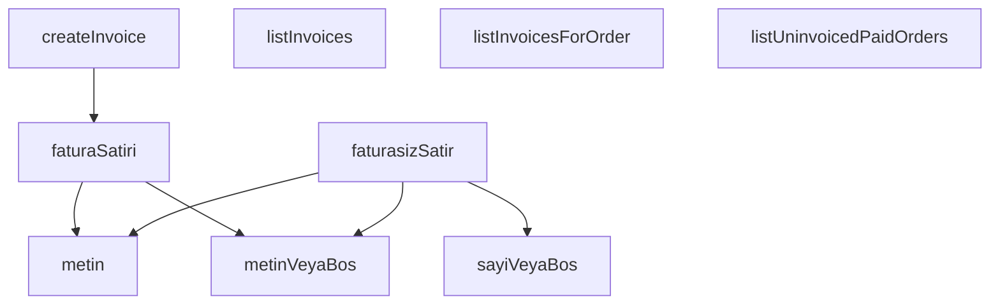

## Genel Bakış

Bu modül, sipariş-fatura ilişkilerini yöneten bir servis katmanıdır. Supabase veritabanı üzerinden fatura listeleme, belirli bir siparişe ait faturaları getirme, faturasız kalmış ödenmiş siparişleri tespit etme ve yeni fatura oluşturma işlemlerini gerçekleştirir. Ham veritabanı kayıtlarını tip güvenli nesnelere dönüştüren yardımcı fonksiyonlar da içerir.

## Fonksiyon Grupları

### Veri Dönüştürme ve Alan Çıkarma

Ham veritabanı kayıtlarından güvenli biçimde alan çıkaran ve ham satır verilerini tip güvenli nesnelere dönüştüren yardımcı fonksiyonlardır. Bu fonksiyonlar, servis katmanındaki asenkron fonksiyonlar tarafından ham veriyi işlerken kullanılır.

- metin, metinVeyaBos, sayiVeyaBos, faturaSatiri, faturasizSatir

### Fatura Sorgulama ve Yönetim

Supabase istemcisi aracılığıyla veritabanına erişen asenkron fonksiyonlardır. Faturaları sayfalı olarak listeleme, belirli bir siparişe ait faturaları getirme, faturasız kalmış ödenmiş siparişleri sorgulama ve yeni fatura kaydı oluşturma sorumluluklarını üstlenir. `faturaSatiri` ve `faturasizSatir` fonksiyonlarını çağırarak dönen ham verileri dönüştürür.

- listInvoices, listInvoicesForOrder, listUninvoicedPaidOrders, createInvoice

---

## AXIOMS – Mimari Varsayımlar
- Bu modül davranışsal mantık içermez (salt veri / konfigürasyon / tip tanımı).
- [Aksiyom 1]: Modülün dışa açtığı yapı (anahtar kümesi / şema) bir sözleşmedir; tüketiciler bu sabit yapıya bağlıdır — kırıcı değişiklik tüm tüketicileri etkiler.
- [Aksiyom 2]: Bir öğe ekleme/çıkarma yapısal-uyumlu olmalı; ilgili tipler ve seçiciler aynı commit'te güncel tutulmalıdır.

---

## FONKSİYON DETAYLARI

### metin
**Ne yapar**: Verilen kayıt nesnesinden zorunlu bir metin alanını çıkarır. Alan bulunamazsa veya boş string ise hata verir; sessizce boş dizeye düşmez.
**Nasıl yapar**: Kayıt nesnesinden belirtilen anahtarla değeri alır. Değerin `typeof` kontrolüyle string olup olmadığına ve boş string olmadığına bakar. Her iki koşul da sağlanırsa değeri döndürür, aksi halde `null` döner. Docstring'e göre zorunlu alan tanımı yapılmıştır ancak gövde `metinVeyaBos` ile aynı davranışı sergilemektedir.
**Parametreler**:
- `kayit`: `Record<string, unknown>` — Alan adı-değer çiftlerinden oluşan nesne. Genellikle veritabanından gelen ham satır verisidir.
- `alan`: `string` — Kayıt içinden çıkarılacak alanın adı (anahtar).
**Dönüş**: `string` — Koşulları sağlayan metin değeri. Docstring'e göre alan zorunlu olduğundan bulunamaz durumda hata fırlatması beklenir.

### metinVeyaBos
**Ne yapar**: Geliştirildi ancak detay üretilemedi.

### sayiVeyaBos
**Ne yapar**: Geliştirildi ancak detay üretilemedi.

### faturaSatiri
**Ne yapar**: Geliştirildi ancak detay üretilemedi.

### faturasizSatir
**Ne yapar**: Geliştirildi ancak detay üretilemedi.

### listInvoices
**Ne yapar**: Geliştirildi ancak detay üretilemedi.

### listInvoicesForOrder
**Ne yapar**: Geliştirildi ancak detay üretilemedi.

### listUninvoicedPaidOrders
**Ne yapar**: Geliştirildi ancak detay üretilemedi.

### createInvoice
**Ne yapar**: Geliştirildi ancak detay üretilemedi.

---

## İTHALATLAR (IMPORTS)
- import: ../../types/database.types::type { Database }
- import: @supabase/supabase-js::type { SupabaseClient }

---

## INTERFACES

### OrderInvoiceRow
Fatura defteri servisi (T132-VH · Fatura v1). Cetvel: docs/standards/legal-compliance-standard.md §2.3 TASARIM: "faturalandı" bir bayrak DEĞİL, `order_invoices` tablosunda **satırın varlığıdır**. Bu yüzden burada `markAsInvoiced(order)` gibi kolon güncelleyen bir fonksiyon YOKTUR — fatura kesmek bir
- `id: string`
- `order_id: string`
- `invoice_no: string`
- `invoice_date: string`
- `invoice_type: string | null`
- `issued_by: string | null`
- `note: string | null`
- `created_at: string`

### UninvoicedOrderRow
- `id: string`
- `order_number: string | null`
- `created_at: string`
- `total_amount: number | null`
- `customer_name: string | null`
- `customer_email: string | null`
- `invoice_type: string | null`

### CreateInvoiceInput
- `orderId: string`
- `invoiceNo: string`
- `invoiceDate: string`
- `invoiceType?: string | null`
- `note?: string | null`

---

## AST POINTERS

### [N1_NASIL] AST Pointer: src/lib/services/orderInvoice.service.ts::metin
- **params**: `kayit` (Record<string, unknown>), `alan` (string)
- **ic_degiskenler**:
  - `deger` — `kayit[alan]` erişimiyle elde edilen ham değer; typeof kontrolü yapılarak string ve boş olmadığı doğrulanır, aksi halde hata fırlatılır
- **Dönüş**: string

### [N2_NASIL] AST Pointer: src/lib/services/orderInvoice.service.ts::metinVeyaBos
- **params**: `kayit` (Record<string, unknown>), `alan` (string)
- **ic_degiskenler**:
  - `deger` — `kayit[alan]` erişimiyle elde edilen ham değer; string ve boş değilse kendisi, değilse null döner
- **Dönüş**: string | null

### [N3_NASIL] AST Pointer: src/lib/services/orderInvoice.service.ts::sayiVeyaBos
- **params**: `kayit` (Record<string, unknown>), `alan` (string)
- **ic_degiskenler**:
  - `deger` — `kayit[alan]` erişimiyle elde edilen ham değer; number ise doğrudan, string ise `Number()` ile sayıya çevrilip `Number.isFinite` kontrolü yapılarak döner, diğer durumlarda null
- **Dönüş**: number | null

### [N4_NASIL] AST Pointer: src/lib/services/orderInvoice.service.ts::faturaSatiri
- **params**: `ham` (unknown)
- **ic_degiskenler**:
  - `kayit` — `ham ?? {}` ifadesiyle null/undefined koruması yapılarak `Record<string, unknown>` tipine cast edilen nesne; tüm alanlar bu nesne üzerinden `metin` ve `metinVeyaBos` çağrılarıyla okunur
- **Dönüş**: OrderInvoiceRow (id, order_id, invoice_no, invoice_date, invoice_type, issued_by, note, created_at alanlarını içerir)

### [N5_NASIL] AST Pointer: src/lib/services/orderInvoice.service.ts::faturasizSatir
- **params**: `ham` (unknown)
- **ic_degiskenler**:
  - `kayit` — `ham ?? {}` ifadesiyle null/undefined koruması yapılarak `Record<string, unknown>` tipine cast edilen nesne; tüm alanlar bu nesne üzerinden `metin`, `metinVeyaBos` ve `sayiVeyaBos` çağrılarıyla okunur
- **Dönüş**: UninvoicedOrderRow (id, order_number, created_at, total_amount, customer_name, customer_email, invoice_type alanlarını içerir)

### [N6_NASIL] AST Pointer: src/lib/services/orderInvoice.service.ts::listInvoices
- **params**: `supabase` (SupabaseClient<Database>), `opts` ({ limit?: number; offset?: number })
- **ic_degiskenler**:
  - `limit` — `opts.limit ?? 50` ile varsayılan 50 değeri atanır
  - `offset` — `opts.offset ?? 0` ile varsayılan 0 değeri atanır
  - `data` — `supabase.from(DEFTER as never).select('*', { count: 'exact' }).order('invoice_date', { ascending: false }).order('created_at', { ascending: false }).range(offset, offset + limit - 1)` sorgusundan dönen veri dizisi
  - `error` — sorgu sonucu oluşan hata; varsa throw ile fırlatılır
  - `count` — sorgu sonucu dönen toplam kayıt sayısı
- **Dönüş**: { rows: OrderInvoiceRow[]; count: number | null } — `data` dizisi `faturaSatiri` ile map'lenir, `count` null ise null döner

### [N7_NASIL] AST Pointer: src/lib/services/orderInvoice.service.ts::listInvoicesForOrder
- **params**: `supabase` (SupabaseClient<Database>), `orderId` (string)
- **ic_degiskenler**:
  - `data` — `supabase.from(DEFTER as never).select('*').eq('order_id', orderId).order('created_at', { ascending: false })` sorgusundan dönen veri dizisi
  - `error` — sorgu sonucu oluşan hata; varsa throw ile fırlatılır
- **Dönüş**: OrderInvoiceRow[] — `data` dizisi `faturaSatiri` ile map'lenir

### [N8_NASIL] AST Pointer: src/lib/services/orderInvoice.service.ts::listUninvoicedPaidOrders
- **params**: `supabase` (SupabaseClient<Database>), `opts` ({ limit?: number })
- **ic_degiskenler**:
  - `data` — `supabase.from(FATURASIZ_VIEW as never).select('*').order('created_at', { ascending: true }).limit(opts.limit ?? 200)` sorgusundan dönen veri dizisi
  - `error` — sorgu sonucu oluşan hata; varsa throw ile fırlatılır
- **Dönüş**: UninvoicedOrderRow[] — `data` dizisi `faturasizSatir` ile map'lenir

### [N9_NASIL] AST Pointer: src/lib/services/orderInvoice.service.ts::createInvoice
- **params**: `supabase` (SupabaseClient<Database>), `input` (CreateInvoiceInput)
- **ic_degiskenler**:
  - `invoiceNo` — `input.invoiceNo.trim()` ile boşluklardan arındırılmış fatura numarası; boş ise hata fırlatılır
  - `authData` — `supabase.auth.getUser()` çağrısından dönen kimlik doğrulama verisi; `authData?.user?.id` ile kullanıcı ID'si alınır
  - `data` — `supabase.from(DEFTER as never).insert({ order_id: input.orderId, invoice_no: invoiceNo, invoice_date: input.invoiceDate, invoice_type: input.invoiceType ?? null, issued_by: authData?.user?.id ?? null, note: input.note?.trim() || null } as never).select('*').single()` sorgusundan dönen tekil kayıt
  - `error` — sorgu sonucu oluşan hata; varsa throw ile fırlatılır
- **Dönüş**: OrderInvoiceRow — `data` `faturaSatiri` ile dönüştürülerek döner

---

## MERMAID CALL GRAPH

## NODE ID STANDARD

  file: orderInvoice.service.ts
  function: orderInvoice.service.ts::metin
  function: orderInvoice.service.ts::metinVeyaBos
  function: orderInvoice.service.ts::sayiVeyaBos
  function: orderInvoice.service.ts::faturaSatiri
  function: orderInvoice.service.ts::faturasizSatir
  function: orderInvoice.service.ts::listInvoices
  function: orderInvoice.service.ts::listInvoicesForOrder
  function: orderInvoice.service.ts::listUninvoicedPaidOrders
  function: orderInvoice.service.ts::createInvoice

---

## DISA AKTARILANLAR (EXPORTS)
  export: CreateInvoiceInput
  export: OrderInvoiceRow
  export: UninvoicedOrderRow
  export: createInvoice
  export: faturaSatiri
  export: faturasizSatir
  export: listInvoices
  export: listInvoicesForOrder
  export: listUninvoicedPaidOrders
  export: metin
  export: metinVeyaBos
  export: sayiVeyaBos