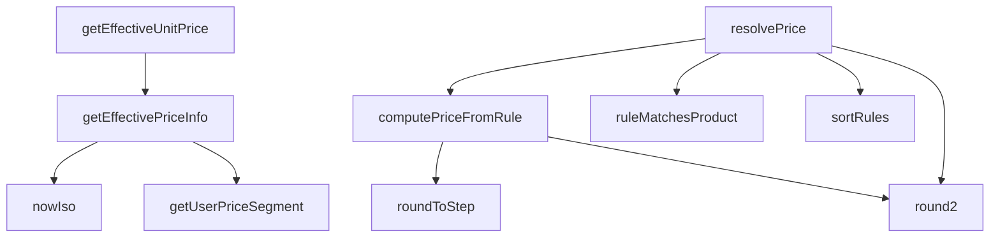

## Genel Bakış
VentHub HVAC platformunda merkezi fiyatlandırma hizmetini yöneten modüldür. Ürünler için veritabanından güncel fiyat bilgilerini çekerken, aynı zamanda esnek ve kural tabanlı fiyatlandırma politikalarını uygular. Modül, tüm fiyatlandırma sürecini kullanıcı segmentasyonu, fiyat listesi yönetimi ve kurallara dayalı hesaplama mantığını bir arada orkestra eder.

## Fonksiyon Grupları
### Yardımcı Fonksiyonlar
Fiyatlandırma süreçlerinde gerekli olan düşük seviyeli ama kritik destek işlemlerini sunar.
- getUserPriceSegment, nowIso, roundToStep, round2

### Fiyat Bilgisi Hesaplama Fonksiyonları
Ürünler için veritabanından güncel ve geçerli fiyat bilgisini çeken asenkron fonksiyonlardır.
- getEffectiveUnitPrice, getEffectivePriceInfo

### Kural Tabanlı Fiyat Hesaplama Fonksiyonları
Fiyatlandırma kurallarını ürünlere eşleştiren, kuralları sıralayan ve bu kurallara göre net/fiyat hesaplayan mantıksal grup.
- ruleMatchesProduct, sortRules, computePriceFromRule

### Ana Fiyat Çözümleme Fonksiyonu
Tüm fiyatlandırma mantığını ve bağımlılıkları bir araya getiren ana orkestratör fonksiyondur.
- resolvePrice

---

## AXIOMS – Mimari Varsayımlar

Bu modül, fiyatlandırma kurallarının uygulanması ve fiyat hesaplaması için dış kaynaklara (veritabanı, kullanıcı metadata'sı) bağımlıdır.

[Aksiyom 1]: Eğer `SupabaseClient<Database>` bağlantısı geçerli ve aktif değilse, `getEffectiveUnitPrice`, `getEffectivePriceInfo` ve `resolvePrice` fonksiyonları veritabanı sorgularını tamamlayamaz ve hata üretir.

[Aksiyom 2]: Eğer `product` parametresi veritabanında tanımlı bir ürüne karşılık gelmiyorsa, `getEffectiveUnitPrice` ve `getEffectivePriceInfo` geçerli bir fiyat bilgisi dönemeyebilir (null/undefined behavior).

[Aksiyom 3]: Eğer `getUserPriceSegment` için `user.app_metadata` alanı tanımsızsa (`undefined`), kullanıcının fiyat segmenti varsayılan bir değerle döner veya belirsiz segment atanır.

[Aksiyom 4]: Eğer `roundToStep` için `step` parametresi `0` ise, bölen sıfır hatası oluşur ve fonksiyon beklenmedik sonuç üretir.

[Aksiyom 5]: Eğer `ruleMatchesProduct` için `categoryAncestors` kümesi boşsa, kural-ürün eşleştirmede kategori bazlı kurallar hiçbir zaman eşleşmez.

[Aksiyom 6]: Eğer `computePriceFromRule` için `costInBase` parametresi `null` ise, kuralın maliyet bazlı hesaplama yapamaz ve `null` döner.

[Aksiyom 7]: Eğer `sortRules` için `priceBookId` parametresi `null` ise, kurallar fiyat listesi bazlı sıralama yapılamadan varsayılan sırayla dizilir.

[Aksiyom 8]: Eğer `resolvePrice` için `PricingContext` içinde gerekli bağlam bilgileri (ürün, fiyat kitabı vb.) eksikse, fiyat çözümleme tamamlanamaz.

[Aksiyom 9]: Eğer `computePriceFromRule` bir kural üzerinde çalışırken geçerli bir fiyat hesaplayamıyorsa (örn. gerekli alanlar eksik), fonksiyon `null` döner ve bu fiyatlandırma kuralı atlanır.

[Aksiyom 10]: Eğer `nowIso()` fonksiyonu sistem saatine erişemezse, geçerli bir ISO formatlı zaman damgası üretilmez.

---

## FONKSİYON DETAYLARI

### getUserPriceSegment
**Ne yapar**: Kullanıcının fiyat segmentini (individual, dealer, corporate) JWT token'ındaki `app_metadata.price_segment` claim'inden çıkarır. Profil rolü veya kullanıcı tarafından düzenlenebilir metadata okunmaz; fiyat ataması yalnızca admin tarafından yapılır. Claim atanmamışsa güvenli varsayılan olarak `'individual'` döner.

**Nasıl yapar**: Supabase auth kullanıcısının `app_metadata` nesnesinden `price_segment` değerini ham olarak okur. Değer `'dealer'` veya `'corporate'` ise olduğu gibi döner, aksi halde (tanınmayan değer, null, undefined) `'individual'` döner. Bu, RLS tarafındaki eşik ile uyumlu tek sözleşme tasarımının parçasıdır (W2 tek sözleşme).

**Parametreler**:
- `user`: `{ app_metadata?: Record<string, unknown> } | null | undefined` — Supabase auth kullanıcısı nesnesi. `null` veya `undefined` olabilir (anonim kullanıcı senaryosu).

**Dönüş**: `PriceSegment` — Geçerli fiyat segmenti string'i (`'individual'`, `'dealer'` veya `'corporate'`).

### nowIso
**Ne yapar**: Geçerli tarih ve saati ISO 8601 formatında bir字符串 olarak döndürür.
**Nasıl yapar**: `new Date()` nesnesi oluşturarak `toISOString()` metodunu çağırır ve mevcut zamanı standart bir string formatında döndürür. Bu, Supabase sorgularında tarih bazlı filtreleme için zaman damgası olarak kullanılır.
**Parametreler**:
- Bu fonksiyon herhangi bir parametre almaz.
**Dönüş**: `string` — Geçerli tarih ve saatin ISO 8601 formatında temsili.

### getEffectiveUnitPrice
**Ne yapar**: Belirli bir ürün için geçerli olan birim fiyatı döndürür. Bu fonksiyon, karmaşık fiyatlandırma mantığını basitleştirerek doğrudan sonuçsal birim fiyat değerini elde etmek için kullanılır.

**Nasıl yapar**: Fonksiyon, daha kapsamlı olan `getEffectivePriceInfo` fonksiyonunu çağırır ve returned objenin içindeki `unitPrice` alanını alarak sonuç olarak number tipinde bir değer döndürür. Bu, üst düzey işlemler için sade ve kullanışlı bir arayüz sağlar.

**Parametreler**:
- `supabase`: SupabaseClient<Database> — Aktif Supabase istemcisi örneği, veritabanı ve kimlik doğrulama işlemleri için kullanılır.
- `product`: Product — Temel fiyat bilgilerini içeren ürün nesnesi, fiyat hesaplamasının temelini oluşturur.

**Dönüş**: Promise<number> — Hesaplanan etkili birim fiyat (number).

### getEffectivePriceInfo
**Ne yapar**: Bir ürün için en uygun fiyatlandırma bilgisini, mevcut kullanıcının rolü, geçerli fiyat listeleri ve uygulanabilir indirimler temelinde belirler. Bu ana mantık fonksiyonu, fiyat kararını vermek için birden fazla veri kaynağını sorgular ve bir dizi kurallar bütünü uygular.

**Nasıl yapar**: Fonksiyon首先 kullanıcının oturumunu doğrular ve profilini (rol ve kuruluş bilgisi) çeker. Sonra, mevcut tarih itibarıyla aktif ve geçerli fiyat listelerini sorgular. Bu listeleri kullanıcının rolüne göre filtreler ve belirli bir sıralama mantığıyla (spesifik rol eşleşmesi tercih edilir) en uygun listeyi seçer. Ardından, seçilen fiyat listesinde (varsa) ürünün fiyat kayıtlarını arar; burada satış fiyatı, temel fiyat ve indirim yüzdesi gibi faktörleri değerlendirerek geçerli bir fiyat hesaplar. Hiçbir fiyat listesi eşleşmesi veya geçerli kayıt bulunamazsa, ürün nesnesindeki temel fiyata (fallback) geri döner. Tüm işlemler sırasında hata oluşursa güvenli bir şekilde fallback değerini döndürür.

**Parametreler**:
- `supabase`: SupabaseClient<Database> — Aktif Supabase istemcisi örneği, veritabanı sorguları ve kullanıcı oturumu yönetimi için gereklidir.
- `product`: Product — Fiyatı belirlenecek olan ürün nesnesi. Ürünün `id` ve `price` alanları gibi temel özelliklerini içerir.

**Dönüş**: Promise<{ unitPrice: number, priceListId: string | null }> — Hesaplanan birim fiyatı ve uygulanan fiyat listesinin ID'si (varsa,否则 null) içeren bir nesne.

### roundToStep

**Ne yapar**: Bir sayısal değeri belirli bir adıma (step) en yakın yuvarlak değere getirir. Fiyatlandırma kurallarında kuruş, lira veya özel aralıklara yuvarlama işlemini gerçekleştirir.

**Nasıl yapar**: Adım değerinin geçerli ve pozitif olup olmadığını kontrol eder; geçersizse değeri olduğu gibi döndürür. Geçerliyse değeri adıma böler, yuvarlar, tekrar adım ile çarpar ve 6 ondalık basamağa kadar hassasiyetle düzeltir. Bu sayede floating-point hassasiyet sorunlarından kaynaklanan kuruş hataları önlenir.

**Parametreler**:
- value: number — Yuvarlanacak sayısal değer
- step: number — Yuvarlama adım aralığı (örn. 0.01 kuruş, 0.50 yarımlık, 1 tam lira)

**Dönüş**: number — Adım aralığına en yakın yuvarlanmış değer

### round2
**Ne yapar**: Geliştirildi ancak detay üretilemedi.

### ruleMatchesProduct
**Ne yapar**: Geliştirildi ancak detay üretilemedi.

### sortRules
**Ne yapar**: Geliştirildi ancak detay üretilemedi.

### computePriceFromRule
**Ne yapar**: Geliştirildi ancak detay üretilemedi.

### resolvePrice
**Ne yapar**: Geliştirildi ancak detay üretilemedi.

---

## İTHALATLAR (IMPORTS)
- import: ../../types/database.types::type { Database }
- import: ../../types/ui-models::type { Product }
- import: @supabase/supabase-js::type { SupabaseClient }

---

## INTERFACES

### OrganizationLight
- `id: string`
- `tier_level?: number | null`

### PricingProductInput
- `id: string`
- `brandId?: string | null`
- `categoryId?: string | null`
- `costInBase?: number | null`

### PricingContext
- `priceBookId?: string | null`
- `quantity?: number`
- `currency?: string`
- `today?: string`

### ResolvedPrice
- `net: number`
- `gross: number`
- `currency: string`
- `vatRatePct: number`
- `ruleId: string`
- `ruleScope: number`

### PriceResolution
- `price: ResolvedPrice | null`
- `trace: string[]`

---

## TYPE ALIASES

### PricingRuleRow
```typescript
type PricingRuleRow = Database['public']['Tables']['pricing_rule']['Row']
```

### UserRole
```typescript
type UserRole = 'individual' | 'dealer' | 'corporate' | 'admin'
```

### PriceSegment
```typescript
type PriceSegment = 'individual' | 'dealer' | 'corporate'
```

---

## AST POINTERS

### [N1_NASIL] AST Pointer: src/lib/services/pricing.service.ts::getUserPriceSegment
- **params**: `(user: { app_metadata?: Record<string, unknown> } | null | undefined)`
- **ic_degiskenler**:
  - `raw` — `user?.app_metadata?.price_segment` değerinden elde edilen ham fiyat segmenti değeri
- **Dönüş**: `PriceSegment` (‘dealer‘, ‘corporate‘ veya ‘individual‘)

### [N2_NASIL] AST Pointer: src/lib/services/pricing.service.ts::nowIso
- **params**: yok
- **ic_degiskenler**:
  (yok)
- **Dönüş**: `string` (ISO formatında tarih-zaman stringi)

### [N3_NASIL] AST Pointer: src/lib/services/pricing.service.ts::getEffectiveUnitPrice
- **params**: `(supabase: SupabaseClient<Database>, product: Product)`
- **ic_degiskenler**:
  - `info` — `getEffectivePriceInfo` çağrısından dönen `{ unitPrice: number, priceListId: string | null }` nesnesi
- **Dönüş**: `Promise<number>` (ürünün etkili birim fiyatı)

### [N4_NASIL] AST Pointer: src/lib/services/pricing.service.ts::getEffectivePriceInfo
- **params**: `(supabase: SupabaseClient<Database>, product: Product)`
- **ic_degiskenler**:
  - `fallback` — Ürünün `price` alanından hesaplanan varsayılan fiyat (sayısal değilse 0)
  - `authData` — `supabase.auth.getUser()` çağrısından dönen auth verisi
  - `user` — Auth verisinden alınan kullanıcı nesnesi (hata varsa null)
  - `segment` — `getUserPriceSegment(user)` ile belirlenen fiyat segmenti
  - `now` — `nowIso()` ile elde edilen geçerli zaman damgası
  - `lists` — `price_lists` tablosundan çekilen aktif ve tarihsel olarak geçerli fiyat listeleri
  - `typedLists` — `lists` dizisinin `PriceListRow[]` türüne dönüştürülmüş hali
  - `matchedLists` — Kullanıcı segmenti veya varsayılan (user_type null) ile eşleşen fiyat listeleri
  - `sorted` — Sıralanmış eşleşen fiyat listeleri (önce belirli segment, sonra tarih)
  - `chosen` — Seçilen ilk fiyat listesi (eşleşme varsa, yoksa null)
  - `priceListIds` — Denenecek fiyat listesi ID'leri (seçilen ve fallback null)
  - `plId` — Döngüdeki mevcut fiyat listesi ID’si
  - `query` — `product_prices` tablosu için Supabase sorgu nesnesi
  - `rows` — Sorgudan dönen ürün fiyat satırları
  - `pick` — Tarihsel olarak geçerli ilk satır veya ilk satır
  - `cacheRow` — `pick`’in genişletilmiş tipi (net_price ve gross_price opsiyonel alanlar)
  - `derivedNet` — `cacheRow.net_price`’dan türetilen net fiyat
  - `derivedGross` — `cacheRow.gross_price`’dan türetilen brüt fiyat
  - `derived` — Segment’e göre seçilen derived fiyat (individual: gross, diğerleri: net)
  - `base` — Seçilen satırın `base_price`’ı
  - `sale` — Seçilen satırın `sale_price`’ı (yoksa null)
  - `disc` — Seçilen satırın `discount_percentage`’si
- **Dönüş**: `Promise<{ unitPrice: number, priceListId: string | null }>` (etkili birim fiyat ve kullanılan fiyat listesi ID’si)

### [N5_NASIL] AST Pointer: src/lib/services/pricing.service.ts::roundToStep
- **params**: `(value: number, step: number)`
- **ic_degiskenler**:
  (yok)
- **Dönüş**: `number` (adıma göre yuvarlanmış değer)

### [N6_NASIL] AST Pointer: src/lib/services/pricing.service.ts::round2
- **params**: `(value: number)`
- **ic_degiskenler**:
  (yok)
- **Dönüş**: `number` (2 ondalığa yuvarlanmış değer)

### [N7_NASIL] AST Pointer: src/lib/services/pricing.service.ts::ruleMatchesProduct
- **params**: `(rule: PricingRuleRow, product: PricingProductInput, categoryAncestors: ReadonlySet<string>)`
- **ic_degiskenler**:
  (yok – sadece parametreler ve switch case mantığı)
- **Dönüş**: `boolean` (kuralın ürüne uyup uymadığı)

### [N8_NASIL] AST Pointer: src/lib/services/pricing.service.ts::sortRules
- **params**: `(rules: PricingRuleRow[], priceBookId: string | null)`
- **ic_degiskenler**:
  - `bookRank` — Fonksiyon: Verilen kuralın price_book_id eşleşmesine göre sıralama skoru (0 veya 1)
- **Dönüş**: `PricingRuleRow[]` (sıralanmış kurallar dizisi)

### [N9_NASIL] AST Pointer: src/lib/services/pricing.service.ts::computePriceFromRule
- **params**: `(rule: PricingRuleRow, costInBase: number | null, trace: string[])`
- **ic_degiskenler**:
  - `p` — Kural yöntemine göre hesaplanan ham fiyat (cost_plus veya fixed)
  - `margin` — Hesaplanan fiyat ile maliyet arasındaki fark
  - `vatFactor` — KDV oranına göre vergi çarpanı (1 + vat_rate_pct/100)
  - `net` — KDV’siz net fiyat
  - `gross` — KDV dahil brüt fiyat
  - `charmed` — Charm uygulaması ile elde edilen fiyat
- **Dönüş**: `{ net: number; gross: number } | null` (net ve gross fiyat çifti veya hesaplanamazsa null)

### [N10_NASIL] AST Pointer: src/lib/services/pricing.service.ts::resolvePrice
- **params**: `(supabase: SupabaseClient<Database>, product: PricingProductInput, context: PricingContext = {})`
- **ic_degiskenler**:
  - `trace` — İşlem adımlarını kaydeden string dizisi
  - `qty` — context.quantity veya varsayılan 1
  - `currency` — context.currency veya varsayılan ‘TRY’ (büyük harfe çevrilmiş)
  - `today` — context.today veya o günün tarihi (YYYY-MM-DD)
  - `priceBookId` — context.priceBookId veya null
  - `cost` — product.costInBase veya null
  - `ruleRows` — pricing_rule tablosundan çekilen tüm kurallar
  - `rulesError` — Kural çekme hatası (varsa)
  - `allRules` — ruleRows’ın PricingRuleRow[] tipine dönüştürülmüş hali
  - `categoryAncestors` — Ürünün kategori ata zinciri (Set<string>)
  - `cats` — categories tablosundan çekilen tüm kategoriler
  - `parentOf` — Kategori ID → parent_id eşleme haritası
  - `cursor` — Ata zinciri üzerinde dolaşım için imleç
  - `candidates` — Tüm filtreleme koşullarını sağlayan kurallar
  - `rule` — Döngüdeki mevcut kural
  - `computed` — computePriceFromRule’dan dönen hesaplanabilir fiyat
  - `net` — Kurala göre hesaplanan net fiyat (para birimi dönüşümü öncesi)
  - `gross` — Kurala göre hesaplanan gross fiyat (para birimi dönüşümü öncesi)
  - `rates` — currency_rates tablosundan çekilen döviz kurları
  - `rate` — Seçilen döviz kuru
- **Dönüş**: `Promise<PriceResolution>` (fiyat çözümleme sonucu ve trace)

---


## MERMAID CALL GRAPH


## NODE ID STANDARD

  file: src\lib\services\pricing.service.ts
  function: src\lib\services\pricing.service.ts::getUserPriceSegment
  function: src\lib\services\pricing.service.ts::nowIso
  function: src\lib\services\pricing.service.ts::getEffectiveUnitPrice
  function: src\lib\services\pricing.service.ts::getEffectivePriceInfo
  function: src\lib\services\pricing.service.ts::roundToStep
  function: src\lib\services\pricing.service.ts::round2
  function: src\lib\services\pricing.service.ts::ruleMatchesProduct
  function: src\lib\services\pricing.service.ts::sortRules
  function: src\lib\services\pricing.service.ts::computePriceFromRule
  function: src\lib\services\pricing.service.ts::resolvePrice

---

## DISA AKTARILANLAR (EXPORTS)
  export: OrganizationLight
  export: PriceResolution
  export: PriceSegment
  export: PricingContext
  export: PricingProductInput
  export: PricingRuleRow
  export: ResolvedPrice
  export: UserRole
  export: computePriceFromRule
  export: getEffectivePriceInfo
  export: getEffectiveUnitPrice
  export: getUserPriceSegment
  export: nowIso
  export: resolvePrice
  export: round2
  export: roundToStep
  export: ruleMatchesProduct
  export: sortRules