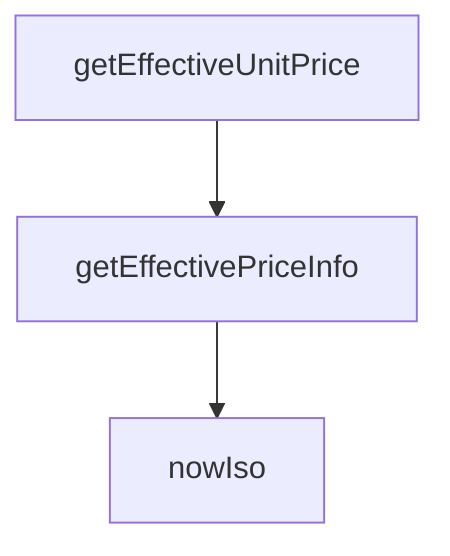

## Genel Bakış
VentHub HVAC platformunda merkezi fiyatlandırma hizmetini sunan bir modüldür. Bu modül, ürünler için geçerli birim fiyat ve fiyat listesi bilgisini hesaplarken, fiyat geçerliliği kontrolü ve zaman damgası gibi yardımcı işlemleri de yönetir. Satış ve teklif süreçlerinde tutarlı fiyat bilgisi sağlamayı amaçlar.

## Fonksiyon Grupları
### Yardımcı Fonksiyonlar
Fiyatlandırma süreçlerinde zaman damgası üretmek ve fiyat geçerlilik kontrollerini desteklemek için standart ISO formatında tarih-saat bilgisi döndürür.
- nowIso

### Fiyat Hesaplama Fonksiyonları
Ürün nesnesi ve veritabanı bağlantısı kullanarak güncel birim fiyatı ve fiyat listesi kimliğini asenkron olarak hesaplar. Satış akışlarına temel fiyat bilgisini sağlamakla yükümlüdür.
- getEffectiveUnitPrice, getEffectivePriceInfo

---

## AXIOMS – Mimari Varsayıml

---

## FONKSİYON DETAYLARI

### nowIso
**Ne yapar**: Geçerli tarih ve saati ISO 8601 formatında bir字符串 olarak döndürür.
**Nasıl yapar**: `new Date()` nesnesi oluşturarak `toISOString()` metodunu çağırır ve mevcut zamanı standart bir string formatında döndürür. Bu, Supabase sorgularında tarih bazlı filtreleme için zaman damgası olarak kullanılır.
**Parametreler**:
- Bu fonksiyon herhangi bir parametre almaz.
**Dönüş**: `string` — Geçerli tarih ve saatin ISO 8601 formatında temsili.

### getEffectiveUnitPrice
**Ne yapar**: Belirli bir ürün için geçerli olan birim fiyatı döndürür. Bu fonksiyon, karmaşık fiyatlandırma mantığını basitleştirerek doğrudan sonuçsal birim fiyat değerini elde etmek için kullanılır.

**Nasıl yapar**: Fonksiyon, daha kapsamlı olan `getEffectivePriceInfo` fonksiyonunu çağırır ve returned objenin içindeki `unitPrice` alanını alarak sonuç olarak number tipinde bir değer döndürür. Bu, üst düzey işlemler için sade ve kullanışlı bir arayüz sağlar.

**Parametreler**:
- `supabase`: SupabaseClient<Database> — Aktif Supabase istemcisi örneği, veritabanı ve kimlik doğrulama işlemleri için kullanılır.
- `product`: Product — Temel fiyat bilgilerini içeren ürün nesnesi, fiyat hesaplamasının temelini oluşturur.

**Dönüş**: Promise<number> — Hesaplanan etkili birim fiyat (number).

### getEffectivePriceInfo
**Ne yapar**: Bir ürün için en uygun fiyatlandırma bilgisini, mevcut kullanıcının rolü, geçerli fiyat listeleri ve uygulanabilir indirimler temelinde belirler. Bu ana mantık fonksiyonu, fiyat kararını vermek için birden fazla veri kaynağını sorgular ve bir dizi kurallar bütünü uygular.

**Nasıl yapar**: Fonksiyon首先 kullanıcının oturumunu doğrular ve profilini (rol ve kuruluş bilgisi) çeker. Sonra, mevcut tarih itibarıyla aktif ve geçerli fiyat listelerini sorgular. Bu listeleri kullanıcının rolüne göre filtreler ve belirli bir sıralama mantığıyla (spesifik rol eşleşmesi tercih edilir) en uygun listeyi seçer. Ardından, seçilen fiyat listesinde (varsa) ürünün fiyat kayıtlarını arar; burada satış fiyatı, temel fiyat ve indirim yüzdesi gibi faktörleri değerlendirerek geçerli bir fiyat hesaplar. Hiçbir fiyat listesi eşleşmesi veya geçerli kayıt bulunamazsa, ürün nesnesindeki temel fiyata (fallback) geri döner. Tüm işlemler sırasında hata oluşursa güvenli bir şekilde fallback değerini döndürür.

**Parametreler**:
- `supabase`: SupabaseClient<Database> — Aktif Supabase istemcisi örneği, veritabanı sorguları ve kullanıcı oturumu yönetimi için gereklidir.
- `product`: Product — Fiyatı belirlenecek olan ürün nesnesi. Ürünün `id` ve `price` alanları gibi temel özelliklerini içerir.

**Dönüş**: Promise<{ unitPrice: number, priceListId: string | null }> — Hesaplanan birim fiyatı ve uygulanan fiyat listesinin ID'si (varsa,否则 null) içeren bir nesne.

---

## INTERFACES

### UserProfileLight
- `id: string`
- `role?: UserRole | null`
- `organization_id?: string | null`

### OrganizationLight
- `id: string`
- `tier_level?: number | null`

---

## TYPE ALIASES

### UserRole
```typescript
type UserRole = 'individual' | 'dealer' | 'corporate' | 'admin'
```

---

## AST POINTERS

### [N1_NASIL] AST Pointer: pricing.service.ts::nowIso
- **params**: (yok)
- **ic_degiskenler**:
  - `yok` — Fonksiyon gövdesi doğrudan `new Date().toISOString()` değerini döndürür, hiçbir iç değişken tanımlanmaz.
- **Dönüş**: `string` — Geçerli tarih ve saatin ISO 8601 formatındaki string temsili.

---

### [N2_NASIL] AST Pointer: pricing.service.ts::getEffectiveUnitPrice
- **params**: `supabase: SupabaseClient<Database>`, `product: Product`
- **ic_degiskenler**:
  - `info` — `getEffectivePriceInfo` çağrısının sonucunu tutar; bir `{ unitPrice: number, priceListId: string | null }` nesnesidir.
- **Dönüş**: `Promise<number>` — `info.unitPrice` değerini döndürür; ürün için geçerli birim fiyatı temsil eder.

---

### [N3_NASIL] AST Pointer: pricing.service.ts::getEffectivePriceInfo
- **params**: `supabase: SupabaseClient<Database>`, `product: Product`
- **ic_degiskenler**:
  - `fallback` — `product.price` alanından hesaplanan yedek birim fiyat; `product.price` number ise doğrudan kullanılır, string ise `parseFloat` ile dönüştürülür; geçerli sayı değilse `0` döner. Tüm fallback senaryolarında kullanılacak varsayılan fiyattır.
  - `authData` — `supabase.auth.getUser()` çağrısının data tarafı; oturum açmış kullanıcının bilgilerini barındırır.
  - `userErr` — `supabase.auth.getUser()` çağrısının hata tarafı; auth hatası varsa null kullanıcıya yol açar.
  - `user` — Auth sonucundan elde edilen kullanıcı nesnesi; `userErr` varsa `null`, değilse `authData?.user` değerini alır.
  - `prof` — `user_profiles` tablosundan sorgulanan profil satırı; `id`, `role`, `organization_id` alanlarını içerir.
  - `profErr` — Profil sorgusunun hata tarafı; hata varsa fallback dönülür.
  - `profile` — `prof` değerinin `UserProfileLight` tipine cast edilmiş halidir; `prof` null ise boş nesne `{}` kullanılır.
  - `role` — `profile.role` alanından elde edilen kullanıcı rolü; `undefined` veya boş ise `'individual'` varsayılır. Price list eşleştirmesinde kullanılır.
  - `now` — `nowIso()` çağrısıyla elde edilen geçerli ISO zaman damgası; price listelerin `effective_from` ve `effective_to` alanlarıyla karşılaştırma yapılırken kullanılır.
  - `lists` — `price_lists` tablosundan aktif ve geçerli tarih aralığındaki price list satırlarının dizisi; her satır `id`, `user_type`, `effective_from` alanlarını içerir.
  - `listErr` — Price listeler sorgusunun hata tarafı; hata varsa fallback dönülür.
  - `typedLists` — `lists` dizisinin `PriceListRow[]` tipine cast edilmiş halidir; tip güvenliği sağlar.
  - `matchedLists` — `typedLists` içinden `list.user_type === role` koşulunu sağlayan veya `user_type`'ı null olan (varsayılan) listelerin filtrelenmiş dizisi.
  - `sorted` — `matchedLists` dizisinin sıralanmış halidir; belirli user_type eşleşmesi varsayılan eşleşmeden önceliklendirilir, eşitlikte `effective_from` tarihi büyük olan üste gelir.
  - `chosen` — `sorted` dizisinden ilk (en uygun) price list nesnesi; dizi boş ise `null` olur.
  - `priceListIds` — Denenecek price list ID'lerinin dizisi; `chosen` varsa `[chosen.id, null]`, yoksa `[null]` şeklindedir. For döngüsünde sırayla denenir.
  - `plId` — For döngüsünün her iterasyonundaki price list ID'si; `null` ise varsayılan fiyat listesi, diğer durumda seçilen price list ID'sidir.
  - `query` — `product_prices` tablosuna yapılan Supabase sorgu nesnesi; `product_id`, `is_active`, ve `price_list_id` filtreleri uygulanır.
  - `rows` — `product_prices` tablosundan dönen fiyat satırlarının dizisi; her satır `base_price`, `sale_price`, `discount_percentage`, `valid_from`, `valid_until` alanlarını içerir.
  - `prErr` — Ürün fiyatları sorgusunun hata tarafı; hata varsa veya satır yoksa bir sonraki `plId`'ye geçilir.
  - `pick` — `rows` dizisinden tarih aralığı (valid_from/valid_until) uygun olan ilk satır; hiçbiri uygun değilse `rows[0]` kullanılır. Fiyat hesaplamasının temel satırıdır.
  - `base` — `pick.base_price` değerinin number'a dönüştürülmüş hali; indirim veya satış fiyatı yoksa doğrudan kullanılır.
  - `sale` — `pick.sale_price` değeri; `null` değilse ve geçerli bir pozitif sayı ise doğrudan birim fiyat olarak kullanılır.
  - `disc` — `pick.discount_percentage` değerinin number'a dönüştürülmüş hali; `base` üzerinden yüzde indirim hesaplamasında kullanılır.
  - `val` — `disc > 0` olduğunda `base * (1 - disc / 100)` işlemiyle hesaplanan indirimli fiyat; `Math.max(0, ...)` ile negatif olmasını engellenir.
- **Dönüş**: `Promise<{ unitPrice: number, priceListId: string | null }>` — Ürün için geçerli birim fiyatı ve kullanılan price list ID'si. Tüm denemeler başarısız olursa `fallback` birim fiyat ve `null` price list ID döner. Hata yakalandığında `console.error` ile loglanır ve fallback değeri döner.

---


## MERMAID CALL GRAPH


## NODE ID STANDARD

  file: src\lib\services\pricing.service.ts
  function: src\lib\services\pricing.service.ts::nowIso
  function: src\lib\services\pricing.service.ts::getEffectiveUnitPrice
  function: src\lib\services\pricing.service.ts::getEffectivePriceInfo

---

## DISA AKTARILANLAR (EXPORTS)
  export: OrganizationLight
  export: UserProfileLight
  export: UserRole
  export: getEffectivePriceInfo
  export: getEffectiveUnitPrice
  export: nowIso