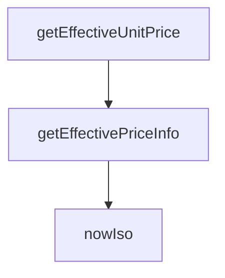

## Genel Bakış
Bu modül, VentHub HVAC platformunda ürünlerin geçerli fiyatlandırılmasını sağlayan merkezi fiyat servisidir. Ürün nesnelerinden birim fiyat ve fiyat listesi gibi temel fiyatlandırma metaverilerini asenkron olarak hesaplar ve sunar. Ayrıca tüm fiyat işlemlerinde tutarlılık sağlamak amacıyla ISO formatında zaman damgası üreten bir yardımcı fonksiyon içerir.

## Fonksiyon Grupları

### Yardımcı Fonksiyon
Modül genelinde ihtiyaç duyulan standart tarih-saat bilgisini üretir; fiyat geçerlilik kontrolleri ve zaman damgası gerektiren tüm işlemlerde kullanılır.
- nowIso

### Fiyat Hesaplama Fonksiyonları
Ürün nesnesinden geçerli birim fiyatı ve ilişkili fiyat listesi kimliğini asenkron olarak hesaplar; platformdaki tüm satış ve teklif süreçlerinin fiyatlandirma kaynağıdır.
- getEffectiveUnitPrice, getEffectivePriceInfo

---


---

## FONKSİYON DETAYLARI

### nowIso
**Ne yapar**: Geerli UTC zaman diliminde ISO 8601 formatında bir zaman damgası döndürür.
**Nasıl yapar**: `new Date().toISOString()` kullanarak mevcut tarihi ve saati tarayıcı/node ortamının yerel saatine göre değil, her zaman UTC'ye göre ISO formatında dizgiye çevirir. Bu, zaman damgalarında tutarlılık sağlamak için ideal bir yöntemdir.
**Parametreler**:
- Parametre almaz.
**Dönüş**: `string` — "2024-01-15T09:30:00.000Z" gibi bir ISO 8601 zaman damgası.

### getEffectiveUnitPrice
**Ne yapar**: Verilen bir ürün için, geçerli kullanıcı rolleri, aktif fiyat listeleri ve olası indirimler değerlendirilerek nihai birim fiyatı hesaplar.
**Nasıl yapar**: `getEffectivePriceInfo` asenkron fonksiyonunu çağırarak fiyatlandırma bilgisini alır ve yalnızca `unitPrice` değerini döndürür. Bu, birim fiyatı tek bir sayısal değer olarak almak isteyen çağrılar için bir sarmalayıcı (wrapper) fonksiyondur.
**Parametreler**:
- product: `Product` — Taban fiyat bilgisini içeren ürün nesnesi.
**Dönüş**: `Promise<number>` — Ürün için hesaplanmış nihai birim fiyatı.

### getEffectivePriceInfo
**Ne yapar**: Mevcut kullanıcının rolüne göre bir ürün için en uygun fiyatlandırma bilgisini (birim fiyat ve uygulanan fiyat listesi ID'si) belirler.
**Nasıl yapar**: Bir dizi adımla çalışır:
1. Ürünün taban fiyatını (`product.price`) bir fallback (yedek) değer olarak hesaplar.
2. Supabase üzerinden kimlik doğrulaması yaparak mevcut kullanıcıyı ve profilini (rol ve organizasyon ID'si) çeker.
3. Kullanıcı oturumu açmamışsa veya hata oluşursa fallback değeri döndürür.
4. Aktif, tarih aralığı uygun (`effective_from` <= şu an ve `effective_to` >= şu an veya null) fiyat listelerini sorgular.
5. Bulunan listeleri, kullanıcının rolüyle eşleşenleri önce gelecek şekilde sıralar (spesifik rol eşleşmesi, genel `null` user_type eşleşmesinden önce tercih edilir).
6. En uygun fiyat listesinde (veya fallback olarak fiyat listesi ID'si `null` olan) ürünün `product_prices` tablosundaki satırlarını sorgular.
7. Her satır için geçerlilik tarihlerini kontrol eder, ardından satış fiyatı (`sale_price`), taban fiyat (`base_price`) ve indirim yüzdesi (`discount_percentage`) sırasıyla değerlendirerek en uygun fiyatı hesaplar ve döndürür.
8. Hiçbir eşleşme bulunamazsa veya hata oluşursa fallback fiyatı ve ilgili fiyat listesi ID'sini döndürür.
**Parametreler**:
- product: `Product` — Fiyatı belirlenecek ürün nesnesi.
**Dönüş**: `Promise<{ unitPrice: number, priceListId: string | null }>` — Hesaplanmış birim fiyatı ve uygulanan fiyat listesinin ID'si (hiçbir fiyat listesi uygulanmadıysa `null`).

---

## INTERFACES

### UserProfileLight
- `id: string`
- `role?: UserRole | null`
- `organization_id?: string | null`

### OrganizationLight
- `id: string`
- `tier_level?: number | null`

---

## TYPE ALIASES

### UserRole
```typescript
type UserRole = 'individual' | 'dealer' | 'corporate' | 'admin'
```

---

## AST POINTERS

### [N1_NASIL] AST Pointer: src/lib/services/pricing.service.ts::nowIso
- **params**: (parametre yok)
- **ic_degiskenler**:
  - (iç değişken yok)
- **Dönüş**: string — geçerli ISO tarih stringini döndürür

### [N2_NASIL] AST Pointer: src/lib/services/pricing.service.ts::getEffectiveUnitPrice
- **params**: (product: Product) — fiyat bilgisi alınacak ürün nesnesi
- **ic_degiskenler**:
  - `info` — getEffectivePriceInfo fonksiyonunun sonucunu tutar, unitPrice ve priceListId içerir
- **Dönüş**: Promise<number> — ürünün etkin birim fiyatını döndürür

### [N3_NASIL] AST Pointer: src/lib/services/pricing.service.ts::getEffectivePriceInfo
- **params**: (product: Product) — fiyat bilgisi hesaplanacak ürün nesnesi
- **ic_degiskenler**:
  - `fallback` — product.price değerinden hesaplanan yedek fiyat (IIFE ile)
  - `authData` — supabase.auth.getUser() sonucu, kullanıcı verisi içerir
  - `userErr` — auth isteği hata nesnesi
  - `user` — kimlik doğrulanmış kullanıcı nesnesi veya hata durumunda null
  - `prof` — user_profiles tablosundan gelen profil verisi (id, role, organization_id)
  - `profErr` — profil sorgusu hata nesnesi
  - `profile` — prof değişkeninin UserProfileLight olarak tipi dönüştürülmüş hali
  - `role` — kullanıcının rolü (profile.role veya 'individual' varsayılanı)
  - `now` — şu anki ISO tarih stringi (nowIso fonksiyonu ile)
  - `lists` — aktif ve geçerli fiyat listeleri dizisi
  - `listErr` — fiyat listeleri sorgusu hata nesnesi
  - `typedLists` — lists dizisinin PriceListRow[] olarak tipi dönüştürülmüş hali
  - `matchedLists` — kullanıcının rolüyle eşleşen veya genel (user_type=null) fiyat listeleri
  - `sorted` — eşleşen listelerin öncelik sırasına göre sıralanmış hali
  - `chosen` — sıralanmış listeden birinci (en uygun) fiyat listesi veya null
  - `priceListIds` — denenecek fiyat listesi ID'leri dizisi (chosen.id ve null veya sadece null)
  - `plId` — döngüdeki mevcut fiyat listesi ID'si
  - `query` — product_prices tablosu için Supabase sorgu nesnesi
  - `rows` — product_prices tablosundan gelen satırlar
  - `prErr` — ürün fiyatları sorgusu hata nesnesi
  - `pick` — geçerli tarih aralığındaki ilk ürün fiyatı satırı veya ilk satır
  - `base` — pick.base_price sayısına dönüştürülmüş hali
  - `sale` — pick.sale_price sayıya dönüştürülmüş hali veya null
  - `disc` — pick.discount_percentage sayısına dönüştürülmüş hali
- **Dönüş**: Promise<{ unitPrice: number, priceListId: string | null }> — hesaplanan birim fiyat ve kullanılan fiyat listesi ID'si

---


## MERMAID CALL GRAPH


## NODE ID STANDARD

  file: src\lib\services\pricing.service.ts
  function: src\lib\services\pricing.service.ts::nowIso
  function: src\lib\services\pricing.service.ts::getEffectiveUnitPrice
  function: src\lib\services\pricing.service.ts::getEffectivePriceInfo

---

## DISA AKTARILANLAR (EXPORTS)
  export: OrganizationLight
  export: UserProfileLight
  export: UserRole
  export: getEffectivePriceInfo
  export: getEffectiveUnitPrice
  export: nowIso