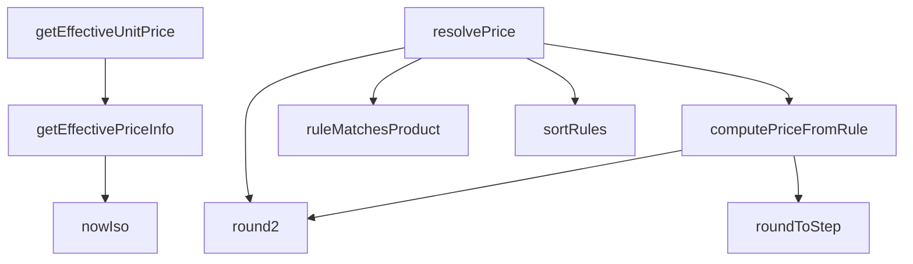

## Genel Bakış
VentHub HVAC platformunda merkezi fiyatlandırma hizmetini yöneten bir modüldür. Ürünler için geçerli birim fiyatları hesaplarken, fiyat listesi ve kural tabanlı fiyatlandırma mekanizmalarını da sunar. Fiyatlandırma sürecinde zaman damgası üretimi, sayı yuvarlama, kural eşleştirme ve fiyat çözümleme gibi temel yardımcı ve hesaplama görevlerini bir arada yönetir.

## Fonksiyon Grupları
### Yardımcı Fonksiyonlar
Fiyatlandırma süreçlerinde gerekli olan standart yardımcı işlemleri sunar. Zaman damgası üretmek ve sayısal değerleri yuvarlamak gibi低 seviyeli ama kritik destek görevlerini yerine getirir.
- nowIso, roundToStep, round2

### Fiyat Bilgisi Hesaplama Fonksiyonları
Ürünler için veritabanından güncel fiyat bilgisini çeken ve işleyen asenkron fonksiyonlardır. Satış ve teklif akışlarına doğrudan birim fiyat ve fiyat listesi referansı sağlar.
- getEffectiveUnitPrice, getEffectivePriceInfo

### Kural Tabanlı Fiyat Hesaplama Fonksiyonları
Fiyatlandırma kurallarını ürünlere eşleştiren, kuralları sıralayan ve bu kurallara göre net/fiyat hesaplayan fonksiyonlardır. Dinamik ve esnek fiyatlandırma politikalarının uygulanmasını mümkün kılar.
- ruleMatchesProduct, sortRules, computePriceFromRule

### Ana Fiyat Çözümleme Fonksiyonu
Tüm fiyatlandırma mantığını bir araya getiren ana orkestratör fonksiyondur. Ürün, bağlam ve kurallar dahilinde en uygun fiyatı hesaplayarak merkezi çözümleme noktasını oluşturur.
- resolvePrice

---

## AXIOMS – Mimari Varsayımlar
- Bu modül davranışsal mantık içermez (salt veri / konfigürasyon / tip tanımı).
- [Aksiyom 1]: Modülün dışa açtığı yapı (anahtar kümesi / şema) bir sözleşmedir; tüketiciler bu sabit yapıya bağlıdır — kırıcı değişiklik tüm tüketicileri etkiler.
- [Aksiyom 2]: Bir öğe ekleme/çıkarma yapısal-uyumlu olmalı; ilgili tipler ve seçiciler aynı commit'te güncel tutulmalıdır.

---

## FONKSİYON DETAYLARI

### nowIso
**Ne yapar**: Geçerli tarih ve saati ISO 8601 formatında bir字符串 olarak döndürür.
**Nasıl yapar**: `new Date()` nesnesi oluşturarak `toISOString()` metodunu çağırır ve mevcut zamanı standart bir string formatında döndürür. Bu, Supabase sorgularında tarih bazlı filtreleme için zaman damgası olarak kullanılır.
**Parametreler**:
- Bu fonksiyon herhangi bir parametre almaz.
**Dönüş**: `string` — Geçerli tarih ve saatin ISO 8601 formatında temsili.

### getEffectiveUnitPrice
**Ne yapar**: Belirli bir ürün için geçerli olan birim fiyatı döndürür. Bu fonksiyon, karmaşık fiyatlandırma mantığını basitleştirerek doğrudan sonuçsal birim fiyat değerini elde etmek için kullanılır.

**Nasıl yapar**: Fonksiyon, daha kapsamlı olan `getEffectivePriceInfo` fonksiyonunu çağırır ve returned objenin içindeki `unitPrice` alanını alarak sonuç olarak number tipinde bir değer döndürür. Bu, üst düzey işlemler için sade ve kullanışlı bir arayüz sağlar.

**Parametreler**:
- `supabase`: SupabaseClient<Database> — Aktif Supabase istemcisi örneği, veritabanı ve kimlik doğrulama işlemleri için kullanılır.
- `product`: Product — Temel fiyat bilgilerini içeren ürün nesnesi, fiyat hesaplamasının temelini oluşturur.

**Dönüş**: Promise<number> — Hesaplanan etkili birim fiyat (number).

### getEffectivePriceInfo
**Ne yapar**: Bir ürün için en uygun fiyatlandırma bilgisini, mevcut kullanıcının rolü, geçerli fiyat listeleri ve uygulanabilir indirimler temelinde belirler. Bu ana mantık fonksiyonu, fiyat kararını vermek için birden fazla veri kaynağını sorgular ve bir dizi kurallar bütünü uygular.

**Nasıl yapar**: Fonksiyon首先 kullanıcının oturumunu doğrular ve profilini (rol ve kuruluş bilgisi) çeker. Sonra, mevcut tarih itibarıyla aktif ve geçerli fiyat listelerini sorgular. Bu listeleri kullanıcının rolüne göre filtreler ve belirli bir sıralama mantığıyla (spesifik rol eşleşmesi tercih edilir) en uygun listeyi seçer. Ardından, seçilen fiyat listesinde (varsa) ürünün fiyat kayıtlarını arar; burada satış fiyatı, temel fiyat ve indirim yüzdesi gibi faktörleri değerlendirerek geçerli bir fiyat hesaplar. Hiçbir fiyat listesi eşleşmesi veya geçerli kayıt bulunamazsa, ürün nesnesindeki temel fiyata (fallback) geri döner. Tüm işlemler sırasında hata oluşursa güvenli bir şekilde fallback değerini döndürür.

**Parametreler**:
- `supabase`: SupabaseClient<Database> — Aktif Supabase istemcisi örneği, veritabanı sorguları ve kullanıcı oturumu yönetimi için gereklidir.
- `product`: Product — Fiyatı belirlenecek olan ürün nesnesi. Ürünün `id` ve `price` alanları gibi temel özelliklerini içerir.

**Dönüş**: Promise<{ unitPrice: number, priceListId: string | null }> — Hesaplanan birim fiyatı ve uygulanan fiyat listesinin ID'si (varsa,否则 null) içeren bir nesne.

### roundToStep

**Ne yapar**: Bir sayısal değeri belirli bir adıma (step) en yakın yuvarlak değere getirir. Fiyatlandırma kurallarında kuruş, lira veya özel aralıklara yuvarlama işlemini gerçekleştirir.

**Nasıl yapar**: Adım değerinin geçerli ve pozitif olup olmadığını kontrol eder; geçersizse değeri olduğu gibi döndürür. Geçerliyse değeri adıma böler, yuvarlar, tekrar adım ile çarpar ve 6 ondalık basamağa kadar hassasiyetle düzeltir. Bu sayede floating-point hassasiyet sorunlarından kaynaklanan kuruş hataları önlenir.

**Parametreler**:
- value: number — Yuvarlanacak sayısal değer
- step: number — Yuvarlama adım aralığı (örn. 0.01 kuruş, 0.50 yarımlık, 1 tam lira)

**Dönüş**: number — Adım aralığına en yakın yuvarlanmış değer

### round2
**Ne yapar**: Geliştirildi ancak detay üretilemedi.

### ruleMatchesProduct
**Ne yapar**: Geliştirildi ancak detay üretilemedi.

### sortRules
**Ne yapar**: Geliştirildi ancak detay üretilemedi.

### computePriceFromRule
**Ne yapar**: Geliştirildi ancak detay üretilemedi.

### resolvePrice
**Ne yapar**: Geliştirildi ancak detay üretilemedi.

---

## İTHALATLAR (IMPORTS)
- import: ../../types/database.types::type { Database }
- import: ../../types/ui-models::type { Product }
- import: @supabase/supabase-js::type { SupabaseClient }

---

## INTERFACES

### UserProfileLight
- `id: string`
- `role?: UserRole | null`
- `organization_id?: string | null`

### OrganizationLight
- `id: string`
- `tier_level?: number | null`

### PricingProductInput
- `id: string`
- `brandId?: string | null`
- `categoryId?: string | null`
- `costInBase?: number | null`

### PricingContext
- `priceBookId?: string | null`
- `quantity?: number`
- `currency?: string`
- `today?: string`

### ResolvedPrice
- `net: number`
- `gross: number`
- `currency: string`
- `vatRatePct: number`
- `ruleId: string`
- `ruleScope: number`

### PriceResolution
- `price: ResolvedPrice | null`
- `trace: string[]`

---

## TYPE ALIASES

### PricingRuleRow
```typescript
type PricingRuleRow = Database['public']['Tables']['pricing_rule']['Row']
```

### UserRole
```typescript
type UserRole = 'individual' | 'dealer' | 'corporate' | 'admin'
```

---

## AST POINTERS

### [N1_NASIL] AST Pointer: src/lib/services/pricing.service.ts::nowIso
- **params**: (parametre yok)
- **ic_degiskenler**:
  - `yok`
- **Dönüş**: `string` — geçerli ISO tarih/saat stringi döndürür

---

### [N2_NASIL] AST Pointer: src/lib/services/pricing.service.ts::getEffectiveUnitPrice
- **params**: `supabase: SupabaseClient<Database>`, `product: Product`
- **ic_degiskenler**:
  - `info` — getEffectivePriceInfo çağırısının sonucu, { unitPrice, priceListId } nesnesi
- **Dönüş**: `Promise<number>` — ürünün etkin birim fiyatını döndürür (info.unitPrice)

---

### [N3_NASIL] AST Pointer: src/lib/services/pricing.service.ts::getEffectivePriceInfo
- **params**: `supabase: SupabaseClient<Database>`, `product: Product`
- **ic_degiskenler**:
  - `fallback` — product.price'dan hesaplanan yedek birim fiyat; sayısal değilse veya finite değilse 0 döner
  - `v` — product.price'in sayısal karşılığı, parse edilmiş geçici değer
  - `authData` — supabase.auth.getUser() çağrısının data sonucu
  - `userErr` — supabase.auth.getUser() çağrısının hata sonucu
  - `user` — authenticated kullanıcı nesnesi; hata varsa null
  - `prof` — user_profiles tablosundan çekilen profil verisi (id, role, organization_id)
  - `profErr` — user_profiles sorgusunun hata sonucu
  - `profile` — prof verisinin UserProfileLight olarak cast edilmiş hali
  - `role` — kullanıcının rolü (profile.role); yoksa 'individual'
  - `now` — şu anki ISO tarih stringi, price_lists filtresinde kullanılır
  - `lists` — price_lists tablosundan çekilen aktif ve tarih aralığındaki fiyat listeleri
  - `listErr` — price_lists sorgusunun hata sonucu
  - `typedLists` — lists'in PriceListRow[] olarak tip güvencesine alınmış hali
  - `matchedLists` — kullanıcı rolüne veya varsayılan (user_type=null) listelerle eşleşen fiyat listeleri
  - `sorted` — matchedLists'in rollere göre önceliklendirilmiş ve tarihe göre sıralanmış hali
  - `chosen` — sorted listesinin ilk elemanı veya null; tercih edilen fiyat listesi
  - `priceListIds` — denenecek fiyat listesi ID'leri dizisi (chosen.id ve null fallback)
  - `plId` — for döngüsünün mevcut fiyat listesi ID'si
  - `query` — product_prices tablosuna uygulanan Supabase sorgu zinciri
  - `rows` — product_prices tablosundan dönen satırlar
  - `prErr` — product_prices sorgusunun hata sonucu
  - `pick` — geçerli tarih aralığındaki ilk satır; yoksa rows[0]
  - `r` — find callback içindeki her bir product_prices satırı
  - `fromOk` — valid_from kontrolü; null veya bugünden önceyse geçerli
  - `toOk` — valid_until kontrolü; null veya bugünden sonraysa geçerli
  - `base` — pick.base_price'ın Number karşılığı
  - `sale` — pick.sale_price'ın Number karşılığı; null olabilir
  - `disc` — pick.discount_percentage'ın Number karşılığı
  - `val` — base_price üzerinden indirim hesaplama sonucu
- **Dönüş**: `Promise<{ unitPrice: number, priceListId: string | null }>` — etkin birim fiyat ve kullanılan fiyat listesi ID'si

---

### [N4_NASIL] AST Pointer: src/lib/services/pricing.service.ts::roundToStep
- **params**: `value: number`, `step: number`
- **ic_degiskenler**:
  - `yok`
- **Dönüş**: `number` — value'yu step'in katına yuvarlanmış değer

---

### [N5_NASIL] AST Pointer: src/lib/services/pricing.service.ts::round2
- **params**: `value: number`
- **ic_degiskenler**:
  - `yok`
- **Dönüş**: `number` — value'nun 2 ondalık basamağa yuvarlanmış hali

---

### [N6_NASIL] AST Pointer: src/lib/services/pricing.service.ts::ruleMatchesProduct
- **params**: `rule: PricingRuleRow`, `product: PricingProductInput`, `categoryAncestors: ReadonlySet<string>`
- **ic_degiskenler**:
  - `yok`
- **Dönüş**: `boolean` — kuralın ürüneayıp uymadığını döndürür; scope 0/1→ürün ID eşleşmesi, scope 2→marka eşleşmesi, scope 3→kategori atalarında eşleşme, scope 4→her zaman eşleşir

---

### [N7_NASIL] AST Pointer: src/lib/services/pricing.service.ts::sortRules
- **params**: `rules: PricingRuleRow[]`, `priceBookId: string | null`
- **ic_degiskenler**:
  - `bookRank` — fonksiyon; PricingRuleRow alır ve priceBookId ile eşleşiyorsa 0, eşleşmiyorsa 1 döner; priceBookId sıralama önceliğini belirler
- **Dönüş**: `PricingRuleRow[]` — scope'a göre artan, priceBookId eşleşmesine göre öncelikli, min_quantity ve priority'a göre azalan, id'ye göre tersten sıralanmış kurallar dizisi

---

### [N8_NASIL] AST Pointer: src/lib/services/pricing.service.ts::computePriceFromRule
- **params**: `rule: PricingRuleRow`, `costInBase: number | null`, `trace: string[]`
- **ic_degiskenler**:
  - `p` — hesaplanan kural fiyatı; cost_plus'ta maliyet × (1 + marj), fixed'ta sabit fiyat
  - `margin` — fiyat ile maliyet arasındaki mutlak kar marjı
  - `vatFactor` — KDV çarpanı (1 + vat_rate_pct / 100)
  - `net` — KDV'siz net fiyat; fixed kural KDV-dahil ise vatFactor'a bölünür
  - `gross` — KDV dahil brüt fiyat (net × vatFactor), 2 ondalığa yuvarlanır
  - `charmed` — charm uygulanmış brüt fiyat tam kısmı + charm kesirli kısmı
- **Dönüş**: `{ net: number; gross: number } | null` — hesaplama başarısızsa veya geçersiz fiyat oluştuysa null; aksi halde net ve gross fiyatlar

---

### [N9_NASIL] AST Pointer: src/lib/services/pricing.service.ts::resolvePrice
- **params**: `supabase: SupabaseClient<Database>`, `product: PricingProductInput`, `context: PricingContext` (varsayılan `{}`)
- **ic_degiskenler**:
  - `trace` — string[]; fiyat hesaplama adımlarının log izi
  - `qty` — context.quantity ?? 1; sipariş adedi
  - `currency` — context.currency ?? 'TRY'; para birimi, upper-cased
  - `today` — context.today ?? bugünkü tarih (YYYY-MM-DD); geçerlilik kontrolü için
  - `priceBookId` — context.priceBookId ?? null; fiyat kitabı filtresi
  - `cost` — product.costInBase ?? null; ürünün maliyeti
  - `ruleRows` — pricing_rule tablosundan çekilen tüm kural satırları
  - `rulesError` — pricing_rule sorgusunun hata sonucu
  - `allRules` — ruleRows'ün PricingRuleRow[] olarak cast edilmiş hali
  - `categoryAncestors` — Set<string>; ürünün kategori ata zinciri (scope 3 kuralları için)
  - `cats` — categories tablosundan çekilen tüm kategoriler (id, parent_id)
  - `parentOf` — Map<string, string | null>; kategori ID → üst kategori ID eşlemesi
  - `cursor` — kategori ata zincirinde ilerlemek için mevcut kategori ID'si
  - `candidates` — fiyat kitabına, para birimine, adede, tarihe ve ürün eşleşmesine uyan kurallar
  - `rule` — sortRules tarafından sıralanmış aday kurallar üzerindeki for döngüsü değişkeni
  - `computed` — computePriceFromRule sonucu; { net, gross } veya null
  - `net` — computePriceFromRule'dan dönen net fiyat; döviz çevirisi varsa bölünür
  - `gross` — computePriceFromRule'dan dönen gross fiyat; döviz çevirisi varsa bölünür
  - `rates` — currency_rates tablosundan çekilen en güncel kur satırları
  - `rate` — quotes para birimi için geçerli kur değeri; rates[0].rate
- **Dönüş**: `Promise<PriceResolution>` — { price: { net, gross, currency, vatRatePct, ruleId, ruleScope } | null, trace: string[] }; fiyat hesaplanamazsa price null, trace adım logunu içerir

---


## MERMAID CALL GRAPH


## NODE ID STANDARD

  file: src\lib\services\pricing.service.ts
  function: src\lib\services\pricing.service.ts::nowIso
  function: src\lib\services\pricing.service.ts::getEffectiveUnitPrice
  function: src\lib\services\pricing.service.ts::getEffectivePriceInfo
  function: src\lib\services\pricing.service.ts::roundToStep
  function: src\lib\services\pricing.service.ts::round2
  function: src\lib\services\pricing.service.ts::ruleMatchesProduct
  function: src\lib\services\pricing.service.ts::sortRules
  function: src\lib\services\pricing.service.ts::computePriceFromRule
  function: src\lib\services\pricing.service.ts::resolvePrice

---

## DISA AKTARILANLAR (EXPORTS)
  export: OrganizationLight
  export: PriceResolution
  export: PricingContext
  export: PricingProductInput
  export: PricingRuleRow
  export: ResolvedPrice
  export: UserProfileLight
  export: UserRole
  export: computePriceFromRule
  export: getEffectivePriceInfo
  export: getEffectiveUnitPrice
  export: nowIso
  export: resolvePrice
  export: round2
  export: roundToStep
  export: ruleMatchesProduct
  export: sortRules