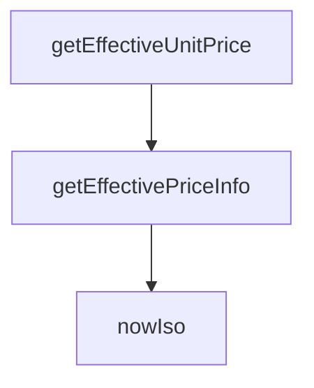

## Genel Bakış
VentHub HVAC platformunda merkezi fiyatlandırma hizmetini sunan bir modüldür. Ürünler için geçerli birim fiyat ve fiyat listesi bilgisini hesaplarken, fiyat geçerliliği ve zaman damgası gibi yardımcı işlemleri de yönetir. Modül, satış ve teklif süreçlerinde tutarlı fiyat bilgisi sağlamayı amaçlar.

## Fonksiyon Grupları
### Yardımcı Fonksiyon
Fiyatlandırma süreçlerinde ve loglama gibi işlemlerde kullanılan standart zaman bilgisini üretir.
- nowIso

### Fiyat Hesaplama Fonksiyonları
Ürün nesnesi ve sistem verilerinden güncel birim fiyatı ve fiyat listesi kimliğini asenkron olarak hesaplayarak satış akışlarına temel fiyat bilgisini sağlar.
- getEffectiveUnitPrice, getEffectivePriceInfo

---

## AXIOMS – Mimari Varsayımlar

Bu modül, fiyat hesaplama için harici bir veritabanı bağlantısına ve geçerli ürün verisine bağımlıdır.

**[Aksiyom 1]:** Eğer `supabase` istemcisi (`getEffectiveUnitPrice` veya `getEffectivePriceInfo` çağrısında) sağlanmamışsa, fiyat hesaplama fonksiyonları çalışamaz.

**[Aksiyom 2]:** Eğer `product` parametresi geçerli bir `Product` nesnesi içermiyorsa (`getEffectiveUnitPrice` veya `getEffectivePriceInfo` çağrısında), fiyat bilgisi üretilemez.

**[Aksiyom 3]:** Eğer `defaultClient` sabiti tanımlı veya erişilebilir değilse, modül içindeki varsayılan veritabanı bağlantısı mekanizması bozulur.

**[Aksiyom 4]:** Eğer `nowIso()` fonksiyonu çağrılamıyorsa (sistem saatine erişim engellenmişse), fiyat geçerlilik zaman damgaları tutarsız veya eksik olur.

---

## FONKSİYON DETAYLARI

### nowIso
**Ne yapar**: Geçerli tarih ve saati ISO 8601 formatında bir字符串 olarak döndürür.
**Nasıl yapar**: `new Date()` nesnesi oluşturarak `toISOString()` metodunu çağırır ve mevcut zamanı standart bir string formatında döndürür. Bu, Supabase sorgularında tarih bazlı filtreleme için zaman damgası olarak kullanılır.
**Parametreler**:
- Bu fonksiyon herhangi bir parametre almaz.
**Dönüş**: `string` — Geçerli tarih ve saatin ISO 8601 formatında temsili.

### getEffectiveUnitPrice
**Ne yapar**: Belirli bir ürün için geçerli birim fiyatı belirler. Kullanıcı rolleri, aktif fiyat listeleri ve geçerli indirimleri değerlendirerek nihai birim fiyatı döndürür.
**Nasıl yapar**: `getEffectivePriceInfo` fonksiyonunu çağırarak fiyat bilgisini alır ve sadece `unitPrice` değerini döndürür. Bu, fiyat hesaplama mantığını soyutlayarak daha basit bir arayüz sunar.
**Parametreler**:
- product: `Product` — Fiyatı belirlenecek ürün nesnesi. Taban fiyat bilgisini içerir.
- supabase: `any` (isteğe bağlı) — Varsayılan olarak `defaultClient` kullanılır. Veritabanı bağlantısı için Supabase istemcisi.
**Dönüş**: `Promise<number>` — Hesaplanmış birim fiyatı sayısal değer olarak.

### getEffectivePriceInfo
**Ne yapar**: Mevcut kullanıcının rolüne göre bir ürün için en uygun fiyat bilgisini belirler. Aktif fiyat listelerini sorgular, en geçerli fiyatı veya indirimi uygular ve hem fiyatı hem de kullanılan fiyat listesinin kimliğini döndürür.
**Nasıl yapar**: 
1. Önce ürünün taban fiyatını (`product.price`) bir fallback değer olarak hesaplar.
2. Supabase'den mevcut kullanıcının kimliğini ve profilini (rol, organizasyon ID) çeker.
3. Geçerli tarihte aktif olan fiyat listelerini (`price_lists` tablosundan) sorgular.
4. Kullanıcının rolüne uygun fiyat listelerini filtreler ve öncelik sırasına göre (özel kullanıcı tipi eşleşmesi > genel) sıralar.
5. Seçilen fiyat listesinde (veya hiçbir fiyat listesi yoksa genel havuzda) ürünün fiyat kaydını (`product_prices`) arar.
6. Kaydın `sale_price`, `base_price` ve `discount_percentage` alanlarını değerlendirerek birim fiyatı hesaplar. Öncelik sırası: satış fiyatı > indirimli taban fiyat > taban fiyat.
7. Herhangi bir hata veya uygun fiyat bulunamazsa, ürünün kendi taban fiyatına geri döner.
**Parametreler**:
- product: `Product` — Fiyatı belirlenecek ürün nesnesi.
- supabase: `any` (isteğe bağlı) — Varsayılan olarak `defaultClient` kullanılır. Veritabanı bağlantısı için Supabase istemcisi.
**Dönüş**: `Promise<{ unitPrice: number, priceListId: string | null }>` — Hesaplanmış birim fiyatı ve kullanılan fiyat listesinin kimliği (eğer bir fiyat listesi uygulandıysa). Fiyat listesi kullanılmadığında `priceListId` `null` olur.

---

## INTERFACES

### UserProfileLight
- `id: string`
- `role?: UserRole | null`
- `organization_id?: string | null`

### OrganizationLight
- `id: string`
- `tier_level?: number | null`

---

## TYPE ALIASES

### UserRole
```typescript
type UserRole = 'individual' | 'dealer' | 'corporate' | 'admin'
```

---

## SABİTLER
- **defaultClient** (ternary_expression) — `typeof window !== 'undefined' ? supabaseBrowserClient : supabaseStaticClient`

---

## AST POINTERS

### [N1_NASIL] AST Pointer: pricing.service.ts::nowIso
- **params**: (parametre yok)
- **ic_degiskenler**:
  - (yok)
- **Dönüş**: string — Mevcut UTC zamanını ISO formatında döndürür.

### [N2_NASIL] AST Pointer: pricing.service.ts::getEffectiveUnitPrice
- **params**: (product: Product, supabase = defaultClient)
- **ic_degiskenler**:
  - `info` — getEffectivePriceInfo fonksiyonundan dönen unitPrice ve priceListId değerlerini tutar.
- **Dönüş**: number — product için geçerli birim fiyatı döndürür.

### [N3_NASIL] AST Pointer: pricing.service.ts::getEffectivePriceInfo
- **params**: (product: Product, supabase = defaultClient)
- **ic_degiskenler**:
  - `fallback` — product.price'dan hesaplanan ve geçerli fiyat bulunamadığında kullanılacak yedek fiyat.
  - `authData` — supabase.auth.getUser() sonucundan gelen kullanıcı verisi.
  - `userErr` — supabase.auth.getUser() sonucunda oluşabilecek hata.
  - `user` — authData.user, userErr varsa null.
  - `prof` — user_profiles tablosundan çekilen profil verisi.
  - `profErr` — user_profiles sorgusundaki hata.
  - `profile` — prof veya boş nesne.
  - `role` — profile.role veya 'individual'.
  - `now` — şu anki ISO tarih stringi.
  - `lists` — price_lists tablosundan çekilen aktif ve tarih aralığına uyan fiyat listeleri.
  - `listErr` — price_lists sorgusundaki hata.
  - `typedLists` — lists'in PriceListRow[] türüne dönüştürülmüş hali.
  - `matchedLists` — user_type'ı role ile eşleşen veya user_type'ı olmayan listeler.
  - `sorted` — matchedLists'in sıralanmış hali.
  - `chosen` — sorted[0] veya null.
  - `priceListIds` — chosen varsa [chosen.id, null], yoksa [null].
  - `plId` — priceListIds içindeki her bir id için döngüde kullanılır.
  - `query` — product_prices tablosu için sorgu.
  - `rows` — query sonucu veriler.
  - `prErr` — query hatası.
  - `pick` — rows içinden tarih aralığına uyan ilk satır veya rows[0].
  - `base` — pick.base_price, sayıya çevrilmiş.
  - `sale` — pick.sale_price, null olabilir.
  - `disc` — pick.discount_percentage, sayıya çevrilmiş.
  - `val` — base ve disc kullanılarak hesaplanan değer.
- **Dönüş**: { unitPrice: number, priceListId: string | null } — product için geçerli fiyat ve fiyat listesi ID'si.

### [N4_NASIL] AST Pointer: pricing.service.ts::(fallback_arrow)
- **params**: (parametre yok)
- **ic_degiskenler**:
  - `v` — product.price'ın sayısal karşılığı, parseFloat ile çevrilmiş.
- **Dönüş**: number — fallback fiyatı döndürür.

### [N5_NASIL] AST Pointer: pricing.service.ts::(filter_arrow)
- **params**: (list)
- **ic_degiskenler**:
  - `match` — list.user_type ile role eşleşip eşleşmediğini tutan boolean.
- **Dönüş**: boolean — listenin eşleşip eşleşmediğini döndürür.

### [N6_NASIL] AST Pointer: pricing.service.ts::(sort_arrow)
- **params**: (a, b)
- **ic_degiskenler**:
  - `aTime` — a.effective_from tarihini milisaniyeye çevirip tutan değişken.
  - `bTime` — b.effective_from tarihini milisaniyeye çevirip tutan değişken.
- **Dönüş**: number — sıralama için karşılaştırma sonucu.

### [N7_NASIL] AST Pointer: pricing.service.ts::(find_arrow)
- **params**: (r)
- **ic_degiskenler**:
  - `fromOk` — r.valid_from tarihinin geçerli olup olmadığını tutan boolean.
  - `toOk` — r.valid_until tarihinin geçerli olup olmadığını tutan boolean.
- **Dönüş**: boolean — satırın tarih aralığına uyup uymadığını döndürür.

---


## MERMAID CALL GRAPH


## NODE ID STANDARD

  file: src\lib\services\pricing.service.ts
  function: src\lib\services\pricing.service.ts::nowIso
  function: src\lib\services\pricing.service.ts::getEffectiveUnitPrice
  function: src\lib\services\pricing.service.ts::getEffectivePriceInfo

---

## DISA AKTARILANLAR (EXPORTS)
  export: OrganizationLight
  export: UserProfileLight
  export: UserRole
  export: getEffectivePriceInfo
  export: getEffectiveUnitPrice
  export: nowIso