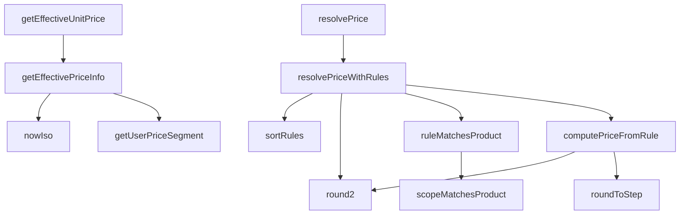

## Genel Bakış
Bu modül, ürün fiyatlarını kurallar (pricing rules) bazında çözümleyen bir fiyatlandırma servisidir. Kullanıcı segmentasyonu, fiyat kurallarının eşlenmesi ve sıralanması, kapsam (scope) kontrolleri ve efektif fiyat sorgulama gibi temel fiyatlandırma mantığını içerir. Supabase veritabanı üzerinden fiyat verilerine erişerek nihai net ve brüt fiyat hesaplamasını gerçekleştirir.

## Fonksiyon Grupları

### Fiyat Çözümleme (Ana Akış)
Ürün için geçerli fiyatı, tanımlı kurallar üzerinden adım adım çözümleyerek nihai net ve brüt fiyatı belirler. Bu grup modülün ana fiyatlandırma akışını oluşturur.
- resolvePrice, resolvePriceWithRules, computePriceFromRule

### Kural Eşleme ve Sıralama
Fiyat kurallarının belirli bir ürünle eşleşip eşleşmediğini kontrol eder, kapsam doğrulaması yapar ve kuralları öncelik sırasına göre sıralar. Kural tabanlı fiyat çözümlemesinin temel altyapısını sağlar.
- ruleMatchesProduct, scopeMatchesProduct, sortRules

### Efektif Fiyat Sorgulama
Veritabanından ürünün geçerli birim fiyatını veya kapsamlı fiyat bilgisini asenkron olarak sorgular. Dış sistemden fiyat verisi çekilmesi gerektiğinde kullanılır.
- getEffectiveUnitPrice, getEffectivePriceInfo

### Kullanıcı Segmentasyonu
Kullanıcının uygulama meta verilerine göre fiyat segmentini belirler. Farklı kullanıcı gruplarına farklı fiyatlandırma uygulanmasına olanak tanır.
- getUserPriceSegment

### Yuvarlama ve Zaman Yardımcıları
Fiyat hesaplamalarında kullanılan sayısal yuvarlama fonksiyonları ve ISO formatında zaman damgası üretimi gibi genel yardımcı araçları sunar.
- roundToStep, round2, nowIso

---

## AXIOMS – Mimari Varsayımlar

[Aksiyom 1]: Eğer `user` parametresi `null` veya `undefined` ise, `getUserPriceSegment` fonksiyonu yine bir `PriceSegment` değer döndürmelidir; aksi takdirde fiyat segmenti belirlenemeyen kullanıcılar fiyatlandırma sürecinden dışlanır.

[Aksiyom 2]: Eğer veritabanında ürün için etkin bir fiyat kaydı yoksa, `getEffectiveUnitPrice` `null` döndürür; bu durumda fiyat çözümleme akışı null fiyatı işleyebilmelidir.

[Aksiyom 3]: Eğer bir kuralın kapsamı (`ScopedTarget`) ürünle eşleşmiyorsa, `scopeMatchesProduct` `false` döner ve o kural ürün için fiyat hesaplamasına katılmaz.

[Aksiyom 4]: Eğer bir fiyat kuralı (`PricingRuleRow`) ürünle eşleşmiyorsa, `ruleMatchesProduct` `false` döner ve `resolvePriceWithRules` o kuralı değerlendirme dışı bırakır.

[Aksiyom 5]: Eğer `costInBase` (temel para biriminde maliyet) `null` ise, `computePriceFromRule` `null` döndürebilir; maliyet bilgisi olmadan kural bazlı fiyat hesaplaması yapılamayabilir.

[Aksiyom 6]: Eğer bir kuraldan fiyat hesaplanamıyorsa, `computePriceFromRule` `null` döner; `resolvePriceWithRules` bu durumda bir sonraki kurala geçebilmelidir.

[Aksiyom 7]: Eğer `priceBookId` `null` ise, `sortRules` fonksiyonu fiyat kitabı olmadan sıralama yapabilmelidir; fiyat kitabı bazlı önceliklendirme atlanır.

[Aksiyom 8]: Eğer `categoryAncestors` kümesi sağlanmazsa (boş küme), `scopeMatchesProduct` ve `ruleMatchesProduct` kategori bazlı kapsam eşleştirmesi yapamaz; yalnızca doğrudan kategori eşleşmesiyle çalışır.

[Aksiyom 9]: Eğer `supabase` istemcisi geçerli bir veritabanı bağlantısına sahip değilse, `resolvePrice`, `getEffectiveUnitPrice` ve `getEffectivePriceInfo` fonksiyonları çalışamaz; fiyat verisine erişilemez.

[Aksiyom 1

---

## FONKSİYON DETAYLARI

### getUserPriceSegment
**Ne yapar**: Kullanıcının fiyat segmentini JWT token içindeki `app_metadata.price_segment` alanından okur. W2 tek sözleşme kuralına göre profil rolü veya kullanıcı-düzenleyebilir metadata okunmaz (CLAUDE.md §12, INV-PRICE-2). Claim atanmamışsa güvenli varsayılan olarak `'individual'` döner; bayi/kurumsal ataması admin tarafından yapılır.

**Nasıl yapar**: `user` nesnesinin `app_metadata` altındaki `price_segment` alanını okur. Eğer değer `'dealer'` veya `'corporate'` ise bu değeri aynen döndürür; aksi halde (tanımsız, null veya başka bir değer ise) `'individual'` varsayılanını kullanır.

**Parametreler**:
- user: `{ app_metadata?: Record<string, unknown> } | null | undefined` — JWT'den gelen kullanıcı nesnesi. Null veya undefined olabilir (anonim kullanıcı durumunda).

**Dönüş**: `PriceSegment` — Kullanıcının fiyat segmenti değeri. `'dealer'`, `'corporate'` veya `'individual'` olabilir.

### nowIso
**Ne yapar**: Geliştirildi ancak detay üretilemedi.

### getEffectiveUnitPrice
**Ne yapar**: Geliştirildi ancak detay üretilemedi.

### getEffectivePriceInfo
**Ne yapar**: Geliştirildi ancak detay üretilemedi.

### roundToStep
**Ne yapar**: Geliştirildi ancak detay üretilemedi.

### round2
**Ne yapar**: Geliştirildi ancak detay üretilemedi.

### scopeMatchesProduct
**Ne yapar**: Geliştirildi ancak detay üretilemedi.

### ruleMatchesProduct
**Ne yapar**: Geliştirildi ancak detay üretilemedi.

### sortRules
**Ne yapar**: Geliştirildi ancak detay üretilemedi.

### computePriceFromRule
**Ne yapar**: Geliştirildi ancak detay üretilemedi.

### resolvePriceWithRules
**Ne yapar**: Fiyat çözümünün saf çekirdeğini oluşturur. Veritabanı erişimi yoktur; kural havuzu, kategori ata-kümesi ve gerekirse gösterim kuru, `inputs` parametresi aracılığıyla sağlanır. Kuralları belirli bir sıraya göre sıralar ve kazanan ilk hesaplanabilir kuralı uygular (stop-at-first-hit; `is_exclusive=false` yığılması bilinçli W1 kapsamındadır).
**Nasıl yapar**: Fonksiyon, girdi parametrelerinden bir `trace` günlüğü oluşturur. Ardından `inputs.rules` içindeki kuralları, fiyat kitabı, para birimi, miktar, geçerlilik tarih aralığı ve ürün-kategori eşleşmesi (yardımcı fonksiyon `ruleMatchesProduct` ile) gibi birden fazla filtreye tabi tutarak aday kuralları belirler. Aday yoksa "Teklif Alın" sonucu ile erken dönüş yapar. Adaylar varsa, `sortRules` fonksiyonu ile sıralanır ve döngüye alınır. Her kural için `computePriceFromRule` fonksiyonu ile hesaplama yapılır. İlk başarılı hesaplama sonucunda, eğer para birimi TRY değilse, `inputs.fxRate` kullanılarak gösterim çevirisi yapılır. Sonuçta hesaplanan fiyat bilgileri (net, gross, para birimi, KDV oranı, kural bilgileri) ve izleme günlüğü döndürülür.
**Parametreler**:
- product: PricingProductInput — Ürün bilgilerini (id, categoryId, costInBase vb.) içerir.
- context: PricingContext — Bağlam bilgilerini (quantity, currency, today, priceBookId) içerir. Eksik alanlar için varsayılan değerler atanır.
- inputs: RuleEvaluationInputs — Saf çekirdek için gerekli girdileri (rules: kural havuzu, categoryAncestors: kategori ata-kümesi, fxRate: gösterim kuru) içerir.
**Dönüş**: PriceResolution — `{ price: { net, gross, currency, vatRatePct, ruleId, ruleScope } | null, trace: string[] }` yapısında bir nesne. `price` null ise uygun kural bulunamamış veya hesaplama yapılamamış demektir; `trace` ise fonksiyonun çalışma adımlarını kaydeder.

### resolvePrice
**Ne yapar**: Deterministik fiyat çözümü için ince bir sarmalayıcı (wrapper) işlevi görür. Veritabanından gerekli verileri çeker ve saf çekirdek fonksiyon `resolvePriceWithRules`'a delege eder; hesaplama mantığı burada tekrarlanmaz.
**Nasıl yapar**: Fonksiyon asenkron olarak çalışır ve ilk parametre olarak bir SupabaseClient alır. Önce `pricing_rule` tablosundan tüm kuralları çeker. Hata olursa, çekirdek çağrılmadan erken çıkış yapar ve hata bilgisini `trace`'e ekler. Ardından, ürünün kategorisi varsa ve kurallar arasında `scope === 3` (kategorilere uygulanır) olan bir kural varsa, `categories` tablosundan kategori ata-zincirini (parent_id ilişkisini takip ederek) oluşturur. Son olarak, para birimi TRY değilse, `resolveFxRate` fonksiyonu ile gösterim kurunu çeker. Toplanan tüm verileri (kurallar, kategori ata-kümesi, kur) `inputs` nesnesinde birleştirerek `resolvePriceWithRules` fonksiyonunu çağırır ve sonucu döndürür.
**Parametreler**:
- supabase: SupabaseClient<Database> — Veritabanı bağlantısı ve sorguları için kullanılan istemci.
- product: PricingProductInput — Ürün bilgilerini (id, categoryId, costInBase vb.) içerir.
- context: PricingContext — Bağlam bilgilerini (quantity, currency, today, priceBookId) içerir. Varsayılan olarak boş bir nesnedir.
**Dönüş**: Promise<PriceResolution> — Asenkron bir işlem sonucunda, `resolvePriceWithRules` fonksiyonunun döndürdüğü `PriceResolution` nesnesini (fiyat ve izleme günlüğü) içeren bir Promise döner.

---

## İTHALATLAR (IMPORTS)
- import: ../../types/database.types::type { Database }
- import: ../../types/ui-models::type { Product }
- import: ./fxRate.service::resolveFxRate
- import: @supabase/supabase-js::type { SupabaseClient }

---

## INTERFACES

### OrganizationLight
- `id: string`
- `tier_level?: number | null`

### EffectivePriceInfo
Determines the most applicable pricing information for a product based on the current user's role. It queries active price lists sorted by effective dates and applies the best valid price or discount. W4b (T001-VH): ham `products.price` FALLBACK'İ KALDIRILDI. O kolon Kademe-2'de emekli edildi ve 374
- `unitPrice: number | null`
- `priceListId: string | null`
- `taxIncluded: boolean | null`

### PricingProductInput
- `id: string`
- `brandId?: string | null`
- `categoryId?: string | null`
- `costInBase?: number | null`

### PricingContext
- `priceBookId?: string | null`
- `quantity?: number`
- `currency?: string`
- `today?: string`

### ResolvedPrice
- `net: number`
- `gross: number`
- `currency: string`
- `vatRatePct: number`
- `ruleId: string`
- `ruleScope: number`

### PriceResolution
- `price: ResolvedPrice | null`
- `trace: string[]`

### ScopedTarget
Özgüllük merdiveninin HEDEF EŞLEŞMESİ — tek yer. `pricing_rule` (fiyat NASIL hesaplanır) ve `pricing_policy` (hangi AYAR geçerli) aynı merdiveni kullanır: scope 0 varyant · 1 ürün · 2 marka · 3 kategori · 4 global. Cetvel §8.3 bunu açıkça şart koşuyor: *"Merdiven §3.1 ile birebir aynıdır — ikinci bi
- `scope: number`
- `product_id: string | null`
- `brand_id: string | null`
- `category_id: string | null`

### RuleEvaluationInputs
resolvePriceWithRules'a girdi: dış-dünya (DB) sorgularının SONUCU — çağıran (resolvePrice veya materializePrices) verileri bir kez çeker, saf çekirdeğe verir. SAF: içeride DB erişimi / yan etki YOK, aynı girdi → aynı çıktı (test edilebilirlik + W3 toplu-hesap).
- `rules: PricingRuleRow[]`
- `categoryAncestors: ReadonlySet<string>`
- `fxRate: { rate: number; effectiveDate: string } | null`

---

## TYPE ALIASES

### PricingRuleRow
```typescript
type PricingRuleRow = Database['public']['Tables']['pricing_rule']['Row']
```

### UserRole
```typescript
type UserRole = 'individual' | 'dealer' | 'corporate' | 'admin'
```

### PriceSegment
```typescript
type PriceSegment = 'individual' | 'dealer' | 'corporate'
```

---

## AST POINTERS

### [N1_NASIL] AST Pointer: src/lib/services/pricing.service.ts::getUserPriceSegment
- **params**: `user` — `{ app_metadata?: Record<string, unknown> } | null | undefined` tipinde kullanıcı nesnesi
- **ic_degiskenler**:
  - `raw` — `user?.app_metadata?.price_segment` erişimiyle elde edilen ham fiyat segmenti değeri; `'dealer'`, `'corporate'` veya tanımsız olabilir
- **Dönüş**: `PriceSegment` — `raw` `'dealer'` veya `'corporate'` ise aynen döner, aksi halde `'individual'`

### [N2_NASIL] AST Pointer: src/lib/services/pricing.service.ts::nowIso
- **params**: (parametre yok)
- **ic_degiskenler**: (yok)
- **Dönüş**: `string` — `new Date().toISOString()` ile üretilen anlık UTC zaman damgası

### [N3_NASIL] AST Pointer: src/lib/services/pricing.service.ts::getEffectiveUnitPrice
- **params**:
  - `supabase` — `SupabaseClient<Database>` tipinde Supabase istemcisi
  - `product` — `Product` tipinde ürün nesnesi
- **ic_degiskenler**:
  - `info` — `getEffectivePriceInfo` çağrısından dönen `EffectivePriceInfo` nesnesi
- **Dönüş**: `Promise<number | null>` — `info.unitPrice` değeri; fiyat bulunamazsa `null`

### [N4_NASIL] AST Pointer: src/lib/services/pricing.service.ts::getEffectivePriceInfo
- **params**:
  - `supabase` — `SupabaseClient<Database>` tipinde Supabase istemcisi
  - `product` — `Product` tipinde ürün nesnesi
- **ic_degiskenler**:
  - `unpriced` — anonim fonksiyon; her çağrısında `{ unitPrice: null, priceListId: null, taxIncluded: null }` döndürür; paylaşılan referans mutasyonunu önlemek için taze nesne üretir
  - `authData` — `supabase.auth.getUser()` yanıtının `data` alanı; kullanıcı bilgisi
  - `userErr` — `supabase.auth.getUser()` yanıtının `error` alanı; kimlik doğrulama hatası
  - `user` — `userErr` varsa `null`, aksi halde `authData?.user`; kimliği doğrulanmış kullanıcı
  - `segment` — `getUserPriceSegment(user)` çağrısından dönen fiyat segmenti (`'individual'`, `'dealer'`, `'corporate'`)
  - `now` — `nowIso()` çağrısından dönen anlık ISO zaman damgası
  - `lists` — `price_lists` tablosundan çekilen aktif ve geçerli fiyat listesi satırları
  - `listErr` — `price_lists` sorgusunun `error` alanı
  - `typedLists` — `PriceListRow[]` tipine dönüştürülmüş fiyat listesi satırları
  - `matchedLists` — `typedLists` içinde `user_type` segmente eşleşen veya `user_type` boş olan (varsayılan) listeler
  - `sorted` — `matchedLists` sıralaması; önce spesifik `user_type` eşleşmesi, sonra `effective_from` tarihine göre azalan
  - `chosen` — `sorted` dizisinin ilk elemanı; en uygun fiyat listesi veya `null`
  - `priceListIds` — `chosen` varsa `[chosen.id]`, aksi halde boş dizi
  - `plId` — `priceListIds` döngüsündeki mevcut fiyat listesi ID'si
  - `query` — `product_prices` tablosu sorgusu; `product_id`, `is_active`, `currency='TRY'` ve `price_list_id` filtreleri uygulanır
  - `rows` — `product_prices` sorgusundan dönen fiyat satırları
  - `prErr` — `product_prices` sorgusunun `error` alanı
  - `pick` — `rows` içinde geçerlilik tarih aralığında olan satır; bulunamazsa `rows[0]`
  - `derivedNet` — `pick.net_price` değeri sayıya dönüştürülmüş; `null` ise fiyat yok
  - `derivedGross` — `pick.gross_price` değeri sayıya dönüştürülmüş; `null` ise fiyat yok
  - `derived` — segment `'individual'` ise `derivedGross ?? derivedNet`, aksi halde `derivedNet ?? derivedGross`; kullanılacak fiyat
  - `usedGross` — segment `'individual'` ise `derivedGross != null`, aksi halde `derivedNet == null`; KDV dahil mi bilgisi
  - `base` — `pick.base_price` değeri sayıya dönüştürülmüş; temel fiyat
  - `sale` — `pick.sale_price` değeri sayıya dönüştürülmüş; indirimli fiyat veya `null`
  - `disc` — `pick.discount_percentage` değeri sayıya dönüştürülmüş; indirim yüzdesi
  - `val` — `base * (1 - disc / 100)` hesaplaması; indirim uygulanmış fiyat
- **Dönüş**: `Promise<EffectivePriceInfo>` — `{ unitPrice, priceListId, taxIncluded }` nesnesi; fiyat bulunamazsa `unpriced()` dönüşü

### [N5_NASIL] AST Pointer: src/lib/services/pricing.service.ts::roundToStep
- **params**:
  - `value` — `number` tipinde yuvarlanacak değer
  - `step` — `number` tipinde yuvarlama adımı
- **ic_degiskenler**: (yok)
- **Dönüş**: `number` — `step` sonlu ve pozitifse `Math.round(value / step) * step` sonucu 6 ondalık basamağa yuvarlanmış; aksi halde `value` aynen döner

### [N6_NASIL] AST Pointer: src/lib/services/pricing.service.ts::round2
- **params**:
  - `value` — `number` tipinde yuvarlanacak değer
- **ic_degiskenler**: (yok)
- **Dönüş**: `number` — `value.toFixed(2)` ile 2 ondalık basamağa yuvarlanmış değer

### [N7_NASIL] AST Pointer: src/lib/services/pricing.service.ts::scopeMatchesProduct
- **params**:
  - `row` — `ScopedTarget` tipinde kapsam hedefi nesnesi (`scope`, `product_id`, `brand_id`, `category_id` alanları)
  - `product` — `PricingProductInput` tipinde ürün nesnesi (`id`, `brandId` alanları)
  - `categoryAncestors` — `ReadonlySet<string>` tipinde ürünün kategori ata zinciri
- **ic_degiskenler**: (yok)
- **Dönüş**: `boolean` — `row.scope` değerine göre: 0 veya 1 ise `row.product_id === product.id`; 2 ise `row.brand_id` tanımlı ve `product.brandId`'ye eşit; 3 ise `row.category_id` tanımlı ve `categoryAncestors` içinde; 4 ise her zaman `true`; diğer durumlarda `false`

### [N8_NASIL] AST Pointer: src/lib/services/pricing.service.ts::ruleMatchesProduct
- **params**:
  - `rule` — `PricingRuleRow` tipinde fiyatlandırma kuralı satırı
  - `product` — `PricingProductInput` tipinde ürün nesnesi
  - `categoryAncestors` — `ReadonlySet<string>` tipinde ürünün kategori ata zinciri
- **ic_degiskenler**: (yok)
- **Dönüş**: `boolean` — `scopeMatchesProduct(rule, product, categoryAncestors)` çağrısının dönüşü

### [N9_NASIL] AST Pointer: src/lib/services/pricing.service.ts::sortRules
- **params**:
  - `rules` — `PricingRuleRow[]` tipinde fiyatlandırma kuralları dizisi
  - `priceBookId` — `string | null` tipinde aktif fiyat kitabı ID'si
- **ic_degiskenler**:
  - `bookRank` — anonim fonksiyon; `r.price_book_id === priceBookId` ve `priceBookId !== null` ise 0, aksi halde 1 döner; fiyat kitabı öncelik sıralaması
- **Dönüş**: `PricingRuleRow[]` — sıralanmış kural dizisi kopyası; sıralama kriterleri: `scope` artan, `bookRank` artan, `min_quantity` azalan, `priority` azalan, `id` azalan (localeCompare)

### [N10_NASIL] AST Pointer: src/lib/services/pricing.service.ts::computePriceFromRule
- **params**:
  - `rule` — `PricingRuleRow` tipinde fiyatlandırma kuralı satırı
  - `costInBase` — `number | null` tipinde temel para biriminde maliyet
  - `trace` — `string[]` tipinde izleme günlüğü dizisi (yerinde değiştirilir)
- **ic_degiskenler**:
  - `p` — hesaplanmış ham fiyat; `method === 'cost_plus'` ise `costInBase * (1 + rule.margin_pct / 100)`, `method === 'fixed'` ise `rule.fixed_price`; ardından `rule.surcharge` eklenir
  - `margin` — `p - costInBase`; marj kelepçesi hesaplamasında kullanılır
  - `vatFactor` — `1 + rule.vat_rate_pct / 100`; KDV çarpanı
  - `net` — KDV hariç fiyat; `method === 'fixed'` ve `price_is_vat_inclusive` ise `p / vatFactor`, aksi halde `p`; `round_to` ile yuvarlanmış
  - `gross` — KDV dahil fiyat; `round2(net * vatFactor)`; `charm_ending` uygulanmışsa son basamağı değiştirilmiş
  - `charmed` — `Math.floor(gross) + rule.charm_ending`; çekici fiyat sonucu
- **Dönüş**: `{ net: number; gross: number } | null` — hesaplanmış net ve gross fiyatlar; `method` tanınmıyorsa, `cost_plus` için maliyet/marj eksikse, `fixed` için `fixed_price` null ise, veya `net` sonlu değil/pozitif değilse `null`

### [N11_NASIL] AST Pointer: src/lib/services/pricing.service.ts::resolvePriceWithRules
- **params**:
  - `product` — `PricingProductInput` tipinde ürün nesnesi (`id`, `costInBase`, `categoryId` alanları)
  - `context` — `PricingContext` tipinde fiyatlandırma bağlamı (`quantity`, `currency`, `today`, `priceBookId` alanları)
  - `inputs` — `RuleEvaluationInputs` tipinde kural değerlendirme girdileri (`rules`, `categoryAncestors`, `fxRate` alanları)
- **ic_degiskenler**:
  - `trace` — `string[]` tipinde izleme günlüğü dizisi; fonksiyon boyunca bilgi notları eklenir
  - `qty` — `context.quantity ?? 1`; sipariş adedi
  - `currency` — `(context.currency ?? 'TRY').toUpperCase()`; para birimi
  - `today` — `context.today ?? new Date().toISOString().slice(0, 10)`; geçerlilik tarihi
  - `priceBookId` — `context.priceBookId ?? null`; aktif fiyat kitabı ID'si
  - `cost` — `product.costInBase ?? null`; ürünün temel para biriminde maliyeti
  - `allRules` — `inputs.rules`; tüm fiyatlandırma kuralları
  - `candidates` — `allRules` filtresi; `price_book_id`, `currency`, `min_quantity`, `valid_from`, `valid_to` koşullarını ve `ruleMatchesProduct` eşleşmesini sağlayan kurallar
  - `rule` — `sortRules(candidates, priceBookId)` döngüsündeki mevcut kural
  - `computed` — `computePriceFromRule(rule, cost, trace)` çağrısından dönen `{ net, gross }` veya `null`
  - `net` — hesaplanmış KDV hariç fiyat; para birimi TRY değilse `fx.rate` ile bölünmüş
  - `gross` — hesaplanmış KDV dahil fiyat; para birimi TRY değilse `fx.rate` ile bölünmüş
  - `fx` — `inputs.fxRate`; döviz kuru bilgisi (`rate`, `effectiveDate` alanları)
- **Dönüş**: `PriceResolution` — `{ price, trace }` nesnesi; `price` null ise "Teklif Alın" durumu, aksi halde `{ net, gross, currency, vatRatePct, ruleId, ruleScope }` içerir

### [N12_NASIL] AST Pointer: src/lib/services/pricing.service.ts::resolvePrice
- **params**:
  - `supabase` — `SupabaseClient<Database>` tipinde Supabase istemcisi
  - `product` — `PricingProductInput` tipinde ürün nesnesi (`id`, `costInBase`, `categoryId` alanları)
  - `context` — `PricingContext` tipinde fiyatlandırma bağlamı; varsayılanı boş nesne `{}`
- **ic_degiskenler**:
  - `qty` — `context.quantity ?? 1`; sipariş adedi
  - `currency` — `(context.currency ?? 'TRY').toUpperCase()`; para birimi
  - `today` — `context.today ?? new Date().toISOString().slice(0, 10)`; geçerlilik tarihi
  - `priceBookId` — `context.priceBookId ?? null`; aktif fiyat kitabı ID'si
  - `cost` — `product.costInBase ?? null`; ürünün temel para biriminde maliyeti
  - `ruleRows` — `pricing_rule` tablosundan çekilen tüm kural satırları
  - `rulesError` — `pricing_rule` sorgusunun `error` alanı
  - `allRules` — `(ruleRows ?? []) as PricingRuleRow[]`; tip dönüşümü yapılmış kural dizisi
  - `categoryAncestors` — `Set<string>` tipinde ürünün kategori ata zinciri; `scope === 3` kuralı varsa ve `product.categoryId` tanımlıysa doldurulur
  - `cats` — `categories` tablosundan çekilen `{ id, parent_id }` satırları
  - `parentOf` — `Map<string, string | null>`; kategori ID'sinden üst kategori ID'sine eşleme
  - `cursor` — kategori ata zinciri takibinde mevcut kategori ID'si; `parentOf.get()` ile ilerler
  - `depth` — ata zinciri takibinde derinlik sayacı; 10 ile sınırlandırılmış
  - `fxRate` — `RuleEvaluationInputs['fxRate']` tipinde döviz kuru; `currency === 'TRY'` ise `null`, aksi halde `resolveFxRate(supabase, currency, today)` çağrısından dönen değer
- **Dönüş**: `Promise<PriceResolution>` — `resolvePriceWithRules(product, context, { rules: allRules, categoryAncestors, fxRate })` çağrısının dönüşü; `rulesError` varsa erken çıkış ile `{ price: null, trace }` döner

---


## MERMAID CALL GRAPH


## NODE ID STANDARD

  file: pricing.service.ts
  function: pricing.service.ts::getUserPriceSegment
  function: pricing.service.ts::nowIso
  function: pricing.service.ts::getEffectiveUnitPrice
  function: pricing.service.ts::getEffectivePriceInfo
  function: pricing.service.ts::roundToStep
  function: pricing.service.ts::round2
  function: pricing.service.ts::scopeMatchesProduct
  function: pricing.service.ts::ruleMatchesProduct
  function: pricing.service.ts::sortRules
  function: pricing.service.ts::computePriceFromRule
  function: pricing.service.ts::resolvePriceWithRules
  function: pricing.service.ts::resolvePrice

---

## DISA AKTARILANLAR (EXPORTS)
  export: EffectivePriceInfo
  export: OrganizationLight
  export: PriceResolution
  export: PriceSegment
  export: PricingContext
  export: PricingProductInput
  export: PricingRuleRow
  export: ResolvedPrice
  export: RuleEvaluationInputs
  export: ScopedTarget
  export: UserRole
  export: computePriceFromRule
  export: getEffectivePriceInfo
  export: getEffectiveUnitPrice
  export: getUserPriceSegment
  export: nowIso
  export: resolvePrice
  export: resolvePriceWithRules
  export: round2
  export: roundToStep
  export: ruleMatchesProduct
  export: scopeMatchesProduct
  export: sortRules