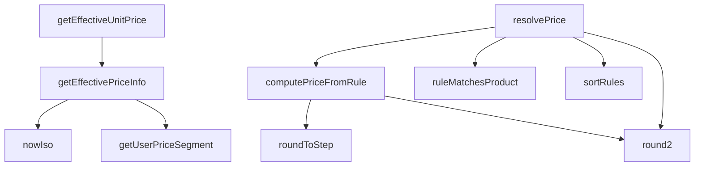

## Genel Bakış
VentHub HVAC platformunda merkezi fiyatlandırma hizmetini yöneten modüldür. Ürünler için veritabanından güncel fiyat bilgilerini çekerken, kullanıcı segmentasyonuna göre esnek fiyatlandırma politikalarını uygular. Modül, fiyat kurallarını eşleştirme, sıralama ve hesaplama süreçlerini orkestra ederek tutarlı fiyat çözümlemesi sunar.

## Fonksiyon Grupları
### Yardımcı Fonksiyonlar
Fiyatlandırma süreçlerinde kullanılan temel destek işlemlerini içerir: zaman damgası üretimi, sayı yuvarlama ve kullanıcı fiyat segmenti belirleme.
- getUserPriceSegment, nowIso, roundToStep, round2

### Fiyat Bilgisi Hesaplama Fonksiyonları
Ürünler için veritabanından güncel ve geçerli fiyat bilgisini çeken asenkron fonksiyonlardır. Dinamik olarak Supabase bağlantısı üzerinden fiyat kitaplığı ve kuralları yükler.
- getEffectiveUnitPrice, getEffectivePriceInfo

### Kural Tabanlı Fiyat Hesaplama Fonksiyonları
Fiyatlandırma kurallarını ürünlere eşleştiren, öncelik sırasına göre düzenleyen ve bu kurallara göre net/fiyat hesaplayan mantıksal bileşenlerdir.
- ruleMatchesProduct, sortRules, computePriceFromRule

### Ana Fiyat Çözümleme Fonksiyonu
Tüm fiyatlandırma mantığını ve bağımlılıkları bir araya getiren ana orkestratör fonksiyondur. Kullanıcı segmentinden başlayarak kural eşleştirme ve fiyat hesaplama süreçlerini yönetir.
- resolvePrice

---

## AXIOMS – Mimari Varsayımlar

Bu modül, veritabanı bağlantısı ve fiyatlandırma kuralları üzerinden ürün fiyat hesaplaması yapan bir servistir. Aşağıda fonksiyon imzalarından türetilen mimari varsayımlar yer almaktadır.

**[Aksiyom 1]:** Eğer `supabase` istemcisi geçerli bir veritabanı bağlantısı içermiyorsa, `getEffectiveUnitPrice`, `getEffectivePriceInfo` ve `resolvePrice` fonksiyonları fiyat bilgisi çekemez ve hata/fail durumu oluşur.

**[Aksiyom 2]:** Eğer `roundToStep` fonksiyonuna truyềnilen `step` parametresi `0` ise, sıfıra bölme hatası oluşur. (`step > 0` olmalıdır.)

**[Aksiyom 3]:** Eğer `getUserPriceSegment` fonksiyonuna geçirilen `user` parametresi `null` veya `undefined` ise, fonksiyon varsayılan bir `PriceSegment` değeri döndürmelidir; aksi halde kullanıcı segmenti belirlenemez ve fiyatlandırma kuralı eşleşmesi başarısız olur.

**[Aksiyom 4]:** Eğer `resolvePrice` fonksiyonuna geçirilen `PricingContext` içinde geçerli fiyatlandırma kuralları (`PricingRuleRow[]`) bulunmuyorsa, ürün için hiçbir kural eşleşemez ve fiyat çözümü başarısız olur (`PriceResolution` geçersiz/hatalı döner).

**[Aksiyom 5]:** Eğer `computePriceFromRule` fonksiyonuna geçirilen `rule` nesnesinde `costInBase` alanına karşılık gelen maliyet bilgisi `null` ise ve kural hesaplama mantığı maliyet tabanlıysa, fonksiyon `null` döner (hesaplama yapılamaz).

**[Aksiyom 6]:** Eğer `sortRules` fonksiyonuna geçirilen `priceBookId` parametresi `null` ise, sıralama yalnızca genel kurallar (fiyat listesi bağımsız) üzerinden yapılabilir; fiyat listesine özel kurallar sıralamaya dahil edilmez.

**[Aksiyom 7]:** Eğer `ruleMatchesProduct` fonksiyonuna geçirilen `categoryAncestors` seti, ürünün kategori hiyerarşisini içermiyorsa, kategori bazlı fiyatlandırma kuralları yanlış eşleşir veya hiç eşleşmez.

---

## FONKSİYON DETAYLARI

### getUserPriceSegment

**Ne yapar**: Kullanıcının JWT tokenındaki `app_metadata.price_segment` alanını okuyarak fiyat segmentini (individual, dealer veya corporate) belirler. Profil rolü veya kullanıcı tarafından düzenlenebilir metadata kesinlikle okunmaz; sadece JWT claim'i kaynağı olarak kullanılır.

**Nasıl yapar**: `user.app_metadata.price_segment` değerini ham olarak okur. Değer `'dealer'` veya `'corporate'` ise doğrudan döndürür. Herhangi bir其他 durumda (değer yok, tanımsız, farklı bir string) güvenli varsayılan olan `'individual'` döner. Bayi ve kurumsal atamaları yalnızca admin tarafından yapılır.

**Parametreler**:
- `user`: `{ app_metadata?: Record<string, unknown> } | null | undefined` — Kimlik doğrulanmış kullanıcı nesnesi; JWT payload'ındaki `app_metadata` alanını içerir. Anonim kullanıcılar için `null` veya `undefined` olabilir.

**Dönüş**: `PriceSegment` — Kullanıcının fiyat segmenti. Geçerli değerler: `'individual'`, `'dealer'`, `'corporate'`. Tanımsız veya eksikse `'individual'` döner.

### nowIso
**Ne yapar**: Geçerli tarih ve saati ISO 8601 formatında bir字符串 olarak döndürür.
**Nasıl yapar**: `new Date()` nesnesi oluşturarak `toISOString()` metodunu çağırır ve mevcut zamanı standart bir string formatında döndürür. Bu, Supabase sorgularında tarih bazlı filtreleme için zaman damgası olarak kullanılır.
**Parametreler**:
- Bu fonksiyon herhangi bir parametre almaz.
**Dönüş**: `string` — Geçerli tarih ve saatin ISO 8601 formatında temsili.

### getEffectiveUnitPrice
**Ne yapar**: Belirli bir ürün için geçerli olan birim fiyatı döndürür. Bu fonksiyon, karmaşık fiyatlandırma mantığını basitleştirerek doğrudan sonuçsal birim fiyat değerini elde etmek için kullanılır.

**Nasıl yapar**: Fonksiyon, daha kapsamlı olan `getEffectivePriceInfo` fonksiyonunu çağırır ve returned objenin içindeki `unitPrice` alanını alarak sonuç olarak number tipinde bir değer döndürür. Bu, üst düzey işlemler için sade ve kullanışlı bir arayüz sağlar.

**Parametreler**:
- `supabase`: SupabaseClient<Database> — Aktif Supabase istemcisi örneği, veritabanı ve kimlik doğrulama işlemleri için kullanılır.
- `product`: Product — Temel fiyat bilgilerini içeren ürün nesnesi, fiyat hesaplamasının temelini oluşturur.

**Dönüş**: Promise<number> — Hesaplanan etkili birim fiyat (number).

### getEffectivePriceInfo
**Ne yapar**: Bir ürün için en uygun fiyatlandırma bilgisini, mevcut kullanıcının rolü, geçerli fiyat listeleri ve uygulanabilir indirimler temelinde belirler. Bu ana mantık fonksiyonu, fiyat kararını vermek için birden fazla veri kaynağını sorgular ve bir dizi kurallar bütünü uygular.

**Nasıl yapar**: Fonksiyon首先 kullanıcının oturumunu doğrular ve profilini (rol ve kuruluş bilgisi) çeker. Sonra, mevcut tarih itibarıyla aktif ve geçerli fiyat listelerini sorgular. Bu listeleri kullanıcının rolüne göre filtreler ve belirli bir sıralama mantığıyla (spesifik rol eşleşmesi tercih edilir) en uygun listeyi seçer. Ardından, seçilen fiyat listesinde (varsa) ürünün fiyat kayıtlarını arar; burada satış fiyatı, temel fiyat ve indirim yüzdesi gibi faktörleri değerlendirerek geçerli bir fiyat hesaplar. Hiçbir fiyat listesi eşleşmesi veya geçerli kayıt bulunamazsa, ürün nesnesindeki temel fiyata (fallback) geri döner. Tüm işlemler sırasında hata oluşursa güvenli bir şekilde fallback değerini döndürür.

**Parametreler**:
- `supabase`: SupabaseClient<Database> — Aktif Supabase istemcisi örneği, veritabanı sorguları ve kullanıcı oturumu yönetimi için gereklidir.
- `product`: Product — Fiyatı belirlenecek olan ürün nesnesi. Ürünün `id` ve `price` alanları gibi temel özelliklerini içerir.

**Dönüş**: Promise<{ unitPrice: number, priceListId: string | null }> — Hesaplanan birim fiyatı ve uygulanan fiyat listesinin ID'si (varsa,否则 null) içeren bir nesne.

### roundToStep

**Ne yapar**: Bir sayısal değeri belirli bir adıma (step) en yakın yuvarlak değere getirir. Fiyatlandırma kurallarında kuruş, lira veya özel aralıklara yuvarlama işlemini gerçekleştirir.

**Nasıl yapar**: Adım değerinin geçerli ve pozitif olup olmadığını kontrol eder; geçersizse değeri olduğu gibi döndürür. Geçerliyse değeri adıma böler, yuvarlar, tekrar adım ile çarpar ve 6 ondalık basamağa kadar hassasiyetle düzeltir. Bu sayede floating-point hassasiyet sorunlarından kaynaklanan kuruş hataları önlenir.

**Parametreler**:
- value: number — Yuvarlanacak sayısal değer
- step: number — Yuvarlama adım aralığı (örn. 0.01 kuruş, 0.50 yarımlık, 1 tam lira)

**Dönüş**: number — Adım aralığına en yakın yuvarlanmış değer

### round2
**Ne yapar**: Geliştirildi ancak detay üretilemedi.

### ruleMatchesProduct
**Ne yapar**: Geliştirildi ancak detay üretilemedi.

### sortRules
**Ne yapar**: Geliştirildi ancak detay üretilemedi.

### computePriceFromRule
**Ne yapar**: Geliştirildi ancak detay üretilemedi.

### resolvePrice
**Ne yapar**: Geliştirildi ancak detay üretilemedi.

---

## İTHALATLAR (IMPORTS)
- import: ../../types/database.types::type { Database }
- import: ../../types/ui-models::type { Product }
- import: @supabase/supabase-js::type { SupabaseClient }

---

## INTERFACES

### OrganizationLight
- `id: string`
- `tier_level?: number | null`

### EffectivePriceInfo
Determines the most applicable pricing information for a product based on the current user's role. It queries active price lists sorted by effective dates and applies the best valid price or discount. If no matching price list is found or an error occurs, it returns a fallback based on the product's
- `unitPrice: number`
- `priceListId: string | null`
- `taxIncluded: boolean | null`

### PricingProductInput
- `id: string`
- `brandId?: string | null`
- `categoryId?: string | null`
- `costInBase?: number | null`

### PricingContext
- `priceBookId?: string | null`
- `quantity?: number`
- `currency?: string`
- `today?: string`

### ResolvedPrice
- `net: number`
- `gross: number`
- `currency: string`
- `vatRatePct: number`
- `ruleId: string`
- `ruleScope: number`

### PriceResolution
- `price: ResolvedPrice | null`
- `trace: string[]`

---

## TYPE ALIASES

### PricingRuleRow
```typescript
type PricingRuleRow = Database['public']['Tables']['pricing_rule']['Row']
```

### UserRole
```typescript
type UserRole = 'individual' | 'dealer' | 'corporate' | 'admin'
```

### PriceSegment
```typescript
type PriceSegment = 'individual' | 'dealer' | 'corporate'
```

---

## AST POINTERS

### [N1_NASIL] AST Pointer: src/lib/services/pricing.service.ts::getUserPriceSegment
- **params**: `user` — Kullanıcı objesi (app_metadata.price_segment alanı okunur) veya null/undefined
- **ic_degiskenler**:
  - `raw` — user.app_metadata.price_segment değerinden alınan ham string; 'dealer'/'corporate' değilse 'individual' döner
- **Dönüş**: `PriceSegment` — 'dealer', 'corporate' veya 'individual'

### [N2_NASIL] AST Pointer: src/lib/services/pricing.service.ts::nowIso
- **params**: (yok)
- **ic_degiskenler**: (yok)
- **Dönüş**: `string` — ISO formatında güncel tarih-zaman

### [N3_NASIL] AST Pointer: src/lib/services/pricing.service.ts::getEffectiveUnitPrice
- **params**: `supabase` — Supabase istemcisi, `product` — fiyat bilgisi içeren ürün nesnesi
- **ic_degiskenler**:
  - `info` — getEffectivePriceInfo çağırılarak elde edilen etkili fiyat bilgisi objesi
- **Dönüş**: `number` — info.unitPrice değeri

### [N4_NASIL] AST Pointer: src/lib/services/pricing.service.ts::getEffectivePriceInfo
- **params**: `supabase` — Supabase istemcisi, `product` — fiyat bilgisi içeren ürün nesnesi
- **ic_degiskenler**:
  - `fallback` — product.price'dan türetilen yedek fiyat (sayı değilse parseFloat ile çevrilir, finite değilse 0)
  - `authData` — supabase.auth.getUser() sonucu (kullanıcı oturum bilgisi)
  - `userErr` — auth.getUser() hata objesi; hata varsa user null olur
  - `user` — auth edilmiş kullanıcı nesnesi; hata varsa null
  - `segment` — getUserPriceSegment ile elde edilen fiyat segmenti ('dealer'/'corporate'/'individual')
  - `now` — şu anki ISO tarih stringi (price_list filtresi için)
  - `lists` — price_lists tablosundan aktif ve geçerli tarih aralığındaki satırlar
  - `listErr` — price_list sorgusu hata objesi
  - `typedLists` — lists dizisinin PriceListRow[] olarak tip genişletmesi
  - `matchedLists` — segment'e uyan veya user_type'ı null olan (varsayılan) price listeleri
  - `sorted` — matchedLists'in sıralanmış hali (belirli user_type eşleşmesi öncelikli, tarih azalan)
  - `chosen` — sorted[0] ise en uygun price list, yoksa null
  - `priceListIds` — denenecek price_list ID'leri dizisi (chosen varsa [chosen.id, null], yoksa [null])
  - `query` — product_prices tablosuna yönelik Supabase sorgu zinciri
  - `rows` — product_prices tablosundan dönen satırlar
  - `prErr` — product_prices sorgusu hata objesi
  - `pick` — geçerli tarih aralığındaki ilk ürün fiyatı satırı veya rows[0]
  - `cacheRow` — pick'in net_price/gross_price alanlarını da içeren genişletilmiş versiyonu
  - `derivedNet` — cacheRow.net_price'dan türetilen net fiyat (null olabilir)
  - `derivedGross` — cacheRow.gross_price'dan türetilen gross fiyat (null olabilir)
  - `derived` — segment'e göre gross veya net tercih edilerek elde edilen türetilmiş fiyat
  - `usedGross` — KDV-dahil (gross) kullanılıp kullanılmadığını belirten bayrak
  - `base` — pick.base_price değeri (sayıya çevrilir)
  - `sale` — pick.sale_price değeri (null olabilir)
  - `disc` — pick.discount_percentage değeri (yüzde olarak)
  - `val` — base_price'dan indirim uygulanmış hesaplanan değer
- **Dönüş**: `{ unitPrice: number; priceListId: string | null; taxIncluded: boolean | null }` — etkili birim fiyat, kullanılan price_list ID'si ve KDV dahil mi bilgisi

### [N5_NASIL] AST Pointer: src/lib/services/pricing.service.ts::roundToStep
- **params**: `value` — yuvarlanacak sayı, `step` — yuvarlama adım aralığı
- **ic_degiskenler**: (yok)
- **Dönüş**: `number` — step aralığına yuvarlanmış değer (step geçersizse value aynen döner)

### [N6_NASIL] AST Pointer: src/lib/services/pricing.service.ts::round2
- **params**: `value` — yuvarlanacak sayı
- **ic_degiskenler**: (yok)
- **Dönüş**: `number` — iki ondalık basamağa yuvarlanmış değer

### [N7_NASIL] AST Pointer: src/lib/services/pricing.service.ts::ruleMatchesProduct
- **params**: `rule` — PricingRuleRow (fiyat kuralı satırı), `product` — PricingProductInput (ürün girdisi), `categoryAncestors` — ReadonlySet<string> (kategori atası ID'leri kümesi, scope=3 için)
- **ic_degiskenler**: (yok)
- **Dönüş**: `boolean` — kuralın ürüne uyup uymadığı (scope: 0/1=product_id eşleşme, 2=brand_id eşleşme, 3=category_id kümede varsa eşleşme, 4=her zaman eşleşme)

### [N8_NASIL] AST Pointer: src/lib/services/pricing.service.ts::sortRules
- **params**: `rules` — PricingRuleRow[] (sıralanacak kurallar dizisi), `priceBookId` — string | null (aktif fiyat kitabı ID'si)
- **ic_degiskenler**:
  - `bookRank` — inner fonksiyon; kuralın price_book_id'sinin priceBookId ile eşleşip eşleşmediğine göre 0 veya 1 döner (eşleşen kitap öncelikli)
- **Dönüş**: `PricingRuleRow[]` — sıralanmış kurallar (scope artan, kitap eşleşmesi öncelikli, min_quantity azalan, priority azalan, id azalan)

### [N9_NASIL] AST Pointer: src/lib/services/pricing.service.ts::computePriceFromRule
- **params**: `rule` — PricingRuleRow (hesaplama yapılacak kural), `costInBase` — number | null (ürünün maliyeti, taban para biriminde), `trace` — string[] (hata/ayıklama izi dizisi, yan etkisi var)
- **ic_degiskenler**:
  - `p` — hesaplanan brut fiyat (cost_plus veya fixed yöntemine göre, surcharge eklenmiş hali)
  - `margin` — p ile costInBase arasındaki mutlak marj tutarı
  - `vatFactor` — KDV çarpanı (1 + vat_rate_pct/100)
  - `net` — KDV hariç net fiyat (fixed kural KDV-dahil girildiyse KDV indirgenir, roundToStep ile yuvarlanır)
  - `gross` — KDV dahil brüt fiyat (net * vatFactor, round2 ile yuvarlanır)
  - `charmed` — charm uygulanmış gross fiyat (ondalık kısmı rule.charm_ending ile değiştirilir)
- **Dönüş**: `{ net: number; gross: number } | null` — hesaplanan net ve gross fiyatlar veya kural uygulanamıyorsa null

### [N10_NASIL] AST Pointer: src/lib/services/pricing.service.ts::resolvePrice
- **params**: `supabase` — Supabase istemcisi, `product` — PricingProductInput (ürün girdisi), `context` — PricingContext (opsiyonel: quantity, currency, today, priceBookId)
- **ic_degiskenler**:
  - `trace` — string[] (ayıklama izi; fonksiyon boyunca push edilir, yan etkili)
  - `qty` — context.quantity'den gelen adet miktarı (yoksa 1)
  - `currency` — context.currency'den gelen para birimi (yoksa 'TRY'), uppercase'e çevrilir
  - `today` — context.today'den gelen tarih stringi (yoksa ISO tarih_today)
  - `priceBookId` — context.priceBookId'den gelen fiyat kitabı ID'si (yoksa null)
  - `cost` — product.costInBase değerinden gelen maliyet (yoksa null)
  - `ruleRows` — pricing_rule tablosundan çekilen tüm satırlar
  - `rulesError` — pricing_rule sorgusu hata objesi
  - `allRules` — ruleRows dizisinin PricingRuleRow[] olarak tip genişletmesi
  - `categoryAncestors` — Set<string> (scope=3 kuralları varsa ürünün kategori atası zinciri)
  - `parentOf` — Map<string, string | null> (categories tablosundan id→parent_id eşlemesi)
  - `cursor` — kategori atası zincirinde gezinirken mevcut parent_id
  - `depth` — kategori zinciri derinlik sayacı (maksimum 10)
  - `candidates` — tüm filtrelerden (price_book_id, currency, min_quantity, tarih aralığı, product match) geçen kurallar
  - `rule` — sortRules ile sıralanmış aday kurallar üzerindeki döngü değişkeni
  - `computed` — computePriceFromRule sonucu (net+gross veya null)
  - `net` — kazanan kuraldan gelen net fiyat (currency çevirisi uygulanabilir)
  - `gross` — kazanan kuraldan gelen gross fiyat (currency çevirisi uygulanabilir)
  - `rates` — currency_rates tablosundan en güncel döviz kuru satırı
  - `rate` — rates[0].rate değerinden türetilen döviz kuru (sayı)
- **Dönüş**: `Promise<PriceResolution>` — `{ price: { net, gross, currency, vatRatePct, ruleId, ruleScope } | null; trace: string[] }` — hesaplanan fiyat objesi (yoksa null) ve ayıklama izi

---


## MERMAID CALL GRAPH


## NODE ID STANDARD

  file: src\lib\services\pricing.service.ts
  function: src\lib\services\pricing.service.ts::getUserPriceSegment
  function: src\lib\services\pricing.service.ts::nowIso
  function: src\lib\services\pricing.service.ts::getEffectiveUnitPrice
  function: src\lib\services\pricing.service.ts::getEffectivePriceInfo
  function: src\lib\services\pricing.service.ts::roundToStep
  function: src\lib\services\pricing.service.ts::round2
  function: src\lib\services\pricing.service.ts::ruleMatchesProduct
  function: src\lib\services\pricing.service.ts::sortRules
  function: src\lib\services\pricing.service.ts::computePriceFromRule
  function: src\lib\services\pricing.service.ts::resolvePrice

---

## DISA AKTARILANLAR (EXPORTS)
  export: EffectivePriceInfo
  export: OrganizationLight
  export: PriceResolution
  export: PriceSegment
  export: PricingContext
  export: PricingProductInput
  export: PricingRuleRow
  export: ResolvedPrice
  export: UserRole
  export: computePriceFromRule
  export: getEffectivePriceInfo
  export: getEffectiveUnitPrice
  export: getUserPriceSegment
  export: nowIso
  export: resolvePrice
  export: round2
  export: roundToStep
  export: ruleMatchesProduct
  export: sortRules