## Genel Bakış
Bu modül, fiyatlandırma politikalarının merkezi yönetim noktasıdır. Fiyatlandırma kurallarının veritabanındaki yaşam döngüsünü (CRUD) yönetir ve bu kuralların uygulanacağı ürüncope'sunu belirlemek için gerekli olan marka, kategori ve ürün verilerini hazırlar. Modül, veritabanı bağımlılığı (SupabaseClient) üzerinden çalışır ve iş mantığını veri erişiminden ayırır.

## Fonksiyon Grupları
### Fiyatlandırma Kuralları Yönetimi
Bu grup, fiyatlandırma politikalarının temel kayıt silme, ekleme ve güncelleme işlemlerini yönetir.
- `listPricingRules`, `createPricingRule`, `updatePricingRule`, `deletePricingRule`, `deletePricingRules`

### Ürün Kapsamı ve Filtreleme Mantığı
Fiyatlandırma kurallarının hangi ürünleri kapsadığını belirler; marka ve kategori gibi varlıkları kullanarak aktif ürün listelerini filtreler, sayar ve örnekler.
- `loadBrandIdByName`, `brandNameById`, `categoryIdsWithDescendants`, `resolveScopeFilter`, `withScopeFilter`, `activeProductsQuery`, `countProductsInScope`, `sampleProductsInScope`, `distinctPurchaseCurrenciesInScope`

### Veri Dönüştürme ve Yardımcı Hesaplamalar
Veritabanından gelen ham verileri modül için anlamlı formatlara dönüştürür ve fiyatlandırma mantığında kullanılan temel matematiksel dönüşümleri sağlar.
- `toPricingProductInput`, `marginPctToCoefficient`, `coefficientToMarginPct`

---

## AXIOMS – Mimari Varsayımlar
Bu modül, fiyatlandırma kurallarının CRUD işlemlerini ve fiyat hesaplama için kapsamlı (scope) filtreleme mantığını yönetir. Aşağıdaki mimari varsayımlar, fonksiyon imzaları ve_modül yapısından türetilmiştir.

[Aksiyom 1]: Eğer `supabase` parametresi olarak geçerli, yetkilendirilmiş bir Supabase istemcisi (`SupabaseClient<Database>` tipinde) sağlanmazsa, veritabanı tabanlı hiçbir fonksiyon (`listPricingRules`, `createPricingRule`, `updatePricingRule`, `deletePricingRule`, `deletePricingRules`, `loadBrandIdByName`, `brandNameById`,

---

## FONKSİYON DETAYLARI

### listPricingRules
**Ne yapar**: Veritabanındaki tüm fiyatlandırma kurallarını, belirli bir sıraya göre listeleyerek döndürür. Bu sıralama, kuralların uygulanma önceliğini belirler.
**Nasıl yapar**: `pricing_rule` tablosundan tüm sütunları (`*`) çeker. Sonuçları iki aşamalı olarak sıralar: önce `scope` sütununa göre artan (ASC) düzende, ardından aynı kapsam içindeki kuralları `priority` sütununa göre azalan (DESC) düzende sıralar. Bu, kapsam bazlı önceliklendirmeyi sağlar. Son olarak, `PRICING_RULE_LIST_LIMIT` sabiti ile belirlenen bir üst limite kadar sonuç döndürür. Veri tabanı hataları fırlatılır; veri yoksa boş bir dizi döner.
**Parametreler**:
- `supabase`: `SupabaseClient<Database>` — Supabase istemcisi, veritabanı işlemleri için kullanılır. Database tipi, proje şemasını temsil eder.
**Dönüş**: `Promise<PricingRuleRow[]>` — Fiyatlandırma kuralları satırlarının bir dizisi. Sıralı olarak döner.

### createPricingRule
**Ne yapar**: Yeni bir fiyatlandırma kuralı oluşturur ve oluşturulmuş kuralın tüm bilgilerini döndürür.
**Nasıl yapar**: `pricing_rule` tablosuna `input` parametresindeki verileri ekler (`insert`). Ardından `select('*')` ile yeni eklenen satırın tüm sütunlarını, `.single()` ile de tek bir satır olarak çeker. `tenant_id` alanı gönderilmez; bu alan veritabanı tarafında bir `DEFAULT` değeri ile otomatik olarak yazılır.
**Parametreler**:
- `supabase`: `SupabaseClient<Database>` — Supabase istemcisi.
- `input`: `PricingRuleCreateInput` — Oluşturulacak kuralın verilerini içeren nesne.
**Dönüş**: `Promise<PricingRuleRow>` — Yeni oluşturulmuş fiyatlandırma kuralının tüm alanlarını içeren satır.

### updatePricingRule
**Ne yapar**: Belirli bir ID'ye sahip fiyatlandırma kuralını günceller ve güncellenmiş kuralı döndürür.
**Nasıl yapar**: `patch` parametresindeki değişiklikleri alır ve üzerine `updated_at` alanını mevcut zaman damgası ile, `updated_by` alanını da `updatedBy` parametresinden gelen değerle ekler. Bu manuel damga, tablodaki bir tetikleyicinin (trigger) olmaması nedeniyle gereklidir. `id` sütunu eşleşen kaydı `update` eder, ardından `select('*').single()` ile güncellenmiş satırı döndürür. Servis, `updated_by` değerini almak için auth servisine gitmez; bu değer doğrudan çağıran taraf (oturum sahibi) tarafından parametre olarak geçirilerek bağımlılıksızlık (DI saflığı) sağlanır.
**Parametreler**:
- `supabase`: `SupabaseClient<Database>` — Supabase istemcisi.
- `id`: `string` — Güncellenecek kuralın benzersiz tanımlayıcısı.
- `patch`: `PricingRuleUpdateInput` — Kuralda yapılacak değişiklikleri içeren nesne.
- `updatedBy`: `string | null` — Güncellemeyi yapan kullanıcının ID'si, bilinmiyorsa `null` olabilir.
**Dönüş**: `Promise<PricingRuleRow>` — Güncellenmiş fiyatlandırma kuralının tüm alanlarını içeren satır.

### deletePricingRule
**Ne yapar**: Belirli bir ID'ye sahip tek bir fiyatlandırma kuralını siler.
**Nasıl yapar**: Bu fonksiyon, gövde kodunda `deletePricingRules` (toplu silme) fonksiyonu ile aynı işlevi看到r. Verilen `id`'yi bir diziye çevirerek toplu silme mantığını kullanır. `ids` dizisi boşsa hiçbir işlem yapmaz; doluysa `pricing_rule` tablosundan `id` sütunu verilen diziye (`in`) eşleşen satırları siler.
**Parametreler**:
- `supabase`: `SupabaseClient<Database>` — Supabase istemcisi.
- `id`: `string` — Silinecek kuralın benzersiz tanımlayıcısı.
**Dönüş**: `Promise<void>` — Silme işlemi başarılıysa herhangi bir değer dönmez.

### deletePricingRules
**Ne yapar**: Birden fazla fiyatlandırma kuralını aynı anda (toplu olarak) siler. Genellikle panele onay akışlarından sonra çağrılır.
**Nasıl yapar**: `ids` parametresi boş bir dizi ise fonksiyon hemen sonlanır ve hiçbir veritabanı sorgusu çalışmaz. Dolu ise `pricing_rule` tablosunda `id` sütunu verilen `ids` dizisine (`in` operatörü ile) eşleşen tüm satırları siler. Hata oluşursa fırlatılır.
**Parametreler**:
- `supabase`: `SupabaseClient<Database>` — Supabase istemcisi.
- `ids`: `string[]` — Silinecek kuralların ID'lerini içeren dizi.
**Dönüş**: `Promise<void>` — Silme işlemi başarılıysa herhangi bir değer dönmez.

### loadBrandIdByName
**Ne yapar**: Tüm markaların isimlerini ve ID'lerini getirerek, marka adından marka ID'sine eşleme yapan bir `Map` nesnesi oluşturur. Bu, ürünün `brand` metin alanını fiyatlandırma kurallarının `brand_id`外键 alanıyla eşleştirmek için köprü görevi görür.
**Nasıl yapar**: `brands` tablosundan `id` ve `name` sütunlarını çeker. Gelen her satır için, marka adını (`name`) anahtar, marka ID'sini (`id`) değer olarak alan bir `Map` oluşturur. Bu harita, ürünlerin metin tabanlı marka bilgisini, kuralların kullanacağı ID tabanlı bilgiye dönüştürmek için kullanılır.
**Parametreler**:
- `supabase`: `SupabaseClient<Database>` — Supabase istemcisi.
**Dönüş**: `Promise<Map<string, string>>` — Marka adını (key) marka ID'sine (value) eşleyen harita.

### toPricingProductInput
**Ne yapar**: Veritabanından gelen bir ürün satırını (`ProductScopeRow`), fiyat motorunun işleyebileceği standart bir girdi formatına (`SampleProduct`) dönüştürür.
**Nasıl yapar**: Saf bir dönüştürme fonksiyonudur, herhangi bir veritabanı isteği yapmaz. `row` parametresindeki alanları `SampleProduct` yapısına映射 eder. En kritik dönüşüm, `row.brand` metin alanını `brandIdByName` haritasını kullanarak `brandId`外键 alanına çevirmektir. Eşleşme bulunamazsa `null` döner. `row.brand` alanındaki olası boşluklar (`trim()`) da dikkate alınır.
**Parametreler**:
- `row`: `ProductScopeRow` — Veritabanından gelen ürün verisi satırı.
- `brandIdByName`: `Map<string, string>` — Marka adlarını ID'lerine eşleyen harita (genellikle `loadBrandIdByName` fonksiyonundan gelir).
**Dönüş**: `SampleProduct` — Fiyat motoru için standarize edilmiş ürün girdisi.

### brandNameById
**Ne yapar**: Verilen bir marka ID'sine karşılık gelen markanın adını döndürür.
**Nasıl yapar**: `brands` tablosunda `id` sütunu verilen `brandId`'ye eşleşen kaydı `select('name')` ile çeker. `.maybeSingle()` kullanarak, eğer belirtilen ID ile eşleşen kayıt yoksa `null` döner. Hata oluşursa fırlatılır.
**Parametreler**:
- `supabase`: `SupabaseClient<Database>` — Supabase istemcisi.
- `brandId`: `string` — Adı getirilecek markanın benzersiz tanımlayıcısı.
**Dönüş**: `Promise<string | null>` — Markanın adı veya eşleşme bulunamazsa `null`.

### categoryIdsWithDescendants
**Ne yapar**: Belirtilen bir kök kategori ID'si için, o kategori ve tüm alt kategorilerinin (çocukları, torunları vb.) ID'lerini içeren bir dizi döndürür. Kategori kuralının ataascade ile çalıştığı durumlar için kapsam ölçümünde gereklidir.
**Nasıl yapar**: İlk olarak `categories` tablosundan tüm `id` ve `parent_id` sütunlarını çeker. Bu veriden, her bir üst kategorinin (`parent_id`) çocuk kategorilerini (`id`) tutan bir `childrenOf` haritası (Map) oluşturur. Ardından, verilen `rootId`'den başlayarak bir BFS (Breadth-First Search) taraması yapar. `collected` kümesine eklenen her kategori, `queue`'ya eklenir ve onun çocukları taranarak küme genişletilir. Döngü, işlenecek kategori kalmayana kadar devam eder. Sonuç olarak, kök dahil tüm alt kategorilerin ID'leri bir dizi olarak döner.
**Parametreler**:
- `supabase`: `SupabaseClient<Database>` — Supabase istemcisi.
- `rootId`: `string` — Kapsamı hesaplanacak kök kategorinin ID'si.
**Dönüş**: `Promise<string[]>` — Kök kategori ve tüm alt kategorilerinin ID'lerini içeren dizi.

### resolveScopeFilter
**Ne yapar**: Verilen kapsam koduna ve hedef kimliğe göre, bir fiyatlandırma kuralının uygulanacağı kapsam filtresini (ScopeFilter) çözümler.
**Nasıl yapar**: `scope` parametresine bağlı olarak farklı bir mantık izler. scope 0 veya 1 ise, bir ID filtresi veya boş filtre döner. scope 2 ise, marka adını bulup bir marka filtresi oluşturur. scope 3 ise, kategori ve alt kategorilerini alarak bir kategori filtresi döner. Diğer tüm durumlarda (muhtemelen 'all' kapsamı için) tümünü kapsayan bir filtre döner.
**Parametreler**:
- supabase: SupabaseClient<Database> — Veritabanı işlemleri için kullanılan Supabase istemcisi.
- scope: number — Kapsamı belirleyen numerik kod (0, 1, 2, 3).
- targetId: string | null — Kapsamın odaklanacağı spesifik varlığın (ürün, marka, kategori) ID'si.
**Dönüş**: Promise<ScopeFilter> — Çözümlenmiş, belirli bir türde (`id`, `brand`, `categories`, `empty` veya `all`) ve değeri içeren bir kapsam filtresi nesnesi.

### withScopeFilter
**Ne yapar**: Çözümlenmiş bir kapsam filtresini (ScopeFilter), bir PostgREST sorgu nesnesine (query) uygular.
**Nasıl yapar**: Filtrenin `kind` alanına göre bir `switch` bloğu ile farklı PostgREST filtre metodlarını çağırır. `id` için `.eq('id', ...)`, `brand` için `.eq('brand', ...)`, `categories` için `.in('category_id', ...)` kullanır. `empty` durumu çağrılmadan önce elendiği, `all` durumunda ise sorguya ekstra filtre eklenmediği varsayılır.
**Parametreler**:
- query: Q extends ScopeFilterableQuery<Q> — Filtrenin uygulanacağı ve zincirlenebilir PostgREST sorgu nesnesi. Generik yapısı, methodların doğru türde dönmesini sağlar.
- filter: ScopeFilter — Uygulanacak kapsam filtresi.
**Dönüş**: Q — Filtre uygulanmış, aynı generik tipte sorgu nesnesi.

### activeProductsQuery
**Ne yapar**: Fiyatlandırma kapsamı hesaplamasında kullanılmak üzere, aktif (silinmemiş ve yayında olan) ürünleri sorgulayan bir Supabase sorgu nesnesi döndürür.
**Nasıl yapar**: Bu fonksiyon bir sorgu oluşturucusudur, çalıştırması istemciye bırakılır. `products` tablosunu sorgular. `PRODUCT_SCOPE_COLUMNS` sabiti ile belirtilen sütunları seçer. `deleted_at` sütunu `null` olan (silinmemiş) ve `status` sütunu `'active'` (yayında) olan kayıtları filtreler. Dönen nesne üzerinde `.then()` veya `await` kullanılarak sorgu çalıştırılabilir.
**Parametreler**:
- `supabase`: `SupabaseClient<Database>` — Supabase istemcisi.
**Dönüş**: Veri döndürmez; `SupabaseClient` üzerinde zincirlenebilir bir sorgu nesnesi döndürür.

### countProductsInScope
**Ne yapar**: Belirli bir kapsam ve hedef için aktif ürün sayısını hesaplar.
**Nasıl yapar**: `resolveScopeFilter` ile kapsam filtresini çözer. Eğer filtre `empty` ise hemen 0 döner. Aksi halde `products` tablosundan, silinmemiş (`deleted_at` null) ve aktif (`status` 'active') olan ürünleri sayar. Bu sayma sorgusuna `withScopeFilter` ile kapsam filtresini uygular ve sonucu döner.
**Parametreler**:
- supabase: SupabaseClient<Database> — Veritabanı istemcisi.
- scope: number — Kapsam kodu.
- targetId: string | null — Hedef varlığın ID'si.
**Dönüş**: Promise<number> — Kapsamdaki aktif ürün sayısı.

### sampleProductsInScope
**Ne yapar**: Belirli bir kapsam ve hedeften, fiyat karşılaştırması (ÖNCE/SONRA) için belirli sayıda örnek ürün getirir.
**Nasıl yapar**: `resolveScopeFilter` ile kapsam filtresini çözer. Filtre `empty` ise boş dizi döner. Aksi halde `activeProductsQuery` ile (dışarıdan tanımlı) aktif ürün sorgusunu başlatır, `withScopeFilter` ile kapsam filtresini uygular ve `.limit(n)` ile örnek sayısını kısıtlar. Dönen ham satır verisini (`ProductScopeRow`), marka ID'lerini eşlemek için `loadBrandIdByName` ve `toPricingProductInput` yardımcı fonksiyonlarını kullanarak `SampleProduct[]` dizisine dönüştürür.
**Parametreler**:
- supabase: SupabaseClient<Database> — Veritabanı istemcisi.
- scope: number — Kapsam kodu.
- targetId: string | null — Hedef varlığın ID'si.
- n: number — İstenen örnek ürün sayısı (varsayılan 3).
**Dönüş**: Promise<SampleProduct[]> — Örnek ürünlerin, fiyat karşılaştırmasına uygun formatta dizisi.

### distinctPurchaseCurrenciesInScope
**Ne yapar**: Belirli bir kapsam ve hedef içindeki, benzersiz (DISTINCT) tüm farklı ürün alış para birimlerini döner.
**Nasıl yapar**: `resolveScopeFilter` ile kapsam filtresini çözer. Filtre `empty` ise boş dizi döner. Aksi halde, kapsamın TAMAMINI tarar (örnekleme yapmaz). Sayfalama (pagination) kullanarak `products` tablosundan aktif ve silinmemiş ürünlerin `purchase_currency` alanını çeker. Her sayfadaki para birimlerini bir `Set`'e ekleyerek benzersizliği sağlar. Sayfalar arası kararlılık için `id` alanına göre sıralama ve `range` kullanır. Maksat sayfa sayısını (`SCOPE_SCAN_MAX_PAGES * SCOPE_SCAN_PAGE`) aşarsa hata fırlatır, çünkü eksik para birimi kümesi yanlış kur kilitlenmesine yol açabilir.
**Parametreler**:
- supabase: SupabaseClient<Database> — Veritabanı istemcisi.
- scope: number — Kapsam kodu.
- targetId: string | null — Hedef varlığın ID'si.
**Dönüş**: Promise<string[]> — Kapsamdaki tüm farklı ve büyük harfle normalize edilmiş para birimlerinin sıralı dizisi.

### marginPctToCoefficient
**Ne yapar**: Bir marj yüzdesini (örn. %40) fiyatlandırma katsayısına (örn. 1.4) dönüştürür. Bu katsayı, maliyet üzerine eklenecek kar oranını belirlemek için kullanılır.
**Nasıl yapar**: Girdi sayısının (`marginPct`) sonlu (finite) olup olmadığını kontrol eder. Değilse `NaN` döndürür. Aksi takdirde formül `(1 + marginPct / 100)` hesaplanır ve sonucun ondalık hassasiyeti, JavaScript'teki浮点数 (floating-point) yuvarlaklık hatalarını önlemek için `toFixed(4)` ile 4 basamağa sabitlenir, ardından tekrar `Number` tipine dönüştürülerek döndürülür.
**Parametreler**:
- `marginPct`: `number` — Hesaplanacak katsayıya dönüştürülecek marj yüzdesi.
**Dönüş**: `number` — Hesaplanan katsayıyı döndürür. Girdi sonlu bir sayı değilse `NaN` döner.

### coefficientToMarginPct
**Ne yapar**: Bir fiyatlandırma katsayısını (örn. 1.4) marj yüzdesine (örn. %40) dönüştürür. Bu tersine dönüştürme, veritabanında saklanan (`margin_pct`) kanonik formatı yeniden oluşturmak için kullanılır.
**Nasıl yapar**: Girdi sayısının (`coefficient`) sonlu (finite) olup olmadığını kontrol eder. Değilse `NaN` döndürür. Aksi takdirde formül `((coefficient - 1) * 100)` hesaplanır ve sonuç, `marginPctToCoefficient` fonksiyonunda olduğu gibi `toFixed(4)` ile ondalık hassasiyeti sabitlenip `Number` tipine dönüştürülerek döndürülür.
**Parametreler**:
- `coefficient`: `number` — Marj yüzdesine dönüştürülecek katsayı.
**Dönüş**: `number` — Hesaplanan marj yüzdesini döndürür. Girdi sonlu bir sayı değilse `NaN` döner.

### eq
**Ne yapar**: Bu fonksiyon hakkında kaynak kodda bilgi bulunamamıştır. PostgREST sorgularında koşul filtresi (`equals`) eklemek için kullanılan bir method olabilir, fakat ayrı bir fonksiyon olarak tanımlanmamıştır. Kullanımı muhtemelen `withScopeFilter` içindeki `.eq(...` çağrılarındadır.
**Nasıl yapar**: Bilgi bulunamadı.
**Parametreler**: Bilgi bulunamadı.
**Dönüş**: Bilgi bulunamadı.

---

## İTHALATLAR (IMPORTS)
- import: ../../types/database.types::type { Database }
- import: ./pricing.service::type { PricingProductInput, PricingRuleRow }
- import: @supabase/supabase-js::type { SupabaseClient }

---

## INTERFACES

### ProductScopeRow
Kapsam örneklemesi için gerekli minimum ürün alanları.
- `id: string`
- `name: string`
- `sku: string`
- `brand: string`
- `category_id: string | null`
- `cost_in_base: number | null`

### ScopeFilterableQuery
- `eq(column: 'id' | 'brand', value: string): Q
`

---

## TYPE ALIASES

### PricingRuleInsert
W3 · Admin marj kuralı servis katmanı (T001-VH). DI ZORUNLU (CLAUDE.md kural 2): her fonksiyonun İLK parametresi `supabase`. Modül düzeyinde statik client importu YOK — ESLint `no-restricted-imports` + AST testi zorlar. Sınır: bu dosya SADECE veri erişimi + saf çevrimler yapar. `mutateWithAudit` sar
```typescript
type PricingRuleInsert = Database['public']['Tables']['pricing_rule']['Insert']
```

### PricingRuleUpdate
```typescript
type PricingRuleUpdate = Database['public']['Tables']['pricing_rule']['Update']
```

### PricingRuleCreateInput
Yazma payload'ı: `tenant_id` TİP DÜZEYİNDE dışlanır. DB kolonu `default public.jwt_tenant_id()` taşır; panelden gönderilen tenant (yanlış/eski değer) çapraz-tenant sızıntısı riskidir (CLAUDE.md §12). Yapı > talimat: göndermeyi imkânsız kılıyoruz.
```typescript
type PricingRuleCreateInput = Omit<PricingRuleInsert, 'tenant_id'>
```

### PricingRuleUpdateInput
```typescript
type PricingRuleUpdateInput = Omit<PricingRuleUpdate, 'tenant_id' | 'id'>
```

### SampleProduct
Örnek ürün = fiyat motoru girdisi + panelde gösterilecek kimlik alanları.
```typescript
type SampleProduct = PricingProductInput & { name: string; sku: string }
```

### ScopeFilter
Kapsam çözümünün SSOT'u: `(scope, targetId)` → ürün filtresi tarifi. NİÇİN AYRI BİR ADIM: kapsam semantiği önemsiz değil — scope 2 markayı **adıyla** eşler (`products.brand` metin kolonu, FK değil), scope 3 kategori **alt-ağacını** gezer (`resolvePrice` §11 ata-cascade'iyle aynı küme). Bu mantık her
```typescript
type ScopeFilter = | { kind: 'empty' }
  | { kind: 'all' }
  | { kind: 'id'; value: string }
  | { kind: 'brand'; value: string }
  | { kind: 'categories'; values: string[] }
```

---

## AST POINTERS

### [N1_NASIL] AST Pointer: src/lib/services/pricingAdmin.service.ts::listPricingRules
- **params**: `(supabase: SupabaseClient<Database>)`
- **ic_degiskenler**:
  - `data` — Supabase'den dönen satır listesi (pricing_rule tablosu)
  - `error` — Supabase sorgusu hata nesnesi, varsa throw edilir
- **Dönüş**: `PricingRuleRow[]` — sıralı ve limitli pricing rule satırları; data yoksa boş dizi

---

### [N2_NASIL] AST Pointer: src/lib/services/pricingAdmin.service.ts::createPricingRule
- **params**: `(supabase: SupabaseClient<Database>, input: PricingRuleCreateInput)`
- **ic_degiskenler**:
  - `data` — insert edilen tek satırın sonucu (single()
  - `error` — Supabase insert hatası, varsa throw edilir
- **Dönüş**: `PricingRuleRow` — yeni oluşturulan pricing rule satırı

---

### [N3_NASIL] AST Pointer: src/lib/services/pricingAdmin.service.ts::updatePricingRule
- **params**: `(supabase: SupabaseClient<Database>, id: string, patch: PricingRuleUpdateInput, updatedBy: string | null)`
- **ic_degiskenler**:
  - `payload` — patch üzerine updated_at ve updated_by eklenmiş güncelleme nesnesi
  - `data` — update edilen tek satırın sonucu
  - `error` — Supabase update hatası, varsa throw edilir
- **Dönüş**: `PricingRuleRow` — güncellenen pricing rule satırı

---

### [N4_NASIL] AST Pointer: src/lib/services/pricingAdmin.service.ts::deletePricingRule
- **params**: `(supabase: SupabaseClient<Database>, id: string)`
- **ic_degiskenler**:
  - `error` — Supabase delete hatası, varsa throw edilir
- **Dönüş**: `void` — yan etki olarak tek bir pricing rule silinir

---

### [N5_NASIL] AST Pointer: src/lib/services/pricingAdmin.service.ts::deletePricingRules
- **params**: `(supabase: SupabaseClient<Database>, ids: string[])`
- **ic_degiskenler**:
  - `error` — Supabase toplu delete hatası, varsa throw edilir
- **Dönüş**: `void` — ids boşsa erken dönüş, aksi halde toplu silme

---

### [N6_NASIL] AST Pointer: src/lib/services/pricingAdmin.service.ts::loadBrandIdByName
- **params**: `(supabase: SupabaseClient<Database>)`
- **ic_degiskenler**:
  - `data` — brands tablosundan select edilen id ve name satırları
  - `error` — Supabase sorgu hatası, varsa throw edilir
  - `map` — brand name → brand id eşlemesi tutan Map nesnesi
  - `row` — brands tablosundaki her bir satır (döngü değişkeni)
- **Dönüş**: `Map<string, string>` — brand adından id'ye eşleme haritası

---

### [N7_NASIL] AST Pointer: src/lib/services/pricingAdmin.service.ts::toPricingProductInput
- **params**: `(row: ProductScopeRow, brandIdByName: Map<string, string>)`
- **ic_degiskenler**: (yok — doğrudan return nesnesi oluşturulur)
- **Dönüş**: `SampleProduct` — row verilerini ve brandIdByName map lookup'unu içeren fiyatlandırma ürün girdisi nesnesi

---

### [N8_NASIL] AST Pointer: src/lib/services/pricingAdmin.service.ts::brandNameById
- **params**: `(supabase: SupabaseClient<Database>, brandId: string)`
- **ic_degiskenler**:
  - `data` — brands tablosundan name alanı select edilen tek satır
  - `error` — Supabase sorgu hatası, varsa throw edilir
- **Dönüş**: `string | null` — brand adı veya bulunamazsa null

---

### [N9_NASIL] AST Pointer: src/lib/services/pricingAdmin.service.ts::categoryIdsWithDescendants
- **params**: `(supabase: SupabaseClient<Database>, rootId: string)`
- **ic_degiskenler**:
  - `data` — categories tablosundan id ve parent_id select edilen satırlar
  - `error` — Supabase sorgu hatası, varsa throw edilir
  - `childrenOf` — parent_id → child id dizisi eşlemesi yapan Map
  - `row` — categories tablosundaki her bir satır (döngü değişkeni)
  - `bucket` — mevcut parent'a ait child listesi (push/bucket kontrolü)
  - `collected` — toplanan tüm kategori id'lerini tutan Set (rootId dahil)
  - `queue` — BFS traversal için kuyruk dizisi
  - `current` — kuyruktan shift edilen aktif kategori id'si
  - `child` — current'in çocuk kategorileri arasındaki her bir child id
- **Dönüş**: `string[]` — rootId ve tüm alt kategorilerin id'leri

---

### [N10_NASIL] AST Pointer: src/lib/services/pricingAdmin.service.ts::resolveScopeFilter
- **params**: `(supabase: SupabaseClient<Database>, scope: number, targetId: string | null)`
- **ic_degiskenler**:
  - `name` — scope 2 için brandNameById ile çekilen brand adı
- **Dönüş**: `ScopeFilter` — scope'a göre `{kind: 'id'}`, `{kind: 'brand'}`, `{kind: 'categories'}`, `{kind: 'empty'}` veya `{kind: 'all'}` filtresi

---

### [N11_NASIL] AST Pointer: src/lib/services/pricingAdmin.service.ts::withScopeFilter
- **params**: `(query: Q, filter: ScopeFilter)`
- **ic_degiskenler**: (yok — switch-case ile query üzerinde zincirleme filtre uygulanır)
- **Dönüş**: `Q` — filter.kind'a göre eq/in ile kısıtlanmış veya filtresiz query

---

### [N12_NASIL] AST Pointer: src/lib/services/pricingAdmin.service.ts::activeProductsQuery
- **params**: `(supabase: SupabaseClient<Database>)`
- **ic_degiskenler**: (yok — doğrudan query chain döner)
- **Dönüş**: Supabase query builder — products tablosundan deleted_at null ve status active ürünleri seçen sorgu

---

### [N13_NASIL] AST Pointer: src/lib/services/pricingAdmin.service.ts::countProductsInScope
- **params**: `(supabase: SupabaseClient<Database>, scope: number, targetId: string | null)`
- **ic_degiskenler**:
  - `filter` — resolveScopeFilter ile elde edilen kapsam filtresi nesnesi
  - `countQuery` — products tablosunda count: exact head: true ile sorgu başlatan query builder
  - `count` — sayfalama yapılmadan toplam ürün sayısını tutan Supabase count sonucu
  - `error` — Supabase count hatası, varsa throw edilir
- **Dönüş**: `number` — kapsamda aktif ürün sayısı; filter empty ise 0

---

### [N14_NASIL] AST Pointer: src/lib/services/pricingAdmin.service.ts::sampleProductsInScope
- **params**: `(supabase: SupabaseClient<Database>, scope: number, targetId: string | null, n = 3)`
- **ic_degiskenler**:
  - `filter` — resolveScopeFilter ile elde edilen kapsam filtresi
  - `data` — activeProductsQuery + withScopeFilter + limit ile dönen ürün satırları
  - `error` — Supabase sorgu hatası, varsa throw edilir
  - `rows` — data'nın ProductScopeRow[] olarak tip-lenmiş hali
  - `brandIdByName` — loadBrandIdByName ile çekilen brand name→id haritası
- **Dönüş**: `SampleProduct[]` — kapsamdan rastgele örnek ürünlerin fiyatlandırma girdileri; filter empty ise boş dizi

---

### [N15_NASIL] AST Pointer: src/lib/services/pricingAdmin.service.ts::distinctPurchaseCurrenciesInScope
- **params**: `(supabase: SupabaseClient<Database>, scope: number, targetId: string | null)`
- **ic_degiskenler**:
  - `filter` — resolveScopeFilter ile elde edilen kapsam filtresi
  - `found` — benzersiz para birimlerini tutan Set
  - `page` — sayfa numarası sayacı (döngü değişkeni, 0..SCOPE_SCAN_MAX_PAGES)
  - `from` — sayfa başına offset başlangıç indeksi (page × SCOPE_SCAN_PAGE)
  - `baseQuery` — products tablosundan purchase_currency seçen sorgu builder
  - `data` — sayfalı ürün satırları (sadece purchase_currency alanı)
  - `error` — Supabase sorgu hatası, varsa throw edilir
  - `rows` — data'nın fallback ile boş diziye normalized hali
  - `row` — rows içindeki her bir satır (döngü değişkeni)
  - `currency` — row.purchase_currency değerinin trim + upperCase'e çevrilmiş hali
- **Dönüş**: `string[]` — benzersiz para birimleri alfabetik sıralı; filter empty ise boş dizi; MAX_PAGES aşılırsa hata fırlatılır

---

### [N16_NASIL] AST Pointer: src/lib/services/pricingAdmin.service.ts::marginPctToCoefficient
- **params**: `(marginPct: number)`
- **ic_degiskenler**: (yok — tek satırlık hesaplama)
- **Dönüş**: `number` — marginPct'den katsayıya dönüşüm (1 + marginPct/100), NaN inputsa NaN; sonuç 4 ondalık basamağa yuvarlanmış

---

### [N17_NASIL] AST Pointer: src/lib/services/pricingAdmin.service.ts::coefficientToMarginPct
- **params**: `(coefficient: number)`
- **ic_degiskenler**: (yok — tek satırlık hesaplama)
- **Dönüş**: `number` — katsayıdan marginPct'ye dönüşüm ((coefficient - 1) × 100), NaN inputsa NaN; sonuç 4 ondalık basamağa yuvarlanmış

---


## MERMAID CALL GRAPH

```mermaid
graph TD
    pricingAdmin_service_ts__activeProductsQuery["activeProductsQuery"]
    pricingAdmin_service_ts__brandNameById["brandNameById"]
    pricingAdmin_service_ts__categoryIdsWithDescendants["categoryIdsWithDescendants"]
    pricingAdmin_service_ts__coefficientToMarginPct["coefficientToMarginPct"]
    pricingAdmin_service_ts__countProductsInScope["countProductsInScope"]
    pricingAdmin_service_ts__createPricingRule["createPricingRule"]
    pricingAdmin_service_ts__deletePricingRule["deletePricingRule"]
    pricingAdmin_service_ts__deletePricingRules["deletePricingRules"]
    pricingAdmin_service_ts__distinctPurchaseCurrenciesInScope["distinctPurchaseCurrenciesInScope"]
    pricingAdmin_service_ts__listPricingRules["listPricingRules"]
    pricingAdmin_service_ts__loadBrandIdByName["loadBrandIdByName"]
    pricingAdmin_service_ts__marginPctToCoefficient["marginPctToCoefficient"]
    pricingAdmin_service_ts__resolveScopeFilter["resolveScopeFilter"]
    pricingAdmin_service_ts__sampleProductsInScope["sampleProductsInScope"]
    pricingAdmin_service_ts__toPricingProductInput["toPricingProductInput"]
    pricingAdmin_service_ts__updatePricingRule["updatePricingRule"]
    pricingAdmin_service_ts__withScopeFilter["withScopeFilter"]
    pricingAdmin_service_ts__sampleProductsInScope --> pricingAdmin_service_ts__activeProductsQuery
    pricingAdmin_service_ts__distinctPurchaseCurrenciesInScope --> pricingAdmin_service_ts__withScopeFilter
    pricingAdmin_service_ts__sampleProductsInScope --> pricingAdmin_service_ts__withScopeFilter
    pricingAdmin_service_ts__sampleProductsInScope --> pricingAdmin_service_ts__loadBrandIdByName
    pricingAdmin_service_ts__distinctPurchaseCurrenciesInScope --> pricingAdmin_service_ts__resolveScopeFilter
    pricingAdmin_service_ts__resolveScopeFilter --> pricingAdmin_service_ts__brandNameById
    pricingAdmin_service_ts__countProductsInScope --> pricingAdmin_service_ts__withScopeFilter
    pricingAdmin_service_ts__sampleProductsInScope --> pricingAdmin_service_ts__resolveScopeFilter
    pricingAdmin_service_ts__sampleProductsInScope --> pricingAdmin_service_ts__toPricingProductInput
    pricingAdmin_service_ts__countProductsInScope --> pricingAdmin_service_ts__resolveScopeFilter
    pricingAdmin_service_ts__resolveScopeFilter --> pricingAdmin_service_ts__categoryIdsWithDescendants
```


## NODE ID STANDARD

  file: src\lib\services\pricingAdmin.service.ts
  function: src\lib\services\pricingAdmin.service.ts::listPricingRules
  function: src\lib\services\pricingAdmin.service.ts::createPricingRule
  function: src\lib\services\pricingAdmin.service.ts::updatePricingRule
  function: src\lib\services\pricingAdmin.service.ts::deletePricingRule
  function: src\lib\services\pricingAdmin.service.ts::deletePricingRules
  function: src\lib\services\pricingAdmin.service.ts::loadBrandIdByName
  function: src\lib\services\pricingAdmin.service.ts::toPricingProductInput
  function: src\lib\services\pricingAdmin.service.ts::brandNameById
  function: src\lib\services\pricingAdmin.service.ts::categoryIdsWithDescendants
  function: src\lib\services\pricingAdmin.service.ts::resolveScopeFilter
  function: src\lib\services\pricingAdmin.service.ts::withScopeFilter
  function: src\lib\services\pricingAdmin.service.ts::activeProductsQuery
  function: src\lib\services\pricingAdmin.service.ts::countProductsInScope
  function: src\lib\services\pricingAdmin.service.ts::sampleProductsInScope
  function: src\lib\services\pricingAdmin.service.ts::distinctPurchaseCurrenciesInScope
  function: src\lib\services\pricingAdmin.service.ts::marginPctToCoefficient
  function: src\lib\services\pricingAdmin.service.ts::coefficientToMarginPct

---

## DISA AKTARILANLAR (EXPORTS)
  export: PricingRuleCreateInput
  export: PricingRuleUpdateInput
  export: ProductScopeRow
  export: SampleProduct
  export: activeProductsQuery
  export: brandNameById
  export: categoryIdsWithDescendants
  export: coefficientToMarginPct
  export: countProductsInScope
  export: createPricingRule
  export: deletePricingRule
  export: deletePricingRules
  export: distinctPurchaseCurrenciesInScope
  export: listPricingRules
  export: loadBrandIdByName
  export: marginPctToCoefficient
  export: resolveScopeFilter
  export: sampleProductsInScope
  export: toPricingProductInput
  export: updatePricingRule
  export: withScopeFilter