## Genel Bakış
Bu modül, fiyatlandırma kurallarının (pricing rules) oluşturulması, güncellenmesi, listelenmesi ve silinmesi gibi temel CRUD işlemlerini yönetir. Ayrıca kuralların hangi ürün kapsamına (scope) uygulanacağını belirleyen filtreleme ve sorgulama altyapısını sağlar. Modül, kapsam bazlı ürün sayımı, örnek ürün getirme ve para birimi çözümleme gibi destekleyici sorguları da içerir.

## Fonksiyon Grupları

### Fiyatlandırma Kuralı CRUD İşlemleri
Fiyatlandırma kurallarının yaşam döngüsünü yönetir: listeleme, oluşturma, güncelleme ve tekli/çoklu silme işlemlerini gerçekleştirir.
- listPricingRules, createPricingRule, updatePricingRule, deletePricingRule, deletePricingRules

### Kapsam (Scope) Çözümleme ve Filtreleme
Bir fiyatlandırma kuralının hangi ürünler üzerinde geçerli olacağını belirleyen kapsam bilgisini çözer ve sorgulara uygulanabilir filtrelere dönüştürür. Kategori bazlı kapsamlarda alt kategorileri de dahil eder.
- resolveScopeFilter, withScopeFilter, categoryIdsWithDescendants

### Kapsam Bazlı Ürün Sorguları
Belirli bir kapsam içindeki ürünleri sayar, örnekler ve satın alma para birimlerini listeler. Bu fonksiyonlar kapsam çözümleme ve filtreleme fonksiyonlarını kullanarak çalışır.
- activeProductsQuery, countProductsInScope, sampleProductsInScope, distinctPurchaseCurrenciesInScope

### Marka (Brand) Yardımcıları
Marka adı ile marka ID'si arasında dönüşüm sağlar. Ürün kapsamından fiyatlandırma girdisi üretirken marka bilgisinin çözümlenmesinde kullanılır.
- loadBrandIdByName, brandNameById

### Veri Dönüşüm ve Matematik Yardımcıları
Ham ürün kapsamı verisini fiyatlandırma ürününe dönüştürür ve marj yüzdesi ile katsayı arasında çift yönlü dönüşüm sağlar.
- toPricingProductInput, marginPctToCoefficient, coefficientToMarginPct

---

## AXIOMS – Mimari Varsayımlar

[Aksiyom 1]: Eğer `SupabaseClient<Database>` nesnesi sağlanmazsa, hiçbir async fonksiyon (`listPricingRules`, `createPricingRule`, `updatePricingRule`, `deletePricingRule`, `deletePricingRules`, `loadBrandIdByName`, `brandNameById`, `categoryIdsWithDescendants`, `resolveScopeFilter`, `countProductsInScope`, `sampleProductsInScope`, `distinctPurchaseCurrenciesInScope

---

## FONKSİYON DETAYLARI

### listPricingRules
**Ne yapar**: Fiyatlandırma kurallarını merdiven sırasıyla listeler. Sıralama kuralı olarak `scope` alanını artan (ASC), `priority` alanını azalan (DESC) olacak şekilde sıralar. RLS (Row Level Security) nedeniyle yetkisiz kullanıcı hata almaz, boş liste görür; bu nedenle çağıran tarafın rol kontrolünü ayrıca uygulaması gerekir.

**Nasıl yapar**: Supabase istemcisi üzerinden `pricing_rule` tablosundan tüm sütunları (`*`) seçer. İki katmanlı sıralama uygular: önce `scope` artan, ardından `priority` azalan. Sonuç sayısı `PRICING_RULE_LIST_LIMIT` sabiti ile sınırlandırılır. Sorgu hatası fırlatılır, veri yoksa boş dizi döner.

**Parametreler**:
- supabase: SupabaseClient\<Database\> — Veritabanı bağlantısını sağlayan Supabase istemcisi

**Dönüş**: Promise\<PricingRuleRow\[\]\> — Fiyatlandırma kuralı satırlarından oluşan dizi. Veri bulunamazsa boş dizi döner.

### createPricingRule
**Ne yapar**: Geliştirildi ancak detay üretilemedi.

### updatePricingRule
**Ne yapar**: Geliştirildi ancak detay üretilemedi.

### deletePricingRule
**Ne yapar**: Geliştirildi ancak detay üretilemedi.

### deletePricingRules
**Ne yapar**: Geliştirildi ancak detay üretilemedi.

### loadBrandIdByName
**Ne yapar**: Geliştirildi ancak detay üretilemedi.

### toPricingProductInput
**Ne yapar**: Geliştirildi ancak detay üretilemedi.

### brandNameById
**Ne yapar**: Geliştirildi ancak detay üretilemedi.

### categoryIdsWithDescendants
**Ne yapar**: Geliştirildi ancak detay üretilemedi.

### resolveScopeFilter
**Ne yapar**: Geliştirildi ancak detay üretilemedi.

### withScopeFilter
**Ne yapar**: Çözülmüş kapsam filtresini bir PostgREST sorgusuna uygular. Filtrenin `empty` çağrılmadan önce elenmiş olması gerekir; aksi takdirde varsayılan dal çalışır ve sorgu filtresiz döner.

**Nasıl yapar**: `filter.kind` değerine göre `switch` ile dallanır. `'id'` durumunda sorguya `.eq('id', filter.value)` ekler; `'brand'` durumunda `.eq('brand', filter.value)` ekler; `'categories'` durumunda `.in('category_id', filter.values)` ile çoklu kategori filtresi uygular. Hiçbir case eşleşmezse sorguyu değiştirmez olarak döndürür.

**Parametreler**:
- query: Q (extends `ScopeFilterableQuery<Q>`) — Filtrenin uygulanacağı PostgREST sorgu nesnesi. Jenerik tip kısıtı sayesinde zincirleme metot çağrısına uyum sağlar.
- filter: ScopeFilter — Kapsam filtresi nesnesi. `kind` alanı `'id'`, `'brand'` veya `'categories'` değerlerinden birini alır.

**Dönüş**: Q — Filtre uygulanmış sorgu nesnesi. Aynı jenerik tip ile döner, böylece zincirleme kullanım sürdürülür.

### activeProductsQuery
**Ne yapar**: Geliştirildi ancak detay üretilemedi.

### countProductsInScope
**Ne yapar**: Geliştirildi ancak detay üretilemedi.

### sampleProductsInScope
**Ne yapar**: Geliştirildi ancak detay üretilemedi.

### distinctPurchaseCurrenciesInScope
**Ne yapar**: Geliştirildi ancak detay üretilemedi.

### marginPctToCoefficient
**Ne yapar**: Geliştirildi ancak detay üretilemedi.

### coefficientToMarginPct
**Ne yapar**: Geliştirildi ancak detay üretilemedi.

### eq
**Ne yapar**: Bu fonksiyon hakkında kaynakta bilgi bulunamadı. Fonksiyonun görevi bilinmiyor.

**Nasıl yapar**: İç mantığı bilinmiyor.

**Parametreler**:
- Bilinmiyor. Kaynakta parametre bilgisi mevcut değil.

**Dönüş**: Bilinmiyor. Kaynakta dönüş değeri bilgisi mevcut değil.

---

## İTHALATLAR (IMPORTS)
- import: ../../types/database.types::type { Database }
- import: ./pricing.service::type { PricingProductInput, PricingRuleRow }
- import: @supabase/supabase-js::type { SupabaseClient }

---

## INTERFACES

### ProductScopeRow
Kapsam örneklemesi için gerekli minimum ürün alanları.
- `id: string`
- `name: string`
- `sku: string`
- `brand: string`
- `category_id: string | null`
- `cost_in_base: number | null`

### ScopeFilterableQuery
- `eq(column: 'id' | 'brand', value: string): Q`

---

## TYPE ALIASES

### PricingRuleInsert
W3 · Admin marj kuralı servis katmanı (T001-VH). DI ZORUNLU (CLAUDE.md kural 2): her fonksiyonun İLK parametresi `supabase`. Modül düzeyinde statik client importu YOK — ESLint `no-restricted-imports` + AST testi zorlar. Sınır: bu dosya SADECE veri erişimi + saf çevrimler yapar. `mutateWithAudit` sar
```typescript
type PricingRuleInsert = Database['public']['Tables']['pricing_rule']['Insert']
```

### PricingRuleUpdate
```typescript
type PricingRuleUpdate = Database['public']['Tables']['pricing_rule']['Update']
```

### PricingRuleCreateInput
Yazma payload'ı: `tenant_id` TİP DÜZEYİNDE dışlanır. DB kolonu `default public.jwt_tenant_id()` taşır; panelden gönderilen tenant (yanlış/eski değer) çapraz-tenant sızıntısı riskidir (CLAUDE.md §12). Yapı > talimat: göndermeyi imkânsız kılıyoruz.
```typescript
type PricingRuleCreateInput = Omit<PricingRuleInsert, 'tenant_id'>
```

### PricingRuleUpdateInput
```typescript
type PricingRuleUpdateInput = Omit<PricingRuleUpdate, 'tenant_id' | 'id'>
```

### SampleProduct
Örnek ürün = fiyat motoru girdisi + panelde gösterilecek kimlik alanları.
```typescript
type SampleProduct = PricingProductInput & { name: string; sku: string }
```

### ScopeFilter
Kapsam çözümünün SSOT'u: `(scope, targetId)` → ürün filtresi tarifi. NİÇİN AYRI BİR ADIM: kapsam semantiği önemsiz değil — scope 2 markayı **adıyla** eşler (`products.brand` metin kolonu, FK değil), scope 3 kategori **alt-ağacını** gezer (`resolvePrice` §11 ata-cascade'iyle aynı küme). Bu mantık her
```typescript
type ScopeFilter = | { kind: 'empty' }
  | { kind: 'all' }
  | { kind: 'id'; value: string }
  | { kind: 'brand'; value: string }
  | { kind: 'categories'; values: string[] }
```

---

## AST POINTERS

### [N1_NASIL] AST Pointer: pricingAdmin.service.ts::listPricingRules
- **params**: `supabase` — SupabaseClient<Database> tipinde, veritabanı bağlantısı
- **ic_degiskenler**:
  - `data` — supabase sorgusundan dönen satırlar dizisi (PricingRuleRow[])
  - `error` — sorgu sırasında oluşabilecek hata nesnesi
- **Dönüş**: Promise<PricingRuleRow[]> — pricing_rule tablosundan çekilen kurallar listesi; hata varsa throw edilir, data yoksa boş dizi döner

### [N2_NASIL] AST Pointer: pricingAdmin.service.ts::createPricingRule
- **params**: `supabase` — SupabaseClient<Database> tipinde, veritabanı bağlantısı; `input` — PricingRuleCreateInput tipinde, eklenecek kural verisi
- **ic_degiskenler**:
  - `data` — insert işlemi sonrası dönen tek satır (PricingRuleRow)
  - `error` — sorgu sırasında oluşabilecek hata nesnesi
- **Dönüş**: Promise<PricingRuleRow> — oluşturulan kuralın tüm alanlarını içeren tek satır; hata varsa throw edilir

### [N3_NASIL] AST Pointer: pricingAdmin.service.ts::updatePricingRule
- **params**: `supabase` — SupabaseClient<Database> tipinde, veritabanı bağlantısı; `id` — string tipinde, güncellenecek kuralın birincil anahtarı; `patch` — PricingRuleUpdateInput tipinde, güncellenecek alanlar; `updatedBy` — string | null tipinde, güncellemeyi yapan kişi/kimlik
- **ic_degiskenler**:
  - `payload` — PricingRuleUpdateInput tipinde, patch alanlarını, `updated_at` (ISO tarih) ve `updated_by` alanlarını birleştiren nesne
  - `data` — update işlemi sonrası dönen tek satır (PricingRuleRow)
  - `error` — sorgu sırasında oluşabilecek hata nesnesi
- **Dönüş**: Promise<PricingRuleRow> — güncellenen kuralın tüm alanlarını içeren tek satır; hata varsa throw edilir

### [N4_NASIL] AST Pointer: pricingAdmin.service.ts::deletePricingRule
- **params**: `supabase` — SupabaseClient<Database> tipinde, veritabanı bağlantısı; `id` — string tipinde, silinecek kuralın birincil anahtarı
- **ic_degiskenler**:
  - `error` — sorgu sırasında oluşabilecek hata nesnesi
- **Dönüş**: Promise<void> — hata varsa throw edilir, başarılıysa bir şey döndürmez

### [N5_NASIL] AST Pointer: pricingAdmin.service.ts::deletePricingRules
- **params**: `supabase` — SupabaseClient<Database> tipinde, veritabanı bağlantısı; `ids` — string[] tipinde, silinecek kuralların birincil anahtarları dizisi
- **ic_degiskenler**:
  - `error` — sorgu sırasında oluşabilecek hata nesnesi
- **Dönüş**: Promise<void> — ids boşsa erken dönüş yapar, hata varsa throw edilir

### [N6_NASIL] AST Pointer: pricingAdmin.service.ts::loadBrandIdByName
- **params**: `supabase` — SupabaseClient<Database> tipinde, veritabanı bağlantısı
- **ic_degiskenler**:
  - `data` — brands tablosundan dönen satırlar dizisi (id ve name alanları)
  - `error` — sorgu sırasında oluşabilecek hata nesnesi
  - `map` — Map<string, string> tipinde, marka adını marka kimliğine eşleyen sözlük
  - `row` — data dizisindeki her bir satır; `row.name` anahtar olarak, `row.id` değer olarak kullanılır
- **Dönüş**: Promise<Map<string, string>> — marka adı → marka kimliği eşlemesi; hata varsa throw edilir

### [N7_NASIL] AST Pointer: pricingAdmin.service.ts::toPricingProductInput
- **params**: `row` — ProductScopeRow tipinde, ürün kapsam satırı; `brandIdByName` — Map<string, string> tipinde, marka adı → marka kimliği eşlemesi
- **ic_degiskenler**:
  - (yok — doğrudan return ifadesi ile nesne oluşturulur)
- **Dönüş**: SampleProduct — `id`, `brandId`, `categoryId`, `costInBase`, `name`, `sku` alanlarını içeren nesne; `brandId` için row.brand ile eşleşme yoksa row.brand.trim() ile tekrar denenir, ikisi de yoksa null döner

### [N8_NASIL] AST Pointer: pricingAdmin.service.ts::brandNameById
- **params**: `supabase` — SupabaseClient<Database> tipinde, veritabanı bağlantısı; `brandId` — string tipinde, aranacak marka kimliği
- **ic_degiskenler**:
  - `data` — sorgu sonucu dönen tek satır (name alanı); eşleşme yoksa null olabilir
  - `error` — sorgu sırasında oluşabilecek hata nesnesi
- **Dönüş**: Promise<string | null> — marka adı veya eşleşme yoksa null; hata varsa throw edilir

### [N9_NASIL] AST Pointer: pricingAdmin.service.ts::categoryIdsWithDescendants
- **params**: `supabase` — SupabaseClient<Database> tipinde, veritabanı bağlantısı; `rootId` — string tipinde, kök kategori kimliği
- **ic_degiskenler**:
  - `data` — categories tablosundan dönen satırlar dizisi (id ve parent_id alanları)
  - `error` — sorgu sırasında oluşabilecek hata nesnesi
  - `childrenOf` — Map<string, string[]> tipinde, her parent_id için çocuk kimliklerini tutan sözlük
  - `bucket` — childrenOf.get(row.parent_id) sonucu, mevcut çocuk listesi veya undefined
  - `collected` — Set<string> tipinde, ziyaret edilen kategori kimliklerini tutan küme; başlangıçta rootId içerir
  - `queue` — string[] tipinde, BFS kuyruğu; başlangıçta rootId içerir
  - `current` — queue.shift() ile kuyruktan çıkarılan mevcut kategori kimliği
  - `child` — childrenOf.get(current) listesindeki her bir alt kategori kimliği
- **Dönüş**: Promise<string[]> — rootId ve tüm torun kategorilerin kimliklerini içeren dizi; hata varsa throw edilir

### [N10_NASIL] AST Pointer: pricingAdmin.service.ts::resolveScopeFilter
- **params**: `supabase` — SupabaseClient<Database> tipinde, veritabanı bağlantısı; `scope` — number tipinde, kapsam türü (0, 1, 2, 3 veya diğer); `targetId` — string | null tipinde, hedef kimlik
- **ic_degiskenler**:
  - `name` — brandNameById çağrısından dönen marka adı (scope === 2 durumunda)
- **Dönüş**: Promise<ScopeFilter> — kapsam türüne göre filtre nesnesi: scope 0/1 → targetId varsa {kind:'id', value} yoksa {kind:'empty'}; scope 2 → marka adı varsa {kind:'brand', value} yoksa {kind:'empty'}; scope 3 → {kind:'categories', values}; diğer → {kind:'all'}

### [N11_NASIL] AST Pointer: pricingAdmin.service.ts::withScopeFilter
- **params**: `query` — Q tipinde (ScopeFilterableQuery<Q>), sorgu nesnesi; `filter` — ScopeFilter tipinde, uygulanacak filtre
- **ic_degiskenler**:
  - (yok — switch-case ile doğrudan sorgu zincirleme işlemi yapılır)
- **Dönüş**: Q — filtre türüne göre uygulanmış sorgu: 'id' → query.eq('id', value); 'brand' → query.eq('brand', value); 'categories' → query.in('category_id', values); default → query (değişmeden)

### [N12_NASIL] AST Pointer: pricingAdmin.service.ts::activeProductsQuery
- **params**: `supabase` — SupabaseClient<Database> tipinde, veritabanı bağlantısı
- **ic_degiskenler**:
  - (yok — doğrudan sorgu zincirleme döndürülür)
- **Dönüş**: (belirtilmemiş dönüş tipi) — products tablosundan PRODUCT_SCOPE_COLUMNS seçilen, deleted_at null olan ve status 'active' olan sorgu nesnesi

### [N13_NASIL] AST Pointer: pricingAdmin.service.ts::countProductsInScope
- **params**: `supabase` — SupabaseClient<Database> tipinde, veritabanı bağlantısı; `scope` — number tipinde, kapsam türü; `targetId` — string | null tipinde, hedef kimlik
- **ic_degiskenler**:
  - `filter` — resolveScopeFilter sonucu dönen ScopeFilter nesnesi
  - `countQuery` — products tablosundan id seçen, deleted_at null ve status 'active' olan, head:true ve count:'exact' ile sorgu
  - `count` — sorgu sonucu dönen sayı (exact count)
  - `error` — sorgu sırasında oluşabilecek hata nesnesi
- **Dönüş**: Promise<number> — kapsam içindeki aktif ürün sayısı; filter.kind 'empty' ise 0 döner; hata varsa throw edilir; count null ise 0 döner

### [N14_NASIL] AST Pointer: pricingAdmin.service.ts::sampleProductsInScope
- **params**: `supabase` — SupabaseClient<Database> tipinde, veritabanı bağlantısı; `scope` — number tipinde, kapsam türü; `targetId` — string | null tipinde, hedef kimlik; `n` — number tipinde (varsayılan 3), örneklem sayısı
- **ic_degiskenler**:
  - `filter` — resolveScopeFilter sonucu dönen ScopeFilter nesnesi
  - `data` — sorgu sonucu dönen satırlar dizisi
  - `error` — sorgu sırasında oluşabilecek hata nesnesi
  - `rows` — ProductScopeRow[] tipinde, data ?? [] ile null-safe hale getirilmiş satırlar
  - `brandIdByName` — loadBrandIdByName sonucu dönen Map<string, string>
- **Dönüş**: Promise<SampleProduct[]> — kapsam içindeki aktif ürünlerden n adet örnek; filter.kind 'empty' ise boş dizi döner; her satır toPricingProductInput ile dönüştürülür; hata varsa throw edilir

### [N15_NASIL] AST Pointer: pricingAdmin.service.ts::distinctPurchaseCurrenciesInScope
- **params**: `supabase` — SupabaseClient<Database> tipinde, veritabanı bağlantısı; `scope` — number tipinde, kapsam türü; `targetId` — string | null tipinde, hedef kimlik
- **ic_degiskenler**:
  - `filter` — resolveScopeFilter sonucu dönen ScopeFilter nesnesi
  - `found` — Set<string> tipinde, bulunan benzersiz para birimlerini tutan küme
  - `page` — number tipinde, döngü sayaç (0'dan SCOPE_SCAN_MAX_PAGES'e kadar)
  - `from` — number tipinde, sayfa başlangıç indeksi (page * SCOPE_SCAN_PAGE)
  - `baseQuery` — products tablosundan purchase_currency seçen, deleted_at null ve status 'active' olan sorgu
  - `data` — sorgu sonucu dönen satırlar dizisi
  - `error` — sorgu sırasında oluşabilecek hata nesnesi
  - `rows` — data ?? [] ile null-safe hale getirilmiş satırlar dizisi
  - `row` — rows dizisindeki her bir satır
  - `currency` — row.purchase_currency ?? '' ifadesinin trim().toUpperCase() sonucu
- **Dönüş**: Promise<string[]> — kapsam içindeki aktif ürünlerin benzersiz purchase_currency değerlerini alfabetik sıralı dizi; filter.kind 'empty' ise boş dizi döner; SCOPE_SCAN_MAX_PAGES * SCOPE_SCAN_PAGE ürün sayısını aşarsa hata fırlatır

### [N16_NASIL] AST Pointer: pricingAdmin.service.ts::marginPctToCoefficient
- **params**: `marginPct` — number tipinde, yüzde olarak kâr marjı
- **ic_degiskenler**:
  - (yok — doğrudan return ifadesi)
- **Dönüş**: number — (1 + marginPct / 100) ifadesinin 4 ondalık basamağa yuvarlanmış hali; marginPct sonlu değilse Number.NaN döner

### [N17_NASIL] AST Pointer: pricingAdmin.service.ts::coefficientToMarginPct
- **params**: `coefficient` — number tipinde, katsayı
- **ic_degiskenler**:
  - (yok — doğrudan return ifadesi)
- **Dönüş**: number — (coefficient - 1) * 100 ifadesinin 4 ondalık basamağa yuvarlanmış hali; coefficient sonlu değilse Number.NaN döner

---


## MERMAID CALL GRAPH

```mermaid
graph TD
    pricingAdmin_service_ts__activeProductsQuery["activeProductsQuery"]
    pricingAdmin_service_ts__brandNameById["brandNameById"]
    pricingAdmin_service_ts__categoryIdsWithDescendants["categoryIdsWithDescendants"]
    pricingAdmin_service_ts__coefficientToMarginPct["coefficientToMarginPct"]
    pricingAdmin_service_ts__countProductsInScope["countProductsInScope"]
    pricingAdmin_service_ts__createPricingRule["createPricingRule"]
    pricingAdmin_service_ts__deletePricingRule["deletePricingRule"]
    pricingAdmin_service_ts__deletePricingRules["deletePricingRules"]
    pricingAdmin_service_ts__distinctPurchaseCurrenciesInScope["distinctPurchaseCurrenciesInScope"]
    pricingAdmin_service_ts__listPricingRules["listPricingRules"]
    pricingAdmin_service_ts__loadBrandIdByName["loadBrandIdByName"]
    pricingAdmin_service_ts__marginPctToCoefficient["marginPctToCoefficient"]
    pricingAdmin_service_ts__resolveScopeFilter["resolveScopeFilter"]
    pricingAdmin_service_ts__sampleProductsInScope["sampleProductsInScope"]
    pricingAdmin_service_ts__toPricingProductInput["toPricingProductInput"]
    pricingAdmin_service_ts__updatePricingRule["updatePricingRule"]
    pricingAdmin_service_ts__withScopeFilter["withScopeFilter"]
    pricingAdmin_service_ts__sampleProductsInScope --> pricingAdmin_service_ts__toPricingProductInput
    pricingAdmin_service_ts__resolveScopeFilter --> pricingAdmin_service_ts__brandNameById
    pricingAdmin_service_ts__sampleProductsInScope --> pricingAdmin_service_ts__resolveScopeFilter
    pricingAdmin_service_ts__sampleProductsInScope --> pricingAdmin_service_ts__withScopeFilter
    pricingAdmin_service_ts__resolveScopeFilter --> pricingAdmin_service_ts__categoryIdsWithDescendants
    pricingAdmin_service_ts__sampleProductsInScope --> pricingAdmin_service_ts__activeProductsQuery
    pricingAdmin_service_ts__sampleProductsInScope --> pricingAdmin_service_ts__loadBrandIdByName
    pricingAdmin_service_ts__distinctPurchaseCurrenciesInScope --> pricingAdmin_service_ts__withScopeFilter
    pricingAdmin_service_ts__distinctPurchaseCurrenciesInScope --> pricingAdmin_service_ts__resolveScopeFilter
    pricingAdmin_service_ts__countProductsInScope --> pricingAdmin_service_ts__withScopeFilter
    pricingAdmin_service_ts__countProductsInScope --> pricingAdmin_service_ts__resolveScopeFilter
```


## NODE ID STANDARD

  file: src\lib\services\pricingAdmin.service.ts
  function: src\lib\services\pricingAdmin.service.ts::listPricingRules
  function: src\lib\services\pricingAdmin.service.ts::createPricingRule
  function: src\lib\services\pricingAdmin.service.ts::updatePricingRule
  function: src\lib\services\pricingAdmin.service.ts::deletePricingRule
  function: src\lib\services\pricingAdmin.service.ts::deletePricingRules
  function: src\lib\services\pricingAdmin.service.ts::loadBrandIdByName
  function: src\lib\services\pricingAdmin.service.ts::toPricingProductInput
  function: src\lib\services\pricingAdmin.service.ts::brandNameById
  function: src\lib\services\pricingAdmin.service.ts::categoryIdsWithDescendants
  function: src\lib\services\pricingAdmin.service.ts::resolveScopeFilter
  function: src\lib\services\pricingAdmin.service.ts::withScopeFilter
  function: src\lib\services\pricingAdmin.service.ts::activeProductsQuery
  function: src\lib\services\pricingAdmin.service.ts::countProductsInScope
  function: src\lib\services\pricingAdmin.service.ts::sampleProductsInScope
  function: src\lib\services\pricingAdmin.service.ts::distinctPurchaseCurrenciesInScope
  function: src\lib\services\pricingAdmin.service.ts::marginPctToCoefficient
  function: src\lib\services\pricingAdmin.service.ts::coefficientToMarginPct

---

## DISA AKTARILANLAR (EXPORTS)
  export: PricingRuleCreateInput
  export: PricingRuleUpdateInput
  export: ProductScopeRow
  export: SampleProduct
  export: activeProductsQuery
  export: brandNameById
  export: categoryIdsWithDescendants
  export: coefficientToMarginPct
  export: countProductsInScope
  export: createPricingRule
  export: deletePricingRule
  export: deletePricingRules
  export: distinctPurchaseCurrenciesInScope
  export: listPricingRules
  export: loadBrandIdByName
  export: marginPctToCoefficient
  export: resolveScopeFilter
  export: sampleProductsInScope
  export: toPricingProductInput
  export: updatePricingRule
  export: withScopeFilter