## Genel Bakış
Bu modül, fiyatlandırma kurallarının yönetimi ve fiyat hesaplama mantığının desteklenmesi için kullanılan bir servis katmanıdır. Veritabanı üzerinden fiyatlandırma politikalarının temel CRUD işlemlerini yürütür; ayrıca bu kuralların hangi ürünleri kapsayacağını belirlemek için marka, kategori ve ürün kapsamı verilerini hazırlar.

## Fonksiyon Grupları
### Fiyatlandırma Kuralları CRUD
Fiyatlandırma kurallarının veritabanında listelenmesi, oluşturulması, güncellenmesi ve silinmesi gibi temel yönetimsel işlemleri koordine eder.
- listPricingRules, createPricingRule, updatePricingRule, deletePricingRule, deletePricingRules

### Ürün Kapsamı ve Veri Hazırlama
Fiyatlandırma kurallarının hedef aldığı ürünleri belirlemek için marka ve kategori hiyerarşisi ile aktif ürün listelerini sorgular ve düzenler.
- loadBrandIdByName, toPricingProductInput, brandNameById, categoryIdsWithDescendants, activeProductsQuery, countProductsInScope, sampleProductsInScope

### Yardımcı Hesaplamalar
Marj yüzdesi ile fiyat katsayısı arasında dönüşüm yapan, fiyatlandırma mantığını destekleyen saf hesaplama fonksiyonlarıdır.
- marginPctToCoefficient, coefficientToMarginPct

---

## AXIOMS – Mimari Varsayımlar

Bu modül, HVAC fiyatlandırma kuralları için CRUD işlemleri ve fiyatlandırma ile ilgili yardımcı fonksiyonlar sağlar.

[Aksiyom 1]: Eğer `supabase` parametresi geçerli bir Supabase Client instance'ı değilse (örn. `None`, süresi dolmuş token veya yanlış proje URL'si), tüm CRUD ve sorgu fonksiyonları (`listPricingRules`, `createPricingRule`, `updatePricing

---

## FONKSİYON DETAYLARI

### listPricingRules
**Ne yapar**: Veritabanındaki tüm fiyatlandırma kurallarını, belirli bir sıraya göre listeleyerek döndürür. Bu sıralama, kuralların uygulanma önceliğini belirler.
**Nasıl yapar**: `pricing_rule` tablosundan tüm sütunları (`*`) çeker. Sonuçları iki aşamalı olarak sıralar: önce `scope` sütununa göre artan (ASC) düzende, ardından aynı kapsam içindeki kuralları `priority` sütununa göre azalan (DESC) düzende sıralar. Bu, kapsam bazlı önceliklendirmeyi sağlar. Son olarak, `PRICING_RULE_LIST_LIMIT` sabiti ile belirlenen bir üst limite kadar sonuç döndürür. Veri tabanı hataları fırlatılır; veri yoksa boş bir dizi döner.
**Parametreler**:
- `supabase`: `SupabaseClient<Database>` — Supabase istemcisi, veritabanı işlemleri için kullanılır. Database tipi, proje şemasını temsil eder.
**Dönüş**: `Promise<PricingRuleRow[]>` — Fiyatlandırma kuralları satırlarının bir dizisi. Sıralı olarak döner.

### createPricingRule
**Ne yapar**: Yeni bir fiyatlandırma kuralı oluşturur ve oluşturulmuş kuralın tüm bilgilerini döndürür.
**Nasıl yapar**: `pricing_rule` tablosuna `input` parametresindeki verileri ekler (`insert`). Ardından `select('*')` ile yeni eklenen satırın tüm sütunlarını, `.single()` ile de tek bir satır olarak çeker. `tenant_id` alanı gönderilmez; bu alan veritabanı tarafında bir `DEFAULT` değeri ile otomatik olarak yazılır.
**Parametreler**:
- `supabase`: `SupabaseClient<Database>` — Supabase istemcisi.
- `input`: `PricingRuleCreateInput` — Oluşturulacak kuralın verilerini içeren nesne.
**Dönüş**: `Promise<PricingRuleRow>` — Yeni oluşturulmuş fiyatlandırma kuralının tüm alanlarını içeren satır.

### updatePricingRule
**Ne yapar**: Belirli bir ID'ye sahip fiyatlandırma kuralını günceller ve güncellenmiş kuralı döndürür.
**Nasıl yapar**: `patch` parametresindeki değişiklikleri alır ve üzerine `updated_at` alanını mevcut zaman damgası ile, `updated_by` alanını da `updatedBy` parametresinden gelen değerle ekler. Bu manuel damga, tablodaki bir tetikleyicinin (trigger) olmaması nedeniyle gereklidir. `id` sütunu eşleşen kaydı `update` eder, ardından `select('*').single()` ile güncellenmiş satırı döndürür. Servis, `updated_by` değerini almak için auth servisine gitmez; bu değer doğrudan çağıran taraf (oturum sahibi) tarafından parametre olarak geçirilerek bağımlılıksızlık (DI saflığı) sağlanır.
**Parametreler**:
- `supabase`: `SupabaseClient<Database>` — Supabase istemcisi.
- `id`: `string` — Güncellenecek kuralın benzersiz tanımlayıcısı.
- `patch`: `PricingRuleUpdateInput` — Kuralda yapılacak değişiklikleri içeren nesne.
- `updatedBy`: `string | null` — Güncellemeyi yapan kullanıcının ID'si, bilinmiyorsa `null` olabilir.
**Dönüş**: `Promise<PricingRuleRow>` — Güncellenmiş fiyatlandırma kuralının tüm alanlarını içeren satır.

### deletePricingRule
**Ne yapar**: Belirli bir ID'ye sahip tek bir fiyatlandırma kuralını siler.
**Nasıl yapar**: Bu fonksiyon, gövde kodunda `deletePricingRules` (toplu silme) fonksiyonu ile aynı işlevi看到r. Verilen `id`'yi bir diziye çevirerek toplu silme mantığını kullanır. `ids` dizisi boşsa hiçbir işlem yapmaz; doluysa `pricing_rule` tablosundan `id` sütunu verilen diziye (`in`) eşleşen satırları siler.
**Parametreler**:
- `supabase`: `SupabaseClient<Database>` — Supabase istemcisi.
- `id`: `string` — Silinecek kuralın benzersiz tanımlayıcısı.
**Dönüş**: `Promise<void>` — Silme işlemi başarılıysa herhangi bir değer dönmez.

### deletePricingRules
**Ne yapar**: Birden fazla fiyatlandırma kuralını aynı anda (toplu olarak) siler. Genellikle panele onay akışlarından sonra çağrılır.
**Nasıl yapar**: `ids` parametresi boş bir dizi ise fonksiyon hemen sonlanır ve hiçbir veritabanı sorgusu çalışmaz. Dolu ise `pricing_rule` tablosunda `id` sütunu verilen `ids` dizisine (`in` operatörü ile) eşleşen tüm satırları siler. Hata oluşursa fırlatılır.
**Parametreler**:
- `supabase`: `SupabaseClient<Database>` — Supabase istemcisi.
- `ids`: `string[]` — Silinecek kuralların ID'lerini içeren dizi.
**Dönüş**: `Promise<void>` — Silme işlemi başarılıysa herhangi bir değer dönmez.

### loadBrandIdByName
**Ne yapar**: Tüm markaların isimlerini ve ID'lerini getirerek, marka adından marka ID'sine eşleme yapan bir `Map` nesnesi oluşturur. Bu, ürünün `brand` metin alanını fiyatlandırma kurallarının `brand_id`外键 alanıyla eşleştirmek için köprü görevi görür.
**Nasıl yapar**: `brands` tablosundan `id` ve `name` sütunlarını çeker. Gelen her satır için, marka adını (`name`) anahtar, marka ID'sini (`id`) değer olarak alan bir `Map` oluşturur. Bu harita, ürünlerin metin tabanlı marka bilgisini, kuralların kullanacağı ID tabanlı bilgiye dönüştürmek için kullanılır.
**Parametreler**:
- `supabase`: `SupabaseClient<Database>` — Supabase istemcisi.
**Dönüş**: `Promise<Map<string, string>>` — Marka adını (key) marka ID'sine (value) eşleyen harita.

### toPricingProductInput
**Ne yapar**: Veritabanından gelen bir ürün satırını (`ProductScopeRow`), fiyat motorunun işleyebileceği standart bir girdi formatına (`SampleProduct`) dönüştürür.
**Nasıl yapar**: Saf bir dönüştürme fonksiyonudur, herhangi bir veritabanı isteği yapmaz. `row` parametresindeki alanları `SampleProduct` yapısına映射 eder. En kritik dönüşüm, `row.brand` metin alanını `brandIdByName` haritasını kullanarak `brandId`外键 alanına çevirmektir. Eşleşme bulunamazsa `null` döner. `row.brand` alanındaki olası boşluklar (`trim()`) da dikkate alınır.
**Parametreler**:
- `row`: `ProductScopeRow` — Veritabanından gelen ürün verisi satırı.
- `brandIdByName`: `Map<string, string>` — Marka adlarını ID'lerine eşleyen harita (genellikle `loadBrandIdByName` fonksiyonundan gelir).
**Dönüş**: `SampleProduct` — Fiyat motoru için standarize edilmiş ürün girdisi.

### brandNameById
**Ne yapar**: Verilen bir marka ID'sine karşılık gelen markanın adını döndürür.
**Nasıl yapar**: `brands` tablosunda `id` sütunu verilen `brandId`'ye eşleşen kaydı `select('name')` ile çeker. `.maybeSingle()` kullanarak, eğer belirtilen ID ile eşleşen kayıt yoksa `null` döner. Hata oluşursa fırlatılır.
**Parametreler**:
- `supabase`: `SupabaseClient<Database>` — Supabase istemcisi.
- `brandId`: `string` — Adı getirilecek markanın benzersiz tanımlayıcısı.
**Dönüş**: `Promise<string | null>` — Markanın adı veya eşleşme bulunamazsa `null`.

### categoryIdsWithDescendants
**Ne yapar**: Belirtilen bir kök kategori ID'si için, o kategori ve tüm alt kategorilerinin (çocukları, torunları vb.) ID'lerini içeren bir dizi döndürür. Kategori kuralının ataascade ile çalıştığı durumlar için kapsam ölçümünde gereklidir.
**Nasıl yapar**: İlk olarak `categories` tablosundan tüm `id` ve `parent_id` sütunlarını çeker. Bu veriden, her bir üst kategorinin (`parent_id`) çocuk kategorilerini (`id`) tutan bir `childrenOf` haritası (Map) oluşturur. Ardından, verilen `rootId`'den başlayarak bir BFS (Breadth-First Search) taraması yapar. `collected` kümesine eklenen her kategori, `queue`'ya eklenir ve onun çocukları taranarak küme genişletilir. Döngü, işlenecek kategori kalmayana kadar devam eder. Sonuç olarak, kök dahil tüm alt kategorilerin ID'leri bir dizi olarak döner.
**Parametreler**:
- `supabase`: `SupabaseClient<Database>` — Supabase istemcisi.
- `rootId`: `string` — Kapsamı hesaplanacak kök kategorinin ID'si.
**Dönüş**: `Promise<string[]>` — Kök kategori ve tüm alt kategorilerinin ID'lerini içeren dizi.

### activeProductsQuery
**Ne yapar**: Fiyatlandırma kapsamı hesaplamasında kullanılmak üzere, aktif (silinmemiş ve yayında olan) ürünleri sorgulayan bir Supabase sorgu nesnesi döndürür.
**Nasıl yapar**: Bu fonksiyon bir sorgu oluşturucusudur, çalıştırması istemciye bırakılır. `products` tablosunu sorgular. `PRODUCT_SCOPE_COLUMNS` sabiti ile belirtilen sütunları seçer. `deleted_at` sütunu `null` olan (silinmemiş) ve `status` sütunu `'active'` (yayında) olan kayıtları filtreler. Dönen nesne üzerinde `.then()` veya `await` kullanılarak sorgu çalıştırılabilir.
**Parametreler**:
- `supabase`: `SupabaseClient<Database>` — Supabase istemcisi.
**Dönüş**: Veri döndürmez; `SupabaseClient` üzerinde zincirlenebilir bir sorgu nesnesi döndürür.

### countProductsInScope
**Ne yapar**: Verilen kapsam (scope) ve hedef ID ile eşleşen aktif (silinmemiş ve durumu 'active') ürün sayısını döndürür. Kapsam türüne göre tekil ürün, marka, kategori (alt kategoriler dahil) veya tüm ürünler için sayma yapar.
**Nasıl yapar**: Supabase istemcisi kullanarak `products` tablosunda `deleted_at` değeri null olan ve `status`'u 'active' olan kayıtlar için bir sayaç sorgusu oluşturur. `scope` parametresinin değerine (0, 1, 2, 3 veya diğer) göre farklı filtreler uygular: scope 0 veya 1 ise doğrudan `id` ile, scope 2 ise verilen `targetId`'ye ait marka adını (`brandNameById` yardımıyla alıp) `brand` alanı ile, scope 3 ise verilen `targetId`'ye ait kategori ID'si ve tüm alt kategorilerini (`categoryIdsWithDescendants` yardımıyla alıp) `category_id` alanı ile filtreleme yapar. Diğer durumlarda (örn. scope 4) tüm aktif ürünleri sayar. Sorgu hataları fırlatılır.
**Parametreler**:
- `supabase`: `SupabaseClient<Database>` — Veritabanı işlemleri için kullanılacak yetkilendirilmiş Supabase istemcisi.
- `scope`: `number` — Ürün kapsamını belirleyen tam sayı. 0/1: Tekil ürün, 2: Marka, 3: Kategori (alt kategoriler dahil), diğerleri: Tüm ürünler.
- `targetId`: `string | null` — Kapsam türüne göre bir ürün ID'si, marka ID'si veya kategori ID'si. Kapsam 0-3 aralığında ise ve bu değer `null` ise 0 veya boş dizi döner.
**Dönüş**: `Promise<number>` — Eşleşen aktif ürün sayısını döndürür. Sorgu hatası oluşursa bir hata fırlatır.

### sampleProductsInScope
**Ne yapar**: Belirli bir kapsam ve hedef ID ile eşleşen aktif ürünlerden, fiyat karşılaştırması (önce/sonra) için kullanılabilecek sınırlı sayıda örnek (örnek boyutu `n` ile belirlenir) ürün bilgisini (örneklerin)`SampleProduct[]` formatında) döndürür.
**Nasıl yapar**: `countProductsInScope` fonksiyonuna benzer mantıkla, verilen `scope` ve `targetId` değerine göre filtrelenmiş aktif ürünleri çeker. Filtreleme için `activeProductsQuery` yardımı ile oluşturulmuş bir sorguyu başlatır ve `.limit(n)` ile sonuç sayısını kısıtlar. scope 0/1 için `id`'ye, scope 2 için `brand` alanına, scope 3 için `category_id` alanına göre filtre uygular. Sonuç olarak elde edilen ham satır verileri (`ProductScopeRow[]`), fiyat karşılaştırması için gerekli dönüşüme (`toPricingProductInput`) uğratılır. Dönüşümde `brandIdByName` (marka adından ID'ye eşleme sözlüğü) kullanılır.
**Parametreler**:
- `supabase`: `SupabaseClient<Database>` — Veritabanı işlemleri için kullanılacak yetkilendirilmiş Supabase istemcisi.
- `scope`: `number` — Ürün kapsamını belirleyen tam sayı. 0/1: Tekil ürün, 2: Marka, 3: Kategori (alt kategoriler dahil), diğerleri: Tüm ürünler.
- `targetId`: `string | null` — Kapsam türüne göre bir ürün ID'si, marka ID'si veya kategori ID'si. Kapsam 0-3 aralığında ise ve bu değer `null` ise boş dizi döner.
- `n`: `number` — İstenen örnek (ürün) sayısı. Varsayılan değer 3'tür.
**Dönüş**: `Promise<SampleProduct[]>` — Dönüştürülmüş örnek ürünlerin bir dizisi. Sorgu veya dönüşüm hataları oluşursa bir hata fırlatır.

### marginPctToCoefficient
**Ne yapar**: Bir marj yüzdesini (örn. %40) fiyatlandırma katsayısına (örn. 1.4) dönüştürür. Bu katsayı, maliyet üzerine eklenecek kar oranını belirlemek için kullanılır.
**Nasıl yapar**: Girdi sayısının (`marginPct`) sonlu (finite) olup olmadığını kontrol eder. Değilse `NaN` döndürür. Aksi takdirde formül `(1 + marginPct / 100)` hesaplanır ve sonucun ondalık hassasiyeti, JavaScript'teki浮点数 (floating-point) yuvarlaklık hatalarını önlemek için `toFixed(4)` ile 4 basamağa sabitlenir, ardından tekrar `Number` tipine dönüştürülerek döndürülür.
**Parametreler**:
- `marginPct`: `number` — Hesaplanacak katsayıya dönüştürülecek marj yüzdesi.
**Dönüş**: `number` — Hesaplanan katsayıyı döndürür. Girdi sonlu bir sayı değilse `NaN` döner.

### coefficientToMarginPct
**Ne yapar**: Bir fiyatlandırma katsayısını (örn. 1.4) marj yüzdesine (örn. %40) dönüştürür. Bu tersine dönüştürme, veritabanında saklanan (`margin_pct`) kanonik formatı yeniden oluşturmak için kullanılır.
**Nasıl yapar**: Girdi sayısının (`coefficient`) sonlu (finite) olup olmadığını kontrol eder. Değilse `NaN` döndürür. Aksi takdirde formül `((coefficient - 1) * 100)` hesaplanır ve sonuç, `marginPctToCoefficient` fonksiyonunda olduğu gibi `toFixed(4)` ile ondalık hassasiyeti sabitlenip `Number` tipine dönüştürülerek döndürülür.
**Parametreler**:
- `coefficient`: `number` — Marj yüzdesine dönüştürülecek katsayı.
**Dönüş**: `number` — Hesaplanan marj yüzdesini döndürür. Girdi sonlu bir sayı değilse `NaN` döner.

---

## İTHALATLAR (IMPORTS)
- import: ../../types/database.types::type { Database }
- import: ./pricing.service::type { PricingProductInput, PricingRuleRow }
- import: @supabase/supabase-js::type { SupabaseClient }

---

## INTERFACES

### ProductScopeRow
Kapsam örneklemesi için gerekli minimum ürün alanları.
- `id: string`
- `name: string`
- `sku: string`
- `brand: string`
- `category_id: string | null`
- `cost_in_base: number | null`

---

## TYPE ALIASES

### PricingRuleInsert
W3 · Admin marj kuralı servis katmanı (T001-VH). DI ZORUNLU (CLAUDE.md kural 2): her fonksiyonun İLK parametresi `supabase`. Modül düzeyinde statik client importu YOK — ESLint `no-restricted-imports` + AST testi zorlar. Sınır: bu dosya SADECE veri erişimi + saf çevrimler yapar. `mutateWithAudit` sar
```typescript
type PricingRuleInsert = Database['public']['Tables']['pricing_rule']['Insert']
```

### PricingRuleUpdate
```typescript
type PricingRuleUpdate = Database['public']['Tables']['pricing_rule']['Update']
```

### PricingRuleCreateInput
Yazma payload'ı: `tenant_id` TİP DÜZEYİNDE dışlanır. DB kolonu `default public.jwt_tenant_id()` taşır; panelden gönderilen tenant (yanlış/eski değer) çapraz-tenant sızıntısı riskidir (CLAUDE.md §12). Yapı > talimat: göndermeyi imkânsız kılıyoruz.
```typescript
type PricingRuleCreateInput = Omit<PricingRuleInsert, 'tenant_id'>
```

### PricingRuleUpdateInput
```typescript
type PricingRuleUpdateInput = Omit<PricingRuleUpdate, 'tenant_id' | 'id'>
```

### SampleProduct
Örnek ürün = fiyat motoru girdisi + panelde gösterilecek kimlik alanları.
```typescript
type SampleProduct = PricingProductInput & { name: string; sku: string }
```

---

## AST POINTERS

### [N1_NASIL] AST Pointer: pricingAdmin.service.ts::listPricingRules
- **params**: `(supabase: SupabaseClient<Database>)`
- **ic_degiskenler**:
  - `data` — Supabase sorgusundan dönen veri satırları (PricingRuleRow dizisi)
  - `error` — Supabase sorgusu sırasında oluşabilecek hata nesnesi
- **Dönüş**: `Promise<PricingRuleRow[]>` — fiyatlandırma kuralları listesi, boş dizi olabilir

### [N2_NASIL] AST Pointer: pricingAdmin.service.ts::createPricingRule
- **params**: `(supabase: SupabaseClient<Database>, input: PricingRuleCreateInput)`
- **ic_degiskenler**:
  - `data` — oluşturulan tek PricingRuleRow nesnesi
  - `error` — Supabase insert hatası
- **Dönüş**: `Promise<PricingRuleRow>` — yeni oluşturulmuş fiyatlandırma kuralı

### [N3_NASIL] AST Pointer: pricingAdmin.service.ts::updatePricingRule
- **params**: `(supabase: SupabaseClient<Database>, id: string, patch: PricingRuleUpdateInput, updatedBy: string | null)`
- **ic_degiskenler**:
  - `payload` — güncelleme için hazırlanmış veri nesnesi (patch'e updated_at ve updated_by eklenir)
  - `data` — güncellenen tek PricingRuleRow nesnesi
  - `error` — Supabase update hatası
- **Dönüş**: `Promise<PricingRuleRow>` — güncellenmiş fiyatlandırma kuralı

### [N4_NASIL] AST Pointer: pricingAdmin.service.ts::deletePricingRule
- **params**: `(supabase: SupabaseClient<Database>, id: string)`
- **ic_degiskenler**:
  - `error` — Supabase delete hatası
- **Dönüş**: `Promise<void>` — silme işlemi başarılıysa boş, değilse error fırlatır

### [N5_NASIL] AST Pointer: pricingAdmin.service.ts::deletePricingRules
- **params**: `(supabase: SupabaseClient<Database>, ids: string[])`
- **ic_degiskenler**:
  - `error` — Supabase toplu delete hatası
- **Dönüş**: `Promise<void>` — toplu silme işlemi başarılıysa boş, değilse error fırlatır

### [N6_NASIL] AST Pointer: pricingAdmin.service.ts::loadBrandIdByName
- **params**: `(supabase: SupabaseClient<Database>)`
- **ic_degiskenler**:
  - `data` — brands tablosundan gelen {id, name} satırları
  - `error` — Supabase select hatası
  - `map` — marka isimlerinden id'ye eşleme yapan Map nesnesi
- **Dönüş**: `Promise<Map<string, string>>` — marka ismi → marka ID eşleme haritası

### [N7_NASIL] AST Pointer: pricingAdmin.service.ts::toPricingProductInput
- **params**: `(row: ProductScopeRow, brandIdByName: Map<string, string>)`
- **ic_degiskenler**: (yok — sadece parametreler kullanılıyor)
- **Dönüş**: `SampleProduct` — ürün verisini PricingProductInput formatına dönüştürülmüş nesne

### [N8_NASIL] AST Pointer: pricingAdmin.service.ts::brandNameById
- **params**: `(supabase: SupabaseClient<Database>, brandId: string)`
- **ic_degiskenler**:
  - `data` — brands tablosundan dönen name alanı
  - `error` — Supabase select hatası
- **Dönüş**: `Promise<string | null>` — marka ID'sine karşılık gelen marka adı veya null

### [N9_NASIL] AST Pointer: pricingAdmin.service.ts::categoryIdsWithDescendants
- **params**: `(supabase: SupabaseClient<Database>, rootId: string)`
- **ic_degiskenler**:
  - `data` — categories tablosundan gelen {id, parent_id} satırları
  - `error` — Supabase select hatası
  - `childrenOf` — parent_id'den child_id[] eşlemesi yapan Map nesnesi
  - `collected` — toplanan tüm kategori ID'lerini tutan Set
  - `queue` — BFS için kullanılan kuyruk dizisi
  - `current` — kuyruktan çıkarılan mevcut kategori ID'si
- **Dönüş**: `Promise<string[]>` — rootId ve tüm alt kategorilerin ID listesi

### [N10_NASIL] AST Pointer: pricingAdmin.service.ts::activeProductsQuery
- **params**: `(supabase: SupabaseClient<Database>)`
- **ic_degiskenler**: (yok — sadece parametre kullanılıyor)
- **Dönüş**: sorgu nesnesi (Promise değil, chain'lenebilir Supabase sorgu nesnesi) — aktif ürünler için filtrelenmiş select sorgusu

### [N11_NASIL] AST Pointer: pricingAdmin.service.ts::countProductsInScope
- **params**: `(supabase: SupabaseClient<Database>, scope: number, targetId: string | null)`
- **ic_degiskenler**:
  - `countQuery` — products tablosunda sayım için hazırlanan temel sorgu (deleted_at null ve status active filtreleri)
  - `name` — scope=2 için marka adı (brandNameById ile alınır)
  - `ids` — scope=3 için kategori ID listesi (categoryIdsWithDescendants ile alınır)
  - `count` — Supabase'den dönen ürün sayısı
  - `error` — Supabase sayım hatası
- **Dönüş**: `Promise<number>` — belirtilen kapsamda aktif ürün sayısı

### [N12_NASIL] AST Pointer: pricingAdmin.service.ts::sampleProductsInScope
- **params**: `(supabase: SupabaseClient<Database>, scope: number, targetId: string | null, n = 3)`
- **ic_degiskenler**:
  - `rows` — Products tablosundan çekilen ProductScopeRow dizisi
  - `name` — scope=2 için marka adı (brandNameById ile alınır)
  - `ids` — scope=3 için kategori ID listesi (categoryIdsWithDescendants ile alınır)
  - `brandIdByName` — marka isimlerinden id'ye eşleme haritası (loadBrandIdByName ile alınır)
- **Dönüş**: `Promise<SampleProduct[]>` — belirtilen kapsamdan örnek ürünlerin SampleProduct[] listesi

### [N13_NASIL] AST Pointer: pricingAdmin.service.ts::marginPctToCoefficient
- **params**: `(marginPct: number)`
- **ic_degiskenler**: (yok — sadece parametre kullanılıyor)
- **Dönüş**: `number` — kâr yüzdesinden fiyat katsayısına dönüşüm (NaN eğer input sonsuzsa)

### [N14_NASIL] AST Pointer: pricingAdmin.service.ts::coefficientToMarginPct
- **params**: `(coefficient: number)`
- **ic_degiskenler**: (yok — sadece parametre kullanılıyor)
- **Dönüş**: `number` — fiyat katsayısından kâr yüzdesine dönüşüm (NaN eğer input sonsuzsa)

---


## MERMAID CALL GRAPH

```mermaid
graph TD
    pricingAdmin_service_ts__activeProductsQuery["activeProductsQuery"]
    pricingAdmin_service_ts__brandNameById["brandNameById"]
    pricingAdmin_service_ts__categoryIdsWithDescendants["categoryIdsWithDescendants"]
    pricingAdmin_service_ts__coefficientToMarginPct["coefficientToMarginPct"]
    pricingAdmin_service_ts__countProductsInScope["countProductsInScope"]
    pricingAdmin_service_ts__createPricingRule["createPricingRule"]
    pricingAdmin_service_ts__deletePricingRule["deletePricingRule"]
    pricingAdmin_service_ts__deletePricingRules["deletePricingRules"]
    pricingAdmin_service_ts__listPricingRules["listPricingRules"]
    pricingAdmin_service_ts__loadBrandIdByName["loadBrandIdByName"]
    pricingAdmin_service_ts__marginPctToCoefficient["marginPctToCoefficient"]
    pricingAdmin_service_ts__sampleProductsInScope["sampleProductsInScope"]
    pricingAdmin_service_ts__toPricingProductInput["toPricingProductInput"]
    pricingAdmin_service_ts__updatePricingRule["updatePricingRule"]
    pricingAdmin_service_ts__sampleProductsInScope --> pricingAdmin_service_ts__loadBrandIdByName
    pricingAdmin_service_ts__countProductsInScope --> pricingAdmin_service_ts__brandNameById
    pricingAdmin_service_ts__sampleProductsInScope --> pricingAdmin_service_ts__categoryIdsWithDescendants
    pricingAdmin_service_ts__sampleProductsInScope --> pricingAdmin_service_ts__activeProductsQuery
    pricingAdmin_service_ts__countProductsInScope --> pricingAdmin_service_ts__categoryIdsWithDescendants
    pricingAdmin_service_ts__sampleProductsInScope --> pricingAdmin_service_ts__toPricingProductInput
    pricingAdmin_service_ts__sampleProductsInScope --> pricingAdmin_service_ts__brandNameById
```


## NODE ID STANDARD

  file: src\lib\services\pricingAdmin.service.ts
  function: src\lib\services\pricingAdmin.service.ts::listPricingRules
  function: src\lib\services\pricingAdmin.service.ts::createPricingRule
  function: src\lib\services\pricingAdmin.service.ts::updatePricingRule
  function: src\lib\services\pricingAdmin.service.ts::deletePricingRule
  function: src\lib\services\pricingAdmin.service.ts::deletePricingRules
  function: src\lib\services\pricingAdmin.service.ts::loadBrandIdByName
  function: src\lib\services\pricingAdmin.service.ts::toPricingProductInput
  function: src\lib\services\pricingAdmin.service.ts::brandNameById
  function: src\lib\services\pricingAdmin.service.ts::categoryIdsWithDescendants
  function: src\lib\services\pricingAdmin.service.ts::activeProductsQuery
  function: src\lib\services\pricingAdmin.service.ts::countProductsInScope
  function: src\lib\services\pricingAdmin.service.ts::sampleProductsInScope
  function: src\lib\services\pricingAdmin.service.ts::marginPctToCoefficient
  function: src\lib\services\pricingAdmin.service.ts::coefficientToMarginPct

---

## DISA AKTARILANLAR (EXPORTS)
  export: PricingRuleCreateInput
  export: PricingRuleUpdateInput
  export: ProductScopeRow
  export: SampleProduct
  export: activeProductsQuery
  export: brandNameById
  export: categoryIdsWithDescendants
  export: coefficientToMarginPct
  export: countProductsInScope
  export: createPricingRule
  export: deletePricingRule
  export: deletePricingRules
  export: listPricingRules
  export: loadBrandIdByName
  export: marginPctToCoefficient
  export: sampleProductsInScope
  export: toPricingProductInput
  export: updatePricingRule