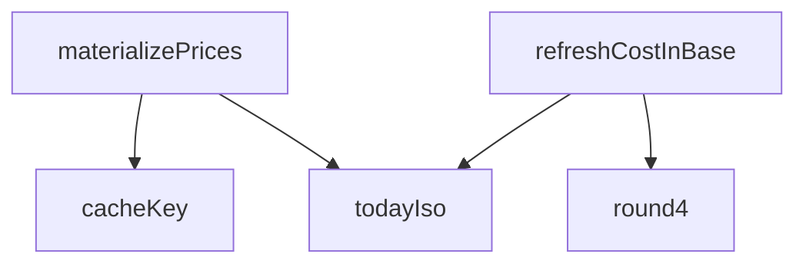

## Genel Bakış
Bu modül, HVAC fiyatlandırma sistemindeki maliyet verilerinin ve fiyat listelerinin hesaplanarak veritabanına somutlaştırılmasını (materialize) yönetir. Supabase üzerinden veri okuma/yazma işlemlerini gerçekleştirerek, fiyatların baz para birimine göre güncellenmesi ve önbellek anahtarlarının üretimini koordine eder.

## Fonksiyon Grupları

### Yardımcı Fonksiyonlar
Tarih ve sayısal değerlerin formatlanması ile önbellek anahtarı üretimi gibi yardımcı işlemler sağlar.
- todayIso, round4, cacheKey

### Maliyet Yenileme
Maliyet verilerinin baz para birimine göre güncellenmesini ve özet raporlama işlemlerini yürütür. DRY-RUN modu ile test amaçlı çalıştırma desteği sunar.
- refreshCostInBase

### Fiyat Somutlaştırma
Tüm fiyat listelerinin hesaplanarak veritabanına kalıcı olarak yazılmasını orkestra eder. Bu işlem muhtemelen maliyet yenileme ve yardımcı fonksiyonları bir arada kullanarak ana iş mantığını yönetir.
- materializePrices

---

## AXIOMS – Mimari Varsayımlar

Bu modül için temel aksiyomlar aşağıda listelenmiştir. Bu aksiyomlar, fonksiyon imzaları ve modülün genel amacına dayanılarak çıkarılmıştır.

[Aksiyom 1]: Eğer `todayIso()` fonksiyonu geçerli bir ISO formatında (YYYY-MM-DD) tarih dizesi döndürmeyi başaramazsa, `refreshCostInBase` ve `materializePrices` fonksiyonları tarafından yapılan tarih bazlı tüm hesaplamalar ve filtreleme işlemleri yanlış çalışır.

[Aksiyom 2]: Eğer `round4(value: number)` fonksiyonu, girilen sayıyı hassas bir şekilde 4 ondalık basamağa yuvarlayamazsa (örn: yuvarlama hataları, kayan nokta hassasiyet kaybı), hesaplanan fiyatlar tutarsız olur ve toplamlarda hata birikir.

[Aksiyom 3]: Eğer `supabase: SupabaseClient<Database>` istemcisi geçerli bir veritabanı bağlantısı sağlamaz veya `Database` şeması beklenen tabloları (fiyat listeleri, maliyet kayıtları vb.) içermezse, `refreshCostInBase` ve `materializePrices` fonksiyonlarındaki tüm veritabanı işlemleri başarısız olur.

[Aksiyom 4]: Eğer `options?.today` parametresi (`refreshCostInBase` ve `materializePrices` için) geçerli bir tarih dizesi olarak sağlanmazsa ve `todayIso()` da bozuksa, fonksiyonların hangi tarih aralığında çalışacağı belirsizleşir; bu durumda varsayılan olarak `todayIso()` sonucunun kullanılması beklenir, aksi halde tarih duyarlı sorgular yanlış veri döndürür.

[Aksiyom 5]: Eğer `options?.dryRun` parametresi `true` olarak ayarlandığında, `refreshCostInBase` ve `materializePrices` fonksiyonlarının veritabanında kalıcı değişiklik yapmaması gerekir; dryRun modunda yazma işlemi gerçekleşirse, test veya izleme amaçlı çalıştırma güvenli hale gelmez ve istenmeyen veri değişiklikleri oluşur.

[Aksiyom 6]: Eğer `cacheKey(productId: string, priceListId: string, currency: string)` fonksiyonu, verilen parametrelerden benzersiz ve tutarlı bir anahtar üretmezse (

---

## FONKSİYON DETAYLARI

### todayIso
**Ne yapar**: Geçerli tarihini ISO 8601 formatında (YYYY-MM-DD) döndürür. Bu, günün tarihini tutarlı ve sıralanabilir bir metin olarak elde etmek için kullanılır.
**Nasıl yapar**: `new Date()` ile mevcut tarih ve saat nesnesini oluşturur. Ardından `toISOString()` metoduyla UTC tabanlı ISO dizgesine dönüştürür. `slice(0, 10)` ile yalnızca ilk 10 karakteri (yıl-ay-gün kısmını) alarak saat ve zaman dilimi bilgisini atar.
**Parametreler**: Parametre almaz.
**Dönüş**: `string` — Bugünün tarihini "YYYY-MM-DD" formatında temsil eden dize.

### round4
**Ne yapar**: Verilen bir sayıyı ondalıklı noktadan sonra 4 basamağa yuvarlar ve bu hassasiyetle bir sayısal değer döndürür.
**Nasıl yapar**: `Number.toFixed(4)` metodunu kullanarak sayıyı 4 ondalık basamağa sahip bir dizeye dönüştürür. Elde edilen dizeyi tekrar `Number()` ile sayısal tipe dönüştürerek, gereksiz sıfırları atılmış hassas bir sayı elde eder. Bu, fiyat hesaplamalarında tutarlılık sağlamak için kullanılır.
**Parametreler**:
- value: number — Yuvarlanması istenen kayan noktalı sayı.
**Dönüş**: `number` — 4 ondalık basamağa yuvarlanmış sayı.

### refreshCostInBase
**Ne yapar**: Ürünlerin `cost_in_base` alanını (donmuş TL maliyetini) güncel kurla tazeler. Katalog satın alma fiyatları genelde EUR/USD gibi döviz cinsindendir; bu fonksiyon TCMB efektif satış kuruyla bunları TL'ye çevirerek ürün maliyetlerini günceller. Yalnızca fiyatı veya kur bilgisi gerçekten değişen satırlar güncellenerek gereksiz veri yazımı önlenir.
**Nasıl yapar**: Supabase istemcisini kullanarak aktif ürünleri çeker. Her para birimi için (ör. EUR, USD) en güncel döviz kurunu `currency_rates` tablosundan tek seferde çeker (base_ccy=TRY filtresiyle) ve bir haritada önbellekler. Her ürün için satın alma fiyatını, para birimini ve kuru alarak yeni `cost_in_base` değerini hesaplar (`purchase_price * fx_rate`). Mevcut değerlerle karşılaştırıp aynıysa işlem yapmaz. Fark varsa, `dryRun` seçeneğitrue ise sadece değişiklik sayısını döndürür, false ise bu değişiklikleri `products` tablosuna parti (chunk) halinde toplu güncelleme yaparak yazar. Tüm işlemler sonunda tarama, güncelleme ve atlanan satır sayılarını özetler.
**Parametreler**:
- supabase: SupabaseClient<Database> — Supabase veritabanı istemcisi.
- options?: { dryRun?: boolean; today?: string } — İşlem seçenekleri. `dryRun` (varsayılan: true) true ise veritabanına yazma yapmaz, yalnızca sonuç özetini döndürür. `today` (varsayılan: todayIso() çağrısı) kurların tarih filtresi olarak kullanılacak tarih (ISO formatında).
**Dönüş**: `Promise<CostRefreshSummary>` — İşlemin özeti. Taranan toplam ürün sayısı, güncellenen satır sayısı, kur bulunamayan ürünlerin sayısı, satın alma fiyatı olmayan ürünlerin sayısı ve kullanılan döviz kurlarının listesini içerir.

### cacheKey
**Ne yapar**: Belirli bir ürün, fiyat listesi ve para birimi üçlüsü için benzersiz bir anahtar dizesi oluşturur. Bu anahtar, fiyat önbelleğindeki satırları (product_prices) tekil olarak tanımlamak ve üzerlerine yazma (elle ezme) koruması ile bayat (eski/geçersiz) satır tespitinde kullanılır.
**Nasıl yapar**: Verilen `productId`, `priceListId` ve `currency` parametrelerini bir `|` (dikey çizgi) karakteri ile birleştirerek bir dize döndürür. Bu basit bir string birleştirme işlemidir.
**Parametreler**:
- productId: string — Ürünün benzersiz tanımlayıcısı.
- priceListId: string — Fiyat listesinin (segment) benzersiz tanımlayıcısı.
- currency: string — Para birimi kodu (ör. 'TRY', 'EUR').
**Dönüş**: `string` — "productId|priceListId|currency" formatında bir anahtar dizesi.

### materializePrices
**Ne yapar**: Aktif tüm ürünler için, her bir aktif fiyat listesinde (segment) geçerli fiyatı hesaplar ve `product_prices` tablosuna "türetilmiş" (derived) satır olarak yazar (materialize eder). Bu, fiyat motorunun (resolvePriceWithRules) sonuçlarını önbelleğe alarak gösterim hızını artırır ve tutarlılık sağlar. Fiyatı kurallara göre belirlenemeyen ürünler için satır yazılmaz; bu ürünler "Teklif Alın" olarak gösterilir.
**Nasıl yapar**: Veritabanından bir kezpricing_rule, category (eğer scope=3 kural varsa), price_lists ve brands verilerini çeker. Ürünleri sayfalayarak (pagina) iter. Her ürün için:
1. Ürün bilgilerini fiyat motoru için uygun forma dönüştürür (toPricingProductInput).
2. Kategori atalarını hesaplar (scope=3 kuralları için gerekli).
3. Her aktif fiyat listesi için `resolvePriceWithRules` fonksiyonunu çağırarak fiyatı hesaplar.
4. Eğer fiyat hesaplanabildiyse ve bu satır elle ezilmiş (manual) bir satır değilse, `product_prices` tablosuna upsert (insert veya update) yapar. Elle ezilmiş satırlara dokunmaz.
5. İşlem sonunda, bu koşuda üretilmeyen ancak veritabanında hala aktif olan eski türetilmiş satırları pasifleştirir (bayat satır temizliği).
Tüm bu süreç toplu (batch) upsert'ler ve sayfalama kullanılarak performanslı bir şekilde gerçekleştirilir. Sonuç olarak, hangi ürünlerin fiyatlandırıldığı, hangilerinin fiyatlandırılamadığı, kaç satırın yazıldığı/pasifleştirildiği gibi kapsamlı bir özet döndürülür.
**Parametreler**:
- supabase: SupabaseClient<Database> — Supabase veritabanı istemcisi.
- options?: MaterializeOptions — İşlem seçenekleri (MaterializeOptions tipi tanımlı). Genellikle `dryRun` (true ise yazma yapmaz), `today` (tarih) ve `sampleSize` (önekeler için maks satır sayısı) gibi alanları içerir.
**Dönüş**: `Promise<MaterializeSummary>` — İşlemin kapsamlı özeti. `dryRun` durumu, taranan ürün sayısı, fiyatlanan/teklif-only kalan ürün sayısı, yazılan/pasifleştirilen satır sayısı, elle ezme nedeniyle atlanan satır sayısı, markası eşlenememiş ürün sayısı, segment bazlı özet (her fiyat listesi için fiyatlanan/teklif-only sayısı) ve örnek satırlar listesi dahildir.

---

## İTHALATLAR (IMPORTS)
- import: ../../types/database.types::type { Database }
- import: @supabase/supabase-js::type { SupabaseClient }

---

## INTERFACES

### CostRefreshSummary
- `scanned: number`
- `updated: number`
- `skippedNoRate: number`
- `skippedNoPurchasePrice: number`
- `ratesUsed: { currency: string; rate: number; effectiveDate: string }[]`

### MaterializeSampleRow
- `sku: string`
- `name: string`
- `userType: string`
- `net: number`
- `gross: number`
- `ruleId: string`

### MaterializeSegmentSummary
- `priceListId: string`
- `userType: string`
- `priced: number`
- `quoteOnly: number`

### MaterializeSummary
- `dryRun: boolean`
- `productsScanned: number`
- `pricedProducts: number`
- `quoteOnlyProducts: number`
- `rowsUpserted: number`
- `skippedManual: number`
- `unbridgedBrand: number`
- `deactivated: number`
- `bySegment: MaterializeSegmentSummary[]`
- `samples: MaterializeSampleRow[]`
- `totalNetTry: number`

### MaterializeOptions
- `dryRun?: boolean`
- `today?: string`
- `sampleSize?: number`

---

## TYPE ALIASES

### ProductPriceUpsertRow
```typescript
type ProductPriceUpsertRow = Database['public']['Tables']['product_prices']['Insert']
```

---

## AST POINTERS

### [N1_NASIL] AST Pointer: src/lib/services/pricingMaterialize.service.ts::todayIso
- **params**: (parametre yok)
- **ic_degiskenler**: (değişken yok)
- **Dönüş**: string —_today's date in ISO format (YYYY-MM-DD) without time

### [N2_NASIL] AST Pointer: src/lib/services/pricingMaterialize.service.ts::round4
- **params**: value: number
- **ic_degiskenler**: (değişken yok)
- **Dönüş**: number — value rounded to 4 decimal places

### [N3_NASIL] AST Pointer: src/lib/services/pricingMaterialize.service.ts::refreshCostInBase
- **params**: supabase: SupabaseClient<Database>, options?: { dryRun?: boolean; today?: string }
- **ic_degiskenler**:
  - `dryRun` — boolean flag for dry run mode (defaults to true if not specified)
  - `today` — date string in ISO format (defaults to current date if not specified)
  - `productsData` — raw product data from Supabase query
  - `productsErr` — error from Supabase products query
  - `products` — array of product objects from database (defaults to empty array)
  - `rateByCcy` — Map to cache exchange rates by currency code to avoid duplicate API calls
  - `ratesUsed` — array tracking all exchange rates used in the operation
  - `ccy` — uppercased currency code within getRateFor nested function
  - `val` — exchange rate object for TRY currency within getRateFor nested function
  - `rates` — exchange rate data from Supabase query within getRateFor nested function
  - `ratesErr` — error from Supabase currency_rates query within getRateFor nested function
  - `row` — first row from currency_rates query result within getRateFor nested function
  - `rate` — parsed numeric exchange rate within getRateFor nested function
  - `val` — exchange rate object for non-TRY currencies within getRateFor nested function
  - `updated` — count of products successfully updated
  - `skippedNoRate` — count of products skipped due to missing exchange rate
  - `skippedNoPurchasePrice` — count of products skipped due to invalid purchase price
  - `toWrite` — array of objects to update in database (id, costInBase, purchaseRateToBase)
  - `p` — current product being processed in the products loop
  - `purchasePrice` — parsed numeric purchase price from product
  - `fx` — exchange rate object for product's currency (from getRateFor)
  - `newCostInBase` — calculated cost in base currency (TRY)
  - `newRate` — exchange rate used for this product
  - `sameCost` — boolean indicating if cost is unchanged from existing value
  - `sameRate` — boolean indicating if exchange rate is unchanged from existing value
  - `i` — loop index for chunking database updates
  - `chunk` — array of product updates to process in current batch
  - `results` — array of promise results from database update operations
  - `failed` — first failed result from update operations
- **Dönüş**: Promise<CostRefreshSummary> — { scanned, updated, skippedNoRate, skippedNoPurchasePrice, ratesUsed }

### [N4_NASIL] AST Pointer: src/lib/services/pricingMaterialize.service.ts::cacheKey
- **params**: productId: string, priceListId: string, currency: string
- **ic_degiskenler**: (değişken yok)
- **Dönüş**: string — composite cache key in format `${productId}|${priceListId}|${currency}`

### [N5_NASIL] AST Pointer: src/lib/services/pricingMaterialize.service.ts::materializePrices
- **params**: supabase: SupabaseClient<Database>, options?: MaterializeOptions
- **ic_degiskenler**:
  - `dryRun` — boolean flag for dry run mode (defaults to true if not specified)
  - `today` — date string in ISO format (defaults to current date if not specified)
  - `sampleSize` — number of sample records to collect (defaults to 10)
  - `ruleRows` — raw pricing rules data from Supabase query
  - `rulesErr` — error from Supabase pricing_rule query
  - `allRules` — array of pricing rule objects (cast to PricingRuleRow[])
  - `hasScope3Rules` — boolean indicating if any rules have scope=3
  - `parentOf` — Map mapping category IDs to parent category IDs
  - `EMPTY_ANCESTORS` — readonly Set as empty default for ancestors
  - `cursor` — current category ID being traversed in ancestorsFor function
  - `ancestors` — Set of ancestor category IDs within ancestorsFor function
  - `depth` — loop counter for ancestor traversal depth within ancestorsFor function
  - `priceListRows` — raw price list data from Supabase query
  - `listsErr` — error from Supabase price_lists query
  - `priceLists` — array of active price list objects
  - `segmentAcc` — Map accumulating pricing statistics per segment (priceListId)
  - `list` — current price list being processed
  - `acc` — segment accumulator object for current price list
  - `brandIdByName` — Map of brand names to brand IDs (loaded externally)
  - `manualKeys` — Set of cache keys for manually overridden prices (not to be overwritten)
  - `derivedActiveIdByKey` — Map of cache keys to database IDs for active derived prices
  - `snapshotOffset` — pagination offset for existing product_prices snapshot
  - `existingRows` — raw existing product_prices data from Supabase query
  - `existingErr` — error from Supabase product_prices snapshot query
  - `rows` — array of existing product price rows within pagination loop
  - `row` — current existing row being processed
  - `key` — cache key constructed from row's product_id, price_list_id, currency
  - `fxRate` — fixed null value for fxRate (TRY-only materialization)
  - `productsScanned` — count of products scanned
  - `pricedProducts` — count of products with calculated prices
  - `quoteOnlyProducts` — count of products without calculated prices
  - `rowsUpserted` — count of rows upserted to product_prices
  - `skippedManual` — count of products skipped due to manual overrides
  - `unbridgedBrand` — count of products with unmapped brand names
  - `totalNetTry` — sum of net prices in TRY for individual segments
  - `samples` — array of sample pricing records for inspection
  - `upsertBuffer` — buffer array for batch upsert operations
  - `writtenKeys` — Set of cache keys written in this run (for stale row detection)
  - `offset` — pagination offset for products query
  - `pageRows` — raw product data from paginated Supabase query
  - `productsErr` — error from Supabase products query
  - `rows` — array of product scope rows
  - `row` — current product being processed
  - `productInput` — transformed product input for pricing engine
  - `ancestors` — Set of ancestor category IDs for current product
  - `productPriced` — boolean flag if product received any price
  - `resolution` — pricing resolution result for product-list combination
  - `key` — cache key for product-list-currency combination
  - `staleIds` — array of IDs for stale derived prices to deactivate
  - `i` — loop index for deactivation batching
  - `chunk` — array of IDs to deactivate in current batch
- **Dönüş**: Promise<MaterializeSummary> — { dryRun, productsScanned, pricedProducts, quoteOnlyProducts, rowsUpserted, skippedManual, unbridgedBrand, deactivated, bySegment, samples, totalNetTry }

---


## MERMAID CALL GRAPH


## NODE ID STANDARD

  file: src\lib\services\pricingMaterialize.service.ts
  function: src\lib\services\pricingMaterialize.service.ts::todayIso
  function: src\lib\services\pricingMaterialize.service.ts::round4
  function: src\lib\services\pricingMaterialize.service.ts::refreshCostInBase
  function: src\lib\services\pricingMaterialize.service.ts::cacheKey
  function: src\lib\services\pricingMaterialize.service.ts::materializePrices

---

## DISA AKTARILANLAR (EXPORTS)
  export: CostRefreshSummary
  export: MaterializeOptions
  export: MaterializeSampleRow
  export: MaterializeSegmentSummary
  export: MaterializeSummary
  export: cacheKey
  export: materializePrices
  export: refreshCostInBase
  export: round4
  export: todayIso