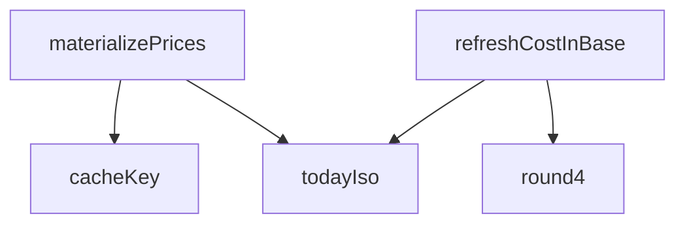

## Genel Bakış
Bu modül, HVAC fiyatlandırma sisteminde maliyet ve fiyat verilerinin hesaplanması, dönüştürülmesi ve veritabanına somutlaştırılmasını (materialize) yönetir. Supabase veritabanı üzerinden okuma ve yazma işlemlerini gerçekleştirerek, fiyatların baz para birimine göre güncellenmesini ve önbellek anahtarlarının üretimini koordine eder.

## Fonksiyon Grupları

### Yardımcı Fonksiyonlar
Tarih üretimi, sayısal değerlerin hassas yuvarlanması ve önbellek anahtarı oluşturma gibi temel yardımcı işlemleri sağlar.
- todayIso, round4, cacheKey

### Maliyet Yenileme
Maliyet verilerinin baz para birimine göre güncellenmesini ve bu işlemin özet raporunu oluşturmayı sağlar. DRY-RUN modu ile test amaçlı çalıştırma desteği sunar.
- refreshCostInBase

### Fiyat Somutlaştırma
Tüm fiyat listelerinin hesaplanarak veritabanına kalıcı olarak yazılmasını orkestra eder. Bu işlem, maliyet yenileme ve yardımcı fonksiyonları kullanarak ana iş mantığını yönetir.
- materializePrices

---

## AXIOMS – Mimari Varsayımlar

[Aksiyom 1]: Eğer `supabase` parametresi yoksa, `refreshCostInBase` ve `materializePrices` fonksiyonları veritabanına erişemez ve çalışamaz.

[Aksiyom 2]: Eğer `productId`, `priceListId` veya `currency` parametrelerinden herhangi biri yoksa, `cacheKey` fonksiyonu benzersiz bir önbellek anahtarı üretemez.

[Aksiyom 3]: Eğer `value` parametresi yoksa, `round4` fonksiyonu yuvarlama işlemi gerçekleştiremez.

[Aksiyom 4]: Eğer `dryRun` opsiyonu `true` olarak ayarlanırsa, `refreshCostInBase` ve `materializePrices` fonksiyonlarının yazma işlemleri gerçekleştirilmez (salt okunur modda çalışır).

[Aksiyom 5]: Eğer `today` opsiyonu belirtilmezse, `refreshCostInBase` fonksiyonu tarih bilgisi için `todayIso` fonksiyonunu kullanır.

---

## FONKSİYON DETAYLARI

### todayIso
**Ne yapar**: Bugünün tarihini ISO 8601 formatında (YYYY-MM-DD) string olarak döndürür. Kur hesaplamalarında ve fiyat geçerlilik tarihlerinde referans tarih olarak kullanılır.

**Nasıl yapar**: `new Date()` ile anlık tarih nesnesi oluşturur, `toISOString()` ile UTC milisaniye cinsinden ISO formatına çevirir ve `slice(0, 10)` ile yalnızca ilk 10 karakteri (YYYY-MM-DD kısmını) alır.

**Parametreler**:
- Bu fonksiyon parametre almaz.

**Dönüş**: `string` — Bugünün tarihi "YYYY-MM-DD" biçiminde (örneğin "2026-08-24").

### round4
**Ne yapar**: Verilen bir sayıyı ondalıklı noktadan sonra 4 basamağa yuvarlar ve bu hassasiyetle bir sayısal değer döndürür.
**Nasıl yapar**: `Number.toFixed(4)` metodunu kullanarak sayıyı 4 ondalık basamağa sahip bir dizeye dönüştürür. Elde edilen dizeyi tekrar `Number()` ile sayısal tipe dönüştürerek, gereksiz sıfırları atılmış hassas bir sayı elde eder. Bu, fiyat hesaplamalarında tutarlılık sağlamak için kullanılır.
**Parametreler**:
- value: number — Yuvarlanması istenen kayan noktalı sayı.
**Dönüş**: `number` — 4 ondalık basamağa yuvarlanmış sayı.

### refreshCostInBase
**Ne yapar**: Ürünlerin `cost_in_base` alanını (donmuş TL maliyetini) güncel kurla tazeler. Katalog satın alma fiyatları genelde EUR/USD gibi döviz cinsindendir; bu fonksiyon TCMB efektif satış kuruyla bunları TL'ye çevirerek ürün maliyetlerini günceller. Yalnızca fiyatı veya kur bilgisi gerçekten değişen satırlar güncellenerek gereksiz veri yazımı önlenir.
**Nasıl yapar**: Supabase istemcisini kullanarak aktif ürünleri çeker. Her para birimi için (ör. EUR, USD) en güncel döviz kurunu `currency_rates` tablosundan tek seferde çeker (base_ccy=TRY filtresiyle) ve bir haritada önbellekler. Her ürün için satın alma fiyatını, para birimini ve kuru alarak yeni `cost_in_base` değerini hesaplar (`purchase_price * fx_rate`). Mevcut değerlerle karşılaştırıp aynıysa işlem yapmaz. Fark varsa, `dryRun` seçeneğitrue ise sadece değişiklik sayısını döndürür, false ise bu değişiklikleri `products` tablosuna parti (chunk) halinde toplu güncelleme yaparak yazar. Tüm işlemler sonunda tarama, güncelleme ve atlanan satır sayılarını özetler.
**Parametreler**:
- supabase: SupabaseClient<Database> — Supabase veritabanı istemcisi.
- options?: { dryRun?: boolean; today?: string } — İşlem seçenekleri. `dryRun` (varsayılan: true) true ise veritabanına yazma yapmaz, yalnızca sonuç özetini döndürür. `today` (varsayılan: todayIso() çağrısı) kurların tarih filtresi olarak kullanılacak tarih (ISO formatında).
**Dönüş**: `Promise<CostRefreshSummary>` — İşlemin özeti. Taranan toplam ürün sayısı, güncellenen satır sayısı, kur bulunamayan ürünlerin sayısı, satın alma fiyatı olmayan ürünlerin sayısı ve kullanılan döviz kurlarının listesini içerir.

### cacheKey
**Ne yapar**: Belirli bir ürün, fiyat listesi ve para birimi üçlüsü için benzersiz bir anahtar dizesi oluşturur. Bu anahtar, fiyat önbelleğindeki satırları (product_prices) tekil olarak tanımlamak ve üzerlerine yazma (elle ezme) koruması ile bayat (eski/geçersiz) satır tespitinde kullanılır.
**Nasıl yapar**: Verilen `productId`, `priceListId` ve `currency` parametrelerini bir `|` (dikey çizgi) karakteri ile birleştirerek bir dize döndürür. Bu basit bir string birleştirme işlemidir.
**Parametreler**:
- productId: string — Ürünün benzersiz tanımlayıcısı.
- priceListId: string — Fiyat listesinin (segment) benzersiz tanımlayıcısı.
- currency: string — Para birimi kodu (ör. 'TRY', 'EUR').
**Dönüş**: `string` — "productId|priceListId|currency" formatında bir anahtar dizesi.

### materializePrices
**Ne yapar**: Aktif tüm ürünler için, her bir aktif fiyat listesinde (segment) geçerli fiyatı hesaplar ve `product_prices` tablosuna "türetilmiş" (derived) satır olarak yazar (materialize eder). Bu, fiyat motorunun (resolvePriceWithRules) sonuçlarını önbelleğe alarak gösterim hızını artırır ve tutarlılık sağlar. Fiyatı kurallara göre belirlenemeyen ürünler için satır yazılmaz; bu ürünler "Teklif Alın" olarak gösterilir.
**Nasıl yapar**: Veritabanından bir kezpricing_rule, category (eğer scope=3 kural varsa), price_lists ve brands verilerini çeker. Ürünleri sayfalayarak (pagina) iter. Her ürün için:
1. Ürün bilgilerini fiyat motoru için uygun forma dönüştürür (toPricingProductInput).
2. Kategori atalarını hesaplar (scope=3 kuralları için gerekli).
3. Her aktif fiyat listesi için `resolvePriceWithRules` fonksiyonunu çağırarak fiyatı hesaplar.
4. Eğer fiyat hesaplanabildiyse ve bu satır elle ezilmiş (manual) bir satır değilse, `product_prices` tablosuna upsert (insert veya update) yapar. Elle ezilmiş satırlara dokunmaz.
5. İşlem sonunda, bu koşuda üretilmeyen ancak veritabanında hala aktif olan eski türetilmiş satırları pasifleştirir (bayat satır temizliği).
Tüm bu süreç toplu (batch) upsert'ler ve sayfalama kullanılarak performanslı bir şekilde gerçekleştirilir. Sonuç olarak, hangi ürünlerin fiyatlandırıldığı, hangilerinin fiyatlandırılamadığı, kaç satırın yazıldığı/pasifleştirildiği gibi kapsamlı bir özet döndürülür.
**Parametreler**:
- supabase: SupabaseClient<Database> — Supabase veritabanı istemcisi.
- options?: MaterializeOptions — İşlem seçenekleri (MaterializeOptions tipi tanımlı). Genellikle `dryRun` (true ise yazma yapmaz), `today` (tarih) ve `sampleSize` (önekeler için maks satır sayısı) gibi alanları içerir.
**Dönüş**: `Promise<MaterializeSummary>` — İşlemin kapsamlı özeti. `dryRun` durumu, taranan ürün sayısı, fiyatlanan/teklif-only kalan ürün sayısı, yazılan/pasifleştirilen satır sayısı, elle ezme nedeniyle atlanan satır sayısı, markası eşlenememiş ürün sayısı, segment bazlı özet (her fiyat listesi için fiyatlanan/teklif-only sayısı) ve örnek satırlar listesi dahildir.

---

## İTHALATLAR (IMPORTS)
- import: ../../types/database.types::type { Database }
- import: ./fxRate.service::resolveFxRate
- import: @supabase/supabase-js::type { SupabaseClient }

---

## INTERFACES

### CostRefreshSummary
- `scanned: number`
- `updated: number`
- `skippedNoRate: number`
- `skippedNoPurchasePrice: number`
- `skippedFxLocked: number`
- `ratesUsed: { currency: string; rate: number; effectiveDate: string }[]`

### MaterializeSampleRow
- `sku: string`
- `name: string`
- `userType: string`
- `net: number`
- `gross: number`
- `ruleId: string`

### MaterializeSegmentSummary
- `priceListId: string`
- `userType: string`
- `priced: number`
- `quoteOnly: number`

### MaterializeSummary
- `dryRun: boolean`
- `productsScanned: number`
- `pricedProducts: number`
- `quoteOnlyProducts: number`
- `rowsUpserted: number`
- `skippedManual: number`
- `unbridgedBrand: number`
- `skippedFxLocked: number`
- `deactivated: number`
- `bySegment: MaterializeSegmentSummary[]`
- `samples: MaterializeSampleRow[]`
- `totalNetTry: number`

### MaterializeOptions
- `dryRun?: boolean`
- `today?: string`
- `sampleSize?: number`

---

## TYPE ALIASES

### ProductPriceUpsertRow
```typescript
type ProductPriceUpsertRow = Database['public']['Tables']['product_prices']['Insert']
```

---

## AST POINTERS

### [N1_NASIL] AST Pointer: pricingMaterialize.service.ts::todayIso
- **params**: (parametre yok)
- **ic_degiskenler**: (yok)
- **Dönüş**: `string` — günün tarihi `YYYY-MMAA-GG` biçiminde

---

### [N2_NASIL] AST Pointer: pricingMaterialize.service.ts::round4
- **params**: `value: number`
- **ic_degiskenler**: (yok)
- **Dönüş**: `number` — virgülden sonra 4 basamağa yuvarlanmış sayı

---

### [N3_NASIL] AST Pointer: pricingMaterialize.service.ts::refreshCostInBase
- **params**: `supabase: SupabaseClient<Database>`, `options?: { dryRun?: boolean; today?: string }`
- **ic_degiskenler**:
  - `dryRun` — `options?.dryRun ?? true`; veritabanına yazma işlemini atlayıp atlamayacağını belirler
  - `today` — `options?.today ?? todayIso()`; kur çözümlemesinde kullanılacak tarih
  - `productsData` — `supabase.from('products').select(...)` sorgusunun `data` dönüşü; aktif, silinmemiş ürünler
  - `productsErr` — ürün sorgusunun hata nesnesi; varsa throw edilir
  - `products` — `productsData ?? [];` null ise boş dizi
  - `rateByCcy` — `Map<string, { rate: number; effectiveDate: string } | null>`; para birimi başına önbelleklenmiş kur bilgisi
  - `ratesUsed` — `CostRefreshSummary['ratesUsed']`; kullanılan kurların kaydı (para birimi, kur, etkin tarih)
  - `updated` — güncellenen ürün sayısı sayacı
  - `skippedNoRate` — kur bulunamadığı için atlanan ürün sayısı
  - `skippedNoPurchasePrice` — geçerli alış fiyatı olmadığı için atlanan ürün sayısı
  - `skippedFxLocked` — fx-lock nedeniyle atlanan ürün sayısı
  - `toWrite` — `{ id: string; costInBase: number; purchaseRateToBase: number }[]`; veritabanına yazılacak güncelleme kayıtları
  - `brandIdForLocks` — `loadBrandIdByName(supabase)` dönüşü; marka adından marka ID'sine eşleme haritası
  - `fxLocks` — `resolveFxLocks(...)` dönüşü; ürün başına fx-lock durumu haritası
  - `p` — `products` dizisi üzerindeki döngü değişkeni; tek bir ürün satırı
  - `purchasePrice` — `Number(p.purchase_price)`; ürünün alış fiyatı
  - `fx` — `getRateFor(p.purchase_currency)` dönüşü; `{ rate: number; effectiveDate: string } | null`
  - `newCostInBase` — `round4(purchasePrice * fx.rate)`; yeni maliyet (taban para biriminde)
  - `newRate` — `fx.rate`; kullanılan döviz kuru
  - `sameCost` — mevcut `cost_in_base` ile `newCostInBase` arasındaki farkın `1e-9`'dan küçük olup olmadığını gösteren boolean
  - `sameRate` — mevcut `purchase_rate_to_base` ile `newRate` arasındaki farkın `1e-9`'dan küçük olup olmadığını gösteren boolean
  - `i` — `toWrite` dizisinin chunk'lar halinde işlenmesinde döngü sayacı
  - `chunk` — `toWrite.slice(i, i + COST_UPDATE_CONCURRENCY)`; eşzamanlı güncelleme grubu
  - `results` — `Promise.all(chunk.map(...))` dönüşü; her ürün için Supabase update sonucu dizisi
  - `failed` — `results.find(r => r.error)`; hata içeren ilk sonuç; varsa throw edilir
- **Dönüş**: `Promise<CostRefreshSummary>` — `{ scanned, updated, skippedNoRate, skippedNoPurchasePrice, skippedFxLocked, ratesUsed }`

---

### [N4_NASIL] AST Pointer: pricingMaterialize.service.ts::getRateFor (refreshCostInBase içinde)
- **params**: `ccyRaw: string`
- **ic_degiskenler**:
  - `ccy` — `ccyRaw.toUpperCase()`; büyük harfe dönüştürülmüş para birimi kodu
  - `val` — `resolveFxRate(supabase, ccy, today)` dönüşü; `{ rate: number; effectiveDate: string } | null`; önbelleğe yazılır ve `ratesUsed` dizisine eklenir
- **Dönüş**: `Promise<{ rate: number; effectiveDate: string } | null>`

---

### [N5_NASIL] AST Pointer: pricingMaterialize.service.ts::cacheKey
- **params**: `productId: string`, `priceListId: string`, `currency: string`
- **ic_degiskenler**: (yok)
- **Dönüş**: `string` — `` `${productId}|${priceListId}|${currency}` `` biçiminde birleşik anahtar

---

### [N6_NASIL] AST Pointer: pricingMaterialize.service.ts::materializePrices
- **params**: `supabase: SupabaseClient<Database>`, `options?: MaterializeOptions`
- **ic_degiskenler**:
  - `dryRun` — `options?.dryRun ?? true`; veritabanına yazma işlemini atlayıp atlamayacağını belirler
  - `today` — `options?.today ?? todayIso()`; fiyat çözümlemesinde kullanılacak tarih
  - `sampleSize` — `options?.sampleSize ?? 10`; örneklem satır sayısı üst sınırı
  - `ruleRows` — `supabase.from('pricing_rule').select('*')` sorgusunun `data` dönüşü
  - `rulesErr` — kural sorgusunun hata nesnesi; varsa throw edilir
  - `allRules` — `(ruleRows ?? []) as PricingRuleRow[]`; tüm fiyatlandırma kuralları
  - `hasScope3Rules` — `allRules.some(r => r.scope === 3)`; scope=3 kuralı var mı boolean'ı
  - `parentOf` — `Map<string, string | null>`; kategori ID'sinden üst kategori ID'sine eşleme haritası
  - `cats` — `supabase.from('categories').select('id, parent_id')` sorgusunun `data` dönüşü
  - `catsErr` — kategori sorgusunun hata nesnesi; varsa throw edilir
  - `c` — `(cats ?? [])` dizisi üzerindeki döngü değişkeni; `{ id: string; parent_id: string | null }`
  - `EMPTY_ANCESTORS` — `ReadonlySet<string>`; boş atalar kümesi (sabit referans)
  - `priceListRows` — `supabase.from('price_lists').select('id, user_type').eq('is_active', true)` sorgusunun `data` dönüşü
  - `listsErr` — fiyat listesi sorgusunun hata nesnesi; varsa throw edilir
  - `priceLists` — `(priceListRows ?? []) as { id: string; user_type: string | null }[]`; aktif fiyat listeleri
  - `segmentAcc` — `Map<string, MaterializeSegmentSummary>`; fiyat listesi başına birikim özeti
  - `list` — `priceLists` dizisi üzerindeki döngü değişkeni
  - `brandIdByName` — `loadBrandIdByName(supabase)` dönüşü; marka adından marka ID'sine eşleme haritası
  - `manualKeys` — `Set<string>`; elle ezilmiş (is_derived=false, is_active≠false) satırların cache anahtarları
  - `derivedActiveIdByKey` — `Map<string, string>`; aktif türetilmiş satırların cache anahtarından veritabanı ID'sine eşlemesi
  - `snapshotOffset` — mevcut cache fotoğrafı sayfalama ofseti
  - `existingRows` — `supabase.from('product_prices').select(...)` sorgusunun `data` dönüşü (sayfalı)
  - `existingErr` — mevcut satır sorgusunun hata nesnesi; varsa throw edilir
  - `rows` — `existingRows ?? [];` mevcut cache satırları
  - `row` — `rows` dizisi üzerindeki döngü değişkeni
  - `key` — `cacheKey(row.product_id, row.price_list_id, row.currency)`; tek bir satırın cache anahtarı
  - `fxRate` — `RuleEvaluationInputs['fxRate']` olarak `null`; materialize daima TRY yazar, gösterim kuru gerekmez
  - `productsScanned` — taranan ürün sayısı sayacı
  - `pricedProducts` — fiyatlandırılan ürün sayısı sayacı
  - `quoteOnlyProducts` — yalnızca teklif moduna düşen ürün sayısı sayacı
  - `rowsUpserted` — upsert edilen satır sayısı sayacı
  - `skippedManual` — elle ezilmiş satır nedeniyle atlanan sayaç
  - `skippedFxLocked` — fx-lock nedeniyle atlanan ürün sayısı sayacı
  - `unbridgedBrand` — marka ID'si köprülenemeyen ürün sayısı sayacı
  - `totalNetTry` — bireysel segmentteki toplam net TRY tutarı
  - `samples` — `MaterializeSampleRow[]`; bireysel segmentten örneklem satırları
  - `upsertBuffer` — `ProductPriceUpsertRow[]`; toplu upsert için biriktirilen satırlar
  - `writtenKeys` — `Set<string>`; bu koşuda üretilen cache anahtarları; bayat satır tespiti için kullanılır
  - `fxPolicies` — `fetchActivePolicies(supabase)` dönüşü; aktif fiyatlandırma politikaları
  - `offset` — ürün sayfalama ofseti
  - `pageRows` — `supabase.from('products').select(PRODUCT_SCOPE_COLUMNS)` sorgusunun `data` dönüşü (sayfalı)
  - `productsErr` — ürün sorgusunun hata nesnesi; varsa throw edilir
  - `row` — `pageRows ?? []` dizisi üzerindeki döngü değişkeni; `ProductScopeRow`
  - `productInput` — `toPricingProductInput(row, brandIdByName)` dönüşü; fiyatlandırma motoruna verilen ürün girdisi
  - `ancestors` — `ancestorsFor(productInput.categoryId)` dönüşü; kategori ataları kümesi
  - `productPriced` — bu ürün herhangi bir segmentte fiyatlandırıldı mı boolean'ı
  - `acc` — `segmentAcc.get(list.id)`; mevcut segment birikim özeti
  - `resolution` — `resolvePriceWithRules(...)` dönüşü; fiyat çözümleme sonucu
  - `key` — `cacheKey(productInput.id, list.id, MATERIALIZE_CURRENCY)`; üretilen cache anahtarı
  - `staleIds` — `string[]`; bu koşuda üretilmeyen eski türetilmiş satır ID'leri; pasifleştirilecek
  - `i` — `staleIds` dizisinin chunk'lar halinde işlenmesinde döngü sayacı
  - `chunk` — `staleIds.slice(i, i + DEACTIVATE_BATCH_SIZE)`; pasifleştirme grubu
- **Dönüş**: `Promise<MaterializeSummary>` — `{ dryRun, productsScanned, pricedProducts, quoteOnlyProducts, rowsUpserted, skippedManual, unbridgedBrand, skippedFxLocked, deactivated, bySegment, samples, totalNetTry }`

---

### [N7_NASIL] AST Pointer: pricingMaterialize.service.ts::ancestorsFor (materializePrices içinde)
- **params**: `categoryId: string | null | undefined`
- **ic_degiskenler**:
  - `ancestors` — `new Set<string>([categoryId])`; başlangıçta kendini içeren atalar kümesi
  - `cursor` — `parentOf.get(categoryId)`; üst kategori zincirini takip eden işaretçi
  - `depth` — döngü sayacı; `10` ile sınırlı (sonsuz döngü koruması)
- **Dönüş**: `ReadonlySet<string>` — verilen kategorinin ve atalarının ID kümesi

---

### [N8_NASIL] AST Pointer: pricingMaterialize.service.ts::flushUpsertBatch (materializePrices içinde)
- **params**: `rows: ProductPriceUpsertRow[]`
- **ic_degiskenler**: (yok)
- **Dönüş**: yok (void) — `dryRun` true ise veya `rows` boşsa hiçbir şey yapmaz; aksi halde `supabase.from('product_prices').upsert(rows, { onConflict: CACHE_CONFLICT_TARGET })` çağrısı yapar, hata varsa throw eder

---


## MERMAID CALL GRAPH


## NODE ID STANDARD

  file: src\lib\services\pricingMaterialize.service.ts
  function: src\lib\services\pricingMaterialize.service.ts::todayIso
  function: src\lib\services\pricingMaterialize.service.ts::round4
  function: src\lib\services\pricingMaterialize.service.ts::refreshCostInBase
  function: src\lib\services\pricingMaterialize.service.ts::cacheKey
  function: src\lib\services\pricingMaterialize.service.ts::materializePrices

---

## DISA AKTARILANLAR (EXPORTS)
  export: CostRefreshSummary
  export: MaterializeOptions
  export: MaterializeSampleRow
  export: MaterializeSegmentSummary
  export: MaterializeSummary
  export: cacheKey
  export: materializePrices
  export: refreshCostInBase
  export: round4
  export: todayIso