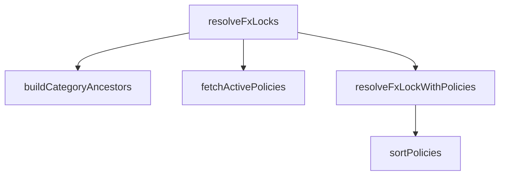

## Genel Bakış

Bu modül, fiyatlandırma politikalarını yöneten ve ürünler için döviz kuru kilidi (FX lock) kararlarını çözümleyen bir servistir. Veritabanından aktif politikaları çeker, kategori hiyerarşisini inşa eder ve her ürün için uygun FX kilidi kararını belirler. Modül, veri erişimi ile saf iş mantığını birbirinden ayırarak test edilebilir bir yapı sunar.

## Fonksiyon Grupları

### Veri Erişimi ve Hazırlık

Veritabanından gerekli ham verileri çeker ve yapılandırılmış hale getirir. Bu fonksiyonlar Supabase istemcisiyle iletişim kurarak politika satırlarını ve kategori ağaç bilgisini elde eder.

- fetchActivePolicies, buildCategoryAncestors

### Saf İş Mantığı

Dışarıdan gelen verileri kullanarak hesaplama yapan, yan etkisiz fonksiyonlardır. Politikaları sıralamak ve tek bir ürün için FX kilidi kararı vermek gibi temel karar mantığını içerir.

- sortPolicies, resolveFxLockWithPolicies

### Orkestrasyon

Tüm alt işlemleri bir araya getirerek çoklu ürün için toplu FX kilidi çözümlemesi yapan üst düzey fonksiyondur. Veri çekme, kategori ağacı inşası, sıralama ve tekil karar fonksiyonlarını çağırarak nihai sonucu üretir.

- resolveFxLocks

---

## AXIOMS – Mimari Varsayımlar
- Bu modül davranışsal mantık içermez (salt veri / konfigürasyon / tip tanımı).
- [Aksiyom 1]: Modülün dışa açtığı yapı (anahtar kümesi / şema) bir sözleşmedir; tüketiciler bu sabit yapıya bağlıdır — kırıcı değişiklik tüm tüketicileri etkiler.
- [Aksiyom 2]: Bir öğe ekleme/çıkarma yapısal-uyumlu olmalı; ilgili tipler ve seçiciler aynı commit'te güncel tutulmalıdır.

---

## FONKSİYON DETAYLARI

### sortPolicies
**Ne yapar**: PricingPolicyRow dizisini merdiven sıralaması ilkesine göre sıralar. En özel kapsam (scope) önce gelir, ardından öncelik (priority) azalan sırada, eşitlik durumunda ise id azalan sırada değerlendirilir. Bu fonksiyon, `sortRules` fonksiyonunun politika karşılığıdır; kural-özel alanlar (`price_book_id`, `min_quantity`) politikada yer almadığı için aynı fonksiyon değildir, ancak aynı sıralama ilkesini izler.

**Nasıl yapar**: Gelen diziyi mutasyona uğratmadan kopyalar (`[...policies]`) ve ardından `sort` ile üç seviyeli karşılaştırma uygular. İlk seviyede `scope` değeri artan sırayla (ASC) karşılaştırılır — bu sayede daha düşük scope değeri (daha özel eşleşme) önce gelir. Scope eşitse `priority` değeri azalan sırayla (DESC) karşılaştırılır. Her ikisi de eşitse `id` üzerinde `localeCompare` ile azalan sıralama yapılır.

**Parametreler**:
- policies: readonly PricingPolicyRow[] — Sıralanacak politika satırlarının salt-okunur dizisi. `readonly` anahtar kelimesi dizinin elemanlarının değiştirilmeyeceğini garanti eder.

**Dönüş**: PricingPolicyRow[] — Sıralanmış yeni bir PricingPolicyRow dizisi döndürür. Orijinal dizi mutasyona uğratılmaz.

### resolveFxLockWithPolicies
**Ne yapar**: Geliştirildi ancak detay üretilemedi.

### fetchActivePolicies
**Ne yapar**: Geliştirildi ancak detay üretilemedi.

### buildCategoryAncestors
**Ne yapar**: Geliştirildi ancak detay üretilemedi.

### resolveFxLocks
**Ne yapar**: Geliştirildi ancak detay üretilemedi.

---

## İTHALATLAR (IMPORTS)
- import: ../../types/database.types::type { Database }
- import: ./pricing.service::scopeMatchesProduct
- import: @supabase/supabase-js::type { SupabaseClient }

---

## INTERFACES

### PolicyProductInput
Politika çözümü için gereken en küçük ürün girdisi.
- `id: string`
- `brandId?: string | null`
- `categoryId?: string | null`

### FxLockDecision
- `locked: boolean`
- `policyId: string | null`
- `frozenRate: number | null`
- `scope: number | null`

---

## TYPE ALIASES

### PricingPolicyRow
```typescript
type PricingPolicyRow = Database['public']['Tables']['pricing_policy']['Row']
```

---

## AST POINTERS

### [N1_NASIL] AST Pointer: pricingPolicy.service.ts::sortPolicies
- **params**: `policies` — readonly PricingPolicyRow dizisi, sıralanacak politika listesi
- **ic_degiskenler**:
  - `a` — sort karşılaştırma fonksiyonunda birinci eleman; scope, priority ve id alanları karşılaştırılır
  - `b` — sort karşılaştırma fonksiyonunda ikinci eleman; scope, priority ve id alanları karşılaştırılır
- **Dönüş**: PricingPolicyRow[] — politikaların kopyası; önce scope artan, sonra priority azalan, sonra id'ye göre localeCompare ile azalan sıralanmış

### [N2_NASIL] AST Pointer: pricingPolicy.service.ts::resolveFxLockWithPolicies
- **params**: `product` — PolicyProductInput; id ve brandId alanlarına sahip ürün nesnesi, `policies` — readonly PricingPolicyRow dizisi; tüm aktif politikalar, `categoryAncestors` — ReadonlySet<string>; ürünün kategori atalarının kümesi
- **ic_degiskenler**:
  - `candidates` — p.is_active true olan VE scopeMatchesProduct ile eşleşen politikaların filtrelenmiş dizisi
  - `p` — filter callback'inde her bir politika satırı; is_active ve scopeMatchesProduct ile eşleşme kontrolü yapılır
  - `winner` — sortPolicies ile sıralanmış candidates dizisinin ilk elemanı (en özel eşleşme); scope, priority, id sıralamasına göre belirlenir
  - `rate` — winner.fx_frozen_rate null ise null, değilse Number() ile sayıya dönüştürülmüş değer
- **Dönüş**: FxLockDecision — candidates boşsa UNLOCKED; winner.fx_lock false ise UNLOCKED; aksi halde locked: true, policyId: winner.id, frozenRate (rate null değil ve sonlu ise rate, değilse null), scope: winner.scope

### [N3_NASIL] AST Pointer: pricingPolicy.service.ts::fetchActivePolicies
- **params**: `supabase` — SupabaseClient<Database>; veritabanı istemcisi
- **ic_degiskenler**:
  - `data` — supabase.from('pricing_policy').select('*').eq('is_active', true) sorgusundan dönen satırlar; hata yoksa PricingPolicyRow[] olarak kullanılır, null ise boş diziye düşülür
  - `error` — sorgu hatası varsa fırlatılır; yoksa yok sayılır
- **Dönüş**: Promise<PricingPolicyRow[]> — is_active=true olan tüm pricing_policy satırları; data null ise boş dizi döner

### [N4_NASIL] AST Pointer: pricingPolicy.service.ts::buildCategoryAncestors
- **params**: `supabase` — SupabaseClient<Database>; veritabanı istemcisi, `products` — readonly PolicyProductInput dizisi; categoryId alanına sahip ürünler, `policies` — readonly PricingPolicyRow dizisi; scope===3 kontrolü için kullanılır
- **ic_degiskenler**:
  - `result` — Map<string, Set<string>>; her ürün id'si için kategori atalarının kümesini tutar
  - `p` — policies.some callback'inde her bir politika; p.scope === 3 kontrolü yapılır
  - `cats` — supabase.from('categories').select('id, parent_id') sorgusundan dönen kategori satırları
  - `parentOf` — Map<string, string | null>; kategori id'sinden parent_id'ye eşleme haritası
  - `c` — cats dizisindeki her kategori satırı; id ve parent_id alanlarına erişilir
  - `p` — products döngüsünde her bir ürün; p.categoryId kontrolü ve p.id ile result'a set eklenir
  - `set` — Set<string>; tek bir ürünün kategori atalarını tutar; p.categoryId varsa eklenir
  - `cursor` — string | null | undefined; parentOf.get ile elde edilen üst kategori id'si; zincir boyunca yukarı yürür
  - `depth` — number; döngü sayaç; 10'a kadar sınırlı (sonsuz döngü koruması)
- **Dönüş**: Promise<Map<string, Set<string>>> — politikalar arasında scope===3 yoksa boş Map; aksi halde her ürün id'si için kategori ataları kümesi

### [N5_NASIL] AST Pointer: pricingPolicy.service.ts::resolveFxLocks
- **params**: `supabase` — SupabaseClient<Database>; veritabanı istemcisi, `products` — readonly PolicyProductInput dizisi; çözümlenecek ürünler
- **ic_degiskenler**:
  - `out` — Map<string, FxLockDecision>; her ürün id'si için kilit kararını tutar
  - `policies` — fetchActivePolicies ile getirilen PricingPolicyRow dizisi; aktif politikalar
  - `ancestorsByProduct` — buildCategoryAncestors ile elde edilen Map<string, Set<string>>; her ürünün kategori ataları
  - `p` — products döngüsünde her bir ürün; p.id ile out'a FxLockDecision eklenir; ancestorsByProduct.get(p.id) null ise boş Set kullanılır
- **Dönüş**: Promise<Map<string, FxLockDecision>> — products boşsa boş Map; policies boşsa her ürün için UNLOCKED; aksi halde her ürün için resolveFxLockWithPolicies sonucu

---


## MERMAID CALL GRAPH


## NODE ID STANDARD

  file: src\lib\services\pricingPolicy.service.ts
  function: src\lib\services\pricingPolicy.service.ts::sortPolicies
  function: src\lib\services\pricingPolicy.service.ts::resolveFxLockWithPolicies
  function: src\lib\services\pricingPolicy.service.ts::fetchActivePolicies
  function: src\lib\services\pricingPolicy.service.ts::buildCategoryAncestors
  function: src\lib\services\pricingPolicy.service.ts::resolveFxLocks

---

## DISA AKTARILANLAR (EXPORTS)
  export: FxLockDecision
  export: PolicyProductInput
  export: PricingPolicyRow
  export: buildCategoryAncestors
  export: fetchActivePolicies
  export: resolveFxLockWithPolicies
  export: resolveFxLocks
  export: sortPolicies