## Genel Bakış
VentHub HVAC projesindeki tüm ürün verilerine erişimi sağlayan merkezi servis modülüdür. Stateless bir tasarımla, Supabase istemcisini bağımlılık olarak alarak ürün listeleme, detay getirme, arama ve filtreleme işlemlerini yürütür. Hem son kullanıcı arayüzleri hem de yönetici paneli için veri erişimini tek bir noktadan yönetir.

## Fonksiyon Grupları
### Tekil Ürün Erişimi
Tek bir ürünün detaylarını farklı tanımlayıcı türleriyle (ID, slug veya ikisinin herhangi biriyle) getirir. `fetchProductBy` temel çekme mantığını merkezileştirir; diğer fonksiyonlar bu yapıyı sarmalayarak kullanıma özel接口sunar.
- fetchProductBy, getProductById, getProductBySlug, getProductBySlugOrId

### Toplu Ürün Listeleme ve Kategorik Filtreleme
Ürünleri toplu olarak, belirli kategorilere veya alt kategorilere göre, öne çıkanlar olarak ya da sayfalı biçimde listeler. Ana sayfa vitrini, kategori sayfaları ve genel ürün kataloğu gibi farklı kullanım senaryolarına uygun veri kümeleri sağlar.
- getProducts, getAllProducts, getProductsByCategory, getProductsBySubcategory, getFeaturedProducts

### Arama ve Öneri
Tam metin arama, otomatik öneriler ve yönetici paneline yönelik gelişmiş arama işlevlerini barındırır. Kullanıcı arama deneyimini destekleyen dinamik sorgulama ve filtreleme yetenekleri sunar.
- getSearchSuggestions, ftsSearchProducts, adminSearchProducts

---

## AXIOMS – Mimari Varsayımlar

Bu modül, ürün verilerini Supabase üzerinden sorgulayan bir servis katmanıdır. Aşağıdaki mimari varsayımlar fonksiyon imzalarından türetilmiştir.

---

**[Aksiyom 1 – Supabase Bağlantı Zorunluluğu]:** Eğer `supabase: SupabaseClient<Database>` parametresi geçerli bir Supabase bağlantısı içermiyorsa, modüldeki hiçbir fonksiyon veri tabanı sorgusu yapamaz ve tüm sorgular başarısız olur.

**[Aksiyom 2 – Ürün Yokluğu]:** Eğer `getProductById`, `getProductBySlug`, `getProductBySlugOrId` veya `fetchProductBy` tarafından sorgulanan ürün veri tabanında mevcut değilse, fonksiyon `null` döndürür; hata fırlatmaz.

**[Aksiyom 3 – fetchProductBy Sütun Kısıtlaması]:** Eğer `fetchProductBy` fonksiyonuna `column` parametresi olarak `'id'` veya `'slug'` dışında bir değer verilirse, çalışma zamanı hatası oluşur (TypeScript union tipi kısıtlaması).

**[Aksiyom 4 – Arama Sorgu Zorunluluğu]:** Eğer `getSearchSuggestions`, `ftsSearchProducts` veya `adminSearchProducts` fonksiyonlarına `q` parametresi boş string (`""`) olarak verilirse, arama kriteri tanımsız olur ve beklenmeyen sonuçlar dönebilir.

**[Aksiyom 5 – FTS Altyapı Zorunluluğu]:** Eğer `ftsSearchProducts` fonksiyonu çağrılıyorsa, veri tabanında `products` tablosu üzerinde PostgreSQL Full-Text Search (FTS) indeksi yapılandırılmış olmalıdır; yoksa sorgu çalışma zamanı hatası verir.

**[Aksiyom 6 – Kategori Alt İlişki Zorunluluğu]:** Eğer `getProductsByCategory` veya `getProductsBySubcategory` fonksiyonlarına geçersiz bir `categoryId` / `subcategoryId` verilirse, sonuç olarak boş dizi (`[]`) döner (ilgili ürüne bağlı ürün olmadığı varsayılır).

**[Aksiyom 7 – adminSearchProducts Sayfalama Sözleşmesi]:** Eğer `adminSearchProducts` fonksiyonunda `limit` değeri 0 veya negatif verilirse,行为 tanımsızdır; `offset` negatif verilirse sayfalama mantığı bozulur. Bu parametrelerin pozitif tamsayı olması beklenir.

**[Aksiyom 8 – fetchProductBy Hata Davranışı]:** Eğer `fetchProductBy` fonksiyonuna `throwOnError=true` geçilir ve sorgulanan ürün bulunamazsa, fonksiyon `null` yerine hata fırlatır. `throwOnError=false` (veya falsy) ise `null` döner.

**[Aksiyom 9 – getProducts Varsayılan Sınırı]:** Eğer `getProducts` fonksiyonuna `limit` parametresi geçirilmezse, döndürülecek ürün sayısının ne olacağı fonksiyon gövdesinde tanımlıdır — mevcut imzada varsayılan değer belirtilmemiştir, bu nedenle varsayılan sınır bilinmiyor.

**[Aksiyom 10 – ID Formatı]:** Eğer `getProductById`, `getProductsByCategory` veya `getProductsBySubcategory` fonksiyonlarına UUID formatında olmayan bir `id` / `categoryId` / `subcategoryId` değeri verilse bile, Supabase sorgusu boş sonuç ile başarısızlık arasında bir durum döndürür; modül bu durumu hata olarak yönetmez (null veya boş dizi).

**[Aksiyom 11 – Doluluk Ürünleri]:** `getFeaturedProducts` fonksiyonunun hangi kriterlere göre "öne çıkan" ürünleri filtrelediği fonksiyon imzasından anlaşılamaz; bu kriterin veri tabanı tarafında (örn. `is_featured` kolonu) tanımlı olması gerekir.

---

## FONKSİYON DETAYLARI

### getSearchSuggestions

**Ne yapar**: Arama sorgusuna göre kullanıcılara önerilen arama terimleri (autocomplete önerileri) döndürür. Kullanıcı arama kutusuna yazmaya başladığında önerileri göstermek için kullanılır.

**Nasıl yapar**: Supabase istemcisi üzerinden `get_search_suggestions` adlı RPC (Remote Procedure Call) fonksiyonunu çağırır. Sorgu metnini (`p_q`) ve maks porówna limitini (`p_limit`) parametre olarak RPC'ye iletir. Hata oluşursa konsola hata loglayıp boş dizi döndürerek uygulamanın çökmesini engeller; başarı durumunda ise ham veriyi `SearchSuggestion[]` tipine cast ederek döndürür.

**Parametreler**:
- `supabase`: `SupabaseClient<Database>` — Veritabanı bağlantısını sağlayan Supabase istemci nesnesi. `Database` generic tipi ile tip güvenli sorgular yapılmasını sağlar.
- `q`: `string` — Kullanıcının arama kutusuna girdiği arama terimi/sorgusu. Bu değer doğrudan RPC fonksiyonuna `p_q` parametresi olarak iletilir.
- `limit`: `number` — Döndürülecek maksimum öneri sayısı. Varsayılan değeri `6`'dır ve RPC'ye `p_limit` olarak iletilir.

**Dönüş**: `Promise<SearchSuggestion[]>` — Arama terimine eşleşen önerilerin listesi. Hata durumunda boş dizi döner.

### ftsSearchProducts
**Ne yapar**: Tam metin arama (Full-Text Search) kullanarak ürünleri hızlı ve etkili şekilde arar.
**Nasıl yapar**: `fts_search_products` RPC fonksiyonunu çağırarak veritabanı düzeyinde optimize edilmiş bir tam metin araması yapar. Arama sorgusu (`q`), sonuç limiti (`limit`) ve opsiyonel olarak kategori filtresi (`filters.category_id`) gönderilir. RPC çağrısı bir hata ile sonuçlanırsa bu hatayı fırlatır (throw error).
**Parametreler**:
- supabase: SupabaseClient<Database> — Supabase istemci bağlantısı.
- q: string — Aranacak anahtar kelimeler veya cümle.
- limit: number — Döndürülecek maksomat sonuç sayısı. Varsayılan olarak 20'dir.
- filters?: { category_id?: string } — Opsiyonel filtre nesnesi. Sağlanırsa sadece belirtilen kategorideki ürünler aranır.
**Dönüş**: Promise<FtsProductResult[]> — Tam metin arama sonuçlarını içeren ürün listesi.

### getProducts
**Ne yapar**: Belirli bir alt kategorideki aktif ürünleri getirir.
**Nasıl yapar**: `products` tablosundan, verilen `subcategory_id` ve `status='active'` koşullarına uyan ürünleri çeker. Sonuçları `is_featured` (azalan) ve `name` (artan) sıralamasıyla sıralar. Hata oluşursa fırlatır. Verileri `DbProduct[]` tipinden `Product[]` UI formatına dönüştürerek döndürür.
**Parametreler**:
- subcategoryId: string — Ürünlerin getirileceği alt kategori ID'si.
- supabase: SupabaseClient — Varsayılan olarak defaultClient kullanılır.
**Dönüş**: Promise<Product[]> — Alt kategorideki aktif ürünlerin listesi.

### getAllProducts
**Ne yapar**: Veritabanındaki tüm aktif (`status='active'`) ürünleri getirir.
**Nasıl yapar**: `products` tablosundan durumu `'active'` olan tüm kayıtları seçer. Sonuçlar önce `is_featured` (öne çıkan) değerine göre azalan, ardından `name`'e göre artan sırada sıralanır. Hata oluşursa hatayı fırlatır.
**Parametreler**:
- supabase: SupabaseClient<Database> — Supabase istemci bağlantısı.
**Dönüş**: Promise<Product[]> — Tüm aktif ürünlerin listesi.

### getProductsByCategory
**Ne yapar**: Belirli bir kategoriye (`category_id`) ait aktif ürünleri getirir.
**Nasıl yapar**: `products` tablosunda `category_id` veya `subcategory_id` alanının verilen `categoryId` değerine eşit olduğu ve `status`'ün `'active'` olduğu kayıtları filtreler. Bu sayede hem doğrudan kategorideki hem de o kategorinin altındaki alt kategorilerdeki ürünler listelenir. Sonuçlar önce `is_featured`'a göre azalan, ardından `name`'e göre artan sırada sıralanır. Hata oluşursa hatayı fırlatır.
**Parametreler**:
- supabase: SupabaseClient<Database> — Supabase istemci bağlantısı.
- categoryId: string — Ürünlerin getirileceği kategorinin ID'si.
**Dönüş**: Promise<Product[]> — Belirtilen kategorideki ve alt kategorilerindeki aktif ürünler.

### getProductsBySubcategory
**Ne yapar**: Belirli bir alt kategoriye (`subcategory_id`) ait aktif ürünleri getirir.
**Nasıl yapar**: `products` tablosundan doğrudan sorgulama yapar. Filtreleri: `subcategory_id` eşitliği ve `status`'ün `'active'` olması şeklindedir. Sonuçlar önce `is_featured` (öne çıkan) değerine göre azalan, ardından `name`'e göre artan sırada sıralanır. Hata oluşursa hatayı fırlatır.
**Parametreler**:
- supabase: SupabaseClient<Database> — Supabase istemci bağlantısı.
- subcategoryId: string — Ürünlerin getirileceği alt kategorinin ID'si.
**Dönüş**: Promise<Product[]> — Belirtilen alt kategorideki aktif ürünler.

### fetchProductBy
**Ne yapar**: Belirli bir sütun (`id` veya `slug`) ve değer eşleşmesine göre tek bir ürünü getirir. Temel getirme fonksiyonudur.
**Nasıl yapar**: `products` tablosunda verilen sütuna (`column`) ve değere (`value`) göre sorgulama yapar. `maybeSingle()` kullanarak tek kayıt döndürür. Hata oluşursa `throwOnError` parametresine göre ya hatayı fırlatır ya da `null` döndürür. Bulunan ham veritabanı nesnesini (`DbProduct`) `Product` arayüzüne dönüştürür.
**Parametreler**:
- supabase: SupabaseClient<Database> — Supabase istemci bağlantısı.
- column: 'id' | 'slug' — Aramanın yapılacağı sütun adı.
- value: string — Aranacak değer (bir ID veya slug).
- throwOnError: boolean — Hata oluşursa fırlatılıp fırlatılmayacağı. Varsayılan `false`'dur.
**Dönüş**: Promise<Product | null> — Eşleşen ürün varsa `Product` nesnesi, yoksa `null`.

### getProductById
**Ne yapar**: Verilen ID'ye sahip ürünü getirir.
**Nasıl yapar**: `fetchProductBy` fonksiyonunu `'id'` sütunu ve `throwOnError=true` parametreleriyle çağırarak hata yönetimi yapar.
**Parametreler**:
- supabase: SupabaseClient<Database> — Supabase istemci bağlantısı.
- id: string — Aranan ürünün UUID'si.
**Dönüş**: Promise<Product | null> — Bulunan ürün veya bulunamazsa `null`.

### getProductBySlugOrId
**Ne yapar**: Verilen bir tanımlayıcının (`identifier`) bir UUID (ID) mi yoksa bir slug mı olduğunu algılayarak uygun sorgulamayı yapar.
**Nasıl yapar**: Girilen `identifier` değerinin UUID formatında olup olmadığını bir正则表达式 ile kontrol eder. Eğer UUID formatındaysa `fetchProductBy`'i `'id'` sütunuyla, değilse `'slug'` sütunuyla çağırır. Bu çağrıda `throwOnError` `false` olarak ayarlanmıştır, yani hata durumunda sessizce `null` döner.
**Parametreler**:
- supabase: SupabaseClient<Database> — Supabase istemci bağlantısı.
- identifier: string — Ürünü temsil eden bir ID (UUID) veya slug.
**Dönüş**: Promise<Product | null> — Eşleşen ürün veya bulunamazsa `null`.

### getProductBySlug
**Ne yapar**: Verilen URL slug'ı ile veritabanından tek bir ürünü getirir.
**Nasıl yapar**: Fonksiyon, `fetchProductBy` yardımcı fonksiyonunu çağırarak `slug` alanına göre ve `false` parametresiyle (muhtemelen aktif olmayan ürünler de dahil) sorgulama yapar.
**Parametreler**:
- `supabase`: SupabaseClient<Database> — Supabase istemcisi örneği, veritabanı bağlantısını ve RPC çağrılarını yönetir.
- `slug`: string — Ürünün benzersiz URL parçası (örnek: "daikin-ftx35a").
**Dönüş**: `Promise<Product | null>` — Bulunan ürün nesnesi veya eşleşme yoksa `null`.

### getFeaturedProducts
**Ne yapar**: Veritabanından öne çıkan (featured) ve aktif durumdaki ürünleri getirir. Ana sayfada veya vitrin bölümlerinde sergilenecek ürünlerin seçiminden sorumludur. Silinmemiş, yalnızca aktif ve öne çıkan ürünler arasından en fazla 6 adet ürün döndürür.

**Nasıl yapar**: Supabase istemcisi kullanarak `products` tablosuna bir sorgu başlatır. `VARIANT_DETAIL_COLUMNS` sabitinin tanımladığı sütunları seçer ve ardışık filtreleme zinciri uygular: `is_featured` alanı `true`, `status` alanı `'active'` ve `deleted_at` alanı `null` olmalıdır. Sonuç kümesini 6 ile sınırlar. Sorgu hatası oluşursa hatayı fırlatır. Dönen ham veriyi `toUIProductList` fonksiyonuyla `DbProduct[]` tipinden `Product[]` tipine dönüştürerek arayüz için uygun hale getirir.

**Parametreler**:
- `supabase`: `SupabaseClient<Database>` — Veritabanı bağlantısını sağlayan Supabase istemcisi. `Database` generic tipi, veritabanı şemasının tip güvenli tanımını içerir ve tablo ile RPC çağrılarının tip kontrolünü sağlar.

**Dönüş**: `Promise<Product[]>` — Öne çıkan aktif ürünlerin UI katmanına uygun hale getirilmiş listesi. `toUIProductList` dönüşümü uygulandıktan sonra arayüz bileşenleri tarafından doğrudan kullanılabilir formattadır. Maksimum 6 eleman içerebilir.

### adminSearchProducts
**Ne yapar**: Yönetici paneli için gelişmiş ürün araması yapar. Farklı parametrelerle (arama terimi, sayfalama, opsiyonel kategori filtresi) RPC fonksiyonunu çağırarak sonuçları döndürür.
**Nasıl yapar**: Belirtilen parametreleri `admin_search_products` adlı PostgreSQL fonksiyonuna RPC olarak gönderir. Bu fonksiyon sunucu tarafında karmaşık arama mantığını çalıştırır.
**Parametreler**:
- `supabase`: SupabaseClient<Database> — Supabase istemcisi örneği.
- `q`: string — Arama terimi.
- `limit`: number — Sayfa başına sonuç sayısı (varsayılan: 50).
- `offset`: number — Sonuçların kaydırma miktarı, sayfalama için kullanılır (varsayılan: 0).
- `categoryId`: string | undefined — Opsiyonel. Belirli bir kategoriye ait ürünleri filtrelemek için kategori ID'si.
**Dönüş**: `Promise<DbAdminSearchResult[]>` — Veritabanı seviyesinde ham formatlanmış arama sonuçları listesi.

---

## İTHALATLAR (IMPORTS)
- import: ../../types/database.types::type { Database }
- import: ../../types/db-rows::type { DbAdminSearchResult,DbProduct }
- import: ../../types/ui-models::type { FtsProductResult, Product, SearchSuggestion }
- import: ../type-converters::mapDatabaseProductToDomain
- import: ../type-converters::toUIProductList
- import: ./product.columns::VARIANT_DETAIL_COLUMNS
- import: @supabase/supabase-js::type { SupabaseClient }

---

## AST POINTERS

### [N1_NASIL] AST Pointer: src/lib/services/product.service.ts::getSearchSuggestions
- **params**: (supabase: SupabaseClient<Database>, q: string, limit: number)
- **ic_degiskenler**:
  - `data` — supabase.rpc çağrısından dönen arama sonuçları (SearchSuggestion[])
  - `error` — supabase.rpc çağrısında oluşabilecek hata nesnesi
- **Dönüş**: SearchSuggestion[] dizisi, hata durumunda boş dizi

### [N2_NASIL] AST Pointer: src/lib/services/product.service.ts::ftsSearchProducts
- **params**: (supabase: SupabaseClient<Database>, q: string, limit: number, filters?: { category_id?: string })
- **ic_degiskenler**:
  - `payload` — supabase.rpc çağrısı için parametreler içeren nesne (p_q, p_limit, p_filters)
  - `data` — supabase.rpc çağrısından dönen full-text arama sonuçları (FtsProductResult[])
  - `error` — supabase.rpc çağrısında oluşabilecek hata nesnesi
- **Dönüş**: FtsProductResult[] dizisi

### [N3_NASIL] AST Pointer: src/lib/services/product.service.ts::getProducts
- **params**: (supabase: SupabaseClient<Database>, limit?: number)
- **ic_degiskenler**:
  - `query` — supabase.from('products') ile oluşturulan ve zincirlenen sorgu nesnesi (filter, select, order)
  - `data` — sorgu sonucu dönen veri satırları (DbProduct[])
  - `error` — sorgu sırasında oluşabilecek hata nesnesi
- **Dönüş**: Product[] dizisi (DbProduct[] -> Product[] dönüşümü yapılır)

### [N4_NASIL] AST Pointer: src/lib/services/product.service.ts::getAllProducts
- **params**: (supabase: SupabaseClient<Database>)
- **ic_degiskenler**:
  - `data` — supabase.from('products') sorgusundan dönen tüm aktif silinmemiş veriler (DbProduct[])
  - `error` — sorgu sırasında oluşabilecek hata nesnesi
- **Dönüş**: Product[] dizisi (DbProduct[] -> Product[] dönüşümü yapılır)

### [N5_NASIL] AST Pointer: src/lib/services/product.service.ts::getProductsByCategory
- **params**: (supabase: SupabaseClient<Database>, categoryId: string)
- **ic_degiskenler**:
  - `data` — supabase.from('products') sorgusundan, belirtilen kategoriye veya alt kategoriye ait aktif veriler (DbProduct[])
  - `error` — sorgu sırasında oluşabilecek hata nesnesi
- **Dönüş**: Product[] dizisi (DbProduct[] -> Product[] dönüşümü yapılır)

### [N6_NASIL] AST Pointer: src/lib/services/product.service.ts::getProductsBySubcategory
- **params**: (supabase: SupabaseClient<Database>, subcategoryId: string)
- **ic_degiskenler**:
  - `data` — supabase.from('products') sorgusundan, belirtilen alt kategoriye ait aktif veriler (DbProduct[])
  - `error` — sorgu sırasında oluşabilecek hata nesnesi
- **Dönüş**: Product[] dizisi (DbProduct[] -> Product[] dönüşümü yapılır)

### [N7_NASIL] AST Pointer: src/lib/services/product.service.ts::fetchProductBy
- **params**: (supabase: SupabaseClient<Database>, column: 'id' | 'slug', value: string, throwOnError: boolean)
- **ic_degiskenler**:
  - `query` — supabase.from('products') ile oluşturulan ve belirli sütuna göre filtrelenmiş sorgu nesnesi (maybeSingle())
  - `data` — sorgu sonucu dönen tek satırlık veri (DbProduct)
  - `error` — sorgu sırasında oluşabilecek hata nesnesi
- **Dönüş**: Product | null (DbProduct -> Product dönüşümü yapılır)

### [N8_NASIL] AST Pointer: src/lib/services/product.service.ts::getProductById
- **params**: (supabase: SupabaseClient<Database>, id: string)
- **ic_degiskenler**: (yok)
- **Dönüş**: Product | null (fetchProductBy fonksiyonunu çağırır)

### [N9_NASIL] AST Pointer: src/lib/services/product.service.ts::getProductBySlugOrId
- **params**: (supabase: SupabaseClient<Database>, identifier: string)
- **ic_degiskenler**:
  - `isUuid` — identifier'ın UUID formatında olup olmadığını test eden regex sonucu (boolean)
- **Dönüş**: Product | null (fetchProductBy fonksiyonunu çağırır)

### [N10_NASIL] AST Pointer: src/lib/services/product.service.ts::getProductBySlug
- **params**: (supabase: SupabaseClient<Database>, slug: string)
- **ic_degiskenler**: (yok)
- **Dönüş**: Product | null (fetchProductBy fonksiyonunu çağırır)

### [N11_NASIL] AST Pointer: src/lib/services/product.service.ts::getFeaturedProducts
- **params**: (supabase: SupabaseClient<Database>)
- **ic_degiskenler**:
  - `data` — supabase.from('products') sorgusundan dönen öne çıkan aktif ürünler (DbProduct[])
  - `error` — sorgu sırasında oluşabilecek hata nesnesi
- **Dönüş**: Product[] dizisi (DbProduct[] -> Product[] dönüşümü yapılır)

### [N12_NASIL] AST Pointer: src/lib/services/product.service.ts::adminSearchProducts
- **params**: (supabase: SupabaseClient<Database>, q: string, limit: number, offset: number, categoryId?: string)
- **ic_degiskenler**:
  - `payload` — supabase.rpc çağrısı için parametreler içeren nesne (p_q, p_limit, p_offset, p_category_id)
  - `data` — supabase.rpc çağrısından dönen admin arama sonuçları (DbAdminSearchResult[])
  - `error` — supabase.rpc çağrısında oluşabilecek hata nesnesi
- **Dönüş**: DbAdminSearchResult[] dizisi

---

## MERMAID CALL GRAPH

```mermaid
graph TD
    product_service_ts__adminSearchProducts["adminSearchProducts"]
    product_service_ts__fetchProductBy["fetchProductBy"]
    product_service_ts__ftsSearchProducts["ftsSearchProducts"]
    product_service_ts__getAllProducts["getAllProducts"]
    product_service_ts__getFeaturedProducts["getFeaturedProducts"]
    product_service_ts__getProductById["getProductById"]
    product_service_ts__getProductBySlug["getProductBySlug"]
    product_service_ts__getProductBySlugOrId["getProductBySlugOrId"]
    product_service_ts__getProducts["getProducts"]
    product_service_ts__getProductsByCategory["getProductsByCategory"]
    product_service_ts__getProductsBySubcategory["getProductsBySubcategory"]
    product_service_ts__getSearchSuggestions["getSearchSuggestions"]
    product_service_ts__getProductBySlugOrId --> product_service_ts__fetchProductBy
    product_service_ts__getProductBySlug --> product_service_ts__fetchProductBy
    product_service_ts__getProductById --> product_service_ts__fetchProductBy
```

## NODE ID STANDARD

  file: src\lib\services\product.service.ts
  function: src\lib\services\product.service.ts::getSearchSuggestions
  function: src\lib\services\product.service.ts::ftsSearchProducts
  function: src\lib\services\product.service.ts::getProducts
  function: src\lib\services\product.service.ts::getAllProducts
  function: src\lib\services\product.service.ts::getProductsByCategory
  function: src\lib\services\product.service.ts::getProductsBySubcategory
  function: src\lib\services\product.service.ts::fetchProductBy
  function: src\lib\services\product.service.ts::getProductById
  function: src\lib\services\product.service.ts::getProductBySlugOrId
  function: src\lib\services\product.service.ts::getProductBySlug
  function: src\lib\services\product.service.ts::getFeaturedProducts
  function: src\lib\services\product.service.ts::adminSearchProducts

---

## DISA AKTARILANLAR (EXPORTS)
  export: adminSearchProducts
  export: fetchProductBy
  export: ftsSearchProducts
  export: getAllProducts
  export: getFeaturedProducts
  export: getProductById
  export: getProductBySlug
  export: getProductBySlugOrId
  export: getProducts
  export: getProductsByCategory
  export: getProductsBySubcategory
  export: getSearchSuggestions