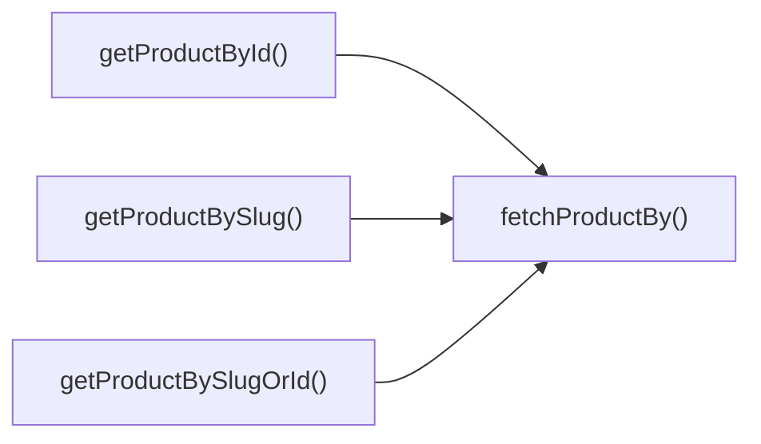

## Genel Bakış
Bu modül, VentHub HVAC projesindeki ürünlerle ilgili tüm servis işlemlerini yöneten merkezi bir hizmettir. Hem son kullanıcılar hem de yönetici paneli için ürün listeleme, detay getirme, arama ve filtreleme işlevlerini tek noktadan sunar. Ürün verilerini farklı kullanım senaryolarına uygun formatlarda hazırlayarak ilgili taraflara iletir.

## Fonksiyon Grupları
### Tekil Ürün Detayı Getirme
ID veya benzersiz URL kısaltması (slug) gibi tanımlayıcılar kullanarak tek bir ürünün detaylarını veritabanından çeker, esnek sorgulama ve temel hata yönetimi imkanı sunar.
- fetchProductBy, getProductById, getProductBySlug, getProductBySlugOrId

### Toplu Ürün Listeleme ve Kategorik Filtreleme
Tüm ürünleri, kategorilere/alt kategorilere göre ayrılmış, öne çıkarılmış veya ek bilgilerle zenginleştirilmiş şekilde toplu olarak listeler, kullanıcı taleplerine uygun boyutlarda liste döndürür.
- getProducts, getAllProducts, getProductsByCategory, getProductsBySubcategory, getFeaturedProducts, getProductsEnriched

### Arama, Öneri ve Yönetici Özel İşlemler
Genel kullanıcılar ve sistem yöneticileri için tam metin arama, arama öncesi öneriler ve yönetici paneline özel filtreli gelişmiş arama işlevlerini sunar.
- getSearchSuggestions, ftsSearchProducts, searchProducts, adminSearchProducts

---

## AXIOMS – Mimari Varsayımlar
Bu modül, sistemdeki ürün kayıtlarının saklandığı merkezi veri deposuna ve tam metin arama servisine erişen, ürün listeleme, arama, filtreleme ve detay getirme işlemlerini yöneten servis katmanı modülüdür; tüm fonksiyonlarının çalışması için eriştiği temel veri kaynaklarının ve bağımlı servislerin erişilebilir olması zorunludur.

[Aksiyom 1]: Eğer ürünlerin saklandığı kalıcı veri deposu erişilebilir değilse, tüm ürün getirme, listeleme ve detaylandırma fonksiyonları başarısız olur, istemcilere hiçbir ürün verisi döndürülemez.
[Aksiyom 2]: Eğer tam metin araması için kullanılan harici arama servisi erişilebilir değilse, ftsSearchProducts, searchProducts, adminSearchProducts ve getSearchSuggestions arama/öneri fonksiyonları sonuç üretemez, boş liste veya hata döndürür.
[Aksiyom 3]: Eğer fetchProductBy fonksiyonuna imzada tanımlı 'id' veya 'slug' dışında bir column değeri gönderilirse, filtreleme çalışmaz, hiçbir ürün bulunamaz veya beklenmedik hata fırlatılır.
[Aksiyom 4]: Eğer ürünler ile kategori/alt kategori ID'leri arasındaki ilişkiler veri deposunda eksik veya hatalı tanımlıysa, getProductsByCategory ve getProductsBySubcategory fonksiyonları eksik veya yanlış ürün listesi döndürür.
[Aksiyom 5]: Eğer limit parametresi alan tüm fonksiyonlara (getSearchSuggestions, ftsSearchProducts, getProducts, adminSearchProducts) sıfır veya negatif bir limit değeri gönderilirse, istenen sayıda ürün getirilemez, boş liste veya tüm veri seti yanlışlıkla döndürülür.
[Aksiyom 6]: Eğer fetchProductBy fonksiyonuna gönderilen id veya slug değerine ait herhangi bir ürün veri deposunda mevcut değilse, throwOnError true ise modül hata fırlatır, false ise null/undefined değer döndürür.
[Aksiyom 7]: Eğer adminSearchProducts fonksiyonuna gönderilen offset değeri, mevcut toplam ürün sayısından büyükse, sayfalama işlemi başarısız olur, boş ürün listesi döndürülür.
[Aksiyom 8]: Eğer ftsSearchProducts fonksiyonuna gönderilen category_id filtresi, veri deposunda mevcut olmayan bir ID ise, arama sonuçları boş döner.

---

## FONKSIYON DETAYLARI

### getProductsEnriched
**Ne yapar**: Sistemdeki ürünleri belirtilen filtre, sıralama ve sayfalama parametrelerine göre çekip, ek ilişkili verilerle zenginleştirilmiş şekilde sunan ana ürün listeleme fonksiyonudur. HVAC ürünlerinin ön yüzde listelenmesi için tüm gerekli tamamlayıcı bilgileri tek seferde sağlar.
**Nasıl yapar**: Gelen GetProductsParams tipindeki parametreleri veritabanı sorgusuna dönüştürür, temel ürün verilerine ek olarak kategori, stok durumu, güncel fiyat gibi ilişkili verileri ekler. Sadece parametrelerde tanımlanan koşullara uyan ürünleri filtreleyerek asenkron olarak sonuç döndürür.
**Parametreler**:
- name: params, type: GetProductsParams — Ürünleri filtrelemek, sıralamak ve sayfalama yapmak için gereken tüm zorunlu ve opsiyonel değerleri içeren özel tipte nesnedir
**Dönüş**: Promise<Product[]> — Zenginleştirilmiş ürün verileriyle dolu, Product tipinde nesnelerden oluşan bir dizi içeren asenkron promise nesnesidir. İşlem başarılı olduğunda ürün listesini çözümler.

---

### getSearchSuggestions
**Ne yapar**: Kullanıcının arama kutusuna girdiği metne göre otomatik tamamlama amaçlı arama önerileri üreten fonksiyondur. Arama deneyimini hızlandırmak için önceden indekslenmiş terimler üzerinden eşleşme sunar.
**Nasıl yapar**: Gelen arama metniyle sistemdeki önbelleklenmiş veya veritabanındaki indekslenmiş arama terimleri üzerinde kısmi eşleşme arar. Belirtilen limit sayısına kadar en uygun, en çok aranan terimleri sıralayarak sonuç döndürür.
**Parametreler**:
- name: q, type: string — Kullanıcının girdiği, önerilerin üretileceği temel arama metnidir
- name: limit, type: number — Dönülecek maksimum arama önerisi sayısını belirten sayısal değerdir
**Dönüş**: Promise<SearchSuggestion[]> — Arama önerisi nesnelerinden oluşan bir dizi içeren asenkron promise nesnesidir. Otomatik tamamlama listelerinde kullanılacak verileri sunar.

---

### ftsSearchProducts
**Ne yapar**: Ürün isimleri ve açıklamaları üzerinde tam metin araması (Full Text Search) yapan, istenirse kategori filtresi uygulayarak belirli sayıda sonuç döndüren kapsamlı arama fonksiyonudur. Büyük ürün envanterlerinde hızlı ve doğru arama yapmayı sağlar.
**Nasıl yapar**: Veritabanının tam metin arama altyapısını kullanarak gelen arama terimiyle eşleşen ürünleri bulur. Opsiyonel olarak gelen kategori kimliği filtresini sorguya ekleyerek sadece ilgili kategorideki ürünleri arar, limit parametresiyle belirtilen sayıda sonucu sıralayarak döndürür.
**Parametreler**:
- name: q, type: string — Aranacak metin terimini içeren string değeri, tam metin aramasının temelini oluşturur
- name: limit, type: number — Dönülecek maksimum arama sonucu sayısını belirten sayısal değerdir
- name: filters, type: { category_id?: string }, opsiyonel — Aramaya uygulanacak ek filtreleri içeren nesnedir, sadece belirli bir kategorideki ürünleri aramak için category_id parametresi alabilir
**Dönüş**: Promise<FtsProductResult[]> — Tam metin aramasıyla eşleşen ürün nesnelerinden oluşan bir dizi içeren asenkron promise nesnesidir. Arama sonuçları sayfalarında kullanılacak verileri sunar.

---

### getProducts
**Ne yapar**: Basit kullanımlar için sınırlı sayıda temel ürün verisi çeken genel amaçlı küçük ölçekli listeleme fonksiyonudur. Yan menü, küçük öneri listeleri gibi alanlarda kullanılır.
**Nasıl yapar**: Opsiyonel olarak gelen limit parametresini veritabanı sorgusuna ekleyerek varsayılan sıralamayla belirtilen sayıda ürünü çeker, herhangi bir ek zenginleştirme veya karmaşık filtreleme yapmadan temel ürün verilerini döndürür.
**Parametreler**:
- name: limit, type: number, opsiyonel — Çekilecek maksimum ürün sayısını belirten sayısal değerdir, gönderilmediği takdirde sistem varsayılan limiti kullanılır
**Dönüş**: Promise<Product[]> — Temel ürün verileriyle dolu Product nesnelerinden oluşan dizi içeren asenkron promise nesnesidir. Basit listelemeler için gerekli verileri sunar.

---

### getAllProducts
**Ne yapar**: Sistemdeki tüm kayıtlı ürünleri eksiksiz olarak çeken fonksiyondur. Arka plan toplu işlemleri, tam envanter listelemeleri gibi tüm ürünlere erişim gereken durumlarda kullanılır.
**Nasıl yapar**: Herhangi bir sınırlama, filtreleme veya sayfalama uygulamadan veritabanındaki tüm ürün kayıtlarını çeker, temel ürün verilerini olduğu gibi döndürür. Sadece tüm ürünlere ihtiyaç duyulan özel kullanım senaryoları için tasarlanmıştır.
**Parametreler**: Hiçbir harici parametre almaz.
**Dönüş**: Promise<Product[]> — Sistemdeki tüm ürünleri içeren Product nesneleri dizisini döndüren asenkron promise nesnesidir. Tam envantere erişim sağlar.

---

### getProductsByCategory
**Ne yapar**: Belirtilen ana kategoriye ait tüm ürünleri çeken fonksiyondur. Ana kategori detay sayfalarında ürün listelemek amacıyla kullanılır.
**Nasıl yapar**: Gelen kategori kimliğini veritabanı sorgusuna filtre olarak ekler, sadece o ana kategoriye kayıtlı tüm ürünleri çeker, temel ürün verilerini döndürür.
**Parametreler**:
- name: categoryId, type: string — Ürünlerinin çekileceği ana kategorinin benzersiz kimlik stringidir
**Dönüş**: Promise<Product[]> -> İlgili ana kategoriye ait tüm ürünleri içeren asenkron Product nesneleri dizisidir. Kategori sayfası içeriklerini oluşturmak için kullanılır.

---

### getProductsBySubcategory
**Ne yapar**: Belirtilen alt kategoriye ait tüm ürünleri çeken fonksiyondur. Alt kategori detay sayfalarında ürün listelemek amacıyla kullanılır.
**Nasıl yapar**: Gelen alt kategori kimliğini veritabanı sorgusuna filtre olarak ekler, sadece o alt kategoriye kayıtlı tüm ürünleri çeker, temel ürün verilerini döndürür.
**Parametreler**:
- name: subcategoryId, type: string — Ürünlerinin çekileceği alt kategorinin benzersiz kimlik stringidir
**Dönüş**: Promise<Product[]> -> İlgili alt kategoriye ait tüm ürünleri içeren asenkron Product nesneleri dizisidir. Alt kategori sayfası içeriklerini oluşturmak için kullanılır.

---

### fetchProductBy
**Ne yapar**: Sadece id veya slug olmak üzere belirtilen iki sütundan biri üzerinden eşleşen tek bir ürün kaydını çeken genel amaçlı tek ürün çekme fonksiyonudur. Diğer tek ürün çekme fonksiyonlarının temelini oluşturur.
**Nasıl yapar**: Gelen sütun ismi ve değerini kullanarak veritabanı sorgusu oluşturur, eşleşen ilk ürün kaydını çeker. throwOnError parametresinin değerine göre ürün bulunamadığında hata fırlatma veya null döndürme davranışını yönetir.
**Parametreler**:
- name: column, type: 'id' | 'slug' — Ürün aramak için kullanılacak veritabanı sütunu, sadece id veya slug değerlerini alabilir
- name: value, type: string — Aranan sütunda eşleştirilecek benzersiz değer stringidir
- name: throwOnError, type: boolean — Ürün bulunamadığında hata fırlatılıp fırlatılmayacağını belirten boolean değeri, true ise hata fırlatır, false ise null döndürür
**Dönüş**: Promise<Product | null> — Eşleşen ürün bulunduysa Product nesnesi, bulunamadıysa yapılandırmaya göre ya hata fırlatan ya da null dönen asenkron promise nesnesidir.

---

### getProductById
**Ne yapar**: Benzersiz ürün kimliği (id) üzerinden tek bir ürün kaydını çeken özel fonksiyondur. Ürün detay sayfalarında id ile ürün çekmek amacıyla kullanılır.
**Nasıl yapar**: İçerisinde temel fetchProductBy fonksiyonunu çağırarak, arama sütununu 'id' olarak ayarlar, gelen id değerini ve hata yönetimi parametrelerini ileterek eşleşen ürünü döndürür. Tekrarlayan kod kullanımını önler.
**Parametreler**:
- name: id, type: string — Çekilecek ürünün benzersiz kimlik stringidir
**Dönüş**: Promise<Product | null> — İlgili id değerine sahip ürün bulunduysa Product nesnesi, bulunamadıysa null dönen asenkron promise nesnesidir.

---

### getProductBySlugOrId
**Ne yapar**: Gelen genel tanımlayıcının id mi yoksa slug mı olduğunu otomatik olarak algılayarak, her iki durumda da eşleşen ürünü çeken esnek tek ürün çekme fonksiyonudur. URL'den gelen tanımlayıcı ile ürün çekmek için idealdir.
**Nasıl yapar**: Gelen identifier değerinin formatını analiz ederek id veya slug olduğunu belirler, ardından uygun şekilde fetchProductBy fonksiyonunu çağırarak eşleşen ürünü döndürür. Tek bir uç noktadan hem id hem slug ile ürün çekmeye olanak tanır.
**Parametreler**:
- name: identifier, type: string — Ürünü çekmek için kullanılan, id veya slug olabilecek genel tanımlayıcı stringidir
**Dönüş**: Promise<Product | null> — Tanımlayıcıyla eşleşen ürün bulunduysa Product nesnesi, bulunamadıysa null dönen asenkron promise nesnesidir.

---

### getProductBySlug
**Ne yapar**: Benzersiz slug tanımlayıcısına göre tek bir ürün kaydını çeken asenkron servis fonksiyonudur. Ürün detay sayfalarını yüklemek için kullanılır, ilgili ürün bulunamazsa null değeri döndürür.
**Nasıl yapar**: Gelen string tipindeki slug parametresini kullanarak veritabanında eşleşen ürün kaydı için sorgu çalıştırır. Eşleşen ürün bulunursa Product nesnesine dönüştürerek promise olarak iletir, hiç kayıt bulunamazsa Promise çözümünde null değerini döndürür.
**Parametreler**:
- name: slug, type: string — Ürüne ait okunabilir, benzersiz tanımlayıcı, genellikle ürün adı üzerinden oluşturulur ve URL'lerde kullanılır
**Dönüş**: Promise<Product | null> — Asenkron çalışan işlem sonucunda bulunan ürünün Product tipindeki nesnesini ya da hiç ürün eşleşmezse null değerini döndürür. İşlem sırasında oluşan hatalarda promise reddedilir.

### getFeaturedProducts
**Ne yapar**: Platformda öne çıkarılmış olarak işaretlenmiş tüm ürünleri listeleyen asenkron servis fonksiyonudur. Ana sayfa, kampanya bölümleri gibi kullanıcıların ilk karşılaştığı alanlarda sergilenecek ürünleri çekmek için tasarlanmıştır.
**Nasıl yapar**: Veritabanında "öne çıkarılmış" bayrağı aktif olan tüm ürün kayıtlarını çekecek sorguyu çalıştırır, gelen kayıtları standart Product tipindeki nesnelere dönüştürerek bir dizi halinde iletir.
**Parametreler**: Bu fonksiyonun herhangi bir girdi parametresi bulunmamaktadır.
**Dönüş**: Promise<Product[]> — Başarılı sorgu sonucunda öne çıkarılmış tüm ürünleri içeren Product tipinde dizi döndüren asenkron promisetur. Hiç öne çıkarılmış ürün yoksa boş bir dizi iletilir.

### searchProducts
**Ne yapar**: Genel kullanıcılar için ürün araması gerçekleştiren asenkron servis fonksiyonudur. Kullanıcıların girdiği arama metnine göre herkese açık ürünlerde eşleşme bulur ve listeler.
**Nasıl yapar**: Gelen arama sorgusunu güvenlik kontrollerinden geçirerek temizler, yalnızca genel erişime açık ürünler arasında metinsel arama yapacak veritabanı sorgusunu çalıştırır. Eşleşen tüm kayıtları Product nesneleri dizisi olarak geri döndürür.
**Parametreler**:
- name: query, type: string — Kullanıcı tarafından girilen arama metni, ürün adı, kategorisi veya temel özellikleri içerebilir
**Dönüş**: Promise<Product[]> — Arama sorgusuyla eşleşen tüm genel kullanıcılara açık ürünleri içeren Product tipinde dizi döndüren asenkron promisetur. Hiç eşleşen ürün bulunamazsa boş dizi iletilir.

### adminSearchProducts
**Ne yapar**: Yönetici paneli için sayfalama ve kategori filtresi desteği sunan gelişmiş ürün arama servisidir. Yöneticilerin platformdaki tüm ürünleri (sadece genel kullanıcılara açık olmayanlar dahil) filtreleyerek listelemesini sağlar.
**Nasıl yapar**: Gelen limit ve offset parametreleriyle sayfalama yapılandırır, opsiyonel categoryId değeri varsa sorguya kategori filtresi ekler. Yönetici erişim haklarına uygun olarak tüm ürün havuzunda arama yapar, sonuçları yönetici paneli ihtiyaçlarına özel DbAdminSearchResult tipinde sunar.
**Parametreler**:
- name: q, type: string — Yönetici tarafından girilen arama metni, tüm ürün alanlarında eşleşme aramak için kullanılır
- name: limit, type: number — Tek bir sayfada listelenecek maksimum ürün sayısını belirten sayısal değer
- name: offset, type: number — Kaçıncı kayıttan itibaren listelemeye başlanacağını belirten sayfalama ofset değeri
- name: categoryId, type: string, opsiyonel — Sadece belirtilen kategori kimliğine ait ürünleri aramak için kullanılan opsiyonel filtre parametresi
**Dönüş**: Promise<DbAdminSearchResult[]> — Arama ve filtreleme koşullarına uyan tüm ürünleri içeren, yönetici paneli ihtiyaçlarına göre yapılandırılmış DbAdminSearchResult tipinde dizi döndüren asenkron promisetur. Hiç eşleşen ürün bulunamazsa boş dizi iletilir.

---

## AST POINTERS

### [N1_NASIL] AST Pointer: C:\Users\alize\venthub-hvac\src\lib\services\product.service.ts::getProductsEnriched
- **params**: params: GetProductsParams (varsayılan: {})
- **ic_degiskenler**:
  - `resolvedCategoryIds` — params'tan alınan kategori kimlikleri listesi, slug formatındaki kimlikleri gerçek UUID'lere çevirmek için işlenir, tüm veritabanı sorgularında filtre olarak kullanılır
  - `potentialSlugs` — UUID formatına uymayan, muhtemelen kategori slug'ı olan kimliklerin filtrelenmiş listesi, veritabanından karşılık gelen ID'leri almak için kullanılır
  - `categories` — supabase categories tablosundan potansiyel slug'lar için çekilen, id ve slug alanlarını içeren kategori verisi
  - `slugToIdMap` — kategori slug'larını ID'lerine eşleyen Map nesnesi, slug formatındaki kimlikleri UUID'ye çevirmek için kullanılır
  - `data` — `get_products_enriched` veritabanı RPC'sinden dönen ana ürün listesi verisi
  - `error` — `get_products_enriched` RPC çağrısında oluşan hata nesnesi
  - `fallbackData` — ana RPC çağrısı başarısız olursa, products tablosundan çekilen yedek ürün verisi
  - `enrichedProducts` — RPC'den gelen ürün verilerine eksik alanlar eklenerek DbProduct tipine dönüştürülen son işlenmiş ürün listesi
- **Dönüş**: Promise<Product[]>

### [N2_NASIL] AST Pointer: C:\Users\alize\venthub-hvac\src\lib\services\product.service.ts::getSearchSuggestions
- **params**: q: string, limit: number (varsayılan: 6)
- **ic_degiskenler**:
  - `data` — `get_search_suggestions` RPC'sinden dönen arama önerileri verisi
  - `error` — RPC çağrısında oluşan hata nesnesi
- **Dönüş**: Promise<SearchSuggestion[]>

### [N3_NASIL] AST Pointer: C:\Users\alize\venthub-hvac\src\lib\services\product.service.ts::ftsSearchProducts
- **params**: q: string, limit: number (varsayılan: 20), filters?: { category_id?: string }
- **ic_degiskenler**:
  - `payload` — veritabanı RPC'sine gönderilecek, arama parametrelerini içeren yük nesnesi
  - `data` — `fts_search_products` RPC'sinden dönen tam metin araması sonuç verisi
  - `error` — RPC çağrısında oluşan hata nesnesi
- **Dönüş**: Promise<FtsProductResult[]>

### [N4_NASIL] AST Pointer: C:\Users\alize\venthub-hvac\src\lib\services\product.service.ts::getProducts
- **params**: limit?: number
- **ic_degiskenler**:
  - `query` — supabase üzerinde oluşturulan, kademeli olarak filtre ve sıralama eklenen ürün sorgusu nesnesi
  - `data` — products tablosundan çekilen aktif ürünlerin ham verisi
  - `error` — ürün sorgusu çağrısında oluşan hata nesnesi
- **Dönüş**: Promise<Product[]>

### [N5_NASIL] AST Pointer: C:\Users\alize\venthub-hvac\src\lib\services\product.service.ts::getAllProducts
- **params**: (parametre yok)
- **ic_degiskenler**:
  - `data` — products tablosundan çekilen tüm aktif ürünlerin ham verisi
  - `error` — ürün sorgusu çağrısında oluşan hata nesnesi
- **Dönüş**: Promise<Product[]>

### [N6_NASIL] AST Pointer: C:\Users\alize\venthub-hvac\src\lib\services\product.service.ts::getProductsByCategory
- **params**: categoryId: string
- **ic_degiskenler**:
  - `data` — products tablosundan belirtilen kategori ID'sine ait çekilen aktif ürünlerin ham verisi
  - `error` — ürün sorgusu çağrısında oluşan hata nesnesi
- **Dönüş**: Promise<Product[]>

### [N7_NASIL] AST Pointer: C:\Users\alize\venthub-hvac\src\lib\services\product.service.ts::getProductsBySubcategory
- **params**: subcategoryId: string
- **ic_degiskenler**:
  - `data` — products tablosundan belirtilen alt kategori ID'sine ait çekilen aktif ürünlerin ham verisi
  - `error` — ürün sorgusu çağrısında oluşan hata nesnesi
- **Dönüş**: Promise<Product[]>

### [N8_NASIL] AST Pointer: C:\Users\alize\venthub-hvac\src\lib\services\product.service.ts::fetchProductBy
- **params**: column: 'id' | 'slug', value: string, throwOnError: boolean (varsayılan: false)
- **ic_degiskenler**:
  - `query` — belirtilen sütun ve değere göre ürün aramak için oluşturulan supabase sorgu nesnesi
  - `data` - sorgu sonucu dönen tek ürün verisi
  - `error` — ürün sorgusu çağrısında oluşan hata nesnesi
- **Dönüş**: Promise<Product | null>

### [N9_NASIL] AST Pointer: C:\Users\alize\venthub-hvac\src\lib\services\product.service.ts::getProductById
- **params**: id: string
- **ic_degiskenler**:
  - `fetchProductBy` çağrısı — ID'ye göre ürün getirmek için genel fetchProductBy fonksiyonu tetiklenir
- **Dönüş**: Promise<Product | null>

### [N10_NASIL] AST Pointer: C:\Users\alize\venthub-hvac\src\lib\services\product.service.ts::getProductBySlugOrId
- **params**: identifier: string
- **ic_degiskenler**:
  - `isUuid` — Gelen tanımlayıcının UUID formatında olup olmadığını kontrol eden regex testinin sonucu (boolean)
  - `fetchProductBy` çağrısı — tanımlayıcının türüne göre ID veya slug ile ürün getirmek için fetchProductBy tetiklenir
- **Dönüş**: Promise<Product | null>

### [N11_NASIL] AST Pointer: C:\Users\alize\venthub-hvac\src\lib\services\product.service.ts::getProductBySlug
- **params**: slug: string
- **ic_degiskenler**:
  - `fetchProductBy` çağrısı — slug'a göre ürün getirmek için genel fetchProductBy fonksiyonu tetiklenir
- **Dönüş**: Promise<Product | null>

### [N12_NASIL] AST Pointer: C:\Users\alize\venthub-hvac\src\lib\services\product.service.ts::getFeaturedProducts
- **params**: (parametre yok)
- **ic_degiskenler**:
  - `data` — products tablosundan öne çıkan ve aktif olan ürünlerin ham verisi
  - `error` — ürün sorgusu çağrısında oluşan hata nesnesi
- **Dönüş**: Promise<Product[]>

### [N13_NASIL] AST Pointer: C:\Users\alize\venthub-hvac\src\lib\services\product.service.ts::searchProducts
- **params**: query: string
- **ic_degiskenler**:
  - `data` — arama sorgusuna uyan aktif ürünlerin ham verisi
  - `error` — ürün sorgusu çağrısında oluşan hata nesnesi
- **Dönüş**: Promise<Product[]>

### [N14_NASIL] AST Pointer: C:\Users\alize\venthub-hvac\src\lib\services\product.service.ts::adminSearchProducts
- **params**: q: string, limit: number (varsayılan: 50), offset: number (varsayılan: 0), categoryId?: string
- **ic_degiskenler**:
  - `payload` — admin arama RPC'sine gönderilecek, tüm arama parametrelerini içeren yük nesnesi
  - `data` — `admin_search_products` RPC'sinden dönen yönetici paneli arama sonuçları
  - `error` — RPC çağrısında oluşan hata nesnesi
- **Dönüş**: Promise<DbAdminSearchResult[]>

---

## ÇAĞRI HARİTASI

### Disariya Cagrilar (Outgoing)
Dosya içindeki `getProductById()`, `getProductBySlug()` ve `getProductBySlugOrId()` fonksiyonlarının hepsi, ürün verisini getirmek için aynı dosyadaki `fetchProductBy` fonksiyonunu çağırır.

### Disaridan Cagrilanlar (Incoming)
Verilen veri setinde bu modülü kullanan herhangi bir dış dosya veya fonksiyon bilgisi bulunmadığından, dışarıdan gelen çağrı ilişkisi tespit edilememiştir.

### Ic Ice Fonksiyonlar (Nested)
Yok

---

## DOSYA-İÇİ ÇAĞRI GRAFİĞİ
  getProductById() → fetchProductBy()
  getProductBySlug() → fetchProductBy()
  getProductBySlugOrId() → fetchProductBy()

---

## NODE ID STANDARD

  file: src\lib\services\product.service.ts
  function: src\lib\services\product.service.ts::getProductsEnriched
  function: src\lib\services\product.service.ts::getSearchSuggestions
  function: src\lib\services\product.service.ts::ftsSearchProducts
  function: src\lib\services\product.service.ts::getProducts
  function: src\lib\services\product.service.ts::getAllProducts
  function: src\lib\services\product.service.ts::getProductsByCategory
  function: src\lib\services\product.service.ts::getProductsBySubcategory
  function: src\lib\services\product.service.ts::fetchProductBy
  function: src\lib\services\product.service.ts::getProductById
  function: src\lib\services\product.service.ts::getProductBySlugOrId
  function: src\lib\services\product.service.ts::getProductBySlug
  function: src\lib\services\product.service.ts::getFeaturedProducts
  function: src\lib\services\product.service.ts::searchProducts
  function: src\lib\services\product.service.ts::adminSearchProducts

---

## DISA AKTARILANLAR (EXPORTS)
  export: adminSearchProducts
  export: fetchProductBy
  export: ftsSearchProducts
  export: getAllProducts
  export: getFeaturedProducts
  export: getProductById
  export: getProductBySlug
  export: getProductBySlugOrId
  export: getProducts
  export: getProductsByCategory
  export: getProductsBySubcategory
  export: getProductsEnriched
  export: getSearchSuggestions
  export: searchProducts