## Genel Bakış
Bu modül, VentHub HVAC projesindeki ürünlerle ilgili tüm servis işlemlerini yöneten merkezi bir hizmettir. Hem son kullanıcılar hem de yönetici paneli için ürün listeleme, detay getirme, arama ve filtreleme işlevlerini tek noktadan sunar. Ürün verilerini farklı kullanım senaryolarına uygun formatlarda hazırlayarak ilgili taraflara iletir.

## Fonksiyon Grupları
### Tekil Ürün Detayı Getirme
ID veya benzersiz URL kısaltması (slug) gibi tanımlayıcılar kullanarak tek bir ürünün detaylarını veritabanından çeker, esnek sorgulama ve temel hata yönetimi imkanı sunar.
- fetchProductBy, getProductById, getProductBySlug, getProductBySlugOrId

### Toplu Ürün Listeleme ve Kategorik Filtreleme
Tüm ürünleri, kategorilere/alt kategorilere göre ayrılmış, öne çıkarılmış veya ek bilgilerle zenginleştirilmiş şekilde toplu olarak listeler, kullanıcı taleplerine uygun boyutlarda liste döndürür.
- getProducts, getAllProducts, getProductsByCategory, getProductsBySubcategory, getFeaturedProducts, getProductsEnriched

### Arama, Öneri ve Yönetici Özel İşlemler
Genel kullanıcılar ve sistem yöneticileri için tam metin arama, arama öncesi öneriler ve yönetici paneline özel filtreli gelişmiş arama işlevlerini sunar.
- getSearchSuggestions, ftsSearchProducts, searchProducts, adminSearchProducts

---

## AXIOMS – Mimari Varsayımlar
Bu modül, sistemdeki ürün kayıtlarının saklandığı merkezi veri deposuna ve tam metin arama servisine erişen, ürün listeleme, arama, filtreleme ve detay getirme işlemlerini yöneten servis katmanı modülüdür; tüm fonksiyonlarının çalışması için eriştiği temel veri kaynaklarının ve bağımlı servislerin erişilebilir olması zorunludur.

[Aksiyom 1]: Eğer ürünlerin saklandığı kalıcı veri deposu erişilebilir değilse, tüm ürün getirme, listeleme ve detaylandırma fonksiyonları başarısız olur, istemcilere hiçbir ürün verisi döndürülemez.
[Aksiyom 2]: Eğer tam metin araması için kullanılan harici arama servisi erişilebilir değilse, ftsSearchProducts, searchProducts, adminSearchProducts ve getSearchSuggestions arama/öneri fonksiyonları sonuç üretemez, boş liste veya hata döndürür.
[Aksiyom 3]: Eğer fetchProductBy fonksiyonuna imzada tanımlı 'id' veya 'slug' dışında bir column değeri gönderilirse, filtreleme çalışmaz, hiçbir ürün bulunamaz veya beklenmedik hata fırlatılır.
[Aksiyom 4]: Eğer ürünler ile kategori/alt kategori ID'leri arasındaki ilişkiler veri deposunda eksik veya hatalı tanımlıysa, getProductsByCategory ve getProductsBySubcategory fonksiyonları eksik veya yanlış ürün listesi döndürür.
[Aksiyom 5]: Eğer limit parametresi alan tüm fonksiyonlara (getSearchSuggestions, ftsSearchProducts, getProducts, adminSearchProducts) sıfır veya negatif bir limit değeri gönderilirse, istenen sayıda ürün getirilemez, boş liste veya tüm veri seti yanlışlıkla döndürülür.
[Aksiyom 6]: Eğer fetchProductBy fonksiyonuna gönderilen id veya slug değerine ait herhangi bir ürün veri deposunda mevcut değilse, throwOnError true ise modül hata fırlatır, false ise null/undefined değer döndürür.
[Aksiyom 7]: Eğer adminSearchProducts fonksiyonuna gönderilen offset değeri, mevcut toplam ürün sayısından büyükse, sayfalama işlemi başarısız olur, boş ürün listesi döndürülür.
[Aksiyom 8]: Eğer ftsSearchProducts fonksiyonuna gönderilen category_id filtresi, veri deposunda mevcut olmayan bir ID ise, arama sonuçları boş döner.

---

## FONKSİYON DETAYLARI

### getProductsEnriched
**Ne yapar**: Sistemdeki ürünleri belirtilen filtre, sıralama ve sayfalama parametrelerine göre çekip, ek ilişkili verilerle zenginleştirilmiş şekilde sunan ana ürün listeleme fonksiyonudur. HVAC ürünlerinin ön yüzde listelenmesi için tüm gerekli tamamlayıcı bilgileri tek seferde sağlar.
**Nasıl yapar**: Gelen GetProductsParams tipindeki parametreleri veritabanı sorgusuna dönüştürür, temel ürün verilerine ek olarak kategori, stok durumu, güncel fiyat gibi ilişkili verileri ekler. Sadece parametrelerde tanımlanan koşullara uyan ürünleri filtreleyerek asenkron olarak sonuç döndürür.
**Parametreler**:
- name: params, type: GetProductsParams — Ürünleri filtrelemek, sıralamak ve sayfalama yapmak için gereken tüm zorunlu ve opsiyonel değerleri içeren özel tipte nesnedir
**Dönüş**: Promise<Product[]> — Zenginleştirilmiş ürün verileriyle dolu, Product tipinde nesnelerden oluşan bir dizi içeren asenkron promise nesnesidir. İşlem başarılı olduğunda ürün listesini çözümler.

---

## AST POINTERS

### [N1_NASIL] AST Pointer: src/lib/services/product.service.ts::getProductsEnriched
- **params**: `params: GetProductsParams = {}`
- **ic_degiskenler**:
  - `resolvedCategoryIds` — `params.categoryIds` değerini tutar, slug ise UUID'ye dönüştürülerek güncellenir
  - `potentialSlugs` — `resolvedCategoryIds` içinden UUID regex'e uymayan (slug olan) elemanları filtreler
  - `categories` — `supabase.from('categories').select('id, slug').in('slug', potentialSlugs)` sonucu, slug→ID eşleme için kullanılır
  - `slugToIdMap` — `categories` dizisinden oluşturulmuş `Map<slug, id>` lookup haritası
  - `data` — `supabase.rpc('get_products_enriched', {...})` sonucu, zenginleştirilmiş ürün listesi
  - `error` — RPC çağrısındaki hata nesnesi
  - `enrichedProducts` — `data` dizisinin her elemanına `meta_description: null, meta_title: null, purchase_price: null, is_category_manual: null` eklenmiş hali
  - `fallbackData` — RPC hata durumunda `supabase.from('products').select(...)` ile çekilen yedek ürün listesi (iki ayrı blokta, biri filtreli diğeri filtresiz)
- **Dönüş**: `Product[]` — `toUIProductList` ile dönüştürülmüş ürün listesi

### [N2_NASIL] AST Pointer: src/lib/services/product.service.ts::getSearchSuggestions
- **params**: `q: string`, `limit: number = 6`
- **ic_degiskenler**:
  - `data` — `supabase.rpc('get_search_suggestions', { p_q: q, p_limit: limit })` sonucu, arama önerileri listesi
  - `error` — RPC çağrısındaki hata nesnesi
- **Dönüş**: `SearchSuggestion[]` — RPC sonucu veya hata durumunda boş dizi

### [N3_NASIL] AST Pointer: src/lib/services/product.service.ts::ftsSearchProducts
- **params**: `q: string`, `limit = 20`, `filters?: { category_id?: string }`
- **ic_degiskenler**:
  - `payload` — `supabase.rpc` için oluşturulan `{ p_q, p_limit, p_filters }` nesnesi, `filters` yoksa boş obje kullanılır
  - `data` — `supabase.rpc('fts_search_products', payload)` sonucu, full-text search ürün sonuçları
  - `error` — RPC çağrısındaki hata nesnesi
- **Dönüş**: `FtsProductResult[]` — RPC sonucu

### [N4_NASIL] AST Pointer: src/lib/services/product.service.ts::getProducts
- **params**: `limit?: number`
- **ic_degiskenler**:
  - `query` — `supabase.from('products').select(...).eq('status', 'active').order(...)` chain'i; `limit` varsa `.limit(limit)` eklenir
  - `data` — `query` sonucu, aktif ürün listesi
  - `error` — sorgu hata nesnesi
- **Dönüş**: `Product[]` — `toUIProductList` ile dönüştürülmüş aktif ürünler

### [N5_NASIL] AST Pointer: src/lib/services/product.service.ts::getAllProducts
- **params**: (parametre yok)
- **ic_degiskenler**:
  - `data` — `supabase.from('products').select(...).eq('status', 'active').order(...)` sonucu, tüm aktif ürünler
  - `error` — sorgu hata nesnesi
- **Dönüş**: `Product[]` — `toUIProductList` ile dönüştürülmüş tüm aktif ürünler

### [N6_NASIL] AST Pointer: src/lib/services/product.service.ts::getProductsByCategory
- **params**: `categoryId: string`
- **ic_degiskenler**:
  - `data` — `supabase.from('products').select(...).or('category_id.eq.${categoryId}, subcategory_id.eq.${categoryId}').eq('status', 'active')` sonucu; hem category_id hem subcategory_id eşleşen aktif ürünler
  - `error` — sorgu hata nesnesi
- **Dönüş**: `Product[]` — `toUIProductList` ile dönüştürülmüş kategoriye ait ürünler

### [N7_NASIL] AST Pointer: src/lib/services/product.service.ts::getProductsBySubcategory
- **params**: `subcategoryId: string`
- **ic_degiskenler**:
  - `data` — `supabase.from('products').select(...).eq('subcategory_id', subcategoryId).eq('status', 'active')` sonucu
  - `error` — sorgu hata nesnesi
- **Dönüş**: `Product[]` — `toUIProductList` ile dönüştürülmüş alt kategoriye ait ürünler

### [N8_NASIL] AST Pointer: src/lib/services/product.service.ts::fetchProductBy
- **params**: `column: 'id' | 'slug'`, `value: string`, `throwOnError: boolean = false`
- **ic_degiskenler**:
  - `query` — `supabase.from('products').select(...).eq(column, value).maybeSingle()` sorgu zinciri; `column` parametresine göre id veya slug ile tekil sorgu yapar
  - `data` — sorgu sonucu tek ürün nesnesi
  - `error` — sorgu hata nesnesi
- **Dönüş**: `Product | null` — `mapDatabaseProductToDomain(data)` ile dönüştürülmüş tek ürün veya null

### [N9_NASIL] AST Pointer: src/lib/services/product.service.ts::getProductById
- **params**: `id: string`
- **ic_degiskenler**: (yok — doğrudan `fetchProductBy` çağrısı)
- **Dönüş**: `Product | null` — `fetchProductBy('id', id, true)` sonucu

### [N10_NASIL] AST Pointer: src/lib/services/product.service.ts::getProductBySlugOrId
- **params**: `identifier: string`
- **ic_degiskenler**:
  - `isUuid` — `identifier`'ın UUID formatında olup olmadığını test eden regex sonucu (`/^[0-9a-f]{8}-...$/i.test(identifier)`)
- **Dönüş**: `Product | null` — `isUuid` true ise `fetchProductBy('id', ...)` , değilse `fetchProductBy('slug', ...)`

### [N11_NASIL] AST Pointer: src/lib/services/product.service.ts::getProductBySlug
- **params**: `slug: string`
- **ic_degiskenler**: (yok — doğrudan `fetchProductBy` çağrısı)
- **Dönüş**: `Product | null` — `fetchProductBy('slug', slug, false)` sonucu

### [N12_NASIL] AST Pointer: src/lib/services/product.service.ts::getFeaturedProducts
- **params**: (parametre yok)
- **ic_degiskenler**:
  - `data` — `supabase.from('products').select(...).eq('is_featured', true).eq('status', 'active').limit(6)` sonucu, öne çıkan aktif ürünler
  - `error` — sorgu hata nesnesi
- **Dönüş**: `Product[]` — `toUIProductList` ile dönüştürülmüş en fazla 6 öne çıkan ürün

### [N13_NASIL] AST Pointer: src/lib/services/product.service.ts::searchProducts
- **params**: `query: string`
- **ic_degiskenler**:
  - `data` — `supabase.from('products').select(...).or('name.ilike.%${query}%, brand.ilike.%${query}%, sku.ilike.%${query}%, model_code.ilike.%${query}%, description.ilike.%${query}%').eq('status', 'active').limit(20)` sonucu; name, brand, sku, model_code, description alanlarında partial match ile arama
  - `error` — sorgu hata nesnesi
- **Dönüş**: `Product[]` — `toUIProductList` ile dönüştürülmüş en fazla 20 arama sonucu

### [N14_NASIL] AST Pointer: src/lib/services/product.service.ts::adminSearchProducts
- **params**: `q: string`, `limit = 50`, `offset = 0`, `categoryId?: string`
- **ic_degiskenler**:
  - `payload` — `supabase.rpc` için `{ p_q, p_limit, p_offset, p_category_id? }` nesnesi; `categoryId` varsa `p_category_id` alanına eklenir
  - `data` — `supabase.rpc('admin_search_products', payload)` sonucu, admin arama sonuçları
  - `error` — RPC çağrısındaki hata nesnesi
- **Dönüş**: `DbAdminSearchResult[]` — RPC sonucu, admin paneli için zenginleştirilmiş arama sonuçları

---

## MERMAID CALL GRAPH

```mermaid
graph TD
    product_service_ts__adminSearchProducts["adminSearchProducts"]
    product_service_ts__fetchProductBy["fetchProductBy"]
    product_service_ts__ftsSearchProducts["ftsSearchProducts"]
    product_service_ts__getAllProducts["getAllProducts"]
    product_service_ts__getFeaturedProducts["getFeaturedProducts"]
    product_service_ts__getProductById["getProductById"]
    product_service_ts__getProductBySlug["getProductBySlug"]
    product_service_ts__getProductBySlugOrId["getProductBySlugOrId"]
    product_service_ts__getProducts["getProducts"]
    product_service_ts__getProductsByCategory["getProductsByCategory"]
    product_service_ts__getProductsBySubcategory["getProductsBySubcategory"]
    product_service_ts__getProductsEnriched["getProductsEnriched"]
    product_service_ts__getSearchSuggestions["getSearchSuggestions"]
    product_service_ts__searchProducts["searchProducts"]
    product_service_ts__getProductById --> product_service_ts__fetchProductBy
    product_service_ts__getProductBySlug --> product_service_ts__fetchProductBy
    product_service_ts__getProductBySlugOrId --> product_service_ts__fetchProductBy
```

## NODE ID STANDARD

  file: src\lib\services\product.service.ts
  function: src\lib\services\product.service.ts::getProductsEnriched
  function: src\lib\services\product.service.ts::getSearchSuggestions
  function: src\lib\services\product.service.ts::ftsSearchProducts
  function: src\lib\services\product.service.ts::getProducts
  function: src\lib\services\product.service.ts::getAllProducts
  function: src\lib\services\product.service.ts::getProductsByCategory
  function: src\lib\services\product.service.ts::getProductsBySubcategory
  function: src\lib\services\product.service.ts::fetchProductBy
  function: src\lib\services\product.service.ts::getProductById
  function: src\lib\services\product.service.ts::getProductBySlugOrId
  function: src\lib\services\product.service.ts::getProductBySlug
  function: src\lib\services\product.service.ts::getFeaturedProducts
  function: src\lib\services\product.service.ts::searchProducts
  function: src\lib\services\product.service.ts::adminSearchProducts

---

## DISA AKTARILANLAR (EXPORTS)
  export: adminSearchProducts
  export: fetchProductBy
  export: ftsSearchProducts
  export: getAllProducts
  export: getFeaturedProducts
  export: getProductById
  export: getProductBySlug
  export: getProductBySlugOrId
  export: getProducts
  export: getProductsByCategory
  export: getProductsBySubcategory
  export: getProductsEnriched
  export: getSearchSuggestions
  export: searchProducts