## Genel Bakış
VentHub HVAC projesindeki ürün verilerine erişim ve manipülasyon işlemlerini merkezi olarak yöneten servis modülüdür. Hem son kullanıcı arayüzleri hem de yönetici paneli için ürün listeleme, detay getirme, arama ve filtreleme işlevlerini tek bir noktadan sunar. Modül, farklı veri hazırlama ve erişim kalıplarını destekleyerek esnek bir yapı sunar.

## Fonksiyon Grupları
### Tekil Ürün Erişimi
Tek bir ürünün detaylarını, ID veya benzersiz URL kısaltması (slug) gibi tanımlayıcılarla esnek bir şekilde getirir. Temel veri çekme işlemini merkezileştirir ve hata yönetimi sunar.
- fetchProductBy, getProductById, getProductBySlug, getProductBySlugOrId

### Toplu Ürün Listeleme ve Kategorik Filtreleme
Ürünleri toplu olarak, belirli kategorilere veya alt kategorilere göre, öne çıkanlar olarak veya zenginleştirilmiş ek bilgilerle birlikte listeler. Farklı kullanım senaryolarına uygun veri kümeleri sağlar.
- getProducts, getAllProducts, getProductsByCategory, getProductsBySubcategory, getFeaturedProducts, getProductsEnriched

### Arama ve Öneri İşlevleri
Son kullanıcılar için tam metin tabanlı ürün arama ve otomatik arama önerisi sunar. Arama performansını ve kullanıcı deneyimini optimize eder.
- searchProducts, ftsSearchProducts, getSearchSuggestions

### Yönetici Paneli İşlemleri
Yöneticiler için gelişmiş, filtrelenmiş ve sayfalı ürün arama yeteneği sağlar. Yöneticiye özel veri formatları ve arama karmaşıklığını destekler.
- adminSearchProducts

---

## AXIOMS – Mimari Varsayımlar

Bu modül, Supabase tabanlı bir veritabanı ile ürün verilerini yöneten merkezi servis katmanıdır ve bağımlılık enjeksiyonu patterni kullanır.

---

**[Aksiyom 1 - Supabase Bağımlılığı):** Eğer tüm fonksiyonlara son parametre olarak geçirilen `supabase` istemcisi null, undefined veya geçersiz bir bağlantı içeriyorsa, veritabanı sorguları başarısız olur ve fonksiyonlar exception fırlatır.

**[Aksiyom 2 - fetchProductBy Kolon Kısıtlaması]:** Eğer `fetchProductBy` fonksiyonuna `column` parametresi olarak `'id'` veya `'slug'` dışındaki bir değer verilirse, beklenmeyen bir sorgu oluşur veya fonksiyon hata fırlatır.

**[Aksiyom 3 - throwOnError Davranışı]:** Eğer `fetchProductBy` fonksiyonuna `throwOnError` parametresi olarak `true` geçilir ve ürün bulunamazsa, fonksiyon bir hata fırlatır; `false` geçilirse `null` döner.

**[Aksiyom 4 - getSearchSuggestions Limit Değeri]:** Eğer `getSearchSuggestions` fonksiyonuna `limit` parametresi olarak geçersiz (negatif, sıfır veya NaN) bir değer verilirse, Supabase sorgusu beklenmeyen sonuçlar döndürebilir.

**[Aksiyom 5 - getProducts Limit Varsayılanı]:** Eğer `getProducts` fonksiyonuna `limit` parametresi geçirilmezse (undefined), fonksiyon bir default limit değeri kullanır (değer fonksiyon gövdesinde belirlenir, ancak imzada belirtilmemiştir).

**[Aksiyom 6 - ftsSearchProducts Category_id Filtresi]:** Eğer `ftsSearchProducts` fonksiyonuna `filters` parametresi olarak `{ category_id: string }` geçilirse, arama belirli bir kategori ile sınırlandırılır; geçilmezse tüm kategorilerde arama yapılır.

**[Aksiyom 7 - getProductBySlugOrId Identification Mantığı]:** Eğer `getProductBySlugOrId` fonksiyonuna `identifier` parametresi olarak geçilen değer bir UUID formatındaysa ID olarak, değilse slug olarak değerlendirilir (mantık fonksiyon gövdesinde belirlenir).

**[Aksiyom 8 - getProductsEnriched Params Bağımlılığı]:** Eğer `getProductsEnriched` fonksiyonuna geçilen `params` (GetProductsParams tipi) geçersiz veya eksik alanlar içeriyorsa, zenginleştirme sorguları beklenmeyen sonuçlar döndürebilir.

**[Aksiyom 9 - adminSearchProducts Sayfalama]:** Eğer `adminSearchProducts` fonksiyonuna `offset` parametresi olarak büyük bir değer verilir ve toplam sonuç sayısı bu değerden azsa, boş bir sonuç kümesi döner.

**[Aksiyom 10 - adminSearchProducts Category Filtresi]:** Eğer `adminSearchProducts` fonksiyonuna `categoryId` parametresi geçirilirse (undefined değilse), arama sadece o kategoriye ait ürünlerle sınır

---

## FONKSİYON DETAYLARI

### getProductsEnriched
**Ne yapar**: Zenginleştirilmiş ürün listesi getirir. Kategori filtrelemesi, arama, fiyat ve marka filtresi gibi gelişmiş parametreleri destekler.
**Nasıl yapar**: İlk olarak `categoryIds` parametresindeki değerlerin UUID formatında olup olmadığını kontrol eder. Slug formatındaki değerleri `categories` tablosundan sorgulayarak gerçek ID'lere dönüştürür. Ardından veritabanı fonksiyonu `get_products_enriched` RPC'sini çağırarak filtrelenmiş ve zenginleştirilmiş ürünleri getirir. Hata oluşursa, filtreleme durumuna göre fallback sorgusu yaparak ürünleri döndürür. Sonuç olarak, hassas alanları (`meta_description`, `meta_title`, `purchase_price`, `is_category_manual`) null olarak ayarlanmış ürün listesini UI formatına dönüştürerek döndürür.
**Parametreler**:
- params: GetProductsParams — Filtreleme ve sayfalama parametreleri (categoryIds, limit, offset, searchQuery, brand, minPrice, maxPrice).
- supabase: SupabaseClient — Varsayılan olarak defaultClient kullanılır.
**Dönüş**: Promise<Product[]> — Zenginleştirilmiş ve UI formatına dönüştürülmüş ürün listesi.

### getSearchSuggestions
**Ne yapar**: Kullanıcının arama sorgusuna göre önerilen arama sonuçlarını getirir.
**Nasıl yapar**: `get_search_suggestions` veritabanı fonksiyonunu RPC ile çağırarak, verilen arama sorgusu ve limit parametrelerine göre önerileri çeker. Hata oluşursa boş bir dizi döndürür. Sonuçları doğrudan `SearchSuggestion[]` tipine dönüştürerek döndürür.
**Parametreler**:
- q: string — Arama sorgusu/metni.
- limit: number — Maksimum öneri sayısı (varsayılan: 6).
- supabase: SupabaseClient — Varsayılan olarak defaultClient kullanılır.
**Dönüş**: Promise<SearchSuggestion[]> — Arama önerileri listesi.

### ftsSearchProducts
**Ne yapar**: Tam metin araması ile ürünleri bulur ve filtreler.
**Nasıl yapar**: `fts_search_products` veritabanı fonksiyonunu RPC ile çağırarak, tam metin araması yapar. İsteğe bağlı olarak kategori ID'si ile filtreleme desteklenir. Hata oluşursa fırlatır (throw). Sonuçları doğrudan `FtsProductResult[]` tipine dönüştürerek döndürür.
**Parametreler**:
- q: string — Tam metin arama sorgusu.
- limit: number — Maksimum sonuç sayısı (varsayılan: 20).
- filters: { category_id?: string } — İsteğe bağlı filtre nesnesi, sadece category_id desteklenir.
- supabase: SupabaseClient — Varsayılan olarak defaultClient kullanılır.
**Dönüş**: Promise<FtsProductResult[]> — Tam metin arama sonuçları listesi.

### getProducts
**Ne yapar**: Belirli bir alt kategorideki aktif ürünleri getirir.
**Nasıl yapar**: `products` tablosundan, verilen `subcategory_id` ve `status='active'` koşullarına uyan ürünleri çeker. Sonuçları `is_featured` (azalan) ve `name` (artan) sıralamasıyla sıralar. Hata oluşursa fırlatır. Verileri `DbProduct[]` tipinden `Product[]` UI formatına dönüştürerek döndürür.
**Parametreler**:
- subcategoryId: string — Ürünlerin getirileceği alt kategori ID'si.
- supabase: SupabaseClient — Varsayılan olarak defaultClient kullanılır.
**Dönüş**: Promise<Product[]> — Alt kategorideki aktif ürünlerin listesi.

### getAllProducts
**Ne yapar**: Tüm aktif ürünleri getirir.
**Nasıl yapar**: `products` tablosundan `status='active'` koşuluna uyan tüm ürünleri çeker. Sonuçları `is_featured` (azalan) ve `name` (artan) sıralamasıyla sıralar. Hata oluşursa fırlatır. Verileri `DbProduct[]` tipinden `Product[]` UI formatına dönüştürerek döndürür.
**Parametreler**:
- supabase: SupabaseClient — Varsayılan olarak defaultClient kullanılır.
**Dönüş**: Promise<Product[]> — Tüm aktif ürünlerin listesi.

### getProductsByCategory
**Ne yapar**: Belirli bir kategorideki (veya alt kategorisindeki) aktif ürünleri getirir.
**Nasıl yapar**: `products` tablosundan, `category_id` veya `subcategory_id` alanları verilen `categoryId` değerine eşleşen ve `status='active'` koşuluna uyan ürünleri çeker. `OR` operatörünü kullanarak hem kategori hem de alt kategori eşleşmelerini kapsar. Sonuçları `is_featured` (azalan) ve `name` (artan) sıralamasıyla sıralar. Hata oluşursa fırlatır. Verileri `DbProduct[]` tipinden `Product[]` UI formatına dönüştürerek döndürür.
**Parametreler**:
- categoryId: string — Ürünlerin getirileceği kategori veya alt kategori ID'si.
- supabase: SupabaseClient — Varsayılan olarak defaultClient kullanılır.
**Dönüş**: Promise<Product[]> — Belirtilen kategorideki aktif ürünlerin listesi.

### getProductsBySubcategory
**Ne yapar**: Belirli bir alt kategorideki aktif ürünleri getirir.
**Nasıl yapar**: `products` tablosundan, verilen `subcategory_id` ve `status='active'` koşullarına uyan ürünleri çeker. Sonuçları `is_featured` (azalan) ve `name` (artan) sıralamasıyla sıralar. Hata oluşursa fırlatır. Verileri `DbProduct[]` tipinden `Product[]` UI formatına dönüştürerek döndürür.
**Parametreler**:
- subcategoryId: string — Ürünlerin getirileceği alt kategori ID'si.
- supabase: SupabaseClient — Varsayılan olarak defaultClient kullanılır.
**Dönüş**: Promise<Product[]> — Alt kategorideki aktif ürünlerin listesi.

### fetchProductBy
**Ne yapar**: Belirli bir sütundaki değere göre tek bir ürünü getirir.
**Nasıl yapar**: `products` tablosundan, belirtilen `column` (id veya slug) alanındaki `value` değerine eşleşen ürünü çeker. `maybeSingle()` kullanarak tek bir kayıt bekler. Hata oluşursa, `throwOnError` parametresine göre ya hatayı fırlatır ya da `null` döndürür. Başarılıysa veritabanı kaydını `mapDatabaseProductToDomain` ile `Product` domain nesnesine dönüştürerek döndürür.
**Parametreler**:
- column: 'id' | 'slug' — Sorgulanacak sütun adı (id veya

### getProductById
**Ne yapar**: Geliştirildi ancak detay üretilemedi.

### getProductBySlugOrId
**Ne yapar**: Geliştirildi ancak detay üretilemedi.

### getProductBySlug
**Ne yapar**: Verilen URL slug değerine göre tek bir ürünü getirir. Ürün sayfalarında slug tabanlı yönlendirmelerde kullanılır, böylece kullanıcı dostu ve SEO uyumlu URL'ler ile ürün detayları erişilebilir.

**Nasıl yapar**: Fonksiyon, iç mantığındaki `fetchProductBy` yardımcı fonksiyonunu çağırarak çalışır. `slug` alanını filtreleme anahtarı olarak kullanır ve `exact` parametresini `false` olarak iletir. Bu çağrı, varsayılan Supabase istemcisiyle (veya dışarıdan sağlanan bir istemciyle) veritabanına bağlanarak ilgili slug'a sahip kaydı çeker.

**Parametreler**:
- `slug`: string — Aranacak ürünün URL dostu benzersiz tanımlayıcısı
- `supabase` (varsayılan: defaultClient) — Supabase istemci nesnesi, veritabanı bağlantısını sağlar

**Dönüş**: `Promise<Product | null>` — Slug ile eşleşen ürün bulunursa `Product` nesnesi, bulunamazsa `null` döner.

### getFeaturedProducts
**Ne yapar**: Geliştirildi ancak detay üretilemedi.

### searchProducts
**Ne yapar**: Geliştirildi ancak detay üretilemedi.

### adminSearchProducts
**Ne yapar**: Geliştirildi ancak detay üretilemedi.

---

## SABİTLER
- **defaultClient** (ternary_expression) — `typeof window !== 'undefined' ? supabaseBrowserClient : supabaseStaticClient`

---

## AST POINTERS

### [N1_NASIL] AST Pointer: product.service.ts::getProductsEnriched
- **params**: (params: GetProductsParams = {}, supabase = defaultClient)
- **ic_degiskenler**:
  - `resolvedCategoryIds` — params.categoryIds değerini tutar; slug'ları UUID'e çevirmek için kullanılır
  - `potentialSlugs` — resolvedCategoryIds içinden UUID formatı olmayan (slug olan) değerleri filtreler
  - `categories` — potentialSlugs ile categories tablosundan sorgulanan verileri tutar
  - `slugToIdMap` — slug→UUID eşlemesi yapan Map nesnesi; slug'ları ID'lere dönüştürmek için kullanılır
  - `data` — RPC çağrısından dönen ürün listesi
  - `error` — RPC çağrısındaki hata nesnesi
  - `fallbackData` (ilk) — Hata oluştuğunda ve resolvedCategoryIds varsa fallback sorgusundan dönen veri
  - `fallbackData` (ikinci) — Hata oluştuğunda ve resolvedCategoryIds yoksa fallback sorgusundan dönen veri
  - `enrichedProducts` — RPC sonucundaki ürünlere alan ekleyerek/sıfırlayarak oluşturulan DbProduct listesi
  - `p` — enrichedProducts.map içindeki her bir ürün objesi (lambda parametresi)
- **Dönüş**: Promise<Product[]>

### [N2_NASIL] AST Pointer: product.service.ts::getSearchSuggestions
- **params**: (q: string, limit: number = 6, supabase = defaultClient)
- **ic_degiskenler**:
  - `data` — RPC çağrısından dönen arama önerisi listesi
  - `error` — RPC çağrısındaki hata nesnesi
- **Dönüş**: Promise<SearchSuggestion[]>

### [N3_NASIL] AST Pointer: product.service.ts::ftsSearchProducts
- **params**: (q: string, limit = 20, filters?: { category_id?: string }, supabase = defaultClient)
- **ic_degiskenler**:
  - `payload` — RPC parametrelerini içeren obje (p_q, p_limit, p_filters)
  - `data` — RPC çağrısından dönen full-text arama sonuçları
  - `error` — RPC çağrısındaki hata nesnesi
- **Dönüş**: Promise<FtsProductResult[]>

### [N4_NASIL] AST Pointer: product.service.ts::getProducts
- **params**: (limit?: number, supabase = defaultClient)
- **ic_degiskenler**:
  - `query` — Supabase sorgu nesnesi; products tablosundan aktif ürünleri filtreler ve sıralar
  - `data` — Sorgu sonucundan dönen ürün listesi
  - `error` — Sorgu hatası nesnesi
- **Dönüş**: Promise<Product[]>

### [N5_NASIL] AST Pointer: product.service.ts::getAllProducts
- **params**: (supabase = defaultClient)
- **ic_degiskenler**:
  - `data` — Supabase sorgusundan dönen tüm aktif ürünlerin listesi
  - `error` — Sorgu hatası nesnesi
- **Dönüş**: Promise<Product[]>

### [N6_NASIL] AST Pointer: product.service.ts::getProductsByCategory
- **params**: (categoryId: string, supabase = defaultClient)
- **ic_degiskenler**:
  - `data` — Belirtilen category_id veya subcategory_id'ye sahip aktif ürünlerin listesi
  - `error` — Sorgu hatası nesnesi
- **Dönüş**: Promise<Product[]>

### [N7_NASIL] AST Pointer: product.service.ts::getProductsBySubcategory
- **params**: (subcategoryId: string, supabase = defaultClient)
- **ic_degiskenler**:
  - `data` — Belirtilen subcategory_id'ye sahip aktif ürünlerin listesi
  - `error` — Sorgu hatası nesnesi
- **Dönüş**: Promise<Product[]>

### [N8_NASIL] AST Pointer: product.service.ts::fetchProductBy
- **params**: (column: 'id' | 'slug', value: string, throwOnError = false, supabase = defaultClient)
- **ic_degiskenler**:
  - `query` — Supabase sorgu nesnesi; belirtilen kolonda değer eşleşmesi arar
  - `data` — Sorgu sonucundan dönen tek ürün verisi
  - `error` — Sorgu hatası nesnesi
- **Dönüş**: Promise<Product | null>

### [N9_NASIL] AST Pointer: product.service.ts::getProductById
- **params**: (id: string, supabase = defaultClient)
- **ic_degiskenler**: (yok — doğrudan fetchProductBy çağırır)
- **Dönüş**: Promise<Product | null>

### [N10_NASIL] AST Pointer: product.service.ts::getProductBySlugOrId
- **params**: (identifier: string, supabase = defaultClient)
- **ic_degiskenler**:
  - `isUuid` — identifier'ın UUID formatında olup olmadığını kontrol eden regex sonucu (boolean)
- **Dönüş**: Promise<Product | null>

### [N11_NASIL] AST Pointer: product.service.ts::getProductBySlug
- **params**: (slug: string, supabase = defaultClient)
- **ic_degiskenler**: (yok — doğrudan fetchProductBy çağırır)
- **Dönüş**: Promise<Product | null>

### [N12_NASIL] AST Pointer: product.service.ts::getFeaturedProducts
- **params**: (supabase = defaultClient)
- **ic_degiskenler**:
  - `data` — is_featured=true ve status=active olan ürünlerin listesi (limit 6)
  - `error` — Sorgu hatası nesnesi
- **Dönüş**: Promise<Product[]>

### [N13_NASIL] AST Pointer: product.service.ts::searchProducts
- **params**: (query: string, supabase = defaultClient)
- **ic_degiskenler**:
  - `data` — name, brand, sku, model_code veya description alanlarında query ile eşleşen aktif ürünler
  - `error` — Sorgu hatası nesnesi
- **Dönüş**: Promise<Product[]>

### [N14_NASIL] AST Pointer: product.service.ts::adminSearchProducts
- **params**: (q: string, limit = 50, offset = 0, categoryId?: string, supabase = defaultClient)
- **ic_degiskenler**:
  - `payload` — RPC parametrelerini içeren obje (p_q, p_limit, p_offset, p_category_id)
  - `data` — RPC çağrısından dönen admin arama sonuçları
  - `error` — RPC çağrısındaki hata nesnesi
- **Dönüş**: Promise<DbAdminSearchResult[]>

---

## MERMAID CALL GRAPH

```mermaid
graph TD
    product_service_ts__adminSearchProducts["adminSearchProducts"]
    product_service_ts__fetchProductBy["fetchProductBy"]
    product_service_ts__ftsSearchProducts["ftsSearchProducts"]
    product_service_ts__getAllProducts["getAllProducts"]
    product_service_ts__getFeaturedProducts["getFeaturedProducts"]
    product_service_ts__getProductById["getProductById"]
    product_service_ts__getProductBySlug["getProductBySlug"]
    product_service_ts__getProductBySlugOrId["getProductBySlugOrId"]
    product_service_ts__getProducts["getProducts"]
    product_service_ts__getProductsByCategory["getProductsByCategory"]
    product_service_ts__getProductsBySubcategory["getProductsBySubcategory"]
    product_service_ts__getProductsEnriched["getProductsEnriched"]
    product_service_ts__getSearchSuggestions["getSearchSuggestions"]
    product_service_ts__searchProducts["searchProducts"]
    product_service_ts__getProductBySlug --> product_service_ts__fetchProductBy
    product_service_ts__getProductBySlugOrId --> product_service_ts__fetchProductBy
    product_service_ts__getProductById --> product_service_ts__fetchProductBy
```

## NODE ID STANDARD

  file: src\lib\services\product.service.ts
  function: src\lib\services\product.service.ts::getProductsEnriched
  function: src\lib\services\product.service.ts::getSearchSuggestions
  function: src\lib\services\product.service.ts::ftsSearchProducts
  function: src\lib\services\product.service.ts::getProducts
  function: src\lib\services\product.service.ts::getAllProducts
  function: src\lib\services\product.service.ts::getProductsByCategory
  function: src\lib\services\product.service.ts::getProductsBySubcategory
  function: src\lib\services\product.service.ts::fetchProductBy
  function: src\lib\services\product.service.ts::getProductById
  function: src\lib\services\product.service.ts::getProductBySlugOrId
  function: src\lib\services\product.service.ts::getProductBySlug
  function: src\lib\services\product.service.ts::getFeaturedProducts
  function: src\lib\services\product.service.ts::searchProducts
  function: src\lib\services\product.service.ts::adminSearchProducts

---

## DISA AKTARILANLAR (EXPORTS)
  export: adminSearchProducts
  export: fetchProductBy
  export: ftsSearchProducts
  export: getAllProducts
  export: getFeaturedProducts
  export: getProductById
  export: getProductBySlug
  export: getProductBySlugOrId
  export: getProducts
  export: getProductsByCategory
  export: getProductsBySubcategory
  export: getProductsEnriched
  export: getSearchSuggestions
  export: searchProducts