## Genel Bakış
Bu modül, ürün verilerine erişim için bir servis katmanı sağlar. Supabase veritabanı ile etkileşime girerek ürünleri listeleme, tekil ürün getirme, arama ve görüntüleme fiyatlarını hesaplama gibi temel işlemleri gerçekleştirir. Modül, üst katmanlara ürün verileri için tutarlı ve soyutlanmış bir API sunar.

## Fonksiyon Grupları
### Ürün Listeleme Fonksiyonları
Bu fonksiyonlar, ürün listelerini veritabanından çeker ve genellikle görüntüleme fiyatlarını ekleyerek döndürür.
- getProducts, getAllProducts, getProductsByCategory, getProductsBySubcategory, getFeaturedProducts

### Tekil Ürün Erişim Fonksiyonları
Bu fonksiyonlar, belirli bir kritere (ID, slug) göre tek bir ürünü getirir.
- fetchProductBy, getProductById, getProductBySlugOrId, getProductBySlug

### Arama Fonksiyonları
Bu fonksiyonlar, ürün arama, tam metin arama ve yönetici araması gibi arama operasyonlarını yönetir.
- getSearchSuggestions, ftsSearchProducts, adminSearchProducts

### Yardımcı Fonksiyonlar
Bu fonksiyon, ürün listelerine görüntüleme fiyatlarını ekleyerek veriyi ön yüz için hazırlar.
- withDisplayPricesSafe

---

## AXIOMS – Mimari Varsayımlar

[Aksiyom 1]: Eğer `SupabaseClient<Database>` nesnesi sağlanmazsa, hiçbir fonksiyon çalışamaz; tüm fonksiyonlar bu bağımlılığı zorunlu parametre olarak alır.

[Aksiyom 2]: Eğer products tablosunda `id` ve `slug` alanları yoksa, `fetchProductBy` fonksiyonu hata verir; çünkü `column` parametresi yalnızca `'id'` veya `'slug'` değerlerini kabul eder.

[Aksiyom 3]: Eğer products tablosunda `category_id` ve `subcategoryId` alanları ayrı olarak tanımlı değilse, `getProductsByCategory` ve `getProductsBySubcategory` fonksiyonları doğru sonuç dönemez; bu iki fonksiyon ayrı sorgular yapar.

[Aksiyom 4]: Eğer full-text search (FTS) desteği veritabanında yapılandırılmamışsa, `ftsSearchProducts` ve `getSearchSuggestions` fonksiyonları çalışamaz.

[Aksiyom 5]: Eğer `adminSearchProducts` fonksiyonunda `limit` ve `offset` değerleri sağlanmazsa, sayfalama yapılamaz; bu parametreler zorunludur ve opsiyonel değildir.

[Aksiyom 6]: Eğer `getProductBySlugOrId` fonksiyonuna verilen `identifier` hem geçerli bir slug hem de geçerli bir id ile eşleşmiyorsa, null döner.

[Aksiyom 7]: Eğer `fetchProductBy` fonksiyonunda `throwOnError` true ise ve kayıt bulunamazsa, hata fırlatılır; false ise null döner.

---

## FONKSİYON DETAYLARI

### withDisplayPricesSafe
**Ne yapar**: Müşteri yüzeyine hizmet eden her okumada vitrin fiyatını güvenli şekilde iliştirir. Fiyat katmanı arızalanırsa ürün listesi yine döner, satırlar `displayPrice: null` taşır ve vitrin kesintiye uğramaz. Ham `products.price` artık hiç okunmaz — fiyat `display_price` üzerinden türetilir.

**Nasıl yapar**: `withDisplayPrices` fonksiyonunu try-catch bloğu içinde çağırır. Başarılı olursa sonucu doğrudan döndürür. Hata durumunda (RPC hatası, ağ sorunu vb.) hatayı konsola yazar ve `attachDisplayPrices` fonksiyonunu boş bir Map ile çağırarak satırları `displayPrice: null` değeriyle birlikte döndürür. Bu sayede fiyat altyapısı çökse bile ürün listesi kullanıcıya gösterilmeye devam eder.

**Parametreler**:
- supabase: SupabaseClient\<Database\> — Supabase istemci nesnesi
- rows: T[] — Fiyat iliştirilecek ürün satırları dizisi; T tipi `{ id: string }` arayüzünü genişletmelidir

**Dönüş**: Promise\<WithDisplayPrice\<T\>[]\> — Her satıra `displayPrice` alanı eklenmiş ürün dizisi. Fiyat alınamazsa `displayPrice` değeri null olur.

### getSearchSuggestions
**Ne yapar**: Geliştirildi ancak detay üretilemedi.

### ftsSearchProducts
**Ne yapar**: Geliştirildi ancak detay üretilemedi.

### getProducts
**Ne yapar**: Geliştirildi ancak detay üretilemedi.

### getAllProducts
**Ne yapar**: Geliştirildi ancak detay üretilemedi.

### getProductsByCategory
**Ne yapar**: Geliştirildi ancak detay üretilemedi.

### getProductsBySubcategory
**Ne yapar**: Geliştirildi ancak detay üretilemedi.

### fetchProductBy
**Ne yapar**: Geliştirildi ancak detay üretilemedi.

### getProductById
**Ne yapar**: Geliştirildi ancak detay üretilemedi.

### getProductBySlugOrId
**Ne yapar**: Geliştirildi ancak detay üretilemedi.

### getProductBySlug
**Ne yapar**: Verilen slug değerine göre tek bir ürünü getirir. Ürün bulunamazsa null döner.
**Nasıl yapar**: `fetchProductBy` yardımcı fonksiyonunu çağırarak slug alanına göre ürün sorgulaması yapar. Üçüncü parametre olarak `false` değeri gönderilir; bu parametrenin anlamı kaynak kodda belirtilmemiştir.
**Parametreler**:
- supabase: SupabaseClient<Database> — Supabase veritabanı istemcisi
- slug: string — Ürünün URL-dostu benzersiz tanımlayıcısı
**Dönüş**: Promise<WithDisplayPrice<Product> | null> — Ürün bulunduğunda görüntü fiyatıyla birlikte ürün nesnesi, bulunamadığında null döner.

### getFeaturedProducts
**Ne yapar**: Geliştirildi ancak detay üretilemedi.

### adminSearchProducts
**Ne yapar**: Geliştirildi ancak detay üretilemedi.

---

## İTHALATLAR (IMPORTS)
- import: ../../types/database.types::type { Database }
- import: ../../types/db-rows::type { DbAdminSearchResult,DbProduct }
- import: ../../types/ui-models::type { FtsProductResult, Product, SearchSuggestion }
- import: ../type-converters::mapDatabaseProductToDomain
- import: ../type-converters::toUIProductList
- import: ./product.columns::VARIANT_DETAIL_COLUMNS
- import: @supabase/supabase-js::type { SupabaseClient }

---

## AST POINTERS

### [N1_NASIL] AST Pointer: src/lib/services/product.service.ts::withDisplayPricesSafe
- **params**: `supabase` — SupabaseClient<Database> türünde istemci; `rows` — T[] türünde, her elemanı `id` string alanına sahip ürün dizisi
- **ic_degiskenler**:
  - `error` — catch bloğunda yakalanan hata nesnesi; konsola `withDisplayPrices error:` mesajıyla yazdırılır
- **Dönüş**: Promise<WithDisplayPrice<T>[]> — başarılıysa `withDisplayPrices` sonucu, hata durumunda `attachDisplayPrices(rows, new Map())` ile fiyatsız liste döner

### [N2_NASIL] AST Pointer: src/lib/services/product.service.ts::getSearchSuggestions
- **params**: `supabase` — SupabaseClient<Database> türünde istemci; `q` — arama sorgusu stringi; `limit` — sonuç sayısı (varsayılan 6)
- **ic_degiskenler**:
  - `data` — `supabase.rpc('get_search_suggestions', ...)` çağrısından dönen sonuç verisi
  - `error` — RPC çağrısından dönen hata; konsola `getSearchSuggestions error:` mesajıyla yazdırılır
- **Dönüş**: Promise<SearchSuggestion[]> — hata durumunda boş dizi `[]`, başarılıysa `data` SearchSuggestion[] olarak döner

### [N3_NASIL] AST Pointer: src/lib/services/product.service.ts::ftsSearchProducts
- **params**: `supabase` — SupabaseClient<Database> türünde istemci; `q` — arama sorgusu stringi; `limit` — sonuç sayısı (varsayılan 20); `filters` — opsiyonel `{ category_id?: string }` filtre nesnesi
- **ic_degiskenler**:
  - `payload` — RPC'ye gönderilen parametre nesnesi: `{ p_q: q, p_limit: limit, p_filters: filters || {} }`
  - `data` — `supabase.rpc('fts_search_products', payload)` çağrısından dönen sonuç verisi
  - `error` — RPC çağrısından dönen hata; varsa throw edilir
- **Dönüş**: Promise<FtsProductResult[]> — başarılıysa `data` FtsProductResult[] olarak döner

### [N4_NASIL] AST Pointer: src/lib/services/product.service.ts::getProducts
- **params**: `supabase` — SupabaseClient<Database> türünde istemci; `limit` — opsiyonel sonuç sayısı sınırı
- **ic_degiskenler**:
  - `query` — `supabase.from('products').select(VARIANT_DETAIL_COLUMNS)` zinciriyle oluşturulan sorgu; `.eq('status', 'active')`, `.is('deleted_at', null)`, `.order('is_featured', { ascending: false })`, `.order('name', { ascending: true })` filtreleri uygulanır; `limit` varsa `.limit(limit)` eklenir
  - `data` — sorgu sonucu dönen satırlar
  - `error` — sorgu hatası; varsa throw edilir
- **Dönüş**: Promise<WithDisplayPrice<Product>[]> — `toUIProductList` ile UI modeline dönüştürülen DbProduct dizisi, `withDisplayPricesSafe` ile fiyat bilgisi eklenmiş olarak döner

### [N5_NASIL] AST Pointer: src/lib/services/product.service.ts::getAllProducts
- **params**: `supabase` — SupabaseClient<Database> türünde istemci
- **ic_degiskenler**:
  - `data` — `supabase.from('products').select(VARIANT_DETAIL_COLUMNS)` zinciriyle oluşturulan sorgu sonucu; `.eq('status', 'active')`, `.is('deleted_at', null)`, `.order('is_featured', { ascending: false })`, `.order('name', { ascending: true })` filtreleri uygulanır
  - `error` — sorgu hatası; varsa throw edilir
- **Dönüş**: Promise<WithDisplayPrice<Product>[]> — `toUIProductList` ile UI modeline dönüştürülen DbProduct dizisi, `withDisplayPricesSafe` ile fiyat bilgisi eklenmiş olarak döner

### [N6_NASIL] AST Pointer: src/lib/services/product.service.ts::getProductsByCategory
- **params**: `supabase` — SupabaseClient<Database> türünde istemci; `categoryId` — kategori ID stringi
- **ic_degiskenler**:
  - `data` — `supabase.from('products').select(VARIANT_DETAIL_COLUMNS)` zinciriyle oluşturulan sorgu sonucu; `.or(\`category_id.eq.${categoryId}, subcategory_id.eq.${categoryId}\`)` filtresi uygulanır (category_id VEYA subcategory_id eşleşmesi); ayrıca `.eq('status', 'active')`, `.is('deleted_at', null)`, `.order('is_featured', { ascending: false })`, `.order('name', { ascending: true })` filtreleri
  - `error` — sorgu hatası; varsa throw edilir
- **Dönüş**: Promise<WithDisplayPrice<Product>[]> — `toUIProductList` ile UI modeline dönüştürülen DbProduct dizisi, `withDisplayPricesSafe` ile fiyat bilgisi eklenmiş olarak döner

### [N7_NASIL] AST Pointer: src/lib/services/product.service.ts::getProductsBySubcategory
- **params**: `supabase` — SupabaseClient<Database> türünde istemci; `subcategoryId` — alt kategori ID stringi
- **ic_degiskenler**:
  - `data` — `supabase.from('products').select(VARIANT_DETAIL_COLUMNS)` zinciriyle oluşturulan sorgu sonucu; `.eq('subcategory_id', subcategoryId)` filtresi uygulanır; ayrıca `.eq('status', 'active')`, `.is('deleted_at', null)`, `.order('is_featured', { ascending: false })`, `.order('name', { ascending: true })` filtreleri
  - `error` — sorgu hatası; varsa throw edilir
- **Dönüş**: Promise<WithDisplayPrice<Product>[]> — `toUIProductList` ile UI modeline dönüştürülen DbProduct dizisi, `withDisplayPricesSafe` ile fiyat bilgisi eklenmiş olarak döner

### [N8_NASIL] AST Pointer: src/lib/services/product.service.ts::fetchProductBy
- **params**: `supabase` — SupabaseClient<Database> türünde istemci; `column` — `'id' | 'slug'` türünde arama yapılacak alan; `value` — aranacak değer stringi; `throwOnError` — hata durumunda throw edilip edilmeyeceğini belirten boolean (varsayılan false)
- **ic_degiskenler**:
  - `query` — `supabase.from('products').select(VARIANT_DETAIL_COLUMNS)` zinciriyle oluşturulan sorgu; `.eq(column, value)`, `.eq('status', 'active')`, `.is('deleted_at', null)`, `.maybeSingle()` uygulanır
  - `data` — sorgu sonucu dönen tekil satır
  - `error` — sorgu hatası; `throwOnError` true ise throw edilir
  - `product` — `withDisplayPricesSafe(supabase, [mapDatabaseProductToDomain(data as DbProduct)])` sonucu dönen tek elemanlı diziden destructure edilen ürün; `mapDatabaseProductToDomain` ile domain modeline dönüştürülmüş DbProduct, tek elemanlı dizi olarak `withDisplayPricesSafe`'e gönderilir
- **Dönüş**: Promise<WithDisplayPrice<Product> | null> — hata veya veri yoksa null, başarılıysa fiyat bilgisi eklenmiş tekil ürün döner

### [N9_NASIL] AST Pointer: src/lib/services/product.service.ts::getProductById
- **params**: `supabase` — SupabaseClient<Database> türünde istemci; `id` — ürün ID stringi
- **ic_degiskenler**: yok
- **Dönüş**: Promise<WithDisplayPrice<Product> | null> — `fetchProductBy(supabase, 'id', id, true)` çağrısının sonucunu doğrudan döner

### [N10_NASIL] AST Pointer: src/lib/services/product.service.ts::getProductBySlugOrId
- **params**: `supabase` — SupabaseClient<Database> türünde istemci; `identifier` — ürün tanımlayıcı stringi (UUID veya slug)
- **ic_degiskenler**:
  - `isUuid` — `/^[0-9a-f]{8}-[0-9a-f]{4}-[0-9a-f]{4}-[0-9a-f]{4}-[0-9a-f]{12}$/i` regex'i ile `identifier`'ın UUID formatında olup olmadığını test eden boolean sonuç
- **Dönüş**: Promise<WithDisplayPrice<Product> | null> — `fetchProductBy(supabase, isUuid ? 'id' : 'slug', identifier, false)` çağrısının sonucunu doğrudan döner

### [N11_NASIL] AST Pointer: src/lib/services/product.service.ts::getProductBySlug
- **params**: `supabase` — SupabaseClient<Database> türünde istemci; `slug` — ürün slug stringi
- **ic_degiskenler**: yok
- **Dönüş**: Promise<WithDisplayPrice<Product> | null> — `fetchProductBy(supabase, 'slug', slug, false)` çağrısının sonucunu doğrudan döner

### [N12_NASIL] AST Pointer: src/lib/services/product.service.ts::getFeaturedProducts
- **params**: `supabase` — SupabaseClient<Database> türünde istemci
- **ic_degiskenler**:
  - `data` — `supabase.from('products').select(VARIANT_DETAIL_COLUMNS)` zinciriyle oluşturulan sorgu sonucu; `.eq('is_featured', true)`, `.eq('status', 'active')`, `.is('deleted_at', null)`, `.limit(6)` filtreleri uygulanır
  - `error` — sorgu hatası; varsa throw edilir
- **Dönüş**: Promise<WithDisplayPrice<Product>[]> — `toUIProductList` ile UI modeline dönüştürülen DbProduct dizisi, `withDisplayPricesSafe` ile fiyat bilgisi eklenmiş olarak döner

### [N13_NASIL] AST Pointer: src/lib/services/product.service.ts::adminSearchProducts
- **params**: `supabase` — SupabaseClient<Database> türünde istemci; `q` — arama sorgusu stringi; `limit` — sonuç sayısı (varsayılan 50); `offset` — sayfalama ofseti (varsayılan 0); `categoryId` — opsiyonel kategori ID stringi
- **ic_degiskenler**:
  - `payload` — RPC'ye gönderilen parametre nesnesi: `{ p_q: q, p_limit: limit, p_offset: offset }`; `categoryId` varsa `payload.p_category_id = categoryId` eklenir
  - `data` — `supabase.rpc('admin_search_products', payload)` çağrısından dönen sonuç verisi
  - `error` — RPC çağrısından dönen hata; varsa throw edilir
- **Dönüş**: Promise<DbAdminSearchResult[]> — başarılıysa `data` DbAdminSearchResult[] olarak döner

---

## MERMAID CALL GRAPH

```mermaid
graph TD
    product_service_ts__adminSearchProducts["adminSearchProducts"]
    product_service_ts__fetchProductBy["fetchProductBy"]
    product_service_ts__ftsSearchProducts["ftsSearchProducts"]
    product_service_ts__getAllProducts["getAllProducts"]
    product_service_ts__getFeaturedProducts["getFeaturedProducts"]
    product_service_ts__getProductById["getProductById"]
    product_service_ts__getProductBySlug["getProductBySlug"]
    product_service_ts__getProductBySlugOrId["getProductBySlugOrId"]
    product_service_ts__getProducts["getProducts"]
    product_service_ts__getProductsByCategory["getProductsByCategory"]
    product_service_ts__getProductsBySubcategory["getProductsBySubcategory"]
    product_service_ts__getSearchSuggestions["getSearchSuggestions"]
    product_service_ts__withDisplayPricesSafe["withDisplayPricesSafe"]
    product_service_ts__fetchProductBy --> product_service_ts__withDisplayPricesSafe
    product_service_ts__getProducts --> product_service_ts__withDisplayPricesSafe
    product_service_ts__getProductBySlugOrId --> product_service_ts__fetchProductBy
    product_service_ts__getProductById --> product_service_ts__fetchProductBy
    product_service_ts__getFeaturedProducts --> product_service_ts__withDisplayPricesSafe
    product_service_ts__getProductsBySubcategory --> product_service_ts__withDisplayPricesSafe
    product_service_ts__getAllProducts --> product_service_ts__withDisplayPricesSafe
    product_service_ts__getProductsByCategory --> product_service_ts__withDisplayPricesSafe
    product_service_ts__getProductBySlug --> product_service_ts__fetchProductBy
```

## NODE ID STANDARD

  file: src\lib\services\product.service.ts
  function: src\lib\services\product.service.ts::withDisplayPricesSafe
  function: src\lib\services\product.service.ts::getSearchSuggestions
  function: src\lib\services\product.service.ts::ftsSearchProducts
  function: src\lib\services\product.service.ts::getProducts
  function: src\lib\services\product.service.ts::getAllProducts
  function: src\lib\services\product.service.ts::getProductsByCategory
  function: src\lib\services\product.service.ts::getProductsBySubcategory
  function: src\lib\services\product.service.ts::fetchProductBy
  function: src\lib\services\product.service.ts::getProductById
  function: src\lib\services\product.service.ts::getProductBySlugOrId
  function: src\lib\services\product.service.ts::getProductBySlug
  function: src\lib\services\product.service.ts::getFeaturedProducts
  function: src\lib\services\product.service.ts::adminSearchProducts

---

## DISA AKTARILANLAR (EXPORTS)
  export: adminSearchProducts
  export: fetchProductBy
  export: ftsSearchProducts
  export: getAllProducts
  export: getFeaturedProducts
  export: getProductById
  export: getProductBySlug
  export: getProductBySlugOrId
  export: getProducts
  export: getProductsByCategory
  export: getProductsBySubcategory
  export: getSearchSuggestions
  export: withDisplayPricesSafe