## Genel Bakış
VentHub HVAC projesindeki ürün verilerine erişim ve manipülasyon işlemlerini merkezi olarak yöneten servis modülüdür. Hem son kullanıcı arayüzleri hem de yönetici paneli için ürün listeleme, detay getirme, arama ve filtreleme işlevlerini tek bir noktadan sunar. Modül, farklı veri hazırlama ve erişim kalıplarını destekleyerek esnek bir yapı sunar.

## Fonksiyon Grupları
### Tekil Ürün Erişimi
Tek bir ürünün detaylarını, ID veya benzersiz URL kısaltması (slug) gibi tanımlayıcılarla esnek bir şekilde getirir. Temel veri çekme işlemini merkezileştirir ve hata yönetimi sunar.
- fetchProductBy, getProductById, getProductBySlug, getProductBySlugOrId

### Toplu Ürün Listeleme ve Kategorik Filtreleme
Ürünleri toplu olarak, belirli kategorilere veya alt kategorilere göre, öne çıkanlar olarak veya zenginleştirilmiş ek bilgilerle birlikte listeler. Farklı kullanım senaryolarına uygun veri kümeleri sağlar.
- getProducts, getAllProducts, getProductsByCategory, getProductsBySubcategory, getFeaturedProducts, getProductsEnriched

### Arama ve Öneri İşlevleri
Son kullanıcılar için tam metin tabanlı ürün arama ve otomatik arama önerileri sunar. Ayrıca yönetici paneli için gelişmiş arama ve filtreleme imkanı sağlar.
- getSearchSuggestions, ftsSearchProducts, searchProducts, adminSearchProducts

---

## AXIOMS – Mimari Varsayımlar

Bu modül, Supabase üzerinden ürün verilerine erişim sağlayan merkezi bir servistir. Aşağıdaki varsayımlar fonksiyon imzalarından çıkarılmıştır.

**[Aksiyom 1]:** Eğer `supabase` parametresi geçerli ve aktif bir Supabase bağlantısı değilse, tüm fonksiyonlar veritabanı bağlantısı hatası ile karşılaşır.

**[Aksiyom 2]:** Eğer `q`, `query`, `identifier`, `id`, `slug`, `value` gibi arama/filtreleme parametreleri boş string (`""`) olarak verilirse, sonuç kümesi boş döner veya beklenmeyen davranış oluşur.

**[Aksiyom 3]:** Eğer `getProductsByCategory` çağrısında verilen `categoryId`, veritabanında var olmayan bir kategoriye aitse, boş sonuç listesi döner.

**[Aksiyom 4]:** Eğer `getProductsBySubcategory` çağrısında verilen `subcategoryId`, veritabanında var olmayan bir alt kategoriye aitse, boş sonuç listesi döner.

**[Aksiyom 5]:** Eğer `fetchProductBy` fonksiyonunda `column` parametresi `'id'` veya `'slug'` dışındaki bir değer olarak verilirse, TypeScript derleme zamanında hata oluşur — çalışma zamanında bu duruma ulaşılamaz.

**[Aksiyom 6]:** Eğer `getSearchSuggestions` fonksiyonunda `limit` sıfıran küçük bir değer olarak verilirse, Supabase sorgu hatası oluşur veya boş sonuç döner.

**[Aksiyom 7]:** Eğer `ftsSearchProducts` fonksiyonunda `limit` sıfıran küçük bir değer olarak verilirse, Supabase full-text search sorgu hatası oluşur.

**[Aksiyom 8]:** Eğer `adminSearchProducts` fonksiyonunda `limit` veya `offset` sıfıran küçük değer olarak verilirse, Supabase sayfalama sorgu hatası oluşur.

**[Aksiyom 9]:** Eğer `getProductById` veya `getProductBySlug` çağrısında verilen `id`/`slug`, veritabanında kayıtlı bir ürünün alanına karşılık gelmiyorsa, boş sonuç veya null döner (fonksiyon imzasında `throwOnError` kullanılmamıştır).

**[Aksiyom 10]:** Eğer `fetchProductBy` fonksiyonunda `throwOnError` olarak `true` verilip, aranan ürün bulunamazsa, fonksiyon bir hata fırlatır (atılan).

**[Aksiyom 11]:** Eğer `getProductsEnriched` fonksiyonunda `params` parametresi `GetProductsParams` tipine uygun değilse, TypeScript derleme zamanında hata oluşur.

**[Aksiyom 12]:** Eğer `ftsSearchProducts` fonksiyonunda `filters.category_id` verilmişse, bu değer veritabanında geçerli bir kategori ID'sine karşılık gelmelidir; aksi halde filtre sonucu boş döner.

**[Aksiyom 13]:** Eğer `searchProducts` fonksiyonu arama terimi olarak çok kısa bir string (örn: 1 karakter) alırsa, full-text search indeksinin minimum token uzunluğuna bağlı olarak boş sonuç veya hata oluşabilir.

**[Aksiyom 14]:** Eğer `getProductsEnriched`, `getProducts`, `getAllProducts` gibi toplu listeleme fonksiyonları veritabanında hiç ürün kaydı yoksa, boş dizi döner — boş liste bir hata durumu değildir.

---

## FONKSİYON DETAYLARI

### getProductsEnriched
**Ne yapar**: Zenginleştirilmiş (enriched) ürün listesini çoklu filtre vearama kriterlerine göre getirir. Ana sayfa, ürün listeleme veyaarama sonuçları için merkezi fonksiyondur.
**Nasıl yapar**: Öncelikle verilen `categoryIds` içindeki slug değerlerini (UUID formatında olmayanları) veritabanından sorgulayarak gerçek ID'lere dönüştürür. Ardından `get_products_enriched` RPC fonksiyonunu çağırarak filtrelenmiş, sıralanmış ve limitlenmiş bir ürün listesi talep eder. RPC çağrısı başarısız olursa, bir hata durumu yönetimi ile doğrudan `products` tablosuna fallback (yedek) sorgulama yapar; bu fallback sorgusu kategori filtresi varsa onu da dikkate alır. Sonuç olarak, veritabanından gelen `DbProduct` nesnelerini `Product` arayüzüne dönüştürerek UI'a uygun hale getirir.
**Parametreler**:
- supabase: SupabaseClient<Database> — Supabase istemci bağlantısı.
- params: GetProductsParams — Filtreleme, sayfalama vearama parametrelerini içeren nesne. Varsayılan değer `{}`'dir.
**Dönüş**: Promise<Product[]> — Zenginleştirilmiş ve UI formatına dönüştürülmüş ürün listesi.

### getSearchSuggestions
**Ne yapar**: Kullanıcınınarama çubuğuna girdiği kısmi metne (query) göre hızlıarama önerileri sunar.
**Nasıl yapar**: Supabase üzerindeki `get_search_suggestions` RPC fonksiyonunu çağırır. Fonksiyon, verilenarama sorgusu (`q`) ve istenen maksomat sonuç sayısı (`limit`) ile çalıştırılır. RPC çağrısında hata oluşursa boş bir dizi döndürerek arayüzün bozulmasını engeller.
**Parametreler**:
- supabase: SupabaseClient<Database> — Supabase istemci bağlantısı.
- q: string — Kullanıcının girdiği partialarama metni (ör: "klim").
- limit: number — Döndürülecek maksomat öneri sayısı. Varsayılan olarak 6'dır.
**Dönüş**: Promise<SearchSuggestion[]> — Oluşturulmuşarama önerileri listesi.

### ftsSearchProducts
**Ne yapar**: Tam metin arama (Full-Text Search) kullanarak ürünleri hızlı ve etkili şekilde arar.
**Nasıl yapar**: `fts_search_products` RPC fonksiyonunu çağırarak veritabanı düzeyinde optimize edilmiş bir tam metin araması yapar. Arama sorgusu (`q`), sonuç limiti (`limit`) ve opsiyonel olarak kategori filtresi (`filters.category_id`) gönderilir. RPC çağrısı bir hata ile sonuçlanırsa bu hatayı fırlatır (throw error).
**Parametreler**:
- supabase: SupabaseClient<Database> — Supabase istemci bağlantısı.
- q: string — Aranacak anahtar kelimeler veya cümle.
- limit: number — Döndürülecek maksomat sonuç sayısı. Varsayılan olarak 20'dir.
- filters?: { category_id?: string } — Opsiyonel filtre nesnesi. Sağlanırsa sadece belirtilen kategorideki ürünler aranır.
**Dönüş**: Promise<FtsProductResult[]> — Tam metin arama sonuçlarını içeren ürün listesi.

### getProducts
**Ne yapar**: Belirli bir alt kategorideki aktif ürünleri getirir.
**Nasıl yapar**: `products` tablosundan, verilen `subcategory_id` ve `status='active'` koşullarına uyan ürünleri çeker. Sonuçları `is_featured` (azalan) ve `name` (artan) sıralamasıyla sıralar. Hata oluşursa fırlatır. Verileri `DbProduct[]` tipinden `Product[]` UI formatına dönüştürerek döndürür.
**Parametreler**:
- subcategoryId: string — Ürünlerin getirileceği alt kategori ID'si.
- supabase: SupabaseClient — Varsayılan olarak defaultClient kullanılır.
**Dönüş**: Promise<Product[]> — Alt kategorideki aktif ürünlerin listesi.

### getAllProducts
**Ne yapar**: Veritabanındaki tüm aktif (`status='active'`) ürünleri getirir.
**Nasıl yapar**: `products` tablosundan durumu `'active'` olan tüm kayıtları seçer. Sonuçlar önce `is_featured` (öne çıkan) değerine göre azalan, ardından `name`'e göre artan sırada sıralanır. Hata oluşursa hatayı fırlatır.
**Parametreler**:
- supabase: SupabaseClient<Database> — Supabase istemci bağlantısı.
**Dönüş**: Promise<Product[]> — Tüm aktif ürünlerin listesi.

### getProductsByCategory
**Ne yapar**: Belirli bir kategoriye (`category_id`) ait aktif ürünleri getirir.
**Nasıl yapar**: `products` tablosunda `category_id` veya `subcategory_id` alanının verilen `categoryId` değerine eşit olduğu ve `status`'ün `'active'` olduğu kayıtları filtreler. Bu sayede hem doğrudan kategorideki hem de o kategorinin altındaki alt kategorilerdeki ürünler listelenir. Sonuçlar önce `is_featured`'a göre azalan, ardından `name`'e göre artan sırada sıralanır. Hata oluşursa hatayı fırlatır.
**Parametreler**:
- supabase: SupabaseClient<Database> — Supabase istemci bağlantısı.
- categoryId: string — Ürünlerin getirileceği kategorinin ID'si.
**Dönüş**: Promise<Product[]> — Belirtilen kategorideki ve alt kategorilerindeki aktif ürünler.

### getProductsBySubcategory
**Ne yapar**: Belirli bir alt kategoriye (`subcategory_id`) ait aktif ürünleri getirir.
**Nasıl yapar**: `products` tablosundan doğrudan sorgulama yapar. Filtreleri: `subcategory_id` eşitliği ve `status`'ün `'active'` olması şeklindedir. Sonuçlar önce `is_featured` (öne çıkan) değerine göre azalan, ardından `name`'e göre artan sırada sıralanır. Hata oluşursa hatayı fırlatır.
**Parametreler**:
- supabase: SupabaseClient<Database> — Supabase istemci bağlantısı.
- subcategoryId: string — Ürünlerin getirileceği alt kategorinin ID'si.
**Dönüş**: Promise<Product[]> — Belirtilen alt kategorideki aktif ürünler.

### fetchProductBy
**Ne yapar**: Belirli bir sütun (`id` veya `slug`) ve değer eşleşmesine göre tek bir ürünü getirir. Temel getirme fonksiyonudur.
**Nasıl yapar**: `products` tablosunda verilen sütuna (`column`) ve değere (`value`) göre sorgulama yapar. `maybeSingle()` kullanarak tek kayıt döndürür. Hata oluşursa `throwOnError` parametresine göre ya hatayı fırlatır ya da `null` döndürür. Bulunan ham veritabanı nesnesini (`DbProduct`) `Product` arayüzüne dönüştürür.
**Parametreler**:
- supabase: SupabaseClient<Database> — Supabase istemci bağlantısı.
- column: 'id' | 'slug' — Aramanın yapılacağı sütun adı.
- value: string — Aranacak değer (bir ID veya slug).
- throwOnError: boolean — Hata oluşursa fırlatılıp fırlatılmayacağı. Varsayılan `false`'dur.
**Dönüş**: Promise<Product | null> — Eşleşen ürün varsa `Product` nesnesi, yoksa `null`.

### getProductById
**Ne yapar**: Verilen ID'ye sahip ürünü getirir.
**Nasıl yapar**: `fetchProductBy` fonksiyonunu `'id'` sütunu ve `throwOnError=true` parametreleriyle çağırarak hata yönetimi yapar.
**Parametreler**:
- supabase: SupabaseClient<Database> — Supabase istemci bağlantısı.
- id: string — Aranan ürünün UUID'si.
**Dönüş**: Promise<Product | null> — Bulunan ürün veya bulunamazsa `null`.

### getProductBySlugOrId
**Ne yapar**: Verilen bir tanımlayıcının (`identifier`) bir UUID (ID) mi yoksa bir slug mı olduğunu algılayarak uygun sorgulamayı yapar.
**Nasıl yapar**: Girilen `identifier` değerinin UUID formatında olup olmadığını bir正则表达式 ile kontrol eder. Eğer UUID formatındaysa `fetchProductBy`'i `'id'` sütunuyla, değilse `'slug'` sütunuyla çağırır. Bu çağrıda `throwOnError` `false` olarak ayarlanmıştır, yani hata durumunda sessizce `null` döner.
**Parametreler**:
- supabase: SupabaseClient<Database> — Supabase istemci bağlantısı.
- identifier: string — Ürünü temsil eden bir ID (UUID) veya slug.
**Dönüş**: Promise<Product | null> — Eşleşen ürün veya bulunamazsa `null`.

### getProductBySlug
**Ne yapar**: Verilen URL slug'ı ile veritabanından tek bir ürünü getirir.
**Nasıl yapar**: Fonksiyon, `fetchProductBy` yardımcı fonksiyonunu çağırarak `slug` alanına göre ve `false` parametresiyle (muhtemelen aktif olmayan ürünler de dahil) sorgulama yapar.
**Parametreler**:
- `supabase`: SupabaseClient<Database> — Supabase istemcisi örneği, veritabanı bağlantısını ve RPC çağrılarını yönetir.
- `slug`: string — Ürünün benzersiz URL parçası (örnek: "daikin-ftx35a").
**Dönüş**: `Promise<Product | null>` — Bulunan ürün nesnesi veya eşleşme yoksa `null`.

### getFeaturedProducts
**Ne yapar**: Öne çıkan (is_featured=true) ve aktif (status='active') ürünleri, en fazla 6 adet olacak şekilde listeler.
**Nasıl yapar**: Supabase üzerinden `products` tablosunu belirli sütunlar için sorgular, filtreler uygular ve limit koyar. Sonuçları `toUIProductList` fonksiyonuyla arayüz formatına dönüştürür.
**Parametreler**:
- `supabase`: SupabaseClient<Database> — Supabase istemcisi örneği.
**Dönüş**: `Promise<Product[]>` — UI formatına dönüştürülmüş öne çıkan ürün listesi.

### searchProducts
**Ne yapar**: Aktif ürünler arasında (status='active'), verilen arama sorgusuna göre ürün adı, marka, SKU, model kodu veya açıklamada eşleşmeleri arar.
**Nasıl yapar**: Supabase tablo sorgusunda `.or()` filtresi kullanarak bigaçlı (case-insensitive) eşleşme araması yapar ve sonuçları `toUIProductList` fonksiyonuyla dönüştürür.
**Parametreler**:
- `supabase`: SupabaseClient<Database> — Supabase istemcisi örneği.
- `query`: string — Arama terimi.
**Dönüş**: `Promise<Product[]>` — Eşleşen aktif ürünlerin UI formatında listesi.

### adminSearchProducts
**Ne yapar**: Yönetici paneli için gelişmiş ürün araması yapar. Farklı parametrelerle (arama terimi, sayfalama, opsiyonel kategori filtresi) RPC fonksiyonunu çağırarak sonuçları döndürür.
**Nasıl yapar**: Belirtilen parametreleri `admin_search_products` adlı PostgreSQL fonksiyonuna RPC olarak gönderir. Bu fonksiyon sunucu tarafında karmaşık arama mantığını çalıştırır.
**Parametreler**:
- `supabase`: SupabaseClient<Database> — Supabase istemcisi örneği.
- `q`: string — Arama terimi.
- `limit`: number — Sayfa başına sonuç sayısı (varsayılan: 50).
- `offset`: number — Sonuçların kaydırma miktarı, sayfalama için kullanılır (varsayılan: 0).
- `categoryId`: string | undefined — Opsiyonel. Belirli bir kategoriye ait ürünleri filtrelemek için kategori ID'si.
**Dönüş**: `Promise<DbAdminSearchResult[]>` — Veritabanı seviyesinde ham formatlanmış arama sonuçları listesi.

---

## AST POINTERS

### [N1_NASIL] AST Pointer: product.service.ts::getProductsEnriched
- **params**: `supabase` (SupabaseClient<Database>), `params` (GetProductsParams, varsayılan `{}`)
- **ic_degiskenler**:
  - `resolvedCategoryIds` — params'tan gelen category ID/slug listesi; slug ise UUID'ye dönüştürülerek güncellenir
  - `potentialSlugs` — resolvedCategoryIds içinden UUID formatında olmayan (yani slug olan) değerlerin filtrelenmiş hali
  - `categories` — `supabase.from('categories').select('id, slug').in('slug', potentialSlugs)` çağrısından dönen kategori kayıtları
  - `slugToIdMap` — slug'dan ID'ye eşleme yapmak için oluşturulan `Map<string, string>`; `categories.map(c => [c.slug, c.id])` ile doldurulur
  - `data` — `supabase.rpc('get_products_enriched', {...})` çağrısının başarılı sonucu, enriched ürün listesi
  - `error` — RPC çağrısının hata sonucu
  - `enrichedProducts` — `data` überinden map edilen, `meta_description: null`, `meta_title: null`, `purchase_price: null`, `is_category_manual: null` eklenmiş DbProduct[]
  - `fallbackData` (hata dalı 1) — category filtreli fallback: `supabase.from('products').select(...).or(...)` ile filtrelenmiş veri; `resolvedCategoryIds` varsa kullanılır
  - `fallbackData` (hata dalı 2) — filtresiz fallback: `supabase.from('products').select(...).limit(...)` ile gelen tüm ürünler
- **Dönüş**: `Promise<Product[]>` — `toUIProductList()` ile dönüştürülmüş ürün listesi; success'te enrichedProducts'tan, hata durumunda fallbackData'dan üretilir

---

### [N2_NASIL] AST Pointer: product.service.ts::getSearchSuggestions
- **params**: `supabase` (SupabaseClient<Database>), `q` (string), `limit` (number, varsayılan `6`)
- **ic_degiskenler**:
  - `data` — `supabase.rpc('get_search_suggestions', { p_q: q, p_limit: limit })` çağrısının başarılı sonucu, arama önerileri listesi
  - `error` — RPC çağrısının hata sonucu
- **Dönüş**: `Promise<SearchSuggestion[]>` — `data` varsa `as SearchSuggestion[]` ile cast edilerek döner, hata durumunda boş dizi `[]`

---

### [N3_NASIL] AST Pointer: product.service.ts::ftsSearchProducts
- **params**: `supabase` (SupabaseClient<Database>), `q` (string), `limit` (number, varsayılan `20`), `filters` (opsiyonel `{ category_id?: string }`)
- **ic_degiskenler**:
  - `payload` — RPC çağrısı için oluşturulan parametre objesi: `{ p_q: q, p_limit: limit, p_filters: filters || {} }`
  - `data` — `supabase.rpc('fts_search_products', payload)` çağrısının başarılı sonucu, full-text search ürün sonuçları
  - `error` — RPC çağrısının hata sonucu
- **Dönüş**: `Promise<FtsProductResult[]>` — `data` varsa `as FtsProductResult[]` cast ile döner; hata durumunda `throw error`

---

### [N4_NASIL] AST Pointer: product.service.ts::getProducts
- **params**: `supabase` (SupabaseClient<Database>), `limit` (opsiyonel number)
- **ic_degiskenler**:
  - `query` — `supabase.from('products').select(...).eq('status', 'active').order(...)` ile oluşturulmuş, Zincirli Supabase sorgu nesnesi; `limit` varsa `query.limit(limit)` ile güncellenir
  - `data` — `query` çalıştırıldığında dönen ürün listesi
  - `error` — sorgunun hata sonucu
- **Dönüş**: `Promise<Product[]>` — `toUIProductList((data as DbProduct[]) || [])` ile dönüştürülmüş aktif ürün listesi; hata durumunda `throw error`

---

### [N5_NASIL] AST Pointer: product.service.ts::getAllProducts
- **params**: `supabase` (SupabaseClient<Database>)
- **ic_degiskenler**:
  - `data` — `supabase.from('products').select(...).eq('status', 'active').order(...)` çağrısının sonucu, tüm aktif ürünler
  - `error` — sorgunun hata sonucu
- **Dönüş**: `Promise<Product[]>` — `toUIProductList()` ile dönüştürülmüş tüm aktif ürünler; hata durumunda `throw error`

---

### [N6_NASIL] AST Pointer: product.service.ts::getProductsByCategory
- **params**: `supabase` (SupabaseClient<Database>), `categoryId` (string)
- **ic_degiskenler**:
  - `data` — `supabase.from('products').select(...).or('category_id.eq.{categoryId}, subcategory_id.eq.{categoryId}').eq('status', 'active').order(...)` çağrısının sonucu; hem `category_id` hem `subcategory_id` eşleşen ürünler
  - `error` — sorgunun hata sonucu
- **Dönüş**: `Promise<Product[]>` — `toUIProductList()` ile dönüştürülmüş kategori/alt kategori ürünler; hata durumunda `throw error`

---

### [N7_NASIL] AST Pointer: product.service.ts::getProductsBySubcategory
- **params**: `supabase` (SupabaseClient<Database>), `subcategoryId` (string)
- **ic_degiskenler**:
  - `data` — `supabase.from('products').select(...).eq('subcategory_id', subcategoryId).eq('status', 'active').order(...)` çağrısının sonucu
  - `error` — sorgunun hata sonucu
- **Dönüş**: `Promise<Product[]>` — `toUIProductList()` ile dönüştürülmüş alt kategori ürünleri; hata durumunda `throw error`

---

### [N8_NASIL] AST Pointer: product.service.ts::fetchProductBy
- **params**: `supabase` (SupabaseClient<Database>), `column` (`'id' | 'slug'`), `value` (string), `throwOnError` (boolean, varsayılan `false`)
- **ic_degiskenler**:
  - `query` — `supabase.from('products').select(...).eq(column, value).maybeSingle()` ile oluşturulmuş sorgu; `column` parametresine göre `id` veya `slug` alanında eşleşme yapar
  - `data` — `query` çalıştırıldığında dönen tekil DbProduct kaydı
  - `error` — sorgunun hata sonucu
- **Dönüş**: `Promise<Product | null>` — başarılıysa `mapDatabaseProductToDomain(data as DbProduct)` ile Product'a dönüştürülerek döner; hata varsa `throwOnError` true ise `throw error`, değilse `null` döner; `data` null ise `null` döner

---

### [N9_NASIL] AST Pointer: product.service.ts::getProductById
- **params**: `supabase` (SupabaseClient<Database>), `id` (string)
- **ic_degiskenler**: (yok — doğrudan `fetchProductBy` çağrısı)
- **Dönüş**: `Promise<Product | null>` — `fetchProductBy(supabase, 'id', id, true)` çağrısının sonucu; `throwOnError: true` ile çağrıldığı için hata durumunda fırlatır

---

### [N10_NASIL] AST Pointer: product.service.ts::getProductBySlugOrId
- **params**: `supabase` (SupabaseClient<Database>), `identifier` (string)
- **ic_degiskenler**:
  - `isUuid` — `identifier`'ın UUID formatında olup olmadığını test eden regex eşleşme sonucu boolean; `/^[0-9a-f]{8}-[0-9a-f]{4}-[0-9a-f]{4}-[0-9a-f]{4}-[0-9a-f]{12}$/i.test(identifier)` ile hesaplanır
- **Dönüş**: `Promise<Product | null>` — `fetchProductBy(supabase, isUuid ? 'id' : 'slug', identifier, false)` çağrısı; UUID ise `id` alanından, değilse `slug` alanından arar

---

### [N11_NASIL] AST Pointer: product.service.ts::getProductBySlug
- **params**: `supabase` (SupabaseClient<Database>), `slug` (string)
- **ic_degiskenler**: (yok — doğrudan `fetchProductBy` çağrısı)
- **Dönüş**: `Promise<Product | null>` — `fetchProductBy(supabase, 'slug', slug, false)` çağrısının sonucu; `throwOnError: false` ile çağrıldığı için hata durumunda `null` döner

---

### [N12_NASIL] AST Pointer: product.service.ts::getFeaturedProducts
- **params**: `supabase` (SupabaseClient<Database>)
- **ic_degiskenler**:
  - `data` — `supabase.from('products').select(...).eq('is_featured', true).eq('status', 'active').limit(6)` çağrısının sonucu; öne çıkan aktif ürünler
  - `error` — sorgunun hata sonucu
- **Dönüş**: `Promise<Product[]>` — `toUIProductList()` ile dönüştürülmüş en fazla 6 öne çıkan ürün; hata durumunda `throw error`

---

### [N13_NASIL] AST Pointer: product.service.ts::searchProducts
- **params**: `supabase` (SupabaseClient<Database>), `query` (string)
- **ic_degiskenler**:
  - `data` — `supabase.from('products').select(...).or('name.ilike.%{query}%, brand.ilike.%{query}%, sku.ilike.%{query}%, model_code.ilike.%{query}%, description.ilike.%{query}%').eq('status', 'active').limit(20)` çağrısının sonucu; `name`, `brand`, `sku`, `model_code`, `description` alanlarında LIKE araması yapar
  - `error` — sorgunun hata sonucu
- **Dönüş**: `Promise<Product[]>` — `toUIProductList()` ile dönüştürülmüş arama sonuçları (max 20); hata durumunda `throw error`

---

### [N14_NASIL] AST Pointer: product.service.ts::adminSearchProducts
- **params**: `supabase` (SupabaseClient<Database>), `q` (string), `limit` (number, varsayılan `50`), `offset` (number, varsayılan `0`), `categoryId` (opsiyonel string)
- **ic_degiskenler**:
  - `payload` — RPC parametre objesi: `{ p_q: q, p_limit: limit, p_offset: offset }` olarak başlatılır; `categoryId` varsa `p_category_id` alanı eklenir
  - `data` — `supabase.rpc('admin_search_products', payload)` çağrısının sonucu, admin arama sonuçları listesi
  - `error` — RPC çağrısının hata sonucu
- **Dönüş**: `Promise<DbAdminSearchResult[]>` — `data` varsa `as DbAdminSearchResult[]` cast ile döner; hata durumunda `throw error`

---

## MERMAID CALL GRAPH

```mermaid
graph TD
    product_service_ts__adminSearchProducts["adminSearchProducts"]
    product_service_ts__fetchProductBy["fetchProductBy"]
    product_service_ts__ftsSearchProducts["ftsSearchProducts"]
    product_service_ts__getAllProducts["getAllProducts"]
    product_service_ts__getFeaturedProducts["getFeaturedProducts"]
    product_service_ts__getProductById["getProductById"]
    product_service_ts__getProductBySlug["getProductBySlug"]
    product_service_ts__getProductBySlugOrId["getProductBySlugOrId"]
    product_service_ts__getProducts["getProducts"]
    product_service_ts__getProductsByCategory["getProductsByCategory"]
    product_service_ts__getProductsBySubcategory["getProductsBySubcategory"]
    product_service_ts__getProductsEnriched["getProductsEnriched"]
    product_service_ts__getSearchSuggestions["getSearchSuggestions"]
    product_service_ts__searchProducts["searchProducts"]
    product_service_ts__getProductById --> product_service_ts__fetchProductBy
    product_service_ts__getProductBySlugOrId --> product_service_ts__fetchProductBy
    product_service_ts__getProductBySlug --> product_service_ts__fetchProductBy
```

## NODE ID STANDARD

  file: src\lib\services\product.service.ts
  function: src\lib\services\product.service.ts::getProductsEnriched
  function: src\lib\services\product.service.ts::getSearchSuggestions
  function: src\lib\services\product.service.ts::ftsSearchProducts
  function: src\lib\services\product.service.ts::getProducts
  function: src\lib\services\product.service.ts::getAllProducts
  function: src\lib\services\product.service.ts::getProductsByCategory
  function: src\lib\services\product.service.ts::getProductsBySubcategory
  function: src\lib\services\product.service.ts::fetchProductBy
  function: src\lib\services\product.service.ts::getProductById
  function: src\lib\services\product.service.ts::getProductBySlugOrId
  function: src\lib\services\product.service.ts::getProductBySlug
  function: src\lib\services\product.service.ts::getFeaturedProducts
  function: src\lib\services\product.service.ts::searchProducts
  function: src\lib\services\product.service.ts::adminSearchProducts

---

## DISA AKTARILANLAR (EXPORTS)
  export: adminSearchProducts
  export: fetchProductBy
  export: ftsSearchProducts
  export: getAllProducts
  export: getFeaturedProducts
  export: getProductById
  export: getProductBySlug
  export: getProductBySlugOrId
  export: getProducts
  export: getProductsByCategory
  export: getProductsBySubcategory
  export: getProductsEnriched
  export: getSearchSuggestions
  export: searchProducts