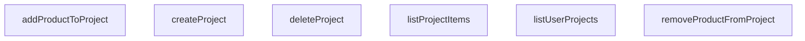

## Genel Bakış
VentHub HVAC platformunda kullanıcıların projelerini yönetmesini ve bu projelere ürün ekleyip çıkarmasını sağlayan bir servis modülüdür. Modül, Supabase veritabanı üzerinden proje yaşam döngüsü (oluşturma, listeleme, silme) ve proje içeriği yönetimi (ürün ekleme, çıkarma, listeleme) işlemlerini merkezi olarak yürütür.

## Fonksiyon Grupları
### Proje Yaşam Döngüsü
Kullanıcının kendi projeleri üzerindeki temel CRUD (Oluştur, Oku, Güncelle, Sil) işlemlerini yönetir; projenin varoluşundan silinmesine kadar olan tüm adımları kapsar.
- listUserProjects, createProject, deleteProject

### Proje Ürün Yönetimi
Oluşturulmuş bir projeye bağlı ürünlerin eklenmesi, çıkarılması ve projenin mevcut içeriğinin sorgulanması gibi proje detayıyla ilgili işlemleri yürütür.
- addProductToProject, removeProductFromProject, listProjectItems

---

## AXIOMS – Mimari Varsayımlar

Bu modül, Supabase tabanlı bir proje yönetim servisidir ve fonksiyon imzalarından çıkarılan aşağıdaki mimari varsayımlara dayanır.

**[Aksiyom 1]:** Eğer `SupabaseClient<Database>` parametresi geçerli ve oturum açmış (authenticated) bir istemci değilse, tüm veritabanı işlemleri başarısız olur veya boş sonuç döner.

**[Aksiyom 2]:** Eğer `listUserProjects` fonksiyonu çağrıldığında aktif bir kullanıcı oturumu (session) yoksa, kullanıcının projeleri listelenemez (boş dizi döner veya hata oluşur).

**[Aksiyom 3]:** Eğer `deleteProject` için verilen `id` parametresi mevcut bir projeye ait değilse, silinecek kayıt bulunamaz ve değişiklik yapılamaz.

**[Aksiyom 4]:** Eğer `addProductToProject` için verilen `projectId` mevcut bir proje değilse, referans bütünlüğü ihlali (foreign key violation) oluşur.

**[Aksiyom 5]:** Eğer `addProductToProject` için verilen `productId` mevcut bir ürün değilse, referans bütünlüğü ihlali oluşur.

**[Aksiyom 6]:** Eğer `addProductToProject` için `quantity` parametresi pozitif bir sayı değilse (0 veya negatif), anlamsız bir ürün-miktar ilişkisi oluşturulur.

**[Aksiyom 7]:** Eğer `removeProductFromProject` için verilen `projectId` veya `productId` kombinasyonu mevcut bir proje-ürün ilişkisi değilse, kaldırılacak kayıt bulunamaz.

**[Aksiyom 8]:** Eğer `createProject` için verilen `TablesInsert<'user_projects'>` verisi gerekli alanları (zorunlu kolonları) içermiyorsa, veritabanı insert işlemi başarısız olur.

**[Aksiyom 9]:** Eğer `listProjectItems` için verilen `projectId` mevcut bir projeye ait değilse, boş sonuç kümesi döner veya hata oluşur.

**[Aksiyom 10]:** Fonksiyon imzalarında proje sahiplik doğrulaması (ownership check) uygulama katmanında görünmemektedir; eğer Supabase Row-Level Security (RLS) politikaları tanımlı değilse, kullanıcılar başkalarının projelerine erişebilir.

---

## FONKSİYON DETAYLARI

### listUserProjects
**Ne yapar**: Kimliği doğrulanmış mevcut kullanıcıya ait tüm projeleri getirir.
**Nasıl yapar**: Supabase istemcisi aracılığıyla 'user_projects' tablosundaki tüm kayıtları, `updated_at` alanına göre azalan sırayla (en son güncellenen üstte) sorgular. Sorgu sonucunda veri yoksa boş bir dizi döner, hata oluşursa fırlatır.
**Parametreler**:
- `supabase`: SupabaseClient<Database> — Etkin Supabase istemci örneği.
**Dönüş**: `Promise<DbUserProject[]>` — Kullanıcının proje kayıtlarının bir dizisi; eğer proje yoksa boş bir dizi döner.

### createProject
**Ne yapar**: Kimliği doğrulanmış kullanıcı için yeni bir proje oluşturur.
**Nasıl yapar**: Verilen proje detaylarını kullanarak 'user_projects' tablosuna yeni bir satır ekler, eklenen kaydı (`select().single()`) döndürür. İşlem başarısız olursa bir hata fırlatır.
**Parametreler**:
- `supabase`: SupabaseClient<Database> — Etkin Supabase istemci örneği.
- `project`: TablesInsert<'user_projects'> — Veritabanı şemasıyla eşleşen eklenecek proje detayları.
**Dönüş**: `Promise<DbUserProject>` — Yeni oluşturulan kullanıcı projesi kaydı.

### deleteProject
**Ne yapar**: Belirtilen projeyi ve ilişkili tüm öğelerini siler (kaskad silme genellikle veritabanı tarafından işlenir).
**Nasıl yapar**: Verilen `id` ile eşleşen kaydı 'user_projects' tablosundan siler. İşlem başarılı olursa `true` döner, aksi takdirde hata fırlatır.
**Parametreler**:
- `supabase`: SupabaseClient<Database> — Etkin Supabase istemci örneği.
- `id`: string — Silineceğin projenin benzersiz tanımlayıcısı.
**Dönüş**: `Promise<boolean>` — Silme işlemi başarılı olursa `true`.

### addProductToProject
**Ne yapar**: Belirli bir ürünü, belirtilen miktarda (varsayılan olarak 1) bir kullanıcı projesine ekler.
**Nasıl yapar**: 'project_items' tablosuna `project_id`, `product_id` ve `quantity` alanlarını içeren yeni bir satır ekler ve eklenen kaydı döndürür.
**Parametreler**:
- `supabase`: SupabaseClient<Database> — Etkin Supabase istemci örneği.
- `projectId`: string — Hedef projenin benzersiz tanımlayıcısı.
- `productId`: string — Eklenen ürünün benzersiz tanımlayıcısı.
- `quantity`: number — Eklenecek birim sayısı (varsayılan 1).
**Dönüş**: `Promise<DbProjectItem>` — Yeni oluşturulan proje öğesi kaydı.

### removeProductFromProject
**Ne yapar**: Belirli bir ürünü belirtilen bir kullanıcı projesinden kaldırır.
**Nasıl yapar**: 'project_items' tablosunda, hem `project_id` hem de `product_id` alanları eşleşen kaydı siler. İşlem başarılı olursa `true` döner.
**Parametreler**:
- `supabase`: SupabaseClient<Database> — Etkin Supabase istemci örneği.
- `projectId`: string — Hedef projenin benzersiz tanımlayıcısı.
- `productId`: string — Kaldırılacak ürünün benzersiz tanımlayıcısı.
**Dönüş**: `Promise<boolean>` — Kaldırma işlemi başarılı olursa `true`.

### listProjectItems
**Ne yapar**: Belirli bir projedeki tüm öğeleri, karşılık gelen alan ürün verileriyle birlikte getirir.
**Nasıl yapar**: 'project_items' tablosunu 'products' tablosu ile birleştirerek (join) belirtilen `project_id` ile eşleşen tüm satırları çeker. Elde edilen her bir öğe, `mapDatabaseProductToDomain` yardımıyla zenginleştirilerek `product` alanı eklenmiş halde döndürülür.
**Parametreler**:
- `supabase`: SupabaseClient<Database> — Etkin Supabase istemci örneği.
- `projectId`: string — Hedef projenin benzersiz tanımlayıcısı.
**Dönüş**: `Promise<ProjectItem[]>` — Her biri tam ürün detaylarıyla zenginleştirilmiş proje öğelerinin bir dizisi.

---

## AST POINTERS

### [N1_NASIL] AST Pointer: project.service.ts::listUserProjects
- **params**: (supabase: SupabaseClient<Database>)
- **ic_degiskenler**:
  - `data` — Supabase'den `user_projects` tablosuna yapılan sorgunun成功的 sonucunu tutar (Proje nesneleri dizisi veya null).
  - `error` — Supabase sorgusu sırasında oluşabilecek hatayı tutar (null veya Error nesnesi).
- **Dönüş**: `Promise<DbUserProject[]>` — Hata fırlatmazsa, sıralanmış proje listesini veya boş bir dizi döndürür.

### [N2_NASIL] AST Pointer: project.service.ts::createProject
- **params**: (supabase: SupabaseClient<Database>, project: TablesInsert<'user_projects'>)
- **ic_degiskenler**:
  - `data` — Yeni oluşturulan projenin tam verisini tutar (tek bir DbUserProject nesnesi veya null).
  - `error` — `insert` ve `select` işlemleri sırasında oluşabilecek hatayı tutar (null veya Error nesnesi).
- **Dönüş**: `Promise<DbUserProject>` — Hata fırlatmazsa, yeni oluşturulan projenin verisini döndürür.

### [N3_NASIL] AST Pointer: project.service.ts::deleteProject
- **params**: (supabase: SupabaseClient<Database>, id: string)
- **ic_degiskenler**:
  - `error` — Belirtilen `id`'ye sahip projeyi silme işlemi sırasında oluşabilecek hatayı tutar (null veya Error nesnesi).
- **Dönüş**: `Promise<boolean>` — Hata fırlatmazsa `true` döndürerek silme işleminin başarılı olduğunu belirtir.

### [N4_NASIL] AST Pointer: project.service.ts::addProductToProject
- **params**: (supabase: SupabaseClient<Database>, projectId: string, productId: string, quantity: number = 1)
- **ic_degiskenler**:
  - `data` — Yeni eklenen proje ürününün tam verisini tutar (tek bir DbProjectItem nesnesi veya null).
  - `error` — `project_items` tablosuna `insert` ve ardından `select` işlemleri sırasında oluşabilecek hatayı tutar (null veya Error nesnesi).
- **Dönüş**: `Promise<DbProjectItem>` — Hata fırlatmazsa, yeni eklenen proje ürününün verisini döndürür.

### [N5_NASIL] AST Pointer: project.service.ts::removeProductFromProject
- **params**: (supabase: SupabaseClient<Database>, projectId: string, productId: string)
- **ic_degiskenler**:
  - `error` — Belirtilen `projectId` ve `productId`'ye sahip ürünü `project_items` tablosundan silme işlemi sırasında oluşabilecek hatayı tutar (null veya Error nesnesi).
- **Dönüş**: `Promise<boolean>` — Hata fırlatmazsa `true` döndürerek silme işleminin başarılı olduğunu belirtir.

### [N6_NASIL] AST Pointer: project.service.ts::listProjectItems
- **params**: (supabase: SupabaseClient<Database>, projectId: string)
- **ic_degiskenler**:
  - `data` — Supabase'den `project_items` tablosu ile `products` tablosunu birleştiren (join) sorgunun sonucunu tutar (ilişkili veri dizisi veya null).
  - `error` — Birleşik (join) sorgu ve `eq` filtresi uygulanırken oluşabilecek hatayı tutar (null veya Error nesnesi).
  - `items` — `data` dizisinin null olma ihtimaline karşı `|| []` ile安全 hale getirilmiş ve `(DbProjectItem & { product: DbProduct | null })[]` türüne dönüştürülmüş halini tutar.
- **Dönüş**: `Promise<ProjectItem[]>` — Hata fırlatmazsa, her bir `item` üzerinde `.map` ile dönüştürülmüş ve `product` alanı `mapDatabaseProductToDomain` ile alan-aralıklı (domain) modele dönüştürülmüş proje ürünü listesini döndürür.

---

## MERMAID CALL GRAPH

## NODE ID STANDARD

  file: src\lib\services\project.service.ts
  function: src\lib\services\project.service.ts::listUserProjects
  function: src\lib\services\project.service.ts::createProject
  function: src\lib\services\project.service.ts::deleteProject
  function: src\lib\services\project.service.ts::addProductToProject
  function: src\lib\services\project.service.ts::removeProductFromProject
  function: src\lib\services\project.service.ts::listProjectItems

---

## DISA AKTARILANLAR (EXPORTS)
  export: addProductToProject
  export: createProject
  export: deleteProject
  export: listProjectItems
  export: listUserProjects
  export: removeProductFromProject