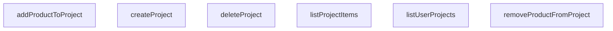

## Genel Bakış
VentHub HVAC platformunun merkezi proje yönetim servisi olarak çalışan bu modül, kullanıcıların oluşturduğu projelerin ve bu projelere ekledikleri ürünlerin tüm veritabanı işlemlerini tek noktadan yönetir. Ön yüz bileşenlerine tutarlı bir arayüz sunarak kullanıcı özelinde proje erişimi ve proje içeriği yönetimini güvenli şekilde gerçekleştirir.

## Fonksiyon Grupları
### Temel Proje Yaşam Döngüsü İşlemleri
Kullanıcının kendi projeleriyle ilgili temel işlemleri yürütür, projelerin oluşturulmasından silinmesine kadar tüm lifecycle adımlarını yönetir.
- listUserProjects, createProject, deleteProject

### Proje İçerik Yönetimi
Mevcut bir projeye ait ürünlerin yönetimini üstlenir, projeye ürün ekleme, çıkarma ve projeye ait tüm ürünleri listeleme işlemlerini gerçekleştirir.
- addProductToProject, removeProductFromProject, listProjectItems

---

## AXIOMS – Mimari Varsayımlar
Bu modül, kullanıcıların kendi projelerini oluşturup yönetmesini, projelere ürün ekleyip çıkarılmasını sağlayan iş servisidir; tüm fonksiyonlarının doğru çalışması için veritabanı erişimi, kullanıcı yetkilendirmesi ve geçerli giriş parametrelerinin varlığı zorunludur.

[Aksiyom 1]: Eğer servisin eriştiği veritabanındaki 'user_projects' ve ilişkili proje öğeleri tablolarına okuma/yazma izni yoksa, tüm proje listeleme, oluşturma, silme ve ürün ekleme/çıkarma işlemleri başarısız olur.
[Aksiyom 2]: Eğer createProject fonksiyonuna gönderilen proje nesnesi, 'user_projects' tablosunun zorunlu alanlarını içermiyorsa, proje oluşturma işlemi veritabanı doğrulama hatasıyla başarısız olur.
[Aksiyom 3]: Eğer deleteProject, addProductToProject, removeProductFromProject, listProjectItems fonksiyonlarına gönderilen projeId veya productId parametreleri geçerli string formatında değilse, hedef kaynağa ulaşılamadığı için ilgili işlem başarısız olur.
[Aksiyom 4]: Eğer addProductToProject fonksiyonuna gönderilen quantity parametresi 0'dan büyük sayısal bir değer değilse, projeye ürün ekleme işlemi geçersiz miktar verisiyle başarısız olur veya yanlış kaydedilir.
[Aksiyom 5]: Eğer işlemi gerçekleştiren kullanıcının ilgili proje üzerinde erişim ve değişiklik yapma yetkisi yoksa, tüm projeye özel işlemler yetki hatasıyla başarısız olur.
[Aksiyom 6]: Eğer addProductToProject fonksiyonunda iletilen productId sistemdeki mevcut ürünler kataloğunda bulunmuyorsa, var olmayan ürün projeye eklenemediği için işlem başarısız olur.

---

## FONKSIYON DETAYLARI

### listUserProjects
**Ne yapar**: Mevcut oturumu açık, kimliği doğrulanmış kullanıcıya ait tüm projeleri getirir. Projeler son güncellenme zaman damgasına göre azalan sırada sıralanarak döndürülür, kullanıcıya ait hiç proje yoksa boş bir dizi döndürülür.
**Nasıl yapar**: Doğrulanmış kullanıcının kimliği temel alınarak veritabanında sorgu çalıştırır, elde edilen proje kayıtlarını son güncelleme zamanına göre sıralar ve kullanıcıya sunar. Veritabanı sorgusunda herhangi bir hata oluşması durumunda işlem Error fırlatarak sonlanır.
**Parametreler**: Bu fonksiyon herhangi bir dış parametre almaz.
**Dönüş**: Promise<DbUserProject[]> tipinde bir değer döndürür. Promise çözüldüğünde kullanıcıya ait tüm proje kayıtlarını içeren bir dizi elde edilir, hiç proje yoksa boş dizi döner. Veritabanı sorgusu başarısız olursa Error fırlatır.

### createProject
**Ne yapar**: Oturumu açık kimliği doğrulanmış kullanıcı için yeni bir proje oluşturur. Gelen proje detaylarının veritabanı şemasına uygunluğu kontrol edilerek yeni kayıt oluşturulur, oluşturulan yeni proje kaydı tam olarak geri döndürülür.
**Nasıl yapar**: Fonksiyona iletilen proje detaylarını veritabanının user_projects tablosunun ekleme şemasına uygun olarak kaydeder, ekleme işlemi sonrası oluşturulan tam proje kaydını kullanıcıya iletir. Veritabanına ekleme işlemi başarısız olursa işlem Error fırlatarak sonlanır.
**Parametreler**:
- project: TablesInsert<'user_projects'> — Veritabanı şemasına uygun, eklenecek yeni projenin tüm detaylarını içeren nesne
**Dönüş**: Promise<DbUserProject> tipinde bir değer döndürür. Promise çözüldüğünde yeni oluşturulan tam proje kaydı elde edilir. Veritabanı ekleme işlemi başarısız olursa Error fırlatır.

### deleteProject
**Ne yapar**: Kullanıcıya ait belirli bir projeyi ve projeyle ilişkili tüm öğeleri siler. Projeye ait bağımlı kayıtların silinmesi genellikle veritabanı seviyesindeki ardışık silme (cascade) mekanizmasıyla yönetilir. Silme işlemi başarılı olursa olumlu sonuç döndürülür.
**Nasıl yapar**: Fonksiyona iletilen benzersiz proje kimliği üzerinden veritabanında silme sorgusu çalıştırır, projeye ait tüm bağımlı kayıtların silinmesini veritabanının yerleşik cascade özelliği ile otomatik olarak yönetir. Silme işlemi başarısız olursa işlem Error fırlatarak sonlanır.
**Parametreler**:
- id: string — Silinecek projenin benzersiz kimlik değeri
**Dönüş**: Promise<boolean> tipinde bir değer döndürür. Promise çözüldüğünde silme işlemi başarılıysa true değeri elde edilir. Veritabanı silme işlemi başarısız olursa Error fırlatır.

### addProductToProject
**Ne yapar**: Kullanıcı projesine belirli bir ürünü, istenilen adet miktarıyla ekler. Adet parametresi isteğe bağlıdır, belirtilmediği takdirde varsayılan olarak 1 değeri atanır. Yeni eklenen proje öğesi kaydı tam olarak geri döndürülür.
**Nasıl yapar**: İletilen proje kimliği, ürün kimliği ve adet değerleriyle veritabanında yeni bir proje öğesi kaydı oluşturur. Ekleme işlemi sırasında herhangi bir hatayla karşılaşılması durumunda işlem Error fırlatarak sonlanır.
**Parametreler**:
- projectId: string — Ürünün ekleneceği hedef projenin benzersiz kimlik değeri
- productId: string — Projeye eklenecek ürünün benzersiz kimlik değeri
- quantity: number — Projeye eklenecek ürün adedi, varsayılan olarak 1 değerini alır
**Dönüş**: Promise<DbProjectItem> tipinde bir değer döndürür. Promise çözüldüğünde yeni oluşturulan tam proje öğesi kaydı elde edilir. Veritabanı ekleme işlemi başarısız olursa Error fırlatır.

### removeProductFromProject
**Ne yapar**: Kullanıcı projesinden belirli bir ürünü tamamen kaldırır. Hedef proje ve kaldırılacak ürün kimlikleri üzerinden ilgili proje öğesi kaydı veritabanından silinir, silme işlemi başarılı olursa olumlu sonuç döndürülür.
**Nasıl yapar**: İletilen proje kimliği ve ürün kimliği ile eşleşen proje öğesi kaydını bulmak için veritabanı sorgusu çalıştırır, eşleşen kaydı kalıcı olarak siler. Silme işlemi sırasında herhangi bir hatayla karşılaşılması durumunda işlem Error fırlatarak sonlanır.
**Parametreler**:
- projectId: string — Ürünün kaldırılacağı hedef projenin benzersiz kimlik değeri
- productId: string — Projeden kaldırılacak ürünün benzersiz kimlik değeri
**Dönüş**: Promise<boolean> tipinde bir değer döndürür. Promise çözüldüğünde silme işlemi başarılıysa true değeri elde edilir. Veritabanı silme işlemi başarısız olursa Error fırlatır.

### listProjectItems
**Ne yapar**: Belirtilen proje içindeki tüm öğeleri, her öğeye ait ilgili alan ürün verileriyle birleştirilerek zenginleştirilmiş şekilde getirir. Projedeki her öğenin tüm ürün detaylarına erişilebilir hale gelmesi sağlanır, hiç öğe yoksa boş dizi döndürülür.
**Nasıl yapar**: İletilen proje kimliği üzerinden veritabanında birleştirme (join) içeren sorgu çalıştırır, proje öğeleri tablosunu ürünler tablosuyla ilişkilendirerek her öğenin tam ürün detaylarını içeren bir dizi oluşturur. Sorgu çalışması sırasında herhangi bir hatayla karşılaşılması durumunda işlem Error fırlatarak sonlanır.
**Parametreler**:
- projectId: string — Tüm öğeleri getirilecek hedef projenin benzersiz kimlik değeri
**Dönüş**: Promise<ProjectItem[]> tipinde bir değer döndürür. Promise çözüldüğünde her biri kendi tam ürün detaylarıyla zenginleştirilmiş proje öğeleri dizisi elde edilir. Veritabanı sorgusu başarısız olursa Error fırlatır.

---

## AST POINTERS

### [N1_NASIL] AST Pointer: C:\Users\alize\venthub-hvac\src\lib\services\project.service.ts::listUserProjects
- **params**: (parametre yok)
- **ic_degiskenler**:
  - `data` — supabase.user_projects sorgusundan dönen tüm proje satırları verisi
  - `error` — supabase sorgusu sırasında oluşan hata nesnesi
- **Dönüş**: Promise<DbUserProject[]>

### [N2_NASIL] AST Pointer: C:\Users\alize\venthub-hvac\src\lib\services\project.service.ts::createProject
- **params**: [project: TablesInsert<'user_projects'>]
- **ic_degiskenler**:
  - `data` — supabase.user_projects ekleme işlemi sonrası oluşturulan proje satırı verisi
  - `error` — supabase sorgusu sırasında oluşan hata nesnesi
- **Dönüş**: Promise<DbUserProject>

### [N3_NASIL] AST Pointer: C:\Users\alize\venthub-hvac\src\lib\services\project.service.ts::deleteProject
- **params**: [id: string]
- **ic_degiskenler**:
  - `error` — supabase proje silme sorgusu sırasında oluşan hata nesnesi
- **Dönüş**: Promise<boolean>

### [N4_NASIL] AST Pointer: C:\Users\alize\venthub-hvac\src\lib\services\project.service.ts::addProductToProject
- **params**: [projectId: string, productId: string, quantity: number]
- **ic_degiskenler**:
  - `data` — supabase.project_items ekleme işlemi sonrası oluşturulan proje öğesi satırı verisi
  - `error` — supabase sorgusu sırasında oluşan hata nesnesi
- **Dönüş**: Promise<DbProjectItem>

### [N5_NASIL] AST Pointer: C:\Users\alize\venthub-hvac\src\lib\services\project.service.ts::removeProductFromProject
- **params**: [projectId: string, productId: string]
- **ic_degiskenler**:
  - `error` — supabase proje öğesi silme sorgusu sırasında oluşan hata nesnesi
- **Dönüş**: Promise<boolean>

### [N6_NASIL] AST Pointer: C:\Users\alize\venthub-hvac\src\lib\services\project.service.ts::listProjectItems
- **params**: [projectId: string]
- **ic_degiskenler**:
  - `data` — supabase.project_items ve ilişkili products tablosu verilerini içeren sorgu sonucu
  - `error` — supabase sorgusu sırasında oluşan hata nesnesi
  - `items` — ham veritabanı verilerini tip dönüşümü için saklayan işlenmemiş proje öğeleri listesi
  - `item` — map fonksiyonu içinde işlenen her bir proje öğesi nesnesi
  - `item.product` — her proje öğesine ait ilişkili ürün verisi
  - `mapDatabaseProductToDomain` — ürün verisini veritabanı formatından domain formatına dönüştüren yardımcı fonksiyon çağrısı
- **Dönüş**: Promise<ProjectItem[]>

---

## MERMAID CALL GRAPH

## NODE ID STANDARD

  file: src\lib\services\project.service.ts
  function: src\lib\services\project.service.ts::listUserProjects
  function: src\lib\services\project.service.ts::createProject
  function: src\lib\services\project.service.ts::deleteProject
  function: src\lib\services\project.service.ts::addProductToProject
  function: src\lib\services\project.service.ts::removeProductFromProject
  function: src\lib\services\project.service.ts::listProjectItems

---

## DISA AKTARILANLAR (EXPORTS)
  export: addProductToProject
  export: createProject
  export: deleteProject
  export: listProjectItems
  export: listUserProjects
  export: removeProductFromProject