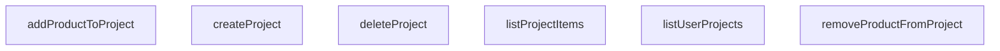

## Genel Bakış
VentHub HVAC platformunda kullanıcıların projelerini ve bu projelerin içeriklerini yönetmesini sağlayan servis modülüdür. Supabase veritabanı üzerinde proje oluşturma, listeleme ve silme işlemlerinin yanı sıra, projelere ürün ekleme/çıkarma ve proje içeriğini sorgulama gibi operasyonları merkezi bir noktadan yürütür.

## Fonksiyon Grupları
### Proje Yaşam Döngüsü
Kullanıcının projeleri üzerindeki temel yönetimsel işlemlerini (oluşturma, listeleme, silme) kapsar. Bu fonksiyonlar bir projenin varoluş süresince geçirdiği tüm durumları yönetir.
- listUserProjects, createProject, deleteProject

### Proje Ürün Yönetimi
Oluşturulmuş bir projenin içeriğine ilişkin işlemleri yürütür; ürün ekleme, çıkarma ve projedeki mevcut ürünlerin listelenmesini sağlar. Bu grup, projelerin teknik içeriğini ve malzeme listelerini yönetmekten sorumludur.
- addProductToProject, removeProductFromProject, listProjectItems

---

## AXIOMS – Mimari Varsayımlar
Bu modül, Supabase veritabanı üzerinden proje ve proje-ürün ilişkilerini yöneten bir servis katmanıdır. Aşağıda, modülün doğru çalışması için gerekli olan temel mimari varsayımlar listelenmektedir.

[Aksiyom 1]: Eğer `supabase` parametresi ile verilen `SupabaseClient` nesnesi, `Database` tipiyle tutarlı ve geçerli bir veritabanı şemasına sahip değilse, tüm veritabanı işlemleri başarısız olur.

[Aksiyom 2]: Eğer `user_projects` tablosu (veya bu tabloya karşılık gelen veritabanı tablosu) veritabanında mevcut değilse, `createProject` fonksiyonu hata ile sonuçlanır.

[Aksiyom 3]: Eğer `addProductToProject` fonksiyonunda verilen `quantity` parametresi, pozitif bir tamsayı değilse, bu eylem iş mantığı açısından geçersizdir (not: fonksiyon imzasında pozitiflik zorunluluğu açıkça belirtilmemiştir, bu bir iş kuralı varsayımıdır).

[Aksiyom 4]: Eğer `projectId` parametresi ile belirtilen proje, `user_projects` tablosunda mevcut değilse veya oturumdaki kullanıcıya ait değilse (eğer iş kuralları buna izin vermiyorsa), `deleteProject`, `addProductToProject`, `removeProductFromProject` ve `listProjectItems` fonksiyonları başarısız olur.

[Aksiyom 5]: Eğer `productId` parametresi ile belirtilen ürün, ürünlere ait tabloda (ürün tablosu adı fonksiyon imzasından çıkarılamamaktadır) mevcut değilse, `addProductToProject` fonksiyonu başarısız olur.

[Aksiyom 6]: Eğer `listUserProjects` fonksiyonu çağrıldığında, `supabase` client'ındaki oturumda kimliği doğrulanmış bir kullanıcı (auth.uid()) yoksa, fonksiyon kullanıcıya ait projeleri filtreleyemez ve boş bir liste dönme riski veya hata oluşur.

[Aksiyom 7]: Eğer `project` parametresi, `TablesInsert<'user_projects'>` tipine uygun (zorunlu alanları içeren) bir nesne değilse, `createProject` fonksiyonu başarısız olur.

[Aksiyom 8]: Eğer `projectId` ve `productId` kombinasyonu, proje-ürün ilişki tablosunda (örn: `project_items` veya benzeri bir tablo, adı fonksiyon imzasından bilinmemektedir) zaten mevcut değilse, `removeProductFromProject` fonksiyonu hiçbir satırı etkilemez (sessizce başarısız olabilir veya hata dönebilir).

---

## FONKSİYON DETAYLARI

### listUserProjects
**Ne yapar**: Kimliği doğrulanmış mevcut kullanıcıya ait tüm projeleri getirir.
**Nasıl yapar**: Supabase istemcisi aracılığıyla 'user_projects' tablosundaki tüm kayıtları, `updated_at` alanına göre azalan sırayla (en son güncellenen üstte) sorgular. Sorgu sonucunda veri yoksa boş bir dizi döner, hata oluşursa fırlatır.
**Parametreler**:
- `supabase`: SupabaseClient<Database> — Etkin Supabase istemci örneği.
**Dönüş**: `Promise<DbUserProject[]>` — Kullanıcının proje kayıtlarının bir dizisi; eğer proje yoksa boş bir dizi döner.

### createProject
**Ne yapar**: Kimliği doğrulanmış kullanıcı için yeni bir proje oluşturur.
**Nasıl yapar**: Verilen proje detaylarını kullanarak 'user_projects' tablosuna yeni bir satır ekler, eklenen kaydı (`select().single()`) döndürür. İşlem başarısız olursa bir hata fırlatır.
**Parametreler**:
- `supabase`: SupabaseClient<Database> — Etkin Supabase istemci örneği.
- `project`: TablesInsert<'user_projects'> — Veritabanı şemasıyla eşleşen eklenecek proje detayları.
**Dönüş**: `Promise<DbUserProject>` — Yeni oluşturulan kullanıcı projesi kaydı.

### deleteProject
**Ne yapar**: Belirtilen projeyi ve ilişkili tüm öğelerini siler (kaskad silme genellikle veritabanı tarafından işlenir).
**Nasıl yapar**: Verilen `id` ile eşleşen kaydı 'user_projects' tablosundan siler. İşlem başarılı olursa `true` döner, aksi takdirde hata fırlatır.
**Parametreler**:
- `supabase`: SupabaseClient<Database> — Etkin Supabase istemci örneği.
- `id`: string — Silineceğin projenin benzersiz tanımlayıcısı.
**Dönüş**: `Promise<boolean>` — Silme işlemi başarılı olursa `true`.

### addProductToProject
**Ne yapar**: Belirli bir ürünü, belirtilen miktarda (varsayılan olarak 1) bir kullanıcı projesine ekler.
**Nasıl yapar**: 'project_items' tablosuna `project_id`, `product_id` ve `quantity` alanlarını içeren yeni bir satır ekler ve eklenen kaydı döndürür.
**Parametreler**:
- `supabase`: SupabaseClient<Database> — Etkin Supabase istemci örneği.
- `projectId`: string — Hedef projenin benzersiz tanımlayıcısı.
- `productId`: string — Eklenen ürünün benzersiz tanımlayıcısı.
- `quantity`: number — Eklenecek birim sayısı (varsayılan 1).
**Dönüş**: `Promise<DbProjectItem>` — Yeni oluşturulan proje öğesi kaydı.

### removeProductFromProject
**Ne yapar**: Belirli bir ürünü belirtilen bir kullanıcı projesinden kaldırır.
**Nasıl yapar**: 'project_items' tablosunda, hem `project_id` hem de `product_id` alanları eşleşen kaydı siler. İşlem başarılı olursa `true` döner.
**Parametreler**:
- `supabase`: SupabaseClient<Database> — Etkin Supabase istemci örneği.
- `projectId`: string — Hedef projenin benzersiz tanımlayıcısı.
- `productId`: string — Kaldırılacak ürünün benzersiz tanımlayıcısı.
**Dönüş**: `Promise<boolean>` — Kaldırma işlemi başarılı olursa `true`.

### listProjectItems
**Ne yapar**: Belirli bir projedeki tüm öğeleri, karşılık gelen alan ürün verileriyle birlikte getirir.
**Nasıl yapar**: 'project_items' tablosunu 'products' tablosu ile birleştirerek (join) belirtilen `project_id` ile eşleşen tüm satırları çeker. Elde edilen her bir öğe, `mapDatabaseProductToDomain` yardımıyla zenginleştirilerek `product` alanı eklenmiş halde döndürülür.
**Parametreler**:
- `supabase`: SupabaseClient<Database> — Etkin Supabase istemci örneği.
- `projectId`: string — Hedef projenin benzersiz tanımlayıcısı.
**Dönüş**: `Promise<ProjectItem[]>` — Her biri tam ürün detaylarıyla zenginleştirilmiş proje öğelerinin bir dizisi.

---

## AST POINTERS

### [N1_NASIL] AST Pointer: project.service.ts::listUserProjects
- **params**: (supabase: SupabaseClient<Database>)
- **ic_degiskenler**:
  - `data` — supabase.from('user_projects').select('*').order(...) sorgusundan dönen satır listesi
  - `error` — sorgu sırasında oluşabilecek hata nesnesi; fırlatılır (throw)
- **Dönüş**: DbUserProject[] — kullanıcının tüm projeleri (updated_at azalan sırayla)

### [N2_NASIL] AST Pointer: project.service.ts::createProject
- **params**: (supabase: SupabaseClient<Database>, project: TablesInsert<'user_projects'>)
- **ic_degiskenler**:
  - `data` — insert sonrası select().single() ile dönen tek satır; yeni oluşturulan proje
  - `error` — insert sırasında oluşabilecek hata nesnesi; fırlatılır (throw)
- **Dönüş**: DbUserProject — newly inserted project

### [N3_NASIL] AST Pointer: project.service.ts::deleteProject
- **params**: (supabase: SupabaseClient<Database>, id: string)
- **ic_degiskenler**:
  - `error` — delete().eq('id', id) sırasında oluşabilecek hata nesnesi; fırlatılır (throw)
- **Dönüş**: boolean — başarıyla silindiyse true

### [N4_NASIL] AST Pointer: project.service.ts::addProductToProject
- **params**: (supabase: SupabaseClient<Database>, projectId: string, productId: string, quantity: number)
- **ic_degiskenler**:
  - `data` — insert({ project_id: projectId, product_id: productId, quantity }).select().single() ile dönen tek satır; eklenen proje kalemi
  - `error` — insert sırasında oluşabilecek hata nesnesi; fırlatılır (throw)
- **Dönüş**: DbProjectItem — newly inserted project item

### [N5_NASIL] AST Pointer: project.service.ts::removeProductFromProject
- **params**: (supabase: SupabaseClient<Database>, projectId: string, productId: string)
- **ic_degiskenler**:
  - `error` — delete().match({ project_id, product_id }) sırasında oluşabilecek hata nesnesi; fırlatılır (throw)
- **Dönüş**: boolean — başarıyla silindiyse true

### [N6_NASIL] AST Pointer: project.service.ts::listProjectItems
- **params**: (supabase: SupabaseClient<Database>, projectId: string)
- **ic_degiskenler**:
  - `data` — select('*, product:products(*)').eq('project_id', projectId) sorgusundan dönen satır listesi; product ilişkisi dahil
  - `error` — sorgu sırasında oluşabilecek hata nesnesi; fırlatılır (throw)
  - `items` — data'nın (DbProjectItem & { product: DbProduct | null })[] olarak tiplendirilmiş hali; map işlemi için kullanılır
- **Dönüş**: ProjectItem[] — her kalem için product alanı mapDatabaseProductToDomain ile dönüştürülmüş UI model listesi

---

## MERMAID CALL GRAPH

## NODE ID STANDARD

  file: src\lib\services\project.service.ts
  function: src\lib\services\project.service.ts::listUserProjects
  function: src\lib\services\project.service.ts::createProject
  function: src\lib\services\project.service.ts::deleteProject
  function: src\lib\services\project.service.ts::addProductToProject
  function: src\lib\services\project.service.ts::removeProductFromProject
  function: src\lib\services\project.service.ts::listProjectItems

---

## DISA AKTARILANLAR (EXPORTS)
  export: addProductToProject
  export: createProject
  export: deleteProject
  export: listProjectItems
  export: listUserProjects
  export: removeProductFromProject