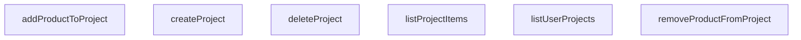

## Genel Bakış
VentHub HVAC platformunda kullanıcıların projelerini oluşturmalarını, yönetmelerini ve projelerine ürün ekleyip çıkarmalarını sağlayan merkezi bir proje yönetim servisidir. Bu modül, ön yüz bileşenlerinden gelen talepleri işleyerek kullanıcı bazlı proje erişimi ve proje içeriği yönetimini veritabanında güvenli ve tutarlı bir şekilde yürütür.

## Fonksiyon Grupları
### Temel Proje Yaşam Döngüsü İşlemleri
Kullanıcının kendi projeleriyle ilgili temel işlemleri yönetir; projelerin listelenmesinden oluşturulmasına ve silinmesine kadar tüm yaşam döngüsü adımlarını kontrol eder.
- listUserProjects, createProject, deleteProject

### Proje İçerik Yönetimi
Mevcut bir projeye bağlı ürünlerin yönetimini üstlenir; projeye ürün ekleme, projeden ürün çıkarma ve projeye ait tüm ürünleri listeleme işlemlerini gerçekleştirir.
- addProductToProject, removeProductFromProject, listProjectItems

---

---

## FONKSİYON DETAYLARI

### listUserProjects
**Ne yapar**: Kimliği doğrulanmış kullanıcının tüm projelerini getirir.
**Nasıl yapar**: Supabase istemcisi üzerinden `user_projects` tablosuna sorgu gönderir. Tüm projeleri (`*`) seçer ve `updated_at` alanına göre azalan sırada (`ascending: false`) sıralar. Veritabanı sorgusu başarılıysa elde edilen veriyi `DbUserProject[]` dizisine dönüştürerek döndürür; herhangi bir hata oluşursa hatayı fırlatır. Sorgu sonucunda veri yoksa boş bir dizi döner.
**Parametreler**: Bu fonksiyonun herhangi bir parametresi yoktur.
**Dönüş**: `Promise<DbUserProject[]>` — Kullanıcının projelerini temsil eden bir dizi döner. Kullanıcının projesi yoksa boş bir dizi döner.

### createProject
**Ne yapar**: Kimliği doğrulanmış kullanıcı için yeni bir proje oluşturur.
**Nasıl yapar**: Verilen proje nesnesini (`project`) `user_projects` tablosuna ekler. Ekledikten sonra `select()` ile eklenen kaydı geri çeker ve `.single()` ile tek bir kayıt olarak alır. Veritabanı ekleme işlemi başarılıysa yeni oluşan `DbUserProject` kaydını döndürür; bir hata oluşursa hatayı fırlatır.
**Parametreler**:
- project: `TablesInsert<'user_projects'>` — Veritabanı şemasıyla eşleşen, oluşturulacak projenin detaylarını içeren nesne.
**Dönüş**: `Promise<DbUserProject>` — Yeni oluşturulan kullanıcı projesi kaydını temsil eden bir nesne döner.

### deleteProject
**Ne yapar**: Belirtilen kimliğe sahip kullanıcı projesini ve ilişkili tüm öğelerini siler (kaskad silme veritabanı tarafından ele alınır).
**Nasıl yapar**: `user_projects` tablosunda `id` alanı verilen parametreye eşleşen kaydı siler. İşlem başarılıysa `true` değerini döndürür; bir hata oluşursa hatayı fırlatır.
**Parametreler**:
- id: `string` — Silinecek projenin benzersiz tanımlayıcısı.
**Dönüş**: `Promise<boolean>` — Silme işlemi başarılıysa `true` döner.

### addProductToProject
**Ne yapar**: Belirli bir ürünü, belirli bir projeye istenen miktar kadar ekler.
**Nasıl yapar**: `project_items` tablosuna, verilen `projectId`, `productId` ve `quantity` değerlerini içeren yeni bir kayıt ekler. Ekledikten sonra `select()` ile eklenen kaydı geri çeker ve `.single()` ile tek bir kayıt olarak alır. İşlem başarılıysa yeni oluşan `DbProjectItem` kaydını döndürür; bir hata oluşursa hatayı fırlatır. Miktar parametresi opsiyoneldir ve varsayılan olarak 1'dir.
**Parametreler**:
- projectId: `string` — Ürünün ekleneceği hedef projenin benzersiz tanımlayıcısı.
- productId: `string` — Eklenen ürünün benzersiz tanımlayıcısı.
- quantity: `number` — Eklenecek birim sayısı (varsayılan değer 1'dir).
**Dönüş**: `Promise<DbProjectItem>` — Yeni oluşan proje öğesi kaydını temsil eden bir nesne döner.

### removeProductFromProject
**Ne yapar**: Belirli bir projeden belirli bir ürünü kaldırır.
**Nasıl yapar**: `project_items` tablosunda `project_id` ve `product_id` alanları verilen parametrelere eşleşen kaydı siler. İşlem başarılıysa `true` değerini döndürür; bir hata oluşursa hatayı fırlatır.
**Parametreler**:
- projectId: `string` — Ürünün kaldırılacağı hedef projenin benzersiz tanımlayıcısı.
- productId: `string` — Kaldırılacak ürünün benzersiz tanımlayıcısı.
**Dönüş**: `Promise<boolean>` — Silme işlemi başarılıysa `true` döner.

### listProjectItems
**Ne yapar**: Belirli bir projedeki tüm ürünleri, karşılıklı gelen alan ürün verileriyle birlikte getirir.
**Nasıl yapar**: `project_items` tablosunda `project_id` alanı verilen parametreye eşleşen tüm kayıtları sorgular. `product:products(*)` seçimi ile her bir proje öğesinin ilişkili `products` tablosundaki tam verisini de (sol dış birleştirme) çeker. Sonuçta her bir `DbProjectItem` nesnesi, `product` alanı olarak ilgili `DbProduct` nesnesini içerir. Ham veritabanı verisi, `mapDatabaseProductToDomain` yardımcı fonksiyonu kullanılarak alan modeline dönüştürülür. Veritabanı sorgusu başarısız olursa hata fırlatılır.
**Parametreler**:
- projectId: `string` — Öğelerin getirileceği hedef projenin benzersiz tanımlayıcısı.
**Dönüş**: `Promise<ProjectItem[]>` — Her biri tam ürün ayrıntılarıyla zenginleştirilmiş proje öğelerini temsil eden bir dizi döner.

---

## AST POINTERS

### [N1_NASIL] AST Pointer: C:\Users\alize\venthub-hvac\src\lib\services\project.service.ts::listUserProjects
- **params**: (parametre yok)
- **ic_degiskenler**:
  - `data` — supabase.user_projects sorgusundan dönen tüm proje satırları verisi
  - `error` — supabase sorgusu sırasında oluşan hata nesnesi
- **Dönüş**: Promise<DbUserProject[]>

### [N2_NASIL] AST Pointer: C:\Users\alize\venthub-hvac\src\lib\services\project.service.ts::createProject
- **params**: [project: TablesInsert<'user_projects'>]
- **ic_degiskenler**:
  - `data` — supabase.user_projects ekleme işlemi sonrası oluşturulan proje satırı verisi
  - `error` — supabase sorgusu sırasında oluşan hata nesnesi
- **Dönüş**: Promise<DbUserProject>

### [N3_NASIL] AST Pointer: C:\Users\alize\venthub-hvac\src\lib\services\project.service.ts::deleteProject
- **params**: [id: string]
- **ic_degiskenler**:
  - `error` — supabase proje silme sorgusu sırasında oluşan hata nesnesi
- **Dönüş**: Promise<boolean>

### [N4_NASIL] AST Pointer: C:\Users\alize\venthub-hvac\src\lib\services\project.service.ts::addProductToProject
- **params**: [projectId: string, productId: string, quantity: number]
- **ic_degiskenler**:
  - `data` — supabase.project_items ekleme işlemi sonrası oluşturulan proje öğesi satırı verisi
  - `error` — supabase sorgusu sırasında oluşan hata nesnesi
- **Dönüş**: Promise<DbProjectItem>

### [N5_NASIL] AST Pointer: C:\Users\alize\venthub-hvac\src\lib\services\project.service.ts::removeProductFromProject
- **params**: [projectId: string, productId: string]
- **ic_degiskenler**:
  - `error` — supabase proje öğesi silme sorgusu sırasında oluşan hata nesnesi
- **Dönüş**: Promise<boolean>

### [N6_NASIL] AST Pointer: C:\Users\alize\venthub-hvac\src\lib\services\project.service.ts::listProjectItems
- **params**: [projectId: string]
- **ic_degiskenler**:
  - `data` — supabase.project_items ve ilişkili products tablosu verilerini içeren sorgu sonucu
  - `error` — supabase sorgusu sırasında oluşan hata nesnesi
  - `items` — ham veritabanı verilerini tip dönüşümü için saklayan işlenmemiş proje öğeleri listesi
  - `item` — map fonksiyonu içinde işlenen her bir proje öğesi nesnesi
  - `item.product` — her proje öğesine ait ilişkili ürün verisi
  - `mapDatabaseProductToDomain` — ürün verisini veritabanı formatından domain formatına dönüştüren yardımcı fonksiyon çağrısı
- **Dönüş**: Promise<ProjectItem[]>

---

## MERMAID CALL GRAPH

## NODE ID STANDARD

  file: src\lib\services\project.service.ts
  function: src\lib\services\project.service.ts::listUserProjects
  function: src\lib\services\project.service.ts::createProject
  function: src\lib\services\project.service.ts::deleteProject
  function: src\lib\services\project.service.ts::addProductToProject
  function: src\lib\services\project.service.ts::removeProductFromProject
  function: src\lib\services\project.service.ts::listProjectItems

---

## DISA AKTARILANLAR (EXPORTS)
  export: addProductToProject
  export: createProject
  export: deleteProject
  export: listProjectItems
  export: listUserProjects
  export: removeProductFromProject