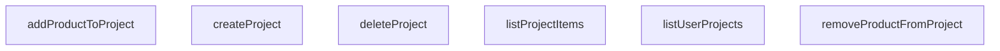

## Genel Bakış
VentHub HVAC platformunda kullanıcıların projelerini oluşturmasını, listelemesini ve silmesini sağlayan temel bir proje yönetim servisidir. Ayrıca her bir projeye ürün eklenmesi, çıkarılması ve proje içeriğinin sorgulanması gibi ürün bazlı yönetim işlemlerini destekler. Tüm fonksiyonlar Supabase istemcisi üzerinden veritabanıyla iletişim kurar ve kullanıcı oturumuna bağlı çalışır.

## Fonksiyon Grupları
### Proje Yaşam Döngüsü
Kullanıcının kendi projeleri üzerindeki temel CRUD işlemlerini yönetir; projenin varoluşundan silinmesine kadar olan tüm adımları kapsar.
- listUserProjects, createProject, deleteProject

### Proje Ürün Yönetimi
Oluşturulmuş bir projeye bağlı ürünlerin eklenmesi, çıkarılması ve listelenmesi gibi proje içeriğiyle ilgili işlemleri yürütür.
- addProductToProject, removeProductFromProject, listProjectItems

---

## AXIOMS – Mimari Varsayımlar

Bu modül, kullanıcıların proje oluşturmasını, yönetmesini ve projelere ürün eklemesini/çıkarmasını sağlayan bir servis katmanıdır. Aşağıdaki mimari varsayımlar, fonksiyon imzaları ve modül sabitlerinden türetilmiştir.

---

**[Aksiyom 1 – Supabase İstemci Bağımlılığı]:**
Tüm fonksiyonlar (`listUserProjects`, `createProject`, `deleteProject`, `addProductToProject`, `removeProductFromProject`, `listProjectItems`) zorunlu bir `supabase` parametresi alır. Eğer işlevsel bir Supabase istemcisi (veya geçerli bir bağlantı) sağlanmazsa, hiçbir veritabanı okuma/yazma işlemi gerçekleştirilemez ve fonksiyonlar başarısız olur.

---

**[Aksiyom 2 – `user_projects` Tablosu Varlığı]:**
`createProject` fonksiyonu `TablesInsert<'user_projects'>` tipinde bir parametre alır. Eğer Supabase veritabanında `user_projects` adında bir tablo (ilgili kolon tanımlarıyla birlikte) yoksa, proje oluşturma işlemleri veritabanı düzeyinde hata verir.

---

**[Aksiyom 3 – Proje Tanımlayıcı Zorunluluğu]:**
`deleteProject`, `addProductToProject`, `removeProductFromProject` ve `listProjectItems` fonksiyonlarının tümü bir `projectId: string` (veya `id: string`) parametresi alır. Eğer geçerli (mevcut ve doğru formatta) bir proje UUID'si sağlanmazsa, ilgili proje üzerindeki silme, ürün ekleme/çıkarma veya listelege Operations başarısız olur veya tutarsız veriye yol açar.

---

**[Aksiyom 4 – Ürün Tanımlayıcı Zorunluluğu]:**
`addProductToProject` ve `removeProductFromProject` fonksiyonları `productId: string` parametresi alır. Eğer geçerli (mevcut) bir ürün tanımlayıcısı sağlanmazsa, proje-ürün ilişkisi oluşturulamaz veya kaldırılamaz.

---

**[Aksiyom 5 – Miktar Sayısal Olmalı]:**
`addProductToProject` fonksiyonu `quantity: number` parametresi alır. Fonksiyon imzasında sıfır, negatif veya sıfırdan büyük olduğuna dair bir kısıt belirtilmemiştir; ancak miktarın `number` tipinde olması zorunludur. Eğer `quantity` sayısal bir değer olarak sağlanmazsa, fonksiyon imzası ihlal edilmiş olur.

---

**[Aksiyom 6 – Kullanıcı Bağlamı (Dolaylı):**
Fonksiyon isimleri (`listUserProjects`) ve tablo adı (`user_projects`) bir kullanıcı-proje ilişkisi olduğunu gösterir. Bu ilişkili operations'ların doğru çalışması için, sağlanan `supabase` istemcisinin geçerli bir kullanıcı oturumu/kimlik bağlamına sahip olması beklenir. Eğer böyle bir bağlam yoksa, kullanıcıya ait projelerin listelenmesi veya kullanıcıya ait projeye yazı yapılması anlam tutarsızlığına veya erişim hatasına yol açar.

---

**[Aksiyom 7 – `defaultClient` Ternary Mantığı]:**
Modül sabitleri arasında `defaultClient` adında bir ternary ifade (koşullu değer ataması) bulunmaktadır. Bu sabit, bir koşula bağlı olarak farklı bir Supabase istem

---

## FONKSİYON DETAYLARI

### listUserProjects
**Ne yapar**: Oturum açmış kullanıcıya ait tüm projeleri getirir. Proje listesi son güncelleme tarihine göre azalan sırada sıralanır.

**Nasıl yapar**: `user_projects` tablosundaki tüm kayıtları `updated_at` alanına göre azalan (en yeni en üstte) sırayla sorgular. Sorgu sonucunda hata oluşursa fırlatır, aksi halde veri dizisini döner.

**Parametreler**:
- `supabase` : `SupabaseClient` — Kullanılacak Supabase istemcisi. Belirtilmezse varsayılan istemci (`defaultClient`) kullanılır.

**Dönüş**: `Promise<DbUserProject[]>` — Kullanıcının projelerinin bir dizisi. Kullanıcının hiç projesi yoksa boş bir dizi döner.

### createProject
**Ne yapar**: Kimliği doğrulanmış kullanıcı için yeni bir proje oluşturur.
**Nasıl yapar**: Verilen proje nesnesini (`project`) `user_projects` tablosuna ekler. Ekledikten sonra `select()` ile eklenen kaydı geri çeker ve `.single()` ile tek bir kayıt olarak alır. Veritabanı ekleme işlemi başarılıysa yeni oluşan `DbUserProject` kaydını döndürür; bir hata oluşursa hatayı fırlatır.
**Parametreler**:
- project: `TablesInsert<'user_projects'>` — Veritabanı şemasıyla eşleşen, oluşturulacak projenin detaylarını içeren nesne.
**Dönüş**: `Promise<DbUserProject>` — Yeni oluşturulan kullanıcı projesi kaydını temsil eden bir nesne döner.

### deleteProject
**Ne yapar**: Belirtilen kimliğe sahip kullanıcı projesini ve ilişkili tüm öğelerini siler (kaskad silme veritabanı tarafından ele alınır).
**Nasıl yapar**: `user_projects` tablosunda `id` alanı verilen parametreye eşleşen kaydı siler. İşlem başarılıysa `true` değerini döndürür; bir hata oluşursa hatayı fırlatır.
**Parametreler**:
- id: `string` — Silinecek projenin benzersiz tanımlayıcısı.
**Dönüş**: `Promise<boolean>` — Silme işlemi başarılıysa `true` döner.

### addProductToProject
**Ne yapar**: Belirli bir ürünü, belirli bir projeye istenen miktar kadar ekler.
**Nasıl yapar**: `project_items` tablosuna, verilen `projectId`, `productId` ve `quantity` değerlerini içeren yeni bir kayıt ekler. Ekledikten sonra `select()` ile eklenen kaydı geri çeker ve `.single()` ile tek bir kayıt olarak alır. İşlem başarılıysa yeni oluşan `DbProjectItem` kaydını döndürür; bir hata oluşursa hatayı fırlatır. Miktar parametresi opsiyoneldir ve varsayılan olarak 1'dir.
**Parametreler**:
- projectId: `string` — Ürünün ekleneceği hedef projenin benzersiz tanımlayıcısı.
- productId: `string` — Eklenen ürünün benzersiz tanımlayıcısı.
- quantity: `number` — Eklenecek birim sayısı (varsayılan değer 1'dir).
**Dönüş**: `Promise<DbProjectItem>` — Yeni oluşan proje öğesi kaydını temsil eden bir nesne döner.

### removeProductFromProject
**Ne yapar**: Belirli bir projeden belirli bir ürünü kaldırır.
**Nasıl yapar**: `project_items` tablosunda `project_id` ve `product_id` alanları verilen parametrelere eşleşen kaydı siler. İşlem başarılıysa `true` değerini döndürür; bir hata oluşursa hatayı fırlatır.
**Parametreler**:
- projectId: `string` — Ürünün kaldırılacağı hedef projenin benzersiz tanımlayıcısı.
- productId: `string` — Kaldırılacak ürünün benzersiz tanımlayıcısı.
**Dönüş**: `Promise<boolean>` — Silme işlemi başarılıysa `true` döner.

### listProjectItems
**Ne yapar**: Belirli bir projedeki tüm ürünleri, karşılıklı gelen alan ürün verileriyle birlikte getirir.
**Nasıl yapar**: `project_items` tablosunda `project_id` alanı verilen parametreye eşleşen tüm kayıtları sorgular. `product:products(*)` seçimi ile her bir proje öğesinin ilişkili `products` tablosundaki tam verisini de (sol dış birleştirme) çeker. Sonuçta her bir `DbProjectItem` nesnesi, `product` alanı olarak ilgili `DbProduct` nesnesini içerir. Ham veritabanı verisi, `mapDatabaseProductToDomain` yardımcı fonksiyonu kullanılarak alan modeline dönüştürülür. Veritabanı sorgusu başarısız olursa hata fırlatılır.
**Parametreler**:
- projectId: `string` — Öğelerin getirileceği hedef projenin benzersiz tanımlayıcısı.
**Dönüş**: `Promise<ProjectItem[]>` — Her biri tam ürün ayrıntılarıyla zenginleştirilmiş proje öğelerini temsil eden bir dizi döner.

---

## SABİTLER
- **defaultClient** (ternary_expression) — `typeof window !== 'undefined' ? supabaseBrowserClient : supabaseStaticClient`

---

## AST POINTERS

### [N1_NASIL] AST Pointer: project.service.ts::listUserProjects
- **params**: `supabase` — Supabase istemcisi (varsayılan: defaultClient)
- **ic_degiskenler**:
  - `data` — user_projects tablosundan gelen satır verileri (DbUserProject[])
  - `error` — Supabase sorgu hatası (yoksa null)
- **Dönüş**: `Promise<DbUserProject[]>` — kullanıcı projeleri listesi

### [N2_NASIL] AST Pointer: project.service.ts::createProject
- **params**: 
  - `project` — Oluşturulacak proje verisi (TablesInsert<'user_projects'> tipinde)
  - `supabase` — Supabase istemcisi (varsayılan: defaultClient)
- **ic_degiskenler**:
  - `data` — Yeni oluşturulmuş proje satırı (DbUserProject)
  - `error` — Supabase insert hatası (yoksa null)
- **Dönüş**: `Promise<DbUserProject>` — yeni oluşturulan proje

### [N3_NASIL] AST Pointer: project.service.ts::deleteProject
- **params**: 
  - `id` — Silinecek projenin ID'si (string)
  - `supabase` — Supabase istemcisi (varsayılan: defaultClient)
- **ic_degiskenler**:
  - `error` — Supabase delete hatası (yoksa null)
- **Dönüş**: `Promise<boolean>` — silme başarılı ise true

### [N4_NASIL] AST Pointer: project.service.ts::addProductToProject
- **params**: 
  - `projectId` — Ürün eklenecek projenin ID'si (string)
  - `productId` — Eklenecek ürünün ID'si (string)
  - `quantity` — Eklenecek ürün miktarı (number, varsayılan: 1)
  - `supabase` — Supabase istemcisi (varsayılan: defaultClient)
- **ic_degiskenler**:
  - `data` — Yeni eklenmiş proje öğesi satırı (DbProjectItem)
  - `error` — Supabase insert hatası (yoksa null)
- **Dönüş**: `Promise<DbProjectItem>` — eklenen proje öğesi

### [N5_NASIL] AST Pointer: project.service.ts::removeProductFromProject
- **params**: 
  - `projectId` — Ürün silinecek projenin ID'si (string)
  - `productId` — Silinecek ürünün ID'si (string)
  - `supabase` — Supabase istemcisi (varsayılan: defaultClient)
- **ic_degiskenler**:
  - `error` — Supabase delete hatası (yoksa null)
- **Dönüş**: `Promise<boolean>` — silme başarılı ise true

### [N6_NASIL] AST Pointer: project.service.ts::listProjectItems
- **params**: 
  - `projectId` — Öğeleri listelenecek projenin ID'si (string)
  - `supabase` — Supabase istemcisi (varsayılan: defaultClient)
- **ic_degiskenler**:
  - `data` — Proje öğeleri ve ilişkili ürün verileri (DbProjectItem & { product: DbProduct | null }[])
  - `error` — Supabase select hatası (yoksa null)
  - `items` — Ham verinin tip güvenli versiyonu ve boş dizi fallback'i
- **Dönüş**: `Promise<ProjectItem[]>` — dönüştürülmüş proje öğeleri listesi (ürün verisi mapDatabaseProductToDomain ile alanı dönüştürülmüş)

---

## MERMAID CALL GRAPH

## NODE ID STANDARD

  file: src\lib\services\project.service.ts
  function: src\lib\services\project.service.ts::listUserProjects
  function: src\lib\services\project.service.ts::createProject
  function: src\lib\services\project.service.ts::deleteProject
  function: src\lib\services\project.service.ts::addProductToProject
  function: src\lib\services\project.service.ts::removeProductFromProject
  function: src\lib\services\project.service.ts::listProjectItems

---

## DISA AKTARILANLAR (EXPORTS)
  export: addProductToProject
  export: createProject
  export: deleteProject
  export: listProjectItems
  export: listUserProjects
  export: removeProductFromProject